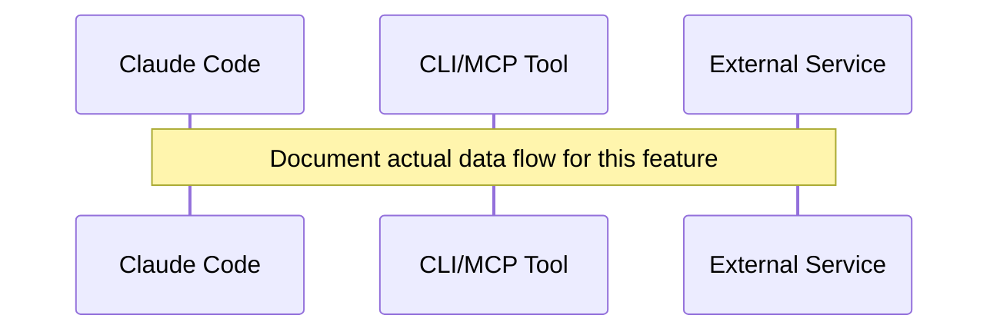

# Design Document Template

---
**Purpose**: Provide sufficient detail to ensure implementation consistency across different implementers, preventing interpretation drift.

**Approach**:
- Include essential sections that directly inform implementation decisions
- Omit optional sections unless critical to preventing implementation errors
- Match detail level to feature complexity
- Use diagrams and tables over lengthy prose

**Warning**: Approaching 1000 lines indicates excessive feature complexity that may require design simplification.
---

> Sections may be reordered (e.g., surfacing Requirements Traceability earlier or moving Data Models nearer Architecture) when it improves clarity. Within each section, keep the flow **Summary → Scope → Decisions → Impacts/Risks** so reviewers can scan consistently.

## Overview 
2-3 paragraphs max
**Purpose**: This feature delivers [specific value] to [target users].
**Users**: [Target user groups] will utilize this for [specific workflows].
**Impact** (if applicable): Changes the current [system state] by [specific modifications].


### Goals
- Primary objective 1
- Primary objective 2  
- Success criteria

### Non-Goals
- Explicitly excluded functionality
- Future considerations outside current scope
- Integration points deferred

## Architecture

> Reference detailed discovery notes in `research.md` only for background; keep design.md self-contained for reviewers by capturing all decisions and contracts here.
> Capture key decisions in text and let diagrams carry structural detail—avoid repeating the same information in prose.

### Existing Architecture Analysis (if applicable)
When modifying existing systems:
- Current architecture patterns and constraints
- Existing domain boundaries to be respected
- Integration points that must be maintained
- Technical debt addressed or worked around

### Architecture Pattern & Boundary Map
**RECOMMENDED**: Include Mermaid diagram showing the chosen architecture pattern and system boundaries (required for complex features, optional for simple additions)

**Architecture Integration**:
- Selected pattern: [name and brief rationale]
- Domain/feature boundaries: [how responsibilities are separated to avoid conflicts]
- Existing patterns preserved: [list key patterns]
- New components rationale: [why each is needed]
- Steering compliance: [principles maintained]

### Technology Stack

| Layer | Choice / Version | Role in Feature | Notes |
|-------|------------------|-----------------|-------|
| Frontend / CLI | | | |
| Backend / Services | | | |
| Data / Storage | | | |
| Messaging / Events | | | |
| Infrastructure / Runtime | | | |

> Keep rationale concise here and, when more depth is required (trade-offs, benchmarks), add a short summary plus pointer to the Supporting References section and `research.md` for raw investigation notes.

### Command Prompt Architecture (Claude Code features only)

_Include this section when the feature involves `.claude/commands/` definitions. Omit for non-Claude Code projects._

**Execution Model** (select ONE):
- [ ] CLI invocation: External process with file-based data exchange
- [ ] MCP tool direct call: Claude Code calls MCP tools via allowed-tools
- [ ] Hybrid: (specify which operations use which model)

**Rationale**: Why this execution model was chosen (e.g., context load, latency, reliability, token efficiency)

**Data Flow**:


> The selected execution model MUST be consistent across all sequence diagrams and component interfaces in this document. See `research.md` for alternative approaches considered.

## System Flows

Provide only the diagrams needed to explain non-trivial flows. Use pure Mermaid syntax. Common patterns:
- Sequence (multi-party interactions)
- Process / state (branching logic or lifecycle)
- Data / event flow (pipelines, async messaging)

Skip this section entirely for simple CRUD changes.
> Describe flow-level decisions (e.g., gating conditions, retries) briefly after the diagram instead of restating each step.

## Requirements Traceability

Map **each acceptance criterion** (not just requirement) to design elements. This ensures no criterion is lost during design-to-implementation transition.

**CRITICAL RULES**:
- Map by **criterion ID** (e.g., `7.1`, `7.2`), not requirement number alone
- Generic references like "全SharedComponents" or "all flows" are **NOT acceptable**
- Each criterion must have **specific component names** listed
- Distinguish between "reuse existing" vs "new implementation" in approach

| Criterion ID | Summary | Components | Implementation Approach |
|--------------|---------|------------|------------------------|
| 1.1 | | | |
| 1.2 | | | |
| 2.1 | | | |

### Coverage Validation Checklist

**MANDATORY before completing design.md**:
- [ ] Every criterion ID from requirements.md appears in the table above
- [ ] Each criterion has specific component names (not generic references)
- [ ] Implementation approach distinguishes "reuse existing" vs "new implementation"
- [ ] User-facing criteria specify concrete UI components (not just "shared components")

> Omit this section only when a single component satisfies a single requirement without cross-cutting concerns.

## Components and Interfaces

Provide a quick reference before diving into per-component details.

- Summaries can be a table or compact list. Example table:
  | Component | Domain/Layer | Intent | Req Coverage | Key Dependencies (P0/P1) | Contracts |
  |-----------|--------------|--------|--------------|--------------------------|-----------|
  | ExampleComponent | UI | Displays XYZ | 1, 2 | GameProvider (P0), MapPanel (P1) | Service, State |
- Only components introducing new boundaries (e.g., logic hooks, external integrations, persistence) require full detail blocks. Simple presentation components can rely on the summary row plus a short Implementation Note.

Group detailed blocks by domain or architectural layer. For each detailed component, list requirement IDs as `2.1, 2.3` (omit “Requirement”). When multiple UI components share the same contract, reference a base interface/props definition instead of duplicating code blocks.

### [Domain / Layer]

#### [Component Name]

| Field | Detail |
|-------|--------|
| Intent | 1-line description of the responsibility |
| Requirements | 2.1, 2.3 |
| Owner / Reviewers | (optional) |

**Responsibilities & Constraints**
- Primary responsibility
- Domain boundary and transaction scope
- Data ownership / invariants

**Dependencies**
- Inbound: Component/service name — purpose (Criticality)
- Outbound: Component/service name — purpose (Criticality)
- External: Service/library — purpose (Criticality)

Summarize external dependency findings here; deeper investigation (API signatures, rate limits, migration notes) lives in `research.md`.

**Contracts**: Service [ ] / API [ ] / Event [ ] / Batch [ ] / State [ ]  ← check only the ones that apply.

##### Service Interface
```typescript
interface [ComponentName]Service {
  methodName(input: InputType): Result<OutputType, ErrorType>;
}
```
- Preconditions:
- Postconditions:
- Invariants:

##### API Contract
| Method | Endpoint | Request | Response | Errors |
|--------|----------|---------|----------|--------|
| POST | /api/resource | CreateRequest | Resource | 400, 409, 500 |

##### Event Contract
- Published events:  
- Subscribed events:  
- Ordering / delivery guarantees:

##### Batch / Job Contract
- Trigger:  
- Input / validation:  
- Output / destination:  
- Idempotency & recovery:

##### State Management
- State model:  
- Persistence & consistency:  
- Concurrency strategy:

**Implementation Notes**
- Integration: 
- Validation: 
- Risks:

## Data Models

Focus on the portions of the data landscape that change with this feature.

### Domain Model
- Aggregates and transactional boundaries
- Entities, value objects, domain events
- Business rules & invariants
- Optional Mermaid diagram for complex relationships

### Logical Data Model

**Structure Definition**:
- Entity relationships and cardinality
- Attributes and their types
- Natural keys and identifiers
- Referential integrity rules

**Consistency & Integrity**:
- Transaction boundaries
- Cascading rules
- Temporal aspects (versioning, audit)

### Physical Data Model
**When to include**: When implementation requires specific storage design decisions

**For Relational Databases**:
- Table definitions with data types
- Primary/foreign keys and constraints
- Indexes and performance optimizations
- Partitioning strategy for scale

**For Document Stores**:
- Collection structures
- Embedding vs referencing decisions
- Sharding key design
- Index definitions

**For Event Stores**:
- Event schema definitions
- Stream aggregation strategies
- Snapshot policies
- Projection definitions

**For Key-Value/Wide-Column Stores**:
- Key design patterns
- Column families or value structures
- TTL and compaction strategies

### Data Contracts & Integration

**API Data Transfer**
- Request/response schemas
- Validation rules
- Serialization format (JSON, Protobuf, etc.)

**Event Schemas**
- Published event structures
- Schema versioning strategy
- Backward/forward compatibility rules

**Cross-Service Data Management**
- Distributed transaction patterns (Saga, 2PC)
- Data synchronization strategies
- Eventual consistency handling

Skip subsections that are not relevant to this feature.

## Error Handling

### Error Strategy
Concrete error handling patterns and recovery mechanisms for each error type.

### Error Categories and Responses
**User Errors** (4xx): Invalid input → field-level validation; Unauthorized → auth guidance; Not found → navigation help
**System Errors** (5xx): Infrastructure failures → graceful degradation; Timeouts → circuit breakers; Exhaustion → rate limiting  
**Business Logic Errors** (422): Rule violations → condition explanations; State conflicts → transition guidance

**Process Flow Visualization** (when complex business logic exists):
Include Mermaid flowchart only for complex error scenarios with business workflows.

### Monitoring
Error tracking, logging, and health monitoring implementation.

## Testing Strategy

### Default sections (adapt names/sections to fit the domain)
- Unit Tests: 3–5 items from core functions/modules (e.g., auth methods, subscription logic)
- Integration Tests: 3–5 cross-component flows (e.g., webhook handling, notifications)
- E2E/UI Tests (if applicable): 3–5 critical user paths (e.g., forms, dashboards)
- Performance/Load (if applicable): 3–4 items (e.g., concurrency, high-volume ops)

## Optional Sections (include when relevant)

### Security Considerations
_Use this section for features handling auth, sensitive data, external integrations, or user permissions. Capture only decisions unique to this feature; defer baseline controls to steering docs._
- Threat modeling, security controls, compliance requirements
- Authentication and authorization patterns
- Data protection and privacy considerations

### Performance & Scalability
_Use this section when performance targets, high load, or scaling concerns exist. Record only feature-specific targets or trade-offs and rely on steering documents for general practices._
- Target metrics and measurement strategies
- Scaling approaches (horizontal/vertical)
- Caching strategies and optimization techniques

### Migration Strategy
Include a Mermaid flowchart showing migration phases when schema/data movement is required.
- Phase breakdown, rollback triggers, validation checkpoints

## Design Decisions

**Purpose**: Record significant architectural decisions with their context and rationale. This section serves as an Architecture Decision Record (ADR) for the feature, ensuring future maintainers understand *why* specific choices were made.

**When to include**: Always include for features with non-trivial design choices. Skip only for simple CRUD or boilerplate changes.

### DD-001: [Decision Title]

| Field | Detail |
|-------|--------|
| Status | Proposed / Accepted / Deprecated / Superseded |
| Context | What problem or situation prompted this decision? |
| Decision | What was decided? |
| Rationale | Why was this option chosen over alternatives? |
| Alternatives Considered | What other options were evaluated? |
| Consequences | What are the trade-offs, risks, or follow-up actions? |

> Add more DD-NNN blocks as needed. Keep each decision focused on a single choice. Reference requirement IDs where applicable.

**Example decisions to document**:
- Architecture pattern selection (e.g., "Why event-driven over request-response?")
- Technology/library choices (e.g., "Why Zustand over Redux?")
- Data model decisions (e.g., "Why denormalize user preferences?")
- Interface design choices (e.g., "Why REST over GraphQL?")
- Trade-off resolutions (e.g., "Why prioritize latency over consistency?")

## Supporting References (Optional)
- Create this section only when keeping the information in the main body would hurt readability (e.g., very long TypeScript definitions, vendor option matrices, exhaustive schema tables). Keep decision-making context in the main sections so the design stays self-contained.
- Link to the supporting references from the main text instead of inlining large snippets.
- Background research notes and comparisons continue to live in `research.md`, but their conclusions must be summarized in the main design.
