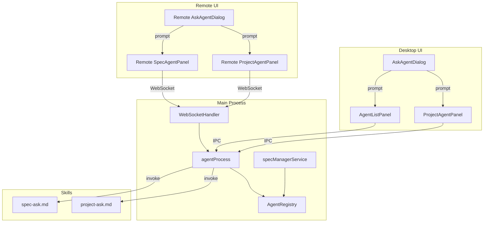
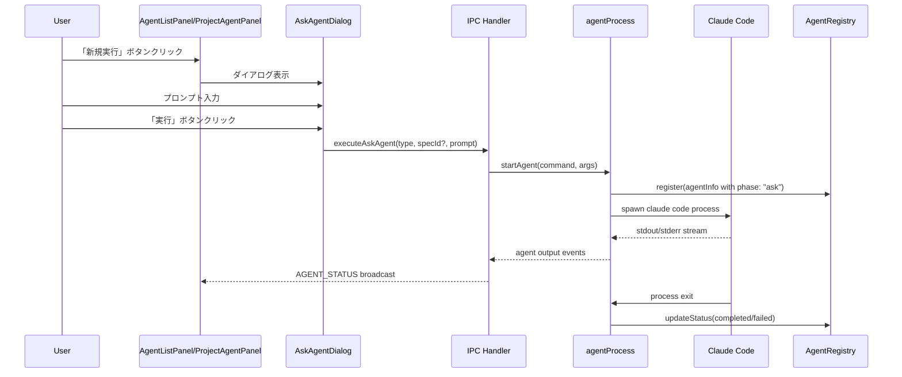
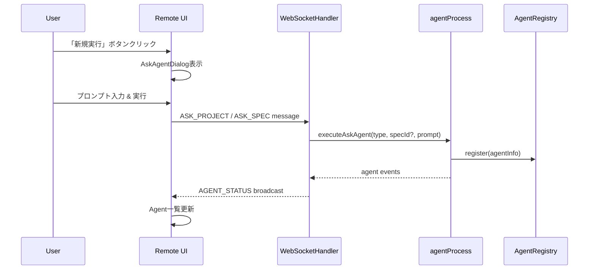

# Technical Design Document

## Overview

**Purpose**: Ask実行機能は、ユーザーが任意のプロンプトでAgentを起動し、プロジェクトまたはSpec固有のコンテキストを付与した状態で質問・指示を実行できる機能を提供する。

**Users**: SDD Orchestratorを使用する開発者が、SDDワークフローの定型フェーズ（requirements/design/tasks/impl）とは別に、自由形式の質問やタスクをAgentに依頼するために使用する。

**Impact**: 既存のAgentListPanel/ProjectAgentPanelにヘッダボタンを追加し、新しいダイアログコンポーネントとSkillコマンドを導入する。WebSocketハンドラを拡張してRemote UIからも同等の操作を可能にする。

### Goals

- ユーザーが任意のプロンプトでProject AgentまたはSpec Agentを起動できる
- Project Agentには Steering files、Spec AgentにはSteering + Spec filesをコンテキストとして付与
- Ask実行のAgentログを既存のAgent一覧に統合表示（phase: "ask"）
- Desktop UIとRemote UIで同等の操作が可能

### Non-Goals

- Agentの自動承認・自動実行機能（askは単発実行のみ）
- プロンプト履歴の永続化
- カスタムコンテキストファイルの選択機能

## Architecture

### Existing Architecture Analysis

本機能は既存のSDD Orchestratorアーキテクチャに統合される拡張機能である。

**既存パターン**:
- `AgentListPanel` / `ProjectAgentPanel`: specId/プロジェクトに紐づくAgent一覧表示
- `AgentRegistry`: Agentの状態管理（register/unregister/updateStatus）
- `WebSocketHandler`: Remote UIとの双方向通信、メッセージルーティング
- Skillコマンド: `.claude/commands/kiro/` 配下のMarkdownファイルで定義

**維持すべき制約**:
- Agent起動はmainプロセスの`agentProcess.ts`経由
- Agentログは既存の`AgentLogPanel`でリアルタイム表示
- Remote UIはWebSocket経由でDesktop UIと同等の機能を提供

### Architecture Pattern & Boundary Map



**Architecture Integration**:
- Selected pattern: 既存のAgent実行パターンを踏襲（IPC/WebSocket → agentProcess → Claude Code）
- Domain boundaries: UI層（Desktop/Remote）、Main Process層、Skills層の3層構造を維持
- Existing patterns preserved: AgentRegistry登録、ログストリーミング、WebSocketブロードキャスト
- New components rationale: AskAgentDialogは新規UIコンポーネントとして追加。Skillコマンドはコンテキスト付与のため必須
- Steering compliance: DRY（既存Agent実行フローを再利用）、SSOT（AgentRegistryで状態一元管理）

### Technology Stack

| Layer | Choice / Version | Role in Feature | Notes |
|-------|------------------|-----------------|-------|
| Frontend | React 19, TypeScript 5.8+ | AskAgentDialogコンポーネント | 既存パターンに従う |
| Remote UI | Vanilla JS | AskAgentDialog相当のUI | 既存components.js拡張 |
| Backend | Electron 35, Node.js 20+ | IPC/WebSocketハンドラ | 既存サービス拡張 |
| State | Zustand | agentStore連携 | 既存store活用 |
| Skills | Claude Code Slash Commands | project-ask, spec-ask | 新規作成 |

## System Flows

### Ask Agent実行フロー（Desktop UI）



### Ask Agent実行フロー（Remote UI）



## Requirements Traceability

| Requirement | Summary | Components | Interfaces | Flows |
|-------------|---------|------------|------------|-------|
| 1.1 | Project Agent一覧ヘッダに「新規実行」ボタン表示 | ProjectAgentPanel | - | Desktop UI |
| 1.2 | Spec Agent一覧ヘッダに「新規実行」ボタン表示（Spec選択時） | AgentListPanel | - | Desktop UI |
| 1.3 | プロジェクト未選択時はProject Agent「新規実行」ボタン無効化 | ProjectAgentPanel | - | Desktop UI |
| 1.4 | Spec未選択時はSpec Agent「新規実行」ボタン非表示 | AgentListPanel | - | Desktop UI |
| 1.5 | 「新規実行」ボタンクリックでAskAgentDialog表示 | AskAgentDialog | - | Desktop UI |
| 2.1 | プロンプト入力テキストエリア表示 | AskAgentDialog | AskAgentDialogProps | Desktop UI |
| 2.2 | 「実行」ボタン表示 | AskAgentDialog | - | Desktop UI |
| 2.3 | 「キャンセル」ボタン表示 | AskAgentDialog | - | Desktop UI |
| 2.4 | プロンプト空時は「実行」ボタン無効化 | AskAgentDialog | - | Desktop UI |
| 2.5 | 「実行」クリックでダイアログ閉じてAgent実行開始 | AskAgentDialog, agentProcess | executeAskAgent | Desktop UI |
| 2.6 | 「キャンセル」クリックでダイアログ閉じる | AskAgentDialog | - | Desktop UI |
| 2.7 | ダイアログにProject/Spec Agent種別表示 | AskAgentDialog | AskAgentDialogProps | Desktop UI |
| 3.1 | `/kiro:project-ask` コマンド提供 | project-ask.md | - | Skill |
| 3.2 | Steering files (`.kiro/steering/*.md`) をコンテキストとして付与 | project-ask.md | - | Skill |
| 3.3 | ユーザープロンプトを引数として受け取る | project-ask.md | - | Skill |
| 3.4 | phase: "ask" でAgentログ記録 | agentProcess | AgentInfo | Skill |
| 4.1 | `/kiro:spec-ask` コマンド提供 | spec-ask.md | - | Skill |
| 4.2 | Steering files をコンテキストとして付与 | spec-ask.md | - | Skill |
| 4.3 | Spec files (`.kiro/specs/{feature}/*.md`) をコンテキストとして付与 | spec-ask.md | - | Skill |
| 4.4 | feature名とプロンプトを引数として受け取る | spec-ask.md | - | Skill |
| 4.5 | phase: "ask" でAgentログ記録 | agentProcess | AgentInfo | Skill |
| 5.1 | Ask Agent起動時にAgentRegistryに登録 | agentProcess, AgentRegistry | AgentInfo | Desktop/Remote |
| 5.2 | Agent一覧でphase: "ask" として表示 | AgentListPanel, ProjectAgentPanel | - | Desktop/Remote |
| 5.3 | AgentLogPanelでリアルタイム出力表示 | AgentLogPanel | - | Desktop/Remote |
| 5.4 | 完了時にAgentステータス更新 | agentProcess, AgentRegistry | - | Desktop/Remote |
| 5.5 | 失敗時にエラー通知表示 | notificationStore | - | Desktop/Remote |
| 5.6 | ログを既存ディレクトリに保存 | agentProcess | - | Desktop/Remote |
| 6.1 | `ask:project` WebSocketハンドラ提供 | WebSocketHandler | AskProjectPayload | Remote UI |
| 6.2 | `ask:spec` WebSocketハンドラ提供 | WebSocketHandler | AskSpecPayload | Remote UI |
| 6.3 | `ask:project` 受信時に `/kiro:project-ask` 実行 | WebSocketHandler | - | Remote UI |
| 6.4 | `ask:spec` 受信時に `/kiro:spec-ask` 実行 | WebSocketHandler | - | Remote UI |
| 6.5 | Agent実行状態をRemote UIクライアントにブロードキャスト | WebSocketHandler | - | Remote UI |
| 7.1 | Remote UIにProject Agent「新規実行」ボタン表示 | Remote SpecDetail | - | Remote UI |
| 7.2 | Remote UIでSpec選択時にSpec Agent「新規実行」ボタン表示 | Remote SpecDetail | - | Remote UI |
| 7.3 | Remote UIで「新規実行」クリック時にAskAgentDialog表示 | Remote AskAgentDialog | - | Remote UI |
| 7.4 | Remote UIで「実行」クリック時にWebSocketリクエスト送信 | Remote AskAgentDialog | - | Remote UI |
| 7.5 | Remote UIでAsk Agent実行状態をAgent一覧に表示 | Remote SpecDetail | - | Remote UI |
| 7.6 | Remote UIでAgentLogPanelにAsk Agent出力をストリーム表示 | Remote LogViewer | - | Remote UI |

## Components and Interfaces

### Component Summary

| Component | Domain/Layer | Intent | Req Coverage | Key Dependencies (P0/P1) | Contracts |
|-----------|--------------|--------|--------------|--------------------------|-----------|
| AskAgentDialog | UI/Desktop | プロンプト入力ダイアログ | 2.1-2.7 | - | State |
| ProjectAgentPanel | UI/Desktop | Project Agent一覧（ヘッダ拡張） | 1.1, 1.3, 1.5 | agentStore (P0) | State |
| AgentListPanel | UI/Desktop | Spec Agent一覧（ヘッダ拡張） | 1.2, 1.4, 1.5 | agentStore (P0) | State |
| project-ask.md | Skills | Project Askスラッシュコマンド | 3.1-3.4 | Steering files (P0) | - |
| spec-ask.md | Skills | Spec Askスラッシュコマンド | 4.1-4.5 | Steering + Spec files (P0) | - |
| WebSocketHandler | Main/Service | Remote UI通信（ハンドラ拡張） | 6.1-6.5 | agentProcess (P0) | Service |
| agentProcess | Main/Service | Agent起動・管理（拡張） | 5.1-5.6 | AgentRegistry (P0) | Service |
| Remote AskAgentDialog | UI/Remote | Remote UI用ダイアログ | 7.3, 7.4 | wsManager (P0) | - |

### UI Layer

#### AskAgentDialog

| Field | Detail |
|-------|--------|
| Intent | ユーザーがAsk Agentに送信するプロンプトを入力するモーダルダイアログ |
| Requirements | 2.1, 2.2, 2.3, 2.4, 2.5, 2.6, 2.7 |

**Responsibilities & Constraints**
- プロンプト入力のテキストエリアを提供
- 入力検証（空文字チェック）
- Project Agent / Spec Agent の種別を視覚的に表示
- 実行/キャンセル操作のコールバック発火

**Dependencies**
- Inbound: ProjectAgentPanel / AgentListPanel から開閉制御 (P0)
- Outbound: なし（コールバック経由で親コンポーネントに通知）

**Contracts**: State [x]

##### State Management

```typescript
interface AskAgentDialogProps {
  /** ダイアログ表示状態 */
  readonly isOpen: boolean;
  /** Agent種別（project or spec） */
  readonly agentType: 'project' | 'spec';
  /** Spec名（spec agentの場合のみ） */
  readonly specName?: string;
  /** 実行コールバック */
  readonly onExecute: (prompt: string) => void;
  /** キャンセルコールバック */
  readonly onCancel: () => void;
}
```

**Implementation Notes**
- Integration: 既存のダイアログパターン（CreateSpecDialog等）に準拠
- Validation: プロンプト空文字時は実行ボタンdisabled
- Risks: なし

#### ProjectAgentPanel (Header Extension)

| Field | Detail |
|-------|--------|
| Intent | Project Agent一覧のヘッダに「新規実行」ボタンを追加 |
| Requirements | 1.1, 1.3, 1.5 |

**Responsibilities & Constraints**
- 既存のProjectAgentPanelヘッダ部分を拡張
- プロジェクト未選択時はボタン無効化
- ボタンクリックでAskAgentDialogを表示

**Dependencies**
- Inbound: projectStore (P0) - currentProject状態
- Outbound: AskAgentDialog表示制御 (P0)
- Outbound: IPC executeAskAgent呼び出し (P0)

**Contracts**: State [x]

**Implementation Notes**
- Integration: 既存ヘッダ構造にPlusアイコンボタンを追加
- Validation: currentProject === null 時はボタンdisabled
- Risks: なし

#### AgentListPanel (Header Extension)

| Field | Detail |
|-------|--------|
| Intent | Spec Agent一覧のヘッダに「新規実行」ボタンを追加 |
| Requirements | 1.2, 1.4, 1.5 |

**Responsibilities & Constraints**
- 既存のAgentListPanelヘッダ部分を拡張
- Spec未選択時はボタン非表示
- ボタンクリックでAskAgentDialogを表示

**Dependencies**
- Inbound: specStore (P0) - selectedSpec状態
- Outbound: AskAgentDialog表示制御 (P0)
- Outbound: IPC executeAskAgent呼び出し (P0)

**Contracts**: State [x]

**Implementation Notes**
- Integration: specId propが空の場合はボタンをレンダリングしない
- Validation: specId存在チェック
- Risks: なし

### Skills Layer

#### project-ask.md

| Field | Detail |
|-------|--------|
| Intent | Steering filesをコンテキストとして読み込み、ユーザープロンプトを実行するSlash Command |
| Requirements | 3.1, 3.2, 3.3, 3.4 |

**Responsibilities & Constraints**
- `.kiro/steering/*.md` を全て読み込みコンテキストとして付与
- ユーザーからのプロンプトを引数として受け取り実行
- Agentログのphaseラベルは "ask" を使用

**Contracts**: なし（Skill定義ファイル）

**Command Structure**:
```markdown
---
description: Execute a custom prompt with project steering context
allowed-tools: Read, Glob, Bash
argument-hint: <prompt>
---

# Project Ask

## Parse Arguments
- Prompt: $ARGUMENTS

## Load Context
Read all steering files:
- .kiro/steering/*.md

## Execute
Process the user prompt with the loaded steering context.
```

**Implementation Notes**
- Integration: 既存の `/kiro:steering` パターンを参考にコンテキスト読み込み
- Validation: プロンプト引数が空の場合はエラーメッセージ
- Risks: なし

#### spec-ask.md

| Field | Detail |
|-------|--------|
| Intent | Steering files + Spec filesをコンテキストとして読み込み、ユーザープロンプトを実行するSlash Command |
| Requirements | 4.1, 4.2, 4.3, 4.4, 4.5 |

**Responsibilities & Constraints**
- `.kiro/steering/*.md` を全て読み込み
- `.kiro/specs/{feature}/*.md` を全て読み込み
- ユーザーからのfeature名とプロンプトを引数として受け取り実行
- Agentログのphaseラベルは "ask" を使用

**Contracts**: なし（Skill定義ファイル）

**Command Structure**:
```markdown
---
description: Execute a custom prompt with spec and steering context
allowed-tools: Read, Glob, Bash
argument-hint: <feature-name> <prompt>
---

# Spec Ask

## Parse Arguments
- Feature: $1
- Prompt: $2 (remaining arguments)

## Validate
Verify spec exists:
- .kiro/specs/$1/ exists

## Load Context
Read all context files:
- .kiro/steering/*.md
- .kiro/specs/$1/*.md

## Execute
Process the user prompt with the loaded context.
```

**Implementation Notes**
- Integration: 既存の `/kiro:spec-requirements` パターンを参考
- Validation: 指定されたspecディレクトリの存在確認
- Risks: なし

### Main Process Layer

#### WebSocketHandler (Extension)

| Field | Detail |
|-------|--------|
| Intent | Remote UIからのAsk実行リクエストを受信し処理 |
| Requirements | 6.1, 6.2, 6.3, 6.4, 6.5 |

**Responsibilities & Constraints**
- `ASK_PROJECT` メッセージタイプのハンドリング
- `ASK_SPEC` メッセージタイプのハンドリング
- 既存のworkflowController経由でAgent起動を委譲
- Agent状態変更をブロードキャスト

**Dependencies**
- Inbound: Remote UIクライアント (P0)
- Outbound: agentProcess (P0)

**Contracts**: Service [x]

##### Service Interface

```typescript
// 既存のWebSocketMessage型を拡張
interface AskProjectPayload {
  readonly prompt: string;
}

interface AskSpecPayload {
  readonly specId: string;
  readonly prompt: string;
}

// routeMessage内で追加するハンドラ
private async handleAskProject(client: ClientInfo, message: WebSocketMessage): Promise<void>;
private async handleAskSpec(client: ClientInfo, message: WebSocketMessage): Promise<void>;
```

- Preconditions: workflowControllerが設定済み
- Postconditions: Agent起動成功時はASK_STARTED、失敗時はERRORレスポンス
- Invariants: 既存のメッセージフォーマットを維持

**Implementation Notes**
- Integration: 既存の `handleExecutePhase` パターンを踏襲
- Validation: prompt空文字チェック、specId存在チェック
- Risks: なし

#### agentProcess (Extension)

| Field | Detail |
|-------|--------|
| Intent | Ask Agent起動時にphase: "ask"でAgentRegistryに登録 |
| Requirements | 5.1, 5.2, 5.4, 5.6 |

**Responsibilities & Constraints**
- Ask Agent起動時のAgentInfo作成（phase: "ask"）
- 既存のAgent起動・監視フローを利用
- ログ保存先は既存ルールに従う

**Dependencies**
- Inbound: IPC handlers, WebSocketHandler (P0)
- Outbound: AgentRegistry (P0), Claude Code process (P0)

**Contracts**: Service [x]

##### Service Interface

```typescript
// 既存のstartAgent関数を利用（phase引数を "ask" として渡す）
interface ExecuteAskAgentParams {
  readonly type: 'project' | 'spec';
  readonly specId?: string;  // specタイプの場合のみ
  readonly prompt: string;
}

// IPC経由で呼び出す新規ハンドラ
async function executeAskAgent(params: ExecuteAskAgentParams): Promise<{
  agentId: string;
  success: boolean;
  error?: string;
}>;
```

- Preconditions: プロジェクトが選択済み、promptが空でない
- Postconditions: AgentRegistryにagent登録済み、Claude Codeプロセス起動済み
- Invariants: 既存のAgent管理フローを維持

**Implementation Notes**
- Integration: 既存の `executePhase` 関数のパターンを踏襲
- Validation: type/specId/promptの整合性チェック
- Log Storage:
  - Spec Ask (type: 'spec'): `.kiro/specs/{specId}/logs/` に保存
  - Project Ask (type: 'project'): `.kiro/logs/` に保存
- Risks: なし

### Remote UI Layer

#### Remote AskAgentDialog

| Field | Detail |
|-------|--------|
| Intent | Remote UI用のプロンプト入力ダイアログ |
| Requirements | 7.3, 7.4 |

**Responsibilities & Constraints**
- Desktop版AskAgentDialogと同等のUI/UX
- WebSocket経由で `ASK_PROJECT` / `ASK_SPEC` メッセージ送信
- 既存のRemote UI components.jsパターンに従う

**Dependencies**
- Inbound: Remote SpecDetailからの表示制御 (P0)
- Outbound: wsManager (P0)

**Implementation Notes**
- Integration: 既存のSpecDetail/BugDetailダイアログパターンを参考
- Validation: Desktop版と同じバリデーションロジック
- Risks: なし

## Data Models

### Domain Model

#### AgentInfo（拡張）

既存の `AgentInfo` 型をそのまま使用。`phase` フィールドに "ask" を設定。

```typescript
// 既存のAgentInfo型（変更なし）
interface AgentInfo {
  readonly agentId: string;
  readonly specId: string;  // project askの場合は空文字
  readonly phase: string;   // "ask" を新たに使用
  readonly pid: number;
  readonly sessionId: string;
  readonly status: AgentStatus;
  readonly startedAt: string;
  readonly lastActivityAt: string;
  readonly command: string;
}
```

**Invariants**:
- Ask Agentの場合、`phase` は必ず "ask"
- Project Ask の場合、`specId` は空文字
- Spec Ask の場合、`specId` はfeature名

### Data Contracts & Integration

#### WebSocket Message Types（追加）

```typescript
// Request: ASK_PROJECT
interface AskProjectMessage extends WebSocketMessage {
  readonly type: 'ASK_PROJECT';
  readonly payload: {
    readonly prompt: string;
  };
}

// Request: ASK_SPEC
interface AskSpecMessage extends WebSocketMessage {
  readonly type: 'ASK_SPEC';
  readonly payload: {
    readonly specId: string;
    readonly prompt: string;
  };
}

// Response: ASK_STARTED
interface AskStartedMessage extends WebSocketMessage {
  readonly type: 'ASK_STARTED';
  readonly payload: {
    readonly agentId: string;
    readonly type: 'project' | 'spec';
    readonly specId?: string;
  };
}
```

## Error Handling

### Error Strategy

既存のエラーハンドリングパターンを踏襲する。

### Error Categories and Responses

**User Errors (4xx)**:
- プロンプト未入力 → ダイアログ内でボタン無効化（事前防止）
- 存在しないSpec指定 → エラー通知 "Spec not found: {specId}"

**System Errors (5xx)**:
- Claude Code起動失敗 → エラー通知 "Failed to start agent"
- プロセスクラッシュ → AgentStatus を "failed" に更新、エラー通知

**Business Logic Errors (422)**:
- プロジェクト未選択でProject Ask試行 → ボタン無効化で事前防止

### Monitoring

既存のAgentログ機構を使用:
- Agent出力は `.kiro/specs/{specId}/logs/` または `.kiro/logs/` に保存
- AgentRegistryでステータス追跡

## Testing Strategy

### Unit Tests

- AskAgentDialog: プロンプト入力、ボタン状態、コールバック発火
- WebSocketHandler.handleAskProject: 正常系/エラー系
- WebSocketHandler.handleAskSpec: 正常系/エラー系
- agentProcess.executeAskAgent: Agent起動、Registry登録

### Integration Tests

- Desktop UI: 「新規実行」→ ダイアログ → Agent実行 → ログ表示
- Remote UI: WebSocket ASK_PROJECT → Agent起動 → ブロードキャスト受信

### E2E Tests

- Desktop: Project Agent新規実行フロー
- Desktop: Spec Agent新規実行フロー（Spec選択状態から）
- Remote: WebSocket経由のAsk実行フロー

## Security Considerations

既存のセキュリティモデルを踏襲:
- Remote UIアクセスはプライベートIP制限
- WebSocket認証トークン（Cloudflare Tunnel経由時）
- contextIsolation/nodeIntegration設定維持
