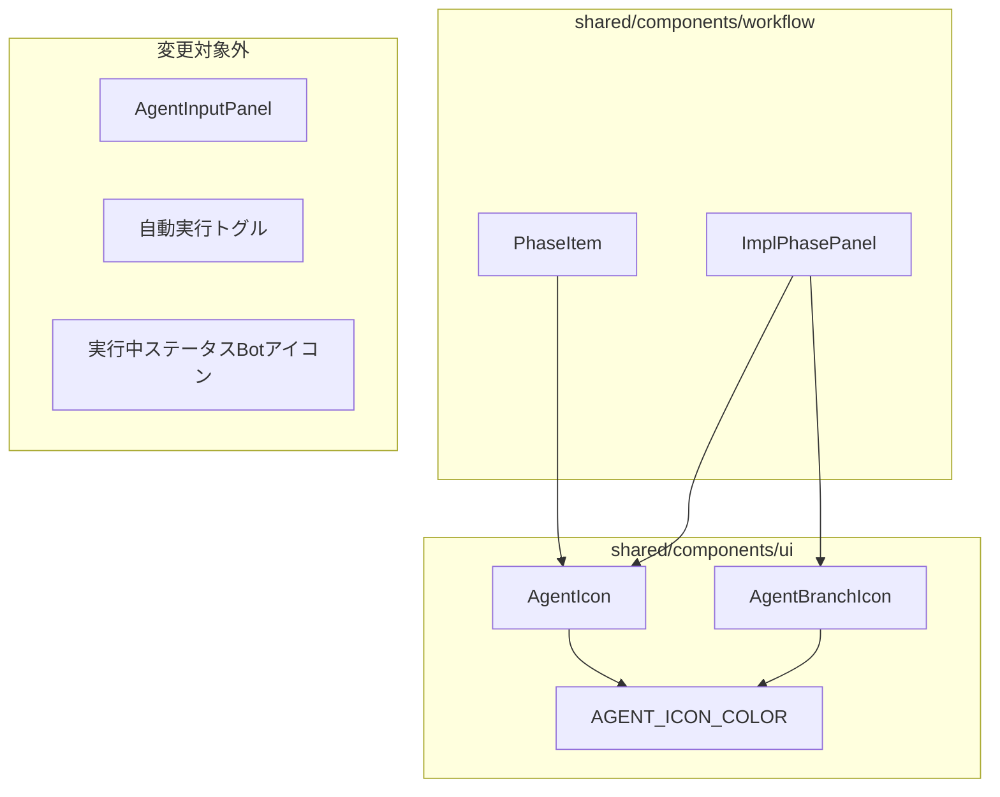

# Design: Agent Button Icon Unification

## Overview

**Purpose**: Agent起動ボタンのアイコンと色を統一し、UIの一貫性を向上させる。現在の`Play`アイコンを`Bot`アイコンに変更することで、ボタンがAgent起動を行うことを視覚的に明示する。

**Users**: SDD Orchestratorを使用する開発者。ワークフロー画面でフェーズ実行ボタンを操作し、Agentを起動する。

**Impact**: PhaseItemコンポーネントとImplPhasePanelコンポーネントのアイコン表示を変更する。既存のボタンレイアウト・サイズは維持され、アイコンと色定数のみが変更される。

### Goals

- Agent起動ボタンを一目で識別可能にする
- 共通アイコンコンポーネントによる将来の一括変更対応
- 既存の変更対象外コンポーネントを誤って変更しない

### Non-Goals

- AgentInputPanelの「続行を指示」ボタンの変更
- 自動実行許可トグル（PlayCircleアイコン）の変更
- 実行中ステータス表示のBotアイコンの変更
- ボタンのサイズ・レイアウトの変更
- ボタンラベル（テキスト）の変更

## Architecture

### Existing Architecture Analysis

現在のAgent起動ボタンは以下の2コンポーネントで実装されている：

| コンポーネント | 場所 | 現状 |
|--------------|------|------|
| `PhaseItem` | `src/shared/components/workflow/PhaseItem.tsx` | `Play`アイコン使用（実行ボタン） |
| `ImplPhasePanel` | `src/shared/components/workflow/ImplPhasePanel.tsx` | 通常モード: `Play`アイコン、Worktreeモード: `GitBranch`アイコン |

**既存の設計パターン**:
- アイコンは各コンポーネント内で直接インポート（`lucide-react`）
- 色はTailwind CSSクラスで直接指定（`bg-blue-500`, `bg-violet-500`等）
- 共通UIコンポーネントは`src/shared/components/ui/`に配置

### Architecture Pattern & Boundary Map



**Architecture Integration**:
- 選択パターン: アイコン部分のみコンポーネント化（KISSの原則）
- ドメイン境界: `ui/`ディレクトリに汎用アイコンコンポーネントを追加
- 既存パターン維持: 色はTailwind CSSクラス、構造は既存と同一
- 新規コンポーネント理由: 色の一元管理と将来の変更容易性
- Steering準拠: DRY、SSOT、KISS原則を遵守
- Remote UI対応: 自動対応（shared配置により、Electron/Remote UI両方で使用可能）

### Technology Stack

| Layer | Choice / Version | Role in Feature | Notes |
|-------|------------------|-----------------|-------|
| Frontend | React 19 + TypeScript | UIコンポーネント | 既存と同一 |
| アイコン | lucide-react | Bot, GitBranchアイコン | 既存ライブラリ使用 |
| スタイリング | Tailwind CSS 4 | 色定義、レイアウト | 既存と同一 |

## Requirements Traceability

| Criterion ID | Summary | Components | Implementation Approach |
|--------------|---------|------------|------------------------|
| 1.1 | PhaseItemの実行ボタンアイコン変更 | PhaseItem, AgentIcon | 既存のPlayアイコンをAgentIconに置換 |
| 1.2 | ImplPhasePanelの通常モードアイコン変更 | ImplPhasePanel, AgentIcon | 既存のPlayアイコンをAgentIconに置換 |
| 1.3 | アイコン色の統一 | AgentIcon, AGENT_ICON_COLOR | 新規色定数による一元管理 |
| 2.1 | Worktreeボタンの2アイコン表示 | ImplPhasePanel, AgentBranchIcon | 新規AgentBranchIconコンポーネント作成 |
| 2.2 | Worktreeボタンの紫色維持 | ImplPhasePanel | 既存のviolet-500を維持 |
| 2.3 | 2アイコンの適切な間隔 | AgentBranchIcon | gap-1でBot+GitBranch配置 |
| 3.1 | AgentIconコンポーネント作成 | AgentIcon | 新規コンポーネント作成 |
| 3.2 | AgentBranchIconコンポーネント作成 | AgentBranchIcon | 新規コンポーネント作成 |
| 3.3 | AGENT_ICON_COLOR定数定義 | AgentIcon.tsx | AgentIcon.tsx内でexport |
| 3.4 | shared/components/ui/配置 | AgentIcon, AgentBranchIcon | ui/ディレクトリに配置 |
| 3.5 | 既存コンポーネントのリファクタリング | PhaseItem, ImplPhasePanel | 新コンポーネント使用に変更 |
| 4.1 | AgentInputPanelは変更しない | AgentInputPanel | 変更対象外（Play+緑色維持） |
| 4.2 | 自動実行トグルは変更しない | PhaseItem, ImplPhasePanel | PlayCircleアイコン維持 |
| 4.3 | 実行中ステータスBotアイコンは変更しない | PhaseItem, ImplPhasePanel | 青色+animate-pulse維持 |

### Coverage Validation Checklist

- [x] Every criterion ID from requirements.md appears in the table above
- [x] Each criterion has specific component names (not generic references)
- [x] Implementation approach distinguishes "reuse existing" vs "new implementation"
- [x] User-facing criteria specify concrete UI components (not just "shared components")

## Components and Interfaces

| Component | Domain/Layer | Intent | Req Coverage | Key Dependencies | Contracts |
|-----------|--------------|--------|--------------|------------------|-----------|
| AgentIcon | UI | 単体Botアイコン表示 | 3.1, 1.1, 1.2, 1.3 | lucide-react (P0) | Props |
| AgentBranchIcon | UI | Bot+GitBranch 2アイコン表示 | 3.2, 2.1, 2.3 | lucide-react (P0) | Props |
| AGENT_ICON_COLOR | Constants | アイコン色定数 | 3.3 | - | 定数 |
| PhaseItem | Workflow | フェーズ実行ボタン | 1.1, 1.3, 3.5 | AgentIcon (P0) | 既存Props維持 |
| ImplPhasePanel | Workflow | 実装フェーズパネル | 1.2, 2.1, 2.2, 3.5 | AgentIcon, AgentBranchIcon (P0) | 既存Props維持 |

### UI Layer

#### AgentIcon

| Field | Detail |
|-------|--------|
| Intent | Agent起動ボタン用のBotアイコンを統一色で表示 |
| Requirements | 3.1, 1.1, 1.2, 1.3 |

**Responsibilities & Constraints**
- Botアイコンを統一色（AGENT_ICON_COLOR）で表示
- サイズは親コンポーネントから指定可能（デフォルト: w-4 h-4）
- アイコンのみを担当し、ボタンラッパーは含まない

**Dependencies**
- Inbound: PhaseItem, ImplPhasePanel - アイコン表示 (P0)
- External: lucide-react - Botアイコン (P0)

**Contracts**: Props

##### Props Interface

```typescript
interface AgentIconProps {
  /** アイコンサイズ（Tailwindクラス） */
  className?: string;
  /** data-testid属性 */
  'data-testid'?: string;
}
```

**Implementation Notes**
- 色はAGENT_ICON_COLORから継承し、classNameでオーバーライド可能
- Botアイコンを直接レンダリング

#### AgentBranchIcon

| Field | Detail |
|-------|--------|
| Intent | Worktreeモード用のBot+GitBranch 2アイコンを表示 |
| Requirements | 3.2, 2.1, 2.3 |

**Responsibilities & Constraints**
- BotアイコンとGitBranchアイコンを並べて表示
- 2アイコン間の間隔はgap-1で固定
- サイズは親コンポーネントから指定可能

**Dependencies**
- Inbound: ImplPhasePanel - Worktreeモードアイコン表示 (P0)
- External: lucide-react - Bot, GitBranchアイコン (P0)

**Contracts**: Props

##### Props Interface

```typescript
interface AgentBranchIconProps {
  /** アイコンサイズ（Tailwindクラス） */
  className?: string;
  /** data-testid属性 */
  'data-testid'?: string;
}
```

**Implementation Notes**
- Flexコンテナでgap-1を適用
- 両アイコンに同一のclassName（サイズ）を適用

### Constants

#### AGENT_ICON_COLOR

| Field | Detail |
|-------|--------|
| Intent | Agentアイコンの統一色を定義 |
| Requirements | 3.3, 1.3 |

**Responsibilities & Constraints**
- Agent起動ボタンアイコンの色を一箇所で管理
- Tailwind CSSクラス形式で定義

**Contracts**: 定数

##### Constant Definition

```typescript
/** Agent起動ボタンアイコンの統一色 */
export const AGENT_ICON_COLOR = 'text-white';
```

**Implementation Notes**
- ボタン背景色（blue-500, violet-500）との対比で白色を採用
- 将来の色変更はこの定数を変更するだけで対応可能
- **配置場所**: `shared/components/ui/AgentIcon.tsx`内でexport（新規ディレクトリ作成不要、コンポーネントとco-location）

### Workflow Layer

#### PhaseItem (既存コンポーネント修正)

| Field | Detail |
|-------|--------|
| Intent | 各フェーズの実行ボタンでAgentIconを使用 |
| Requirements | 1.1, 1.3, 3.5 |

**Responsibilities & Constraints**
- 実行ボタン（pending状態、「実行」ラベル）のアイコンをPlayからAgentIconに変更
- 既存のボタンレイアウト・サイズは維持
- 自動実行トグル（PlayCircle）は変更しない
- 実行中ステータス（Botアイコン、animate-pulse）は変更しない

**Dependencies**
- Inbound: WorkflowView - フェーズ表示 (P0)
- Outbound: AgentIcon - アイコン表示 (P0)

**Contracts**: 既存Props維持

**Implementation Notes**
- 変更箇所: 「実行」ボタン（`status === 'pending'`かつ`!isExecuting`時に表示）内のPlayアイコンをAgentIconに置換
- 変更対象外:
  - 自動実行トグル（`data-testid="auto-permission-toggle"`内のPlayCircle/Banアイコン）
  - 実行中ステータス（`renderProgressIcon()`内の`data-testid="progress-icon-executing"`付きBotアイコン）

#### ImplPhasePanel (既存コンポーネント修正)

| Field | Detail |
|-------|--------|
| Intent | 実装フェーズボタンでAgentIcon/AgentBranchIconを使用 |
| Requirements | 1.2, 2.1, 2.2, 3.5 |

**Responsibilities & Constraints**
- 通常モードボタンのアイコンをPlayからAgentIconに変更
- WorktreeモードボタンのアイコンをGitBranchからAgentBranchIconに変更
- Worktreeモードの紫色（violet-500）は維持
- 自動実行トグル（PlayCircle）は変更しない
- 実行中ステータス（Botアイコン、animate-pulse）は変更しない

**Dependencies**
- Inbound: ImplFlowFrame - 実装フェーズ表示 (P0)
- Outbound: AgentIcon, AgentBranchIcon - アイコン表示 (P0)

**Contracts**: 既存Props維持

**Implementation Notes**
- 変更箇所: 実装開始ボタン（`data-testid="impl-execute-button"`）内のアイコン分岐
  - 通常モード: `data-testid="icon-play"`のPlayアイコンをAgentIconに置換
  - Worktreeモード: `data-testid="icon-git-branch"`のGitBranchアイコンをAgentBranchIconに置換
- 変更対象外:
  - 自動実行トグル（`data-testid="auto-permission-toggle"`内のPlayCircle/Banアイコン）
  - 実行中ステータス（`renderStatusIcon()`内の`data-testid="status-icon-executing"`付きBotアイコン）

## Data Models

本機能はUIコンポーネントの変更のみであり、データモデルの変更は不要。

## Error Handling

本機能はアイコン表示の変更のみであり、エラーハンドリングの追加は不要。既存のコンポーネントのエラーハンドリングを維持する。

## Testing Strategy

### Unit Tests

| テスト対象 | テスト内容 |
|-----------|-----------|
| AgentIcon | Botアイコンがレンダリングされること、classNameが適用されること |
| AgentBranchIcon | Bot+GitBranchがレンダリングされること、gap-1が適用されること |
| PhaseItem | 実行ボタンでAgentIconが表示されること（status=pending時） |
| ImplPhasePanel（通常モード） | AgentIconが表示されること |
| ImplPhasePanel（Worktreeモード） | AgentBranchIconが表示されること |

### 変更対象外のリグレッションテスト

| テスト対象 | テスト内容 |
|-----------|-----------|
| PhaseItem | 自動実行トグルがPlayCircleのままであること |
| PhaseItem | 実行中ステータスがBot+animate-pulseのままであること |
| ImplPhasePanel | 自動実行トグルがPlayCircleのままであること |
| ImplPhasePanel | 実行中ステータスがBot+animate-pulseのままであること |
| AgentInputPanel | 「続行を指示」ボタンがPlay+緑色のままであること |

## Design Decisions

### DD-001: アイコン部分のみのコンポーネント化

| Field | Detail |
|-------|--------|
| Status | Accepted |
| Context | Agent起動ボタンのアイコンと色を統一する方法として、ボタン全体をコンポーネント化するか、アイコン部分のみをコンポーネント化するかの選択 |
| Decision | アイコン部分のみをコンポーネント化する（AgentIcon, AgentBranchIcon） |
| Rationale | ボタンのレイアウト・サイズは使用箇所で異なるため、過度な抽象化を避ける。KISSの原則に従い、色の一括変更という要件に必要十分な範囲でコンポーネント化する |
| Alternatives Considered | 1) ボタン全体のコンポーネント化 - 使用箇所ごとのカスタマイズが困難になる 2) 定数のみ定義 - 各コンポーネントでのアイコン重複が発生 |
| Consequences | 各使用箇所でボタンのスタイリングを維持しつつ、アイコンと色は一元管理できる |

### DD-002: 色定数の定義方法

| Field | Detail |
|-------|--------|
| Status | Accepted |
| Context | アイコン色をどのように定義・管理するか |
| Decision | Tailwind CSSクラス形式の定数（`AGENT_ICON_COLOR = 'text-white'`）として定義 |
| Rationale | 既存のスタイリングパターン（Tailwind CSS）と一貫性を保つ。将来の変更時にクラス名を変更するだけで対応可能 |
| Alternatives Considered | 1) CSS変数（カスタムプロパティ）- ビルド設定の変更が必要 2) Tailwind configのextend - 他の色と混在して管理が複雑化 |
| Consequences | シンプルな実装で要件を満たす。Tailwind CSS 4のネイティブ機能との互換性を維持 |

### DD-003: Worktreeボタンの色維持

| Field | Detail |
|-------|--------|
| Status | Accepted |
| Context | Worktreeモードのボタン色を統一するか、現在の紫色（violet-500）を維持するか |
| Decision | Worktreeモードは紫色（violet-500）を維持する |
| Rationale | Worktreeモードは通常の実装開始と視覚的に区別する必要があり、紫色で差別化を維持。ただしAgent起動であることを明示するためBotアイコンを追加 |
| Alternatives Considered | 1) 青色に統一 - Worktreeモードの識別性が低下 2) 別の色 - 既存のUIパターンとの一貫性が損なわれる |
| Consequences | ユーザーはWorktreeモードを色で識別しつつ、Botアイコンで両モードともAgent起動であることを認識できる。要件2.2を満たす |

### DD-004: 配置場所の選定

| Field | Detail |
|-------|--------|
| Status | Accepted |
| Context | 新規コンポーネントと定数をどこに配置するか |
| Decision | AgentIcon, AgentBranchIconは`shared/components/ui/`に配置、AGENT_ICON_COLORはAgentIcon.tsx内でexport |
| Rationale | 既存のUI共有コンポーネント（Button, Spinner等）と同じディレクトリに配置することで、発見性と一貫性を向上。定数はコンポーネントとco-locationし、新規ディレクトリ作成を回避 |
| Alternatives Considered | 1) workflow/に配置 - ワークフロー以外での再利用が困難 2) shared/constants/に分離 - ディレクトリが存在せず、単一定数のために新規作成は過剰 |
| Consequences | 将来的に他のAgent関連UIでも再利用可能。要件3.4を満たす。定数は使用側でAgentIcon.tsxからimport |

### DD-005: 変更対象外コンポーネントの明確化

| Field | Detail |
|-------|--------|
| Status | Accepted |
| Context | どのボタン/アイコンを変更対象外とするかの明確な基準 |
| Decision | 以下を変更対象外とする: 1) AgentInputPanelの「続行を指示」ボタン 2) 自動実行許可トグル（PlayCircle） 3) 実行中ステータス表示のBotアイコン |
| Rationale | 「続行を指示」は新規Agent起動ではなく既存Agentへの入力送信。自動実行トグルは許可/禁止の状態表示であり実行アクションではない。実行中ステータスは進捗表示であり操作ボタンではない |
| Alternatives Considered | 全てのPlayアイコンを一括変更 - 異なる用途のボタンが混同される |
| Consequences | 各ボタンの用途に応じた適切なアイコン表示を維持。要件4.1, 4.2, 4.3を満たす |
