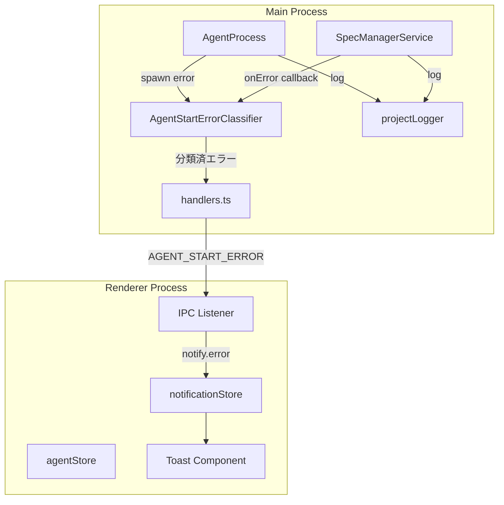
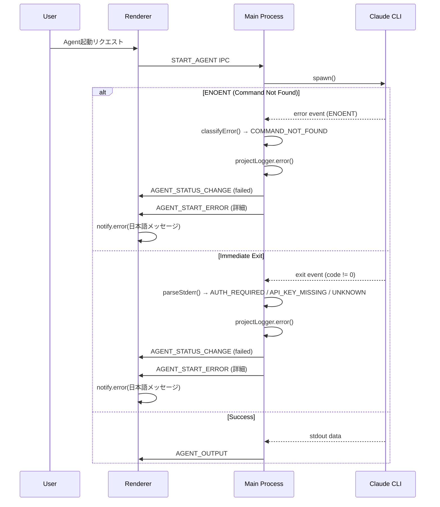

# Design: Agent Error Notification

## Overview

**Purpose**: Agent（Claude CLI等）の起動エラーをユーザーに明確に通知し、デバッグを容易にする機能を提供する。

**Users**: SDD Orchestratorのユーザーは、Agent起動失敗時に具体的なエラーメッセージを受け取り、問題を自己解決できるようになる。開発者は、一貫したログ出力によりデバッグが容易になる。

**Impact**: 既存の`logger.ts`を`projectLogger`に統合し、エラー検出・分類機構を追加、Renderer側でのToast通知を実装する。

### Goals

- `logger.ts`を削除し、全てのMain Processログを`projectLogger`経由に統合
- Agent起動時のエラー（ENOENT、認証エラー等）を検出・分類
- エラー情報をRenderer側にIPC通知し、日本語Toast表示
- 既存の`AGENT_STATUS_CHANGE`通知との共存

### Non-Goals

- Claude CLI以外のLLMエンジン固有エラー検出
- エラー発生後の自動リトライ機能
- エラー履歴の永続化・UI表示
- Remote UI側でのエラー通知（将来対応可能な設計とする）

## Architecture

### Existing Architecture Analysis

**現状の問題点**:
- `logger.ts`と`projectLogger.ts`が併存
- `specManagerService.ts`、`agentProcess.ts`等が旧`logger`を使用
- プロジェクトログ（`{projectPath}/.kiro/logs/main.log`）にログが出力されない

**既存パターン**:
- IPC通信: `channels.ts`でチャンネル定義、`handlers.ts`でハンドラ実装
- エラー通知: `AGENT_EXIT_ERROR`チャンネルが既存パターンとして存在
- Toast通知: `notificationStore.ts`の`notify.error()`を使用

### Architecture Pattern & Boundary Map



**Key Decisions**:
- エラー分類はMain Process側で実施（ErrorClassifierをspecManagerService内に配置）
- 新規IPCチャンネル`AGENT_START_ERROR`を追加（既存`AGENT_STATUS_CHANGE`と併用）
- Toast表示は既存の`notify.error()`パターンを活用

### Technology Stack

| Layer | Choice / Version | Role in Feature | Notes |
|-------|------------------|-----------------|-------|
| Backend / Services | Node.js (Electron 35) | AgentProcess spawn、エラー検出 | 既存パターン継続 |
| Messaging / Events | Electron IPC | Main→Renderer通知 | 新規チャンネル追加 |
| Frontend | React 19 + Zustand | Toast表示、状態管理 | 既存notificationStore活用 |

## System Flows

### Agent Start Error Flow



**Key Decisions**:
- `AGENT_STATUS_CHANGE`と`AGENT_START_ERROR`を両方送信（Requirement 5.2）
- エラー分類はspawn直後のerror/exitイベントで実施
- ログはprojectLogger経由でグローバル・プロジェクト両方に出力

## Requirements Traceability

| Criterion ID | Summary | Components | Implementation Approach |
|--------------|---------|------------|------------------------|
| 1.1 | logger.ts削除後もコンパイルエラーなし | logger.ts, 全importファイル | 既存importを一括置換 |
| 1.2 | specManagerServiceのログがglobal+projectに出力 | specManagerService, projectLogger | import変更 |
| 1.3 | agentProcessのログがglobal+projectに出力 | agentProcess, projectLogger | import変更 |
| 1.4 | プロジェクト未選択時はglobalログのみ | projectLogger | 既存動作（変更不要） |
| 1.5 | 全ファイルのimport更新 | 約60ファイル | 一括置換 |
| 2.1 | ENOENT検出→COMMAND_NOT_FOUND分類 | AgentStartErrorClassifier | 新規実装 |
| 2.2 | 即時exit時のcode/stderr取得 | specManagerService | onExit拡張 |
| 2.3 | "not logged in"検出→AUTH_REQUIRED | AgentStartErrorClassifier | 新規実装 |
| 2.4 | "API key"検出→API_KEY_MISSING | AgentStartErrorClassifier | 新規実装 |
| 2.5 | 未分類エラー→UNKNOWN_ERROR | AgentStartErrorClassifier | 新規実装 |
| 2.6 | AgentStartError型定義 | shared/types | 新規型定義 |
| 3.1 | エラー情報をIPCで送信 | handlers.ts | 新規コールバック |
| 3.2 | AGENT_START_ERRORチャンネル | channels.ts | 新規チャンネル追加 |
| 3.3 | RendererでToast表示 | IpcApiClient, notificationStore | 新規リスナー |
| 3.4 | 日本語ローカライズ | agentStartErrorMessages.ts | 新規メッセージ定義 |
| 3.5 | 8秒auto-dismiss | notificationStore | notify.error()既存動作 |
| 4.1 | ERRORレベルで詳細ログ出力 | specManagerService | 新規ログ出力 |
| 4.2 | global+projectログ両方に出力 | projectLogger | 既存動作（変更不要） |
| 5.1 | statusCallbacksでfailed通知 | specManagerService | 既存動作維持 |
| 5.2 | AGENT_START_ERROR追加通知 | specManagerService, handlers.ts | 新規コールバック |
| 5.3 | Rendererで両通知ハンドリング | agentStore, IpcApiClient | 既存+新規リスナー |

## Components and Interfaces

| Component | Domain/Layer | Intent | Req Coverage | Key Dependencies | Contracts |
|-----------|--------------|--------|--------------|------------------|-----------|
| AgentStartErrorClassifier | Main/Service | エラー検出・分類 | 2.1-2.6 | - | Service |
| agentStartErrorMessages | Shared/Types | 日本語メッセージ定義 | 3.4 | - | - |
| channels.ts拡張 | Main/IPC | 新規チャンネル追加 | 3.2 | - | Event |
| handlers.ts拡張 | Main/IPC | エラー通知コールバック | 3.1, 5.2 | specManagerService (P0) | Event |
| IpcApiClient拡張 | Shared/API | エラーリスナー登録 | 3.3 | notificationStore (P1) | Event |
| logger.ts→projectLogger統合 | Main/Service | ロガー統合 | 1.1-1.5 | projectLogger (P0) | - |

### Main/Service Layer

#### AgentStartErrorClassifier

| Field | Detail |
|-------|--------|
| Intent | spawn/exitイベントからエラー種別を判定し、AgentStartErrorを生成 |
| Requirements | 2.1, 2.2, 2.3, 2.4, 2.5, 2.6 |

**Responsibilities & Constraints**
- Node.js Error（ENOENT等）の判定
- stderr文字列パターンマッチング（認証エラー、APIキーエラー）
- 未知のエラーはUNKNOWN_ERRORとして分類

**Dependencies**
- Inbound: specManagerService — エラー分類リクエスト (P0)

**Contracts**: Service [x]

##### Service Interface

```typescript
// shared/types/agentStartError.ts

type AgentStartErrorType =
  | 'COMMAND_NOT_FOUND'
  | 'AUTH_REQUIRED'
  | 'API_KEY_MISSING'
  | 'SPAWN_ERROR'
  | 'UNKNOWN_ERROR';

interface AgentStartError {
  type: AgentStartErrorType;
  message: string;
  details?: {
    exitCode?: number;
    stderr?: string;
    command?: string;
  };
}

// main/services/agentStartErrorClassifier.ts

interface AgentStartErrorClassifierService {
  /**
   * spawn errorイベントからエラーを分類
   * @param error Node.js Error object
   * @param command 実行コマンド
   */
  classifySpawnError(error: NodeJS.ErrnoException, command: string): AgentStartError;

  /**
   * 即時exit時のstderrからエラーを分類
   * @param exitCode 終了コード
   * @param stderr 標準エラー出力
   * @param command 実行コマンド
   */
  classifyExitError(exitCode: number, stderr: string, command: string): AgentStartError;
}
```

- Preconditions: error/exitイベントが発生していること
- Postconditions: 必ずAgentStartErrorが返される（UNKNOWN_ERRORを含む）
- Invariants: type, messageは必須

**Implementation Notes**
- Integration: specManagerServiceのonError/onExitハンドラから呼び出し
- Validation: stderrパターンマッチは大文字小文字を無視
- Risks: Claude CLIのエラーメッセージ形式変更時にパターン更新が必要

### Shared/Types Layer

#### agentStartErrorMessages (Summary)

日本語エラーメッセージ定義。Requirement 3.4の5種類のメッセージをマップとして提供。

```typescript
// shared/types/agentStartErrorMessages.ts

const AGENT_START_ERROR_MESSAGES: Record<AgentStartErrorType, string> = {
  COMMAND_NOT_FOUND: 'claudeコマンドが見つかりません。インストールを確認してください',
  AUTH_REQUIRED: 'Claude CLIの認証が必要です。`claude login`を実行してください',
  API_KEY_MISSING: 'APIキーが設定されていません',
  SPAWN_ERROR: 'プロセスの起動に失敗しました',
  UNKNOWN_ERROR: 'エージェントの起動に失敗しました',
};

function getAgentStartErrorMessage(error: AgentStartError): string;
```

### Main/IPC Layer

#### channels.ts拡張 (Summary)

新規IPCチャンネル`AGENT_START_ERROR`を追加。

```typescript
// 追加定義
AGENT_START_ERROR: 'ipc:agent-start-error',
```

#### handlers.ts拡張 (Summary)

specManagerServiceに新規コールバック`onAgentStartError`を登録し、エラー発生時にIPC通知。

**Contracts**: Event [x]

##### Event Contract

- Published events: `AGENT_START_ERROR` (Main→Renderer)
- Payload: `{ agentId: string, specId: string, error: AgentStartError }`
- Ordering: `AGENT_STATUS_CHANGE(failed)`の直後に送信

### Shared/API Layer

#### IpcApiClient拡張 (Summary)

`AGENT_START_ERROR`のリスナー登録メソッドを追加。

```typescript
// shared/api/IpcApiClient.ts追加メソッド
onAgentStartError(callback: (agentId: string, specId: string, error: AgentStartError) => void): void;
```

**Implementation Notes**
- Integration: main.tsx初期化時にリスナー登録、notificationStore経由でToast表示
- Risks: Remote UI対応時はWebSocketApiClientにも同様のリスナー追加が必要

## Data Models

### Domain Model

**AgentStartError**: Agentプロセス起動失敗時のエラー情報を表すValue Object。

```typescript
interface AgentStartError {
  type: AgentStartErrorType;  // エラー種別（5種類）
  message: string;            // 英語エラーメッセージ
  details?: {
    exitCode?: number;        // プロセス終了コード
    stderr?: string;          // 標準エラー出力
    command?: string;         // 実行コマンド
  };
}
```

**Business Rules**:
- `type`は必須、5種類のいずれか
- `message`は必須、詳細な英語メッセージ
- `details`はデバッグ用の追加情報

## Error Handling

### Error Strategy

エラー検出・分類・通知を多層で実施し、ユーザーへの通知とデバッグ情報の両立を図る。

### Error Categories and Responses

| Error Type | Detection | User Message | Recovery Action |
|------------|-----------|--------------|-----------------|
| COMMAND_NOT_FOUND | spawn error ENOENT | claudeコマンドが見つかりません | Claude CLI再インストール案内 |
| AUTH_REQUIRED | stderr "not logged in" | Claude CLIの認証が必要です | `claude login`実行案内 |
| API_KEY_MISSING | stderr "API key" | APIキーが設定されていません | APIキー設定案内 |
| SPAWN_ERROR | spawn error (ENOENT以外) | プロセスの起動に失敗しました | エラー詳細をログで確認 |
| UNKNOWN_ERROR | 上記以外 | エージェントの起動に失敗しました | エラー詳細をログで確認 |

### Monitoring

- 全エラーは`projectLogger.error()`でERRORレベルログ出力
- ログには agentId, specId, error type, message, command, exitCode, stderr を含む

## Testing Strategy

### Unit Tests
- AgentStartErrorClassifier: ENOENT→COMMAND_NOT_FOUND分類
- AgentStartErrorClassifier: stderr "not logged in"→AUTH_REQUIRED分類
- AgentStartErrorClassifier: stderr "API key"→API_KEY_MISSING分類
- getAgentStartErrorMessage: 各error typeに対応するメッセージ取得

### Integration Tests
- specManagerService: spawn errorでAGENT_START_ERRORコールバック発火
- IPC: AGENT_START_ERRORチャンネルでRenderer到達
- notificationStore: エラー受信時にToast追加

## Verification Contract

### User Journey Definition

| Journey ID | Operation Flow | Expected Result | E2E Required |
|------------|---------------|-----------------|--------------|
| UJ-001 | claudeコマンド未インストール状態でAgent起動 | 「claudeコマンドが見つかりません」Toast表示、ログ出力 | No |
| UJ-002 | 認証未実行状態でAgent起動 | 「Claude CLIの認証が必要です」Toast表示、ログ出力 | No |
| UJ-003 | 正常状態でAgent起動 | Agentが正常起動、エラーToastなし | Yes |

**Note**: UJ-001, UJ-002はMock Claude CLIでのE2Eテストが困難なため、統合テストで検証。

### Impact Analysis Contract

| Target File | Action | Reason |
|-------------|--------|--------|
| `main/services/logger.ts` | DELETE | projectLoggerに統合のため削除 |
| `main/services/specManagerService.ts` | UPDATE | import変更、onAgentStartErrorコールバック追加 |
| `main/services/agentProcess.ts` | UPDATE | import変更 |
| `main/ipc/channels.ts` | UPDATE | AGENT_START_ERRORチャンネル追加 |
| `main/ipc/handlers.ts` | UPDATE | onAgentStartErrorコールバック登録 |
| `shared/types/agentStartError.ts` | CREATE | AgentStartError型定義 |
| `shared/types/agentStartErrorMessages.ts` | CREATE | 日本語メッセージ定義 |
| `main/services/agentStartErrorClassifier.ts` | CREATE | エラー分類サービス |
| `shared/api/IpcApiClient.ts` | UPDATE | onAgentStartErrorリスナー追加 |
| `renderer/main.tsx` | UPDATE | AGENT_START_ERRORリスナー登録 |
| `main/ipc/*.ts` (約25ファイル) | UPDATE | logger→projectLogger import変更 |
| `main/services/*.ts` (約35ファイル) | UPDATE | logger→projectLogger import変更 |

### Interface Changes & Impact Analysis

| Modified Interface | Change Type | Affected Callers | Update Required |
|--------------------|-------------|------------------|-----------------|
| `logger.ts` exports | DELETE | 約60ファイル | import先をprojectLoggerに変更 |
| `SpecManagerService` | ADD callback | handlers.ts | onAgentStartError登録 |
| `IpcApiClient` | ADD method | renderer/main.tsx | onAgentStartError呼び出し追加 |

**Rule**: logger削除により全Callerのimport更新が必須。

### Integration Test Strategy

**Components**: specManagerService, AgentStartErrorClassifier, handlers.ts, IpcApiClient, notificationStore

**Data Flow**:
1. specManagerService.startAgent() → spawn error発生
2. AgentStartErrorClassifier.classifySpawnError() → AgentStartError生成
3. onAgentStartErrorCallback → IPC送信
4. IpcApiClient listener → notificationStore.notify.error()

**Mock Boundaries**:
- Mock: child_process.spawn (ENOENTエラーを発生させる)
- Real: AgentStartErrorClassifier, IPC通信層

**Verification Points**:
- classifySpawnError戻り値のtype検証
- IPC AGENT_START_ERRORペイロード検証
- notificationStore.notifications配列にエラー追加確認

**Robustness Strategy**:
- IPC通信は非同期だが、テストではPromise完了を待機
- spawn errorは同期的に発生するため、タイミング問題は少ない

**Prerequisites**:
- Mock child_process.spawn用のテストヘルパー（既存パターン流用可能）

## Design Decisions

### DD-001: logger.tsの完全削除とprojectLogger統合

| Field | Detail |
|-------|--------|
| Status | Accepted |
| Context | logger.tsとprojectLogger.tsが併存し、一部ファイルがプロジェクトログに出力されない |
| Decision | logger.tsを削除し、全てのMain ProcessログをprojectLogger経由に統合 |
| Rationale | projectLoggerはグローバルログとプロジェクトログ両方に出力する設計。プロジェクト未選択時はグローバルログのみに出力されるため、logger.tsの機能を包含している |
| Alternatives Considered | (1) logger.tsを維持し、必要な箇所のみprojectLoggerに変更 → 二重管理が継続 (2) 新規ログサービスを作成 → 過剰な変更 |
| Consequences | 約60ファイルのimport変更が必要だが、一括置換で対応可能。今後のログ管理が一元化される |

### DD-002: エラー分類のMain Process実施

| Field | Detail |
|-------|--------|
| Status | Accepted |
| Context | spawn/exitイベントのエラー情報をどこで分類するか |
| Decision | Main Process側（specManagerService内）でエラー分類を実施し、分類済みAgentStartErrorをRendererに送信 |
| Rationale | Node.js Error objectやstderr文字列はMain Process側でのみアクセス可能。Renderer側で分類するには生データをIPC転送する必要があり、非効率 |
| Alternatives Considered | (1) 生エラーデータをRendererに送信し、Renderer側で分類 → IPCペイロード増大、分類ロジック重複 |
| Consequences | Main Process側にAgentStartErrorClassifierを配置。分類ロジックの変更はMain Process側のみで完結 |

### DD-003: AGENT_STATUS_CHANGEとAGENT_START_ERRORの併用

| Field | Detail |
|-------|--------|
| Status | Accepted |
| Context | エラー発生時の通知方法。既存のAGENT_STATUS_CHANGEのみか、新規チャンネルも追加するか |
| Decision | 両方のチャンネルを使用。AGENT_STATUS_CHANGE(failed)で状態更新、AGENT_START_ERRORでToast表示 |
| Rationale | Requirements 5.1, 5.2に準拠。既存のagentStore更新ロジックを維持しつつ、詳細エラー情報を別途送信 |
| Alternatives Considered | (1) AGENT_STATUS_CHANGEのペイロードにエラー詳細を追加 → 既存リスナーへの影響大 (2) AGENT_START_ERRORのみ → 状態管理との不整合 |
| Consequences | Renderer側で2つのリスナーを管理する必要があるが、関心の分離が明確になる |

### DD-004: 日本語メッセージの静的定義

| Field | Detail |
|-------|--------|
| Status | Accepted |
| Context | Toast表示用の日本語メッセージをどう管理するか |
| Decision | agentStartErrorMessages.tsで静的マップとして定義 |
| Rationale | Requirements 3.4で5種類のメッセージが明確に定義されている。i18nライブラリ導入は過剰 |
| Alternatives Considered | (1) i18nライブラリ（react-i18next等）導入 → 本機能の範囲を超える (2) Main Process側でメッセージ生成 → Rendererでのカスタマイズが困難 |
| Consequences | 多言語対応が必要になった場合は、このファイルをi18nシステムに移行可能な設計 |
