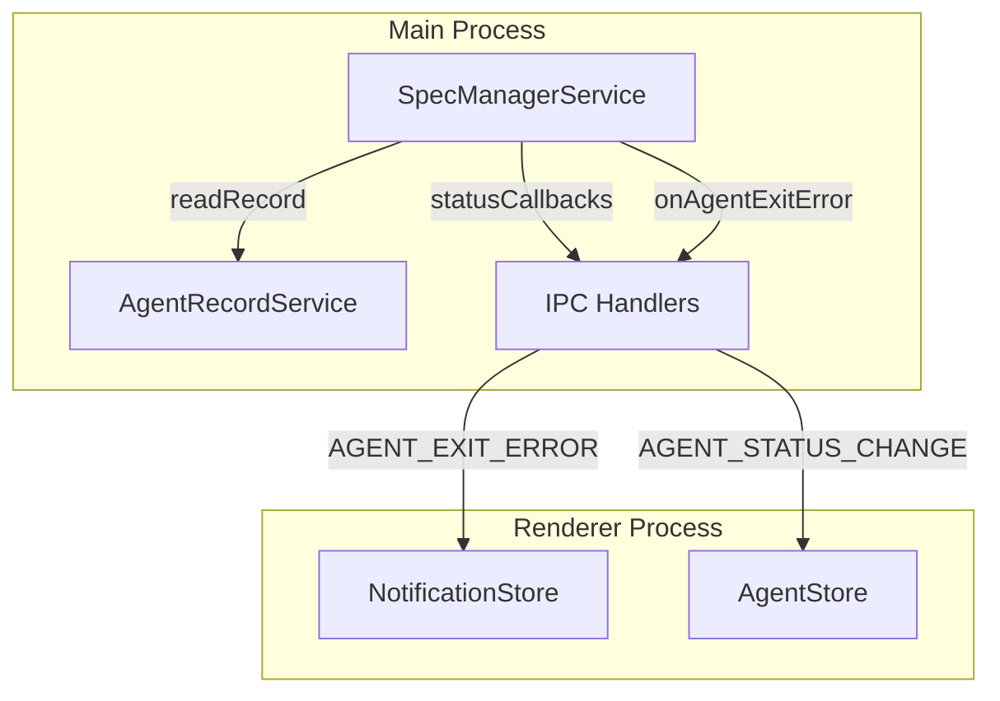
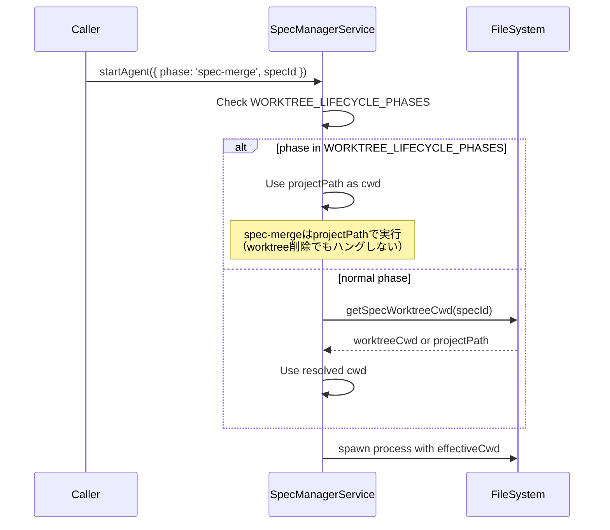
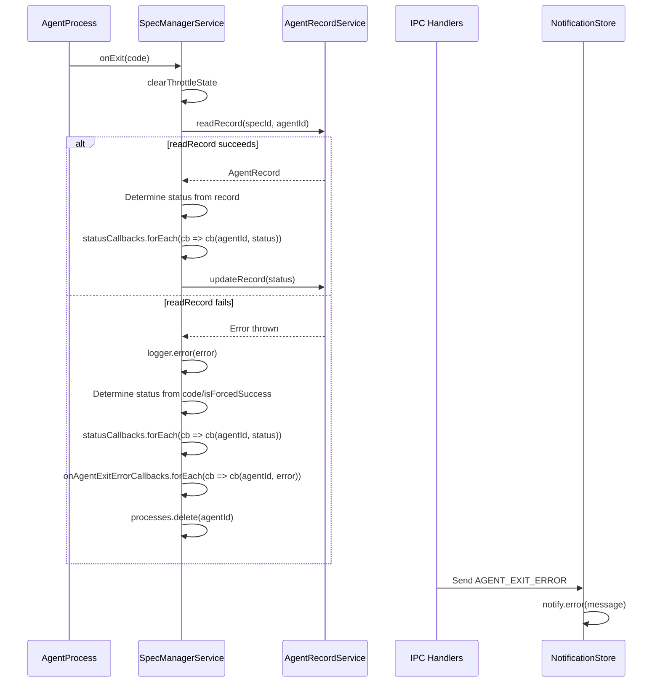

# Design: Agent Exit Robustness

## Overview

**Purpose**: この機能は、Agent終了処理の堅牢性を向上させ、spec-merge実行時のプロセスハングとエラー時のUI更新漏れを防止する。

**Users**: SDD Orchestratorを使用する開発者が、Agent実行時に信頼性の高いステータス表示とエラー通知を受けられるようになる。

**Impact**: SpecManagerServiceのstartAgentメソッドとhandleAgentExitメソッドを修正し、cwd解決ロジックとエラーハンドリングを改善する。

### Goals

- spec-mergeフェーズ実行時に自身のcwdを削除することによるプロセスハングを防止
- handleAgentExitでのエラー発生時もstatusCallbacksを確実に呼び出しUIを更新
- Agent終了処理エラーをユーザーにtoast通知

### Non-Goals

- handleAgentErrorのエラーハンドリング改善（今回はhandleAgentExitのみ）
- Agent recordファイル破損時のリカバリ機構
- Claude CLIハング検知の改善（現状5秒タイムアウト）
- エラー詳細をUIに表示する機能

## Architecture

### Existing Architecture Analysis

**Current Patterns**:
- `SpecManagerService`はエージェントプロセスのライフサイクルを管理
- `startAgent`はcwdを`getSpecWorktreeCwd`で自動解決するが、worktreeを削除するフェーズには未対応
- `handleAgentExit`は`recordService.readRecord`失敗時に`.catch(() => {})`で黙殺

**Technical Debt Addressed**:
- spec-mergeがworktreeCwdで実行されると、プロセスが自身のcwdを削除してハング
- readRecord失敗時にstatusCallbacksが呼ばれず、UIが「実行中」のまま残る

### Architecture Pattern & Boundary Map



**Architecture Integration**:
- Selected pattern: 既存のコールバックパターンを拡張（新規コールバック追加）
- Domain boundaries: SpecManagerServiceがエラーハンドリングの責務を持ち、IPCがRenderer通知を担当
- Existing patterns preserved: statusCallbacks、outputCallbacksパターン
- New components rationale: onAgentExitErrorコールバックでエラー通知を分離
- Steering compliance: SSOT原則（AgentRecordServiceが状態のSSOT）、DRY原則

### Technology Stack

| Layer | Choice / Version | Role in Feature | Notes |
|-------|------------------|-----------------|-------|
| Backend / Services | TypeScript + Node.js | SpecManagerService修正 | 既存スタックを継続 |
| IPC | Electron IPC | エラー通知チャンネル追加 | 新規チャンネル: AGENT_EXIT_ERROR |
| UI | Zustand + React | toast通知表示 | notify.error()を使用 |

## System Flows

### Worktree Lifecycle Phase Detection Flow



### Agent Exit Error Handling Flow



## Requirements Traceability

| Criterion ID | Summary | Components | Implementation Approach |
|--------------|---------|------------|------------------------|
| 1.1 | WORKTREE_LIFECYCLE_PHASES定数定義 | SpecManagerService | New constant |
| 1.2 | startAgentでのWORKTREE_LIFECYCLE_PHASES判定 | SpecManagerService.startAgent | Modify cwd resolution logic |
| 1.3 | 非WORKTREE_LIFECYCLE_PHASESはgetSpecWorktreeCwd使用 | SpecManagerService.startAgent | Existing behavior preserved |
| 1.4 | WORKTREE_LIFECYCLE_PHASESにコメント追加 | SpecManagerService | Documentation |
| 1.5 | cwd解決結果をログ出力 | SpecManagerService.startAgent | Existing log enhanced |
| 2.1 | readRecordエラー時もstatusCallbacks呼び出し | SpecManagerService.handleAgentExit | Error handling restructure |
| 2.2 | エラー時statusをcode/isForcedSuccessで決定 | SpecManagerService.handleAgentExit | New fallback logic |
| 2.3 | エラー時logger.errorでログ記録 | SpecManagerService.handleAgentExit | Add error logging |
| 2.4 | エラー時もprocesses.delete確実実行 | SpecManagerService.handleAgentExit | Move to finally-like block |
| 3.1 | onAgentExitErrorコールバック機構追加 | SpecManagerService | New callback array |
| 3.2 | handleAgentExitエラー時にコールバック呼び出し | SpecManagerService.handleAgentExit | Invoke callbacks |
| 3.3 | handlers.tsでコールバック登録・IPC送信 | handlers.ts | Register callback, send IPC |
| 3.4 | Rendererでエラー受信しtoast表示 | App.tsx or similar | useEffect for IPC listener |
| 3.5 | toast内容は簡潔なメッセージ | NotificationStore | Use notify.error() |

### Coverage Validation Checklist

- [x] Every criterion ID from requirements.md appears in the table above
- [x] Each criterion has specific component names (not generic references)
- [x] Implementation approach distinguishes "reuse existing" vs "new implementation"
- [x] User-facing criteria specify concrete UI components

## Components and Interfaces

| Component | Domain/Layer | Intent | Req Coverage | Key Dependencies | Contracts |
|-----------|--------------|--------|--------------|------------------|-----------|
| SpecManagerService | Main/Services | Agent lifecycle management | 1.1-1.5, 2.1-2.4, 3.1-3.2 | AgentRecordService (P0) | Service |
| handlers.ts | Main/IPC | IPC handler registration | 3.3 | SpecManagerService (P0), BrowserWindow (P0) | Event |
| App.tsx | Renderer/Root | IPC event listener setup | 3.4-3.5 | notify (P0) | Event |
| channels.ts | Main/IPC | IPC channel definitions | 3.3 | None | API |

### Main Process / Services

#### SpecManagerService

| Field | Detail |
|-------|--------|
| Intent | Agent lifecycle management with robust error handling |
| Requirements | 1.1, 1.2, 1.3, 1.4, 1.5, 2.1, 2.2, 2.3, 2.4, 3.1, 3.2 |

**Responsibilities & Constraints**
- Worktree lifecycle phasesの判定とcwd解決
- Agent終了時のエラーハンドリングとコールバック呼び出し
- エラー時も確実にクリーンアップ（processes.delete）

**Dependencies**
- Inbound: handlers.ts — startAgent/stopAgent呼び出し (P0)
- Outbound: AgentRecordService — readRecord/updateRecord (P0)
- Outbound: logger — error logging (P1)

**Contracts**: Service [x] / API [ ] / Event [x] / Batch [ ] / State [ ]

##### Service Interface

```typescript
/**
 * Worktree lifecycle phases - phases that modify worktree existence
 * These phases MUST run in projectPath (not worktreeCwd) because:
 * - They delete/create the worktree directory itself
 * - Running in worktreeCwd would cause the process to hang (cwd deleted)
 */
const WORKTREE_LIFECYCLE_PHASES = ['spec-merge'] as const;

type WorktreeLifecyclePhase = typeof WORKTREE_LIFECYCLE_PHASES[number];

/**
 * Error callback for agent exit errors
 * Called when handleAgentExit encounters an error (e.g., readRecord failure)
 */
type AgentExitErrorCallback = (agentId: string, error: Error) => void;

// Extended SpecManagerService interface
interface SpecManagerService {
  // Existing methods unchanged

  /**
   * Register callback for agent exit errors
   * @param callback - Function called when handleAgentExit encounters an error
   */
  onAgentExitError(callback: AgentExitErrorCallback): void;

  /**
   * Unregister callback for agent exit errors
   * @param callback - Previously registered callback to remove
   */
  offAgentExitError(callback: AgentExitErrorCallback): void;
}
```

- Preconditions: None
- Postconditions: Callback is registered/unregistered in internal array
- Invariants: Callbacks are called in registration order

##### Event Contract

- Published events: Agent exit error events via callback
- Subscribed events: Process exit events from AgentProcess
- Ordering / delivery guarantees: Synchronous callback invocation

**Implementation Notes**
- Integration: WORKTREE_LIFECYCLE_PHASES判定はstartAgentのcwd解決ロジック直前に追加
- Validation: phase文字列がWORKTREE_LIFECYCLE_PHASESに含まれるかを`includes()`で判定
- Risks: 将来worktreeを作成するフェーズが追加された場合、定数に追加が必要

### Main Process / IPC

#### channels.ts

| Field | Detail |
|-------|--------|
| Intent | IPC channel name definitions |
| Requirements | 3.3 |

**Contracts**: API [x]

##### API Contract

```typescript
// New channel for agent exit errors
export const IPC_CHANNELS = {
  // ... existing channels

  /** Agent exit error notification (Main -> Renderer) */
  AGENT_EXIT_ERROR: 'ipc:agent-exit-error',
} as const;
```

#### handlers.ts

| Field | Detail |
|-------|--------|
| Intent | Register onAgentExitError callback and send IPC |
| Requirements | 3.3 |

**Contracts**: Event [x]

**Implementation Notes**
- Integration: SpecManagerService初期化後にonAgentExitErrorを登録
- Validation: windowがdestroyedでないことを確認してからsend

### Renderer

#### App.tsx (or hooks)

| Field | Detail |
|-------|--------|
| Intent | Listen for AGENT_EXIT_ERROR and show toast |
| Requirements | 3.4, 3.5 |

**Contracts**: Event [x]

**Implementation Notes**
- Integration: useEffectでelectronAPI.onAgentExitErrorを登録
- Validation: agentIdが存在することを確認
- Message format: `Agent終了処理でエラーが発生しました: {agentId}`

## Data Models

### Domain Model

本機能では新規のデータモデル追加はない。既存のAgentRecord型を使用。

```typescript
// Existing - no changes
interface AgentRecord {
  agentId: string;
  specId: string;
  phase: string;
  pid: number;
  sessionId: string;
  status: AgentStatus;
  startedAt: string;
  lastActivityAt: string;
  command: string;
  cwd?: string;
}

type AgentStatus = 'running' | 'completed' | 'interrupted' | 'hang' | 'failed';
```

## Error Handling

### Error Strategy

handleAgentExitでのエラーは「フェイルセーフ」アプローチを採用。ファイル操作が失敗しても、UIは必ず更新される。

### Error Categories and Responses

**System Errors (recordService.readRecord failure)**:
- Response: logger.errorでログ、statusCallbacksでUI更新、onAgentExitErrorCallbacksでtoast通知
- Fallback status: code === 0 || isForcedSuccess ? 'completed' : 'failed'

**Process Cleanup**:
- `processes.delete(agentId)`は常に実行（エラー有無に関わらず）
- `forcedKillSuccess.delete(agentId)`も同様
- `sessionIdParseBuffers.delete(agentId)`も同様

### Monitoring

- エラー発生時は`logger.error`でスタックトレースを含めて記録
- toastでユーザーに通知（即時認識可能）

## Testing Strategy

### Unit Tests

1. **WORKTREE_LIFECYCLE_PHASES判定テスト** (`specManagerService.test.ts`)
   - spec-mergeフェーズでprojectPathがcwdとして使用されることを確認
   - 通常フェーズでgetSpecWorktreeCwdが呼ばれることを確認

2. **handleAgentExit エラーハンドリングテスト** (`specManagerService.test.ts`)
   - readRecord成功時の既存動作を確認
   - readRecord失敗時もstatusCallbacksが呼ばれることを確認
   - readRecord失敗時にonAgentExitErrorCallbacksが呼ばれることを確認
   - processes.delete/forcedKillSuccess.deleteが常に実行されることを確認

3. **onAgentExitError コールバック管理テスト** (`specManagerService.test.ts`)
   - コールバック登録/解除が正しく動作することを確認
   - 複数コールバック登録時に全て呼ばれることを確認

### Integration Tests

1. **IPC通信テスト** (`handlers.test.ts`)
   - AGENT_EXIT_ERROR IPCが正しく送信されることを確認
   - window.isDestroyed()チェックが機能することを確認

2. **Renderer受信テスト** (E2E or integration)
   - AGENT_EXIT_ERROR受信時にnotify.errorが呼ばれることを確認

### E2E Tests

1. **spec-merge worktreeモードテスト**
   - worktreeモードでspec-mergeを実行してもプロセスがハングしないことを確認

2. **エラー通知E2Eテスト**
   - Agent終了時にrecordService.readRecordが失敗するシナリオでtoastが表示されることを確認

## Design Decisions

### DD-001: Worktree Lifecycle Phasesのセマンティック分類

| Field | Detail |
|-------|--------|
| Status | Accepted |
| Context | spec-mergeがworktreeCwdで実行されると、自身のcwdを削除しプロセスがハングする |
| Decision | `WORKTREE_LIFECYCLE_PHASES`定数を導入し、worktreeのライフサイクルを変更するフェーズを明示的に分類 |
| Rationale | 例外リスト方式（「このフェーズはprojectPath」）より、セマンティック分類（「worktreeを変更するフェーズ」）の方が意図が明確で将来の拡張に対応しやすい |
| Alternatives Considered | (1) 例外リスト方式: 単純だが「なぜprojectPathなのか」が不明確 (2) フェーズ定義にcwd指定を含める: 大規模な変更が必要 |
| Consequences | 将来worktreeを作成するフェーズ（例: spec-init with worktree）が追加された場合、定数に追加が必要。デフォルトはworktreeCwdなので、設定漏れは安全側（worktreeCwdで実行）に倒れる |

### DD-002: readRecord失敗時のstatus決定ロジック

| Field | Detail |
|-------|--------|
| Status | Accepted |
| Context | readRecordが失敗すると、currentRecord?.status === 'interrupted'のチェックができない |
| Decision | readRecord失敗時は`code === 0 || isForcedSuccess`でstatusを決定（completed or failed） |
| Rationale | `interrupted`はstopAgentで明示的に設定されるため、readRecord失敗時はinterrupted状態でないと推定できる。stopAgentは先にファイルを更新してからkillするため、interrupted状態ならreadRecordは成功するはず |
| Alternatives Considered | (1) 常にfailedとする: 正常終了も失敗扱いになる (2) 新しいstatus 'unknown'を追加: 既存の型定義への影響が大きい |
| Consequences | 稀なケース（stopAgent中にファイル書き込みとreadRecordの両方が失敗）では、interruptedではなくcompletedまたはfailedになる可能性がある |

### DD-003: エラー通知の分離（onAgentExitError）

| Field | Detail |
|-------|--------|
| Status | Accepted |
| Context | handleAgentExitのエラーをUIに通知する必要がある |
| Decision | 新しいコールバック機構`onAgentExitError`を追加し、既存のstatusCallbacksとは別に管理 |
| Rationale | statusCallbacksは正常系のステータス変更用。エラー通知は別の関心事であり、分離することでSingle Responsibility Principleを維持 |
| Alternatives Considered | (1) statusCallbacksに特殊なstatus（'exit-error'）を追加: 既存のAgentStatus型を変更する必要がある (2) IPC直接送信: テスタビリティが低下 |
| Consequences | コールバック登録箇所が増える（handlers.tsでonAgentExitErrorを登録）。ただし、outputCallbacks/statusCallbacksと同じパターンなので理解しやすい |
