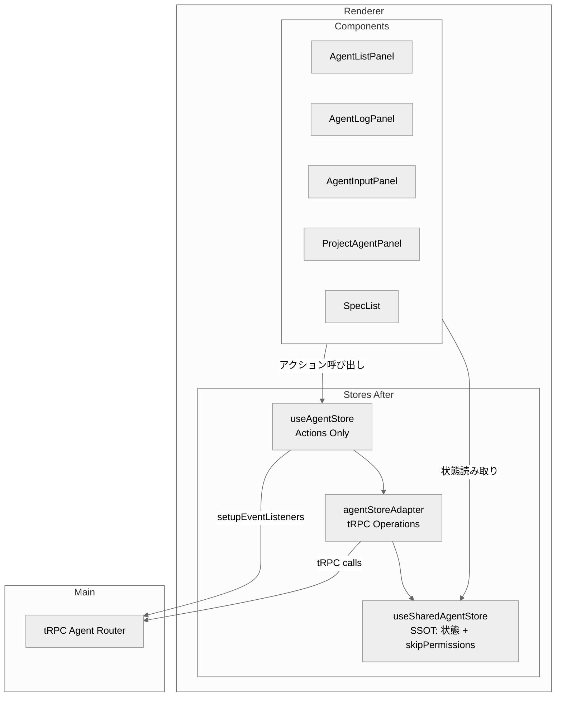
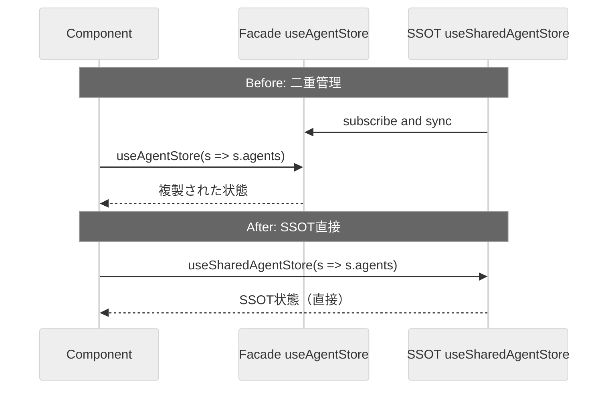
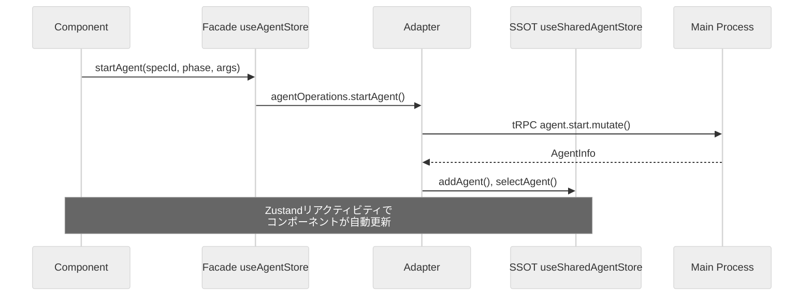
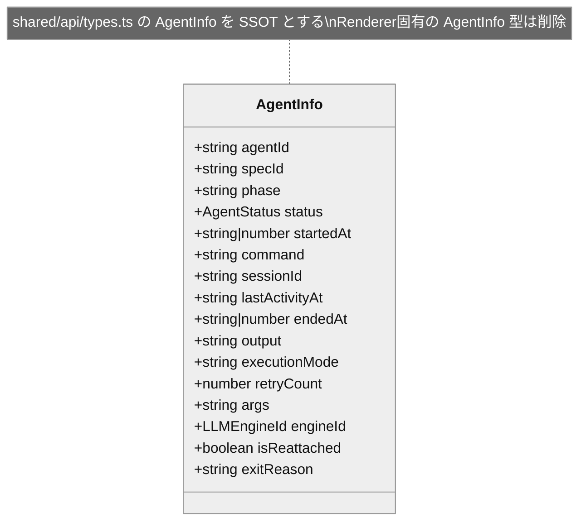

# Design: Agent Facade Action-Only リファクタリング

## Overview

**Purpose**: Rendererのファサードストア（`useAgentStore`）から状態の二重管理を廃止し、アクション専用ストアに変換するリファクタリング。コンポーネントは状態をSSOT（`useSharedAgentStore`）から直接読み取り、アクション（startAgent, stopAgent等）のみファサードを経由する。

**Users**: 開発者が対象。subscribe-and-sync機構に起因する同期遅延・無限ループバグのクラスを根本的に排除し、状態管理の保守性と信頼性を向上させる。

**Impact**: `renderer/stores/agentStore.ts`のファサードストアから状態フィールドとsubscribe-and-sync機構を削除し、4コンポーネントの状態読み取り元を`useSharedAgentStore`に移行する。`SharedAgentInfo`型を拡張して`AgentInfo`型との統一を図る。

### Goals

- ファサードストアの状態フィールド（agents, logs, selectedAgentId, isLoading, error, runningAgentCounts）を全て削除
- subscribe-and-sync機構（`useSharedAgentStore.subscribe()`）を完全に除去
- コンポーネントの状態読み取りをSSOT直接に切り替え
- `SharedAgentInfo`と`AgentInfo`の型統一により変換レイヤーを廃止
- `skipPermissions`をSSOTに移行

### Non-Goals

- Remote UIの`useAgentStore`相当のリファクタリング（Electron Renderer限定）
- ファサードストア自体の完全廃止（アクションの価値は残す）
- SharedAgentStoreの内部実装変更（インターフェース拡張のみ）
- 他のファサードストア（specStore, projectStore等）のリファクタリング

## Architecture

### Existing Architecture Analysis

現在のAgent状態管理は3層構造:

1. **SSOT層**: `shared/stores/agentStore.ts` (`useSharedAgentStore`) -- 全Agent状態の真実の情報源
2. **ファサード層**: `renderer/stores/agentStore.ts` (`useAgentStore`) -- SSOTの状態をsubscribe-and-syncで複製し、アクション（tRPC呼び出し）をラップ
3. **アダプタ層**: `renderer/stores/agentStoreAdapter.ts` -- tRPCバニラクライアント経由のIPC操作をカプセル化

**構造的問題**:
- ファサード層がSSOTの全状態を`subscribe()`で監視・複製しており、状態の二重管理が発生
- `getAgentsFromShared()`による全agents Mapの変換コピーが毎回O(N)で実行される
- 過去にsubscribe-and-sync機構が無限ループバグ・ストリーミング遅延バグを2度引き起こしている

### Architecture Pattern & Boundary Map



**Key Decisions**:
- ファサード層から全状態フィールドを削除し、アクション専用に変換
- コンポーネントは状態を`useSharedAgentStore`から直接セレクタで読み取る
- `SharedAgentInfo`に不足フィールドを追加して型を統一し、変換関数を廃止
- `skipPermissions`は`useSharedAgentStore`に移動してRemote UIとも共有可能に

### Technology Stack

| Layer | Choice / Version | Role in Feature | Notes |
|-------|------------------|-----------------|-------|
| Frontend | React 19 + Zustand | ストア構造変更、セレクタ移行 | 既存パターン踏襲 |
| State Management | Zustand (subscribeWithSelector) | SSOT直接読み取り + アクション専用ファサード | subscribe-and-sync廃止 |
| IPC | tRPC (electron-trpc) | Agent操作のRPC呼び出し | 変更なし |

## System Flows

### 状態読み取りフロー（Before/After）



**Key Decisions**:
- subscribe-and-sync機構を完全に削除することで、同期遅延・無限ループのバグクラスを根本的に排除
- コンポーネントがSSOTを直接参照することで、状態変更の伝播が1段階に短縮される

### アクション実行フロー（変更なし）



**Key Decisions**:
- アクションの実行パスは既存パターンを維持（ファサード -> アダプタ -> tRPC -> SSOT更新）
- ファサードからの明示的な`set()`によるローカル状態更新が不要になる（SSOTの更新がZustandのリアクティビティで直接コンポーネントに伝播）

## Requirements Traceability

| Criterion ID | Summary | Components | Implementation Approach |
|--------------|---------|------------|------------------------|
| 1.1 | agents等の状態フィールド削除 | `useAgentStore` | AgentState interface縮小、state fields削除 |
| 1.2 | subscribe-and-sync削除 | `useAgentStore.setupEventListeners` | unsubscribeShared呼び出しとsubscribe()ブロック全体を削除 |
| 1.3 | 初期化時のgetAgentsFromShared()呼び出し削除 | `useAgentStore` | 初期state定義の簡素化 |
| 1.4 | getAgentsFromShared(), calculateRunningCounts()削除 | `useAgentStore` | ヘルパー関数の削除 |
| 2.1 | selectedAgentIdのSSOT直接読み取り | AgentLogPanel, ProjectAgentPanel, AgentListPanel, AgentInputPanel | `useSharedAgentStore(s => s.selectedAgentId)` |
| 2.2 | agentsのSSOT直接読み取り | AgentLogPanel, ProjectAgentPanel, AgentListPanel, AgentInputPanel | `useSharedAgentStore(s => s.agents)`。AgentInputPanelはagents全走査による導出ロジックを含む（Task 4.3） |
| 2.3 | logsのSSOT直接読み取り | AgentLogPanel | 現在はファサードの`logs`フィールドから読み取っており（AgentLogPanel.tsx L39-42）、`useSharedAgentStore(s => s.logs.get(selectedAgentId))`への移行が必要 |
| 2.4 | skipPermissionsのSSOT直接読み取り | AgentListPanel | `useSharedAgentStore(s => s.skipPermissions)` |
| 2.5 | 移行後のコンポーネント動作維持 | 全対象コンポーネント | E2Eテストで検証 |
| 3.1 | SharedAgentInfoにretryCount追加 | `shared/api/types.ts` | 既に存在（確認のみ） |
| 3.2 | SharedAgentInfoにexecutionMode追加 | `shared/api/types.ts` | 既に存在（確認のみ） |
| 3.3 | Renderer固有AgentInfo型の削除 | `renderer/stores/agentStore.ts` | export interface AgentInfoブロック削除、再export化 |
| 3.4 | toRendererAgentInfo(), toSharedAgentInfo()削除 | `renderer/stores/agentStore.ts`, `agentStoreAdapter.ts` | 変換関数の削除 |
| 3.5 | 全コンポーネントでSharedAgentInfo使用 | 全コンポーネント | import元の変更 |
| 4.1 | useSharedAgentStoreにskipPermissions追加 | `shared/stores/agentStore.ts` | SharedAgentState拡張 |
| 4.2 | useSharedAgentStoreにsetSkipPermissions追加 | `shared/stores/agentStore.ts` | SharedAgentActions拡張 |
| 4.3 | ファサードからskipPermissions削除 | `useAgentStore` | state field削除 |
| 4.4 | AgentListPanelがSSOTからskipPermissions読み取り | AgentListPanel | セレクタ変更 |
| 5.1 | SSOTにgetRunningAgentCount()追加 | `shared/stores/agentStore.ts` | SharedAgentActions拡張 |
| 5.2 | SpecListがSSOTのgetRunningAgentCount()使用 | SpecList | `useRunningAgentCount`フック使用に変更 |
| 5.3 | ファサードからrunningAgentCounts削除 | `useAgentStore` | state fieldとメソッド削除 |
| 6.1 | アクションがファサードに残る | `useAgentStore` | setupEventListeners, startAgent, stopAgent等を維持 |
| 6.2 | アクション内部でSSOTメソッド呼び出し | `useAgentStore` | 既存パターン維持（SSOT状態更新はアダプタ経由） |
| 6.3 | setupEventListeners()のtRPC初期化維持 | `useAgentStore` | 変更なし（subscribe-and-sync部分のみ削除） |
| 7.1 | agentStore.test.ts更新 | `renderer/stores/agentStore.test.ts` | アクション専用テストに書き換え |
| 7.2 | コンポーネントテストのモック更新 | 各コンポーネントテスト | useSharedAgentStoreモックの追加 |
| 7.3 | 全テストパス | 全テスト | CI検証 |
| 7.4 | 共有ストアテスト拡張 | `shared/stores/agentStore.test.ts` | skipPermissions, getRunningAgentCountテスト追加 |

### Coverage Validation Checklist

- [x] 全criterion IDがトレーサビリティテーブルに含まれている
- [x] 各criterionに具体的なコンポーネント名が記載されている
- [x] implementation approachが「既存再利用」と「新規実装」を区別している
- [x] ユーザー向けcriteriaに具体的なUIコンポーネントが指定されている

## Components and Interfaces

| Component | Domain/Layer | Intent | Req Coverage | Key Dependencies | Contracts |
|-----------|--------------|--------|--------------|------------------|-----------|
| useSharedAgentStore | shared/stores | Agent状態SSOT（拡張） | 4.1, 4.2, 5.1 | ApiClient (P0) | State |
| useAgentStore | renderer/stores | アクション専用ファサード | 1.1-1.4, 6.1-6.3 | useSharedAgentStore (P0), agentStoreAdapter (P0) | State |
| AgentListPanel | renderer/components | Agent一覧表示 | 2.1, 2.2, 2.4 | useSharedAgentStore (P0), useAgentStore (P1) | Summary |
| AgentLogPanel | renderer/components | Agentログ表示 | 2.1, 2.2, 2.3 | useSharedAgentStore (P0), useAgentStore (P1) | Summary |
| AgentInputPanel | renderer/components | Agent入力 | 2.1, 2.2 | useSharedAgentStore (P0), useAgentStore (P1) | Summary |
| ProjectAgentPanel | renderer/components | プロジェクトAgent管理 | 2.1, 2.2 | useSharedAgentStore (P0), useAgentStore (P1) | Summary |
| SpecList | renderer/components | Spec一覧（runningCount表示） | 5.2 | useRunningAgentCount (P0) | Summary |
| AgentInfo type | shared/api/types | 統一Agent情報型 | 3.1-3.5 | - | - |

### shared/stores

#### useSharedAgentStore（拡張）

| Field | Detail |
|-------|--------|
| Intent | Agent状態のSSOTとして、skipPermissionsフィールドとgetRunningAgentCount()メソッドを追加する |
| Requirements | 4.1, 4.2, 5.1 |

**Responsibilities & Constraints**
- 全Agent状態の唯一の情報源としてElectron/Remote UI双方で使用される
- `skipPermissions`はプロジェクト単位の設定状態
- `getRunningAgentCount()`は既存の`getAgentById()`と同様のパターンでヘルパーメソッドを提供

**Dependencies**
- Inbound: コンポーネント群、ファサードストア -- 状態読み取り・更新 (P0)
- Outbound: ApiClient -- ログ読み込み (P1)

**Contracts**: State [x]

##### State Management

```typescript
// SharedAgentState への追加フィールド
interface SharedAgentStateExtension {
  skipPermissions: boolean;
}

// SharedAgentActions への追加メソッド
interface SharedAgentActionsExtension {
  setSkipPermissions(value: boolean): void;
  getRunningAgentCount(specId: string): number;
}
```

- Preconditions: なし（初期値`false`でゼロ状態動作可能）
- Postconditions: `setSkipPermissions`呼び出し後、即座に全サブスクライバに変更が通知される
- Invariants: `getRunningAgentCount(specId)`は`agents.get(specId)`のrunning状態のAgentをカウントした値を返す

#### renderer/stores - useAgentStore（リファクタリング）

| Field | Detail |
|-------|--------|
| Intent | 状態フィールドとsubscribe-and-sync機構を完全に削除し、アクション専用ストアに変換する |
| Requirements | 1.1, 1.2, 1.3, 1.4, 6.1, 6.2, 6.3 |

**Responsibilities & Constraints**
- tRPCアダプタ経由のAgent操作（start, stop, resume等）のラッピング
- setupEventListeners()によるtRPC Subscription登録とイベントハンドリング
- 状態の保持・複製は行わない

**Dependencies**
- Inbound: コンポーネント群 -- アクション呼び出し (P0)
- Outbound: agentStoreAdapter -- tRPC操作 (P0)
- Outbound: useSharedAgentStore -- SSOT状態更新 (P0)

**Contracts**: State [x]

##### State Management

```typescript
// リファクタリング後のファサード型
interface AgentActionStore {
  // アクション専用: 状態フィールドなし
  setupEventListeners(): () => void;
  startAgent(specId: string, phase: string, args: string[], group?: 'doc' | 'impl', sessionId?: string, engineId?: LLMEngineId): Promise<string | null>;
  stopAgent(agentId: string): Promise<void>;
  resumeAgent(agentId: string, prompt?: string): Promise<void>;
  removeAgent(agentId: string): Promise<void>;
  sendInput(agentId: string, input: string): Promise<void>;
  selectAgent(agentId: string | null): Promise<void>;
  addAgent(specId: string, agent: AgentInfo): void;
  loadAgents(): Promise<void>;
  clearLogs(agentId: string): void;
  ensureLogsLoaded(agentId: string): Promise<void>;
  selectForProjectAgents(): void;
  getAgentById(agentId: string): AgentInfo | undefined;
  updateAgentStatus(agentId: string, status: AgentStatus): void;
  appendLog(agentId: string, entry: ParsedLogEntry): void;
  getLogsForAgent(agentId: string): ParsedLogEntry[];
  getSelectedAgent(): AgentInfo | undefined;
  findAgentById(agentId: string | null): AgentInfo | undefined;
  clearError(): void;

  // skipPermissions操作はSSOTに委譲
  setSkipPermissions(enabled: boolean): void;
  loadSkipPermissions(projectPath: string): Promise<void>;
  // loadAgentLogs: ensureLogsLoadedに委譲しており機能的に重複するため削除候補
}
```

- Preconditions: `useSharedAgentStore`が初期化済みであること
- Postconditions: アクション実行後、SSOTの状態が更新される（ファサード内部に状態を保持しない）
- Invariants: ファサードは状態フィールドを持たない。全ての状態読み取りはSSOT経由で行う

**Implementation Notes**
- Integration: `setupEventListeners()`内のsubscribe-and-sync部分のみ削除。tRPC Subscriptionリスナーは維持
- Validation: アクション呼び出し後の`set()`呼び出しは、ローカル状態更新が不要になるため大幅に削減される
- Risks: subscribe-and-sync削除後、ファサード経由で状態を読んでいる箇所が残存するとランタイムエラーになる。コンパイル時に型エラーで検出可能
- 状態読み取り委譲メソッド（`getAgentById`, `getSelectedAgent`, `findAgentById`, `getLogsForAgent`）は全てSSOT委譲ラッパーとしてファサードに残す。これらは`useSharedAgentStore.getState()`への単純な委譲であり、状態読み取りメソッドだが、既存の呼び出しパターン（アクション内部やコールバック等の非コンポーネントコンテキスト）との互換性のためファサードのインターフェースに含める。コンポーネントからの状態読み取りはSSOTセレクタ経由を推奨するが、命令的なコンテキスト（イベントハンドラ内のスナップショット取得等）ではファサード委譲メソッドの使用を許容する

### コンポーネント群（Summary）

**AgentListPanel**, **AgentLogPanel**, **AgentInputPanel**, **ProjectAgentPanel**: 状態読み取り元を`useAgentStore`から`useSharedAgentStore`に変更。アクション呼び出し（stopAgent, selectAgent等）は引き続き`useAgentStore`を使用。`AgentInfo`型のimport元を`shared/api/types`に変更。

**AgentInputPanel agents全走査パターンの移行方針**:
現在のAgentInputPanel.tsx L21-28のコードは`state.agents.values()`を全走査して`selectedAgentId`に一致するagentを導出する。SSOT移行時は`useSharedAgentStore`のセレクタ内で同じ走査パターンを使用する（読み取り元のみ変更、ロジックは維持）:
```typescript
const agent = useSharedAgentStore((state) => {
  if (!state.selectedAgentId) return undefined;
  for (const agentList of state.agents.values()) {
    const found = agentList.find((a) => a.agentId === state.selectedAgentId);
    if (found) return found;
  }
  return undefined;
});
```

**AgentLogPanel ログ読み取り移行パターン**:
現在のファサード経由のログ読み取り（`useAgentStore(s => s.logs.get(s.selectedAgentId))`）をSSOT直接読み取りに移行する:
```typescript
// 移行後のパターン
const selectedAgentId = useSharedAgentStore(s => s.selectedAgentId);
const rawLogs = useSharedAgentStore(s => {
  if (!selectedAgentId) return EMPTY_LOGS;
  return s.logs.get(selectedAgentId) || EMPTY_LOGS;
});
```

**AgentListPanel `agents` Map読み取りの整理**:
現在の`agents` Map全体の購読（`useShallow`経由）は`agents.size === 0`のloadチェックにのみ使用されており、実際のAgent表示は`useAgentsBySpec(specId)`フック経由。SSOT移行時にこの冗長な読み取りを`isLoading`チェックや`agents.size`セレクタに最適化する。

**SpecList**: `useAgentStore(s => s.getRunningAgentCount)`を`useRunningAgentCount`フック（既存、`shared/hooks/useAgentsBySpec.ts`）に置き換え。

## Data Models

### Domain Model

#### AgentInfo型統一



**Key Decisions**:
- `shared/api/types.ts`の`AgentInfo`が既に`retryCount`と`executionMode`を持っている（requirements.mdのDecision Logで確認済み）
- Renderer固有の`AgentInfo`は`startedAt`を`string`のみに制限し、`sessionId`を必須にしている等の差異があるが、SharedAgentInfoの柔軟な定義（`string | number`, optional）を採用する
- `toRendererAgentInfo()`で行っていた`startedAt`の型変換（number -> ISO string）は、コンポーネント側で必要に応じて実施する

### Logical Data Model

**SharedAgentStore State拡張**:

| フィールド | 型 | 追加/既存 | 説明 |
|-----------|-----|----------|------|
| agents | `Map<string, AgentInfo[]>` | 既存 | Agent一覧 |
| selectedAgentId | `string | null` | 既存 | 選択中AgentID |
| selectedAgentIdBySpec | `Map<string, string | null>` | 既存 | Spec単位の選択状態 |
| logs | `Map<string, ParsedLogEntry[]>` | 既存 | Agent別ログ |
| isLoading | `boolean` | 既存 | 読み込み中フラグ |
| error | `string | null` | 既存 | エラーメッセージ |
| **skipPermissions** | `boolean` | **新規** | --dangerously-skip-permissionsフラグ |

## Error Handling

### Error Strategy

リファクタリング後のエラーハンドリングは既存パターンを踏襲する。ファサードのアクション内でのtRPCエラーキャッチは維持するが、エラー状態の保持先がファサード内部からSSOTに変更される。

- `startAgent`等のアクション失敗時: `useSharedAgentStore`の`error`フィールドに設定
- コンポーネント: `useSharedAgentStore(s => s.error)`で直接読み取り

## Testing Strategy

### Unit Tests

- `shared/stores/agentStore.test.ts`: `skipPermissions`の初期値・`setSkipPermissions`の動作・`getRunningAgentCount()`の計算ロジック
- `renderer/stores/agentStore.test.ts`: アクション専用に書き換え -- 各アクション（startAgent, stopAgent等）がSSOTを正しく更新するか
- `renderer/stores/agentStoreAdapter.test.ts`: 既存テストの変換関数テスト削除（`toSharedAgentInfo`テスト不要化）

### Integration Tests

- AgentListPanel: `useSharedAgentStore`の`skipPermissions`と`agents`を直接セットし、表示と操作を検証
- AgentLogPanel: `useSharedAgentStore`の`selectedAgentId`と`logs`を直接セットし、ログ表示を検証
- SpecList: `useSharedAgentStore`のagentsにrunningステータスのAgentを追加し、`useRunningAgentCount`経由でカウントが正しく表示されるか検証

### E2E Tests

- 既存のAgent操作E2Eテスト（起動・停止・ログ表示）が変更なくパスすることを確認
- subscribe-and-sync廃止後の状態反映速度の改善を視覚的に確認（手動テスト）

## Design Decisions

### DD-001: ファサードをアクション専用に変換（状態廃止）

| Field | Detail |
|-------|--------|
| Status | Accepted |
| Context | ファサードのsubscribe-and-sync機構が無限ループバグ・ストリーミング遅延バグを2度引き起こした。状態の二重管理が根本原因 |
| Decision | ファサードから全状態フィールドとsubscribe-and-sync機構を削除し、アクション専用ストアに変換する |
| Rationale | ファサードはtRPCアダプタ経由のアクション（startAgent等）とイベントリスナー登録に実質的な価値がある。状態複製は不要であり、コンポーネントがSSOTを直接読めば同期遅延は発生しない |
| Alternatives Considered | (1) ファサード完全廃止: アクションの散逸が発生し、コンポーネントが直接アダプタを呼ぶことになる。(2) subscribe-and-sync機構の修正: 過去2度失敗しており、構造的欠陥を修正するのではなく排除すべき |
| Consequences | コンポーネントのimport元が2箇所（状態: SSOT, アクション: ファサード）に分かれるが、関心の分離として適切 |

### DD-002: SharedAgentInfo型をSSOTとして統一

| Field | Detail |
|-------|--------|
| Status | Accepted |
| Context | Renderer固有の`AgentInfo`型と`SharedAgentInfo`型が並存し、`toRendererAgentInfo()`/`toSharedAgentInfo()`の変換レイヤーが存在する。両型の差異は`startedAt`の型制約（string vs string|number）とフィールドのoptional/required差分のみ |
| Decision | `shared/api/types.ts`の`AgentInfo`をSSOTとし、Renderer固有の`AgentInfo`型と変換関数を削除する。型名は`AgentInfo`のまま維持（SharedAgentInfoからのリネームはしない） |
| Rationale | 変換層はDRY違反であり、パフォーマンスコスト（毎回のMap変換）も発生している。`shared/api/types.ts`の型は既に`retryCount`・`executionMode`を含んでおり、追加フィールドは不要 |
| Alternatives Considered | (1) SharedAgentInfoをAgentInfoにリネーム: 影響範囲が広すぎる。shared/api/types.tsでは既に`AgentInfo`として定義されている。(2) 両型を残して変換を最適化: 根本解決にならない |
| Consequences | `startedAt`が`string | number`になるため、ISO文字列前提のコードは型ガードが必要。既存コンポーネントの型エラーはコンパイル時に検出可能 |

### DD-003: skipPermissionsのSSOT移行

| Field | Detail |
|-------|--------|
| Status | Accepted |
| Context | `skipPermissions`はRenderer固有のUI状態としてファサードに保持されていたが、Remote UIでも共有可能になるべき状態 |
| Decision | `useSharedAgentStore`に`skipPermissions: boolean`と`setSkipPermissions()`を追加し、ファサードから削除 |
| Rationale | SSOT原則に従い一箇所管理を実現。Requirement 4のDecision Logでも合意済み |
| Alternatives Considered | カスタムフック化: ストア外での状態管理はZustandパターンに反する |
| Consequences | `setSkipPermissions`内でのプロジェクト設定永続化ロジック（tRPC呼び出し）は、ファサードのアクションとして残す（SSOTはインメモリ状態のみを管理） |

### DD-004: getRunningAgentCount()のSSOT配置

| Field | Detail |
|-------|--------|
| Status | Accepted |
| Context | 実行中Agent数の計算がファサード内の`runningAgentCounts` Mapで管理されている |
| Decision | `useSharedAgentStore`に`getRunningAgentCount(specId)`メソッドを追加。コンポーネントは既存の`useRunningAgentCount`フック（`shared/hooks/useAgentsBySpec.ts`）を使用 |
| Rationale | 既にSSOTに`getAgentById()`等のヘルパーがあるパターンと一貫する。`useRunningAgentCount`フックが既に存在し、SSOTから直接計算している |
| Alternatives Considered | ファサード内のキャッシュMap維持: subscribe-and-sync廃止後はキャッシュ更新機構が失われるため不適切 |
| Consequences | `SpecList`コンポーネントは`useRunningAgentCount`フック（既存）を使うだけで済む。ファサードの`loadRunningAgentCounts()`と`runningAgentCounts` Mapは削除可能 |

### DD-005: ファサードストアのファイル名維持

| Field | Detail |
|-------|--------|
| Status | Accepted |
| Context | Requirements Open Questionで、ファサードのファイル名を`agentActions.ts`等に変更するかが検討された |
| Decision | ファイル名は`agentStore.ts`のまま維持する |
| Rationale | 37ファイルがimportしており、ファイル名変更の影響範囲が大きい。機能的にはZustand storeのままであり、名前の齟齬は許容範囲。ファイル先頭のJSDocコメントで「Action-Only Store」と明記する |
| Alternatives Considered | `agentActions.ts`にリネーム: import変更37件発生。barrel exportで吸収可能だが、不要な作業 |
| Consequences | 今後「agentStore」がアクション専用であることを認識する必要がある。JSDocと命名で意図を明確化 |

## Integration & Deprecation Strategy

### 変更が必要な既存ファイル（Wiring Points）

| ファイル | 変更内容 |
|---------|----------|
| `src/shared/stores/agentStore.ts` | `skipPermissions`フィールド、`setSkipPermissions()`、`getRunningAgentCount()`追加 |
| `src/renderer/stores/agentStore.ts` | 状態フィールド削除、subscribe-and-sync削除、変換関数削除、AgentInfo型export変更 |
| `src/renderer/stores/agentStoreAdapter.ts` | `toSharedAgentInfo()`/`RendererAgentInfo`型の削除（SharedAgentInfoを直接使用） |
| `src/renderer/stores/index.ts` | `AgentInfo`型re-exportの変更（shared/api/typesから） |
| `src/renderer/components/AgentListPanel.tsx` | 状態読み取りを`useSharedAgentStore`に変更、AgentInfo型import変更 |
| `src/renderer/components/AgentLogPanel.tsx` | 状態読み取りを`useSharedAgentStore`に変更、AgentInfo型import変更 |
| `src/renderer/components/AgentInputPanel.tsx` | 状態読み取りを`useSharedAgentStore`に変更 |
| `src/renderer/components/ProjectAgentPanel.tsx` | 状態読み取りを`useSharedAgentStore`に変更、AgentInfo型import変更 |
| `src/renderer/components/SpecList.tsx` | `useAgentStore(s => s.getRunningAgentCount)`を`useRunningAgentCount`に変更 |
| `src/renderer/stores/agentStore.test.ts` | アクション専用テストに書き換え |
| `src/renderer/stores/agentStoreAdapter.test.ts` | 変換関数テストの削除 |
| `src/shared/stores/agentStore.test.ts` | 新規フィールド・メソッドのテスト追加 |
| `src/renderer/components/AgentListPanel.test.tsx` | モック構造をuseSharedAgentStore対応に変更 |
| `src/renderer/components/AgentLogPanel.test.tsx` | モック構造をuseSharedAgentStore対応に変更 |
| `src/renderer/components/AgentInputPanel.test.tsx` | モック構造をuseSharedAgentStore対応に変更 |
| `src/renderer/components/ProjectAgentPanel.test.tsx` | モック構造をuseSharedAgentStore対応に変更 |
| `src/renderer/components/SpecList.test.tsx` | getRunningAgentCountモックをuseRunningAgentCountに変更 |
| `src/renderer/stores/spec/specStoreFacade.ts` | `useAgentStore`からの状態読み取り・subscribe（3箇所）をSSOT読み取りに変更: (1) L80 `useAgentStore.getState()`→`useSharedAgentStore.getState()`、(2) L162 `useAgentStore.subscribe()`→`useSharedAgentStore.subscribe()`、(3) L468 `clearError()`はアクション呼び出しのため維持 |
| `src/renderer/components/CreateSpecDialog.tsx` | AgentInfo型import元の変更 |
| `src/renderer/components/CreateBugDialog.tsx` | AgentInfo型import元の変更 |
| `src/renderer/components/BugActionButtons.tsx` | AgentInfo型import元の変更（必要な場合） |
| `src/renderer/stores/projectStore.ts` | AgentInfo型import元の変更 |

### 削除対象ファイル

削除対象のファイルはない。既存ファイルの内容削減（状態フィールド・変換関数・ヘルパー関数の削除）のみ。

## Interface Changes & Impact Analysis

### 変更1: useAgentStoreから状態フィールドの削除

**変更内容**: `AgentState`インターフェースの全フィールド（`agents`, `selectedAgentId`, `logs`, `isLoading`, `error`, `skipPermissions`, `runningAgentCounts`）を削除。

**Callers（影響を受ける呼び出し元）**:

| Caller | 読み取りフィールド | 対応 |
|--------|-----------------|------|
| `AgentListPanel.tsx` | `selectedAgentId`, `agents`, `skipPermissions` | `useSharedAgentStore`に切り替え |
| `AgentLogPanel.tsx` | `selectedAgentId`, `agents` | `useSharedAgentStore`に切り替え |
| `AgentInputPanel.tsx` | `selectedAgentId` | `useSharedAgentStore`に切り替え |
| `ProjectAgentPanel.tsx` | `selectedAgentId`, `agents` | `useSharedAgentStore`に切り替え |
| `SpecList.tsx` | `getRunningAgentCount` | `useRunningAgentCount`フックに切り替え |
| `specStoreFacade.ts` | `useAgentStore.getState()`（1箇所）+ `useAgentStore.subscribe()`（1箇所）+ `clearError()`アクション（1箇所、維持） | getState()とsubscribe()をSSOT読み取りに変更。clearError()はアクション呼び出しのため維持 |
| `App.tsx` | `setupEventListeners`（アクション） | 変更なし |
| `projectStore.ts` | `loadAgents`, `loadSkipPermissions`（アクション） | 変更なし |

### 変更2: AgentInfo型exportの変更

**変更内容**: `renderer/stores/agentStore.ts`のRenderer固有`AgentInfo`型定義を削除し、`shared/api/types`の`AgentInfo`をre-export。

**Callers（AgentInfo型をimportしているファイル）**:

| Caller | 現在のimport元 | 対応 |
|--------|---------------|------|
| `CreateSpecDialog.tsx` | `../stores` | import元を`@shared/api/types`に変更、またはre-export経由で互換維持 |
| `CreateBugDialog.tsx` | `../stores` | 同上 |
| `ProjectAgentPanel.tsx` | `../stores/agentStore` | 同上 |
| `AgentListPanel.tsx` | `../stores/agentStore` | 同上 |
| `AgentLogPanel.test.tsx` | `../stores/agentStore` | 同上 |
| `AgentInputPanel.test.tsx` | `../stores/agentStore` | 同上 |
| `AgentListPanel.test.tsx` | `../stores/agentStore` | 同上 |
| `ProjectAgentPanel.test.tsx` | `../stores/agentStore` | 同上 |
| `projectStore.ts` | `./agentStore` | 同上 |
| `spec/specStoreFacade.ts` | `../agentStore` | 同上 |

**対応方針**: `renderer/stores/agentStore.ts`でSharedAgentInfoを`AgentInfo`としてre-exportすることで、既存import元の変更を最小化する。

## Integration Test Strategy

### Store-Component統合テスト

- **Components**: `useSharedAgentStore`, `useAgentStore`, AgentListPanel, AgentLogPanel
- **Data Flow**: SSOT状態変更 -> Zustandリアクティビティ -> コンポーネント再レンダリング
- **Approach**: 既存コンポーネントテストのモック構造を`useSharedAgentStore`対応に更新する。モックベースのテストパターン（`vi.mock()`）を維持し、状態読み取り元の変更を反映する
- **Verification Points**:
  - `useSharedAgentStore`モックにagentsを設定後、AgentListPanelにAgent表示される
  - `useSharedAgentStore`モックのselectedAgentIdを設定後、AgentLogPanelが選択Agentのログを表示する
  - `useSharedAgentStore`モックのskipPermissionsを`true`に設定後、AgentListPanelのチェックボックスが更新される
- **Robustness Strategy**: `waitFor`パターンでZustandの状態伝播を待機。固定sleepは使用しない
- **Prerequisites**: 既存テストインフラ（vitest, @testing-library/react）で十分。新規テストヘルパーは不要
- **将来の拡充**: リアル`useSharedAgentStore`実装を使用した統合テストは、テスト基盤の整備後に検討可能
