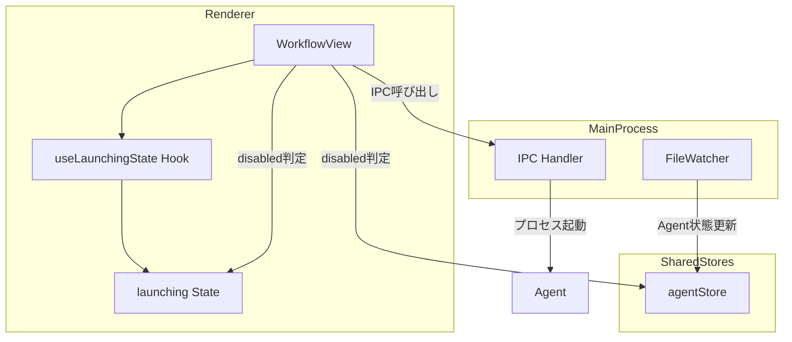
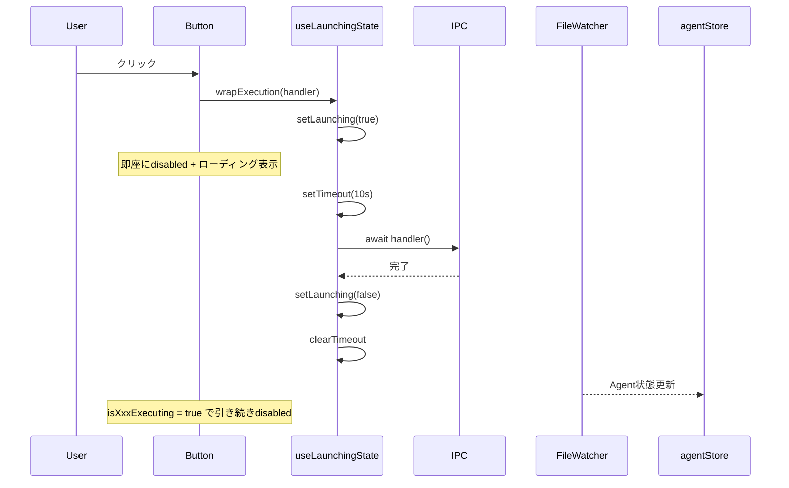
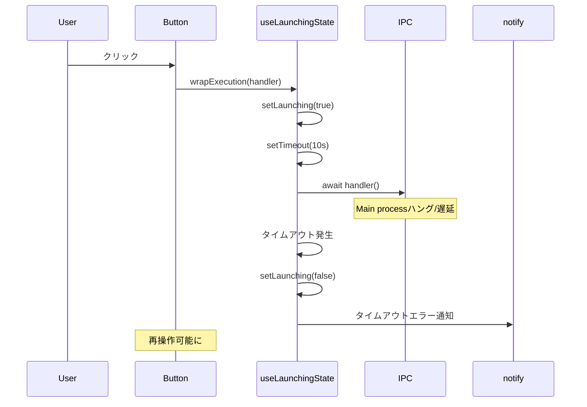

# Design Document: Agent Launch Optimistic UI

## Overview

**Purpose**: Agent実行ボタンクリック時に即座にローディング状態を表示し（Optimistic UI）、Main process異常時のタイムアウトガードも設けることで、レスポンシブで堅牢なUXを実現する。

**Users**: Electronアプリ利用者およびRemote UI利用者が、実行ボタンをクリックした際に即座にフィードバックを得られる。

**Impact**: 現状のfileWatcher経由でAgent状態が更新されるまでの5-15ms程度の遅延を、ローカルステートによる即時フィードバックで解消。既存のagentStore構造やIPC戻り値の扱いは変更しない。

### Goals

- 全実行ボタンでクリック時の即時ローディング表示（Optimistic UI）
- 10秒タイムアウトによるMain process異常時の回復
- `useLaunchingState`カスタムフックによる共通化・保守性向上

### Non-Goals

- キャンセルオペレーションの実装
- Main processからの`AGENT_LAUNCHING`イベント送信
- agentStoreへの「起動中」ステート追加
- タイムアウト時間のユーザー設定機能

## Architecture

### Existing Architecture Analysis

**現状の実行ボタン状態管理**:
- ボタンのdisabled判定は`runningPhases.has(phase)`（agentStore由来）に依存
- Agent状態更新はfileWatcher経由で非同期に行われる（5-15ms遅延）
- IPC呼び出しの戻り値は現状使われておらず破棄されている

**変更しない部分**:
- fileWatcher経由のAgent状態更新フロー
- agentStoreの構造・責務
- IPC呼び出しの戻り値の扱い

### Architecture Pattern & Boundary Map

**Architecture Integration**:
- Selected pattern: Renderer-side local state with timeout guard（ローカルステート + タイムアウト）
- Domain/feature boundaries: 共有フックを`src/shared/hooks/`に配置し、Electron版/Remote UI版で共有
- Existing patterns preserved: agentStore SSOT、fileWatcher経由のAgent状態更新
- New components rationale: `useLaunchingState`フックで状態管理とタイムアウト処理を共通化
- Steering compliance: DRY原則に従い共通フック化、KISS原則に従いシンプルな実装



### Technology Stack

| Layer | Choice / Version | Role in Feature | Notes |
|-------|------------------|-----------------|-------|
| Frontend | React 19 + TypeScript 5.8+ | useLaunchingStateフック実装 | 既存スタック |
| State Management | React useState | ローカルlaunching状態管理 | Zustandは使用しない（UI state） |
| Runtime | setTimeout/clearTimeout | タイムアウト処理 | ブラウザ標準API |

## System Flows

### Optimistic UI シーケンス（正常系）



### タイムアウト発生シーケンス（異常系）



## Requirements Traceability

| Criterion ID | Summary | Components | Implementation Approach |
|--------------|---------|------------|------------------------|
| 1.1 | ボタンクリック時に即座にdisabled+ローディング表示 | useLaunchingState, WorkflowView | 新規フック実装 |
| 1.2 | IPC完了時にlaunching状態をfalseに戻す | useLaunchingState | wrapExecution内でfinally処理 |
| 1.3 | isXxxExecutingがtrueの場合は引き続きdisabled維持 | WorkflowView | disabled判定を`launching \|\| isXxxExecuting`に変更 |
| 1.4 | IPCエラー時にlaunching状態をfalseに戻しエラー通知 | useLaunchingState | catch節でnotify.error呼び出し |
| 2.1 | 10秒タイムアウトタイマー開始 | useLaunchingState | setTimeout(10000)使用 |
| 2.2 | タイムアウト時にlaunching状態リセット+エラー通知 | useLaunchingState | タイムアウトコールバック内で処理 |
| 2.3 | IPC正常完了時にタイムアウトタイマークリア | useLaunchingState | clearTimeout呼び出し |
| 2.4 | アンマウント時にタイムアウトタイマークリア | useLaunchingState | useEffect cleanup関数 |
| 3.1 | useLaunchingStateフック提供 | useLaunchingState | 新規フック実装 |
| 3.2 | wrapExecution関数で非同期関数ラップ | useLaunchingState | 高階関数パターン |
| 3.3 | タイムアウト時間をオプションで設定可能 | useLaunchingState | オプショナルパラメータ |
| 4.1 | 対象ハンドラへの適用 | WorkflowView | 既存ハンドラをwrapExecutionでラップ |
| 4.2 | disabled判定を`launching \|\| isXxxExecuting`に更新 | WorkflowView, DocumentReviewPanel, InspectionPanel | 既存コンポーネント修正 |
| 4.3 | Remote UIでも同様の動作 | WorkflowView | WorkflowView共有のため自動適用 |
| 5.1 | fileWatcher経由のAgent状態更新フローを変更しない | - | 既存実装を維持 |
| 5.2 | IPC戻り値の扱いを変更しない | - | 既存実装を維持 |
| 5.3 | agentStoreの構造を変更しない | - | 既存実装を維持 |

### Coverage Validation Checklist

- [x] Every criterion ID from requirements.md appears in the table above
- [x] Each criterion has specific component names
- [x] Implementation approach distinguishes "reuse existing" vs "new implementation"
- [x] User-facing criteria specify concrete UI components

## Components and Interfaces

| Component | Domain/Layer | Intent | Req Coverage | Key Dependencies | Contracts |
|-----------|--------------|--------|--------------|------------------|-----------|
| useLaunchingState | Shared Hook | ローディング状態管理とタイムアウト処理の共通化 | 1.1-1.4, 2.1-2.4, 3.1-3.3 | notify (P1) | State |
| WorkflowView | Renderer Component | 実行ボタンにOptimistic UI適用 | 4.1, 4.2, 4.3 | useLaunchingState (P0), agentStore (P0) | - |
| DocumentReviewPanel | Shared Component | レビュー実行ボタンにOptimistic UI適用 | 4.1, 4.2 | useLaunchingState (P0) | - |
| InspectionPanel | Shared Component | Inspection実行ボタンにOptimistic UI適用 | 4.1, 4.2 | useLaunchingState (P0) | - |

### Shared Hooks

#### useLaunchingState

| Field | Detail |
|-------|--------|
| Intent | 実行ボタンのローディング状態管理とタイムアウト処理を共通化 |
| Requirements | 1.1, 1.2, 1.3, 1.4, 2.1, 2.2, 2.3, 2.4, 3.1, 3.2, 3.3 |

**Responsibilities & Constraints**
- ローカルステート（useState）でlaunching状態を管理
- タイムアウト処理（setTimeout/clearTimeout）を内包
- コンポーネントのアンマウント時にタイマーをクリーンアップ
- エラー発生時・タイムアウト時にnotify経由で通知

**Dependencies**
- Outbound: notify (notification store) - エラー/タイムアウト通知 (P1)

**Contracts**: State [x]

##### State Management

```typescript
interface UseLaunchingStateOptions {
  /** タイムアウト時間（ミリ秒）。デフォルト: 10000 */
  timeoutMs?: number;
  /** タイムアウト時のエラーメッセージ */
  timeoutMessage?: string;
}

interface UseLaunchingStateReturn {
  /** 現在のlaunching状態 */
  launching: boolean;
  /** 非同期関数をラップしてlaunching状態を自動管理 */
  wrapExecution: <T>(fn: () => Promise<T>) => Promise<T | undefined>;
}
```

- State model: `useState<boolean>(false)`でlaunching状態管理
- Persistence & consistency: メモリ内のみ、永続化なし
- Concurrency strategy: 単一コンポーネント内で使用、競合なし

**Implementation Notes**
- Integration: 既存ハンドラ（handleExecutePhase等）をwrapExecutionでラップ
- Validation: タイムアウト値は正の整数であることを想定（バリデーションは省略）
- Risks: Spec切り替え時にローカルステートがリセットされるが、戻った時はagentStore（`isXxxExecuting`）が正しい状態を反映するため問題なし
- Import: `import { notify } from '../stores'`（Electron renderer）または相当するパス（Remote UI）からインポート
- Barrel Export: `src/shared/hooks/index.ts` に `export { useLaunchingState } from './useLaunchingState'` を追加すること

**複数ボタンの独立性**
複数の実行ボタンを短時間で連続クリックした場合、各ハンドラは独立したuseLaunchingStateインスタンスを使用するため競合しない。例えば、requirements実行ボタンとdesign実行ボタンを連続クリックした場合、それぞれ独自のlaunching状態を持つため、一方のlaunching=falseが他方に影響することはない。

### Renderer Components

#### WorkflowView（既存コンポーネント修正）

| Field | Detail |
|-------|--------|
| Intent | 6フェーズのワークフロー表示と実行ボタン操作 |
| Requirements | 4.1, 4.2, 4.3 |

**Responsibilities & Constraints**
- 既存のhandleExecutePhase, handleStartDocumentReview等をwrapExecutionでラップ
- disabled判定を`launching || runningPhases.has(phase)`に変更

**Dependencies**
- Inbound: useLaunchingState - launching状態とwrapExecution (P0)
- Inbound: agentStore - Agent実行状態（isXxxExecuting） (P0)

**Implementation Notes**
- Integration: useLaunchingStateをインポートし、各ハンドラをwrapExecution化
- Validation: なし
- Risks: 複数のlaunching状態を管理する場合は、ハンドラごとにuseLaunchingStateを呼び出す

#### DocumentReviewPanel（既存コンポーネント修正）

| Field | Detail |
|-------|--------|
| Intent | ドキュメントレビューパネルの表示と操作 |
| Requirements | 4.1, 4.2 |

**Implementation Notes**
- Integration: 親コンポーネント（WorkflowView）からlaunching状態を受け取るか、内部でuseLaunchingStateを使用
- パターン選択: 親コンポーネントでハンドラをラップし、launchingをprops経由で渡す方式を採用（DRY原則）

#### InspectionPanel（既存コンポーネント修正）

| Field | Detail |
|-------|--------|
| Intent | Inspectionパネルの表示と操作 |
| Requirements | 4.1, 4.2 |

**Implementation Notes**
- Integration: DocumentReviewPanelと同様、親コンポーネントからlaunching状態を受け取る

## Error Handling

### Error Strategy

Optimistic UIに特有のエラーハンドリング戦略。

### Error Categories and Responses

**IPC Error (1.4)**:
- Trigger: IPC呼び出しが例外をスロー
- Response: launching状態をfalseに戻し、notify.errorでエラー通知
- Recovery: ユーザーは再度ボタンをクリック可能

**Timeout Error (2.2)**:
- Trigger: 10秒以内にIPC呼び出しが完了しない
- Response: launching状態をfalseに戻し、notify.errorでタイムアウト通知
- Recovery: ユーザーは再度ボタンをクリック可能

**Timeout後のIPC完了 (2.2 Edge Case)**:
- Trigger: タイムアウト発火後にIPCが正常完了する
- Response: IPCの完了処理はそのまま実行される（launching状態は既にfalseのため変更なし）。fileWatcher経由でAgent状態が`isXxxExecuting=true`に更新され、ボタンは引き続きdisabled状態となる
- Recovery: タイムアウトエラー通知は表示済みだが、実行自体は継続している。ユーザーはAgent状態の更新を待つか、必要に応じて再操作可能

**Component Unmount (2.4)**:
- Trigger: ハンドラ実行中にコンポーネントがアンマウント
- Response: useEffect cleanup関数でタイムアウトタイマーをクリア
- Recovery: メモリリーク防止

### Monitoring

既存のロギング・通知機構を使用。新規のモニタリング追加なし。

## Testing Strategy

### Unit Tests

1. **useLaunchingState フック**
   - wrapExecution呼び出しでlaunching状態がtrueになる
   - 非同期関数完了後にlaunching状態がfalseに戻る
   - エラー発生時にlaunching状態がfalseに戻る
   - タイムアウト発生時にlaunching状態がfalseに戻る
   - アンマウント時にタイマーがクリアされる

2. **タイムアウト設定**
   - デフォルト値（10000ms）が適用される
   - カスタム値が適用される

### Integration Tests

1. **WorkflowView**
   - handleExecutePhaseがwrapExecutionでラップされている
   - ボタンのdisabled判定が`launching || isExecuting`になっている
   - タイムアウト時にエラー通知が表示される

2. **DocumentReviewPanel / InspectionPanel**
   - 実行ボタンがlaunching状態を反映する

### E2E Tests (optional)

1. **Optimistic UI動作確認**
   - ボタンクリック時に即座にローディング表示される
   - Agent起動後もdisabled状態が維持される

## Design Decisions

### DD-001: Renderer側ローカルステート採用

| Field | Detail |
|-------|--------|
| Status | Accepted |
| Context | Optimistic UIを実現するための状態管理方式を選定する必要がある |
| Decision | Renderer側のuseStateでローカルにlaunching状態を管理する |
| Rationale | agentStoreの構造を変更せずに済み、既存のfileWatcher経由の状態更新フローに影響を与えない。Spec切り替え時にステートがリセットされても、戻った時はagentStoreが正しい状態を反映するため問題なし |
| Alternatives Considered | (A) agentStoreに「起動中」ステート追加 - グローバルステート追加は過剰 (B) Main processからAGENT_LAUNCHINGイベント送信 - 実装複雑化 (C) IPC戻り値を活用 - 現状破棄されており変更コスト高 |
| Consequences | ローカルステートのためSpec切り替え時にリセットされるが、UXへの影響は最小限 |

### DD-002: 10秒タイムアウト設定

| Field | Detail |
|-------|--------|
| Status | Accepted |
| Context | Main processがハング/遅延した場合にUIがスタックするリスクを回避する必要がある |
| Decision | 10秒のタイムアウトを設定し、超過時にlaunching状態をリセットしてエラー通知を表示する |
| Rationale | Claude CLI起動が遅い環境（Cold start、ネットワーク遅延等）を考慮しつつ、ユーザーが再操作可能になることを優先 |
| Alternatives Considered | (A) 5秒 - 遅い環境で誤検知リスク (B) 30秒 - スタック時の待機時間が長すぎる (C) タイムアウトなし - UIスタックのリスク残存 |
| Consequences | 10秒以上かかる正常な起動もタイムアウト扱いになる可能性があるが、再操作でリカバリ可能 |

### DD-003: 共通フック（useLaunchingState）による実装統一

| Field | Detail |
|-------|--------|
| Status | Accepted |
| Context | 8箇所程度の実行ボタンにOptimistic UIを適用する必要がある |
| Decision | `useLaunchingState`カスタムフックを作成し、全実行ボタンで共通利用する |
| Rationale | DRY原則に従い、ローディング状態管理とタイムアウト処理のロジックを一箇所に集約。保守性向上と一貫したUX提供を実現 |
| Alternatives Considered | (A) 各ハンドラに個別実装 - コード重複、保守性低下 (B) HOC (Higher-Order Component) - フック方式の方がReact 19に適合 |
| Consequences | フックの仕様変更が全ボタンに影響するが、一貫性確保のメリットが上回る |

### DD-004: shared/hooks配置によるElectron/Remote UI共有

| Field | Detail |
|-------|--------|
| Status | Accepted |
| Context | Electron版とRemote UI版の両方でOptimistic UIを提供する必要がある |
| Decision | useLaunchingStateを`src/shared/hooks/`に配置し、両環境で共有する |
| Rationale | WorkflowViewが既にsharedコンポーネントとして共有されているため、フックも同様に共有することで自動的にRemote UIにも適用される |
| Alternatives Considered | (A) renderer/hooks配置 - Remote UI側に別途実装が必要 (B) 各環境に個別実装 - コード重複 |
| Consequences | shared配下のため、両環境の差異（notify等）に注意が必要だが、現状notifyは共有可能 |

### DD-005: 親コンポーネントでのハンドララップ方式

| Field | Detail |
|-------|--------|
| Status | Accepted |
| Context | DocumentReviewPanel, InspectionPanel等の子コンポーネントにもOptimistic UIを適用する必要がある |
| Decision | WorkflowView（親）でハンドラをwrapExecutionでラップし、launching状態をprops経由で子に渡す |
| Rationale | 子コンポーネントごとにuseLaunchingStateを呼び出すとlaunching状態が分散する。親で一元管理することでボタン間の状態同期が容易 |
| Alternatives Considered | (A) 子コンポーネント内でuseLaunchingState使用 - 状態分散、同期複雑化 |
| Consequences | 親コンポーネントの複雑度が若干増加するが、状態管理の一貫性が向上 |
