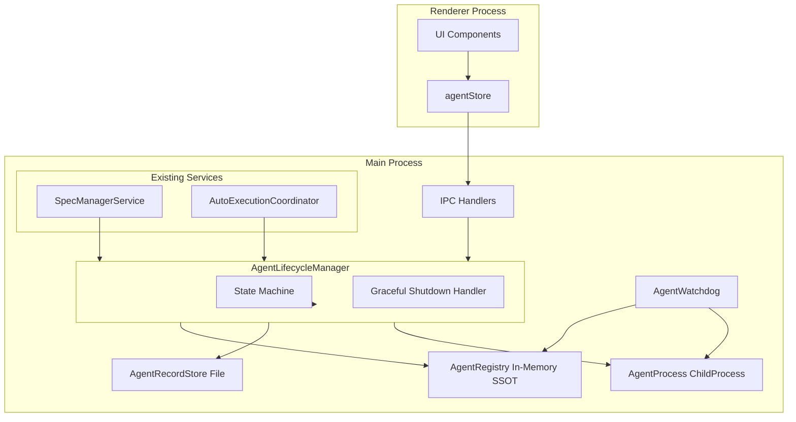
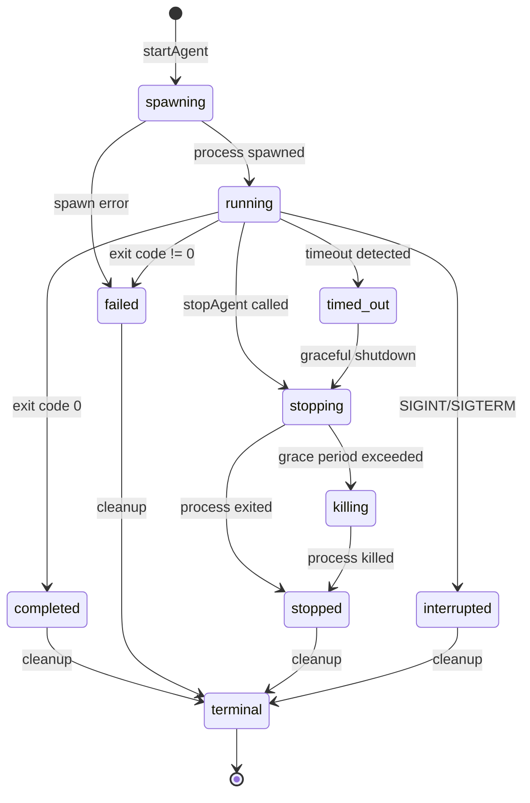
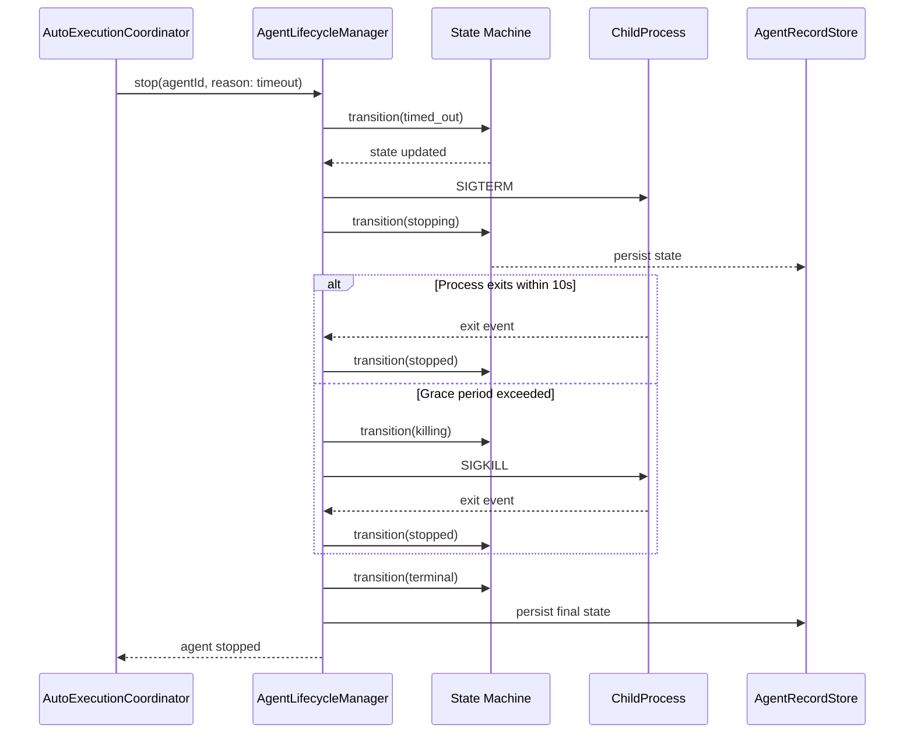
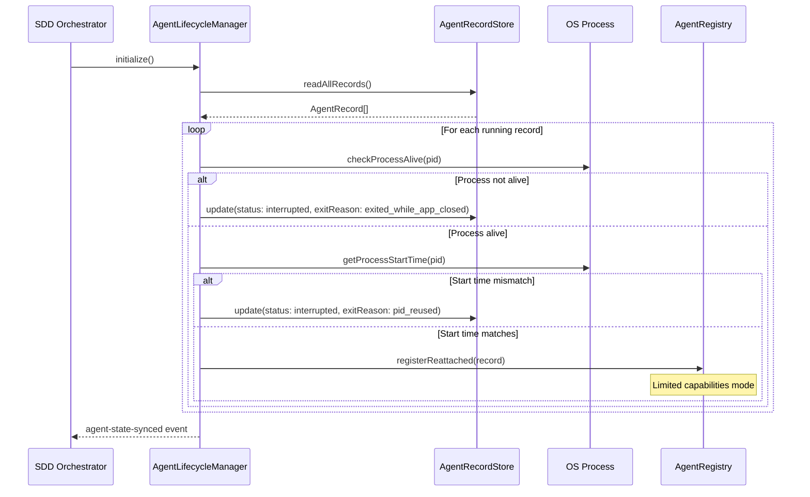
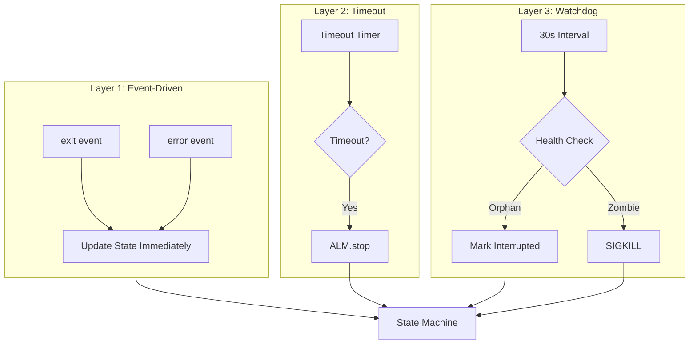

# Design: Agent Lifecycle Management

## Overview

**Purpose**: エージェントプロセスのライフサイクル管理を一元化し、タイムアウト時のプロセス停止、アプリ再起動時の状態同期、PID再利用問題への対策を実現する。

**Users**: SDD Orchestratorユーザーは、エージェントの正確な状態把握と確実なプロセス制御を通じて、信頼性の高い自動実行ワークフローを利用できる。

**Impact**: 現在分散している責務（SpecManagerService、AutoExecutionCoordinator、handlers.ts）をAgentLifecycleManagerに集約し、3層監視アーキテクチャ（イベント駆動、タイムアウト、Watchdog）による堅牢なプロセス管理を実現する。

### Goals

- AgentLifecycleManagerによるライフサイクル管理の一元化
- AgentStateの状態マシンによる予測可能な状態遷移
- タイムアウト時のGraceful Shutdown処理
- アプリ再起動時の正確な状態同期
- 3層監視による確実なプロセス追跡

### Non-Goals

- Windows対応（`ps`コマンドの代替実装）
- Claude CLIセッションファイルの活用
- Agent recordファイル破損時のリカバリ機構
- 複数マシンでの分散エージェント管理
- エージェントのリモートデバッグ機能

## Architecture

### Existing Architecture Analysis

現在のアーキテクチャには以下の課題がある:

1. **責務の分散**: ライフサイクル管理が複数コンポーネントに分散
   - `SpecManagerService`: プロセスのspawn、出力処理、handleAgentExit
   - `AutoExecutionCoordinator`: タイムアウト管理、フェーズ進行制御
   - `AgentRecordService`: ファイルベースの状態永続化
   - `handlers.ts`: IPC経由のstopAgent

2. **タイムアウト時のプロセス未停止**: AutoExecutionCoordinatorはタイムアウト時に状態のみ更新し、実際のプロセス停止を行わない

3. **PID再利用問題**: `checkProcessAlive(pid)`のみではPID再利用を検出できない

4. **アプリ再起動時の状態不整合**: 停止中に終了したエージェントの検知が不可能

### Architecture Pattern & Boundary Map

**Architecture Integration**:
- Selected pattern: **Layered Architecture with State Machine**
- Domain/feature boundaries: AgentLifecycleManagerがプロセス管理の唯一の窓口
- Existing patterns preserved: Main Process SSOT、IPCパターン、File-based persistence
- New components rationale: AgentLifecycleManager（統合制御）、AgentWatchdog（ヘルスチェック）、AgentRegistry（In-Memory状態管理）
- Steering compliance: DRY（一元化）、SSOT（AgentRegistry）、関心の分離



### Technology Stack

| Layer | Choice / Version | Role in Feature | Notes |
|-------|------------------|-----------------|-------|
| Backend / Services | Node.js 20+ (Electron Main) | AgentLifecycleManager、AgentWatchdog、状態管理 | 既存スタック |
| Data / Storage | JSON Files | AgentRecord永続化 | 既存の`.kiro/runtime/agents/`構造 |
| Messaging / Events | EventEmitter | コンポーネント間通知 | 既存パターン踏襲 |
| Infrastructure / Runtime | Electron 35 | プロセス管理、IPC | 既存スタック |

## System Flows

### Agent Lifecycle State Machine



### Graceful Shutdown Sequence



### Startup State Synchronization



### 3-Layer Monitoring



## Requirements Traceability

| Criterion ID | Summary | Components | Implementation Approach |
|--------------|---------|------------|------------------------|
| 1.1 | AgentLifecycleManagerクラス新規作成 | AgentLifecycleManager | New implementation |
| 1.2 | AgentHandleインターフェース定義 | AgentHandle interface | New implementation |
| 1.3 | AgentRegistry In-Memory SSOT | AgentRegistry | New implementation |
| 1.4 | SpecManagerServiceからの移行 | SpecManagerService, AgentLifecycleManager | Refactor: delegate to ALM |
| 1.5 | AutoExecutionCoordinatorの連携 | AutoExecutionCoordinator, AgentLifecycleManager | Refactor: use ALM.stop() |
| 2.1 | AgentState状態定義 | AgentState type | New implementation |
| 2.2 | 有効な遷移の定義 | AgentStateMachine | New implementation |
| 2.3 | 状態遷移ログ出力 | AgentStateMachine | New implementation |
| 2.4 | terminal状態のレジストリ削除 | AgentLifecycleManager | New implementation |
| 3.1 | タイムアウト時のtimed_out遷移 | AutoExecutionCoordinator, AgentLifecycleManager | Modify existing + new |
| 3.2 | Graceful Shutdown SIGTERM | AgentLifecycleManager | New implementation |
| 3.3 | 10秒後SIGKILL | AgentLifecycleManager | New implementation |
| 3.4 | 終了確認とterminal遷移 | AgentLifecycleManager | New implementation |
| 3.5 | auto-execution:timeoutイベント記録 | AgentLifecycleManager, EventLogService | New implementation |
| 4.1 | processStartTimeフィールド追加 | AgentRecord interface | Extend existing |
| 4.2 | プロセス開始時刻取得 | ProcessUtils | New implementation |
| 4.3 | getProcessStartTime関数 | ProcessUtils | New implementation |
| 4.4 | isSameProcess関数 | ProcessUtils | New implementation |
| 4.5 | 後方互換性（警告ログ） | AgentLifecycleManager | New implementation |
| 5.1 | 起動時AgentRecord読み込み | AgentLifecycleManager | New implementation |
| 5.2 | プロセス不在時のinterrupted更新 | AgentLifecycleManager | New implementation |
| 5.3 | PID再利用時のinterrupted更新 | AgentLifecycleManager | New implementation |
| 5.4 | プロセス継続時の監視モード登録 | AgentLifecycleManager, AgentRegistry | New implementation |
| 5.5 | agent-state-syncedイベント通知 | AgentLifecycleManager | New implementation |
| 6.1 | ReattachedAgentモード実装 | AgentRegistry, AgentHandle | New implementation |
| 6.2 | UI再接続ステータス表示 | UI Components, agentStore | Modify existing UI |
| 6.3 | SIGKILL限定の停止 | AgentLifecycleManager | New implementation |
| 6.4 | 実行時間「不明」表示 | UI Components | Modify existing UI |
| 7.1 | AgentWatchdog 30秒間隔 | AgentWatchdog | New implementation |
| 7.2 | 孤児エージェント検出 | AgentWatchdog | New implementation |
| 7.3 | ゾンビプロセス強制終了 | AgentWatchdog | New implementation |
| 7.4 | ヘルスチェックログ出力 | AgentWatchdog | New implementation |
| 7.5 | Watchdogライフサイクル連動 | AgentWatchdog, main/index.ts | New implementation |
| 8.1 | ExitReason型定義 | ExitReason type | New implementation |
| 8.2 | exitReasonフィールド追加 | AgentRecord interface | Extend existing |
| 8.3 | UI終了理由表示 | UI Components | Modify existing UI |
| 8.4 | アプリ停止中終了の補足表示 | UI Components | Modify existing UI |
| 9.1 | Layer 1 イベント駆動監視 | AgentLifecycleManager | New implementation (integrate existing) |
| 9.2 | Layer 2 タイムアウト監視 | AutoExecutionCoordinator, AgentLifecycleManager | Modify existing + new |
| 9.3 | Layer 3 Watchdog監視 | AgentWatchdog | New implementation |
| 9.4 | 重複処理防止 | AgentStateMachine | New implementation |

### Coverage Validation Checklist

- [x] Every criterion ID from requirements.md appears in the table above
- [x] Each criterion has specific component names (not generic references)
- [x] Implementation approach distinguishes "reuse existing" vs "new implementation"
- [x] User-facing criteria specify concrete UI components (not just "shared components")

## Components and Interfaces

| Component | Domain/Layer | Intent | Req Coverage | Key Dependencies | Contracts |
|-----------|--------------|--------|--------------|------------------|-----------|
| AgentLifecycleManager | Main/Service | エージェントライフサイクルの一元管理 | 1.1-1.5, 3.1-3.5, 5.1-5.5, 6.3, 9.1-9.2 | AgentRegistry (P0), AgentRecordStore (P0), ProcessUtils (P0) | Service, Event |
| AgentRegistry | Main/Service | In-Memoryエージェント状態管理 | 1.3, 5.4, 6.1 | None | Service, State |
| AgentStateMachine | Main/Service | 状態遷移の制御と検証 | 2.1-2.4, 9.4 | None | Service |
| AgentWatchdog | Main/Service | 定期ヘルスチェック | 7.1-7.5, 9.3 | AgentRegistry (P0), ProcessUtils (P0) | Service |
| ProcessUtils | Main/Utils | プロセス操作ユーティリティ | 4.2-4.4 | None | Service |
| AgentHandle | Main/Interface | エージェント操作インターフェース | 1.2 | ChildProcess (P0) | Service |

### Main Process / Services

#### AgentLifecycleManager

| Field | Detail |
|-------|--------|
| Intent | エージェントのライフサイクル全体を一元管理し、起動・監視・停止の責務を集約する |
| Requirements | 1.1, 1.4, 1.5, 3.1-3.5, 5.1-5.5, 6.3, 9.1, 9.2 |

**Responsibilities & Constraints**
- エージェントの起動、監視、停止のSSoT
- 状態遷移の整合性保証
- Graceful Shutdown処理の実行
- アプリ起動時の状態同期

**Dependencies**
- Inbound: AutoExecutionCoordinator - タイムアウト時のstop呼び出し (P0)
- Inbound: IPC Handlers - ユーザー操作のエージェント制御 (P0)
- Outbound: AgentRegistry - In-Memory状態管理 (P0)
- Outbound: AgentRecordStore - ファイル永続化 (P0)
- Outbound: ProcessUtils - プロセス操作 (P0)
- Outbound: EventLogService - イベントログ記録 (P1)

**Contracts**: Service [x] / Event [x]

##### Service Interface

```typescript
interface AgentLifecycleManager {
  /**
   * エージェントを起動する
   * @param options 起動オプション
   * @returns 成功時はAgentHandle、失敗時はエラー
   */
  startAgent(options: StartAgentOptions): Promise<Result<AgentHandle, AgentError>>;

  /**
   * エージェントを停止する
   * @param agentId エージェントID
   * @param reason 停止理由
   * @returns 成功時はvoid、失敗時はエラー
   */
  stopAgent(agentId: string, reason: StopReason): Promise<Result<void, AgentError>>;

  /**
   * エージェントを強制終了する
   * @param agentId エージェントID
   * @returns 成功時はvoid、失敗時はエラー
   */
  killAgent(agentId: string): Promise<Result<void, AgentError>>;

  /**
   * エージェント情報を取得する
   * @param agentId エージェントID
   * @returns AgentHandleまたはnull
   */
  getAgent(agentId: string): AgentHandle | null;

  /**
   * 全エージェントを取得する
   * @returns AgentHandleの配列
   */
  getAllAgents(): AgentHandle[];

  /**
   * 指定specのエージェントを取得する
   * @param specId specのID
   * @returns AgentHandleの配列
   */
  getAgentsBySpec(specId: string): AgentHandle[];

  /**
   * アプリ起動時の状態同期を実行する
   * @returns 同期結果
   */
  synchronizeOnStartup(): Promise<SyncResult>;

  /**
   * リソースを解放する
   */
  dispose(): void;
}

type StopReason = 'user_request' | 'timeout' | 'phase_complete' | 'error';

interface SyncResult {
  readonly totalRecords: number;
  readonly reattached: number;
  readonly markedInterrupted: number;
  readonly pidReused: number;
}
```

- Preconditions: なし
- Postconditions: 状態遷移が完了し、AgentRegistryとAgentRecordStoreが同期
- Invariants: AgentRegistryとAgentRecordStoreの状態整合性

##### Event Contract

- Published events:
  - `agent-state-changed`: (agentId: string, oldState: AgentState, newState: AgentState) => void
  - `agent-started`: (agentId: string, handle: AgentHandle) => void
  - `agent-stopped`: (agentId: string, reason: StopReason, exitReason: ExitReason) => void
  - `agent-state-synced`: () => void
- Subscribed events:
  - ChildProcess `exit` event
  - ChildProcess `error` event
- Ordering / delivery guarantees: 状態遷移順に発行、重複防止は状態マシンで保証

**Implementation Notes**
- Integration: 既存のSpecManagerServiceからプロセス管理ロジックを移行
- Validation: 状態遷移の妥当性をAgentStateMachineで検証
- Risks: 移行時の既存機能への影響

---

#### AgentRegistry

| Field | Detail |
|-------|--------|
| Intent | 実行中エージェントのIn-Memoryランタイム状態を管理するSSoT |
| Requirements | 1.3, 5.4, 6.1 |

**Responsibilities & Constraints**
- AgentHandleのIn-Memory管理
- プロセスハンドル（ChildProcess）の保持
- 高速なランタイムアクセス
- アプリ終了時にメモリ解放

**Dependencies**
- Inbound: AgentLifecycleManager - CRUD操作 (P0)
- Inbound: AgentWatchdog - ヘルスチェック参照 (P0)

**Contracts**: Service [x] / State [x]

##### Service Interface

```typescript
interface AgentRegistry {
  /**
   * エージェントを登録する
   * @param handle AgentHandle
   */
  register(handle: AgentHandle): void;

  /**
   * エージェントを登録解除する
   * @param agentId エージェントID
   */
  unregister(agentId: string): void;

  /**
   * エージェントを取得する
   * @param agentId エージェントID
   * @returns AgentHandleまたはundefined
   */
  get(agentId: string): AgentHandle | undefined;

  /**
   * 全エージェントを取得する
   * @returns AgentHandleの配列
   */
  getAll(): AgentHandle[];

  /**
   * 指定specのエージェントを取得する
   * @param specId specのID
   * @returns AgentHandleの配列
   */
  getBySpec(specId: string): AgentHandle[];

  /**
   * 再接続エージェントを登録する（制限付きモード）
   * @param record AgentRecord
   */
  registerReattached(record: AgentRecord): void;

  /**
   * 全エージェントをクリアする
   */
  clear(): void;
}
```

##### State Management

- State model: `Map<string, AgentHandle>` (agentId -> AgentHandle)
- Persistence & consistency: In-Memoryのみ、AgentRecordStoreと論理的に同期
- Concurrency strategy: Main Process Single-threaded、同期アクセス

---

#### AgentStateMachine

| Field | Detail |
|-------|--------|
| Intent | エージェント状態遷移の制御と検証を行う |
| Requirements | 2.1, 2.2, 2.3, 2.4, 9.4 |

**Responsibilities & Constraints**
- 有効な状態遷移のみ許可
- 不正遷移の検出とログ出力
- terminal状態への遷移検知

**Dependencies**
- Inbound: AgentLifecycleManager - 状態遷移リクエスト (P0)

**Contracts**: Service [x]

##### Service Interface

```typescript
type AgentState =
  | 'spawning'
  | 'running'
  | 'timed_out'
  | 'stopping'
  | 'killing'
  | 'completed'
  | 'failed'
  | 'stopped'
  | 'interrupted'
  | 'terminal';

interface AgentStateMachine {
  /**
   * 現在の状態を取得する
   * @returns 現在のAgentState
   */
  getCurrentState(): AgentState;

  /**
   * 状態遷移を試みる
   * @param nextState 遷移先の状態
   * @returns 遷移成功ならtrue
   */
  transition(nextState: AgentState): boolean;

  /**
   * 指定状態への遷移が有効かを確認する
   * @param nextState 遷移先の状態
   * @returns 有効ならtrue
   */
  canTransition(nextState: AgentState): boolean;

  /**
   * terminal状態かを確認する
   * @returns terminalならtrue
   */
  isTerminal(): boolean;
}

/**
 * 状態遷移定義
 */
const VALID_TRANSITIONS: Record<AgentState, AgentState[]> = {
  spawning: ['running', 'failed'],
  running: ['timed_out', 'completed', 'failed', 'interrupted', 'stopping'],
  timed_out: ['stopping'],
  stopping: ['killing', 'stopped'],
  killing: ['stopped'],
  completed: ['terminal'],
  failed: ['terminal'],
  stopped: ['terminal'],
  interrupted: ['terminal'],
  terminal: [],
};
```

---

#### AgentWatchdog

| Field | Detail |
|-------|--------|
| Intent | 定期的なヘルスチェックで孤児・ゾンビプロセスを検出する |
| Requirements | 7.1, 7.2, 7.3, 7.4, 7.5, 9.3 |

**Responsibilities & Constraints**
- 30秒間隔のヘルスチェック実行
- 孤児エージェント（running状態だがプロセス不在）の検出
- ゾンビプロセス（terminal状態だがプロセス存在）の強制終了
- アプリライフサイクルとの連動

**Dependencies**
- Inbound: main/index.ts - start/stop制御 (P0)
- Outbound: AgentRegistry - エージェント一覧参照 (P0)
- Outbound: ProcessUtils - プロセス生存確認 (P0)
- Outbound: AgentLifecycleManager - 状態更新/強制終了 (P0)

**Contracts**: Service [x]

##### Service Interface

```typescript
interface AgentWatchdog {
  /**
   * Watchdogを開始する
   */
  start(): void;

  /**
   * Watchdogを停止する
   */
  stop(): void;

  /**
   * 手動でヘルスチェックを実行する
   * @returns ヘルスチェック結果
   */
  checkHealth(): Promise<HealthCheckResult>;
}

interface HealthCheckResult {
  readonly checkedCount: number;
  readonly orphansDetected: number;
  readonly zombiesKilled: number;
  readonly errors: string[];
}
```

**Implementation Notes**
- Integration: Electron appのready/will-quitイベントと連動
- Validation: 異常検出時のみログ出力（正常時はログなし）
- Risks: 高負荷時のチェック遅延

---

#### ProcessUtils

| Field | Detail |
|-------|--------|
| Intent | OSレベルのプロセス操作ユーティリティを提供する |
| Requirements | 4.2, 4.3, 4.4 |

**Responsibilities & Constraints**
- プロセス開始時刻の取得（macOS/Linux）
- プロセス同一性検証
- プロセス生存確認

**Dependencies**
- External: Node.js child_process - psコマンド実行 (P0)

**Contracts**: Service [x]

##### Service Interface

```typescript
interface ProcessUtils {
  /**
   * プロセスの開始時刻を取得する
   * @param pid プロセスID
   * @returns 開始時刻文字列またはnull
   */
  getProcessStartTime(pid: number): string | null;

  /**
   * プロセスが同一かを検証する
   * @param pid プロセスID
   * @param recordedStartTime 記録された開始時刻
   * @returns 同一ならtrue
   */
  isSameProcess(pid: number, recordedStartTime: string): boolean;

  /**
   * プロセスが生存しているかを確認する
   * @param pid プロセスID
   * @returns 生存していればtrue
   */
  checkProcessAlive(pid: number): boolean;
}
```

**Implementation Notes**
- Integration: `ps -p PID -o lstart` コマンドを使用
- Validation: コマンド実行失敗時はnullを返す
- Risks: Windowsでは動作しない（Out of Scope）

---

#### AgentHandle

| Field | Detail |
|-------|--------|
| Intent | 個別エージェントの操作インターフェース |
| Requirements | 1.2 |

**Responsibilities & Constraints**
- プロセスハンドルと論理状態の統合
- 出力ストリームへのアクセス
- ライフサイクル操作の提供

**Contracts**: Service [x]

##### Service Interface

```typescript
interface AgentHandle {
  readonly agentId: string;
  readonly specId: string;
  readonly phase: string;
  readonly pid: number;
  readonly sessionId: string;
  readonly state: AgentState;
  readonly isReattached: boolean;
  readonly startedAt: string;
  readonly processStartTime: string | null;
  readonly exitReason: ExitReason | null;

  /**
   * 出力コールバックを登録する
   * @param callback 出力コールバック
   */
  onOutput(callback: (stream: 'stdout' | 'stderr', data: string) => void): void;

  /**
   * 終了コールバックを登録する
   * @param callback 終了コールバック
   */
  onExit(callback: (code: number) => void): void;

  /**
   * エラーコールバックを登録する
   * @param callback エラーコールバック
   */
  onError(callback: (error: Error) => void): void;
}
```

---

### Data Models

#### AgentRecord Extension

```typescript
interface AgentRecord {
  agentId: string;
  specId: string;
  phase: string;
  pid: number;
  sessionId: string;
  status: AgentStatus;
  startedAt: string;
  lastActivityAt: string;
  command: string;
  cwd?: string;
  prompt?: string;
  // New fields (Requirements: 4.1, 8.2)
  processStartTime?: string;  // OS-level process start time
  exitReason?: ExitReason;    // Reason for termination
}
```

#### ExitReason Type

```typescript
type ExitReason =
  // Normal
  | 'completed'           // exit code 0
  | 'stopped_by_user'     // user requested stop
  // Abnormal (while app running)
  | 'failed'              // exit code != 0
  | 'timed_out'           // timeout exceeded
  | 'crashed'             // unexpected termination
  // Abnormal (while app closed)
  | 'exited_while_app_closed'  // process ended during app shutdown
  | 'pid_reused'               // PID was reused by different process
  // Special
  | 'orphaned'            // detected by watchdog
  | 'unknown';            // cannot determine
```

## Error Handling

### Error Strategy

| Error Category | Handling Pattern | Recovery Mechanism |
|---------------|------------------|-------------------|
| Spawn failure | Immediate state update to `failed` | User retry via UI |
| Process exit error | State transition to `failed` | Auto-execution retry logic |
| Graceful shutdown timeout | Escalate to SIGKILL | Force termination |
| Watchdog detection | Mark as `interrupted` or kill | Automatic cleanup |
| Record read/write failure | Log warning, continue | Degraded mode |

### Error Categories and Responses

**User Errors (4xx)**:
- Invalid agentId: Return NOT_FOUND error
- Stop on non-running agent: Return INVALID_STATE error

**System Errors (5xx)**:
- Spawn failure: Log error, emit event, update state to `failed`
- Signal delivery failure: Log warning, attempt SIGKILL

**Business Logic Errors**:
- Invalid state transition: Log warning, reject transition
- Duplicate agent start: Return ALREADY_RUNNING error

## Testing Strategy

### Unit Tests

- `AgentStateMachine.test.ts`: 全状態遷移パターンの検証
- `ProcessUtils.test.ts`: getProcessStartTime、isSameProcess
- `AgentRegistry.test.ts`: CRUD操作、reattachedモード
- `AgentLifecycleManager.test.ts`: startAgent、stopAgent、synchronizeOnStartup
- `AgentWatchdog.test.ts`: ヘルスチェックロジック

### Integration Tests

- AutoExecutionCoordinator + AgentLifecycleManager: タイムアウト時のstop連携
- SpecManagerService + AgentLifecycleManager: プロセス起動委譲
- AgentWatchdog + AgentRegistry: 孤児検出フロー

### E2E Tests

- タイムアウト発生時のプロセス停止確認
- アプリ再起動後の状態同期確認
- 再接続エージェントのUI表示確認

## Design Decisions

### DD-001: 2層状態管理アーキテクチャ

| Field | Detail |
|-------|--------|
| Status | Accepted |
| Context | 既存の`agent-state-file-ssot`ではファイルをSSOTとしているが、プロセスハンドル（ChildProcess）はメモリ上でのみ保持可能 |
| Decision | AgentRegistry（In-Memory）をランタイムのSSOT、AgentRecordStore（File）を永続化・リカバリソースとする2層構造を採用 |
| Rationale | In-Memoryはプロセスハンドルの保持と高速アクセスに必要。Fileは再起動時のリカバリに必要。両方の利点を活かす |
| Alternatives Considered | 1) File-onlyでプロセスハンドルは別管理 → 状態とプロセスの分離が残る 2) Memory-onlyで再起動時リセット → リカバリ不可 |
| Consequences | 2層の整合性維持が必要。状態変更時に両方を更新する責務がAgentLifecycleManagerに集約 |

### DD-002: プロセス開始時刻によるPID同一性検証

| Field | Detail |
|-------|--------|
| Status | Accepted |
| Context | PIDはOSによって再利用されるため、`kill(pid, 0)`だけでは別プロセスを誤検出する可能性がある |
| Decision | `ps -p PID -o lstart`でOSレベルのプロセス開始時刻を取得し、AgentRecordに記録。検証時はPID + 開始時刻で同一性を判定 |
| Rationale | OSレベルでの同一性確認として標準的かつ信頼性が高い。アプリ再起動を跨いだ状態同期の正確性が向上 |
| Alternatives Considered | 1) PIDのみで判定 → 誤検出リスク 2) プロセス名も併用 → Claude CLIは同じ名前なので区別不可 3) ファイルロック → 複雑化 |
| Consequences | macOS/Linux専用。Windows対応は将来課題。既存レコードの後方互換性のためPIDのみフォールバック |

### DD-003: 10秒Graceful Shutdown猶予期間

| Field | Detail |
|-------|--------|
| Status | Accepted |
| Context | タイムアウト後、SIGTERM送信からSIGKILLまでの猶予期間の設定 |
| Decision | 10秒を採用 |
| Rationale | レスポンスと保存処理のバランス。Claude CLIが状態を保存する時間を確保しつつ、過度な待機を避ける |
| Alternatives Considered | 1) 5秒 → 保存処理に不十分な可能性 2) 30秒 → ユーザー体験の低下 |
| Consequences | ほとんどのケースで正常終了可能。強制終了時のデータ損失リスクは許容 |

### DD-004: AgentLifecycleManagerへの責務集約

| Field | Detail |
|-------|--------|
| Status | Accepted |
| Context | ライフサイクル管理がSpecManagerService、AutoExecutionCoordinator、handlers.tsに分散 |
| Decision | AgentLifecycleManagerを導入し、エージェントのライフサイクル全体の責務を集約 |
| Rationale | DRY原則、一元化によるバグ削減、テスト容易性の向上 |
| Alternatives Considered | 1) 既存コンポーネントの修正のみ → 責務分散が残る 2) Facadeパターン → 既存コードを変更せず追加層 → 複雑化 |
| Consequences | 大規模なリファクタリングが必要。既存のSpecManagerServiceからプロセス管理を移行 |

### DD-005: 3層監視アーキテクチャ

| Field | Detail |
|-------|--------|
| Status | Accepted |
| Context | プロセスの状態追跡において、単一の監視方法では検出漏れが発生する可能性 |
| Decision | Layer 1（イベント駆動）、Layer 2（タイムアウト）、Layer 3（Watchdog）の3層で監視 |
| Rationale | 各層が異なる障害モードをカバーし、Defense-in-depthを実現 |
| Alternatives Considered | 1) イベント駆動のみ → イベント見逃しで孤児発生 2) ポーリングのみ → 遅延、リソース消費 |
| Consequences | 重複検出の可能性あり。状態マシンで重複処理を防止 |

## Integration & Deprecation Strategy

### 結合ポイント（既存ファイルの修正）

| File | Modification | Purpose |
|------|--------------|---------|
| `main/services/specManagerService.ts` | プロセス管理ロジックをAgentLifecycleManagerに委譲 | 1.4 |
| `main/services/autoExecutionCoordinator.ts` | タイムアウト時にAgentLifecycleManager.stopを呼び出し | 1.5, 3.1 |
| `main/services/agentRecordService.ts` | processStartTime、exitReasonフィールド追加 | 4.1, 8.2 |
| `main/ipc/handlers.ts` | stopAgent処理をAgentLifecycleManager経由に変更 | 1.5 |
| `main/ipc/agentHandlers.ts` | エージェント操作をAgentLifecycleManager経由に変更 | 1.5 |
| `main/index.ts` | AgentWatchdogの初期化とライフサイクル連動 | 7.5 |
| `shared/stores/agentStore.ts` | 再接続ステータスと終了理由の状態追加 | 6.2, 8.3 |
| `shared/components/agent/AgentListItem.tsx` | 再接続ステータス表示、終了理由表示 | 6.2, 6.4, 8.3, 8.4 |

### 新規ファイル

| File | Purpose |
|------|---------|
| `main/services/agentLifecycleManager.ts` | AgentLifecycleManager実装 |
| `main/services/agentRegistry.ts` | AgentRegistry実装 |
| `main/services/agentStateMachine.ts` | AgentStateMachine実装 |
| `main/services/agentWatchdog.ts` | AgentWatchdog実装 |
| `main/services/processUtils.ts` | ProcessUtils実装 |
| `main/services/agentHandle.ts` | AgentHandle実装 |

### 廃止予定ファイル

なし（既存ファイルはリファクタリングのみ、削除なし）

### 移行戦略

1. **Phase 1**: 新規コンポーネント追加（AgentLifecycleManager、AgentRegistry、AgentStateMachine、ProcessUtils）
2. **Phase 2**: SpecManagerServiceからプロセス管理ロジックを移行
3. **Phase 3**: AutoExecutionCoordinatorとの連携実装
4. **Phase 4**: AgentWatchdog追加と起動時同期実装
5. **Phase 5**: UI表示の更新（再接続ステータス、終了理由）
