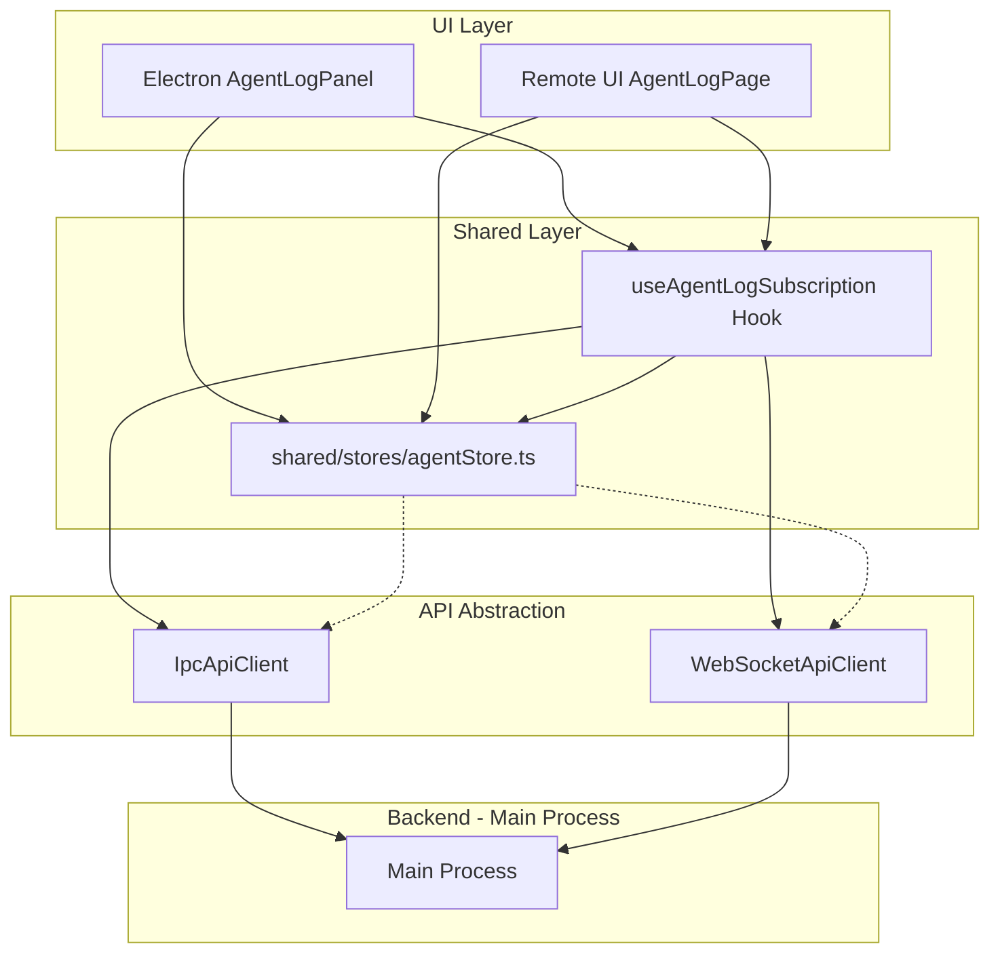
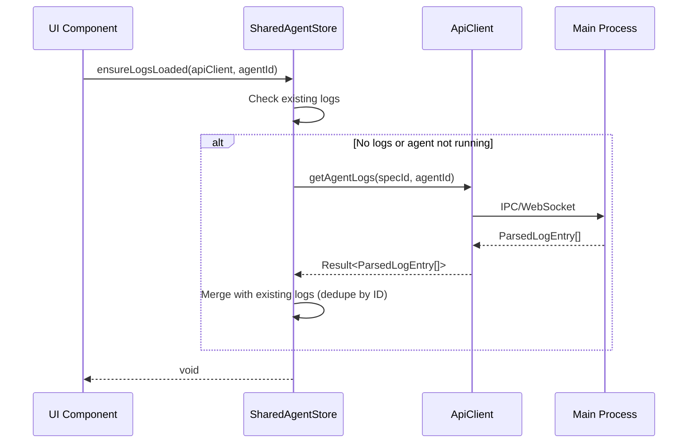
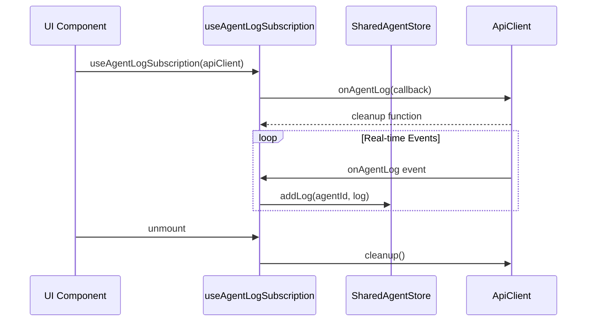

# Design: Agent Log Store Unification

## Overview

**Purpose**: Agentログの読み込みロジック（初回読み込み・リアルタイム更新）を`shared/stores/agentStore.ts`に集約し、Electron版とRemote UI版の両方から同一コードを使用できるようにする。

**Users**: 開発者（コード保守性向上）、エンドユーザー（Remote UIでのログ表示バグ修正）

**Impact**: 現在Electron版の`renderer/stores/agentStore.ts`と`agentStoreAdapter.ts`に分散しているログ読み込みロジックを共通化し、Remote UI版でAgentログが表示されないバグを修正する。

### Goals

- 初回ログ読み込みロジックを`shared/stores/agentStore.ts`に集約
- リアルタイムログ購読ロジックを共通hook化
- Electron版とRemote UI版でのコード重複を削減（DRY原則）
- Remote UI版でのAgentログ表示バグを修正

### Non-Goals

- Agentログのフォーマット変更
- ログのフィルタリング機能追加
- Main Processでのログ管理ロジック変更
- 新規APIの追加（既存の`getAgentLogs`、`onAgentLog`を使用）

## Architecture

### Existing Architecture Analysis

**現在の構造**:
- `shared/stores/agentStore.ts`: Agent状態のSSoT（addLog, getLogsForAgent は既存）
- `renderer/stores/agentStore.ts`: Electron版Facade（ensureLogsLoaded, loadAgentLogs を含む）
- `renderer/stores/agentStoreAdapter.ts`: IPC操作のアダプタ層（loadAgentLogs実装、onAgentLogリスナー）
- `remote-ui/hooks/useAgentStoreInit.ts`: Remote UI初期化hook（onAgentLogリスナーのみ、ログ読み込みなし）
- `shared/api/types.ts`: ApiClientインターフェース（getAgentLogs, onAgentLog定義済み）

**問題点**:
1. `ensureLogsLoaded`がElectron版（renderer/stores/agentStore.ts）にのみ存在
2. Remote UIではログ初回読み込みロジックがない（onAgentLogのみ購読）
3. AgentLogPage.tsxがログを取得するが、ensureLogsLoadedを呼び出していない

### Architecture Pattern & Boundary Map



**Key Decisions**:
- `ensureLogsLoaded`を`shared/stores/agentStore.ts`に移動し、ApiClient依存注入パターンを採用
- リアルタイムログ購読を`useAgentLogSubscription` hookとして共通化
- Electron版Facadeは共通化された機能を呼び出す薄いラッパーに変更

### Technology Stack

| Layer | Choice / Version | Role in Feature | Notes |
|-------|------------------|-----------------|-------|
| State Management | Zustand | 共有ストアでのログ状態管理 | 既存パターンを踏襲 |
| API Abstraction | ApiClient interface | IPC/WebSocket透過化 | 既存インターフェースを使用 |
| React Hooks | useEffect | ログ購読ライフサイクル管理 | 既存パターンを踏襲 |

## System Flows

### 初回ログ読み込みフロー



**Key Decisions**:
- Running agentは既存ログがあればスキップ（リアルタイムで追加されるため）
- Completed/failed agentは常にファイルから再読み込み（ファイルに追加ログがある可能性）
- ID基準での重複排除によりファイルログとリアルタイムログをマージ

### リアルタイムログ購読フロー



**Key Decisions**:
- hookはapiClientをpropsとして受け取り、IPC/WebSocket両対応
- 購読解除はuseEffectのcleanup関数で自動管理
- Store更新はZustandの自動再レンダリングで反映

## Requirements Traceability

| Criterion ID | Summary | Components | Implementation Approach |
|--------------|---------|------------|------------------------|
| 1.1 | ensureLogsLoadedをshared/stores/agentStore.tsに追加 | SharedAgentStore | 新規メソッド追加 |
| 1.2 | apiClient.getAgentLogs呼び出し | SharedAgentStore.ensureLogsLoaded | ApiClient依存注入 |
| 1.3 | 重複排除ロジック | SharedAgentStore.ensureLogsLoaded | ID基準マージ（既存ロジック移植） |
| 1.4 | Electron版renderer/stores/agentStore.tsからensureLogsLoaded削除 | renderer/stores/agentStore.ts | 共通版への委譲に変更 |
| 1.5 | Electron版agentStoreAdapter.tsからloadAgentLogs削除 | agentStoreAdapter.ts | 削除（共通版に移行） |
| 2.1 | useAgentLogSubscription hook作成 | shared/hooks/useAgentLogSubscription.ts | 新規hook作成 |
| 2.2 | hookでonAgentLog購読とaddLog呼び出し | useAgentLogSubscription | apiClient.onAgentLog + store.addLog |
| 2.3 | Remote UI useAgentStoreInit.tsからログ購読削除 | useAgentStoreInit.ts | 共通hookに移行 |
| 2.4 | Electron版agentStoreAdapterからログ購読削除 | agentStoreAdapter.ts | 共通hookに移行 |
| 3.1 | Remote UI AgentLogPageでensureLogsLoaded呼び出し | AgentLogPage.tsx | 共通メソッド使用 |
| 3.2 | Electron版AgentLogPanelで共通ensureLogsLoaded使用 | AgentLogPanel.tsx | 呼び出し先変更 |
| 3.3 | 両環境でログのマージ表示 | SharedAgentStore | 共通ロジック使用 |
| 4.1 | 既存テスト通過 | All test files | テスト修正 |
| 4.2 | Electron版動作維持 | Electron UI components | 動作確認 |
| 4.3 | Remote UI版動作 | Remote UI components | バグ修正確認 |

### Coverage Validation Checklist

- [x] Every criterion ID from requirements.md appears in the table above
- [x] Each criterion has specific component names (not generic references)
- [x] Implementation approach distinguishes "reuse existing" vs "new implementation"
- [x] User-facing criteria specify concrete UI components

## Components and Interfaces

| Component | Domain/Layer | Intent | Req Coverage | Key Dependencies | Contracts |
|-----------|--------------|--------|--------------|------------------|-----------|
| SharedAgentStore.ensureLogsLoaded | Shared/Store | 初回ログ読み込み共通化 | 1.1, 1.2, 1.3 | ApiClient (P0) | Service |
| useAgentLogSubscription | Shared/Hook | リアルタイムログ購読共通化 | 2.1, 2.2 | ApiClient (P0), SharedAgentStore (P0) | Service |
| AgentLogPage | Remote UI | ログ表示ページ | 3.1 | SharedAgentStore (P0), ApiClient (P0) | - |
| AgentLogPanel | Renderer | ログ表示パネル | 3.2 | SharedAgentStore (P0) | - |

### Shared / Store

#### SharedAgentStore.ensureLogsLoaded

| Field | Detail |
|-------|--------|
| Intent | Agent選択時に初回ログを読み込み、共有ストアに格納する |
| Requirements | 1.1, 1.2, 1.3 |

**Responsibilities & Constraints**
- ApiClient経由でログを取得（IPC/WebSocket透過）
- ID基準で重複排除（ファイルログとリアルタイムログのマージ）
- Running agentは既存ログがあればスキップ

**Dependencies**
- Inbound: UI Components — ログ読み込み要求 (P0)
- Outbound: ApiClient — getAgentLogs呼び出し (P0)

**Contracts**: Service [x]

##### Service Interface

```typescript
interface SharedAgentActions {
  // 既存メソッドに追加
  ensureLogsLoaded: (apiClient: ApiClient, agentId: string) => Promise<void>;
}
```

- Preconditions: apiClientがnullでないこと、agentIdが有効であること
- Postconditions: 該当AgentのログがStore.logsに格納されていること
- Invariants: 重複ログが存在しないこと（ID基準）

### Shared / Hook

#### useAgentLogSubscription

| Field | Detail |
|-------|--------|
| Intent | リアルタイムログイベントを購読し、SharedAgentStoreに反映する |
| Requirements | 2.1, 2.2 |

**Responsibilities & Constraints**
- apiClient.onAgentLog()を購読
- 受信したログをstore.addLog()で追加
- unmount時に購読解除

**Dependencies**
- Inbound: UI Components (App.tsx, AgentLogPage等) — hook使用 (P0)
- Outbound: ApiClient — onAgentLog購読 (P0)
- Outbound: SharedAgentStore — addLog呼び出し (P0)

**Contracts**: Service [x]

##### Service Interface

```typescript
interface UseAgentLogSubscriptionReturn {
  // 現時点では返り値なし（副作用のみ）
}

function useAgentLogSubscription(apiClient: ApiClient | null): void;
```

- Preconditions: apiClientがnullの場合は何もしない（接続待ち状態）
- Postconditions: apiClientがnon-nullの間、ログイベントがStoreに反映される
- Invariants: 購読解除漏れがないこと

## Data Models

### Domain Model

**Affected Entities**:
- `ParsedLogEntry`: 既存型、変更なし
- `AgentInfo`: 既存型、変更なし

**State Changes**:
- `SharedAgentState.logs: Map<string, ParsedLogEntry[]>`: 既存フィールド、ログ追加ロジックの呼び出し元が変更

## Error Handling

### Error Strategy

| Error Type | Source | Handling |
|------------|--------|----------|
| API Error (getAgentLogs失敗) | ApiClient | console.errorでログ、UI継続動作 |
| Agent Not Found | ensureLogsLoaded | 早期リターン（無視） |
| Connection Loss | WebSocket | 再接続後に自動復旧 |

### Monitoring

- 既存のコンソールログを維持
- エラー時は既存のremoteNotify.error()パターンを使用（Remote UI）

## Testing Strategy

### Unit Tests

- `shared/stores/agentStore.test.ts`: ensureLogsLoadedメソッドのテスト追加
  - ログなしの場合にAPIを呼び出すこと
  - Running agentで既存ログがある場合にAPIをスキップすること
  - 重複排除が正しく動作すること
- `shared/hooks/useAgentLogSubscription.test.ts`: 新規hookのテスト
  - onAgentLog購読が設定されること
  - ログ受信時にaddLogが呼び出されること
  - unmount時にcleanupが呼び出されること

### Integration Tests

- `remote-ui/components/AgentLogPage.integration.test.tsx`: ログ読み込み統合テスト
  - Agent選択時にensureLogsLoadedが呼び出されること
  - リアルタイムログが表示に反映されること
- `renderer/components/AgentLogPanel.integration.test.tsx`: 既存テストの更新
  - 共通ensureLogsLoadedを使用するよう確認

### E2E Tests

- 既存のE2Eテストが通過することを確認（変更不要の見込み）

## Design Decisions

### DD-001: ensureLogsLoadedの配置場所

| Field | Detail |
|-------|--------|
| Status | Accepted |
| Context | 初回ログ読み込みロジックをどこに配置するか |
| Decision | `shared/stores/agentStore.ts`にApiClientを引数とするメソッドとして追加 |
| Rationale | 既存の`loadAgents(apiClient)`と同じパターンで一貫性がある。ストア内でApiClientを保持せず、呼び出し時に注入することでテスト容易性を維持 |
| Alternatives Considered | 1) 新規hookとして作成 → Storeメソッドとhookの責務が曖昧になる 2) ApiClientをStore内部で保持 → Store初期化が複雑になる |
| Consequences | 呼び出し側でApiClientを渡す必要があるが、既存パターンと一貫性があり受け入れ可能 |

### DD-002: リアルタイムログ購読の共通化方式

| Field | Detail |
|-------|--------|
| Status | Accepted |
| Context | リアルタイムログ購読ロジックをどのように共通化するか |
| Decision | `useAgentLogSubscription`という独立したhookを作成し、App.tsxまたは適切な上位コンポーネントで使用 |
| Rationale | useAgentStoreInitに統合すると責務が肥大化する。独立hookとすることで単一責務を維持 |
| Alternatives Considered | 1) useAgentStoreInitに統合 → 責務が曖昧になる 2) StoreにApiClient保持 → テスト困難 |
| Consequences | hook呼び出し箇所が増えるが、責務が明確になり保守性向上 |

### DD-003: Electron版Facadeの変更方針

| Field | Detail |
|-------|--------|
| Status | Accepted |
| Context | renderer/stores/agentStore.tsの既存メソッドをどう扱うか |
| Decision | ensureLogsLoadedを削除し、共通版を呼び出すラッパーに変更。loadAgentLogsも削除 |
| Rationale | DRY原則に従い重複コードを排除。Facadeは共通機能への委譲のみを行う |
| Alternatives Considered | 1) 両方を維持（重複） → SSOT違反 2) Facadeを完全削除 → 後方互換性破壊 |
| Consequences | 既存のimportパスは維持されるため、コンポーネント側の変更は最小限 |

## Integration & Deprecation Strategy

### 既存ファイルの修正（Wiring Points）

| File | Change Type | Description |
|------|-------------|-------------|
| `shared/stores/agentStore.ts` | 修正 | ensureLogsLoadedメソッド追加 |
| `renderer/stores/agentStore.ts` | 修正 | ensureLogsLoadedを共通版委譲に変更、loadAgentLogs削除 |
| `renderer/stores/agentStoreAdapter.ts` | 修正 | loadAgentLogs削除、onAgentLogリスナー削除 |
| `remote-ui/hooks/useAgentStoreInit.ts` | 修正 | onAgentLogリスナー削除 |
| `remote-ui/components/AgentLogPage.tsx` | 修正 | ensureLogsLoaded呼び出し追加 |
| `renderer/components/AgentLogPanel.tsx` | 修正 | ensureLogsLoaded呼び出し先変更 |
| `remote-ui/App.tsx` | 修正 | useAgentLogSubscription hook追加 |
| `renderer/App.tsx` または上位コンポーネント | 修正 | useAgentLogSubscription hook追加 |

### 新規ファイル作成

| File | Description |
|------|-------------|
| `shared/hooks/useAgentLogSubscription.ts` | リアルタイムログ購読hook |
| `shared/hooks/useAgentLogSubscription.test.ts` | hookのユニットテスト |

### 削除対象ファイル

なし（既存ファイルのメソッド削除のみ）

## Interface Changes & Impact Analysis

### SharedAgentStore.ensureLogsLoaded 追加

**変更内容**: 新規メソッド追加（既存APIへの破壊的変更なし）

**Callers（呼び出し元）**:
- `renderer/components/AgentLogPanel.tsx`: ensureLogsLoaded呼び出し先を変更
- `remote-ui/components/AgentLogPage.tsx`: 新規呼び出し追加

**パラメータ**: `(apiClient: ApiClient, agentId: string) => Promise<void>`
- apiClient: 必須（依存注入パターン）
- agentId: 必須

### renderer/stores/agentStore.ts ensureLogsLoaded 変更

**変更内容**: 実装を共通版への委譲に変更

**Callers（呼び出し元）**:
- `renderer/components/AgentLogPanel.tsx`: シグネチャ変更なし（内部実装のみ変更）

**影響**: 呼び出し側の変更不要（後方互換性維持）

### agentStoreAdapter.loadAgentLogs 削除

**変更内容**: メソッド削除

**Callers（呼び出し元）**:
- `renderer/stores/agentStore.ts`: 呼び出し削除（共通版に移行）

**影響**: Facadeから呼び出していたため、Facade側で対応

### agentStoreAdapter.setupAgentEventListeners 変更

**変更内容**: onAgentLogリスナー削除

**Callers（呼び出し元）**:
- `renderer/stores/agentStore.ts setupEventListeners`: cleanupAdapterは維持

**影響**: リスナー登録が共通hookに移行するため、Adapter側の削除のみ

## Integration Test Strategy

### 対象モジュール

- SharedAgentStore
- useAgentLogSubscription hook
- ApiClient (Mock)
- Remote UI AgentLogPage

### データフロー

1. AgentLogPage マウント
2. ensureLogsLoaded(apiClient, agentId) 呼び出し
3. ApiClient.getAgentLogs() 呼び出し（Mock）
4. Store.logs 更新
5. UI再レンダリング
6. リアルタイムログ受信
7. useAgentLogSubscription → Store.addLog
8. UI再レンダリング

### Mock境界

- **Mock対象**: ApiClient（IPC/WebSocket通信）
- **Real対象**: SharedAgentStore、useAgentLogSubscription hook

### Verification Points

- ensureLogsLoaded呼び出し後にStore.logs[agentId]が更新されていること
- ApiClient.getAgentLogsが正しいパラメータで呼び出されること
- 重複ログがマージされていること（既存ログ + 新規ログ）
- リアルタイムログ受信時にStore.logsが更新されること

### Robustness Strategy

- `waitFor`パターンを使用してStore更新を待機
- 固定スリープは使用しない
- Store状態変更をsubscribeして検証
