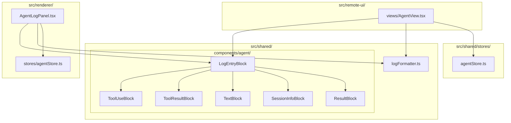
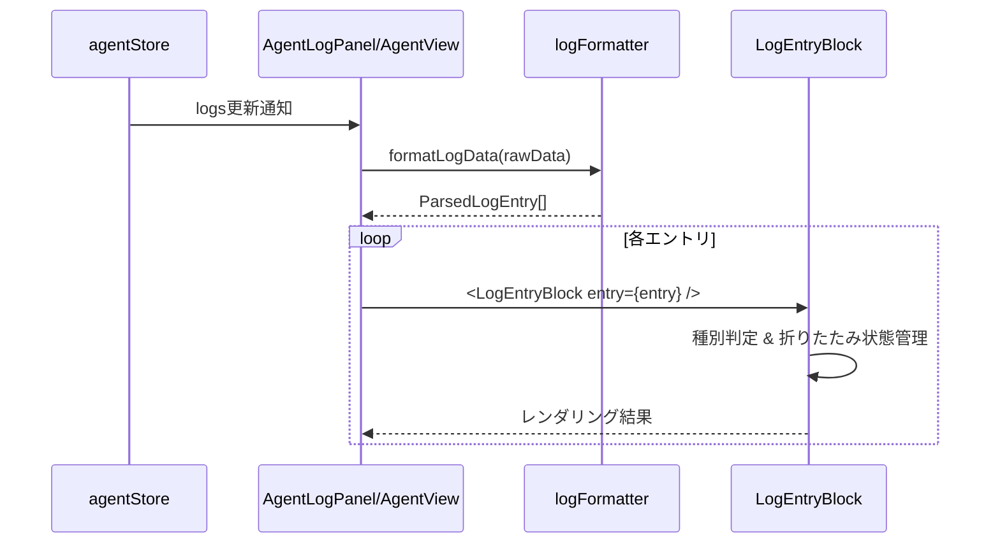
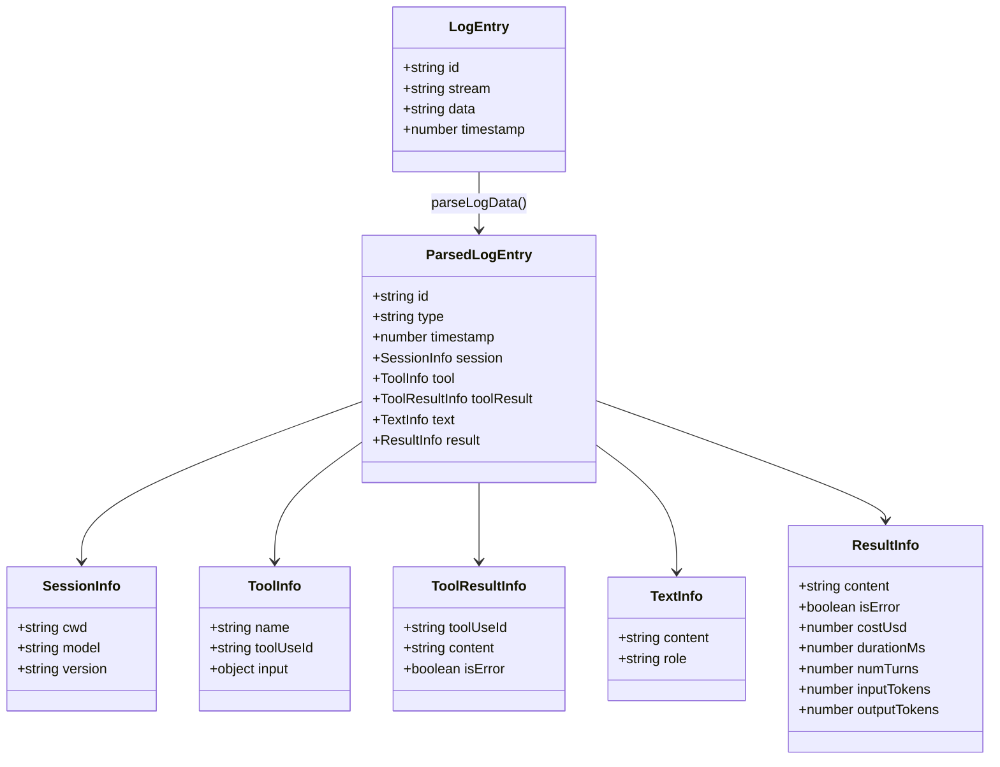

# Design: Agent Log UI Improvement

## Overview

**Purpose**: この機能は、AgentログエリアのUI品質を向上させ、ユーザーに見やすく情報量豊かなログ表示を提供する。

**Users**: Spec/Bug開発者、Remote UIユーザーが、Claude Codeの実行状況をリアルタイムで監視し、必要な詳細情報に効率的にアクセスできるようになる。

**Impact**: 現在のrenderer専用`AgentLogPanel`とremote-ui専用`AgentView`の表示ロジックを共通コンポーネント化し、truncateベースの情報欠落を折りたたみUIに置き換える。

### Goals

- ツール使用・ツール結果・テキストを折りたたみ可能なUIで表示
- renderer/remote-ui間で共通の表示コンポーネントを使用
- ライト/ダークテーマ両対応
- RAW表示モードを削除しUIをシンプル化

### Non-Goals

- ファイルパスクリックでエディタを開く機能
- Markdownレンダリング（コードブロックのシンタックスハイライト等）
- ログの永続化・エクスポート機能
- ログのフィルタリング・検索機能
- 折りたたみ状態の永続化

## Architecture

### Existing Architecture Analysis

現在のアーキテクチャ:
- **AgentLogPanel** (`src/renderer/components/`): Electron版ログ表示、`logFormatter.ts`でパース・整形
- **AgentView** (`src/remote-ui/views/`): Remote UI版、生ログ表示のみ
- **logFormatter.ts** (`src/renderer/utils/`): Claude stream-jsonのパース、truncate処理
- **agentStore** (`src/renderer/stores/` / `src/shared/stores/`): Agent状態・ログ管理

課題:
- ログ表示ロジックの重複（renderer/remote-ui）
- truncateによる情報欠落
- 絵文字アイコン使用（テーマ非対応）
- ダークテーマ固定

### Architecture Pattern & Boundary Map



**Architecture Integration**:
- Selected pattern: 共通コンポーネントパターン（既存の`AgentListItem`等と同一）
- Domain boundaries: ログパース（logFormatter） / ログ表示（components/agent/） / 状態管理（stores）
- Existing patterns preserved: props-driven設計、Zustandストア、Tailwind CSS
- New components rationale: 折りたたみUI機能のため専用コンポーネントが必要
- Steering compliance: DRY（共通化）、SSOT（shared配置）

### Technology Stack

| Layer | Choice / Version | Role in Feature | Notes |
|-------|------------------|-----------------|-------|
| Frontend | React 19 | コンポーネント描画 | 既存 |
| State | Zustand | ログ・Agent状態管理 | 既存agentStore使用 |
| Styling | Tailwind CSS 4 | テーマ対応スタイリング | `dark:`クラス使用 |
| Icons | Lucide React | ツール種別アイコン | 絵文字から移行 |

## System Flows

### ログ表示フロー



**Key Decisions**:
- ログパースはformatLogDataで一括処理し、コンポーネントは表示に専念
- 折りたたみ状態はコンポーネントローカルで管理（永続化しない）

## Requirements Traceability

| Criterion ID | Summary | Components | Implementation Approach |
|--------------|---------|------------|------------------------|
| 1.1 | 共通コンポーネント配置 | `LogEntryBlock`, `ToolUseBlock`, `ToolResultBlock`, `TextBlock`, `SessionInfoBlock`, `ResultBlock` | 新規実装: `src/shared/components/agent/` |
| 1.2 | 両環境で同一コンポーネント使用 | `AgentLogPanel`, `AgentView` | 既存修正: shared コンポーネントをimport |
| 1.3 | logFormatterパース機能維持 | `logFormatter.ts` | 既存修正: 共有配置へ移動、型定義拡張 |
| 2.1 | ツール使用デフォルト折りたたみ | `ToolUseBlock` | 新規実装: useState(false) |
| 2.2 | クリックで詳細展開 | `ToolUseBlock` | 新規実装: onClick handler |
| 2.3 | 折りたたみ時サマリー表示 | `ToolUseBlock` | 新規実装: ツール別サマリー関数 |
| 2.4 | ツール別最適化表示 | `ToolUseBlock` | 既存拡張: formatToolContent拡張 |
| 2.5 | Lucideアイコン使用 | `ToolUseBlock` | 新規実装: TOOL_ICONSをLucideに置換 |
| 3.1 | ツール結果デフォルト折りたたみ | `ToolResultBlock` | 新規実装: useState(false) |
| 3.2 | クリックで全内容展開 | `ToolResultBlock` | 新規実装: onClick handler |
| 3.3 | エラー状態強調表示 | `ToolResultBlock` | 新規実装: isError prop判定 |
| 3.4 | 結果有無インジケーター | `ToolResultBlock` | 新規実装: アイコン + 状態表示 |
| 4.1 | 10行未満は展開表示 | `TextBlock` | 新規実装: 行数判定ロジック |
| 4.2 | 10行以上は折りたたみ | `TextBlock` | 新規実装: useState + 条件付きレンダリング |
| 4.3 | truncateしない | `TextBlock`, `logFormatter` | 既存修正: truncate関数呼び出し削除 |
| 4.4 | 改行・ホワイトスペース保持 | `TextBlock` | 新規実装: `whitespace-pre-wrap` |
| 5.1 | セッション情報表示 | `SessionInfoBlock` | 新規実装: cwd, model, version表示 |
| 5.2 | 視覚的区別 | `SessionInfoBlock` | 新規実装: 専用スタイル |
| 6.1 | 成功/エラー状態表示 | `ResultBlock` | 新規実装: is_error判定 |
| 6.2 | 統計情報表示 | `ResultBlock` | 既存拡張: duration, cost, tokens |
| 6.3 | エラーメッセージ強調 | `ResultBlock` | 新規実装: エラー用スタイル |
| 7.1 | ダーク/ライト両対応 | 全新規コンポーネント | 新規実装: `dark:`クラス |
| 7.2 | Tailwind dark:クラス使用 | 全新規コンポーネント | 新規実装 |
| 7.3 | テーマ別コントラスト | 全新規コンポーネント | 新規実装: 配色設計 |
| 8.1 | RAW表示切替削除 | `AgentLogPanel` | 既存修正: isFormatted state削除 |
| 8.2 | 整形表示のみ提供 | `AgentLogPanel` | 既存修正: RAW分岐削除 |
| 9.1 | 自動スクロール維持 | `AgentLogPanel`, `AgentView` | 既存維持 |
| 9.2 | コピー機能維持 | `AgentLogPanel` | 既存維持 |
| 9.3 | クリア機能維持 | `AgentLogPanel` | 既存維持 |
| 9.4 | トークン集計表示維持 | `AgentLogPanel` | 既存維持 |
| 9.5 | ローディングインジケーター維持 | `AgentLogPanel` | 既存維持 |

### Coverage Validation Checklist

- [x] Every criterion ID from requirements.md appears in the table above
- [x] Each criterion has specific component names (not generic references)
- [x] Implementation approach distinguishes "reuse existing" vs "new implementation"
- [x] User-facing criteria specify concrete UI components

## Components and Interfaces

| Component | Domain/Layer | Intent | Req Coverage | Key Dependencies | Contracts |
|-----------|--------------|--------|--------------|------------------|-----------|
| logFormatter | Shared/Utils | Claude stream-jsonパースと構造化 | 1.3, 4.3 | - | - |
| LogEntryBlock | Shared/UI | ログエントリの種別判定とルーティング | 1.1, 1.2 | logFormatter (P0) | Props |
| ToolUseBlock | Shared/UI | ツール使用の折りたたみ表示 | 2.1-2.5 | LogEntryBlock (P0) | Props |
| ToolResultBlock | Shared/UI | ツール結果の折りたたみ表示 | 3.1-3.4 | LogEntryBlock (P0) | Props |
| TextBlock | Shared/UI | Claudeテキスト応答の表示 | 4.1-4.4 | LogEntryBlock (P0) | Props |
| SessionInfoBlock | Shared/UI | セッション開始情報の表示 | 5.1-5.2 | LogEntryBlock (P0) | Props |
| ResultBlock | Shared/UI | 完了・エラー状態の表示 | 6.1-6.3 | LogEntryBlock (P0) | Props |
| AgentLogPanel | Renderer/UI | Electron版ログパネル統合 | 7.1-7.3, 8.1-8.2, 9.1-9.5 | LogEntryBlock (P0), agentStore (P0) | Props |
| AgentView | RemoteUI/UI | Remote UI版ログ表示統合 | 7.1-7.3, 9.1 | LogEntryBlock (P0), ApiClient (P0) | Props |

### Shared / Utils

#### logFormatter

| Field | Detail |
|-------|--------|
| Intent | Claude stream-json出力をパースし、型付きログエントリを生成 |
| Requirements | 1.3, 4.3 |

**Responsibilities & Constraints**
- stream-json形式のパース処理
- ログ種別（tool_use, tool_result, text, system, result）の判定
- truncate処理の廃止（折りたたみUIに委譲）

**Dependencies**
- Inbound: AgentLogPanel, AgentView (P0)

**Contracts**: Service [x]

##### Service Interface

```typescript
/** パース済みログエントリの型定義 */
export interface ParsedLogEntry {
  id: string;
  type: 'system' | 'assistant' | 'tool_use' | 'tool_result' | 'result' | 'text' | 'error' | 'input';
  timestamp?: number;
  // system/init
  session?: {
    cwd?: string;
    model?: string;
    version?: string;
  };
  // tool_use
  tool?: {
    name: string;
    toolUseId?: string;
    input?: Record<string, unknown>;
  };
  // tool_result
  toolResult?: {
    toolUseId: string;
    content: string;
    isError: boolean;
  };
  // text (assistant/user)
  text?: {
    content: string;
    role: 'assistant' | 'user';
  };
  // result
  result?: {
    content: string;
    isError: boolean;
    costUsd?: number;
    durationMs?: number;
    numTurns?: number;
    inputTokens?: number;
    outputTokens?: number;
  };
}

/** 生ログデータをパースしてParsedLogEntry配列を返す */
export function parseLogData(data: string): ParsedLogEntry[];

/** 色クラスを取得（テーマ対応） */
export function getColorClass(type: ParsedLogEntry['type'], variant?: 'text' | 'bg' | 'border'): string;
```

- Preconditions: dataは文字列（空文字列可）
- Postconditions: パース失敗時は空配列または'text'タイプのエントリを返す
- Invariants: 入力データを変更しない

**Implementation Notes**
- Integration: 既存`formatLogData`をリファクタリング、型定義を拡張
- Validation: JSON.parse失敗時のフォールバック処理
- Risks: stream-json形式の仕様変更

### Shared / UI Components

#### LogEntryBlock

| Field | Detail |
|-------|--------|
| Intent | ログエントリの種別を判定し、適切なブロックコンポーネントにルーティング |
| Requirements | 1.1, 1.2 |

**Responsibilities & Constraints**
- ParsedLogEntryのtype判定
- 対応するブロックコンポーネントへの委譲
- 共通スタイル（余白、境界線）の適用

**Dependencies**
- Inbound: AgentLogPanel, AgentView (P0)
- Outbound: ToolUseBlock, ToolResultBlock, TextBlock, SessionInfoBlock, ResultBlock (P0)

**Contracts**: Props [x]

```typescript
export interface LogEntryBlockProps {
  entry: ParsedLogEntry;
  /** 折りたたみ状態管理用（オプショナル、デフォルトは内部管理） */
  defaultExpanded?: boolean;
}
```

**Implementation Notes**
- Integration: switch文でtype判定、各ブロックへprops転送
- Validation: 不明なtypeは'text'として表示

#### ToolUseBlock

| Field | Detail |
|-------|--------|
| Intent | ツール使用ブロックを折りたたみ可能な形式で表示 |
| Requirements | 2.1, 2.2, 2.3, 2.4, 2.5 |

**Responsibilities & Constraints**
- デフォルト折りたたみ状態の管理
- ツール名とサマリーの常時表示
- 展開時の詳細（入力パラメータ）表示
- ツール種別に応じたアイコン表示

**Dependencies**
- Inbound: LogEntryBlock (P0)
- External: lucide-react (P1)

**Contracts**: Props [x]

```typescript
export interface ToolUseBlockProps {
  tool: {
    name: string;
    toolUseId?: string;
    input?: Record<string, unknown>;
  };
  defaultExpanded?: boolean;
}

/** ツール種別とLucideアイコンのマッピング */
export const TOOL_ICONS: Record<string, React.ComponentType<{ className?: string }>> = {
  Read: FileText,
  Edit: Pencil,
  Write: FileOutput,
  Bash: Terminal,
  Glob: Search,
  Grep: SearchCode,
  Task: ListTodo,
  WebFetch: Globe,
  WebSearch: Search,
  // ...
};
```

**Implementation Notes**
- Integration: useState(false)で折りたたみ管理、ChevronDown/ChevronRightでインジケーター
- Validation: input未定義時は空オブジェクト扱い

#### ToolResultBlock

| Field | Detail |
|-------|--------|
| Intent | ツール結果を折りたたみ可能な形式で表示し、エラー状態を視覚的に強調 |
| Requirements | 3.1, 3.2, 3.3, 3.4 |

**Responsibilities & Constraints**
- デフォルト折りたたみ状態の管理
- エラー状態の視覚的強調（赤色背景/枠線）
- 結果有無とエラー状態のインジケーター表示

**Dependencies**
- Inbound: LogEntryBlock (P0)
- External: lucide-react (P1)

**Contracts**: Props [x]

```typescript
export interface ToolResultBlockProps {
  toolResult: {
    toolUseId: string;
    content: string;
    isError: boolean;
  };
  defaultExpanded?: boolean;
}
```

**Implementation Notes**
- Integration: isError時は`bg-red-50 dark:bg-red-900/20 border-red-300`等を適用
- Validation: content空文字列は「(結果なし)」表示

#### TextBlock

| Field | Detail |
|-------|--------|
| Intent | Claudeのテキスト応答を行数に応じて折りたたみ可能な形式で表示 |
| Requirements | 4.1, 4.2, 4.3, 4.4 |

**Responsibilities & Constraints**
- 10行以上の場合のみ折りたたみ（デフォルト折りたたみ）
- 10行未満は常に展開状態
- 改行・ホワイトスペースの保持
- truncateしない

**Dependencies**
- Inbound: LogEntryBlock (P0)
- External: lucide-react (P1)

**Contracts**: Props [x]

```typescript
export interface TextBlockProps {
  text: {
    content: string;
    role: 'assistant' | 'user';
  };
  /** 折りたたみ閾値（デフォルト: 10行） */
  foldThreshold?: number;
  defaultExpanded?: boolean;
}
```

**Implementation Notes**
- Integration: content.split('\n').length で行数判定
- Validation: 空文字列は非表示

#### SessionInfoBlock

| Field | Detail |
|-------|--------|
| Intent | セッション開始情報（作業ディレクトリ、モデル、バージョン）を視覚的に区別して表示 |
| Requirements | 5.1, 5.2 |

**Responsibilities & Constraints**
- cwd, model, versionの構造化表示
- 他のログエントリとの視覚的区別

**Dependencies**
- Inbound: LogEntryBlock (P0)
- External: lucide-react (P1)

**Contracts**: Props [x]

```typescript
export interface SessionInfoBlockProps {
  session: {
    cwd?: string;
    model?: string;
    version?: string;
  };
}
```

**Implementation Notes**
- Integration: 専用の背景色（`bg-cyan-50 dark:bg-cyan-900/20`）で区別
- Validation: 全フィールドundefined時は非表示

#### ResultBlock

| Field | Detail |
|-------|--------|
| Intent | タスク完了状態と統計情報を表示し、エラー時は強調表示 |
| Requirements | 6.1, 6.2, 6.3 |

**Responsibilities & Constraints**
- 成功/エラー状態の明確な表示
- 統計情報（所要時間、コスト、トークン使用量）の表示
- エラーメッセージの強調表示

**Dependencies**
- Inbound: LogEntryBlock (P0)
- External: lucide-react (P1)

**Contracts**: Props [x]

```typescript
export interface ResultBlockProps {
  result: {
    content: string;
    isError: boolean;
    costUsd?: number;
    durationMs?: number;
    numTurns?: number;
    inputTokens?: number;
    outputTokens?: number;
  };
}
```

**Implementation Notes**
- Integration: isError時はCheckCircleの代わりにXCircle、赤色スタイル
- Validation: 統計フィールドはundefined時に非表示

### Renderer / UI

#### AgentLogPanel (修正)

| Field | Detail |
|-------|--------|
| Intent | Electron版ログパネルで共通コンポーネントを使用し、RAW表示を削除 |
| Requirements | 7.1-7.3, 8.1-8.2, 9.1-9.5 |

**Responsibilities & Constraints**
- LogEntryBlockを使用したログ表示
- RAW表示モードの削除（isFormatted state削除）
- 自動スクロール、コピー、クリア機能の維持
- トークン集計表示の維持

**Dependencies**
- Outbound: LogEntryBlock (P0), logFormatter (P0)
- Inbound: agentStore (P0)

**Implementation Notes**
- Integration: FormattedLogLineDisplayをLogEntryBlockに置換
- Validation: 既存テストの更新が必要

### RemoteUI / UI

#### AgentView (修正)

| Field | Detail |
|-------|--------|
| Intent | Remote UI版ログ表示で共通コンポーネントを使用 |
| Requirements | 7.1-7.3, 9.1 |

**Responsibilities & Constraints**
- LogEntryBlockを使用したログ表示
- 生ログ表示からパース済み表示への移行
- 自動スクロールの維持

**Dependencies**
- Outbound: LogEntryBlock (P0), logFormatter (P0)
- Inbound: ApiClient (P0)

**Implementation Notes**
- Integration: 現在の生ログ表示をLogEntryBlock使用に変更
- Validation: 既存テストの更新が必要

## Data Models

### Domain Model



**Business Rules & Invariants**:
- LogEntryは生データを保持、ParsedLogEntryは構造化データを保持
- typeフィールドは必須、他のフィールドはtypeに応じてオプショナル

## Error Handling

### Error Strategy

- JSONパース失敗: 'text'タイプとして生データを表示（graceful degradation）
- 不明なイベントタイプ: 'text'タイプとして表示
- 空データ: 非表示（UIノイズ削減）

### Error Categories and Responses

**User Errors**: なし（入力なし）

**System Errors**:
- stream-jsonパース失敗 → 生データをテキストとして表示
- コンポーネントレンダリングエラー → ErrorBoundaryでキャッチ

## Testing Strategy

### Unit Tests

1. `logFormatter.test.ts`: parseLogData関数の各イベントタイプパース
2. `ToolUseBlock.test.tsx`: 折りたたみ状態切り替え、ツール別表示
3. `ToolResultBlock.test.tsx`: エラー状態表示、折りたたみ動作
4. `TextBlock.test.tsx`: 行数判定、折りたたみ閾値
5. `LogEntryBlock.test.tsx`: タイプ別ルーティング

### Integration Tests

1. `AgentLogPanel.test.tsx`: 共通コンポーネント統合、RAW表示削除確認
2. `AgentView.test.tsx`: Remote UIでの共通コンポーネント使用

### E2E Tests

1. ログ表示の折りたたみ/展開操作
2. テーマ切り替え時の表示確認
3. 自動スクロール動作確認

## Design Decisions

### DD-001: 共通コンポーネントの配置場所

| Field | Detail |
|-------|--------|
| Status | Accepted |
| Context | renderer/remote-ui間でログ表示を共通化する必要がある |
| Decision | `src/shared/components/agent/`配下に新規コンポーネントを配置 |
| Rationale | 既存の共通化パターン（AgentListItem等）に従い、一貫性を維持 |
| Alternatives Considered | 1) renderer/componentsに配置しre-export → remote-uiへの依存方向が逆 2) 新規shared/logsディレクトリ → 既存パターンと不整合 |
| Consequences | shared/components/agent/のファイル数増加、index.tsの更新が必要 |

### DD-002: 折りたたみ状態管理

| Field | Detail |
|-------|--------|
| Status | Accepted |
| Context | 折りたたみ状態をどこで管理するか（store vs component local） |
| Decision | 各ブロックコンポーネント内でuseStateによるローカル管理 |
| Rationale | 1) 永続化不要（requirements決定） 2) グローバルstate汚染回避 3) コンポーネント自己完結 |
| Alternatives Considered | 1) Zustand storeで管理 → 過剰な複雑さ 2) 親コンポーネントで一括管理 → propsドリリング |
| Consequences | ページリロードで折りたたみ状態リセット、将来の永続化対応時はリファクタリング必要 |

### DD-003: logFormatterの配置移動

| Field | Detail |
|-------|--------|
| Status | Accepted |
| Context | 現在renderer/utilsにあるlogFormatterをremote-uiでも使用する必要 |
| Decision | `src/shared/utils/logFormatter.ts`へ移動、renderer側はre-export |
| Rationale | SSOT原則、両環境で同一パースロジック使用 |
| Alternatives Considered | 1) コピーして配置 → DRY違反 2) renderer/utilsからimport → shared→rendererの依存方向違反 |
| Consequences | renderer側の既存importパスは互換性維持のためre-export |

### DD-004: truncate廃止と折りたたみUI採用

| Field | Detail |
|-------|--------|
| Status | Accepted |
| Context | 現在のtruncate（40-100文字）で情報が失われる問題 |
| Decision | truncateを廃止し、折りたたみUIで全文表示可能にする |
| Rationale | 1) 情報欠落の解消 2) Claudix（VSCode拡張参考実装）のパターン採用 3) ユーザーが必要に応じて詳細確認可能 |
| Alternatives Considered | 1) truncate長を増やす → 根本解決にならない 2) ホバーで全文表示 → モバイル非対応 |
| Consequences | UIの垂直スペース増加（折りたたみで軽減）、折りたたみ操作の追加学習コスト |

### DD-005: 絵文字からLucide Reactアイコンへの移行

| Field | Detail |
|-------|--------|
| Status | Accepted |
| Context | 現在の絵文字（📖, 💻, 🔍等）はテーマ対応が困難 |
| Decision | Lucide Reactアイコンに統一 |
| Rationale | 1) 他UIコンポーネントとの一貫性 2) ダーク/ライトテーマでの表示品質 3) サイズ・色の細かい制御 |
| Alternatives Considered | 1) 絵文字維持 → テーマ非対応 2) SVGインライン → 保守性低下 |
| Consequences | 絵文字の視覚的馴染みやすさは失われるが、プロフェッショナルな見た目に |

### DD-006: RAW表示モード削除

| Field | Detail |
|-------|--------|
| Status | Accepted |
| Context | 「整形表示/RAW表示」切り替え機能の維持是非 |
| Decision | RAW表示モードを削除し、整形表示のみ提供 |
| Rationale | 1) デバッグ用途は開発者ツールで代替可能 2) UIシンプル化 3) 保守コスト削減 |
| Alternatives Considered | 1) 維持 → 2つの表示モードの保守コスト 2) 設定で非表示化 → 中途半端 |
| Consequences | RAW表示を必要とするデバッグシナリオでは開発者ツールを使用 |

### DD-007: system-reminderタグの除去処理

| Field | Detail |
|-------|--------|
| Status | Deferred |
| Context | claude-cleanでは非verbose時にsystem-reminderタグを除去している |
| Decision | 今回のスコープでは除去処理を行わない |
| Rationale | 1) 要件に明示されていない 2) 折りたたみUIで視覚的ノイズは軽減される 3) 将来の拡張として検討 |
| Alternatives Considered | 1) パース時に除去 → 実装コスト増 2) 表示時にフィルタ → 複雑化 |
| Consequences | system-reminderタグが表示される場合あり、ユーザーからのフィードバックに応じて再検討 |
