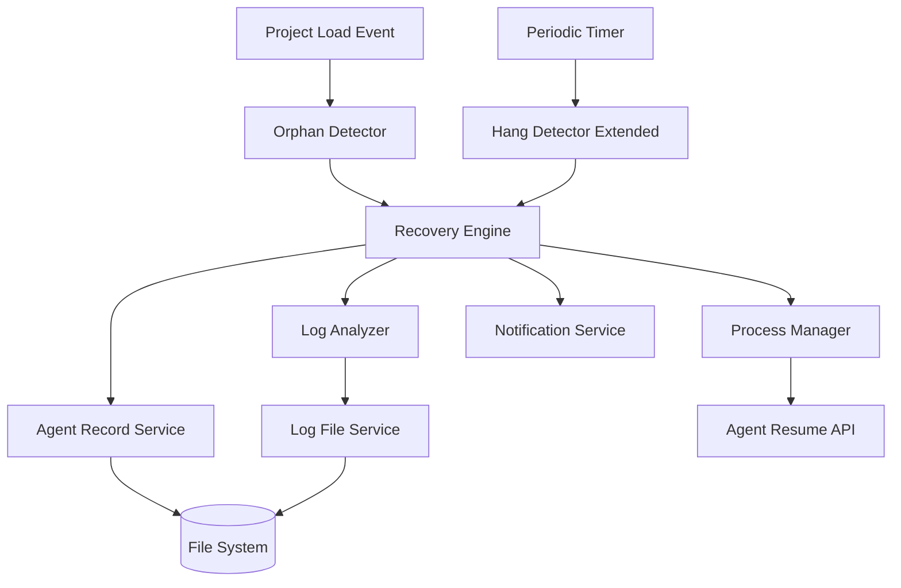
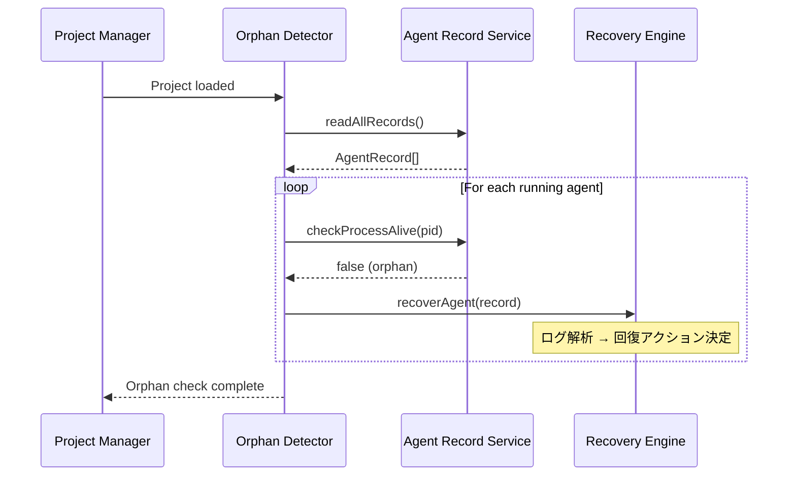
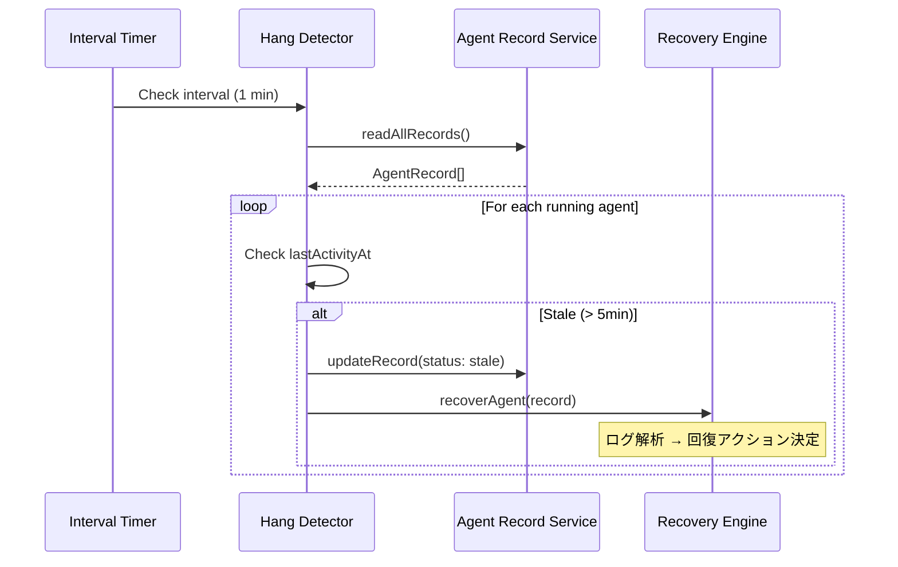
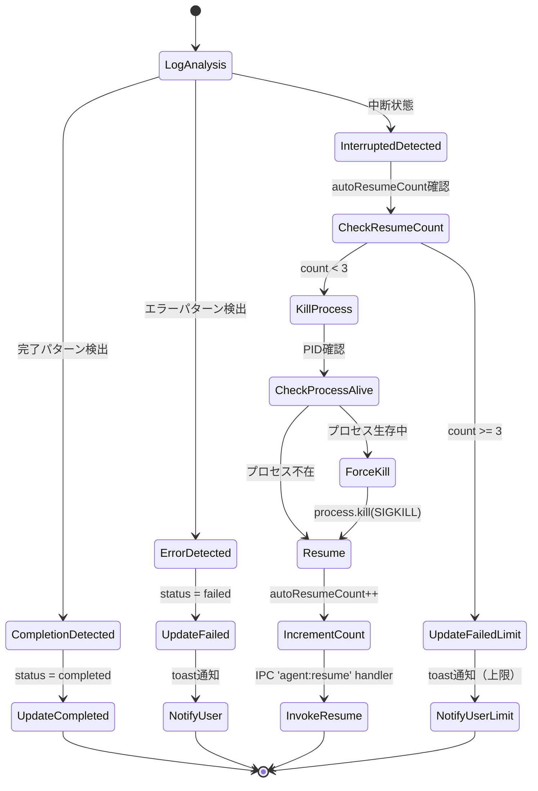

# Design: Agent Stale Recovery

## Overview

本機能は、Agent実行の終了検出に失敗した場合の自動回復機構を提供する。既存の`HangDetector`サービスを拡張し、アプリ起動時のorphan agent検出と定期的なstale agent検出の2つのシナリオに対応する。検出後は、ログ解析に基づいて正常完了・中断状態・エラー終了を判定し、自動的に状態更新またはresumeを実行する。

**Users**: システム（自動実行）およびユーザー（手動resume時の透過的な回復）

**Impact**: 既存のagent管理インフラに対して、起動時sanity checkと回復処理機能を追加する。`HangDetector`の検出ロジックと`agentRecordService`の状態管理を拡張するが、既存のAPIとの互換性は維持する。

### Goals

- アプリ起動時にorphan agentを検出し自動回復する
- 実行中のagentを定期的に監視しstale状態を検出する
- ログ解析により適切な回復アクション（完了／resume／failed）を決定する
- 無限ループを防ぐため自動resume回数を制限する

### Non-Goals

- UI上の警告・操作オプション追加（既存の中止ボタンで対応）
- 自動実行以外の手動実行agentへの個別タイムアウト設定
- Agent recordファイル破損時のリカバリ機構
- Claude CLIハング検知の改善（現状5秒タイムアウト）
- stale検出閾値のUI設定機能

## Architecture

### Existing Architecture Analysis

現在、agent lifecycle管理は以下のコンポーネントで構成されている：

- **AgentRecordService**: Agent metadata（PID、status、lastActivityAt等）のSSOT。ファイルベースでagent状態を永続化
- **HangDetector**: 定期的に`status: running`のagentを監視し、`lastActivityAt`が5分以上更新されていないものを`hang`に遷移させる
- **LogFileService**: Agent出力ログのJSONL形式での記録
- **agentProcess**: Agent起動・監視の実行エンジン

本設計では、既存の`HangDetector`を拡張し、以下の2つの検出シナリオを追加する：

1. **起動時orphan検出**: プロジェクト選択後、`status: running`のagentに対してプロセス生存確認を実行
2. **定期的stale検出**: 既存のHangDetectorロジックを継承し、検出後に回復処理を実行

### Architecture Pattern & Boundary Map



**Architecture Integration**:

- **選択パターン**: イベント駆動 + 定期ポーリングのハイブリッド
- **ドメイン境界**: Agentライフサイクル管理ドメイン内の拡張。新規ドメイン追加なし
- **既存パターン保持**: `HangDetector`の検出ロジック、`AgentRecordService`のSSOT原則、ファイルベース状態管理
- **新規コンポーネント**: `OrphanDetector`（起動時チェック専用）、`RecoveryEngine`（回復処理統合）
- **Steering準拠**: Main Processでのステート保持、SSOT原則、DRY（共通ロジックの再利用）

### Technology Stack

| Layer | Choice / Version | Role in Feature | Notes |
|-------|------------------|-----------------|-------|
| Backend / Services | Node.js 20+ | プロセス管理・ファイル操作 | 既存Node.js APIの利用 |
| Backend / Services | TypeScript 5.8+ | 型安全な実装 | 既存StackへのAgentStatus拡張 |
| Data / Storage | File System | Agent record永続化 | 既存AgentRecordServiceを拡張 |

既存スタックからの逸脱なし。新規依存ライブラリ追加なし。

### HangDetector拡張の既存動作への影響

本機能では、既存の`HangDetector`を拡張し、stale検出時に`status: hang`へ遷移する前に回復処理を挿入する。この変更により、既存の動作に以下の影響がある。

#### 変更内容

| 項目 | 既存動作 | 変更後動作 |
|-----|---------|----------|
| Stale検出後の状態遷移 | `status: hang`に遷移 | `status: hang`遷移前にRecoveryEngineが回復処理を実行 |
| 回復成功時 | N/A（hang遷移のみ） | `status: completed`または`status: resumed`に遷移 |
| 回復失敗時 | N/A（hang遷移のみ） | `status: failed`に遷移 |

#### 影響範囲

**UI表示への影響**:
- 回復成功時: `hang`アイコンが表示されず、`completed`アイコンまたはagent再実行が開始される
- 回復失敗時: `hang`アイコンが表示されず、代わりに`failed`アイコン（赤）が表示される
- **結果**: ユーザーには`hang`状態が見えなくなるが、代わりに自動回復の結果（成功／失敗）が表示される

**ログ出力への影響**:
- hang検出ログの代わりに、回復処理ログ（orphan検出、ログ解析、resume実行等）が出力される
- 回復処理が失敗した場合のみ、`RecoveryEngine`がエラーログを出力し、その後`hang`に遷移する可能性がある

**後方互換性**:
- 既存の`status: hang`のagent recordは、アプリ起動時のorphan検出対象外となる（`status: running`のみが対象）
- **対処**: 既存のhang状態のagentは手動resumeが必要であることをドキュメント化

**HangDetectorのコールバックへの影響**:
- 既存の`onHangDetected(callback)`コールバックは、回復処理が失敗した場合のみ呼ばれる
- 回復成功時はコールバックがトリガーされない

## System Flows

### Orphan Detection on Project Load



**Flow決定事項**:
- プロジェクト選択完了時にorphan検出を1回実行（非定期）
- 既存の`AgentRecordService.readAllRecords()`を使用してすべてのagent recordを取得
- `status: running`かつプロセスが存在しないものをorphanと判定
- 検出後は即座に`RecoveryEngine`に委譲し、後続のログ解析・回復処理を実行

### Stale Detection (Periodic)



**Flow決定事項**:
- 既存の`HangDetector`を拡張し、`hang`に遷移する前に`RecoveryEngine`を呼び出す
- Stale判定基準は`lastActivityAt`が5分以上更新されていないこと（既存の`HangDetector.thresholdMs`を使用）
- 定期チェック間隔はデフォルト1分（設定可能）

### Recovery Flow



**Flow決定事項**:
- ログ解析は既存の`auto-execution-completion-detection`と同じロジックを再利用（`specsWatcherService.ts`を参考）
- エラーパターンはログ最終行に`"error"`または`"failed"`を含む場合と定義
- `status: interrupted`のagentは回復対象外（ユーザー意図による中断）
- プロセスKillは`process.kill(pid, 'SIGKILL')`で実施
- Resume試行回数は`AgentRecord.autoResumeCount`フィールドで追跡
- Resume実行はIPC handler 'agent:resume' (IPC_CHANNELS.RESUME_AGENT)経由で既存resumeAgent機能を呼び出し

## Requirements Traceability

| Criterion ID | Summary | Components | Implementation Approach |
|--------------|---------|------------|------------------------|
| 1.1 | プロジェクト選択後、orphan検出処理を実行 | OrphanDetector, ProjectManager | 新規実装: project load eventでOrphanDetectorをトリガー |
| 1.2 | `checkProcessAlive(pid)`でプロセス生存確認 | AgentRecordService.checkProcessAlive | 既存再利用: agentRecordService.tsに既存 |
| 1.3 | プロセス不在時、Requirement 4の回復処理を実行 | RecoveryEngine | 新規実装: orphan検出時にRecoveryEngineを呼び出し |
| 1.4 | 検出・回復結果をログ出力 | OrphanDetector, RecoveryEngine | 新規実装: loggingServiceを使用してログ出力 |
| 2.1 | 約1分間隔で定期的にstale検出処理を実行 | HangDetector (extended) | 拡張: 既存HangDetectorのintervalMsを使用 |
| 2.2 | `status: running`で`lastActivityAt`が5分以上更新されていないものをstale判定 | HangDetector (extended) | 拡張: 既存thresholdMsロジックを使用 |
| 2.3 | stale判定後、Requirement 4の回復処理を実行 | HangDetector (extended), RecoveryEngine | 拡張: hang遷移前にRecoveryEngineを呼び出し |
| 2.4 | プロジェクト切り替え時・アプリ終了時に定期チェックを停止 | HangDetector (extended) | 拡張: 既存stop()メソッドを使用 |
| 2.5 | チェック間隔は設定可能、デフォルト1分 | HangDetector (extended) | 拡張: 既存intervalMs設定を使用 |
| 3.1 | stale/orphan検出時、ログファイルを解析 | LogAnalyzer | 新規実装: LogFileServiceを使用してログ読み込み |
| 3.2 | ログに完了パターンが存在する場合、正常完了と判断 | LogAnalyzer.detectCompletion | 新規実装: specsWatcherServiceの完了検出ロジックを移植 |
| 3.3 | ログ最終行がエラーパターンの場合、エラー終了と判断 | LogAnalyzer.detectError | 新規実装: エラーパターンマッチング |
| 3.4 | 上記以外（ログ途中停止、ユーザー中断でない）は中断状態と判断 | LogAnalyzer.determineRecoveryAction | 新規実装: デフォルトロジック |
| 3.5 | `status: interrupted`のagentは回復対象外 | RecoveryEngine | 新規実装: status事前チェック |
| 4.1 | ログ解析結果が「正常完了」の場合、`status: completed`に更新 | RecoveryEngine.handleCompletion | 新規実装: AgentRecordService.updateRecord使用 |
| 4.2 | ログ解析結果が「中断状態」の場合、自動resumeを試行 | RecoveryEngine.handleInterrupted | 新規実装: プロセスKill → resume フロー |
| 4.3 | `checkProcessAlive(pid)`でプロセス生存確認 | AgentRecordService.checkProcessAlive | 既存再利用 |
| 4.4 | 生存中の場合、`process.kill(pid, 'SIGKILL')`で強制終了 | RecoveryEngine.killProcess | 新規実装: Node.js process.killを使用 |
| 4.5 | 既存の`resumeAgent`機能を使用してresume | IPC handler 'agent:resume' (IPC_CHANNELS.RESUME_AGENT) | 既存再利用: IPC handler 'agent:resume'経由でresume実行 |
| 4.6 | ログ解析結果が「エラー終了」の場合、`status: failed`に更新 | RecoveryEngine.handleError | 新規実装: AgentRecordService.updateRecord使用 |
| 4.7 | `failed`更新時、toast通知でユーザーに通知 | RecoveryEngine, NotificationService | 新規実装: 既存toast APIを使用 |
| 5.1 | 同一agentに対する自動resume試行回数を記録 | AgentRecord.autoResumeCount | 新規実装: AgentRecordにフィールド追加 |
| 5.2 | 自動resume試行回数が3回を超えた場合、`status: failed`に更新 | RecoveryEngine.checkResumeLimit | 新規実装: カウントチェック |
| 5.3 | `failed`更新時、toast通知で「自動回復の試行回数上限」を通知 | RecoveryEngine, NotificationService | 新規実装: 既存toast APIを使用 |
| 5.4 | 手動resume時または新規実行時に`autoResumeCount`を0にリセット | AgentRecordService.writeRecord | 拡張: writeRecord時にリセット |
| 6.1 | `status: failed`のagentは既存のfailedアイコン（赤）で表示 | UI (既存) | 既存再利用: UI変更不要 |
| 6.2 | stale検出による`failed`更新時、toast通知を表示 | RecoveryEngine, NotificationService | 新規実装: 4.7, 5.3と共通実装 |
| 6.3 | toast通知にはagentIdを含め、識別可能とする | NotificationService | 新規実装: 通知メッセージにagentId埋め込み |

### Coverage Validation Checklist

- [x] Every criterion ID from requirements.md appears in the table above
- [x] Each criterion has specific component names (not generic references)
- [x] Implementation approach distinguishes "reuse existing" vs "new implementation"
- [x] User-facing criteria (6.x) specify concrete UI components (toast notification via NotificationService)

## Components and Interfaces

### Component Summary

| Component | Domain/Layer | Intent | Req Coverage | Key Dependencies (P0/P1) | Contracts |
|-----------|--------------|--------|--------------|--------------------------|-----------|
| OrphanDetector | Main/Services | 起動時orphan agent検出 | 1.1, 1.2, 1.3, 1.4 | AgentRecordService (P0), RecoveryEngine (P0) | Service |
| HangDetector (extended) | Main/Services | 定期的stale agent検出 | 2.1, 2.2, 2.3, 2.4, 2.5 | AgentRecordService (P0), RecoveryEngine (P0) | Service |
| RecoveryEngine | Main/Services | 回復処理統合 | 3.5, 4.1, 4.2, 4.4, 4.6, 4.7, 5.2, 5.3 | LogAnalyzer (P0), AgentRecordService (P0), NotificationService (P0), AgentResume API (P0) | Service |
| LogAnalyzer | Main/Services | ログ解析・回復アクション決定 | 3.1, 3.2, 3.3, 3.4 | LogFileService (P0) | Service |
| AgentRecordService (extended) | Main/Services | Agent record管理・autoResumeCount追跡 | 1.2, 4.3, 5.1, 5.4 | FileSystem (P0) | State |

### Main / Services

#### OrphanDetector

| Field | Detail |
|-------|--------|
| Intent | プロジェクト選択後にorphan agentを検出し回復処理をトリガー |
| Requirements | 1.1, 1.2, 1.3, 1.4 |

**Responsibilities & Constraints**
- プロジェクト選択完了イベントをリッスンし、1回限りのorphan検出を実行
- `status: running`のagent recordに対してプロセス生存確認を実行
- orphan検出時に`RecoveryEngine`に委譲
- トランザクション境界: 検出処理は非同期だが、プロジェクト選択完了までブロックしない

**Dependencies**
- Inbound: ProjectManager — プロジェクト選択完了イベント受信 (P0)
- Outbound: AgentRecordService — agent record読み込み・プロセス生存確認 (P0)
- Outbound: RecoveryEngine — 回復処理実行 (P0)

**Contracts**: Service [x]

##### Service Interface

```typescript
interface OrphanDetectorService {
  /**
   * プロジェクト選択後にorphan agentを検出し回復処理を実行
   * @param projectPath プロジェクトルートパス
   */
  detectOrphans(projectPath: string): Promise<void>;
}
```

- Preconditions: `AgentRecordService`が初期化済みであること
- Postconditions: すべてのorphan agentに対して回復処理が実行される
- Invariants: プロジェクト切り替え時に再実行される

**Implementation Notes**
- Integration: ProjectManagerのproject load完了イベントハンドラに登録
- Validation: `status: running`のagentのみを対象とし、interrupted/completed/failedは除外
- Risks: orphan検出に時間がかかる場合、プロジェクト選択後のUI描画が遅延する可能性（非同期実行で軽減）

#### HangDetector (Extended)

| Field | Detail |
|-------|--------|
| Intent | 定期的にstale agentを検出し、hang遷移前に回復処理をトリガー |
| Requirements | 2.1, 2.2, 2.3, 2.4, 2.5 |

**Responsibilities & Constraints**
- 既存の`HangDetector`クラスを拡張し、`hang`遷移前に`RecoveryEngine`を呼び出す
- `lastActivityAt`が5分以上更新されていないagentをstale判定
- プロジェクト切り替え時・アプリ終了時に定期チェックを停止
- トランザクション境界: 各チェックサイクルは独立しており、失敗しても次回チェックで再試行

**Dependencies**
- Inbound: IntervalTimer — 定期実行トリガー (P0)
- Outbound: AgentRecordService — agent record読み込み (P0)
- Outbound: RecoveryEngine — 回復処理実行 (P0)

**Contracts**: Service [x]

##### Service Interface

```typescript
// 既存HangDetectorインターフェースを拡張
class HangDetector {
  /**
   * 既存メソッド（変更なし）
   */
  start(thresholdMs?: number, intervalMs?: number): void;
  stop(): void;
  setThreshold(thresholdMs: number): void;
  onHangDetected(callback: HangCallback): void;

  /**
   * 拡張: hang検出時に回復処理をトリガー
   * @internal checkForHangingAgents内で呼び出し
   */
  private async recoverStaleAgent(record: AgentRecord): Promise<void>;
}
```

- Preconditions: `start()`が呼ばれていること、`RecoveryEngine`が初期化済みであること
- Postconditions: Stale agentは`hang`に遷移する前に回復処理が実行される
- Invariants: プロジェクト選択中のみ実行され、プロジェクト切り替え時に停止する

**Implementation Notes**
- Integration: 既存`checkForHangingAgents()`メソッド内で、`status: hang`に更新する前に`RecoveryEngine.recoverAgent()`を呼び出し
- Validation: 既存のthresholdMs/intervalMs設定を使用し、デフォルト値は変更しない
- Risks: 回復処理が失敗した場合、hang状態への遷移が遅延する可能性（エラーハンドリングで軽減）

#### RecoveryEngine

| Field | Detail |
|-------|--------|
| Intent | ログ解析結果に基づいて適切な回復アクションを実行 |
| Requirements | 3.5, 4.1, 4.2, 4.4, 4.6, 4.7, 5.2, 5.3 |

**Responsibilities & Constraints**
- ログ解析結果（完了／中断／エラー）に応じて回復アクションを分岐
- 自動resume回数制限を管理し、上限到達時は`failed`に遷移
- プロセスKillおよびresume実行を制御
- トランザクション境界: 1つのagentに対する回復処理は不可分（中断時はロールバック不要、次回チェックで再試行）

**Dependencies**
- Inbound: OrphanDetector, HangDetector — 回復処理リクエスト (P0)
- Outbound: LogAnalyzer — ログ解析 (P0)
- Outbound: AgentRecordService — agent record更新 (P0)
- Outbound: NotificationService — toast通知 (P0)
- Outbound: IPC handler 'agent:resume' (IPC_CHANNELS.RESUME_AGENT) — resume実行 (P0)
- Outbound: Mutex Lock (agentId単位) — resume実行前にロック取得 (P0)

**Contracts**: Service [x]

##### Service Interface

```typescript
interface RecoveryEngineService {
  /**
   * Agent回復処理を実行
   * @param record 回復対象のagent record
   * @throws RecoveryError 回復処理失敗時
   */
  recoverAgent(record: AgentRecord): Promise<RecoveryResult>;
}

interface RecoveryResult {
  agentId: string;
  action: 'completed' | 'resumed' | 'failed' | 'limit_exceeded' | 'skipped';
  reason?: string;
}

type RecoveryAction = 'complete' | 'resume' | 'fail';

class RecoveryError extends Error {
  constructor(
    message: string,
    public readonly agentId: string,
    public readonly cause?: Error
  ) {
    super(message);
  }
}
```

- Preconditions: `AgentRecordService`, `LogAnalyzer`, `NotificationService`が初期化済み
- Postconditions: Agent recordの状態が適切に更新され、必要に応じて通知が送信される
- Invariants: `status: interrupted`のagentは処理をスキップする

**Implementation Notes**
- Integration: OrphanDetector/HangDetectorから非同期で呼び出される。失敗時はログ出力し、次回チェックで再試行
- Validation: resume実行前に`autoResumeCount < 3`を確認。プロセスKill前に`checkProcessAlive(pid)`で生存確認
- Concurrency: agentId単位のmutex lockを実装し、resume実行前にロック取得。ロック取得失敗時（既にresume実行中）は処理をスキップ。既存のresumeAgent IPCハンドラにもmutex lockを追加
- Risks: resume実行中に新たなstale検出が発生する可能性（mutex lockで防止）

#### LogAnalyzer

| Field | Detail |
|-------|--------|
| Intent | Agent logファイルを解析し、適切な回復アクションを決定 |
| Requirements | 3.1, 3.2, 3.3, 3.4 |

**Responsibilities & Constraints**
- Agentログファイル（JSONL形式）を読み込み、完了／エラー／中断パターンを検出
- 既存の`auto-execution-completion-detection`ロジックを移植し再利用
- 判定結果を`RecoveryAction`として返却
- トランザクション境界: ログ解析は読み取り専用でステートレス

**Dependencies**
- Inbound: RecoveryEngine — ログ解析リクエスト (P0)
- Outbound: LogFileService — ログファイル読み込み (P0)

**Contracts**: Service [x]

##### Service Interface

```typescript
interface LogAnalyzerService {
  /**
   * Agentログを解析し回復アクションを決定
   * @param specId Spec ID
   * @param agentId Agent ID
   * @returns 回復アクション種別
   */
  analyzeLog(specId: string, agentId: string): Promise<RecoveryAction>;

  /**
   * 完了パターンを検出
   * @param logEntries ログエントリ配列
   * @returns 完了パターンが存在するか
   */
  detectCompletion(logEntries: LogEntry[]): boolean;

  /**
   * エラーパターンを検出
   * @param logEntries ログエントリ配列
   * @returns エラーパターンが存在するか
   */
  detectError(logEntries: LogEntry[]): boolean;
}

interface LogEntry {
  timestamp: string;
  stream: 'stdout' | 'stderr';
  data: string;
}
```

- Preconditions: ログファイルが存在すること（存在しない場合はデフォルトで`resume`アクション）
- Postconditions: ログ解析結果として`complete`、`resume`、`fail`のいずれかを返却
- Invariants: ログファイル読み込みに失敗した場合、デフォルトで`resume`アクション

**Implementation Notes**
- Integration: `LogFileService.getLogFilePath()`でログパス取得 → ファイル読み込み → JSONL解析
- Validation: 完了パターンは既存の`specsWatcherService.ts`の`checkTaskCompletion()`を参考に実装。エラーパターンは最終行に`"error"`または`"failed"`を含む場合
- Risks: ログファイルが巨大な場合、読み込みに時間がかかる可能性（末尾N行のみ読み込む最適化を検討）

#### AgentRecordService (Extended)

| Field | Detail |
|-------|--------|
| Intent | autoResumeCountフィールドを追加し、resume試行回数を追跡 |
| Requirements | 1.2, 4.3, 5.1, 5.4 |

**Responsibilities & Constraints**
- 既存の`AgentRecord`インターフェースに`autoResumeCount`フィールドを追加
- `writeRecord()`時に新規実行なら`autoResumeCount: 0`でリセット
- `checkProcessAlive(pid)`は既存実装をそのまま使用
- トランザクション境界: agent record更新は不可分（ファイルベースのatomic write）

**Dependencies**
- Inbound: OrphanDetector, HangDetector, RecoveryEngine — agent record CRUD (P0)
- Outbound: FileSystem — agent recordファイル永続化 (P0)

**Contracts**: State [x]

##### State Management

- State model: `AgentRecord`に`autoResumeCount?: number`フィールドを追加
- Persistence & consistency: 既存のファイルベース永続化を継承。JSONファイルにautoResumeCountを含める
- Concurrency strategy: 既存のmutexロックを使用して並行更新を防止

```typescript
// 既存AgentRecordインターフェースを拡張
export interface AgentRecord {
  agentId: string;
  specId: string;
  phase: string;
  pid: number;
  sessionId: string;
  status: AgentStatus;
  startedAt: string;
  lastActivityAt: string;
  command: string;
  cwd?: string;
  prompt?: string;
  engineId?: LLMEngineId;
  executions?: ExecutionEntry[];
  /**
   * 自動resume試行回数（agent-stale-recovery機能で追加）
   * undefined = カウント未開始（既存agent recordとの後方互換性）
   * 0 = 新規実行または手動resume後
   * 1-3 = 自動resume試行中
   */
  autoResumeCount?: number;
}
```

**Implementation Notes**
- Integration: 既存の`AgentRecordService`クラスに変更なし。インターフェースのみ拡張
- Validation: `autoResumeCount`がundefinedの場合は0として扱う（既存agent recordとの互換性）
- Risks: 既存のagent recordファイルは`autoResumeCount`を含まないため、読み込み時にundefinedをハンドリング

## Data Models

### Domain Model

本機能は既存のAgentドメインを拡張するものであり、新規エンティティは追加しない。

**エンティティ拡張**:
- **AgentRecord**: `autoResumeCount`フィールドを追加し、自動resume試行回数を追跡

**ビジネスルール**:
- 自動resume試行回数が3回を超えた場合、`status: failed`に遷移し以降の自動resumeは実行しない
- `status: interrupted`のagentは回復処理の対象外（ユーザー意図による中断）
- Orphan検出時およびstale検出時の回復処理は同一のロジックを使用（`RecoveryEngine`に統合）

### Logical Data Model

**Structure Definition**:
- `AgentRecord`エンティティに`autoResumeCount?: number`属性を追加
- `autoResumeCount`は0以上の整数値、undefinedは0と等価に扱う
- リファレンシャル整合性: agent recordはファイルベースで独立しており、外部キー制約なし

**Consistency & Integrity**:
- トランザクション境界: agent record更新は単一ファイル書き込みで不可分
- カスケードルール: agent record削除時に`autoResumeCount`も削除される（ファイル単位で削除）
- 時相側面: `autoResumeCount`は手動resumeまたは新規実行時に0にリセットされる

### Physical Data Model

**For JSON Files**:
- ファイルパス: `.kiro/runtime/agents/{specId}/agent-{id}.json`
- スキーマ: 既存の`AgentRecord`インターフェースに`autoResumeCount`フィールドを追加
- インデックス: なし（ファイルベースのため）
- パーティション戦略: spec IDごとにディレクトリを分割（既存構造を継承）

```json
{
  "agentId": "agent-001",
  "specId": "my-feature",
  "phase": "requirements",
  "pid": 12345,
  "sessionId": "session-uuid",
  "status": "running",
  "startedAt": "2025-11-26T10:00:00Z",
  "lastActivityAt": "2025-11-26T10:05:00Z",
  "command": "claude -p \"/kiro:spec-requirements\"",
  "cwd": "/path/to/project",
  "autoResumeCount": 1
}
```

## Error Handling

### Error Strategy

本機能の回復処理は非クリティカルな補助機能であるため、エラー発生時もユーザー操作をブロックしない。

### Error Categories and Responses

**User Errors** (4xx): 本機能はシステム内部の自動処理のため、ユーザーエラーは発生しない

**System Errors** (5xx):
- **ログファイル読み込み失敗** → デフォルトで`resume`アクションを選択（ログ不在 = 実行開始直後の可能性）
- **Resume API呼び出し失敗** → エラーログ出力し、次回チェック時に再試行
- **Agent record更新失敗** → エラーログ出力し、`status: hang`に遷移（既存のHangDetector動作を維持）

**Business Logic Errors** (422):
- **Resume回数上限到達** → `status: failed`に遷移し、toast通知で「自動回復の試行回数上限に達しました」を表示
- **プロセスKill失敗** → エラーログ出力し、resume実行を試みる（プロセスが既に終了している可能性）

### Error Recovery Flow

以下のエラーケースに対する詳細な処理フローを定義する。

#### ログファイル読み込みエラー詳細

| エラーケース | 処理フロー | 理由 |
|------------|----------|------|
| ファイル不在 | デフォルトで`resume`アクション | ログ不在 = 実行開始直後の可能性 |
| 権限エラー | エラーログ出力し、`resume`アクション | ログ解析不能のため、中断状態と判断 |
| JSONLパース失敗 | エラーログ出力し、`resume`アクション | ログ破損の可能性があるが、resumeで回復試行 |

#### プロセスKill失敗詳細

| エラーケース | 処理フロー | 理由 |
|------------|----------|------|
| SIGKILL失敗 | エラーログ出力し、resume実行を継続 | プロセスが既に終了している可能性（orphan状態のため問題なし） |
| PID不正（ESRCH） | resume実行を継続 | プロセスが既に終了しているため、Kill不要でresume可能 |
| 権限エラー（EPERM） | エラーログ出力し、`failed`に遷移 | 他ユーザーのプロセスをKillできないため、回復不能 |

#### Resume API呼び出しタイムアウト

| エラーケース | 処理フロー | 理由 |
|------------|----------|------|
| タイムアウト | エラーログ出力し、次回チェック時に再試行 | タイムアウト設定は既存resumeAgent APIに依存（本機能のスコープ外） |
| 将来的な実装 | Resume API呼び出し時に明示的なタイムアウト（例: 30秒）を設定 | 無限待機を防ぐ（将来的な改善として検討） |

### Monitoring

- **ログ出力**: すべての回復処理（orphan検出、stale検出、回復アクション実行）を`loggingService`経由でログファイルに記録
- **メトリクス**: 回復処理成功／失敗回数をカウントし、将来的にUIで表示可能にする（本機能のスコープ外、メトリクス拡張として今後実装）

## Testing Strategy

### Unit Tests

- `OrphanDetector.detectOrphans()`: orphan判定ロジックのテスト
  - `status: running`かつプロセス不在のagentを正しく検出
  - `status: interrupted`のagentは除外
- `RecoveryEngine.recoverAgent()`: 回復アクション分岐のテスト
  - ログ解析結果に応じて`completed`／`resumed`／`failed`に正しく遷移
  - `autoResumeCount`上限チェックが正しく動作
- `LogAnalyzer.analyzeLog()`: ログ解析パターンマッチングのテスト
  - 完了パターン検出の正確性
  - エラーパターン検出の正確性
- `AgentRecordService`: `autoResumeCount`フィールドの読み書き
  - undefinedを0として扱う
  - 新規実行時に0にリセット

### Integration Tests

- **Orphan detection → Recovery flow**: プロジェクト選択後にorphan agentが正しく回復される
  - モックAgentRecordを作成し、プロセス不在状態をシミュレート
  - RecoveryEngineが呼ばれ、適切なアクションが実行されることを確認
- **Stale detection → Recovery flow**: 定期チェックでstale agentが検出され回復される
  - `lastActivityAt`を5分以上前に設定したagent recordを作成
  - HangDetectorの定期チェックで回復処理がトリガーされることを確認
- **Resume limit enforcement**: 3回resumeに失敗したagentが`failed`に遷移
  - `autoResumeCount: 2`のagent recordを作成
  - 回復処理実行後、`autoResumeCount: 3`で`status: failed`に遷移することを確認

### E2E Tests

- **アプリ起動時のorphan回復**: アプリ再起動後、前回実行のorphan agentが自動回復される
  - アプリ終了前にagentを起動し、プロセスを手動でKill
  - アプリ再起動後、orphan検出が実行され、適切なアクションが取られることを確認
- **Stale検出と自動resume**: 長時間応答がないagentが自動的にresumeされる
  - Agentを起動し、`lastActivityAt`の更新を停止
  - 5分後にstale検出が実行され、自動resumeされることを確認

## Integration & Deprecation Strategy

### 既存ファイルの変更（wiring points）

| ファイルパス | 変更内容 | 理由 |
|------------|---------|------|
| `electron-sdd-manager/src/main/services/agentRecordService.ts` | `AgentRecord`インターフェースに`autoResumeCount?: number`フィールド追加 | Resume試行回数の追跡 |
| `electron-sdd-manager/src/main/services/hangDetector.ts` | `checkForHangingAgents()`メソッド内で`RecoveryEngine.recoverAgent()`を呼び出し | Stale検出時に回復処理をトリガー |
| `electron-sdd-manager/src/main/ipc/projectHandlers.ts` | プロジェクト選択完了後に`OrphanDetector.detectOrphans()`を呼び出し | アプリ起動時orphan検出のトリガー |
| `electron-sdd-manager/src/renderer/types/electron.d.ts` | `AgentInfo`インターフェースに`autoResumeCount?: number`追加（型定義） | Renderer側での型整合性 |

### 削除対象ファイル

- なし（既存ファイルへの追加のみ）

### リファクタリング方針

- 既存の`HangDetector`は拡張のみで置き換えなし
- 新規コンポーネント（`OrphanDetector`, `RecoveryEngine`, `LogAnalyzer`）は並行して作成
- `AgentRecordService`のインターフェース拡張は後方互換性を維持

## Interface Changes & Impact Analysis

### `AgentRecord`インターフェース変更

**変更内容**: `autoResumeCount?: number`フィールドの追加

**影響を受けるCallers**:

| Caller | ファイルパス | 必要な対応 | 対応内容 |
|--------|------------|----------|---------|
| `AgentRecordService.writeRecord()` | `agentRecordService.ts` | オプショナルフィールドのため影響なし | 新規実行時に`autoResumeCount: 0`を設定（既存実装に追加） |
| `AgentRecordService.readRecord()` | `agentRecordService.ts` | 影響なし | undefinedを許容（既存agent recordとの互換性） |
| `HangDetector.checkForHangingAgents()` | `hangDetector.ts` | 影響なし | `autoResumeCount`を読み取る必要なし |
| UI層（Renderer） | `AgentListPanel.tsx` 等 | 影響なし | `autoResumeCount`は内部状態のためUI表示不要 |

**パラメータ仕様**:
- `autoResumeCount?: number`: オプショナル（既存agent recordとの互換性のためundefinedを許容）
- デフォルト値: undefined（読み取り時は0として扱う）

**Callee修正に対するCaller更新タスク**:
- 既存のCallersは変更不要（オプショナルフィールドのため）
- 新規コンポーネント（`RecoveryEngine`）が`autoResumeCount`を読み書きする際は、undefinedを0として扱う処理を実装

## Integration Test Strategy

本機能は複数コンポーネント間の連携（IPC、ファイルシステム、プロセス管理）を含むため、統合テストが重要。

### Components
- **OrphanDetector** (Main Process)
- **HangDetector** (Main Process)
- **RecoveryEngine** (Main Process)
- **LogAnalyzer** (Main Process)
- **AgentRecordService** (Main Process)
- **Agent Resume API** (IPC)

### Data Flow
1. プロジェクト選択完了 → `OrphanDetector.detectOrphans()` 呼び出し
2. `OrphanDetector` → `AgentRecordService.readAllRecords()` → ファイルシステム読み込み
3. `OrphanDetector` → `AgentRecordService.checkProcessAlive(pid)` → Node.js process.kill(0)
4. `OrphanDetector` → `RecoveryEngine.recoverAgent()` → ログ解析・回復処理
5. `RecoveryEngine` → IPC → Resume API → Agent起動

### Mock Boundaries
- **Mock IPC transport**: IPC通信は実際のElectronプロセス間通信を使用せず、モックで代替
- **Use real AgentRecordService**: ファイルシステム操作は実ファイルを使用（テスト用の一時ディレクトリ）
- **Mock LogFileService**: ログファイル読み込みはモックで代替（テスト用のログエントリを返却）

### Verification Points
- Orphan検出後、`AgentRecord.status`が正しく更新される（`completed`/`failed`/`resumed`）
- `autoResumeCount`が正しくインクリメントされる
- Resume API呼び出しが正しく行われる（モックで呼び出し回数を確認）
- Toast通知が正しく送信される（`NotificationService`のモック呼び出し確認）

### Robustness Strategy
- **非同期タイミング処理**: `waitFor`パターンを使用し、agent record更新が完了するまで待機（固定sleepは避ける）
- **ファイルシステムの非同期性**: ファイル書き込み後、`fs.stat()`で存在確認してから読み込みを実行
- **プロセス生存確認のモック**: `checkProcessAlive()`はモックで常にfalseを返す（orphan状態をシミュレート）

### Prerequisites
- **Mock Agent Record生成ユーティリティ**: テスト用のagent recordを生成するヘルパー関数
- **Mock Log Entry生成ユーティリティ**: テスト用のログエントリを生成するヘルパー関数
- **IPC Mock Infrastructure**: 既存のIPCテストインフラを使用（`test/setup.ts`に記載）

## Design Decisions

### DD-001: Orphan検出とStale検出を分離

| Field | Detail |
|-------|--------|
| Status | Accepted |
| Context | Agent終了検出失敗には、アプリ再起動後のorphan agentと実行中のstale agentの2つのシナリオがある。既存の`HangDetector`はstale検出のみに対応。 |
| Decision | Orphan検出専用の`OrphanDetector`を新規作成し、起動時のみ実行する。Stale検出は既存の`HangDetector`を拡張する。 |
| Rationale | **関心の分離**: Orphan検出は1回限りの処理、Stale検出は定期的な処理であり、責務が異なる。**拡張性**: 将来的にorphan検出の閾値やロジックを独立して調整可能。**テスト容易性**: OrphanDetectorとHangDetectorを独立してテスト可能。 |
| Alternatives Considered | **Alternative 1**: `HangDetector`にorphan検出機能を統合する。**却下理由**: 1回限りの処理と定期処理を同じクラスに含めると責務が曖昧になる。**Alternative 2**: Orphan検出とStale検出を完全に別サービスとして分離する。**却下理由**: 回復処理ロジックが重複する（`RecoveryEngine`に統合することで解決）。 |
| Consequences | **利点**: 関心の分離、テスト容易性向上。**欠点**: コンポーネント数が増える（OrphanDetector + HangDetector + RecoveryEngine）。**Trade-off**: DRY原則を優先し、回復処理ロジックを`RecoveryEngine`に統合することで重複を回避。 |

### DD-002: ログ解析ロジックの移植と再利用

| Field | Detail |
|-------|--------|
| Status | Accepted |
| Context | 既存の`specsWatcherService.ts`に`auto-execution-completion-detection`ロジックが実装されているが、これはファイル監視時の完了検出に特化している。 |
| Decision | `LogAnalyzer`サービスを新規作成し、`specsWatcherService.ts`の完了検出ロジックを移植して再利用する。 |
| Rationale | **SSOT**: 完了検出ロジックを単一のサービスに集約することで、ロジック変更時の影響範囲を限定。**DRY**: 既存の実績あるロジックを再利用し、重複実装を避ける。**一貫性**: ファイル監視時とagent回復時で同じ判定基準を使用。 |
| Alternatives Considered | **Alternative 1**: `specsWatcherService.ts`のロジックをそのまま呼び出す。**却下理由**: `specsWatcherService`はファイル監視に依存しており、agent回復時には不適切。**Alternative 2**: 完了検出ロジックを`RecoveryEngine`内に直接実装する。**却下理由**: `RecoveryEngine`の責務が過大になり、テストが困難。 |
| Consequences | **利点**: ロジックの一元管理、テスト容易性向上。**欠点**: 新規サービス追加によるコンポーネント数増加。**Trade-off**: 保守性を優先し、`LogAnalyzer`を独立サービスとして実装。 |

### DD-003: autoResumeCountフィールドの配置

| Field | Detail |
|-------|--------|
| Status | Accepted |
| Context | 自動resume試行回数を追跡するために、どこに状態を保持するかを決定する必要がある。 |
| Decision | `AgentRecord`インターフェースに`autoResumeCount?: number`フィールドを追加し、ファイルベースで永続化する。 |
| Rationale | **SSOT**: `AgentRecord`はagent状態のSSOTであり、resume試行回数もagent状態の一部。**永続性**: アプリ再起動後も回数制限を維持するため、ファイルベースで永続化が必要。**一貫性**: 既存のagent状態管理パターンを継承。 |
| Alternatives Considered | **Alternative 1**: Main Processのメモリ上で管理する。**却下理由**: アプリ再起動時に情報が失われ、無限resumeループを防げない。**Alternative 2**: 専用の`resume_count.json`ファイルを作成する。**却下理由**: ファイル分散により一貫性管理が複雑化する。 |
| Consequences | **利点**: 永続性、SSOT原則の遵守、既存パターンとの一貫性。**欠点**: 既存のagent recordファイルは`autoResumeCount`を含まないため、後方互換性の考慮が必要。**Trade-off**: `autoResumeCount?: number`をオプショナルフィールドとすることで、既存agent recordとの互換性を確保。 |

### DD-004: Resume実行前のプロセスKill

| Field | Detail |
|-------|--------|
| Status | Accepted |
| Context | Agentがhang状態でプロセスがまだ生存している場合、resumeを実行すると2つのagentが並行実行される可能性がある。 |
| Decision | Resume実行前に、`checkProcessAlive(pid)`でプロセス生存を確認し、生存中の場合は`process.kill(pid, 'SIGKILL')`で強制終了する。 |
| Rationale | **リソースリーク防止**: Hang状態のプロセスを残したままresumeすると、メモリ・CPU・ファイルハンドラの無駄な消費が発生。**一貫性**: 1つのagentに対して1つのプロセスのみが実行されることを保証。**安全性**: 強制終了により、ハングプロセスを確実に停止。 |
| Alternatives Considered | **Alternative 1**: プロセスKillせずにresumeする。**却下理由**: リソースリークおよび並行実行による競合リスク。**Alternative 2**: GracefulなSIGTERMを送信してから、タイムアウト後にSIGKILLを送信する。**却下理由**: Hang状態のプロセスはSIGTERMに応答しない可能性が高く、タイムアウト待ちにより回復処理が遅延する。 |
| Consequences | **利点**: リソースリーク防止、一貫性確保。**欠点**: 強制終了により、プロセスが保持していた一時状態が失われる可能性（ただし、agentはstatelessであるため影響は限定的）。**Trade-off**: 安全性を優先し、強制終了を採用。 |

### DD-005: Resume回数上限を3回に設定

| Field | Detail |
|-------|--------|
| Status | Accepted |
| Context | Stale検出 → resume → 再度stale の無限ループを防ぐため、回数制限が必要。 |
| Decision | 同一agentに対する自動resume試行回数を最大3回とし、3回失敗したら`status: failed`に遷移する。 |
| Rationale | **無限ループ防止**: 上限なしの場合、恒久的に失敗するagentが無限にresumeされ続ける。**回復機会の確保**: 一時的なネットワークエラーやリソース不足からの回復を試みるため、1回のみではなく3回の試行機会を提供。**経験的な判断**: 3回失敗した時点で、問題は一時的なものではなく構造的な問題と判断できる。 |
| Alternatives Considered | **Alternative 1**: 上限なしで無限にresume試行する。**却下理由**: 無限ループリスク。**Alternative 2**: 1回のみresume試行する。**却下理由**: 一時的なエラーからの回復機会が不足。**Alternative 3**: 5回または10回の上限を設定する。**却下理由**: 回復不能なagentに対する無駄なリトライ時間が長くなる。 |
| Consequences | **利点**: 無限ループ防止、一時的エラーからの回復機会確保。**欠点**: 3回目の失敗後、手動でresumeする必要がある（ただし、3回失敗した時点で人間の介入が必要と判断）。**Trade-off**: 自動回復の範囲を限定し、恒久的な問題には人間の介入を求めることで、システムの安定性を優先。 |

### DD-006: Stale判定閾値を5分に設定

| Field | Detail |
|-------|--------|
| Status | Accepted |
| Context | Agent実行中に`lastActivityAt`が更新されない場合、どの程度の時間経過でstaleと判定するか。 |
| Decision | 5分間`lastActivityAt`が更新されない場合、agentをstale状態と判定する。 |
| Rationale | **異常検出の適時性**: 通常のagent実行では数秒〜数十秒ごとにログ出力があるため、5分無応答は明らかに異常。**自動実行タイムアウトとの整合性**: 既存の自動実行タイムアウトが30分であり、その1/6の時間でstale検出することで早期回復を実現。**既存のHangDetector設定**: 既存の`HangDetector`がデフォルト5分を使用しているため、一貫性を保つ。 |
| Alternatives Considered | **Alternative 1**: 1分または3分の短い閾値。**却下理由**: Agent実行中に一時的にログ出力が止まることがあり（例: 長時間のファイル読み込み）、誤検出リスクが高い。**Alternative 2**: 10分または30分の長い閾値。**却下理由**: 回復処理が遅延し、ユーザー体験が悪化する。 |
| Consequences | **利点**: 異常検出の適時性、既存設定との一貫性。**欠点**: 長時間のファイル操作等でログ出力が停止する場合、誤検出の可能性（ただし、自動resumeにより回復可能）。**Trade-off**: 早期回復を優先し、誤検出リスクは自動resume機能でカバー。 |
