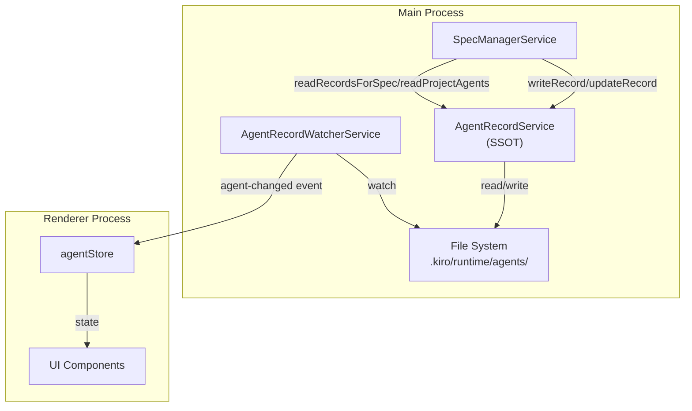
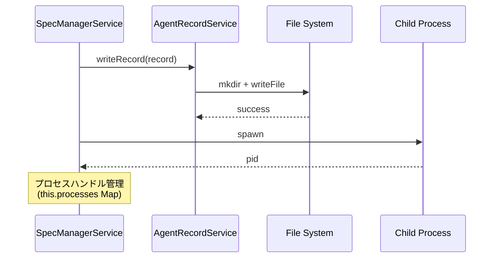
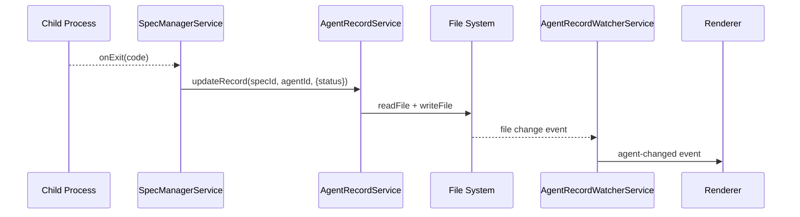
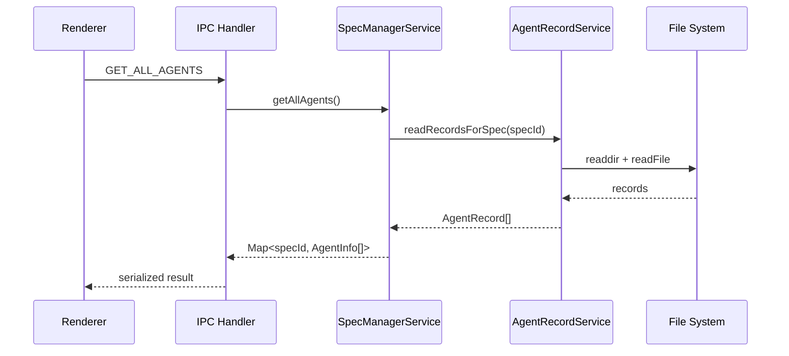
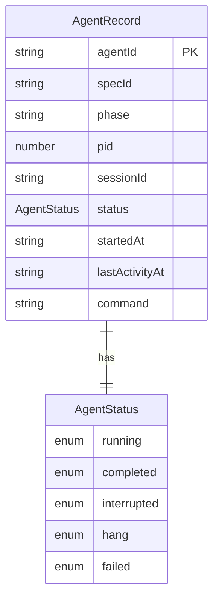

# Design: Agent State File SSOT

## Overview

**Purpose:** エージェント状態管理のアーキテクチャを改善し、ファイル（`.kiro/runtime/agents/*.json`）を Single Source of Truth（SSOT）とする。インメモリの `AgentRegistry` を廃止し、`AgentRecordService` がエージェント状態の読み書きを一元的に担当することで、ファイルとインメモリの不整合によるバグを根本的に解消する。

**Users:** SDD Orchestrator の開発者および利用者が、エージェント状態の一貫性を確保した UI を利用できる。

**Impact:** 現在のインメモリ状態管理（`AgentRegistry`）を廃止し、ファイルベースの状態管理に完全移行する。

### Goals

- ファイルを SSOT とし、インメモリ状態との不整合を根本解消
- `AgentRegistry` の廃止による設計の単純化
- スコープ制限を維持した読み取り API の提供（`agent-watcher-optimization` の設計意図維持）
- 既存機能の完全互換性維持

### Non-Goals

- `AgentRecordWatcherService` の変更（監視ロジックは現状維持）
- Renderer 側 `agentStore` の変更（API の戻り値が正しくなれば動作する）
- Remote UI の追加変更（Main process の変更で自動修正）
- パフォーマンス最適化（キャッシュ等）- 問題が出たら別 Spec で対応
- `SpecManagerService.processes` の分離

## Architecture

### Existing Architecture Analysis

現在のアーキテクチャには以下の問題がある。

```
現状の二重管理構造:
┌─────────────────────────────────────────────────────────────────┐
│                     SpecManagerService                          │
│                                                                 │
│  ┌─────────────────┐         ┌─────────────────────────────┐   │
│  │  AgentRegistry  │ ←同期→  │    AgentRecordService       │   │
│  │  (in-memory)    │  問題!  │    (file-based)             │   │
│  │                 │         │    .kiro/runtime/agents/    │   │
│  └────────┬────────┘         └──────────────┬──────────────┘   │
│           │                                 │                   │
│           ↓                                 ↓                   │
│  registry.get()              recordService.writeRecord()        │
│  registry.getBySpec()        recordService.updateRecord()       │
│  registry.getAll()           recordService.readRecord()         │
│  registry.updateStatus()                                        │
└─────────────────────────────────────────────────────────────────┘
```

**問題点:**
- `status` 更新時に `registry.updateStatus()` と `recordService.updateRecord()` の両方を呼ぶ必要がある
- 片方の更新が失敗すると不整合が発生
- UI は `registry` を読み、ファイルには正しい状態があるのに UI には反映されないバグ

### Architecture Pattern & Boundary Map

改善後のアーキテクチャは SSOT 原則に従い、ファイルを唯一の真実とする。



**Architecture Integration:**
- **選択パターン:** File-based SSOT with event-driven updates
- **ドメイン境界:** `AgentRecordService` がエージェント状態の唯一の管理者
- **既存パターン維持:** `AgentRecordWatcherService` による監視、IPC 経由の状態通知
- **新コンポーネント:** なし（既存コンポーネントのリファクタリング）
- **Steering 準拠:** SSOT 原則、DRY 原則

### Technology Stack

| Layer | Choice / Version | Role in Feature | Notes |
|-------|------------------|-----------------|-------|
| Backend / Services | Node.js (Electron 35) | ファイル I/O、状態管理 | 既存スタック維持 |
| Data / Storage | JSON ファイル | エージェント状態永続化 | `.kiro/runtime/agents/{specId}/{agentId}.json` |

## System Flows

### エージェント起動フロー



### エージェント状態更新フロー



### エージェント一覧取得フロー



## Requirements Traceability

| Criterion ID | Summary | Components | Implementation Approach |
|--------------|---------|------------|------------------------|
| 1.1 | `readRecordsForSpec` メソッド追加 | `AgentRecordService` | 新規実装 |
| 1.2 | `readProjectAgents` メソッド追加 | `AgentRecordService` | 新規実装 |
| 1.3 | `getRunningAgentCounts` メソッド追加 | `AgentRecordService` | 新規実装 |
| 1.4 | `readAllRecords` 非推奨化 | `AgentRecordService`, `SpecManagerService` | 既存メソッドを新 API に置換 |
| 2.1 | `AgentRegistry` 使用削除（SpecManagerService） | `SpecManagerService` | リファクタリング |
| 2.2 | `registry.register()` 呼び出し削除 | `SpecManagerService` | 削除 |
| 2.3 | `registry.updateStatus()` 呼び出し削除 | `SpecManagerService` | `recordService.updateRecord()` に置換 |
| 2.4 | `registry.get/getBySpec/getAll` 置換 | `SpecManagerService` | `recordService` の対応メソッドに置換 |
| 2.5 | `registry.updateActivity/updateSessionId/unregister` 置換 | `SpecManagerService` | `recordService` の対応メソッドに置換 |
| 2.6 | `AgentRegistry` クラス・テスト削除 | `agentRegistry.ts`, `agentRegistry.test.ts` | 削除 |
| 3.1 | `this.registry` プロパティ削除 | `SpecManagerService` | 削除 |
| 3.2 | `getAgents(specId)` リファクタリング | `SpecManagerService` | `recordService.readRecordsForSpec()` 使用 |
| 3.3 | `getAllAgents()` リファクタリング | `SpecManagerService` | 複合 API 呼び出し |
| 3.4 | `getAgentById(agentId)` リファクタリング | `SpecManagerService` | `recordService.readRecord()` 使用 |
| 3.5 | `this.processes` 維持 | `SpecManagerService` | 変更なし |
| 4.1 | `GET_ALL_AGENTS` ハンドラ更新 | `handlers.ts` | 既存実装で対応（SMS 経由） |
| 4.2 | `GET_RUNNING_AGENT_COUNTS` ハンドラ更新 | `handlers.ts` | `recordService.getRunningAgentCounts()` 呼び出し |
| 4.3 | `getAgentRegistry()` 使用箇所削除 | `handlers.ts` | 削除 |
| 5.1 | エージェント起動後 UI 表示 | E2E テスト | 動作検証 |
| 5.2 | エージェント完了後ステータス更新 | E2E テスト | 動作検証 |
| 5.3 | アプリ再起動後レコード読み込み | E2E テスト | 動作検証 |
| 5.4 | Spec 切り替え時の表示フィルタリング | E2E テスト | 動作検証 |
| 5.5 | SpecList バッジ表示 | E2E テスト | 動作検証 |
| 5.6 | Remote UI エージェント表示 | E2E テスト | 動作検証 |

### Coverage Validation Checklist

- [x] Every criterion ID from requirements.md appears in the table above
- [x] Each criterion has specific component names
- [x] Implementation approach distinguishes "reuse existing" vs "new implementation"
- [x] User-facing criteria specify concrete verification method

## Components and Interfaces

| Component | Domain/Layer | Intent | Req Coverage | Key Dependencies | Contracts |
|-----------|--------------|--------|--------------|-----------------|-----------|
| AgentRecordService | Main/Services | ファイルベースのエージェント状態管理 | 1.1-1.4 | fs (P0), path (P0) | Service |
| SpecManagerService | Main/Services | エージェントプロセス管理 | 2.1-2.6, 3.1-3.5 | AgentRecordService (P0) | Service |
| handlers.ts | Main/IPC | IPC ハンドラ | 4.1-4.3 | SpecManagerService (P0), AgentRecordService (P0) | API |

### Main / Services

#### AgentRecordService

| Field | Detail |
|-------|--------|
| Intent | ファイルベースのエージェント状態管理（SSOT） |
| Requirements | 1.1, 1.2, 1.3, 1.4 |

**Responsibilities & Constraints**
- エージェントレコードの読み書きを一元管理
- スコープ制限を維持した読み取り API 提供
- 全件読み込みは非推奨（パフォーマンス考慮）

**Dependencies**
- Outbound: fs/promises - ファイル I/O (P0)
- Outbound: path - パス操作 (P0)

**Contracts**: Service [x]

##### Service Interface

```typescript
interface AgentRecordService {
  // 既存メソッド
  writeRecord(record: AgentRecord): Promise<void>;
  readRecord(specId: string, agentId: string): Promise<AgentRecord | null>;
  updateRecord(specId: string, agentId: string, update: AgentRecordUpdate): Promise<void>;
  deleteRecord(specId: string, agentId: string): Promise<void>;
  checkProcessAlive(pid: number): boolean;

  // 新規追加メソッド (Requirement 1)
  readRecordsForSpec(specId: string): Promise<AgentRecord[]>;
  readProjectAgents(): Promise<AgentRecord[]>;
  getRunningAgentCounts(): Promise<Map<string, number>>;

  // 非推奨（Requirement 1.4）
  /** @deprecated Use readRecordsForSpec instead */
  readAllRecords(): Promise<AgentRecord[]>;
}
```

- Preconditions: basePath が有効なディレクトリパス
- Postconditions: ファイル操作成功時は状態が永続化される
- Invariants: ファイルと返却値の整合性

**Implementation Notes**
- `readRecordsForSpec`: 指定 specId のディレクトリ配下のみスキャン
- `readProjectAgents`: specId が空文字列（ProjectAgent）のレコードを返却
- `getRunningAgentCounts`: 全ファイルスキャンでシンプルに実装（少量データ前提）

#### SpecManagerService

| Field | Detail |
|-------|--------|
| Intent | エージェントプロセス管理とライフサイクル制御 |
| Requirements | 2.1-2.6, 3.1-3.5 |

**Responsibilities & Constraints**
- エージェントプロセスの起動・停止・監視
- プロセスハンドル管理（`this.processes` Map）
- `AgentRecordService` 経由での状態永続化

**Dependencies**
- Inbound: handlers.ts - IPC 経由の呼び出し (P0)
- Outbound: AgentRecordService - 状態永続化 (P0)
- Outbound: agentProcess - プロセス生成 (P0)

**Contracts**: Service [x]

##### Service Interface

```typescript
interface SpecManagerService {
  // 既存メソッド（シグネチャ維持、内部実装変更）
  getAgents(specId: string): Promise<AgentInfo[]>;
  getAgentById(agentId: string): Promise<AgentInfo | undefined>;
  getAllAgents(): Promise<Map<string, AgentInfo[]>>;

  // プロセス管理（変更なし）
  startAgent(options: StartAgentOptions): Promise<Result<AgentInfo, AgentError>>;
  stopAgent(agentId: string): Promise<Result<void, AgentError>>;
  resumeAgent(agentId: string, prompt?: string): Promise<Result<AgentInfo, AgentError>>;
  sendInput(agentId: string, input: string): Result<void, AgentError>;
}
```

- Preconditions: projectPath が有効
- Postconditions: 状態変更がファイルに永続化される
- Invariants: `this.processes` はプロセスハンドルのみ管理

**Implementation Notes**
- `this.registry` プロパティを完全削除
- 全ての状態読み取りは `this.recordService` 経由
- 非同期メソッドに変更（ファイル I/O のため）

### Main / IPC

#### handlers.ts

| Field | Detail |
|-------|--------|
| Intent | IPC ハンドラの更新 |
| Requirements | 4.1, 4.2, 4.3 |

**Responsibilities & Constraints**
- `GET_ALL_AGENTS`: `specManagerService.getAllAgents()` 呼び出し
- `GET_RUNNING_AGENT_COUNTS`: `recordService.getRunningAgentCounts()` 呼び出し
- `getAgentRegistry()` のインポート・使用を削除

**Dependencies**
- Outbound: SpecManagerService - エージェント操作 (P0)
- Outbound: AgentRecordService - カウント取得 (P0)

**Contracts**: API [x]

**Implementation Notes**
- `getAgentRegistry()` の使用箇所を全て置換
- 非同期 API への対応（既存ハンドラは async）

## Data Models

### Domain Model



**ビジネスルール:**
- `agentId` はグローバルで一意
- `specId` が空文字列の場合は ProjectAgent
- `status` の遷移: `running` → `completed` | `interrupted` | `failed` | `hang`

### Physical Data Model

**ファイル構造:**
```
.kiro/runtime/agents/
├── {specId}/
│   ├── {agentId-1}.json
│   ├── {agentId-2}.json
│   └── ...
├── /                         # ProjectAgent (specId = "")
│   ├── {agentId-3}.json
│   └── ...
└── ...
```

**JSON スキーマ:**
```json
{
  "agentId": "agent-1234567890-abcd1234",
  "specId": "my-feature",
  "phase": "impl-task1",
  "pid": 12345,
  "sessionId": "session-uuid",
  "status": "completed",
  "startedAt": "2026-01-14T10:00:00.000Z",
  "lastActivityAt": "2026-01-14T10:30:00.000Z",
  "command": "claude -p --verbose ..."
}
```

## Error Handling

### Error Strategy

| Error Type | Handling | Recovery |
|------------|----------|----------|
| ENOENT (ファイル未存在) | null 返却 | 正常ケースとして処理 |
| EACCES (権限エラー) | 例外スロー | ログ出力、ユーザー通知 |
| JSON パースエラー | 例外スロー | 破損ファイルとしてログ出力 |

### Error Categories and Responses

**System Errors:**
- ファイル I/O エラー: ログ出力後、適切なエラーレスポンス返却
- プロセス存在確認失敗: `false` を返却（プロセス終了と判断）

## Testing Strategy

### Unit Tests

| テスト対象 | テスト内容 |
|-----------|----------|
| `AgentRecordService.readRecordsForSpec` | 指定 specId のレコードのみ返却されること |
| `AgentRecordService.readProjectAgents` | specId が空文字列のレコードのみ返却されること |
| `AgentRecordService.getRunningAgentCounts` | status が running のエージェントのみカウントされること |
| `SpecManagerService.getAgents` | ファイルから正しく読み込まれること |
| `SpecManagerService.getAllAgents` | 全 Spec のエージェントが取得されること |

### Integration Tests

| テスト対象 | テスト内容 |
|-----------|----------|
| エージェント起動→状態更新→読み取り | ファイル経由で状態が正しく伝播すること |
| `GET_ALL_AGENTS` IPC ハンドラ | ファイルベースの結果が返却されること |
| `GET_RUNNING_AGENT_COUNTS` IPC ハンドラ | 正しいカウントが返却されること |

### E2E Tests

| テスト対象 | テスト内容 |
|-----------|----------|
| エージェント起動後 UI 表示 | 起動したエージェントが UI に表示されること |
| エージェント完了後ステータス更新 | ステータスが `completed` に更新されること |
| Spec 切り替え時フィルタリング | 選択中 Spec のエージェントのみ表示されること |

## Design Decisions

### DD-001: ファイルを SSOT とし AgentRegistry を廃止

| Field | Detail |
|-------|--------|
| Status | Accepted |
| Context | `AgentRegistry`（インメモリ）と `AgentRecordService`（ファイル）の二重管理が原因で、ファイルの `status` が `completed` でも UI は `running` と表示されるバグが発生 |
| Decision | `AgentRegistry` を廃止し、ファイルを SSOT とする |
| Rationale | SSOT 原則に従い、同じ情報を複数箇所で管理しない。Claude CLI や外部更新にも対応可能。キャッシュ同期の複雑さを排除 |
| Alternatives Considered | 1. インメモリをマスターにする → 外部更新に対応できない 2. 同期ロジックの強化 → 複雑性が増す |
| Consequences | 読み取り時にファイル I/O が発生。パフォーマンス問題が出たら別途キャッシュ層を検討 |
| Rollback Strategy | 問題発生時は Git リバートで対応可能。外部 API 変更なし、データ形式変更なしのため、安全にリバート可能 |

### DD-002: スコープ制限を維持した読み取り API

| Field | Detail |
|-------|--------|
| Status | Accepted |
| Context | `agent-watcher-optimization` で導入したスコープ制限（必要な Spec のみ読み込み）を維持したい |
| Decision | `readRecordsForSpec(specId)` と `readProjectAgents()` の 2 つの API を提供 |
| Rationale | 全件読み込み（`readAllRecords`）は起動時のパフォーマンス問題の原因だった。スコープ制限により必要最小限のファイル I/O で済む |
| Alternatives Considered | 全件読み込み API のみ → パフォーマンス問題再発の懸念 |
| Consequences | 呼び出し側で必要な API を選択する必要がある。`getAllAgents` は両方の API を組み合わせて使用 |

### DD-003: getRunningAgentCounts のシンプル実装

| Field | Detail |
|-------|--------|
| Status | Accepted |
| Context | SpecList バッジ表示用に各 Spec の実行中エージェント数が必要 |
| Decision | 全ファイルスキャンでシンプルに実装 |
| Rationale | Spec 数・エージェント数は少ない（数十件）。最適化（status のみ読み取り等）は YAGNI |
| Alternatives Considered | 1. ファイル名パターンでフィルタ → status がファイル名に含まれない 2. メタデータファイル → 複雑性増加 |
| Consequences | パフォーマンス問題が出たら別 Spec で対応 |

### DD-004: SpecManagerService.processes の現状維持

| Field | Detail |
|-------|--------|
| Status | Accepted |
| Context | プロセスハンドル管理（`processes` Map）を分離すべきか検討 |
| Decision | `SpecManagerService` に残す（現状維持） |
| Rationale | stdin 送信用のプロセスハンドル管理は `AgentRegistry` とは独立した責務。分離のメリットが薄い |
| Alternatives Considered | `ProcessHandleService` として分離 → 呼び出しが複雑化、メリット少 |
| Consequences | `SpecManagerService` はプロセス管理の責務を維持 |

### DD-005: メソッドの非同期化

| Field | Detail |
|-------|--------|
| Status | Accepted |
| Context | `getAgents`, `getAgentById`, `getAllAgents` はインメモリ参照だったが、ファイル I/O が必要になる |
| Decision | これらのメソッドを `async` に変更し、`Promise` を返却 |
| Rationale | ファイル I/O は本質的に非同期。同期的な読み込みはブロッキングを引き起こす |
| Alternatives Considered | 同期 I/O (`fs.readFileSync`) → メインプロセスのブロッキングは NG |
| Consequences | 呼び出し側で `await` が必要。IPC ハンドラは既に async なので影響小 |
