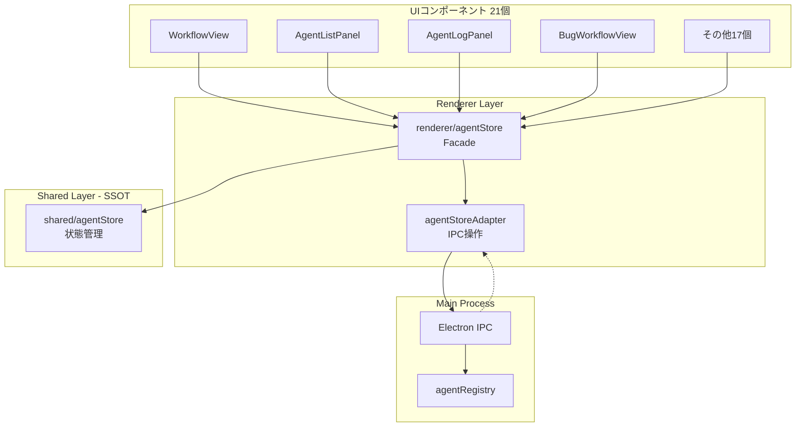
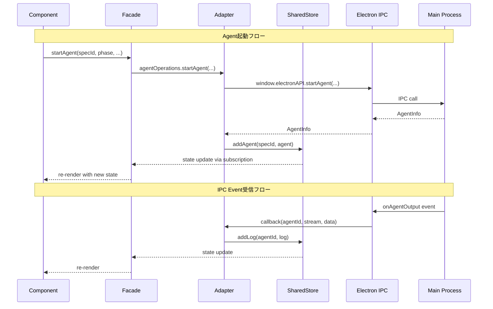
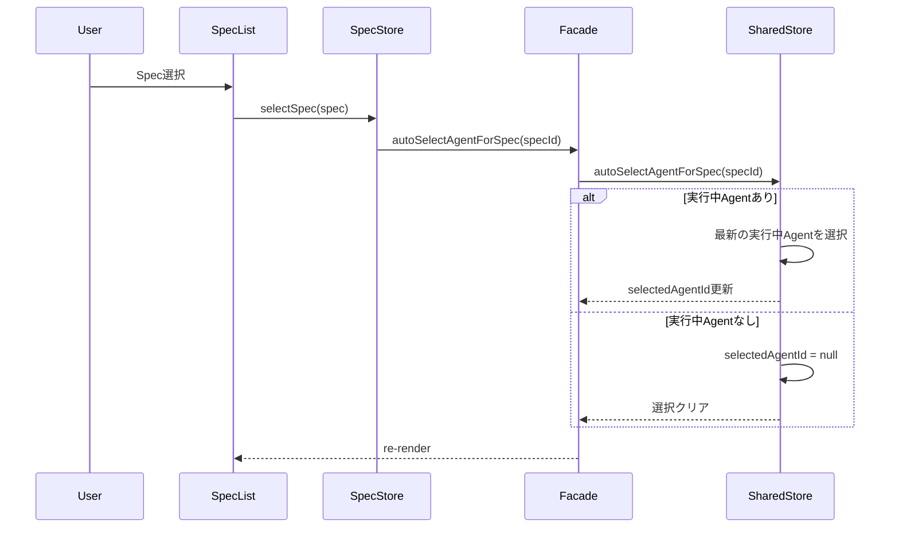
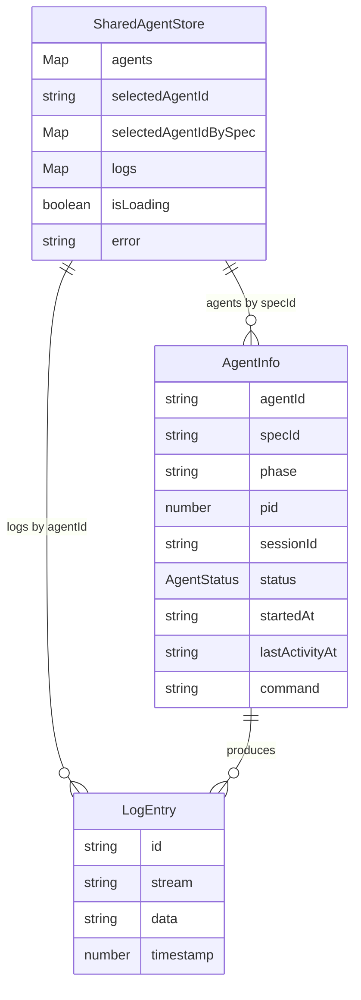

# Technical Design: Agent Store Unification

## Overview

**Purpose**: この機能は、renderer/agentStoreとshared/agentStoreの二重管理によるState不整合を解消し、Spec選択時に古いAgentログが表示される問題を構造的に解決する。

**Users**: 開発者およびエンドユーザーが、正確なAgent状態とログを確認するために利用する。

**Impact**: 現在の二重管理アーキテクチャを、shared/agentStoreをSingle Source of Truthとする単一管理アーキテクチャに変更する。renderer/agentStoreはFacadeとして再実装され、既存の21個のコンポーネントはimport文の変更なしで動作し続ける。

### Goals

- shared/agentStoreをSSOTとして確立し、データ構造を`Map<specId, AgentInfo[]>`に統一
- Electron IPC操作をAdapterレイヤーに分離し、shared/agentStoreをプラットフォーム非依存に保つ
- renderer/agentStoreをFacadeとして再実装し、21個のコンポーネントの変更を不要にする
- Spec選択時に正しいAgentログが表示されるバグの構造的解決

### Non-Goals

- Remote UIのshared/agentStore統合（別タスクとして扱う）
- Agent一覧のページネーション
- Agentログの内容キャッシュ最適化
- skipPermissions以外のElectron固有機能の追加
- Agent Record Watcherの監視スコープ変更（agent-watcher-optimizationで実装済み）

## Architecture

### Existing Architecture Analysis

現在のAgentStore実装には以下の問題がある:

| 問題 | 詳細 |
|------|------|
| **データ構造の不一致** | renderer版は`Map<specId, AgentInfo[]>`、shared版は`Map<agentId, AgentInfo>` |
| **二重管理** | renderer/agentStoreとshared/agentStoreが独立して状態を管理 |
| **SSOTの不在** | どちらがSingle Source of Truthか不明確 |
| **IPC依存の混在** | renderer/agentStoreにElectron IPC操作が直接埋め込まれている |

**現在のコンポーネント依存関係**:
- 21個のコンポーネントが`renderer/stores/agentStore`をインポート
- specStoreFacadeがagentStoreを参照（execution-store-consolidation実装）

### Architecture Pattern & Boundary Map

**Selected Pattern**: Facade + Adapter Pattern



**Architecture Integration**:
- **Selected pattern**: Facade + Adapter - execution-store-consolidationで実績のあるパターンを適用
- **Domain boundaries**: SharedStore（状態管理）、Adapter（IPC通信）、Facade（API互換性維持）
- **Existing patterns preserved**: Zustand store、IPC callback pattern、specStoreFacadeとの連携
- **New components rationale**: AgentStoreAdapterはIPC操作の分離、FacadeはAPI互換性維持のため必要
- **Steering compliance**: DRY（SSOT化）、関心の分離（Adapter分離）、KISS（Facadeで透過的移行）

### Technology Stack

| Layer | Choice / Version | Role in Feature | Notes |
|-------|------------------|-----------------|-------|
| State Management | Zustand 5.x | Agent状態管理 | 既存パターンを継続 |
| IPC | Electron contextBridge | Main-Renderer通信 | 既存パターンを継続 |
| Type System | TypeScript 5.8+ | 型安全性 | strict mode |

## System Flows

### Agent状態更新フロー



### Spec選択時のAgent自動選択フロー



## Requirements Traceability

| Criterion ID | Summary | Components | Implementation Approach |
|--------------|---------|------------|------------------------|
| 1.1 | agentsフィールドを`Map<string, AgentInfo[]>`に変更 | shared/agentStore | 既存`Map<string, AgentInfo>`を修正 |
| 1.2 | getAgentsForSpec(specId)実装 | shared/agentStore | 新規メソッド追加 |
| 1.3 | getAgentById(agentId)実装 | shared/agentStore | 既存メソッドを全spec走査に修正 |
| 1.4 | addAgent(specId, agent)実装 | shared/agentStore | 既存addAgentを修正 |
| 1.5 | removeAgent(agentId)実装 | shared/agentStore | 既存removeAgentを全spec対応に修正 |
| 1.6 | updateAgentStatus(agentId, status)実装 | shared/agentStore | 既存メソッドを全spec走査に修正 |
| 2.1 | agentStoreAdapter.tsファイル作成 | agentStoreAdapter | 新規ファイル作成 |
| 2.2 | agentOperationsオブジェクト提供 | agentStoreAdapter | 新規実装 |
| 2.3 | agentOperationsがelectronAPI呼び出し | agentStoreAdapter | IPC呼び出しをラップ |
| 2.4 | setupAgentEventListeners()関数提供 | agentStoreAdapter | 新規実装 |
| 2.5 | クリーンアップ関数を返す | agentStoreAdapter | 新規実装 |
| 2.6 | skipPermissions管理をAdapter内で実装 | agentStoreAdapter | 既存renderer/agentStoreから移動 |
| 3.1 | renderer/agentStoreをFacade化 | renderer/agentStore | 完全書き換え |
| 3.2 | Facade内でuseSharedAgentStoreをインポート | renderer/agentStore | import追加 |
| 3.3 | Facadeメソッドが委譲を実行 | renderer/agentStore | 全メソッドを委譲実装 |
| 3.4 | 型のre-export | renderer/agentStore | AgentInfo, AgentStatus, LogEntry |
| 3.5 | ヘルパーメソッド提供 | renderer/agentStore | getAgentById, getAgentsForSpec, getProjectAgents, getRunningAgentCount, findAgentById |
| 3.6 | Electron固有機能公開 | renderer/agentStore | skipPermissions, setSkipPermissions, loadSkipPermissions |
| 3.7 | setupEventListeners()公開 | renderer/agentStore | Adapter経由で設定 |
| 4.1 | subscribe()でshared store監視 | renderer/agentStore | Zustand subscribe |
| 4.2 | 状態変更の即時反映 | renderer/agentStore | subscription callback |
| 4.3 | 状態フィールド同期 | renderer/agentStore | agents, selectedAgentId, logs, isLoading, error |
| 4.4 | 変換処理なしで同期 | renderer/agentStore | データ構造統一により不要 |
| 4.5 | セレクタ/分割代入両パターン対応 | renderer/agentStore | Zustandの標準機能 |
| 5.1 | 実行中Agentなし時のログエリア空表示 | autoSelectAgentForSpec | 既存shared/agentStoreロジック活用 |
| 5.2 | 実行中Agent自動選択 | autoSelectAgentForSpec | 既存shared/agentStoreロジック活用 |
| 5.3 | interrupted後の別Spec選択時に古いログ非表示 | autoSelectAgentForSpec | Spec単位Agent選択で解決 |
| 5.4 | E2Eテストパス | E2Eテスト | 既存テスト実行 |
| 5.5 | ユニットテストパス | ユニットテスト | 最小限の修正で対応 |
| 5.6 | 21個のコンポーネントのimport文不変 | 全コンポーネント | Facadeによる透過的移行 |
| 5.7 | データ構造統一確認 | shared/agentStore | `Map<specId, AgentInfo[]>` |

### Coverage Validation Checklist

- [x] Every criterion ID from requirements.md appears in the table above
- [x] Each criterion has specific component names (not generic references)
- [x] Implementation approach distinguishes "reuse existing" vs "new implementation"
- [x] User-facing criteria specify concrete UI components

## Components and Interfaces

### Component Summary

| Component | Domain/Layer | Intent | Req Coverage | Key Dependencies | Contracts |
|-----------|--------------|--------|--------------|------------------|-----------|
| shared/agentStore | Shared/Store | Agent状態のSSOT | 1.1-1.6 | Zustand (P0) | State |
| agentStoreAdapter | Renderer/Adapter | IPC操作のカプセル化 | 2.1-2.6 | electronAPI (P0), shared/agentStore (P0) | Service |
| renderer/agentStore | Renderer/Facade | API互換性維持 | 3.1-3.7, 4.1-4.5 | shared/agentStore (P0), agentStoreAdapter (P0) | State |

### Shared Layer

#### shared/agentStore

| Field | Detail |
|-------|--------|
| Intent | Agent状態管理のSingle Source of Truth |
| Requirements | 1.1, 1.2, 1.3, 1.4, 1.5, 1.6 |

**Responsibilities & Constraints**
- Agent一覧の状態管理（`Map<specId, AgentInfo[]>`形式）
- Agent選択状態の管理
- Agentログの管理
- プラットフォーム非依存（IPC依存なし）

**Dependencies**
- Inbound: renderer/agentStore Facade - 状態取得・更新 (P0)
- Inbound: agentStoreAdapter - 状態更新 (P0)
- External: Zustand - 状態管理ライブラリ (P0)

**Contracts**: State [x]

##### State Management

```typescript
interface SharedAgentState {
  /** Agent一覧: specId -> AgentInfo[] */
  agents: Map<string, AgentInfo[]>;
  /** 選択中のAgent ID */
  selectedAgentId: string | null;
  /** Spec単位のAgent選択状態 */
  selectedAgentIdBySpec: Map<string, string | null>;
  /** Agent別のログ */
  logs: Map<string, LogEntry[]>;
  /** 読み込み中フラグ */
  isLoading: boolean;
  /** エラーメッセージ */
  error: string | null;
}

interface SharedAgentActions {
  /** Spec単位でAgentsを取得 */
  getAgentsForSpec(specId: string): AgentInfo[];
  /** IDでAgentを取得 */
  getAgentById(agentId: string): AgentInfo | undefined;
  /** Agentを追加 */
  addAgent(specId: string, agent: AgentInfo): void;
  /** Agentを削除 */
  removeAgent(agentId: string): void;
  /** Agentのステータスを更新 */
  updateAgentStatus(agentId: string, status: AgentStatus): void;
  /** ログを追加 */
  addLog(agentId: string, log: LogEntry): void;
  /** Spec選択時のAgent自動選択 */
  autoSelectAgentForSpec(specId: string | null): void;
}
```

- Preconditions: なし
- Postconditions: 状態更新後、subscribeしているコンポーネントに通知
- Invariants: agentsの各AgentInfoは一意のagentIdを持つ

**Implementation Notes**
- Integration: 既存の`useSharedAgentStore`を修正。データ構造を`Map<agentId, AgentInfo>`から`Map<specId, AgentInfo[]>`に変更
- Validation: specIdは空文字列可（Project Agent）
- Risks: 既存のRemote UI版が独自にuseStateで管理しているため、今回の変更はElectron版のみに影響

### Renderer Layer

#### agentStoreAdapter

| Field | Detail |
|-------|--------|
| Intent | Electron IPC操作のカプセル化 |
| Requirements | 2.1, 2.2, 2.3, 2.4, 2.5, 2.6 |

**Responsibilities & Constraints**
- Electron IPC呼び出しのラップ
- IPCイベントリスナーの設定と管理
- skipPermissions設定の管理
- shared/agentStoreへの結果反映

**Dependencies**
- Outbound: shared/agentStore - 状態更新 (P0)
- External: window.electronAPI - IPC通信 (P0)

**Contracts**: Service [x]

##### Service Interface

```typescript
/** Agent操作オブジェクト */
const agentOperations = {
  /** Agent起動 */
  startAgent(
    specId: string,
    phase: string,
    command: string,
    args: string[],
    group?: 'doc' | 'impl',
    sessionId?: string
  ): Promise<string | null>;

  /** Agent停止 */
  stopAgent(agentId: string): Promise<void>;

  /** Agent再開 */
  resumeAgent(agentId: string, prompt?: string): Promise<void>;

  /** Agent削除 */
  removeAgent(agentId: string): Promise<void>;

  /** 入力送信 */
  sendInput(agentId: string, input: string): Promise<void>;

  /** Agentログ読み込み */
  loadAgentLogs(specId: string, agentId: string): Promise<void>;
};

/** IPCイベントリスナー設定 */
function setupAgentEventListeners(): () => void;

/** skipPermissions操作 */
const skipPermissionsOperations = {
  /** skipPermissions設定 */
  setSkipPermissions(enabled: boolean): Promise<void>;

  /** skipPermissions読み込み */
  loadSkipPermissions(projectPath: string): Promise<void>;

  /** 現在のskipPermissions値取得 */
  getSkipPermissions(): boolean;
};
```

- Preconditions: window.electronAPIが利用可能
- Postconditions: IPC操作完了後、shared/agentStoreの状態が更新される
- Invariants: エラー発生時はshared/agentStore.errorに設定

**Implementation Notes**
- Integration: 既存renderer/agentStoreのIPC関連コードを移動
- Validation: agentId, specIdの存在チェックはMain Process側で実施
- Risks: IPC通信失敗時のエラーハンドリングが必要

#### renderer/agentStore (Facade)

| Field | Detail |
|-------|--------|
| Intent | 既存APIとの互換性維持Facade |
| Requirements | 3.1, 3.2, 3.3, 3.4, 3.5, 3.6, 3.7, 4.1, 4.2, 4.3, 4.4, 4.5 |

**Responsibilities & Constraints**
- 既存の`useAgentStore` APIを維持
- shared/agentStoreへの状態委譲
- agentStoreAdapterへのIPC操作委譲
- 21個のコンポーネントとの互換性維持

**Dependencies**
- Outbound: shared/agentStore - 状態取得・更新 (P0)
- Outbound: agentStoreAdapter - IPC操作 (P0)

**Contracts**: State [x]

##### State Management

```typescript
// 既存APIとの完全互換
interface AgentState {
  agents: Map<string, AgentInfo[]>;
  selectedAgentId: string | null;
  logs: Map<string, LogEntry[]>;
  isLoading: boolean;
  error: string | null;
  skipPermissions: boolean;
  runningAgentCounts: Map<string, number>;
}

interface AgentActions {
  // 既存のAgent操作アクション（すべてAdapter/SharedStoreに委譲）
  loadAgents(): Promise<void>;
  loadRunningAgentCounts(): Promise<void>;
  getRunningAgentCount(specId: string): number;
  selectAgent(agentId: string | null): Promise<void>;
  loadAgentLogs(specId: string, agentId: string): Promise<void>;
  addAgent(specId: string, agent: AgentInfo): void;
  startAgent(
    specId: string,
    phase: string,
    command: string,
    args: string[],
    group?: 'doc' | 'impl',
    sessionId?: string
  ): Promise<string | null>;
  stopAgent(agentId: string): Promise<void>;
  resumeAgent(agentId: string, prompt?: string): Promise<void>;
  removeAgent(agentId: string): Promise<void>;
  sendInput(agentId: string, input: string): Promise<void>;
  updateAgentStatus(agentId: string, status: AgentStatus): void;

  // ログ管理
  appendLog(agentId: string, entry: LogEntry): void;
  clearLogs(agentId: string): void;
  getLogsForAgent(agentId: string): LogEntry[];

  // イベントリスナー
  setupEventListeners(): () => void;

  // ヘルパーメソッド
  getAgentById(agentId: string): AgentInfo | undefined;
  getSelectedAgent(): AgentInfo | undefined;
  getAgentsForSpec(specId: string): AgentInfo[];
  getProjectAgents(): AgentInfo[];
  findAgentById(agentId: string | null): AgentInfo | undefined;
  clearError(): void;
  selectForProjectAgents(): void;

  // Electron固有機能
  setSkipPermissions(enabled: boolean): void;
  loadSkipPermissions(projectPath: string): Promise<void>;
}

// 型のre-export
export type { AgentInfo, AgentStatus, LogEntry };
```

- Preconditions: shared/agentStoreが初期化済み
- Postconditions: 状態変更はshared/agentStoreに反映
- Invariants: 既存APIシグネチャを変更しない

**Implementation Notes**
- Integration: Zustand `create()`で新規Facade実装。`useSharedAgentStore.subscribe()`で状態同期
- Validation: 既存バリデーションロジックを維持
- Risks: 状態同期のタイミングによる一時的な不整合（subscriptionで即時解消）

## Data Models

### Domain Model



**Aggregates and Boundaries**:
- SharedAgentStore: Agent状態の集約ルート
- AgentInfo: specId単位でグループ化されたEntity
- LogEntry: agentId単位でグループ化されたValue Object

**Business Rules & Invariants**:
- 各AgentInfoは一意のagentIdを持つ
- specIdは空文字列可（Project Agent）
- selectedAgentIdは存在するAgentを参照するか、null

### Data Contracts & Integration

**State Synchronization**:
- renderer/agentStore FacadeはuseSharedAgentStore.subscribe()で変更を監視
- 変更検知時、Facadeの状態を即座に更新
- セレクタパターン（`useAgentStore((state) => state.xxx)`）と分割代入パターン（`const { xxx } = useAgentStore()`）の両方をサポート

## Error Handling

### Error Strategy

| エラーカテゴリ | 処理 | 回復方法 |
|---------------|------|----------|
| IPC通信エラー | shared/agentStore.errorに設定 | clearError()で解除、再試行可能 |
| Agent起動失敗 | errorに設定、null返却 | UI側でエラー表示、再試行 |
| ログ読み込み失敗 | console.error、エラー状態設定なし | 非クリティカル、空配列で継続 |

### Error Categories and Responses

**System Errors**: IPC通信失敗、Main Process応答なし
- 対応: error状態に設定、UIでエラー表示
- 回復: ユーザーによる再試行

**Business Logic Errors**: 存在しないAgentへの操作
- 対応: console.warn、操作スキップ
- 回復: 状態のリロード（loadAgents）

### Logging Policy

steering/logging.mdに準拠したログ出力方針:

| コンテキスト | ログレベル | 出力先 | 備考 |
|-------------|-----------|--------|------|
| Adapter IPC通信エラー | error | console.error | Main Processとの通信失敗時 |
| 存在しないAgent操作 | warn | console.warn | 軽微なエラー、操作スキップ |
| イベント受信・状態更新 | log | console.log | デバッグ用、開発時のみ有用 |

**方針**:
- Renderer側では`console.error`/`console.warn`/`console.log`を使用（ProjectLoggerは不要）
- エラー発生時は、エラーメッセージと関連するagentId/specIdを含める
- ループ内での過剰なログ出力を避ける

## Testing Strategy

### Unit Tests

| テスト対象 | テスト内容 |
|-----------|-----------|
| shared/agentStore | getAgentsForSpec、addAgent、removeAgent、updateAgentStatusのデータ構造変更 |
| agentStoreAdapter | agentOperationsの各メソッドがelectronAPI呼び出しを実行 |
| agentStoreAdapter | setupAgentEventListenersがクリーンアップ関数を返す |
| renderer/agentStore Facade | 全メソッドがshared/agentStoreまたはAdapterに委譲 |
| renderer/agentStore Facade | subscribe経由の状態同期 |

### Integration Tests

| テスト対象 | テスト内容 |
|-----------|-----------|
| Facade-SharedStore連携 | Facade操作がSharedStoreの状態を正しく更新 |
| Adapter-SharedStore連携 | IPCイベント受信がSharedStoreに正しく反映 |
| specStoreFacade連携 | agentStore変更がspecManagerExecution導出値に反映 |

### E2E Tests

| テスト対象 | テスト内容 |
|-----------|-----------|
| Agent起動・表示 | Agent起動後にAgentListPanelに表示 |
| Spec選択時のAgent自動選択 | 実行中Agentがある場合に自動選択、ない場合はログエリア空 |
| Agentログ表示 | 選択したAgentのログが正しく表示 |

## Design Decisions

### DD-001: SSOTとしてshared/agentStoreを選択

| Field | Detail |
|-------|--------|
| Status | Accepted |
| Context | renderer版とshared版の2つのagentStoreが存在し、どちらをSSOTとすべきか |
| Decision | shared/agentStoreをSSOTとする |
| Rationale | structure.mdの原則（Domain Stateは`src/shared/stores/`に配置）に準拠。Remote UI対応の将来性を考慮。プラットフォーム非依存な設計を維持 |
| Alternatives Considered | renderer/agentStoreをSSOT: Electron専用となりRemote UI対応が困難 |
| Consequences | shared/agentStoreの修正が必要。renderer/agentStoreはFacade化 |

### DD-002: データ構造を`Map<specId, AgentInfo[]>`に統一

| Field | Detail |
|-------|--------|
| Status | Accepted |
| Context | renderer版は`Map<specId, AgentInfo[]>`、shared版は`Map<agentId, AgentInfo>`と異なる構造 |
| Decision | `Map<specId, AgentInfo[]>`に統一 |
| Rationale | agent-watcher-optimizationの設計意図（Spec単位での監視・取得）に合致。UIの表示単位（SpecListPanel、BugWorkflowView）と一致。アクセス効率が高い（`O(1)` vs `O(n)`フィルタリング） |
| Alternatives Considered | `Map<agentId, AgentInfo>`: getAgentsForSpec()で毎回O(n)フィルタリングが必要 |
| Consequences | shared/agentStoreの全メソッドをSpec単位構造に対応させる必要あり |

### DD-003: Facadeパターンによる透過的移行

| Field | Detail |
|-------|--------|
| Status | Accepted |
| Context | 21個のコンポーネントがrenderer/agentStoreをインポートしており、変更影響が大きい |
| Decision | renderer/agentStoreをFacadeとして再実装し、既存APIを維持 |
| Rationale | execution-store-consolidationで実績のあるパターン。コンポーネントの変更が不要。ロールバックが容易 |
| Alternatives Considered | 段階的移行（1コンポーネントずつ）: 移行期間中に2つのstore参照が混在し複雑化 |
| Consequences | Facadeの実装コストはあるが、全コンポーネントで一括適用可能 |

### DD-004: Adapterレイヤーの責務分離

| Field | Detail |
|-------|--------|
| Status | Accepted |
| Context | renderer/agentStoreにElectron IPC操作が直接埋め込まれている |
| Decision | IPC操作、イベントリスナー、Electron固有機能をすべてAdapter化 |
| Rationale | shared/agentStoreをプラットフォーム非依存に保つ。責務の分離（Store=状態管理、Adapter=IPC通信）。テスト容易性の向上 |
| Alternatives Considered | IPC操作をshared/agentStoreに含める: プラットフォーム依存が発生 |
| Consequences | agentStoreAdapter.tsの新規作成が必要。skipPermissions管理もAdapter内に移動 |

### DD-005: Remote UIへの影響を別タスク化

| Field | Detail |
|-------|--------|
| Status | Accepted |
| Context | 今回の統合でRemote UIも変更すべきか検討が必要 |
| Decision | Remote UIのshared/agentStore統合は別タスクとして扱う |
| Rationale | Remote UIは現在shared/agentStoreを使用していない（独自にuseStateで管理）。今回の変更はElectron版のみに影響。スコープを限定し、リスクを低減 |
| Alternatives Considered | 同時にRemote UIも統合: スコープ拡大によりリスク増大、テスト範囲も拡大 |
| Consequences | Remote UIは将来の改善課題として残る |
