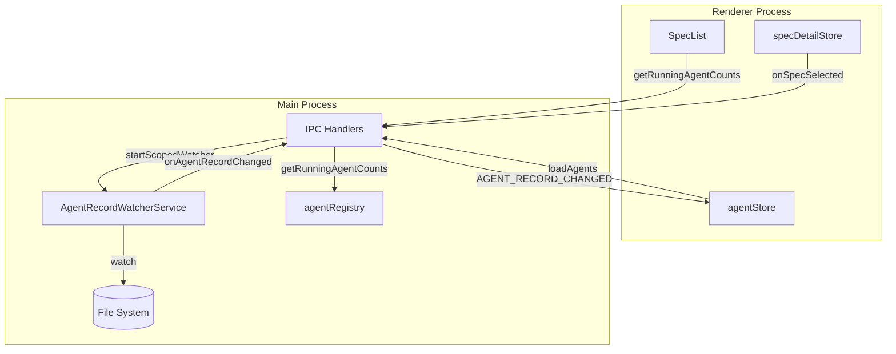
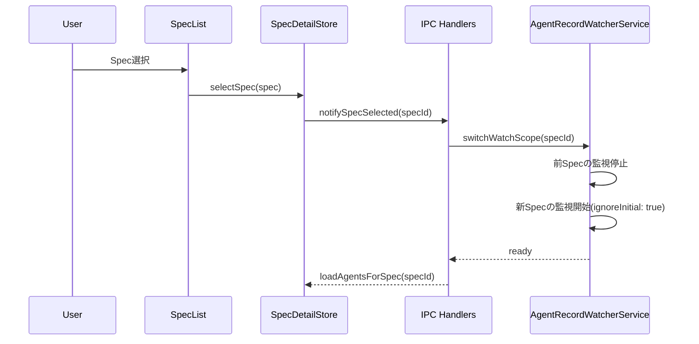
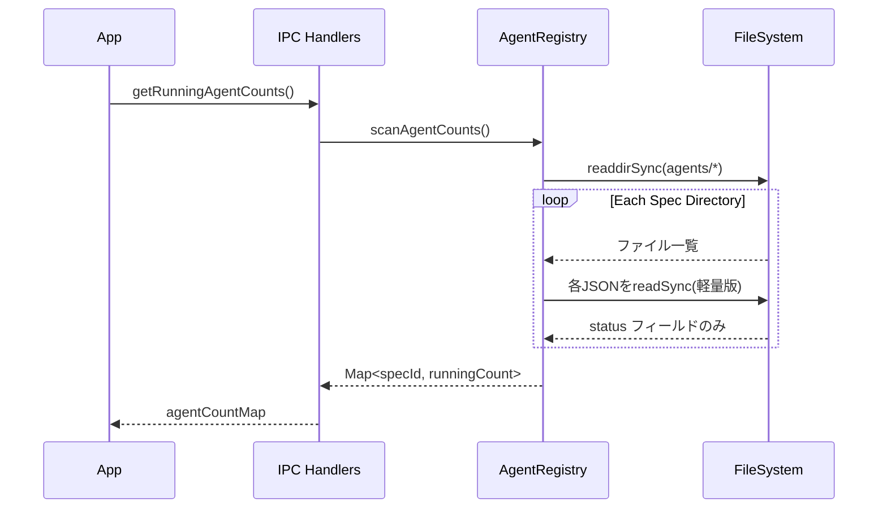

# Design: Agent Watcher Optimization

## Overview

**Purpose**: Spec選択時のローディング遅延を解消するため、AgentRecordWatcherの監視スコープをプロジェクト全体から選択中Spec単位に限定する。併せてAgent自動選択ロジックを改善し、実行中Agentがある場合のみ自動選択を行う。

**Users**: SDD Orchestratorを使用する開発者が、Spec選択時に遅延なくコンテンツを表示できるようになる。

**Impact**: 起動時およびSpec切り替え時のファイルスキャン負荷を大幅に軽減し、IPC応答遅延を解消する。

### Goals

- AgentRecordWatcherの監視スコープを選択中Specに限定
- 起動時のAgent一覧取得を軽量化（実行中Agent数のみ）
- Agent自動選択ロジックの改善（実行中Agentがある場合のみ）
- Spec選択からコンテンツ表示までの時間を500ms以内に維持

### Non-Goals

- Agentログの内容キャッシュ最適化
- Agent一覧のページネーション
- Agentファイルの削除・クリーンアップ機能
- Remote UIへの影響（Electron UIのみ対象）

## Architecture

### Existing Architecture Analysis

現在のAgentRecordWatcherServiceは以下の問題を抱えている：

1. **監視スコープの広さ**: `.kiro/runtime/agents/**/*.json`をプロジェクト全体で監視
2. **ignoreInitial: false設定**: 起動時に既存ファイルすべてに対してイベント発火
3. **depth: 2設定**: 全Specのagentディレクトリを再帰的に監視

**関連コンポーネント**:
- `AgentRecordWatcherService`: mainプロセスでのファイル監視
- `handlers.ts`: IPC経由でwatcherを起動・停止
- `agentStore.ts`: rendererでのAgent状態管理
- `SpecList.tsx`: 実行中Agent数のバッジ表示

### Architecture Pattern & Boundary Map



**Architecture Integration**:
- Selected pattern: Scoped Watcher Pattern（監視対象を選択中Specに限定）
- Domain boundaries: mainプロセス（監視・データ取得）とrendererプロセス（状態管理・表示）を明確に分離
- Existing patterns preserved: 既存のIPC通信パターン、Zustand store構造
- New components rationale: なし（既存コンポーネントの改修のみ）
- Steering compliance: DRY（軽量版Agent数取得の導入）、KISS（監視スコープの単純化）

### Technology Stack

| Layer | Choice / Version | Role in Feature | Notes |
|-------|------------------|-----------------|-------|
| File Watcher | chokidar 4.x | Spec単位のファイル監視 | 既存ライブラリ継続使用 |
| State Management | Zustand | Agent選択状態のSpec単位管理 | 新規Map追加 |
| IPC | Electron IPC | 監視スコープ変更通知 | 新規チャンネル追加 |

## System Flows

### Spec選択時の監視切り替えフロー



### 起動時の軽量Agent数取得フロー



## Requirements Traceability

| Criterion ID | Summary | Components | Implementation Approach |
|--------------|---------|------------|------------------------|
| 1.1 | Spec選択時に該当ディレクトリのみ監視 | AgentRecordWatcherService | 新規: watchScope変更メソッド追加 |
| 1.2 | Spec切り替え時に監視対象を変更 | AgentRecordWatcherService, IPC Handlers | 新規: switchWatchScope IPC追加 |
| 1.3 | ProjectAgentは常時監視 | AgentRecordWatcherService | 改修: 2つのwatcherインスタンス管理 |
| 1.4 | ignoreInitial: true設定 | AgentRecordWatcherService | 改修: Spec監視のみ適用 |
| 2.1 | 起動時に実行中Agent数のみ取得 | agentRegistry, IPC Handlers | 新規: getRunningAgentCounts IPC追加 |
| 2.2 | SpecListItemでバッジ表示 | SpecList | reuse existing: 既存実装維持 |
| 2.3 | Spec選択時にAgent詳細ロード | agentStore | reuse existing: loadAgents維持 |
| 3.1 | 実行中Agentがない場合は自動選択しない | agentStore | 改修: 自動選択条件追加 |
| 3.2 | 実行中Agentがある場合は最新を選択 | agentStore | 改修: 選択ロジック変更 |
| 3.3 | Spec単位でAgent選択状態を管理 | agentStore | 新規: selectedAgentIdBySpec Map追加 |
| 3.4 | Spec切り替え時に選択状態を復元 | agentStore | 改修: selectAgent呼び出しロジック |
| 3.5 | 選択状態の永続化は行わない | agentStore | 設計: オンメモリのみ |
| 4.1 | Spec選択から表示まで500ms以内 | 全体 | 測定: パフォーマンステスト追加 |
| 4.2 | 監視切り替えは非同期処理 | AgentRecordWatcherService | 改修: async/await適用 |

### Coverage Validation Checklist

- [x] Every criterion ID from requirements.md appears in the table above
- [x] Each criterion has specific component names (not generic references)
- [x] Implementation approach distinguishes "reuse existing" vs "new implementation"
- [x] User-facing criteria specify concrete UI components

## Components and Interfaces

| Component | Domain/Layer | Intent | Req Coverage | Key Dependencies | Contracts |
|-----------|--------------|--------|--------------|-----------------|-----------|
| AgentRecordWatcherService | Main/Services | Spec単位のAgent監視 | 1.1-1.4, 4.2 | chokidar (P0) | Service |
| IPC Handlers (Agent) | Main/IPC | Agent関連IPC | 1.2, 2.1 | AgentRecordWatcherService (P0), agentRegistry (P0) | API |
| agentStore | Renderer/Stores | Agent状態管理 | 2.3, 3.1-3.5 | IPC (P0) | State |
| agentRegistry | Main/Services | Agent情報取得 | 2.1 | FileSystem (P0) | Service |

### Main / Services

#### AgentRecordWatcherService

| Field | Detail |
|-------|--------|
| Intent | 選択中SpecとProjectAgentのファイル監視を提供 |
| Requirements | 1.1, 1.2, 1.3, 1.4, 4.2 |

**Responsibilities & Constraints**
- Spec単位の監視スコープ管理
- ProjectAgent（specId空）の常時監視
- ignoreInitial設定によるイベント抑制

**Dependencies**
- Outbound: chokidar - ファイルシステム監視 (P0)
- Outbound: logger - ログ出力 (P2)

**Contracts**: Service [x]

##### Service Interface

```typescript
interface AgentRecordWatcherService {
  /** 現在の監視スコープのspecId（null=ProjectAgentのみ） */
  currentSpecId: string | null;

  /** ProjectAgent用watcher */
  projectAgentWatcher: chokidar.FSWatcher | null;

  /** Spec用watcher */
  specWatcher: chokidar.FSWatcher | null;

  /** サービスを開始（ProjectAgent監視のみ） */
  start(): void;

  /** 監視スコープを切り替え（非同期） */
  switchWatchScope(specId: string | null): Promise<void>;

  /** 現在の監視スコープを取得 */
  getWatchScope(): string | null;

  /** コールバック登録 */
  onChange(callback: AgentRecordChangeCallback): void;

  /** サービスを停止 */
  stop(): Promise<void>;
}
```

- Preconditions: projectPath が有効であること
- Postconditions: 指定されたspecId のディレクトリが監視対象になる
- Invariants: ProjectAgentは常時監視される

**Implementation Notes**
- Integration: `start()`はProjectAgent監視のみ開始、Spec監視は`switchWatchScope`で開始
- Validation: specIdが存在しないディレクトリの場合は監視をスキップ（エラーにはしない）
- Risks: 高速なSpec切り替え時のwatcher競合（debounce検討）

#### agentRegistry (Extension)

| Field | Detail |
|-------|--------|
| Intent | 軽量なAgent情報取得を提供 |
| Requirements | 2.1 |

**Responsibilities & Constraints**
- 全SpecのrunningAgent数を効率的に取得
- 詳細データ読み込みは行わない

**Dependencies**
- Outbound: FileSystem - ファイル読み込み (P0)

**Contracts**: Service [x]

##### Service Interface

```typescript
interface AgentRegistryExtension {
  /**
   * 全Specの実行中Agent数を取得（軽量版）
   * JSONファイルからstatusフィールドのみ読み取り
   */
  getRunningAgentCounts(): Promise<Map<string, number>>;
}
```

- Preconditions: `.kiro/runtime/agents` ディレクトリが存在すること
- Postconditions: 各specIdに対する実行中Agent数が返される
- Invariants: 読み取りエラーは0としてカウント

**Implementation Notes**
- Integration: 既存のagentRegistryクラスにメソッドを追加
- Validation: JSONパースエラーは警告ログを出力し、0としてカウント
- Risks: 大量のSpecがある場合のパフォーマンス（将来的にはキャッシュ検討）

### Main / IPC

#### IPC Handlers (Agent関連追加)

| Field | Detail |
|-------|--------|
| Intent | Agent関連の新規IPCチャンネルを提供 |
| Requirements | 1.2, 2.1 |

**Contracts**: API [x]

##### API Contract

| Method | Channel | Request | Response | Errors |
|--------|---------|---------|----------|--------|
| invoke | SWITCH_AGENT_WATCH_SCOPE | specId: string \| null | void | - |
| invoke | GET_RUNNING_AGENT_COUNTS | - | Record<string, number> | - |

**Implementation Notes**
- Integration: `handlers.ts`に新規ハンドラを追加
- Validation: specIdは空文字列（ProjectAgent）または有効なspec名

### Renderer / Stores

#### agentStore (Extension)

| Field | Detail |
|-------|--------|
| Intent | Spec単位のAgent選択状態管理 |
| Requirements | 3.1, 3.2, 3.3, 3.4, 3.5 |

**Responsibilities & Constraints**
- Spec単位のAgent選択状態（オンメモリ）
- 実行中Agentがある場合のみ自動選択

**Dependencies**
- Outbound: IPC - Agent情報取得 (P0)
- Inbound: specDetailStore - Spec選択イベント (P0)

**Contracts**: State [x]

##### State Management

```typescript
interface AgentStoreExtension {
  /** Spec単位のAgent選択状態 */
  selectedAgentIdBySpec: Map<string, string | null>;

  /**
   * Spec選択時のAgent自動選択
   * - 実行中Agentがない場合: 何もしない
   * - 実行中Agentがある場合: 最新のAgentを選択
   * - 保存された選択状態があれば復元
   */
  autoSelectAgentForSpec(specId: string): void;

  /**
   * Agent選択状態を保存
   */
  setSelectedAgentForSpec(specId: string, agentId: string | null): void;

  /**
   * Spec用のAgent選択状態を取得
   */
  getSelectedAgentForSpec(specId: string): string | null;
}
```

- State model: `Map<specId, selectedAgentId>` でSpec単位に管理
- Persistence: なし（オンメモリのみ）
- Concurrency: Zustandのset関数でアトミック更新

**Implementation Notes**
- Integration: 既存の`onAgentRecordChanged`コールバックを改修
- Validation: specIdが空文字列の場合はProjectAgentとして処理
- Risks: Specが多い場合のメモリ使用量（Agent選択状態のみなので軽微）

## Data Models

### Domain Model

**Agent選択状態のライフサイクル**:
1. Spec選択 → `autoSelectAgentForSpec`呼び出し
2. 実行中Agent有無を判定
3. 保存された選択状態があれば復元、なければ最新の実行中Agentを選択
4. ユーザーが手動選択 → `setSelectedAgentForSpec`で保存
5. Spec切り替え → 状態は保持されオンメモリに残る
6. アプリ再起動 → 全状態リセット

### Logical Data Model

**新規状態構造**:

```typescript
// agentStore内の新規フィールド
selectedAgentIdBySpec: Map<string, string | null>
// key: specId（空文字列はProjectAgent）
// value: 選択中のagentId（null=未選択）
```

**実行中Agent数の一時データ**:

```typescript
// IPC経由で取得、SpecListで使用
type RunningAgentCounts = Record<string, number>;
// key: specId
// value: 実行中Agent数
```

## Error Handling

### Error Strategy

| Error Type | Handling | Recovery |
|------------|----------|----------|
| 監視ディレクトリ不在 | 警告ログ出力、監視スキップ | ディレクトリ作成時に自動検出 |
| JSONパースエラー | 警告ログ出力、該当Agent無視 | 次回ファイル変更時に再試行 |
| watcher起動失敗 | エラーログ出力、UI通知なし | アプリ再起動で復旧 |

### Monitoring

- `[AgentRecordWatcherService]`プレフィックスでログ出力
- 監視スコープ切り替え時にinfo levelでログ
- パフォーマンス計測用タイミングログ（debug level）

## Testing Strategy

### Unit Tests

1. `AgentRecordWatcherService.switchWatchScope`: スコープ切り替えが正しく動作すること
2. `AgentRecordWatcherService.start`: ProjectAgent監視のみ開始されること
3. `agentRegistry.getRunningAgentCounts`: 実行中Agent数が正確にカウントされること
4. `agentStore.autoSelectAgentForSpec`: 実行中Agentがある場合のみ選択されること
5. `agentStore.selectedAgentIdBySpec`: Spec単位の選択状態が正しく保存・復元されること

### Integration Tests

1. Spec選択→監視スコープ切り替え→Agent一覧更新の連携
2. 起動時の軽量Agent数取得→SpecListバッジ表示の連携
3. Agent追加イベント→自動選択ロジックの連携
4. Spec切り替え時の選択状態復元

### E2E Tests

1. Spec選択後500ms以内にコンテンツ表示されること
2. 複数Spec間を切り替えてもAgent選択状態が保持されること
3. 実行中Agentがない場合、自動選択されないこと

### Performance Tests

1. 100 Spec環境での起動時間計測
2. Spec切り替え時のレスポンス時間計測
3. 監視対象ファイル数とCPU使用率の相関

## Design Decisions

### DD-001: Spec単位の監視スコープ

| Field | Detail |
|-------|--------|
| Status | Accepted |
| Context | プロジェクト全体の`.kiro/runtime/agents/**/*.json`監視により、起動時に大量のファイルスキャンとイベント発火が発生し、mainプロセスがブロックされてIPC応答が遅延していた |
| Decision | 監視スコープを「選択中Spec + ProjectAgent」に限定する |
| Rationale | ユーザーが操作しているSpecのAgentだけリアルタイム更新が必要。他のSpecのAgent変更はUI上見えないため監視不要 |
| Alternatives Considered | 1) 全体監視のままdebounce強化 → 起動時の初期スキャン問題は解決しない 2) Agent監視自体を廃止 → リアルタイム更新ができなくなる |
| Consequences | Spec切り替え時に監視再設定のオーバーヘッドが発生するが、非同期処理で影響を最小化 |

### DD-002: 2つのWatcherインスタンス構成

| Field | Detail |
|-------|--------|
| Status | Accepted |
| Context | ProjectAgent（specIdが空のAgent）は常時監視が必要だが、Spec単位のAgentは選択時のみ監視したい |
| Decision | `projectAgentWatcher`と`specWatcher`の2つのchokidarインスタンスを管理する |
| Rationale | ProjectAgentはどのSpec選択状態でも表示される可能性があるため、常時監視が必要。Spec単位のwatcherは切り替え時に再作成 |
| Alternatives Considered | 1) 単一watcherで複数パス監視 → パス追加・削除のAPIが複雑 2) ProjectAgent監視なし → グローバルAgent操作のリアルタイム反映ができない |
| Consequences | メモリ使用量がわずかに増加するが、watcherインスタンスは軽量なため問題なし |

### DD-003: 起動時の軽量Agent数取得

| Field | Detail |
|-------|--------|
| Status | Accepted |
| Context | 起動時に全Specの全Agentを読み込むと、ファイルI/O負荷が高くUIの表示が遅延する |
| Decision | 起動時は各Specの実行中Agent数のみ取得（`status`フィールドのみ読み取り）、Spec選択時に詳細をロード |
| Rationale | SpecListItemのバッジ表示に必要なのは実行中Agent数のみ。全Agentの詳細は選択されるまで不要 |
| Alternatives Considered | 1) 全Agent詳細を遅延ロード → バッジ表示が遅れる 2) Agent数もキャッシュ → 更新頻度が高くキャッシュ無効化が複雑 |
| Consequences | 起動時のファイル読み取りが最小限になり、レスポンス向上。Spec選択時には追加I/Oが発生 |

### DD-004: Agent選択状態のオンメモリ管理

| Field | Detail |
|-------|--------|
| Status | Accepted |
| Context | Spec切り替え時にAgent選択状態を保持したいが、永続化の必要性は低い |
| Decision | Agent選択状態は`Map<specId, agentId>`でオンメモリ管理し、アプリ再起動でリセット |
| Rationale | Agent選択状態は一時的なUI状態であり、永続化するとspec.jsonの肥大化や同期問題が発生する。実行中でないAgentのログを自動表示する意味がない |
| Alternatives Considered | 1) spec.jsonに保存 → 同期タイミングの複雑化、ファイル書き込み負荷 2) localStorageに保存 → 複数プロジェクト間で競合する可能性 |
| Consequences | アプリ再起動後は選択状態がリセットされるが、ユーザー体験への影響は軽微 |

### DD-005: ignoreInitial: true の適用範囲

| Field | Detail |
|-------|--------|
| Status | Accepted |
| Context | chokidarの`ignoreInitial`設定は、watcher起動時に既存ファイルに対するイベント発火を抑制する |
| Decision | Spec切り替え時の`specWatcher`にのみ`ignoreInitial: true`を適用。`projectAgentWatcher`は`ignoreInitial: false`を維持 |
| Rationale | Spec切り替え時は`loadAgentsForSpec`で明示的にデータを取得するため、既存ファイルイベントは不要。ProjectAgentは起動時に全件把握する必要がある |
| Alternatives Considered | 1) 両方ignoreInitial: true → ProjectAgentの初期表示が遅れる 2) 両方ignoreInitial: false → Spec切り替え時に大量イベント発火 |
| Consequences | ProjectAgent用watcherの起動時にイベントが発火するが、ファイル数が少ないため影響は軽微 |
