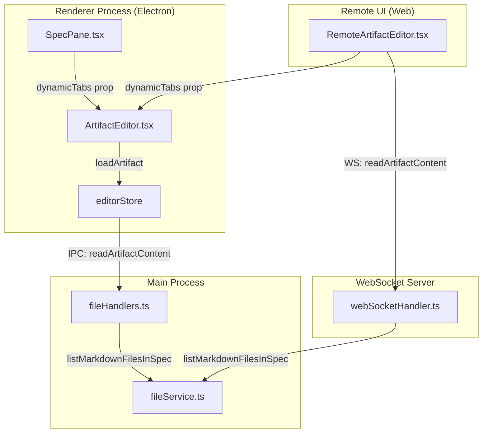
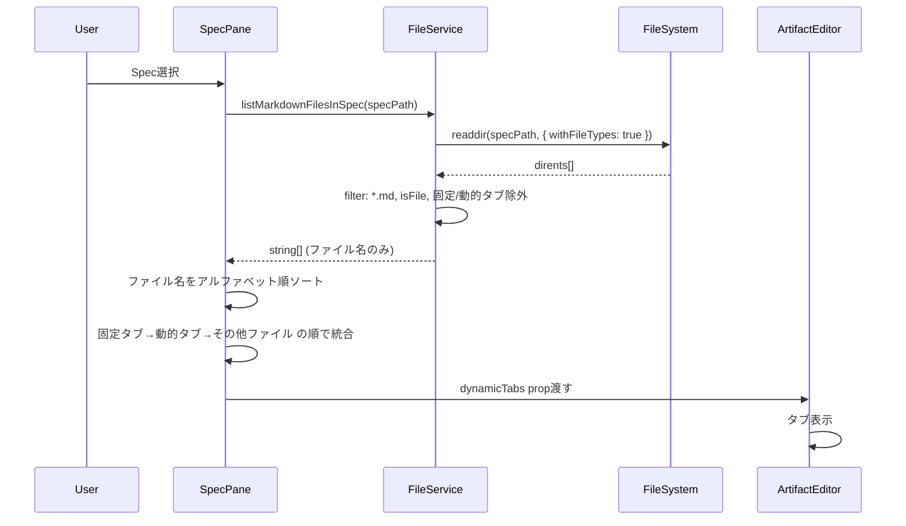
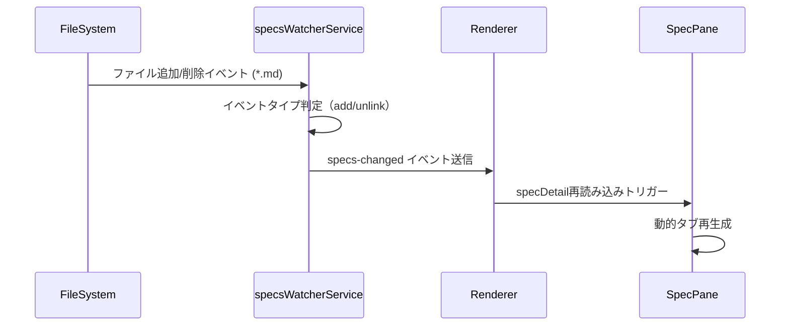

# Design: Artifact全Markdownファイル表示

## Overview

本機能は、specフォルダ直下に配置されたすべての`*.md`ファイルを自動検出し、ArtifactEditorのタブとして表示する。現在は固定タブ（requirements.md, design.md, tasks.md, research.md）と動的タブ（document-review-*, inspection-*）のみが表示されているが、本機能により任意のMarkdownドキュメントを追加・編集できる柔軟性を提供する。

**Purpose**: ユーザーがspecフォルダに追加した任意のMarkdownファイル（例: architecture.md, migration-notes.md等）をUI上で編集可能にすることで、ドキュメント管理の自由度を向上させる。

**Users**: SDD Orchestratorを使用してSpec文書を管理する開発者が、既存のエディタUIを活用して追加ドキュメントを編集できる。

**Impact**: 既存のArtifactEditor、SpecDetail型、IPC API、WebSocket APIに機能拡張を実施。後方互換性を保持し、既存のタブ機能は変更しない。

### Goals

- specフォルダ直下の全`*.md`ファイルを自動検出してタブ表示
- 固定タブ → 動的タブ（document-review, inspection） → その他ファイル の順序で表示
- 既存のArtifactEditorの編集機能（編集モード、プレビューモード、検索）を全タブに適用
- Electron版とRemote UI版の両方で同等の機能を提供
- BugPaneにも同等の機能を提供（bugフォルダ直下の`*.md`を検出）

### Non-Goals

- サブディレクトリ内の`*.md`ファイルの検出（将来的に別specで対応）
- `*.md`以外のファイル形式のサポート（`.txt`, `.rst`等）
- タブの並び替え機能（ドラッグ&ドロップ）
- タブのグループ化機能（折りたたみ可能なセクション）
- ファイル名の変更機能（エディタ内でのリネーム）
- 一時ファイルの自動除外（`*.tmp.md`等）

## Architecture

### Existing Architecture Analysis

現在のArtifactEditor構成:

- **固定タブ**: `SPEC_ARTIFACT_TABS`定数で定義（requirements, design, tasks, research）
- **動的タブ**: SpecPane/BugPaneで生成（document-review-*, inspection-*）
- **タブ統合**: ArtifactEditor.tsxの`visibleTabs`メモで固定タブ+動的タブを結合
- **ファイル読み込み**: editorStoreの`loadArtifact`がIPC経由で`readArtifactContent`を呼び出し

**拡張ポイント**:
- `SpecDetail.artifacts`に`markdownFiles`フィールドを追加してファイル一覧を運搬
- 動的タブ生成ロジックに「その他の*.mdファイル」セクションを追加
- IPC/WebSocket APIに`listMarkdownFilesInSpec`エンドポイントを追加

### Architecture Pattern & Boundary Map



**Key Decisions**:
- 既存のdynamicTabsメカニズムを拡張し、新規ファイル検出ロジックを追加
- SpecDetailにmarkdownFilesフィールドを追加し、ファイル一覧の運搬を一元化
- FileServiceにファイル検出ロジックを配置し、Main Processで集約

### Technology Stack

| Layer | Choice / Version | Role in Feature | Notes |
|-------|------------------|-----------------|-------|
| Frontend | React 19 + TypeScript | SpecPane/BugPaneで動的タブ生成 | 既存パターンを踏襲 |
| Backend | Node.js (Electron Main) | ファイルシステム操作（fs.readdir） | FileServiceに検出ロジックを実装 |
| IPC | contextBridge + preload | listMarkdownFilesInSpec API追加 | 既存IPC設計に準拠 |
| WebSocket | ws + custom protocol | Remote UI向けAPI提供 | WebSocketHandlerに同等API追加 |
| File Watching | chokidar (specsWatcherService) | `*.md`ファイルの追加/削除検知 | 既存ウォッチャーを活用（新規ウォッチャー不要） |

### Performance Requirements Rationale

**100ms以内の取得（受入基準7.1）**:
- fs.readdirの性能特性: SSD環境で1-10ms程度（ファイル数100個以下）
- Node.js同期処理のオーバーヘッド: 5-10ms程度
- 合計想定時間: 10-20ms程度（100ms以内を大幅に下回る）
- 結論: 最適化不要、基本実装で要件達成可能

**100個超でもブロックなし（受入基準7.2）**:
- React useMemoによる再計算最小化（design.md:239）
- タブ生成はO(n log n)のソート処理のみ（軽量）
- Reactの並列レンダリング機能を活用
- ファイル数100個でもタブ生成時間は数ms程度（UIブロックなし）

## System Flows

### Markdown File Detection and Tab Generation



**Key Decisions**:
- ファイル検出はspecPath直下のみ（サブディレクトリは対象外）
- 固定タブ（requirements, design, tasks, research）と動的タブ（document-review-*, inspection-*）を除外
- ソート順: アルファベット順（安定性・予測可能性を優先）

### File Watcher Integration



**Key Decisions**:
- 既存のspecsWatcherServiceを活用（新規ウォッチャー不要）
- `*.md`ファイルの追加/削除を検知してspecs-changedイベント送信
- UIは既存のイベントリスナーで自動更新（追加実装不要）

## Requirements Traceability

| Criterion ID | Summary | Components | Implementation Approach |
|--------------|---------|------------|------------------------|
| 1.1 | specフォルダ直下の*.md検出 | FileService.listMarkdownFilesInSpec | 新規実装（readdir + filter） |
| 1.2 | サブディレクトリ除外 | FileService.listMarkdownFilesInSpec | withFileTypes: true でisFile()判定 |
| 1.3 | タブ表示 | SpecPane, BugPane, ArtifactEditor | 既存dynamicTabsメカニズム拡張 |
| 1.4 | リアルタイム更新 | specsWatcherService, bugsWatcherService | 既存ウォッチャー活用（新規実装不要） |
| 2.1 | タブ表示順序 | SpecPane.additionalMarkdownTabs, BugPane | 新規useMemoフック（ソートロジック実装） |
| 2.2 | 各グループ内の順序保持 | SpecPane, BugPane | ソート処理で一貫性確保 |
| 3.1 | タブクリック→内容表示 | ArtifactEditor, editorStore | 既存機能を活用（変更不要） |
| 3.2 | 編集機能提供 | ArtifactEditor | 既存機能を活用（変更不要） |
| 3.3 | 保存機能 | editorStore.save | 既存機能を活用（変更不要） |
| 3.4 | 未保存変更の確認ダイアログ | ArtifactEditor | 既存機能を活用（変更不要） |
| 4.1 | IPC API提供 | fileHandlers.ts, channels.ts | 新規ハンドラ追加 |
| 4.2 | ファイル名のみ返す | FileService.listMarkdownFilesInSpec | 新規実装 |
| 4.3 | spec非存在時エラー | FileService.listMarkdownFilesInSpec | 新規実装（Result型でエラー返却） |
| 4.4 | WebSocket API提供 | webSocketHandler.ts | 新規ハンドラ追加 |
| 5.1 | SpecDetail型拡張 | renderer/types/index.ts | markdownFilesフィールド追加 |
| 5.2 | getSpecDetail呼び出し時の設定 | FileService.getSpecDetailメソッド拡張 | markdownFiles設定ロジック追加 |
| 5.3 | 固定ファイル除外しない | FileService.listMarkdownFilesInSpec | フィルター条件に含めない |
| 6.1 | 固定タブの動作変更なし | ArtifactEditor | 既存ロジック保持 |
| 6.2 | 動的タブの動作変更なし | SpecPane, BugPane | 既存ロジック保持 |
| 6.3 | BugPaneにも同等機能 | BugPane | SpecPaneと同様の実装 |
| 6.4 | *.mdファイル0個時のメッセージ | ArtifactEditor | 既存プレースホルダー活用 |
| 7.1 | 100ms以内の取得 | FileService.listMarkdownFilesInSpec | readdir同期的処理で十分 |
| 7.2 | 100個超でもブロックなし | SpecPane, BugPane | useMemo + React並列レンダリング |
| 7.3 | 既存ウォッチャー活用 | specsWatcherService, bugsWatcherService | 既存機能を活用（新規実装不要） |

### Coverage Validation Checklist

- [x] Every criterion ID from requirements.md appears in the table above
- [x] Each criterion has specific component names (not generic references)
- [x] Implementation approach distinguishes "reuse existing" vs "new implementation"
- [x] User-facing criteria specify concrete UI components (not just "shared components")

## Components and Interfaces

| Component | Domain/Layer | Intent | Req Coverage | Key Dependencies (P0/P1) | Contracts |
|-----------|--------------|--------|--------------|--------------------------|-----------|
| FileService.listMarkdownFilesInSpec | Main/Services | specフォルダ直下の*.mdファイル一覧取得 | 1.1, 1.2, 4.2, 4.3 | fs.readdir (P0) | Service |
| SpecPane.additionalMarkdownTabs | Renderer/UI | その他*.mdファイルのタブ生成 | 2.1, 2.2, 5.2 | SpecDetail (P0) | State |
| BugPane.additionalMarkdownTabs | Renderer/UI | bugフォルダの*.mdファイルタブ生成 | 6.3 | BugDetail (P0) | State |
| fileHandlers (IPC) | Main/IPC | IPC APIエンドポイント | 4.1 | FileService (P0) | API |
| webSocketHandler (WS) | Main/WebSocket | WebSocket APIエンドポイント | 4.4 | FileService (P0) | API |
| SpecDetail型拡張 | Shared/Types | markdownFilesフィールド追加 | 5.1 | - | State |

### Main Process / Services

#### FileService.listMarkdownFilesInSpec

| Field | Detail |
|-------|--------|
| Intent | specフォルダ直下の*.mdファイル一覧を取得（固定・動的タブ除外） |
| Requirements | 1.1, 1.2, 4.2, 4.3, 7.1 |

**Responsibilities & Constraints**
- specPath直下のファイルのみスキャン（サブディレクトリ再帰なし）
- 固定タブ（requirements.md, design.md, tasks.md, research.md）を除外
- 動的タブパターン（document-review-*.md, inspection-*.md）を除外
- パス検証（isPathSafe）を実施してディレクトリトラバーサル防止

**Dependencies**
- Outbound: fs.readdir (P0) - ファイル一覧取得

**Contracts**: Service [x]

##### Service Interface

```typescript
/**
 * List all *.md files in spec directory (excluding fixed/dynamic tabs)
 * @param specPath - Absolute path to spec directory
 * @returns Result with array of filenames (e.g., ["architecture.md", "notes.md"])
 */
async listMarkdownFilesInSpec(specPath: string): Promise<Result<string[], FileError>>;
```

- Preconditions: specPathが有効なディレクトリパスであること
- Postconditions: ファイル名のみの配列を返却（拡張子.md含む）、固定・動的タブは除外済み
- Invariants: サブディレクトリ内のファイルは含まれない

**Implementation Notes**
- Integration: fileHandlers.tsとwebSocketHandler.tsから呼び出される
- Validation: isPathSafeでパス検証、spec.json存在チェック
- Risks: ファイル数が極端に多い場合のパフォーマンス（現実的には100個以下想定）

#### SpecDetail型拡張

| Field | Detail |
|-------|--------|
| Intent | Markdownファイル一覧をUI層に運搬 |
| Requirements | 5.1, 5.2, 5.3 |

**Responsibilities & Constraints**
- `markdownFiles?: string[]`フィールドを追加（オプショナル: 後方互換性）
- 既存のartifactsフィールドと独立して管理

**Contracts**: State [x]

##### State Management

```typescript
export interface SpecDetail {
  metadata: SpecMetadata;
  specJson: SpecJson;
  artifacts: {
    requirements: ArtifactInfo | null;
    design: ArtifactInfo | null;
    tasks: ArtifactInfo | null;
    research: ArtifactInfo | null;
    inspection: ArtifactInfo | null;
  };
  taskProgress: TaskProgress | null;
  parallelTaskInfo: ParallelTaskInfo | null;
  /** List of additional *.md files in spec directory (excluding fixed/dynamic tabs) */
  markdownFiles?: string[];
}
```

- State model: Read-only フィールド（UIから直接変更しない）
- Persistence & consistency: Main ProcessのgetSpecDetailで毎回リアルタイム取得
- Concurrency strategy: Rendererで読み取り専用、Main Processが真実の情報源

**Implementation Notes**
- Integration: IpcApiClient.getSpecDetailとWebSocketApiClient.getSpecDetailで設定
- Validation: FileServiceがファイル一覧検証済み
- Risks: なし（オプショナルフィールドのため既存コード影響なし）

### Renderer Process / UI

#### SpecPane.additionalMarkdownTabs

| Field | Detail |
|-------|--------|
| Intent | その他の*.mdファイルをタブ形式に変換 |
| Requirements | 2.1, 2.2, 5.2 |

**Summary-only format**: この機能は既存のdocumentReviewTabsパターンを踏襲した単純なuseMemo実装。

**Implementation Notes**
- Integration: specDetail.markdownFilesをソートしてTabInfo[]に変換
- Validation: ファイル名が空でないことを確認
- Risks: なし（純粋な変換ロジック）

#### BugPane.additionalMarkdownTabs

| Field | Detail |
|-------|--------|
| Intent | bugフォルダの*.mdファイルをタブ形式に変換 |
| Requirements | 6.3 |

**Summary-only format**: SpecPaneと同様のロジックをBugPaneに適用。

**Implementation Notes**
- Integration: bugDetail.markdownFilesをソートしてTabInfo[]に変換
- Validation: SpecPaneと同じパターン
- Risks: なし

### IPC / WebSocket Layer

#### fileHandlers: list-markdown-files-in-spec

**Summary-only format**: IPC APIエンドポイント追加。channels.ts定数追加、handler登録。

**Implementation Notes**
- Integration: FileService.listMarkdownFilesInSpecを呼び出し
- Validation: specPath検証はFileServiceに委譲
- Risks: なし（既存IPC設計パターン踏襲）

#### webSocketHandler: list-markdown-files-in-spec

**Summary-only format**: WebSocket APIエンドポイント追加。リクエスト/レスポンスフォーマット定義。

**Implementation Notes**
- Integration: FileService.listMarkdownFilesInSpecを呼び出し
- Validation: specIdからspecPath解決、FileServiceに委譲
- Risks: なし（既存WebSocket設計パターン踏襲）

## Data Models

### Domain Model

本機能はファイルシステムの読み取りのみを扱い、永続化データモデルの変更なし。

**新規エンティティ**: なし

**既存エンティティへの影響**:
- `SpecDetail`: `markdownFiles?: string[]`フィールド追加（オプショナル）
- `BugDetail`: `markdownFiles?: string[]`フィールド追加（オプショナル: 同等機能）

### Logical Data Model

**Structure Definition**:
- `markdownFiles`: ファイル名の配列（例: `["architecture.md", "notes.md"]`）
- 順序: アルファベット順（クライアント側でソート）
- 重複: なし（ファイルシステムの一意性に依存）

**Consistency & Integrity**:
- リアルタイム取得（キャッシュなし）
- specsWatcherService/bugsWatcherServiceが変更検知
- specs-changed/bugs-changedイベントでUIが再読み込み

## Error Handling

### Error Strategy

| Error Type | Detection Point | Recovery Mechanism |
|------------|----------------|-------------------|
| Directory Not Found | FileService.listMarkdownFilesInSpec | Result型でエラー返却、UI側でプレースホルダー表示 |
| Path Traversal | FileService.listMarkdownFilesInSpec | isPathSafeで検証、INVALID_PATHエラー返却 |
| Permission Denied | fs.readdir | FileErrorでエラー返却、ログ記録 |
| File System Error | fs.readdir | FileErrorでエラー返却、ログ記録 |

### Error Categories and Responses

**User Errors** (4xx):
- なし（ユーザー入力に依存しない）

**System Errors** (5xx):
- **Directory Not Found**: spec.json存在チェック失敗 → `SPEC_NOT_FOUND`エラー、「仕様が見つかりません」メッセージ
- **Permission Denied**: readdir失敗 → `FILE_READ_ERROR`エラー、「ファイル読み取り権限がありません」メッセージ
- **File System Error**: readdir失敗 → `FILE_READ_ERROR`エラー、ログ記録

### Monitoring

- ファイル検出エラーはProjectLoggerで記録（プロジェクト別ログファイル）
- エラー発生時はRendererにResult型でエラー情報を返却し、UIでトースト通知

## Testing Strategy

### Unit Tests

1. **FileService.listMarkdownFilesInSpec**
   - 正常系: 固定・動的タブを除外した*.md一覧取得
   - 異常系: spec.json非存在、ディレクトリ非存在、パストラバーサル
   - エッジケース: ファイル0個、ファイル100個、サブディレクトリ混在

2. **SpecPane.additionalMarkdownTabs**
   - 正常系: markdownFilesをTabInfo[]に変換、アルファベット順ソート
   - エッジケース: markdownFiles未定義、空配列

3. **BugPane.additionalMarkdownTabs**
   - 正常系: SpecPaneと同様のロジック
   - エッジケース: markdownFiles未定義、空配列

### Integration Tests

1. **IPC経由のファイル一覧取得**
   - Renderer → IPC → FileService → ファイルシステム → Rendererの一連の流れ
   - WebSocket経由の同等テスト

2. **File Watcher連携**
   - *.mdファイル追加時のspecs-changedイベント送信
   - UI側の動的タブ再生成

3. **Remote UI対応**
   - WebSocketApiClient経由でのファイル一覧取得
   - RemoteArtifactEditorでのタブ表示

### E2E/UI Tests

1. **タブ表示順序の検証**
   - 固定タブ → document-review → inspection → その他*.md の順序確認
   - ファイル追加後のリアルタイム更新確認

2. **ファイル編集フロー**
   - その他*.mdタブをクリック → 内容表示 → 編集 → 保存 → 再読み込み

3. **BugPane同等機能**
   - bugフォルダの*.md検出・表示・編集

## Design Decisions

### DD-001: ファイル検出スコープ（直下のみ）

| Field | Detail |
|-------|--------|
| Status | Accepted |
| Context | specフォルダにサブディレクトリを含めるか、直下のみか |
| Decision | specフォルダ直下の*.mdファイルのみを対象とする |
| Rationale | サブディレクトリを含めるとタブ数が爆発し、UI操作性が低下する。現状の用途では直下のファイルで十分。 |
| Alternatives Considered | 再帰的検出（サブディレクトリ含む）→ タブ数増大でUI複雑化、パフォーマンス低下 |
| Consequences | 将来的にサブディレクトリサポートが必要になった場合は別specで対応 |

### DD-002: 表示順序設計

| Field | Detail |
|-------|--------|
| Status | Accepted |
| Context | 固定タブ、動的タブ、その他ファイルの表示順序をどうするか |
| Decision | 固定タブ（requirements, design, tasks, research）→ 動的タブ（document-review, inspection）→ その他*.md（アルファベット順） |
| Rationale | 既存のワークフローを尊重しつつ、追加ファイルは予測可能な順序で表示。ユーザーが頻繁にアクセスするファイルは固定タブ化されているため、その他ファイルは後方配置でも問題ない。 |
| Alternatives Considered | すべてアルファベット順 → 固定タブの優先度が失われる。ユーザーカスタム順序 → 実装複雑化、現段階では不要。 |
| Consequences | タブ順序は一貫しており、ユーザーは期待通りの位置でファイルを見つけられる |

### DD-003: ファイルウォッチャー戦略

| Field | Detail |
|-------|--------|
| Status | Accepted |
| Context | *.mdファイルの追加/削除をどう検知するか |
| Decision | 既存のspecsWatcherService/bugsWatcherServiceを活用し、新規ウォッチャーを追加しない |
| Rationale | specsWatcherServiceは既に`*.md`ファイルを監視対象としており、追加実装不要。新規ウォッチャーを追加するとリソース消費が増加し、設計が複雑化する。 |
| Alternatives Considered | 新規ウォッチャー追加 → リソース消費増、設計複雑化。ポーリング → リアルタイム性低下、CPU負荷。 |
| Consequences | ファイル追加/削除は既存のspecs-changedイベントで通知され、UIが自動更新される |

### DD-004: SpecDetail型拡張（markdownFilesフィールド）

| Field | Detail |
|-------|--------|
| Status | Accepted |
| Context | ファイル一覧をどうUI層に運搬するか |
| Decision | SpecDetail型に`markdownFiles?: string[]`フィールドを追加 |
| Rationale | SpecDetailは既にspec情報の運搬に使用されており、SSOT原則に従う。オプショナルフィールドのため後方互換性を保持。 |
| Alternatives Considered | 別途IPC APIでファイル一覧取得 → IPC往復回数増加、データ同期の複雑化。Local Stateで管理 → SSOT違反、複数箇所での状態管理が必要。 |
| Consequences | SpecDetail取得時に一括でファイル一覧も取得され、データフローが単純化される |

### DD-005: 固定・動的タブの除外ロジック

| Field | Detail |
|-------|--------|
| Status | Accepted |
| Context | listMarkdownFilesInSpecで固定・動的タブをどう除外するか |
| Decision | ファイル名パターンマッチングで除外（requirements.md, design.md, tasks.md, research.md, document-review-*.md, inspection-*.md） |
| Rationale | これらのファイルは既に専用のタブ生成ロジックで処理されており、重複表示を防ぐ必要がある。 |
| Alternatives Considered | 除外しない → タブ重複、UI混乱。クライアント側で除外 → サーバー側で除外する方がデータ転送量削減。 |
| Consequences | その他*.mdタブには、ユーザーが追加した独自ファイルのみが表示される |

## Integration & Deprecation Strategy

### 既存ファイルの変更（Wiring Points）

**Type定義**:
- `electron-sdd-manager/src/renderer/types/index.ts`: `SpecDetail`インターフェースに`markdownFiles?: string[]`追加
- `electron-sdd-manager/src/renderer/types/bug.ts`: `BugDetail`インターフェースに`markdownFiles?: string[]`追加（同等機能）

**Services**:
- `electron-sdd-manager/src/main/services/fileService.ts`: `listMarkdownFilesInSpec(specPath: string)`メソッド追加

**IPC Handlers**:
- `electron-sdd-manager/src/main/ipc/channels.ts`: `IPC_CHANNELS.LIST_MARKDOWN_FILES_IN_SPEC`定数追加
- `electron-sdd-manager/src/main/ipc/fileHandlers.ts`: `list-markdown-files-in-spec`ハンドラ登録
- `electron-sdd-manager/src/preload/index.ts`: `listMarkdownFilesInSpec(specPath: string)`メソッド公開

**WebSocket Handlers**:
- `electron-sdd-manager/src/main/services/webSocketHandler.ts`: `list-markdown-files-in-spec`ハンドラ追加

**UI Components**:
- `electron-sdd-manager/src/renderer/components/SpecPane.tsx`: `additionalMarkdownTabs`メモ追加、dynamicTabs統合ロジック拡張
- `electron-sdd-manager/src/renderer/components/BugPane.tsx`: `additionalMarkdownTabs`メモ追加、dynamicTabs統合ロジック拡張
- `electron-sdd-manager/src/remote-ui/components/RemoteArtifactEditor.tsx`: SpecPaneと同様のロジック追加（Remote UI対応）
- `electron-sdd-manager/src/remote-ui/components/RemoteBugArtifactEditor.tsx`: BugPaneと同様のロジック追加（Remote UI対応）

**API Clients**:
- `electron-sdd-manager/src/shared/api/IpcApiClient.ts`: getSpecDetail内でmarkdownFiles設定ロジック追加
- `electron-sdd-manager/src/shared/api/WebSocketApiClient.ts`: getSpecDetail内でmarkdownFiles設定ロジック追加

### 削除対象ファイル（Cleanup）

なし（新規機能追加のみ、既存機能の削除・置換なし）

### Parallel Creation Note

- 新規APIエンドポイント（IPC/WebSocket）は既存エンドポイントと並行して作成
- 既存のdynamicTabsメカニズムを拡張するが、固定タブ・動的タブのロジックは変更しない

## Interface Changes & Impact Analysis

### 新規インターフェース追加

本機能は既存インターフェースの拡張であり、既存のメソッドシグネチャは変更しない。

**新規追加インターフェース**:

1. **SpecDetail.markdownFiles** (オプショナルフィールド)
   - Callers: SpecPane.tsx, BugPane.tsx, RemoteArtifactEditor.tsx, RemoteBugArtifactEditor.tsx
   - 既存コードへの影響: なし（オプショナルフィールドのため、未定義時は既存動作を維持）
   - 新規タブ生成ロジックでのみ使用

2. **FileService.listMarkdownFilesInSpec** (新規メソッド)
   - Callers: fileHandlers.ts, webSocketHandler.ts
   - 既存コードへの影響: なし（新規メソッドのため）

3. **IPC/WebSocket API: list-markdown-files-in-spec** (新規エンドポイント)
   - Callers: IpcApiClient.ts, WebSocketApiClient.ts (getSpecDetail内で呼び出し)
   - 既存コードへの影響: なし（新規エンドポイントのため）

### 既存呼び出し箇所の更新

**なし**: 既存のメソッドシグネチャは変更しないため、既存の呼び出し箇所の更新は不要。

**後方互換性**:
- `markdownFiles`はオプショナルフィールドのため、未定義時は既存動作を維持
- 既存のArtifactEditorは`dynamicTabs`プロパティを受け取り済みであり、配列要素が増えても問題なし

## Integration Test Strategy

### Components

- **SpecPane/BugPane** (Renderer): 動的タブ生成ロジック
- **FileService** (Main): ファイル一覧取得ロジック
- **IpcApiClient/WebSocketApiClient** (Shared): API呼び出しロジック

### Data Flow

1. ユーザーがSpecを選択
2. SpecPaneがIPC経由でgetSpecDetail呼び出し
3. Main ProcessのFileServiceがlistMarkdownFilesInSpecでファイル一覧取得
4. SpecDetailにmarkdownFiles設定してRendererに返却
5. SpecPaneがmarkdownFilesをTabInfo[]に変換
6. ArtifactEditorがタブ表示

### Mock Boundaries

- **Mock IPC transport**: テスト環境ではwindow.electronAPIをモック
- **Real FileService**: ファイルシステム操作はテスト用の一時ディレクトリで実行（モックではなく実ファイル使用）
- **Real SpecPane/ArtifactEditor**: UIコンポーネントの統合テスト

### Verification Points

- SpecDetailのmarkdownFilesフィールドが正しく設定されていること
- SpecPaneのadditionalMarkdownTabsメモが正しくTabInfo[]を生成すること
- ArtifactEditorのvisibleTabsに追加タブが含まれること
- タブ順序が仕様通り（固定→動的→その他）であること

### Robustness Strategy

- **Async timing**: `waitFor`パターンを使用してタブ表示を待機（固定sleepは使用しない）
- **State transitions**: SpecStoreのisDetailLoading状態を監視し、読み込み完了を確認
- **Event propagation**: specs-changedイベント送信後、UIが更新されるまで`waitFor(() => expect(...).toBeInTheDocument())`で待機

### Prerequisites

- 既存のE2Eテストインフラ（WebdriverIO）を活用
- テスト用プロジェクトに追加の*.mdファイルを配置
- ファイル追加/削除を模擬するためのヘルパー関数追加（e2e/helpers/fileSystem.ts）

---

**Generated**: 2026-01-31
**Language**: ja
**Template Version**: design.md v2.0
