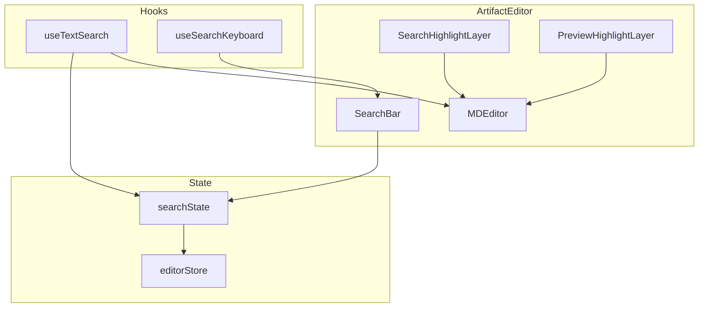
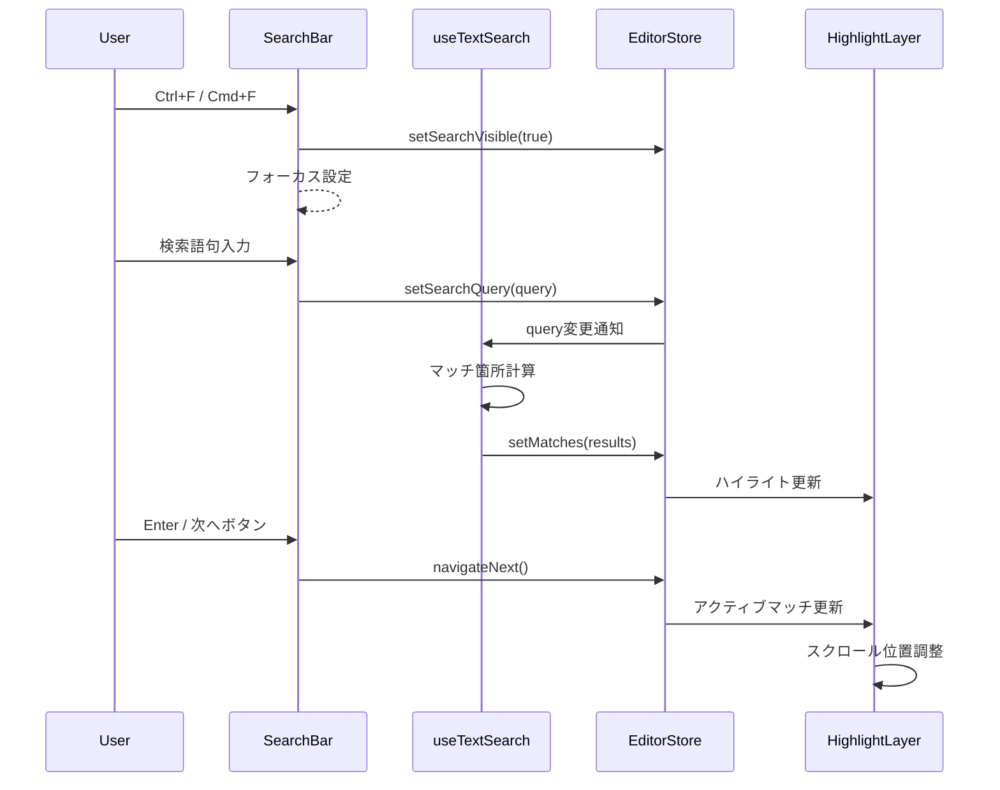
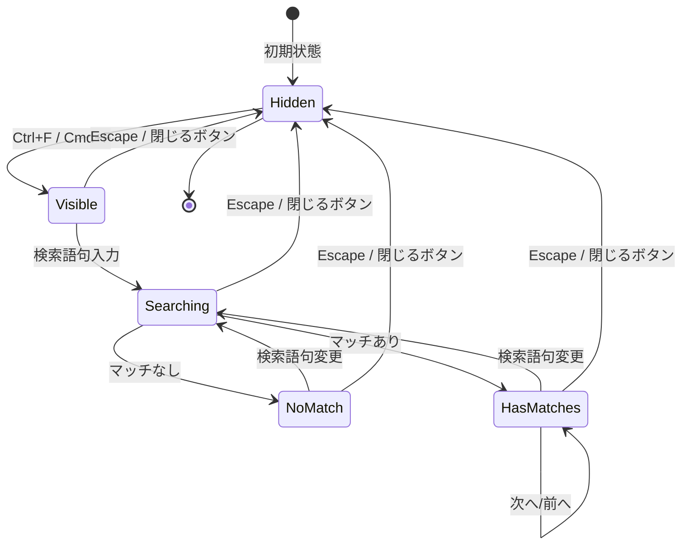
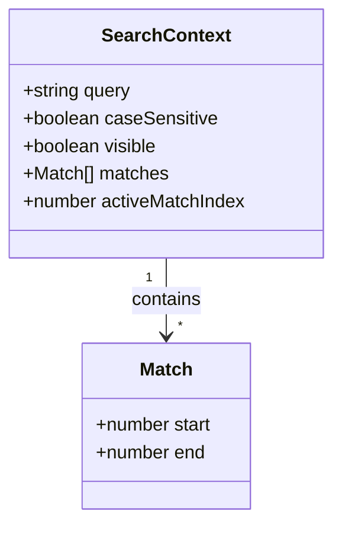

# Technical Design: ArtifactEditor 検索機能

## Overview

**Purpose**: ArtifactEditorコンポーネントにテキスト内検索機能を追加し、Spec/Bugドキュメントの効率的なナビゲーションを実現する。

**Users**: SDD OrchestratorユーザーがSpec/Bugドキュメント（requirements.md、design.md、tasks.md等）を閲覧・編集する際に、目的の情報を素早く検索・確認できる。

**Impact**: 既存のArtifactEditorコンポーネントを拡張し、検索バー、ハイライト表示、ナビゲーション機能を追加する。

### Goals

- キーボードショートカット（Ctrl+F/Cmd+F）による検索UIの呼び出し
- リアルタイムテキスト検索とマッチ箇所ハイライト
- マッチ箇所間のキーボード/ボタンナビゲーション
- プレビューモード・編集モード両対応のハイライト表示
- 大文字・小文字区別オプション

### Non-Goals

- 正規表現検索（将来の拡張として検討）
- 置換機能（本機能のスコープ外）
- 複数ファイル横断検索（ArtifactEditor単体の機能）
- 検索履歴の永続化

## Architecture

### Existing Architecture Analysis

現在のArtifactEditorは以下の構成:
- `ArtifactEditor.tsx`: メインコンポーネント（タブ、モード切替、保存機能）
- `editorStore.ts`: Zustandストア（content, activeTab, mode等の状態管理）
- `@uiw/react-md-editor`: Markdownエディタライブラリ（検索機能非搭載）

**統合ポイント**:
- 検索状態は既存の`editorStore`を拡張して管理
- 検索UIはArtifactEditor内に配置
- ハイライト表示はCSS Custom Highlight API（プレビュー）とオーバーレイ（編集モード）で実現

### Architecture Pattern & Boundary Map



**Architecture Integration**:
- 選択パターン: 既存コンポーネント拡張（Extension Pattern）
- ドメイン境界: 検索ロジックはカスタムフック（`useTextSearch`）に分離
- 既存パターン維持: Zustandストア拡張、コンポーネント分割
- 新コンポーネント: SearchBar、SearchHighlightLayerの追加

### Technology Stack

| Layer | Choice / Version | Role in Feature | Notes |
|-------|------------------|-----------------|-------|
| UI Framework | React 19 | 検索UI、状態管理 | 既存スタック |
| State | Zustand | 検索状態管理 | editorStore拡張 |
| Highlight (Preview) | CSS Custom Highlight API | プレビューモードハイライト | ブラウザネイティブAPI |
| Highlight (Edit) | カスタムオーバーレイ | 編集モードハイライト | textareaには直接ハイライト不可 |
| Icons | Lucide React | 検索UI アイコン | 既存スタック |

## System Flows

### 検索フロー



### ナビゲーションフロー



## Requirements Traceability

| Requirement | Summary | Components | Interfaces | Flows |
|-------------|---------|------------|------------|-------|
| 1.1, 1.2, 1.3, 1.4, 1.5 | 検索UIの表示・非表示 | SearchBar, useSearchKeyboard | SearchBarProps | 検索フロー |
| 2.1, 2.2, 2.3, 2.4, 2.5 | テキスト検索の実行 | useTextSearch, editorStore | SearchState | 検索フロー |
| 3.1, 3.2, 3.3, 3.4, 3.5 | マッチ箇所間のナビゲーション | SearchBar, useTextSearch | NavigationActions | ナビゲーションフロー |
| 4.1, 4.2, 4.3, 4.4 | ハイライト表示 | SearchHighlightLayer, PreviewHighlightLayer | HighlightProps | 検索フロー |
| 5.1, 5.2, 5.3 | 検索オプション | SearchBar, useTextSearch | SearchOptions | 検索フロー |

## Components and Interfaces

| Component | Domain/Layer | Intent | Req Coverage | Key Dependencies | Contracts |
|-----------|--------------|--------|--------------|------------------|-----------|
| SearchBar | UI | 検索入力UI、ナビゲーションボタン | 1.1-1.5, 3.1-3.5, 5.1-5.3 | editorStore (P0) | State |
| useTextSearch | Hook | 検索ロジック、マッチ計算 | 2.1-2.5 | editorStore (P0) | Service |
| useSearchKeyboard | Hook | キーボードショートカット処理 | 1.1, 1.2, 3.1, 3.2 | SearchBar (P0) | Service |
| SearchHighlightLayer | UI | 編集モードハイライト | 4.1, 4.2, 4.4 | MDEditor (P0) | State |
| PreviewHighlightLayer | UI | プレビューモードハイライト | 4.1, 4.2, 4.3 | MDEditor (P0) | State |
| editorStore (拡張) | State | 検索状態管理 | 2.1-2.5, 3.1-3.5 | - | State |

### UI Layer

#### SearchBar

| Field | Detail |
|-------|--------|
| Intent | 検索入力フィールド、ナビゲーションボタン、オプション切替を提供 |
| Requirements | 1.1, 1.2, 1.3, 1.4, 1.5, 3.1, 3.2, 5.1, 5.2, 5.3 |

**Responsibilities & Constraints**
- 検索語句の入力受付とリアルタイム反映
- 次へ/前へナビゲーションボタンの提供
- 大文字・小文字区別オプションのトグル
- マッチ件数表示（「N件中M件目」形式）
- Escapeキーで閉じる、閉じるボタンの提供

**Dependencies**
- Inbound: ArtifactEditor — 表示制御 (P0)
- Outbound: editorStore — 検索状態更新 (P0)

**Contracts**: State

##### State Management

```typescript
interface SearchBarProps {
  visible: boolean;
  onClose: () => void;
}
```

**Implementation Notes**
- Integration: ArtifactEditorのタブバー下に配置
- Validation: 空文字列入力時はハイライトをクリア
- Risks: 入力フォーカス管理、キーボードイベント競合

#### SearchHighlightLayer

| Field | Detail |
|-------|--------|
| Intent | 編集モード時のテキストハイライトオーバーレイ表示 |
| Requirements | 4.1, 4.2, 4.4 |

**Responsibilities & Constraints**
- textareaの上にオーバーレイを配置してハイライト表示
- アクティブマッチと通常マッチの色分け
- スクロール同期によるオーバーレイ位置調整

**Dependencies**
- Inbound: editorStore — マッチ情報取得 (P0)
- External: MDEditor textarea — 位置・スクロール同期 (P0)

**Contracts**: State

##### State Management

```typescript
interface HighlightMatch {
  start: number;
  end: number;
  isActive: boolean;
}

interface SearchHighlightLayerProps {
  content: string;
  matches: HighlightMatch[];
  activeIndex: number;
}
```

**Implementation Notes**
- Integration: MDEditorのtextareaにposition: relativeを設定し、オーバーレイをabsoluteで配置
- Validation: マッチ位置がコンテンツ範囲内であること
- Risks: スクロール同期のパフォーマンス、フォント・行高さの一致

#### PreviewHighlightLayer

| Field | Detail |
|-------|--------|
| Intent | プレビューモード時のMarkdownレンダリング後コンテンツへのハイライト適用 |
| Requirements | 4.1, 4.2, 4.3 |

**Responsibilities & Constraints**
- CSS Custom Highlight APIを使用したDOMハイライト
- レンダリング後のテキストノードに対するRange設定
- アクティブマッチの色分け

**Dependencies**
- Inbound: editorStore — マッチ情報取得 (P0)
- External: CSS.highlights API — ブラウザネイティブAPI (P0)

**Contracts**: State

##### State Management

```typescript
interface PreviewHighlightLayerProps {
  containerRef: React.RefObject<HTMLElement>;
  query: string;
  caseSensitive: boolean;
  activeIndex: number;
}
```

**Implementation Notes**
- Integration: MDEditorのpreviewコンテナへのref取得が必要
- Validation: CSS.highlights APIのブラウザサポート確認
- Risks: Electron/Chromiumでのサポートは確認済み、テキストノード走査のパフォーマンス

### Hook Layer

#### useTextSearch

| Field | Detail |
|-------|--------|
| Intent | テキスト検索ロジックの実行とマッチ位置の計算 |
| Requirements | 2.1, 2.2, 2.3, 2.4, 2.5 |

**Responsibilities & Constraints**
- 検索クエリに基づくマッチ位置の計算
- 大文字・小文字区別オプションの適用
- マッチ結果のメモ化によるパフォーマンス最適化

**Dependencies**
- Inbound: editorStore — content, query, caseSensitive (P0)
- Outbound: editorStore — matches更新 (P0)

**Contracts**: Service

##### Service Interface

```typescript
interface TextSearchResult {
  matches: Array<{ start: number; end: number }>;
  totalCount: number;
}

function useTextSearch(): {
  matches: TextSearchResult['matches'];
  totalCount: number;
  currentIndex: number;
  navigateNext: () => void;
  navigatePrev: () => void;
  setActiveIndex: (index: number) => void;
}
```

- Preconditions: content, queryがstring型であること
- Postconditions: matchesが有効な位置情報を含むこと
- Invariants: currentIndexは常に0からtotalCount-1の範囲（マッチがある場合）

**Implementation Notes**
- Integration: editorStoreのcontent, searchQuery, caseSensitiveをsubscribe
- Validation: 空クエリ時は空配列を返す
- Risks: 大量マッチ時のパフォーマンス（useMemoで最適化）

#### useSearchKeyboard

| Field | Detail |
|-------|--------|
| Intent | 検索関連キーボードショートカットの処理 |
| Requirements | 1.1, 1.2, 3.1, 3.2 |

**Responsibilities & Constraints**
- Ctrl+F/Cmd+F: 検索バー表示
- Escape: 検索バー非表示
- Enter: 次のマッチへ移動
- Shift+Enter: 前のマッチへ移動

**Dependencies**
- Inbound: window — keydownイベント (P0)
- Outbound: editorStore — 検索状態更新 (P0)

**Contracts**: Service

##### Service Interface

```typescript
function useSearchKeyboard(options: {
  enabled: boolean;
  onToggle: () => void;
  onClose: () => void;
  onNext: () => void;
  onPrev: () => void;
}): void;
```

- Preconditions: enabledがtrueの時のみイベント処理
- Postconditions: 適切なコールバックが呼び出されること

**Implementation Notes**
- Integration: ArtifactEditorコンポーネントのマウント時にイベントリスナー登録
- Validation: MDEditorのtextareaフォーカス時のイベント伝播制御
- Risks: 他のショートカットとの競合（Ctrl+Fはブラウザデフォルト）

### State Layer

#### editorStore (拡張)

| Field | Detail |
|-------|--------|
| Intent | 検索状態を既存のeditorStoreに追加 |
| Requirements | 2.1-2.5, 3.1-3.5, 5.1-5.3 |

**Responsibilities & Constraints**
- 検索クエリ、マッチ結果、アクティブインデックスの管理
- 大文字・小文字区別フラグの管理
- 検索バー表示状態の管理

**Dependencies**
- Inbound: 各UIコンポーネント、Hook (P0)

**Contracts**: State

##### State Management

```typescript
interface SearchState {
  searchVisible: boolean;
  searchQuery: string;
  caseSensitive: boolean;
  matches: Array<{ start: number; end: number }>;
  activeMatchIndex: number;
}

interface SearchActions {
  setSearchVisible: (visible: boolean) => void;
  setSearchQuery: (query: string) => void;
  setCaseSensitive: (caseSensitive: boolean) => void;
  setMatches: (matches: SearchState['matches']) => void;
  navigateToMatch: (index: number) => void;
  navigateNext: () => void;
  navigatePrev: () => void;
  clearSearch: () => void;
}
```

- Persistence: なし（セッション内のみ）
- Consistency: activeMatchIndexはmatches.length内に収まること
- Concurrency: Zustandのatomic更新で対応

## Data Models

### Domain Model

**検索コンテキスト**:
- エンティティ: SearchContext（検索セッション）
- 値オブジェクト: Match（マッチ位置）、SearchOptions（検索設定）
- 不変条件: activeMatchIndex < matches.length



### Logical Data Model

**Match構造**:
- start: number（開始位置、0-indexed）
- end: number（終了位置、排他的）
- 制約: start < end, start >= 0, end <= content.length

**SearchState構造**:
- searchVisible: boolean
- searchQuery: string
- caseSensitive: boolean（デフォルト: false）
- matches: Match[]（検索結果、空配列可）
- activeMatchIndex: number（-1: マッチなし、0以上: アクティブマッチ）

## Error Handling

### Error Strategy

検索機能は主にローカル処理のため、致命的エラーは発生しにくい。主なエラーケースはUIフィードバックで対応。

### Error Categories and Responses

**User Errors**:
- 検索クエリが空 → ハイライトをクリア、マッチ件数を非表示
- マッチなし → 「0件」表示、ハイライトなし

**System Errors**:
- CSS Custom Highlight API非サポート → フォールバック（DOM操作によるハイライト）
- パフォーマンス劣化（大量マッチ） → デバウンス処理、表示上限

### Monitoring

- コンソールログ: CSS.highlights APIサポート状況
- ユーザーフィードバック: マッチ件数表示

## Testing Strategy

### Unit Tests

- `useTextSearch`: マッチ計算ロジック、大文字・小文字区別、空クエリ処理
- `useSearchKeyboard`: キーボードイベント処理、プラットフォーム判定
- `editorStore (検索拡張)`: 状態更新、ナビゲーション、境界値

### Integration Tests

- SearchBar + useTextSearch: 入力からマッチ表示までのフロー
- SearchHighlightLayer + editorStore: ハイライト表示・更新
- PreviewHighlightLayer + CSS.highlights: プレビューモードハイライト

### E2E Tests

- Ctrl+F/Cmd+Fによる検索バー表示・非表示
- 検索語句入力とリアルタイムマッチ表示
- 次へ/前へナビゲーションとスクロール
- 編集モード・プレビューモードでのハイライト確認

### Performance Tests

- 大規模ドキュメント（10,000行）での検索レスポンス
- 大量マッチ（1,000件以上）時のUI応答性
- 連続入力時のデバウンス動作確認

## Optional Sections

### Performance & Scalability

**Target Metrics**:
- 検索レスポンス: 100ms以内（通常ドキュメント）
- ハイライト更新: 16ms以内（60fps維持）
- 最大マッチ表示: 10,000件（UI表示上限）

**Optimization Techniques**:
- useMemoによるマッチ計算のメモ化
- デバウンス（300ms）による入力最適化
- requestAnimationFrameによるハイライト更新

### Security Considerations

- 検索クエリは正規表現として解釈しない（ReDoS対策）
- ユーザー入力は表示前にエスケープ

## Supporting References

### CSS Custom Highlight API

```typescript
// ブラウザサポート確認
if (CSS.highlights) {
  const ranges: Range[] = [];
  // テキストノード走査とRange作成
  const treeWalker = document.createTreeWalker(
    containerElement,
    NodeFilter.SHOW_TEXT
  );

  let node = treeWalker.nextNode();
  while (node) {
    const text = node.textContent?.toLowerCase() ?? '';
    let startPos = 0;
    let index = text.indexOf(query.toLowerCase(), startPos);

    while (index !== -1) {
      const range = new Range();
      range.setStart(node, index);
      range.setEnd(node, index + query.length);
      ranges.push(range);
      startPos = index + query.length;
      index = text.indexOf(query.toLowerCase(), startPos);
    }

    node = treeWalker.nextNode();
  }

  if (ranges.length > 0) {
    const highlight = new Highlight(...ranges);
    CSS.highlights.set('search-results', highlight);
  }
}
```

### 編集モードオーバーレイ構造

```typescript
interface OverlaySegment {
  text: string;
  isMatch: boolean;
  isActive: boolean;
}

// コンテンツをセグメントに分割
function segmentContent(
  content: string,
  matches: Array<{ start: number; end: number }>,
  activeIndex: number
): OverlaySegment[];
```
