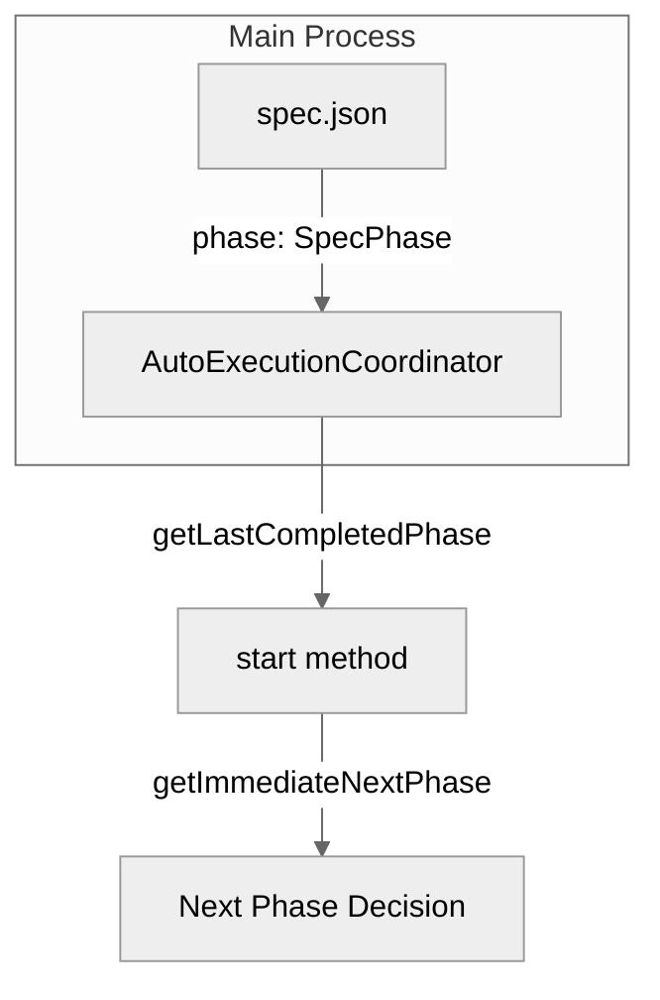
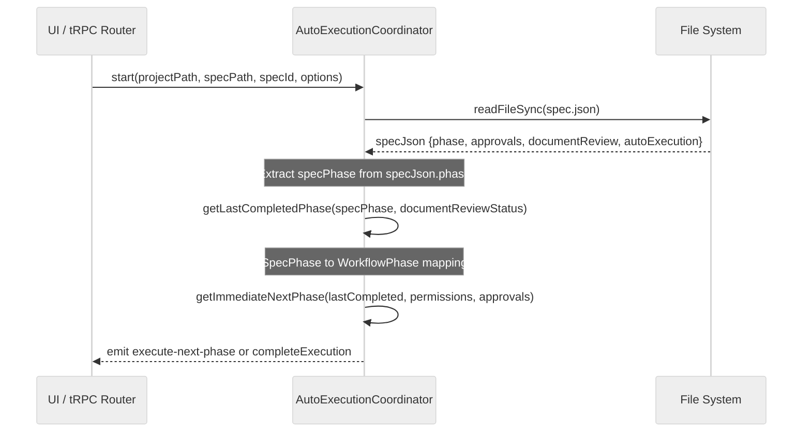

# Design: 自動実行開始フェーズ判定のSSOT化

## Overview

**Purpose**: `AutoExecutionCoordinator.getLastCompletedPhase()` のデータソースを `ApprovalsStatus`（requirements/design/tasks の3フェーズのみ）から `spec.json.phase`（`SpecPhase`）に変更し、impl 以降のフェーズ完了状態を正しく判定できるようにする。

**Users**: SDD Orchestrator ユーザーが impl 完了済みの spec に対して自動実行を開始した場合、inspection から正しく再開される。

**Impact**: `getLastCompletedPhase` のシグネチャ変更（第1引数: `ApprovalsStatus` -> `SpecPhase`）、呼び出し元 `start()` メソッドの修正、既存テストの更新。

### Goals

- `getLastCompletedPhase` が `spec.json.phase`（SSOT）をデータソースとして全フェーズの完了状態を正しく返す
- `start()` メソッドが `spec.json` から `phase` を読み取り、新シグネチャで `getLastCompletedPhase` を呼び出す
- 既存テスト・E2E テストで全フェーズのマッピングが検証される

### Non-Goals

- `isPreviousPhaseApproved` / `getNextPermittedPhase` / `getImmediateNextPhase` の変更（Out of Scope）
- `handleAgentCompleted()` 内のフェーズ遷移ロジックの変更
- `ApprovalsStatus` インターフェースの拡張
- `SpecPhase` に新しい値を追加すること

## Architecture

### Existing Architecture Analysis

現在の `getLastCompletedPhase` は `ApprovalsStatus`（requirements/design/tasks の3フェーズのみ）に依存しており、以下のマッピングしかできない:

| 入力 | 出力 |
|------|------|
| tasks.approved/generated + documentReviewStatus === 'approved' | `'document-review'` |
| tasks.approved/generated | `'tasks'` |
| design.approved/generated | `'design'` |
| requirements.approved/generated | `'requirements'` |
| 上記いずれにも該当しない | `null` |

`implementation-complete`, `inspection-complete`, `deploy-complete` の判定ができないため、impl 完了後に自動実行を開始すると `'tasks'` または `'document-review'` が返され、impl が再実行されるバグが発生する。

### Architecture Pattern & Boundary Map



**Key Decisions**:
- `getLastCompletedPhase` のみを変更対象とし、他のフェーズ判定メソッドは既存の `ApprovalsStatus` を使い続ける（関心の分離）
- `SpecPhase` -> `WorkflowPhase` のマッピングは静的な switch 文で実装（外部依存なし）
- `spec.json` の読み取りは既存の `start()` メソッド内の読み取りブロックに `phase` フィールドを追加するのみ

### Technology Stack

| Layer | Choice / Version | Role in Feature | Notes |
|-------|------------------|-----------------|-------|
| Backend / Services | TypeScript 5.8+ | `autoExecutionCoordinator.ts` 変更 | 既存 |
| Data / Storage | `spec.json` | `phase` フィールド読み取り | 既存フィールド、変更なし |
| Testing | Vitest, WebdriverIO | ユニットテスト・E2E テスト | 既存 |

## System Flows

### 自動実行開始フェーズ判定フロー



**Key Decisions**:
- `specPhase` は既存の `spec.json` 読み取りブロック内で取得するため、追加のファイル I/O は発生しない
- 読み取り失敗時のフォールバック値は `'initialized'`（最も安全: requirements から開始）
- `documentReviewStatus` パラメータは維持し、`tasks-generated` + `approved` の組み合わせ判定に使用

## Requirements Traceability

| Criterion ID | Summary | Components | Implementation Approach |
|--------------|---------|------------|------------------------|
| 1.1 | 第1引数を `SpecPhase` に変更 | `AutoExecutionCoordinator.getLastCompletedPhase` | 既存メソッドのシグネチャ変更 |
| 1.2 | 第2引数 `documentReviewStatus` 維持 | `AutoExecutionCoordinator.getLastCompletedPhase` | 変更なし（維持） |
| 1.3 | 戻り値型 `WorkflowPhase \| null` 維持 | `AutoExecutionCoordinator.getLastCompletedPhase` | 変更なし（維持） |
| 2.1 | SpecPhase -> WorkflowPhase マッピング | `AutoExecutionCoordinator.getLastCompletedPhase` | switch 文による静的マッピング |
| 2.2 | 未知の SpecPhase で `null` を返す | `AutoExecutionCoordinator.getLastCompletedPhase` | default ケース |
| 3.1 | `start()` が `phase` を読み取る | `AutoExecutionCoordinator.start` | 既存 spec.json 読み取りブロックに追加 |
| 3.2 | `specPhase` を新シグネチャで渡す | `AutoExecutionCoordinator.start` | 呼び出し箇所の修正 |
| 3.3 | 読み取り失敗時 `'initialized'` フォールバック | `AutoExecutionCoordinator.start` | catch ブロック内での初期値設定 |
| 3.4 | impl-complete -> inspection シナリオ | `AutoExecutionCoordinator.start`, `getLastCompletedPhase` | 結合テストで検証 |
| 4.1 | 既存テストの新シグネチャ対応 | `autoExecutionCoordinator.test.ts` | テストコードの引数変更 |
| 4.2 | 新 SpecPhase テストケース追加 | `autoExecutionCoordinator.test.ts` | impl/inspection/deploy テスト追加 |
| 4.3 | `start()` テストの正常パス確認 | `autoExecutionCoordinator.test.ts` | 既存テストの修正 |
| 5.1 | impl 完了状態からの E2E テスト | `auto-execution-phase-ssot.e2e.spec.ts` | 新規 E2E テストファイル |
| 5.2 | 既存 E2E テストパターン準拠 | `auto-execution-phase-ssot.e2e.spec.ts` | `auto-execution-impl-flow.e2e.spec.ts` パターン踏襲 |

### Coverage Validation Checklist

- [x] Every criterion ID from requirements.md appears in the table above
- [x] Each criterion has specific component names (not generic references)
- [x] Implementation approach distinguishes "reuse existing" vs "new implementation"
- [x] User-facing criteria specify concrete UI components (not just "shared components")

## Components and Interfaces

| Component | Domain/Layer | Intent | Req Coverage | Key Dependencies | Contracts |
|-----------|--------------|--------|--------------|-----------------|-----------|
| `getLastCompletedPhase` | Main/AutoExecution | SpecPhase -> WorkflowPhase マッピング | 1.1, 1.2, 1.3, 2.1, 2.2 | `SpecPhase` 型 (P0) | Service |
| `start` | Main/AutoExecution | 自動実行開始、spec.json から phase 読み取り | 3.1, 3.2, 3.3, 3.4 | `getLastCompletedPhase` (P0), `FileSystem` (P0) | Service |
| `autoExecutionCoordinator.test.ts` | Test | ユニットテスト更新 | 4.1, 4.2, 4.3 | `AutoExecutionCoordinator` (P0) | - |
| `auto-execution-phase-ssot.e2e.spec.ts` | E2E Test | E2E テスト新規追加 | 5.1, 5.2 | E2E test helpers (P0) | - |

### Main / AutoExecution Layer

#### `getLastCompletedPhase` (メソッドシグネチャ変更)

| Field | Detail |
|-------|--------|
| Intent | `SpecPhase` を受け取り、対応する最後に完了した `WorkflowPhase` を返す |
| Requirements | 1.1, 1.2, 1.3, 2.1, 2.2 |

**Responsibilities & Constraints**
- `spec.json.phase` (SpecPhase) を唯一のデータソースとして使用する
- `documentReviewStatus` は `tasks-generated` 時のサブ判定にのみ使用する
- 戻り値の型は変更しない（`WorkflowPhase | null`）

**Dependencies**
- Inbound: `start()` メソッド -- フェーズ判定 (P0)
- External: `SpecPhase` 型 (`renderer/types/index.ts`) -- 入力型 (P0)

**Contracts**: Service [x]

##### Service Interface

```typescript
// Before (現行)
getLastCompletedPhase(
  approvals: ApprovalsStatus,
  documentReviewStatus?: 'pending' | 'in_progress' | 'approved'
): WorkflowPhase | null;

// After (変更後)
getLastCompletedPhase(
  specPhase: SpecPhase,
  documentReviewStatus?: 'pending' | 'in_progress' | 'approved'
): WorkflowPhase | null;
```

- Preconditions: `specPhase` は有効な `SpecPhase` 値または未知の文字列
- Postconditions: マッピング表（Requirement 2.1）に従った `WorkflowPhase | null` を返す
- Invariants: 未知の `specPhase` 値に対して `null` を返す（安全側に倒す）

#### `start` メソッド (呼び出し元修正)

| Field | Detail |
|-------|--------|
| Intent | `spec.json` から `phase` を読み取り、`getLastCompletedPhase` に渡す |
| Requirements | 3.1, 3.2, 3.3, 3.4 |

**Responsibilities & Constraints**
- 既存の `spec.json` 読み取りブロック内で `phase` フィールドを追加取得する
- `approvals` 変数に依存した `getLastCompletedPhase` 呼び出しを `specPhase` ベースに変更する
- `spec.json` 読み取り失敗時は `specPhase = 'initialized'` をフォールバックとする

**Dependencies**
- Outbound: `getLastCompletedPhase` -- フェーズ判定 (P0)
- External: `fs.readFileSync` -- spec.json 読み取り (P0)

**Contracts**: Service [x]

##### Service Interface

```typescript
// start メソッドのシグネチャは変更なし
async start(
  projectPath: string,
  specPath: string,
  specId: string,
  options: AutoExecutionOptions
): Promise<Result<AutoExecutionState, AutoExecutionError>>;
```

- Preconditions: `specPath` に有効な `spec.json` が存在すること（存在しない場合はフォールバック）
- Postconditions: `specPhase` に基づいた正しいフェーズから自動実行が開始される
- Invariants: `start()` の外部インターフェースは変更されない

**Implementation Notes**
- Integration: `approvals` の条件分岐ブロックを修正し、`specPhase` ベースの呼び出しに変更
- Validation: `specJson.phase` が存在しない場合は `'initialized'` にフォールバック
- Risks: `approvals` 依存の自動承認ロジック（`getUnapprovedGeneratedPhases`）は変更不要（独立した処理）

## Data Models

### SpecPhase -> WorkflowPhase マッピング

| SpecPhase | documentReviewStatus | WorkflowPhase |
|-----------|---------------------|---------------|
| `'initialized'` | any | `null` |
| `'requirements-generated'` | any | `'requirements'` |
| `'design-generated'` | any | `'design'` |
| `'tasks-generated'` | `!== 'approved'` | `'tasks'` |
| `'tasks-generated'` | `=== 'approved'` | `'document-review'` |
| `'implementation-complete'` | any | `'impl'` |
| `'inspection-complete'` | any | `'inspection'` |
| `'deploy-complete'` | any | `'inspection'` |
| 未知の値 | any | `null` |

このマッピングは `getLastCompletedPhase` メソッド内の switch 文で実装される。

## Error Handling

### Error Strategy

| エラーケース | 対処 | 戻り値 |
|-------------|------|--------|
| `spec.json` 読み取り失敗 | `specPhase = 'initialized'` にフォールバック | `null`（requirements から開始） |
| `specJson.phase` が未定義 | `specPhase = 'initialized'` にフォールバック | `null` |
| 未知の `SpecPhase` 値 | switch の default ケース | `null` |

既存のエラーハンドリングパターン（`start()` 内の try-catch）をそのまま活用する。新しいエラーカテゴリの追加は不要。

## Testing Strategy

### Unit Tests

1. **`getLastCompletedPhase` 新シグネチャテスト**: 各 `SpecPhase` 値に対する `WorkflowPhase` マッピングの網羅テスト（7 SpecPhase + 未知値 + documentReviewStatus 組み合わせ）
2. **既存テストの移行**: 現行の `ApprovalsStatus` ベースのテストを `SpecPhase` ベースに書き換え
3. **`start()` メソッドテスト**: `specJson.phase` 読み取りと `getLastCompletedPhase` 呼び出しの検証（`implementation-complete` -> inspection 開始シナリオを含む）
4. **フォールバックテスト**: `spec.json` 読み取り失敗時に `'initialized'` が使用されることの検証

### E2E Tests

1. **impl 完了状態からの自動実行再開**: `phase === 'implementation-complete'` の spec.json を fixture として用意し、自動実行開始 -> inspection が実行されることを検証

### Integration Test Strategy

**Components**: `AutoExecutionCoordinator`, `FileSystem`（spec.json 読み取り）
**Data Flow**: `start()` -> spec.json 読み取り -> `getLastCompletedPhase(specPhase)` -> `getImmediateNextPhase` -> `execute-next-phase` イベント発火
**Mock Boundaries**: ファイルシステム（`fs.readFileSync`）はテスト内で直接モック済み（既存パターン）。`AutoExecutionCoordinator` は実インスタンスを使用。
**Verification Points**:
- `getLastCompletedPhase('implementation-complete')` が `'impl'` を返すこと
- `start()` 呼び出し後に `execute-next-phase` イベントが `'inspection'` フェーズで発火されること
**Robustness Strategy**: `getLastCompletedPhase` は同期的な純粋関数であり、非同期タイミングの問題は発生しない。`start()` テストでは既存の `vi.mock('fs')` パターンでファイル読み取りをモックする。
**Prerequisites**: 既存の `autoExecutionCoordinator.test.ts` テストインフラをそのまま使用。新しいテストヘルパーは不要。

## Design Decisions

### DD-001: `getLastCompletedPhase` のデータソースを `SpecPhase` に変更

| Field | Detail |
|-------|--------|
| Status | Accepted |
| Context | `ApprovalsStatus` は requirements/design/tasks の3フェーズのみを持ち、impl 以降の完了状態を表現できない。`spec.json.phase` は全フェーズの完了状態を SSOT として保持している。 |
| Decision | `getLastCompletedPhase` の第1引数を `ApprovalsStatus` から `SpecPhase` に変更し、switch 文で `WorkflowPhase` にマッピングする。 |
| Rationale | `spec.json.phase` は既に全フェーズの遷移を正確に追跡しており、SSOT として最適。`ApprovalsStatus` の拡張は型の責務を超える。 |
| Alternatives Considered | (1) `ApprovalsStatus` に `impl`/`inspection`/`deploy` フィールドを追加 -- requirements.md の Out of Scope で明示的に除外。型の責務が曖昧になる。(2) `spec.json` 全体を渡す -- 過剰な結合。必要なのは `phase` フィールドのみ。 |
| Consequences | 既存テスト（7件）の引数変更が必要。`getLastCompletedPhase` の呼び出し元は `start()` メソッド内の1箇所のみであり、影響範囲は限定的。 |

### DD-002: `start()` メソッドの `approvals` 条件分岐を維持

| Field | Detail |
|-------|--------|
| Status | Accepted |
| Context | `start()` 内の `if (approvals)` ブロックは自動承認ロジック（`getUnapprovedGeneratedPhases`）と `getLastCompletedPhase` 呼び出しの両方を含む。`getLastCompletedPhase` のデータソース変更に伴い、この条件分岐を撤廃するか維持するかの選択。 |
| Decision | `approvals` 条件分岐を維持し、`getLastCompletedPhase` 呼び出しのみを条件分岐の外に移動する。 |
| Rationale | 自動承認ロジックは引き続き `approvals` に依存する（Requirement 3 の Out of Scope）。`getLastCompletedPhase` は `specPhase` のみに依存するため、`approvals` の有無に関係なく呼び出せる。 |
| Alternatives Considered | (1) 条件分岐を完全撤廃し `specPhase` のみで判定 -- 自動承認ロジックの移動が必要となり、スコープ超過。 |
| Consequences | `approvals` が未取得の場合でもフェーズ判定が可能になる（`specPhase` は独立して取得可能）。 |

### DD-003: `SpecPhase` 型の import 元

| Field | Detail |
|-------|--------|
| Status | Accepted |
| Context | `SpecPhase` 型は `renderer/types/index.ts` で定義され、`shared/api/types.ts` 経由で re-export されている。Main Process のサービスからどちらを import するか。 |
| Decision | `renderer/types/index.ts` から直接 import する。 |
| Rationale | `autoExecutionCoordinator.ts` は Main Process のサービスであり、`shared/api/types.ts` は API 抽象化層の型。`SpecPhase` は Spec ドメインの基本型であり、`renderer/types/index.ts` が定義元（SSOT）。ただし、既存コードで `renderer/types` からの import パターンが確認できない場合は `shared/api/types.ts` を使用する。 |
| Alternatives Considered | (1) `shared/api/types.ts` 経由 -- 間接的だが、Main Process からの import パスとして安全。(2) 新しい shared type ファイルに移動 -- YAGNI。 |
| Consequences | 型の import パスが明確になる。将来的に `SpecPhase` の定義元を移動する場合は別途検討。 |

## Integration & Deprecation Strategy

### 修正が必要な既存ファイル

| ファイル | 変更内容 |
|---------|---------|
| `electron-sdd-manager/src/main/services/autoExecutionCoordinator.ts` | `getLastCompletedPhase` シグネチャ変更、`start()` 内の呼び出し修正、`SpecPhase` import 追加 |
| `electron-sdd-manager/src/main/services/autoExecutionCoordinator.test.ts` | 既存テストの引数変更、新テストケース追加 |

### 新規作成ファイル

| ファイル | 内容 |
|---------|------|
| `electron-sdd-manager/e2e-wdio/auto-execution-phase-ssot.e2e.spec.ts` | impl 完了状態からの自動実行 E2E テスト |

### 削除対象ファイル

なし

## Interface Changes & Impact Analysis

### `getLastCompletedPhase` シグネチャ変更

**変更内容**: 第1引数の型を `ApprovalsStatus` から `SpecPhase` に変更

**Callee (変更対象)**:
- `autoExecutionCoordinator.ts` L962: `getLastCompletedPhase(approvals, documentReviewStatus)` -> `getLastCompletedPhase(specPhase, documentReviewStatus)`

**Caller (更新が必要な呼び出し元)**:

| Caller | ファイル | 行 | 変更内容 |
|--------|---------|-----|---------|
| `start()` メソッド | `autoExecutionCoordinator.ts` | L581 | `this.getLastCompletedPhase(approvals, documentReviewStatus)` を `this.getLastCompletedPhase(specPhase, documentReviewStatus)` に変更 |

**影響範囲**:
- `getLastCompletedPhase` の呼び出し元は `start()` メソッド内の **1箇所のみ** であり、影響範囲は極めて限定的
- `handleAgentCompleted()` は `getLastCompletedPhase` を呼び出さない（`currentPhase` を内部追跡しており独立したロジック）
- `AutoExecutionOptions.approvals` フィールドは引き続き `getUnapprovedGeneratedPhases` / `isPreviousPhaseApproved` / `getImmediateNextPhase` で使用されるため、削除不可
