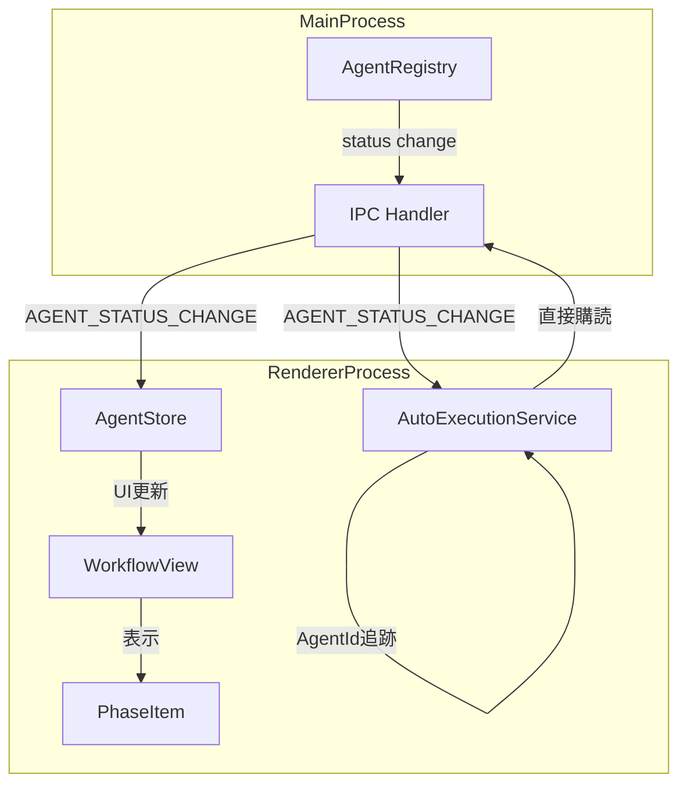
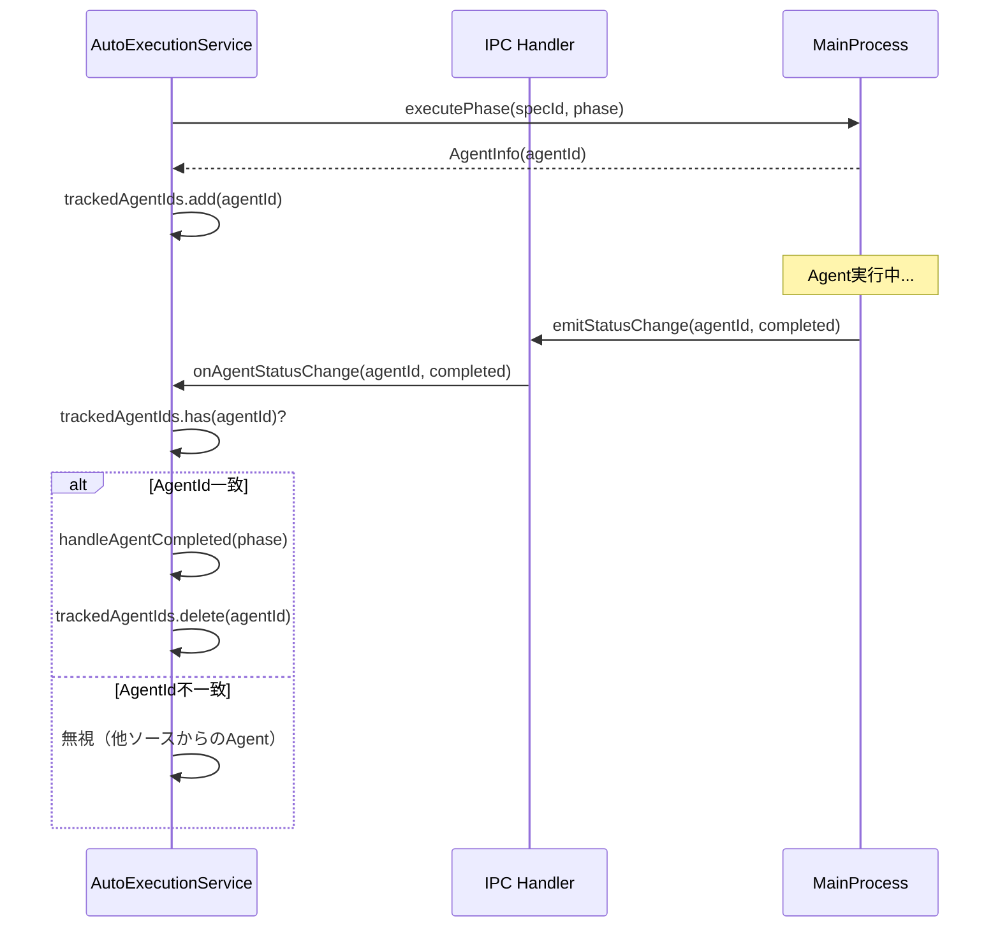
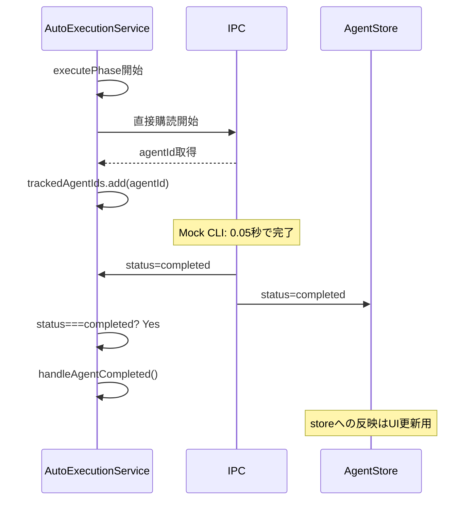

# Design Document

## Overview

**Purpose**: AutoExecutionServiceのAgent完了検知メカニズムを改善し、Mock CLIのような高速完了シナリオでもレースコンディションなく動作する堅牢なアーキテクチャを提供する。

**Users**: 開発者がE2Eテストや自動実行フローを実行する際に、Agentの完了を確実に検知し、次フェーズへの遷移を正しく行えるようにする。

**Impact**: 現在のZustand store subscription経由の間接的な監視から、IPC直接購読による明示的なAgent追跡への変更。これにより、高速完了時のイベント欠落問題を解消する。

### Goals

- IPC直接購読によるAgent完了検知の実現
- 自身が起動したAgentIdの明示的な追跡
- 状態遷移に依存しない完了判定ロジック
- 0.1秒未満の高速完了でも正しく検知

### Non-Goals

- AgentStoreの廃止（UI表示更新には引き続き使用）
- メインプロセス側のIPCイベント発信ロジックの変更
- 手動実行フローの変更

## Architecture

### Existing Architecture Analysis

現在のAutoExecutionServiceは以下の経路でAgent完了を検知している：

```
MainProcess → IPC(AGENT_STATUS_CHANGE) → AgentStore → AutoExecutionService(subscribe)
```

**問題点**:
1. Zustand store subscriptionは状態の**差分検知**に依存（`prevState !== state`）
2. Mock CLIが0.1秒未満で完了する場合、`running`状態がstoreに反映される前に`completed`に遷移
3. AgentStoreの`setupEventListeners`で既に`onAgentStatusChange`を購読しているが、AutoExecutionServiceはstore経由で間接的に監視
4. 高速完了時に`prevAgent?.status === 'running'`の条件を満たせず、完了を検知できない

### Architecture Pattern & Boundary Map



**Architecture Integration**:
- Selected pattern: Direct IPC Subscription with Agent ID Tracking
- Domain/feature boundaries: AutoExecutionServiceがIPC直接購読を持ち、AgentStoreはUI表示用に独立して存在
- Existing patterns preserved: AgentStoreのsubscription機構はUI更新用に維持
- New components rationale: 既存のAutoExecutionServiceを改修、新規コンポーネントは不要
- Steering compliance: DRY（IPC購読の重複は許容、責務が異なるため）、SSOT（Agent状態はMainProcessが権威）

### Technology Stack

| Layer | Choice / Version | Role in Feature | Notes |
|-------|------------------|-----------------|-------|
| Frontend | React 19 + TypeScript 5.8+ | AutoExecutionService改修 | 既存技術スタック維持 |
| State Management | Zustand | UI表示用状態管理（完了検知には使用しない） | 既存パターン維持 |
| IPC | Electron IPC | Agent完了イベントの直接購読 | `onAgentStatusChange` API使用 |

## System Flows

### Agent完了検知フロー（改善後）



### 高速完了時の動作（改善後）



## Requirements Traceability

| Requirement | Summary | Components | Interfaces | Flows |
|-------------|---------|------------|------------|-------|
| 1.1 | IPC直接購読でonAgentStatusChangeを購読 | AutoExecutionService | setupDirectIPCListener | Agent完了検知フロー |
| 1.2 | 受信AgentIdが自身起動のAgentか判定 | AutoExecutionService | isTrackedAgent | Agent完了検知フロー |
| 1.3 | status=completedで次フェーズ開始 | AutoExecutionService | handleAgentCompleted | Agent完了検知フロー |
| 1.4 | status=errorでエラー通知 | AutoExecutionService | handleAgentFailed | - |
| 1.5 | Zustand subscription依存を排除 | AutoExecutionService | dispose | - |
| 2.1 | Agent起動時にAgentIdを保持 | AutoExecutionService | trackedAgentIds | 高速完了時の動作 |
| 2.2 | フロー完了/中断時にAgentIdクリア | AutoExecutionService | clearTrackedAgentIds | - |
| 2.3 | 保持AgentIdと一致するもののみ処理 | AutoExecutionService | isTrackedAgent | Agent完了検知フロー |
| 2.4 | 複数AgentIdを順番に追跡 | AutoExecutionService | trackedAgentIds(Set) | - |
| 3.1 | status=completedのみで完了判定 | AutoExecutionService | handleDirectStatusChange | 高速完了時の動作 |
| 3.2 | status=errorのみでエラー判定 | AutoExecutionService | handleDirectStatusChange | - |
| 3.3 | running状態検知に依存しない | AutoExecutionService | handleDirectStatusChange | 高速完了時の動作 |
| 3.4 | running検知はUI表示のみに使用 | AgentStore | updateAgentStatus | - |
| 4.1 | 高速完了でも正しく検知 | AutoExecutionService | handleDirectStatusChange | 高速完了時の動作 |
| 4.2 | 連続イベントを順番に処理 | AutoExecutionService | handleDirectStatusChange | - |
| 4.3 | Agent起動とステータス購読の間に隙間なし | AutoExecutionService | executePhase | - |
| 4.4 | 0.1秒未満の完了でも検知 | AutoExecutionService | - | E2Eテスト |
| 5.1 | 手動実行時は既存動作維持 | AutoExecutionService | isAutoExecuting判定 | - |
| 5.2 | 停止ボタンで即座に中断 | AutoExecutionService | stop | - |
| 5.3 | UI表示はZustand経由で更新 | AgentStore, WorkflowView | - | - |
| 5.4 | AgentListPanel等は既存仕組みで更新 | AgentStore | - | - |

## Components and Interfaces

| Component | Domain/Layer | Intent | Req Coverage | Key Dependencies | Contracts |
|-----------|--------------|--------|--------------|------------------|-----------|
| AutoExecutionService | Service/Renderer | 自動実行フローの制御とAgent完了検知 | 1.1-1.5, 2.1-2.4, 3.1-3.4, 4.1-4.4, 5.1-5.2 | window.electronAPI (P0), workflowStore (P1), specStore (P1) | Service, State |
| AgentStore | Store/Renderer | Agent状態のUI表示用管理 | 3.4, 5.3, 5.4 | window.electronAPI (P0) | State |

### Service Layer

#### AutoExecutionService

| Field | Detail |
|-------|--------|
| Intent | 自動実行フローの制御、IPC直接購読によるAgent完了検知 |
| Requirements | 1.1-1.5, 2.1-2.4, 3.1-3.4, 4.1-4.4, 5.1-5.2 |

**Responsibilities & Constraints**
- 自動実行フローの開始/停止/リトライ制御
- IPC直接購読によるAgent完了/エラー検知
- 自身が起動したAgentIdの追跡管理
- 状態遷移に依存しない完了判定

**Dependencies**
- Inbound: WorkflowView — 自動実行の開始/停止トリガー (P0)
- Outbound: window.electronAPI — IPC直接購読、フェーズ実行 (P0)
- Outbound: workflowStore — 自動実行状態の管理 (P1)
- Outbound: specStore — Spec情報の取得 (P1)
- Outbound: notificationStore — エラー通知 (P2)

**Contracts**: Service [x] / State [x]

##### Service Interface

```typescript
interface AutoExecutionService {
  // 既存メソッド（変更なし）
  start(): boolean;
  stop(): Promise<void>;
  retryFrom(fromPhase: WorkflowPhase): boolean;
  getNextPermittedPhase(currentPhase: WorkflowPhase | null): WorkflowPhase | null;
  validatePreconditions(phase: WorkflowPhase): Promise<PreconditionResult>;
  continueToNextReviewRound(): void;
  approveReviewAndContinue(): Promise<void>;
  dispose(): void;

  // 既存メソッド（内部実装変更）
  // setupAgentListener() → setupDirectIPCListener() に置き換え
}
```

##### State Management

```typescript
interface AutoExecutionServiceState {
  // 新規追加: 追跡対象AgentIdのセット
  readonly trackedAgentIds: Set<string>;

  // 既存フィールド
  readonly executionStartTime: number | null;
  readonly currentTimeoutId: ReturnType<typeof setTimeout> | null;
  readonly executedPhases: WorkflowPhase[];
  readonly executedValidations: ValidationType[];
  readonly errors: string[];

  // IPC購読解除関数（既存のunsubscribeAgentStoreを置き換え）
  readonly unsubscribeIPC: (() => void) | null;
}
```

**Implementation Notes**
- Integration: constructorでsetupDirectIPCListenerを呼び出し、disposeで購読解除
- Validation: trackedAgentIds.has(agentId)でAgent追跡を検証
- Risks: IPC購読の解除漏れによるメモリリーク（disposeで対応）

### Store Layer

#### AgentStore

| Field | Detail |
|-------|--------|
| Intent | Agent状態のUI表示用管理（完了検知ロジックは持たない） |
| Requirements | 3.4, 5.3, 5.4 |

**Responsibilities & Constraints**
- Agent状態のZustand storeでの管理
- UI更新用のイベントリスナー維持
- AutoExecutionServiceの完了検知ロジックとは独立

**Dependencies**
- Inbound: AgentListPanel, AgentLogPanel — Agent状態表示 (P1)
- Outbound: window.electronAPI — IPC購読 (P0)

**Contracts**: State [x]

##### State Management

既存のAgentStoreインターフェースを維持。変更なし。

**Implementation Notes**
- Integration: 既存のsetupEventListenersは維持（UI更新用）
- Validation: 既存のロジックを維持
- Risks: なし（既存動作の維持）

## Data Models

### Domain Model

**TrackedAgentIds**:
- Value Object: Set<string>
- 用途: AutoExecutionServiceが起動したAgentのID追跡
- ライフサイクル: 自動実行開始時に初期化、各フェーズ実行時に追加、完了/中断時にクリア
- 不変条件: 同一AgentIdの重複なし

**AgentStatus（既存）**:
- Enum: 'running' | 'completed' | 'interrupted' | 'hang' | 'failed'
- 用途: Agent実行状態の表現
- 権威: MainProcess（AgentRegistry）

## Error Handling

### Error Strategy

**Agent実行エラー（status=error/failed）**:
1. handleDirectStatusChangeでstatus判定
2. trackedAgentIds.has(agentId)で自身のAgentか確認
3. handleAgentFailed呼び出し
4. workflowStore.setAutoExecutionStatus('error')
5. notify.errorでユーザー通知

**IPC購読エラー**:
1. setupDirectIPCListenerでtry-catch
2. エラー時はconsole.errorでログ出力
3. 自動実行は停止状態に遷移

### Monitoring

- console.log/errorによる開発時ログ出力
- MainProcess側のlogger.infoでAgent状態変更をログ

## Testing Strategy

### Unit Tests

1. **setupDirectIPCListener**: IPC購読が正しく設定されること
2. **isTrackedAgent**: trackedAgentIdsへの追加/削除/判定が正しく動作すること
3. **handleDirectStatusChange**: status=completedで次フェーズ遷移、status=errorでエラー処理
4. **executePhase後のAgentId追跡**: executePhase呼び出し後にtrackedAgentIdsにagentIdが追加されること
5. **stop時のAgentIdクリア**: stop呼び出しでtrackedAgentIdsがクリアされること

### Integration Tests

1. **IPC直接購読とAgentStore購読の共存**: 両方の購読が独立して動作すること
2. **高速完了シナリオ**: 0.1秒未満のAgent完了でもAutoExecutionServiceが正しく検知すること
3. **複数フェーズ連続実行**: requirements→design→tasksの順に正しく遷移すること
4. **中断と再開**: stop後にretryFromで正しく再開できること

### E2E Tests

1. **Mock CLIでの自動実行フロー**: Mock Claudeを使用した全フェーズ自動実行
2. **高速完了でのUI更新**: 0.05秒完了でもUIが正しく更新されること
3. **エラー時のUI表示**: Agent失敗時にエラー表示が正しく行われること
4. **停止ボタンの動作**: 自動実行中に停止ボタンで即座に中断できること

## Supporting References

### setupDirectIPCListener実装詳細

```typescript
private setupDirectIPCListener(): void {
  // IPC直接購読
  this.unsubscribeIPC = window.electronAPI.onAgentStatusChange(
    (agentId: string, status: AgentStatus) => {
      this.handleDirectStatusChange(agentId, status);
    }
  );
}

private handleDirectStatusChange(agentId: string, status: AgentStatus): void {
  // 自動実行中でない場合は無視
  if (!useWorkflowStore.getState().isAutoExecuting) return;

  // 自身が起動したAgentでない場合は無視
  if (!this.trackedAgentIds.has(agentId)) return;

  const currentPhase = useWorkflowStore.getState().currentAutoPhase;
  if (!currentPhase) return;

  // status判定（状態遷移に依存しない）
  if (status === 'completed') {
    // document-reviewフェーズの場合は専用ハンドラ
    const agent = useAgentStore.getState().getAgentById(agentId);
    if (agent?.phase === 'document-review') {
      this.handleDocumentReviewCompleted();
    } else if (agent?.phase === 'document-review-reply') {
      this.handleDocumentReviewReplyCompleted();
    } else {
      this.handleAgentCompleted(currentPhase);
    }
  } else if (status === 'error' || status === 'failed') {
    this.handleAgentFailed(currentPhase, 'Agent execution failed');
  }
  // running, interrupted, hangは無視（UI更新はAgentStoreが担当）
}
```

### executePhase改修詳細

タイミング問題の解決策として、**イベントバッファリング方式**を採用する。

**課題**: `await window.electronAPI.executePhase()`の完了を待っている間に、MainProcessでAgentが起動し即座に完了した場合、IPCイベントが`trackedAgentIds.add()`より先にRendererに到達する可能性がある。

**解決策**: 完了イベントを一時的にバッファリングし、agentIdが追跡リストに追加された後に処理する。

```typescript
// 状態プロパティ
private pendingEvents: Map<string, AgentStatus> = new Map();
private pendingAgentId: string | null = null;

private setupDirectIPCListener(): void {
  this.unsubscribeIPC = window.electronAPI.onAgentStatusChange(
    (agentId: string, status: AgentStatus) => {
      // 待機中のAgentIdと一致する場合はバッファリング
      if (this.pendingAgentId === agentId && !this.trackedAgentIds.has(agentId)) {
        this.pendingEvents.set(agentId, status);
        return;
      }
      this.handleDirectStatusChange(agentId, status);
    }
  );
}

private async executePhase(phase: WorkflowPhase): Promise<void> {
  // ... 既存の前処理 ...

  try {
    // 1. Pending状態を設定（IPC呼び出し前）
    // この時点ではagentIdは不明だが、次のexecutePhase呼び出しで返されるagentIdを待機する
    this.pendingAgentId = null; // リセット

    // 2. フェーズ実行（agentIdはMainProcessで生成される）
    const agentInfo = await window.electronAPI.executePhase(
      specDetail.metadata.name,
      phase,
      specDetail.metadata.name
    );

    // 3. AgentId追跡に追加
    this.trackedAgentIds.add(agentInfo.agentId);

    // 4. バッファリングされたイベントを処理
    const bufferedStatus = this.pendingEvents.get(agentInfo.agentId);
    if (bufferedStatus) {
      this.pendingEvents.delete(agentInfo.agentId);
      this.handleDirectStatusChange(agentInfo.agentId, bufferedStatus);
    }

    // 5. Pending状態をクリア
    this.pendingAgentId = null;

  } catch (error) {
    this.pendingAgentId = null;
    this.handleAgentFailed(
      phase,
      error instanceof Error ? error.message : 'Phase execution failed'
    );
  }
}
```

**代替案**: MainProcessでAgentId生成タイミングを変更し、`executePhase`呼び出し前にagentIdを取得する方法もあるが、MainProcess側の変更が必要となるため、Renderer側のバッファリング方式を採用。

**補足**: 実際の実装では、pendingAgentIdの設定タイミングをより厳密に制御するため、executePhasからの戻り値（agentId）を取得次第、即座にtrackedAgentIdsに追加し、その直後にバッファをフラッシュする。これにより、イベント欠落の可能性を最小化する。
