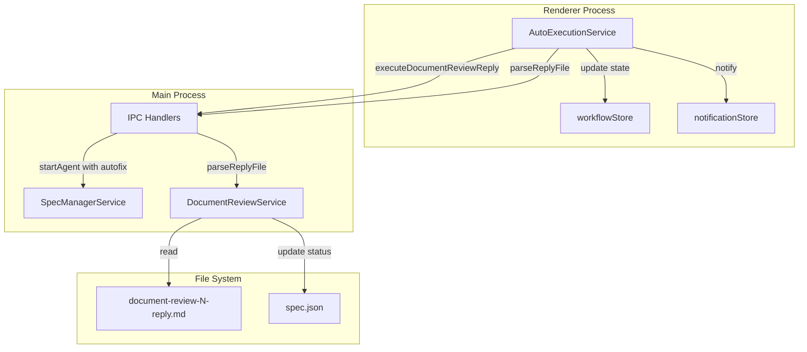
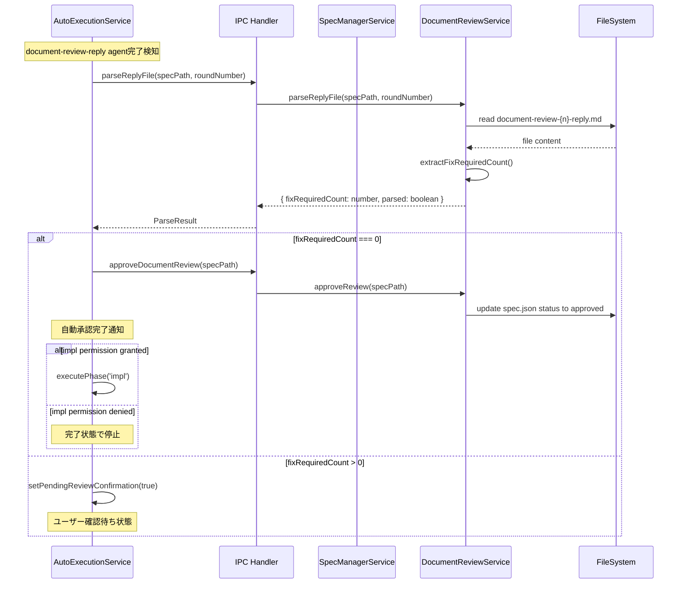
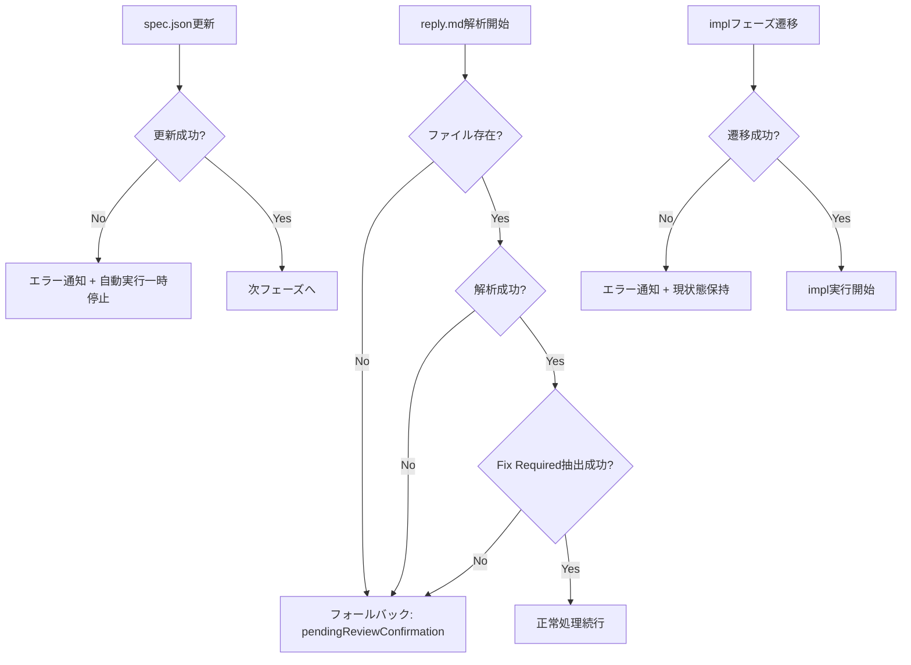

# Technical Design Document

## Overview

**Purpose**: 本機能は、自動実行モードにおけるドキュメントレビューワークフローを改善し、自動実行の継続性を向上させる。

**Users**: 自動実行モードを利用する開発者が、document-review-reply実行後に手動介入なしでワークフローを継続できる。

**Impact**: 既存のAutoExecutionServiceのdocument-review-reply処理を拡張し、autofixオプション付与、全issue解決時の自動承認、およびimplフェーズへの自動進行を実現する。

### Goals

- 自動実行モードでdocument-review-reply実行時に`--autofix`オプションを自動付与
- reply完了後、全issueが解決されている場合（Fix Required: 0）に自動承認してimplフェーズへ進行
- 未解決issueがある場合は従来どおりユーザー確認待ち状態に移行
- エラー発生時の安全なフォールバック処理

### Non-Goals

- document-review-reply.mdコマンドテンプレート自体の変更（既に`--autofix`オプションをサポート済み）
- 手動実行モードの動作変更
- 新しいUI画面の追加（既存コンポーネントへの表示更新のみ）

## Architecture

### Existing Architecture Analysis

現在のAutoExecutionServiceは、document-review-reply完了後に常に`pendingReviewConfirmation`状態に移行し、ユーザーの手動操作を待つ設計となっている。

```
現在のフロー:
tasks完了 → document-review → document-review-reply → [pendingReviewConfirmation] → ユーザー操作待ち
```

本機能では、reply完了後にreply.mdファイルを解析し、条件に応じて自動承認・自動進行を行う。

```
新フロー:
tasks完了 → document-review → document-review-reply (--autofix) → reply.md解析
  → Fix Required: 0 → 自動承認 → implフェーズ自動進行
  → Fix Required: 1以上 → pendingReviewConfirmation（従来どおり）
```

### Architecture Pattern & Boundary Map



**Architecture Integration**:
- 選択パターン: 既存のServiceパターンを拡張
- ドメイン境界: AutoExecutionService（Renderer）→ IPC → DocumentReviewService（Main）
- 既存パターン維持: Result型エラーハンドリング、IPCチャンネル定義、Zustand store
- 新規コンポーネント: ReplyFileParser（DocumentReviewService内のメソッドとして実装）
- Steering準拠: DRY（既存のIPC/Serviceパターン再利用）、SSOT（spec.jsonが状態の真実の源）

### Technology Stack

| Layer | Choice / Version | Role in Feature | Notes |
|-------|------------------|-----------------|-------|
| Frontend | React 19, Zustand | 状態管理、UI更新 | 既存のworkflowStore拡張 |
| Backend | Node.js 20, Electron 35 | IPC通信、ファイル操作 | 既存のDocumentReviewService拡張 |
| Data / Storage | spec.json, reply.md | 状態永続化、解析対象 | 既存フォーマット使用 |

## System Flows

### Reply完了後の自動処理フロー



### エラーハンドリングフロー



## Requirements Traceability

| Requirement | Summary | Components | Interfaces | Flows |
|-------------|---------|------------|------------|-------|
| 1.1 | 自動実行モードでautofix付与 | AutoExecutionService | executeDocumentReviewReply | reply実行フロー |
| 1.2 | 非自動実行モードでは付与しない | WorkflowView | handleExecuteDocumentReviewReply | 手動実行フロー |
| 1.3 | IPC handleがautofixを受け取る | IPC handlers, SpecManagerService | executeDocumentReviewReply | - |
| 2.1 | reply完了後にreply.md解析 | AutoExecutionService, DocumentReviewService | parseReplyFile | 解析フロー |
| 2.2 | Fix Required 0で自動承認 | AutoExecutionService, DocumentReviewService | approveDocumentReview | 自動承認フロー |
| 2.3 | Fix Required 1以上で確認待ち | AutoExecutionService | handleDocumentReviewReplyCompleted | - |
| 2.4 | reply.md解析機能 | DocumentReviewService | parseReplyFile | 解析フロー |
| 2.5 | 解析失敗時フォールバック | AutoExecutionService, DocumentReviewService | parseReplyFile | エラーフロー |
| 3.1 | 承認後にimplへ自動進行 | AutoExecutionService | approveReviewAndContinue | 自動進行フロー |
| 3.2 | 未承認時は確認待ち維持 | AutoExecutionService | handleDocumentReviewReplyCompleted | - |
| 3.3 | impl許可なしで停止 | AutoExecutionService | getNextPermittedPhase | - |
| 4.1 | 自動承認通知 | notificationStore | notify.success | UI更新 |
| 4.2 | フェーズ遷移表示更新 | workflowStore, UI | setAutoExecutionStatus | UI更新 |
| 4.3 | 解析中表示 | workflowStore, UI | setAutoExecutionStatus | UI更新 |
| 5.1 | reply.md解析エラーのログとフォールバック | DocumentReviewService | parseReplyFile | エラーフロー |
| 5.2 | spec.json更新エラーで一時停止 | AutoExecutionService | approveReviewAndContinue | エラーフロー |
| 5.3 | impl遷移エラーで状態保持 | AutoExecutionService | executePhase | エラーフロー |
| 5.4 | 全エラーでログ出力 | 全コンポーネント | logger | - |

## Components and Interfaces

| Component | Domain/Layer | Intent | Req Coverage | Key Dependencies | Contracts |
|-----------|--------------|--------|--------------|------------------|-----------|
| AutoExecutionService | Renderer/Service | 自動実行のオーケストレーション | 1.1, 2.1-2.3, 3.1-3.3, 5.2-5.3 | IPC (P0), workflowStore (P0) | Service |
| DocumentReviewService | Main/Service | reply.mdファイル解析 | 2.1, 2.4, 2.5, 5.1 | FileSystem (P0) | Service |
| SpecManagerService | Main/Service | agent起動（autofix付き） | 1.1, 1.3 | AgentProcess (P0) | Service |
| IPC handlers | Main/IPC | autofix引数の橋渡し | 1.3 | SpecManagerService (P0) | API |
| workflowStore | Renderer/Store | UI状態管理 | 4.2, 4.3 | - | State |
| notificationStore | Renderer/Store | 通知表示 | 4.1 | - | State |

### Renderer Layer

#### AutoExecutionService (拡張)

| Field | Detail |
|-------|--------|
| Intent | 自動実行モードでのdocument-review-replyフロー制御と自動進行判断 |
| Requirements | 1.1, 2.1, 2.2, 2.3, 3.1, 3.2, 3.3, 5.2, 5.3 |

**Responsibilities & Constraints**
- document-review-reply実行時に`--autofix`オプションを付与
- reply完了後にreply.mdを解析し、Fix Required数を判定
- 条件に応じて自動承認またはpendingReviewConfirmation状態に移行
- impl許可がある場合のみimplフェーズへ自動進行

**Dependencies**
- Outbound: window.electronAPI (P0) — IPC通信
- Outbound: workflowStore (P0) — 状態更新
- Outbound: notificationStore (P1) — 通知表示

**Contracts**: Service [x] / API [ ] / Event [ ] / Batch [ ] / State [ ]

##### Service Interface

```typescript
// 既存メソッドの拡張
interface AutoExecutionService {
  // 既存: document-review-reply agent完了ハンドラを拡張
  private handleDocumentReviewReplyCompleted(): Promise<void>;

  // 既存: document-review-reply実行（autofixオプション追加）
  private executeDocumentReviewReply(): Promise<void>;

  // 既存: レビュー承認して続行（自動呼び出し対応）
  approveReviewAndContinue(): Promise<void>;
}

interface ParseReplyResult {
  readonly parsed: boolean;
  readonly fixRequiredCount: number;
  readonly error?: string;
}
```

- Preconditions: isAutoExecutingがtrue、specDetailが存在
- Postconditions: 自動承認成功時はspec.json更新、impl許可時はimplフェーズ開始
- Invariants: 解析失敗・エラー時は安全側（pendingReviewConfirmation）にフォールバック

**Implementation Notes**
- Integration: 既存のhandleDocumentReviewReplyCompletedメソッドを拡張し、parseReplyFile呼び出しと条件分岐を追加
- Validation: parseReplyFileの戻り値をチェックし、parsedがfalseの場合はフォールバック
- Risks: reply.mdのフォーマット変更時に解析が失敗する可能性（低リスク：フォールバックで対応）

### Main Layer

#### DocumentReviewService (拡張)

| Field | Detail |
|-------|--------|
| Intent | document-review-reply.mdファイルを解析し、Fix Required数を抽出 |
| Requirements | 2.1, 2.4, 2.5, 5.1 |

**Responsibilities & Constraints**
- reply.mdファイルの読み込みと解析
- Response SummaryテーブルからFix Required数を抽出
- 解析失敗時は安全なResult型で返却

**Dependencies**
- Inbound: IPC handlers (P0) — parseReplyFile呼び出し
- External: fs/promises (P0) — ファイル読み込み

**Contracts**: Service [x] / API [ ] / Event [ ] / Batch [ ] / State [ ]

##### Service Interface

```typescript
interface DocumentReviewService {
  // 新規: reply.mdを解析してFix Required数を取得
  parseReplyFile(
    specPath: string,
    roundNumber: number
  ): Promise<Result<ParseReplyResult, ReviewError>>;
}

interface ParseReplyResult {
  readonly fixRequiredCount: number;
  readonly noFixNeededCount: number;
  readonly needsDiscussionCount: number;
}

// 既存のReviewErrorを使用
type ReviewError =
  | { type: 'FILE_NOT_FOUND'; path: string }
  | { type: 'PARSE_ERROR'; message: string }
  | { type: 'AGENT_ERROR'; message: string };
```

- Preconditions: specPath内にdocument-review-{roundNumber}-reply.mdが存在
- Postconditions: 解析成功時はカウント値を返却、失敗時はエラー詳細を返却
- Invariants: ファイル内容を変更しない（読み取り専用）

**Implementation Notes**
- Integration: 既存のDocumentReviewServiceクラスに新規メソッドを追加
- Validation: Response Summaryテーブルの正規表現パターンマッチング
- Risks: reply.mdのフォーマットが予期しない形式の場合にPARSE_ERRORを返却

#### SpecManagerService (拡張)

| Field | Detail |
|-------|--------|
| Intent | document-review-reply実行時に--autofixオプションを付与 |
| Requirements | 1.1, 1.3 |

**Responsibilities & Constraints**
- executeDocumentReviewReplyにautofixパラメータを追加
- コマンド引数に`--autofix`を追加

**Dependencies**
- Inbound: IPC handlers (P0) — executeDocumentReviewReply呼び出し
- Outbound: AgentProcess (P0) — agent起動

**Contracts**: Service [x] / API [ ] / Event [ ] / Batch [ ] / State [ ]

##### Service Interface

```typescript
interface ExecuteDocumentReviewReplyOptions {
  specId: string;
  featureName: string;
  reviewNumber: number;
  commandPrefix?: 'kiro' | 'spec-manager';
  autofix?: boolean;  // 新規追加
}

interface SpecManagerService {
  // 既存メソッドの引数拡張
  executeDocumentReviewReply(
    options: ExecuteDocumentReviewReplyOptions
  ): Promise<Result<AgentInfo, AgentError>>;
}
```

- Preconditions: specId, featureName, reviewNumberが有効
- Postconditions: autofix=trueの場合、コマンドに`--autofix`が付与される
- Invariants: 既存の戻り値型・エラーハンドリングを維持

**Implementation Notes**
- Integration: 既存のexecuteDocumentReviewReplyメソッドにautofix引数を追加し、buildClaudeArgsで`--autofix`を付与
- Validation: autofixはオプショナル、デフォルトfalse
- Risks: なし（後方互換性維持）

#### IPC handlers (拡張)

| Field | Detail |
|-------|--------|
| Intent | autofixパラメータとparseReplyFile呼び出しをIPCで橋渡し |
| Requirements | 1.3, 2.1 |

**Responsibilities & Constraints**
- executeDocumentReviewReply IPCチャンネルにautofix引数を追加
- parseReplyFile IPCチャンネルを新規追加

**Dependencies**
- Outbound: SpecManagerService (P0) — agent起動
- Outbound: DocumentReviewService (P0) — ファイル解析

**Contracts**: Service [ ] / API [x] / Event [ ] / Batch [ ] / State [ ]

##### API Contract

| Method | Endpoint | Request | Response | Errors |
|--------|----------|---------|----------|--------|
| invoke | EXECUTE_DOCUMENT_REVIEW_REPLY | specId, featureName, reviewNumber, commandPrefix, autofix | AgentInfo | Error |
| invoke | PARSE_REPLY_FILE | specPath, roundNumber | ParseReplyResult | ReviewError |

**Implementation Notes**
- Integration: channels.tsに新規チャンネル定義、handlers.tsにハンドラ実装
- Validation: パラメータの型チェックはTypeScriptで保証
- Risks: なし

### Store Layer

#### workflowStore (拡張)

| Field | Detail |
|-------|--------|
| Intent | UI状態表示のための状態管理 |
| Requirements | 4.2, 4.3 |

変更なし。既存の`autoExecutionStatus`と`pendingReviewConfirmation`を使用。

**Implementation Notes**
- Integration: 既存のsetAutoExecutionStatusで'running'（解析中表示）、setPendingReviewConfirmationで確認待ち表示
- Risks: なし

#### notificationStore (拡張)

| Field | Detail |
|-------|--------|
| Intent | 自動承認通知の表示 |
| Requirements | 4.1 |

変更なし。既存の`notify.success`を使用。

**Implementation Notes**
- Integration: AutoExecutionServiceから`notify.success('ドキュメントレビューが自動承認されました')`を呼び出し
- Risks: なし

## Data Models

### Domain Model

既存の`DocumentReviewState`を使用。新規ドメインモデルの追加なし。

### Logical Data Model

#### ParseReplyResult

```typescript
interface ParseReplyResult {
  readonly fixRequiredCount: number;
  readonly noFixNeededCount: number;
  readonly needsDiscussionCount: number;
}
```

- 一時的なデータ構造（永続化なし）
- reply.md解析結果を表現

#### reply.mdファイルフォーマット（既存）

Response Summaryテーブルから以下の情報を抽出:

```markdown
## Response Summary

| Severity | Issues | Fix Required | No Fix Needed | Needs Discussion |
| -------- | ------ | ------------ | ------------- | ---------------- |
| Critical | X      | X            | X             | X                |
| Warning  | X      | X            | X             | X                |
| Info     | X      | X            | X             | X                |
```

解析対象: 各行の`Fix Required`列の数値を合計

#### 解析用正規表現パターン

```typescript
// Response Summaryテーブルの行パターン
// 例: | Critical | 0      | 0            | 0             | 0                |
const TABLE_ROW_PATTERN = /^\|\s*(Critical|Warning|Info)\s*\|\s*(\d+)\s*\|\s*(\d+)\s*\|\s*(\d+)\s*\|\s*(\d+)\s*\|/gm;
// キャプチャグループ:
//   1 = Severity (Critical|Warning|Info)
//   2 = Issues
//   3 = Fix Required
//   4 = No Fix Needed
//   5 = Needs Discussion
```

解析アルゴリズム:
1. reply.mdファイルを読み込み
2. TABLE_ROW_PATTERNで全マッチを取得
3. 各マッチのグループ3（Fix Required）を数値として合計
4. グループ4（No Fix Needed）、グループ5（Needs Discussion）も同様に合計
5. ParseReplyResultとして返却

## Error Handling

### Error Strategy

全エラーシナリオで「安全側にフォールバック」する設計方針を採用。

### Error Categories and Responses

**System Errors (reply.md解析関連)**:
- FILE_NOT_FOUND: reply.mdが存在しない → pendingReviewConfirmationにフォールバック
- PARSE_ERROR: フォーマット不正 → pendingReviewConfirmationにフォールバック

**System Errors (spec.json更新関連)**:
- 書き込みエラー → エラー通知 + 自動実行一時停止

**System Errors (implフェーズ遷移関連)**:
- 遷移エラー → エラー通知 + 現在の状態を保持

### Monitoring

既存のlogger使用。全エラーパスでlogger.error出力。

```typescript
// エラーログ例
logger.error('[DocumentReviewService] Failed to parse reply file', {
  specPath,
  roundNumber,
  error: error.message
});
```

## Testing Strategy

### Unit Tests

| テスト対象 | テスト内容 |
|-----------|-----------|
| DocumentReviewService.parseReplyFile | 正常なreply.mdからFix Required数を抽出 |
| DocumentReviewService.parseReplyFile | ファイル不存在時にFILE_NOT_FOUNDエラー |
| DocumentReviewService.parseReplyFile | フォーマット不正時にPARSE_ERRORエラー |
| AutoExecutionService.handleDocumentReviewReplyCompleted | Fix Required 0で自動承認呼び出し |
| AutoExecutionService.handleDocumentReviewReplyCompleted | Fix Required 1以上でpendingReviewConfirmation設定 |
| SpecManagerService.executeDocumentReviewReply | autofix=trueで--autofixオプション付与 |

### Integration Tests

| テスト対象 | テスト内容 |
|-----------|-----------|
| IPC: PARSE_REPLY_FILE | Main/Renderer間のIPC通信正常動作 |
| IPC: EXECUTE_DOCUMENT_REVIEW_REPLY | autofixパラメータがagentコマンドに反映 |
| AutoExecutionService→DocumentReviewService | reply完了から自動承認までのE2Eフロー |

### E2E Tests

| テスト対象 | テスト内容 |
|-----------|-----------|
| 自動実行フロー | tasks→document-review→reply→自動承認→impl自動進行 |
| エラーフォールバック | reply.md解析失敗時にpendingReviewConfirmation表示 |
