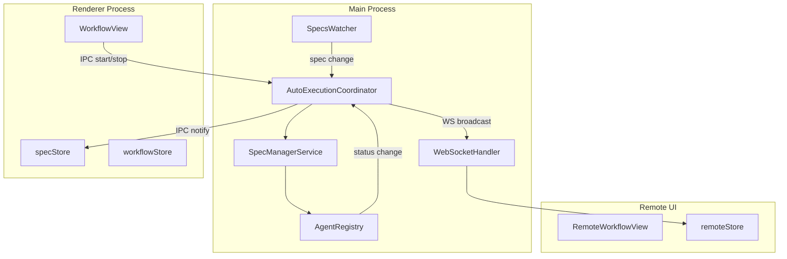
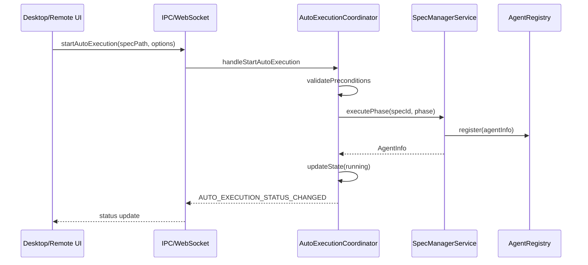
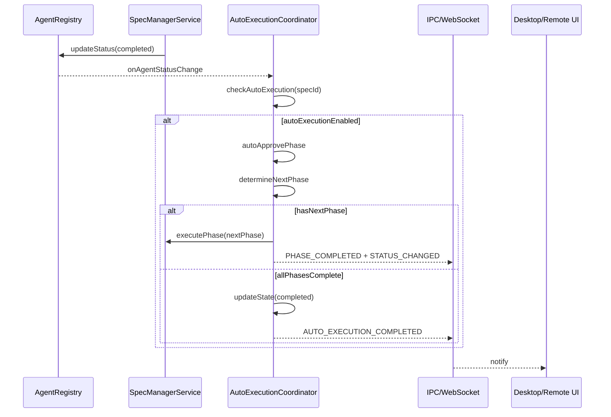
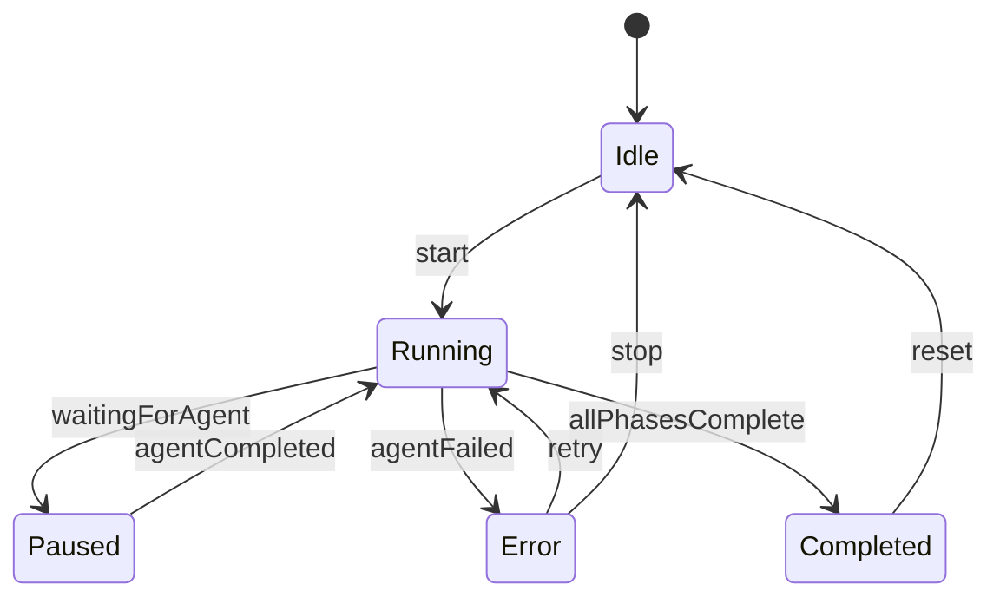

# Design Document: auto-execution-main-process

## Overview

**Purpose**: 本機能は、自動実行ロジック（AutoExecutionService）をRenderer ProcessからMain Processへ移行し、エージェント状態のSSoT（Single Source of Truth）を明確化する。これによりIPCイベントとファイル監視の同期問題を解消し、Desktop UIとRemote UIの両方で一貫した自動実行操作を実現する。

**Users**: Desktop UIユーザーとRemote UIユーザーが、一貫したインターフェースで自動実行ワークフローを操作する。

**Impact**: 現在Renderer側に存在するAutoExecutionServiceの中核ロジックをMain Processに移行し、Renderer側は純粋なUI表示と開始/停止トリガーのみを担当するアーキテクチャに変更する。

### Goals

- エージェント完了検出とフェーズ遷移をメインプロセス内で直接処理
- Desktop UIとRemote UIで一貫した自動実行操作インターフェース
- SSoT（Single Source of Truth）の明確化による状態同期問題の解消
- 既存ワークフローとの後方互換性維持

### Non-Goals

- 自動実行以外のワークフロー変更（手動実行、バリデーション等）
- Renderer側stores構造の大幅な変更
- SSH経由のリモート自動実行（既存のSSH Provider機能を利用）
- 並列Spec実行の拡張（既存のExecutionContext機構を維持）

## Architecture

### Existing Architecture Analysis

現在のアーキテクチャでは以下の問題が存在する：

1. **AutoExecutionServiceがRenderer側に存在**: `electron-sdd-manager/src/renderer/services/AutoExecutionService.ts`でエージェント完了検出やフェーズ遷移を管理
2. **IPC経由での状態同期遅延**: エージェント完了イベントがMain ProcessからRenderer経由で通知されるため、状態の一貫性が保証されない
3. **agentStoreとの同期問題**: Renderer側でagentStoreを直接参照するため、IPCイベントとファイル監視のタイミングでレースコンディションが発生

**統合ポイント**:
- `SpecManagerService`（Main Process）: エージェント起動・停止・ステータス管理
- `AgentRegistry`（Main Process）: エージェント状態の一元管理
- `WebSocketHandler`（Main Process）: Remote UIへの状態ブロードキャスト
- `workflowStore`/`specStore`（Renderer）: UI表示用の状態管理

### Architecture Pattern & Boundary Map

**Selected Pattern**: Mediator Pattern（Main ProcessのAutoExecutionCoordinatorが全クライアントの自動実行要求を調整）

**Rationale**:
- メインプロセスを単一の状態管理ポイントとすることでSSoTを実現
- 既存のSpecManagerServiceとAgentRegistryとの統合が容易
- WebSocketHandlerを通じたRemote UI対応が自然に実装可能



**Key Decisions**:
- AutoExecutionCoordinatorがMain Processに新設され、自動実行の全フローを管理
- Renderer側AutoExecutionServiceは廃止され、UIトリガーとIPC呼び出しのみを担当するシンプルなフックに置き換え
- WebSocketHandlerに自動実行関連メッセージタイプを追加

**Steering Compliance**:
- DRY: 状態管理ロジックをMain Processに一元化
- SSOT: AutoExecutionCoordinatorが唯一の自動実行状態管理者
- 関心の分離: Main Process = ロジック、Renderer = 表示

### Technology Stack

| Layer | Choice / Version | Role in Feature | Notes |
|-------|------------------|-----------------|-------|
| Backend / Services | TypeScript 5.8+ | AutoExecutionCoordinator実装 | SpecManagerServiceと同じ技術スタック |
| Messaging / Events | Electron IPC | Desktop UI通信 | 既存channels.ts拡張 |
| Messaging / Events | ws (WebSocket) | Remote UI通信 | 既存WebSocketHandler拡張 |
| Data / Storage | spec.json | 自動実行状態永続化 | 既存autoExecutionフィールド利用 |

## System Flows

### 自動実行開始フロー



### エージェント完了・フェーズ遷移フロー



### エラーハンドリングフロー



## Requirements Traceability

| Requirement | Summary | Components | Interfaces | Flows |
|-------------|---------|------------|------------|-------|
| 1.1, 1.2, 1.3, 1.4, 1.5 | メインプロセス移行 | AutoExecutionCoordinator | IAutoExecutionCoordinator | 開始フロー |
| 2.1, 2.2, 2.3, 2.4, 2.5 | エージェント完了検出 | AutoExecutionCoordinator, AgentRegistry | onAgentStatusChange | 完了フロー |
| 3.1, 3.2, 3.3, 3.4, 3.5 | Renderer役割制限 | useAutoExecution hook | IPC channels | 開始フロー |
| 4.1, 4.2, 4.3, 4.4, 4.5, 4.6 | IPC通信設計 | autoExecutionHandlers | IPC_CHANNELS | 全フロー |
| 5.1, 5.2, 5.3, 5.4, 5.5, 5.6 | Remote UI WebSocket | WebSocketHandler | WS messages | 全フロー |
| 6.1, 6.2, 6.3, 6.4, 6.5, 6.6 | Remote UIコンポーネント | remote-ui stores | WS messages | 全フロー |
| 7.1, 7.2, 7.3, 7.4, 7.5 | 状態同期とSSoT | AutoExecutionCoordinator | broadcast | 全フロー |
| 8.1, 8.2, 8.3, 8.4, 8.5 | エラーハンドリング | AutoExecutionCoordinator | error events | エラーフロー |
| 9.1, 9.2, 9.3, 9.4, 9.5 | 後方互換性 | 全コンポーネント | 既存IPC維持 | 全フロー |

## Components and Interfaces

| Component | Domain/Layer | Intent | Req Coverage | Key Dependencies | Contracts |
|-----------|--------------|--------|--------------|------------------|-----------|
| AutoExecutionCoordinator | Main/Service | 自動実行の一元管理 | 1.1-1.5, 2.1-2.5, 7.1-7.5, 8.1-8.5 | SpecManagerService (P0), AgentRegistry (P0) | Service, Event, State |
| autoExecutionHandlers | Main/IPC | IPC通信処理 | 4.1-4.6 | AutoExecutionCoordinator (P0) | API |
| WebSocketHandler拡張 | Main/Service | Remote UI通信 | 5.1-5.6 | AutoExecutionCoordinator (P0) | Event |
| useAutoExecution | Renderer/Hook | UIトリガー | 3.1-3.5 | IPC channels (P0) | Service |
| remote-ui autoExecution store | Remote/Store | Remote UI状態管理 | 6.1-6.6 | WebSocket (P0) | State |

### Main Process Layer

#### AutoExecutionCoordinator

| Field | Detail |
|-------|--------|
| Intent | 自動実行ワークフローの一元管理とフェーズ遷移制御 |
| Requirements | 1.1, 1.2, 1.3, 1.4, 1.5, 2.1, 2.2, 2.3, 2.4, 2.5, 7.1, 7.2, 7.3, 7.4, 7.5, 8.1, 8.2, 8.3, 8.4, 8.5 |

**Responsibilities & Constraints**
- 自動実行の開始・停止・状態管理を一元的に担当
- エージェント完了イベントを直接受信し、次フェーズの開始判定を実行
- 複数Specの並列実行コンテキストを管理（既存ExecutionContext機構を移植）
- spec.jsonのautoExecutionフィールドと同期

**Dependencies**
- Inbound: IPC handlers — 自動実行リクエスト受信 (P0)
- Outbound: SpecManagerService — フェーズ実行依頼 (P0)
- Outbound: AgentRegistry — エージェント状態監視 (P0)
- Outbound: WebSocketHandler — Remote UI通知 (P1)
- External: FileService — spec.json読み書き (P1)

**Contracts**: Service [x] / Event [x] / State [x]

##### Service Interface

```typescript
interface AutoExecutionCoordinatorService {
  /**
   * 自動実行を開始
   * @throws ALREADY_EXECUTING - 同一Specが既に実行中
   * @throws MAX_CONCURRENT_REACHED - 同時実行上限到達
   */
  start(specPath: string, options: AutoExecutionOptions): Result<AutoExecutionState, AutoExecutionError>;

  /**
   * 自動実行を停止
   * @throws NOT_EXECUTING - 指定Specが実行中でない
   */
  stop(specPath: string): Result<void, AutoExecutionError>;

  /**
   * 現在の自動実行状態を取得
   */
  getStatus(specPath: string): AutoExecutionState | null;

  /**
   * 全ての自動実行状態を取得
   */
  getAllStatuses(): Map<string, AutoExecutionState>;

  /**
   * 失敗したフェーズからリトライ
   */
  retryFrom(specPath: string, phase: WorkflowPhase): Result<AutoExecutionState, AutoExecutionError>;
}

interface AutoExecutionOptions {
  readonly permissions: AutoExecutionPermissions;
  readonly documentReviewFlag: 'skip' | 'review' | 'run';
  readonly validationOptions: ValidationOptions;
  readonly timeoutMs?: number; // デフォルト: 1,800,000ms (30分)
}

/**
 * タイムアウト設定
 * - DEFAULT_AUTO_EXECUTION_TIMEOUT: 1,800,000ms (30分)
 * - 長時間のフェーズ実行（impl等）を考慮した値
 * - タイムアウト経過後は自動実行を停止しerror状態に遷移
 */
const DEFAULT_AUTO_EXECUTION_TIMEOUT = 1_800_000;

interface AutoExecutionPermissions {
  readonly requirements: boolean;
  readonly design: boolean;
  readonly tasks: boolean;
  readonly impl: boolean;
}

interface AutoExecutionState {
  readonly specPath: string;
  readonly specId: string;
  readonly status: 'idle' | 'running' | 'paused' | 'completed' | 'error';
  readonly currentPhase: WorkflowPhase | null;
  readonly executedPhases: readonly WorkflowPhase[];
  readonly errors: readonly string[];
  readonly startTime: number;
  readonly lastActivityTime: number;
}

type AutoExecutionError =
  | { type: 'ALREADY_EXECUTING'; specId: string }
  | { type: 'NOT_EXECUTING'; specId: string }
  | { type: 'MAX_CONCURRENT_REACHED'; limit: number }
  | { type: 'PRECONDITION_FAILED'; message: string }
  | { type: 'PHASE_EXECUTION_FAILED'; phase: WorkflowPhase; message: string }
  | { type: 'SPEC_NOT_FOUND'; specPath: string };
```

- Preconditions: specPathが有効なSpec ディレクトリを指すこと
- Postconditions: 状態変更は全クライアント（IPC/WebSocket）に通知される
- Invariants: 同一Specで複数の自動実行は同時に存在しない

##### Event Contract

- Published events:
  - `AUTO_EXECUTION_STATUS_CHANGED`: 状態変更時に発行
  - `PHASE_COMPLETED`: フェーズ完了時に発行
  - `AUTO_EXECUTION_ERROR`: エラー発生時に発行
- Subscribed events:
  - `AGENT_STATUS_CHANGE`: AgentRegistryからのエージェント状態変更
- Ordering / delivery guarantees: 状態変更は発行順に配信、リプレイ不可

##### State Management

- State model: Map<specPath, AutoExecutionState>（インメモリ）
- Persistence: spec.jsonのautoExecutionフィールドに永続化
- Concurrency strategy: 単一スレッド（Node.jsイベントループ）、ロック不要

**Implementation Notes**
- Integration: 既存のRenderer側AutoExecutionServiceのコアロジックを移植、ExecutionContext機構を維持
- Validation: 各フェーズ開始前にvalidatePreconditionsを実行（既存ロジック流用）
- Risks: Renderer側の既存テストが失敗する可能性（テスト修正が必要）

---

#### autoExecutionHandlers

| Field | Detail |
|-------|--------|
| Intent | IPC経由での自動実行操作ハンドリング |
| Requirements | 4.1, 4.2, 4.3, 4.4, 4.5, 4.6 |

**Responsibilities & Constraints**
- IPC channelのハンドラ登録と呼び出し処理
- AutoExecutionCoordinatorへのリクエスト委譲
- Renderer向けイベント発行

**Dependencies**
- Inbound: Electron ipcMain — IPC受信 (P0)
- Outbound: AutoExecutionCoordinator — ビジネスロジック (P0)

**Contracts**: API [x]

##### API Contract

| Method | Channel | Request | Response | Errors |
|--------|---------|---------|----------|--------|
| invoke | `ipc:auto-execution:start` | `{ specPath, options }` | `AutoExecutionState` | ALREADY_EXECUTING, MAX_CONCURRENT_REACHED |
| invoke | `ipc:auto-execution:stop` | `{ specPath }` | `void` | NOT_EXECUTING |
| invoke | `ipc:auto-execution:status` | `{ specPath }` | `AutoExecutionState | null` | - |
| invoke | `ipc:auto-execution:all-status` | - | `Record<string, AutoExecutionState>` | - |
| send | `ipc:auto-execution:status-changed` | - | `{ specPath, state }` | - |
| send | `ipc:auto-execution:phase-completed` | - | `{ specPath, phase }` | - |
| send | `ipc:auto-execution:error` | - | `{ specPath, error }` | - |

**Implementation Notes**
- Integration: 既存のIPC_CHANNELSパターンに従う（channels.tsに追加）
- Validation: specPathの存在確認をハンドラ内で実施

---

#### WebSocketHandler拡張

| Field | Detail |
|-------|--------|
| Intent | Remote UI向け自動実行状態ブロードキャスト |
| Requirements | 5.1, 5.2, 5.3, 5.4, 5.5, 5.6 |

**Responsibilities & Constraints**
- 自動実行関連WebSocketメッセージの処理
- WorkflowControllerインターフェースへの自動実行メソッド追加

**Dependencies**
- Inbound: AutoExecutionCoordinator — 状態変更通知 (P0)
- Outbound: WebSocket clients — ブロードキャスト (P0)

**Contracts**: Event [x]

##### Event Contract

- Published events (WebSocket messages):
  - `AUTO_EXECUTION_STATUS`: 状態変更ブロードキャスト
  - `AUTO_EXECUTION_PHASE_COMPLETED`: フェーズ完了ブロードキャスト
  - `AUTO_EXECUTION_ERROR`: エラーブロードキャスト
- Subscribed events (WebSocket messages):
  - `AUTO_EXECUTE_START`: 開始リクエスト
  - `AUTO_EXECUTE_STOP`: 停止リクエスト
  - `AUTO_EXECUTE_STATUS`: 状態取得リクエスト

**Implementation Notes**
- Integration: 既存のWorkflowControllerインターフェースにautoExecuteStart/autoExecuteStopメソッドを追加

---

### Renderer Layer

#### useAutoExecution Hook

| Field | Detail |
|-------|--------|
| Intent | 自動実行UIトリガーとIPC通信の抽象化 |
| Requirements | 3.1, 3.2, 3.3, 3.4, 3.5 |

**Responsibilities & Constraints**
- UI操作をIPC呼び出しに変換
- Main Processからの状態通知をStoreに反映
- 既存のAutoExecutionServiceを置き換え

**Dependencies**
- Inbound: UI components — ユーザー操作 (P0)
- Outbound: IPC channels — Main Process通信 (P0)
- Outbound: specStore/workflowStore — 状態反映 (P1)

**Contracts**: Service [x]

##### Service Interface

```typescript
interface UseAutoExecutionReturn {
  // Actions
  startAutoExecution: () => Promise<void>;
  stopAutoExecution: () => Promise<void>;
  retryFromPhase: (phase: WorkflowPhase) => Promise<void>;

  // State (from store)
  isAutoExecuting: boolean;
  autoExecutionStatus: AutoExecutionStatus;
  autoExecutionPhase: WorkflowPhase | null;

  // Derived
  canStart: boolean;
  canStop: boolean;
}
```

**Implementation Notes**
- Integration: 既存のAutoExecutionService呼び出し箇所をこのhookに置き換え
- Validation: 開始前にspecDetailの存在を確認

---

### Remote UI Layer

#### remote-ui autoExecution store

| Field | Detail |
|-------|--------|
| Intent | Remote UI側での自動実行状態管理 |
| Requirements | 6.1, 6.2, 6.3, 6.4, 6.5, 6.6 |

**Responsibilities & Constraints**
- WebSocket経由で受信した自動実行状態を管理
- UI表示用の派生状態を提供
- 再接続時の状態復元

**Dependencies**
- Inbound: WebSocket — 状態受信 (P0)
- Outbound: WebSocket — 操作リクエスト送信 (P0)

**Contracts**: State [x]

##### State Management

```typescript
interface AutoExecutionStore {
  // State
  statuses: Record<string, AutoExecutionState>;

  // Actions
  startAutoExecution: (specPath: string) => void;
  stopAutoExecution: (specPath: string) => void;

  // Internal (WebSocket handlers)
  handleStatusUpdate: (specPath: string, state: AutoExecutionState) => void;
  handlePhaseCompleted: (specPath: string, phase: WorkflowPhase) => void;
  handleError: (specPath: string, error: string) => void;
}
```

**Implementation Notes**
- Integration: 既存のremote-ui storeパターンに従う
- Risks: WebSocket切断時の状態不整合（再接続時に全状態を再取得）

## Data Models

### Domain Model

**AutoExecutionContext（集約ルート）**
- 単一Specの自動実行コンテキストを表現
- 既存のRenderer側ExecutionContext型を継承・拡張

```typescript
interface AutoExecutionContext {
  readonly specId: string;
  readonly specPath: string;
  readonly specDetailSnapshot: SpecDetail;

  // Mutable state
  currentPhase: WorkflowPhase | null;
  executionStatus: AutoExecutionStatus;
  executedPhases: WorkflowPhase[];
  errors: string[];

  // Agent tracking
  trackedAgentIds: Set<string>;

  // Timing
  startTime: number;
  timeoutId: ReturnType<typeof setTimeout> | null;
}
```

**ビジネスルール**:
- 同一specIdで複数のAutoExecutionContextは存在不可
- executedPhasesは追加のみ（削除不可）
- phaseの遷移はrequirements -> design -> tasks -> impl の順序を守る

### Logical Data Model

**spec.json autoExecutionフィールド**（既存フィールドを継続使用）

```typescript
interface SpecAutoExecutionState {
  readonly enabled: boolean;
  readonly permissions: AutoExecutionPermissions;
  readonly documentReviewFlag: 'skip' | 'review' | 'run';
  readonly validationOptions: ValidationOptions;
  readonly lastExecutedPhase?: WorkflowPhase;
  readonly lastExecutionStatus?: AutoExecutionStatus;
  readonly lastExecutionTime?: string;
}
```

**インデックス/アクセスパターン**:
- specPathをキーとしたMap検索
- 全状態の一括取得（getAllStatuses）

## Error Handling

### Error Strategy

| Error Type | Detection | Recovery | Notification |
|------------|-----------|----------|--------------|
| Agent Crash | Process exit code != 0 | 自動実行停止、状態をerrorに | IPC/WSでerrorイベント発行 |
| Agent Timeout | setTimeout経過 | 自動実行停止、状態をerrorに | IPC/WSでerrorイベント発行 |
| spec.json読み取り失敗 | FileService例外 | 自動実行一時停止 | ログ記録、UI通知 |
| IPC通信エラー | ipcRenderer例外 | リトライなし、ユーザー通知 | Renderer側でエラー表示 |
| WebSocket切断 | close/error event | 再接続後に状態再取得 | Remote UI側で接続状態表示 |

### Error Categories and Responses

**User Errors (400系相当)**:
- 許可されていないフェーズの実行試行 → エラーメッセージ表示、操作不可
- 既に実行中のSpecへの開始要求 → 「既に実行中です」メッセージ

**System Errors (500系相当)**:
- エージェントプロセスクラッシュ → 自動実行停止、リトライオプション提示
- タイムアウト → 自動実行停止、リトライオプション提示

**Business Logic Errors (422系相当)**:
- 前フェーズ未完了での次フェーズ実行 → 前フェーズの自動承認を試行

### Monitoring

- **ログ記録**: 全状態遷移をProjectLoggerで記録（既存ログ機構を利用）
- **メトリクス**: 実行時間、完了フェーズ数をexecutionSummaryとして保持
- **ヘルスチェック**: AgentRegistryのcheckHangAgentsを活用（既存機構）

## Testing Strategy

### Unit Tests

1. **AutoExecutionCoordinator.start**: 正常開始、既実行中エラー、上限到達エラー
2. **AutoExecutionCoordinator.handleAgentCompleted**: 次フェーズ判定、自動承認
3. **AutoExecutionCoordinator.stop**: 正常停止、未実行時エラー
4. **validatePreconditions**: 各条件分岐のテスト
5. **getNextPermittedPhase**: permissions設定に基づく次フェーズ計算

### Integration Tests

1. **IPC通信フロー**: start -> status-changed -> stop の一連のフロー
2. **WebSocket通信フロー**: Remote UIからの開始/停止操作
3. **AgentRegistry連携**: エージェント完了検出から次フェーズ開始
4. **spec.json更新**: 自動実行状態の永続化と読み込み
5. **複数Spec並列実行**: 並列実行上限の動作確認

### E2E Tests

1. **自動実行フロー全通テスト**: 開始から完了までの全フェーズ実行
2. **エラーリカバリーテスト**: エージェント失敗時のリトライ操作
3. **Remote UI操作テスト**: WebSocket経由での自動実行操作
4. **後方互換性テスト**: 既存のE2Eテストがパスすること

### Performance Tests

1. **並列実行負荷**: MAX_CONCURRENT_SPECS件の同時実行
2. **状態ブロードキャスト遅延**: IPC/WebSocket通知のレイテンシ計測

## Optional Sections

### Security Considerations

- **IPC Channel Security**: contextIsolation有効、preload経由のAPI公開
- **WebSocket認証**: 既存のAccessTokenService利用、トークン検証必須
- **Remote UI制限**: 自動実行の開始/停止のみ、設定変更は不可

### Migration Strategy

**Phase 1: Main Process側の実装**
1. AutoExecutionCoordinator実装
2. IPC handlers実装
3. WebSocketHandler拡張

**Phase 2: Renderer側の移行**
1. useAutoExecution hook実装
2. 既存AutoExecutionService呼び出し箇所の置き換え
3. 旧AutoExecutionServiceの非推奨化

**Phase 3: Remote UI対応**
1. remote-ui store実装
2. UIコンポーネント実装

**Rollback Trigger**: Phase 2完了後にE2Eテストが3件以上失敗した場合
**Validation Checkpoint**: 各Phase完了時にユニットテスト・統合テストをパス
