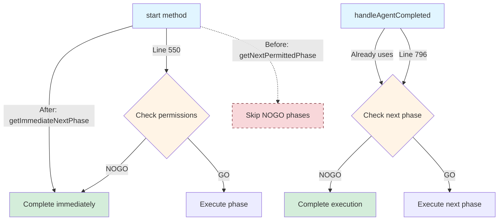
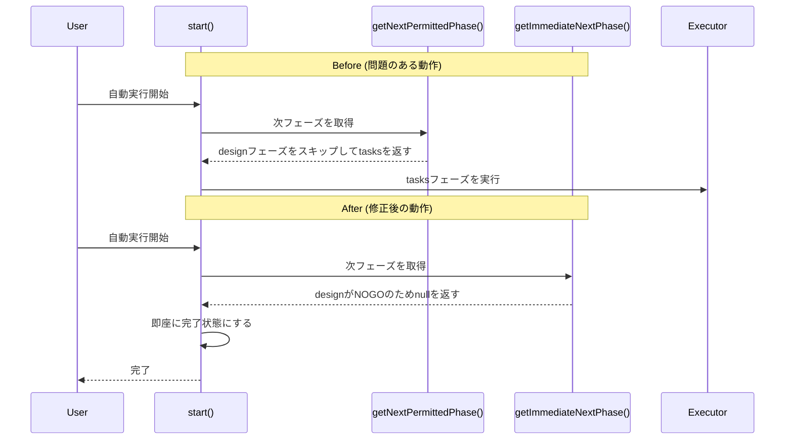

# Design: Auto Execution NOGO Stop

## Overview

この機能は、自動実行の開始時にNOGOフェーズをスキップする動作を修正し、実行途中と同様にNOGOフェーズで停止（完了）するよう一貫した動作にする。

**Purpose**: 自動実行の開始時と途中遷移時で一貫したNOGO処理ロジックを適用し、ユーザーの意図（「NOGOフェーズは実行しない」）を正確に反映する。

**Users**: SDD Orchestratorを使用する開発者がNOGO設定を用いて自動実行を制御する際に利用する。

**Impact**: 既存の`AutoExecutionCoordinator.start()`メソッドの内部ロジックを変更し、NOGOフェーズでの停止動作を統一する。

### Goals

- 自動実行開始時に次のフェーズがNOGOの場合、即座に完了する（スキップしない）
- 開始時と途中遷移時で同じロジック（`getImmediateNextPhase`）を使用し、一貫性を確保する
- 動作変更をユニットテストでカバーする

### Non-Goals

- UIへの追加フィードバック（「NOGOのため停止」等の理由表示）
- `getNextPermittedPhase`メソッド自体の削除（他で使用されている可能性があるため保持）
- BugAutoExecutionCoordinatorへの同様の変更（別途検討）
- E2Eテストの追加（既存のE2Eテストが新しい動作で失敗しないことを確認するのみ）

## Architecture

### Existing Architecture Analysis

**現在のアーキテクチャ**:
- `AutoExecutionCoordinator`が自動実行のライフサイクル管理を担当
- `start()`メソッドが初回フェーズ決定に`getNextPermittedPhase()`を使用（NOGOをスキップ）
- `handleAgentCompleted()`および`markPhaseComplete()`が次フェーズ遷移に`getImmediateNextPhase()`を使用（NOGOで停止）

**問題点**:
- 開始時と途中で異なるロジックが適用され、一貫性がない
- ユーザーの意図（NOGOフェーズを実行しない）が開始時に正しく反映されない

**技術的制約**:
- `getNextPermittedPhase()`は他のコードパスで使用されている可能性があるため削除しない
- 後方互換性のため、メソッドシグネチャは変更しない

### Architecture Pattern & Boundary Map



**Architecture Integration**:
- **Selected pattern**: Method delegation統一（`getImmediateNextPhase`を一貫して使用）
- **Domain boundaries**: AutoExecutionCoordinatorサービス内部のみの変更
- **Existing patterns preserved**: イベント駆動型アーキテクチャ（`execute-next-phase`イベント）は維持
- **New components rationale**: 新規コンポーネントは不要、既存メソッドの呼び出し変更のみ
- **Steering compliance**: KISS原則、DRY原則に準拠（重複ロジックを削減）

### Technology Stack

| Layer | Choice / Version | Role in Feature | Notes |
|-------|------------------|-----------------|-------|
| Backend / Services | TypeScript 5.8+ | ロジック修正 | `autoExecutionCoordinator.ts`の既存コード |
| Testing | Vitest | ユニットテスト | 新規テスト追加、既存テスト更新 |

## System Flows

### Auto-Execution Start Flow (Before vs After)



**Flow-level decisions**:
- **Gating condition**: `getImmediateNextPhase()`が`null`を返した場合、`completeExecution()`を呼び出す
- **Consistency**: `handleAgentCompleted()`と同じロジックパスを使用することで、開始時と途中遷移時の動作を統一

## Requirements Traceability

| Criterion ID | Summary | Components | Implementation Approach |
|--------------|---------|------------|------------------------|
| 1.1 | 開始時に最初のフェーズがNOGOの場合、即座に完了 | AutoExecutionCoordinator.start() | `getNextPermittedPhase` → `getImmediateNextPhase`に変更 |
| 1.2 | 途中から再開時に次のフェーズがNOGOの場合、即座に完了 | AutoExecutionCoordinator.start() | 同上（lastCompletedPhaseからの再開も同じロジック） |
| 1.3 | スキップして後続のGOフェーズを探して実行しない | AutoExecutionCoordinator.start() | `getImmediateNextPhase`は直接次のフェーズのみをチェック |
| 2.1 | 途中遷移時はNOGOで停止（既存動作維持） | AutoExecutionCoordinator.handleAgentCompleted() | 既存の`getImmediateNextPhase`使用箇所を維持 |
| 2.2 | 開始時もNOGOで停止（新規動作） | AutoExecutionCoordinator.start() | メソッド呼び出し変更 |
| 2.3 | 開始時と途中遷移時で同じメソッドを使用 | AutoExecutionCoordinator | `getImmediateNextPhase`に統一 |
| 3.1 | `getImmediateNextPhase`メソッドのユニットテスト追加 | autoExecutionCoordinator.test.ts | 新規テストケース追加 |
| 3.2 | 開始時に最初のフェーズがNOGOの場合のユニットテスト追加 | autoExecutionCoordinator.test.ts | 新規テストケース追加 |
| 3.3 | 途中から再開時に次のフェーズがNOGOの場合のユニットテスト追加 | autoExecutionCoordinator.test.ts | 新規テストケース追加 |
| 3.4 | E2Eテストで検証可能な場合、対応するE2Eテストを追加または更新 | e2e-wdio/**/*.spec.ts | 既存E2Eテストが新動作で失敗しないことを確認（新規E2Eテストは不要と判断） |
| 4.1 | `getNextPermittedPhase`の「NOGOをスキップ」テストが存在する場合、削除または更新 | autoExecutionCoordinator.test.ts | 既存テスト確認と必要に応じた更新 |
| 4.2 | 既存のE2Eテストが新しい動作で失敗しないことを確認 | e2e-wdio/**/*.spec.ts | テスト実行による確認 |

### Coverage Validation Checklist

- [x] Every criterion ID from requirements.md appears in the table above
- [x] Each criterion has specific component names (not generic references)
- [x] Implementation approach distinguishes "reuse existing" vs "new implementation"
- [x] User-facing criteria specify concrete UI components (N/A - no UI changes)

## Components and Interfaces

### Main Process Services

#### AutoExecutionCoordinator

| Field | Detail |
|-------|--------|
| Intent | Spec自動実行のライフサイクル管理 |
| Requirements | 1.1, 1.2, 1.3, 2.1, 2.2, 2.3 |

**Responsibilities & Constraints**
- 自動実行の開始・停止・再開を制御
- フェーズ遷移ロジックの一貫性を保証
- NOGOフェーズでの適切な停止処理

**Dependencies**
- Inbound: IPC handlers (auto-execution:start) — 自動実行開始リクエスト (P0)
- Outbound: EventEmitter — フェーズ実行イベント発火 (P0)
- Outbound: FileService — spec.json読み取り (P0)

**Contracts**: Service [x]

##### Service Interface

```typescript
// 既存インターフェースを維持、内部実装のみ変更
interface AutoExecutionCoordinator {
  start(specPath: string, options: AutoExecutionOptions): Promise<Result<AutoExecutionState, AutoExecutionError>>;

  // 内部メソッド（変更なし）
  private getNextPermittedPhase(
    currentPhase: WorkflowPhase | null,
    permissions: AutoExecutionPermissions,
    approvals?: ApprovalsStatus
  ): WorkflowPhase | null;

  private getImmediateNextPhase(
    currentPhase: WorkflowPhase | null,
    permissions: AutoExecutionPermissions,
    approvals?: ApprovalsStatus
  ): WorkflowPhase | null;
}
```

- **Preconditions**:
  - `specPath`が有効なspec.jsonを含むディレクトリ
  - `options.permissions`が全フェーズのGO/NOGO設定を含む
- **Postconditions**:
  - 次のフェーズがGOの場合、`execute-next-phase`イベントを発火
  - 次のフェーズがNOGOまたは存在しない場合、`completeExecution()`を呼び出し
- **Invariants**:
  - `start()`と`handleAgentCompleted()`で同じフェーズ遷移ロジックを使用

**Implementation Notes**
- **Integration**: `start()`メソッドのline 550を変更（`getNextPermittedPhase` → `getImmediateNextPhase`）
- **Validation**: `getImmediateNextPhase()`が既に`handleAgentCompleted()`で使用されており、動作検証済み
- **Risks**: `getNextPermittedPhase()`が他のコードパスで使用されている場合、意図しない影響が出る可能性（ただし、Grep結果では`start()`のみで使用されている）

### Testing Components

#### autoExecutionCoordinator.test.ts

| Field | Detail |
|-------|--------|
| Intent | AutoExecutionCoordinatorのユニットテスト |
| Requirements | 3.1, 3.2, 3.3, 4.1 |

**Responsibilities & Constraints**
- `getImmediateNextPhase()`の動作をテスト
- `start()`メソッドのNOGO停止動作をテスト
- 既存のスキップ動作テストを更新

**Implementation Notes**
- **New Test Cases**:
  1. `getImmediateNextPhase()` - NOGOフェーズで停止
  2. `getImmediateNextPhase()` - GOフェーズを返す
  3. `start()` - 最初のフェーズがNOGOの場合、即座に完了
  4. `start()` - 途中から再開時、次のフェーズがNOGOの場合、即座に完了
- **Update Existing Tests**:
  - `getNextPermittedPhase()` - スキップ動作のテストが残っている場合、新しい動作に合わせて更新（ただし、`getNextPermittedPhase()`自体は削除しないため、メソッドのテストは維持）

## Data Models

このフェーズではデータモデルの変更はない。既存の`AutoExecutionPermissions`、`AutoExecutionState`、`ApprovalsStatus`をそのまま使用する。

## Error Handling

### Error Strategy

既存のエラーハンドリングパターンを維持する。

### Error Categories and Responses

**User Errors**:
- なし（内部ロジック変更のみ）

**System Errors**:
- `spec.json`読み取り失敗 → 既存のエラーハンドリングを維持

**Business Logic Errors**:
- NOGOフェーズでの停止 → エラーではなく正常な完了として扱う（`completeExecution()`）

## Testing Strategy

### Unit Tests

#### AutoExecutionCoordinator

**新規テストケース**:

1. **`getImmediateNextPhase()` - NOGO停止動作**
   - Given: requirements完了、design=NOGO
   - When: `getImmediateNextPhase('requirements', permissions, approvals)`
   - Then: `null`を返す

2. **`getImmediateNextPhase()` - GO動作**
   - Given: requirements完了、design=GO、承認済み
   - When: `getImmediateNextPhase('requirements', permissions, approvals)`
   - Then: `'design'`を返す

3. **`start()` - 最初のフェーズがNOGO**
   - Given: requirements=NOGO
   - When: `start(specPath, options)`
   - Then: `execute-next-phase`イベントを発火しない、`completeExecution()`を呼び出す

4. **`start()` - 途中から再開、次フェーズがNOGO**
   - Given: requirements完了、design=NOGO
   - When: `start(specPath, options)`
   - Then: `execute-next-phase`イベントを発火しない、`completeExecution()`を呼び出す

5. **`start()` - 最初のフェーズがGO**
   - Given: requirements=GO
   - When: `start(specPath, options)`
   - Then: `execute-next-phase`イベントを`'requirements'`で発火

**既存テスト更新**:
- `getNextPermittedPhase()` - スキップ動作テストは維持（メソッド自体は保持するため）
- `start()`に関連する既存テストが新しい動作で失敗しないことを確認

### Integration Tests

なし（ユニットテストで十分カバー可能）

### E2E Tests

**既存E2Eテストの確認**:
- `auto-execution-flow.e2e.spec.ts` - NOGO設定を含むテストが存在する場合、新しい動作で失敗しないことを確認
- 新規E2Eテストは追加しない（ユニットテストで動作保証済み）

## Design Decisions

### DD-001: getImmediateNextPhaseへの統一

| Field | Detail |
|-------|--------|
| Status | Accepted |
| Context | 自動実行の開始時に`getNextPermittedPhase()`を使用しており、NOGOフェーズをスキップする動作になっていた。一方、実行途中では`getImmediateNextPhase()`を使用してNOGOで停止する。この一貫性のない動作がユーザーの意図と乖離していた。 |
| Decision | `start()`メソッドで`getNextPermittedPhase()`の代わりに`getImmediateNextPhase()`を使用する。 |
| Rationale | 1. ユーザーがNOGOに設定した意図は「そのフェーズを実行しない」であり、「スキップして次を実行」ではない。2. 開始時と途中遷移時で同じロジックを使用することで、動作の一貫性を保証する。3. `getImmediateNextPhase()`は既に`handleAgentCompleted()`で使用されており、動作検証済み。 |
| Alternatives Considered | 1. `getNextPermittedPhase()`を修正してNOGOで停止させる → 他のコードパスへの影響が不明確。2. 新しいメソッドを追加する → 不要な複雑性の増加。 |
| Consequences | **Positive**: 動作の一貫性、ユーザー意図の正確な反映。**Negative**: `getNextPermittedPhase()`が他で使用されている場合の影響（Grep結果では影響なし）。**Follow-up**: 既存E2Eテストの実行による確認。 |

### DD-002: getNextPermittedPhaseメソッドの保持

| Field | Detail |
|-------|--------|
| Status | Accepted |
| Context | `getNextPermittedPhase()`は`AutoExecutionCoordinator.start()`で使用されているが、Grep結果により`BugAutoExecutionCoordinator`でも同様に使用されていることが判明した。 |
| Decision | `getNextPermittedPhase()`メソッドは削除せず、既存のままにする。 |
| Rationale | 1. `BugAutoExecutionCoordinator`でも使用されており、削除すると影響が大きい。2. メソッドシグネチャの削除は後方互換性を破壊する可能性がある。3. 「NOGOをスキップ」動作が必要なユースケースが将来発生する可能性を考慮。4. Dead codeとして残っても技術的負債は小さい。 |
| Alternatives Considered | 1. メソッドを削除する → `BugAutoExecutionCoordinator`への影響、後方互換性の破壊リスク。2. メソッドをdeprecatedとしてマークする → 現時点では過剰。 |
| Consequences | **Positive**: 後方互換性の保証、`BugAutoExecutionCoordinator`への影響回避。**Negative**: `AutoExecutionCoordinator.start()`では使用されなくなるが、メソッド自体は残る。**Follow-up**: `BugAutoExecutionCoordinator`への同様の変更は別途検討する（将来のスペックまたはバグ修正で対応）。 |

### DD-003: E2Eテストの追加判断

| Field | Detail |
|-------|--------|
| Status | Accepted |
| Context | 要件3.4では「E2Eテストで検証可能な場合、対応するE2Eテストを追加または更新する」とされているが、この動作変更はユニットテストで十分カバーできる。 |
| Decision | 新規E2Eテストは追加せず、既存E2Eテストが新しい動作で失敗しないことを確認するのみとする。 |
| Rationale | 1. ユニットテストで`start()`メソッドの動作を直接検証可能。2. E2Eテストは実行時間が長く、このレベルの内部ロジック変更をE2Eでテストする価値が低い。3. 既存E2Eテスト（`auto-execution-flow.e2e.spec.ts`）がNOGO設定を含む場合、回帰テストとして機能する。 |
| Alternatives Considered | 1. 新規E2Eテストを追加する → テスト実行時間の増加、メンテナンスコストの増加。 |
| Consequences | **Positive**: テストメンテナンスコストの削減、テスト実行時間の短縮。**Negative**: E2E観点での直接的な検証がない。**Follow-up**: 実装後に既存E2Eテストを実行して確認。 |

## Integration & Deprecation Strategy

### 修正が必要な既存ファイル

| ファイルパス | 変更内容 | 理由 |
|------------|---------|------|
| `electron-sdd-manager/src/main/services/autoExecutionCoordinator.ts` | line 550: `getNextPermittedPhase` → `getImmediateNextPhase`に変更 | 開始時のフェーズ決定ロジックを統一 |
| `electron-sdd-manager/src/main/services/autoExecutionCoordinator.test.ts` | 新規テストケース追加（`getImmediateNextPhase`、`start`のNOGO停止動作） | 動作変更のカバレッジ確保 |

### 削除が必要なファイル

なし（既存ファイルの修正のみ）

### 並行作成ファイル

なし（既存ファイルの修正のみ）

## Interface Changes & Impact Analysis

### 変更されるインターフェース

なし（既存のpublicインターフェースは変更しない）

### 内部メソッド呼び出し変更

| Callee | 変更内容 | Callers | 更新必要性 |
|--------|---------|---------|-----------|
| `getNextPermittedPhase()` | 使用箇所削減（`start()`から呼び出されなくなる） | `start()` (line 550) | 呼び出しを`getImmediateNextPhase()`に変更 |
| `getImmediateNextPhase()` | 使用箇所追加（`start()`から呼び出されるようになる） | `start()` (line 550), `handleAgentCompleted()` (line 796), `markPhaseComplete()` (line 1068) | `start()`のみ更新、他は既存のまま |

**Note**: `getNextPermittedPhase()`と`getImmediateNextPhase()`はprivateメソッドのため、外部Callersは存在しない。

## Integration Test Strategy

このフェーズではクロスバウンダリー通信（IPC、イベント、ストア同期）の変更はないため、Integration Test Strategyは不要。

既存のユニットテストで十分カバー可能：
- `AutoExecutionCoordinator`のメソッド単体テスト
- イベント発火のモックによる検証
