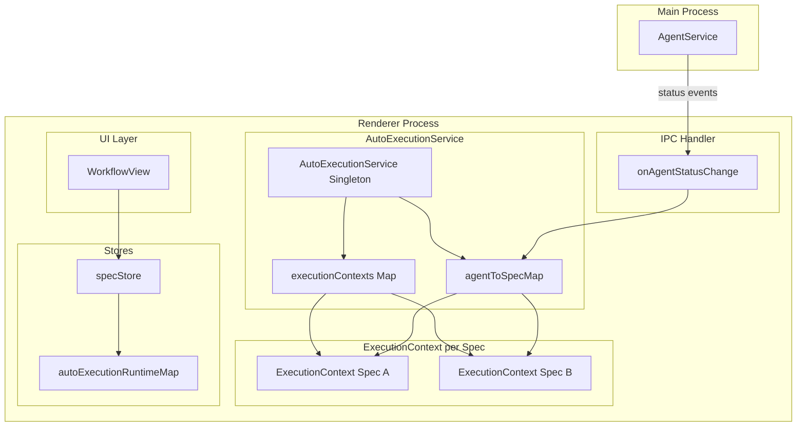
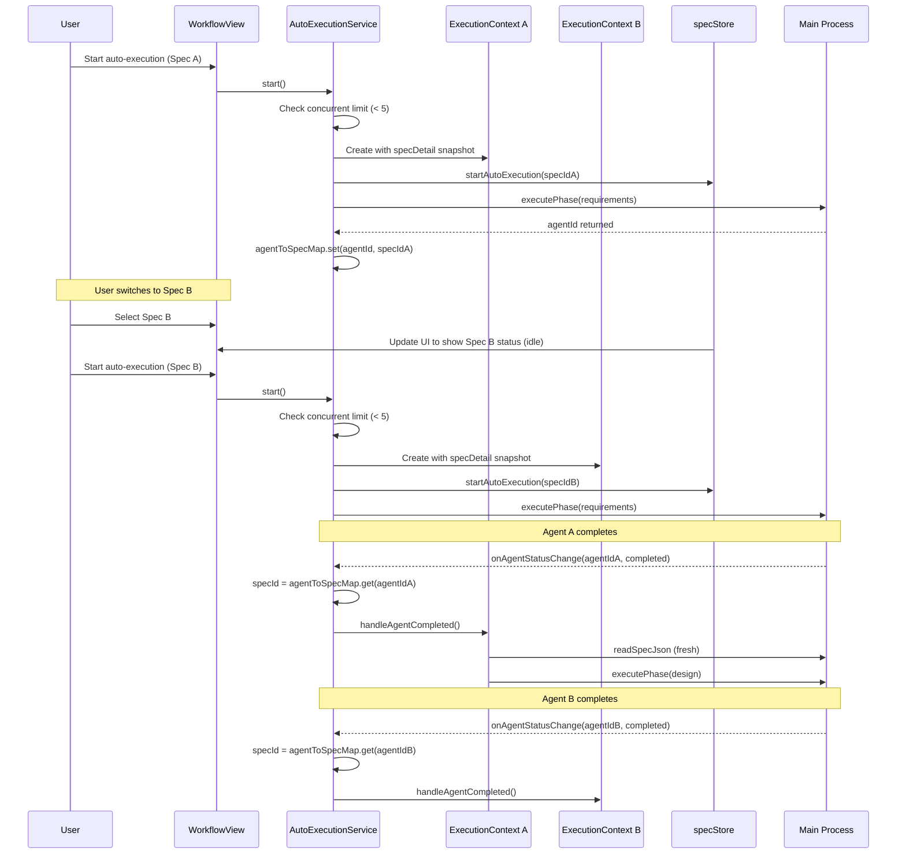
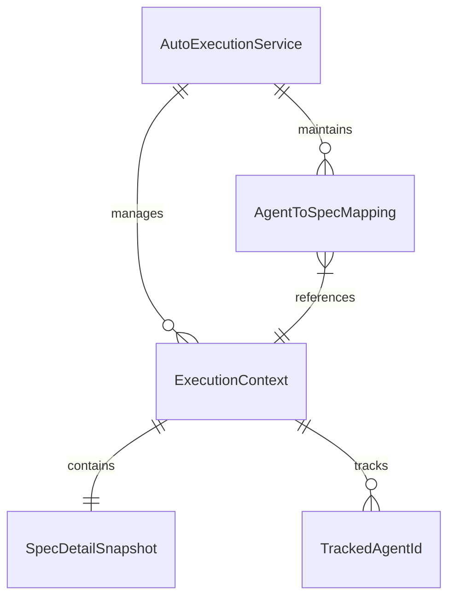

# Design Document

## Overview

**Purpose**: AutoExecutionServiceのステート管理をSpec毎に完全分離し、複数Specの並行実行を可能にする。現在、自動実行中に別のSpecを選択すると`specStore.specDetail`の参照が変わり、誤ったSpecに対してAgentが実行されるバグを解消する。

**Users**: SDD Orchestratorを使用する開発者が、複数の機能仕様を同時に自動実行できるようになる。

**Impact**: 既存のAutoExecutionServiceのシングルトン設計を維持しつつ、内部状態管理を`Map<specId, ExecutionContext>`形式に変更する。後方互換性を維持し、既存のAPIは変更しない。

### Goals
- Spec毎に独立したExecutionContextを導入し、並行実行時の状態分離を実現
- AgentIdからSpecIdへのマッピングにより、Agent完了イベントを正確にルーティング
- specStore.specDetailへの依存を排除し、ExecutionContext内のスナップショットを使用
- UIは選択中Specの自動実行状態のみ表示し、他Specの実行に影響されない

### Non-Goals
- Web Worker等を使用した完全な並列実行（単一スレッド内での並行管理）
- 並行実行数の動的設定（固定上限5）
- AutoExecutionServiceの完全な再設計（既存シングルトンパターンは維持）

## Architecture

### Existing Architecture Analysis

現在のAutoExecutionServiceは以下の設計制約がある:

- シングルトンパターンで単一の`currentExecutingSpecId`のみ管理
- `trackedAgentIds: Set<string>`がSpec横断で共有
- `executedPhases`, `errors`, `executionStartTime`がクラス変数として存在
- specStoreの`specDetail`を直接参照してフェーズ実行

これらの制約により、複数Specの並行実行時に状態が混在する問題が発生している。

### Architecture Pattern & Boundary Map



**Architecture Integration**:
- Selected pattern: ExecutionContext per Spec - Spec毎に独立した実行コンテキストをMapで管理
- Domain boundaries: AutoExecutionService内部の状態管理とspecStoreのUI用runtime状態を分離
- Existing patterns preserved: シングルトンパターン、IPC経由のAgent通信、Zustand store
- New components rationale: ExecutionContext型の導入により状態の分離と型安全性を確保
- Steering compliance: SSOT原則（Spec毎の状態がExecutionContext内で一元管理）、DRY原則

### Technology Stack

| Layer | Choice / Version | Role in Feature | Notes |
|-------|------------------|-----------------|-------|
| Frontend | React 19 + TypeScript 5.8 | UIコンポーネント（WorkflowView）での状態表示 | 既存技術スタック維持 |
| State Management | Zustand | specStore.autoExecutionRuntimeMapでUI用状態管理 | 既存パターン踏襲 |
| Runtime | Electron 35 (Renderer) | AutoExecutionServiceのシングルトン実行環境 | 既存アーキテクチャ |

## System Flows

### Parallel Spec Execution Flow



**Key Decisions**:
- Agent完了イベントは`agentToSpecMap`から対象SpecIdを解決し、適切なExecutionContextを更新
- ユーザーがSpecを切り替えても、実行中のExecutionContextには影響しない
- 各ExecutionContextはspecDetailのスナップショットを保持し、specStore.specDetailへの依存を排除

## Requirements Traceability

| Requirement | Summary | Components | Interfaces | Flows |
|-------------|---------|------------|------------|-------|
| 1.1 | Spec毎のExecutionContext管理 | AutoExecutionService, ExecutionContext | ExecutionContext型 | 並行実行フロー |
| 1.2 | 自動実行開始時にExecutionContext作成 | AutoExecutionService.start() | createExecutionContext() | 開始フロー |
| 1.3 | Agent完了時にSpecIdを解決 | AutoExecutionService | agentToSpecMap | Agent完了フロー |
| 1.4 | 別Spec選択時も元のContext継続 | AutoExecutionService | - | 並行実行フロー |
| 1.5 | specDetailスナップショット保存 | ExecutionContext | specDetailSnapshot | 開始フロー |
| 1.6 | ExecutionContext状態定義 | ExecutionContext | ExecutionContext型 | - |
| 2.1 | AgentId-SpecIdマッピング管理 | AutoExecutionService | agentToSpecMap | Agent完了フロー |
| 2.2 | executePhase後にマッピング登録 | AutoExecutionService.executePhase() | - | フェーズ実行フロー |
| 2.3 | IPC経由でSpecIdをlookup | handleDirectStatusChange() | agentToSpecMap.get() | Agent完了フロー |
| 2.4 | 不明agentIdのバッファリング | handleDirectStatusChange() | pendingEventsMap | Agent完了フロー |
| 2.5 | 停止時にマッピングクリーンアップ | stop() | - | 停止フロー |
| 2.6 | document-review agent対応 | executeDocumentReview() | agentToSpecMap | レビューフロー |
| 3.1 | 複数ExecutionContext独立管理 | AutoExecutionService | executionContexts | 並行実行フロー |
| 3.2 | フェーズ完了時に対象Contextのみ更新 | handleAgentCompleted() | - | Agent完了フロー |
| 3.3 | エラー時も他Spec実行継続 | handleAgentFailed() | - | エラーフロー |
| 3.4 | 最大5件の並行実行 | start() | MAX_CONCURRENT_SPECS | 開始フロー |
| 3.5 | 上限到達時のエラーメッセージ | start() | - | 開始フロー |
| 3.6 | Context毎の独立timeout管理 | ExecutionContext | timeoutId | タイムアウトフロー |
| 4.1 | specStore.specDetail非参照 | executePhase(), validatePreconditions() | specDetailSnapshot | フェーズ実行フロー |
| 4.2 | スナップショットでvalidatePreconditions | validatePreconditions() | specDetailSnapshot | 検証フロー |
| 4.3 | handleAgentCompleted時にIPC経由で最新取得 | handleAgentCompleted() | window.electronAPI.readSpecJson() | Agent完了フロー |
| 4.4 | autoApprove時にspecPath使用 | autoApproveCompletedPhase() | specPath | 承認フロー |
| 4.5 | specPathをスナップショットに含む | ExecutionContext | specPath | - |
| 5.1 | Spec選択時に該当Contextの状態表示 | WorkflowView | specStore.getAutoExecutionRuntime() | UI表示フロー |
| 5.2 | 別Spec選択時のUI切り替え | WorkflowView | - | UI表示フロー |
| 5.3 | 元Specに戻った際の正確な状態表示 | WorkflowView | - | UI表示フロー |
| 5.4 | specIdでruntime状態取得メソッド | specStore | getAutoExecutionRuntime() | - |
| 5.5 | WorkflowViewは選択Specのみsubscribe | WorkflowView | - | UI表示フロー |
| 6.1 | 完了後2秒遅延でContext削除 | completeAutoExecution() | - | 完了フロー |
| 6.2 | エラー時はリトライ用にContext保持 | handleAgentFailed() | - | エラーフロー |
| 6.3 | 手動停止時は即座にクリーンアップ | stop() | disposeContext() | 停止フロー |
| 6.4 | アプリ終了時に全Context破棄 | dispose() | - | 終了フロー |
| 6.5 | テスト用の強制クリーンアップ | forceCleanupAll() | - | テストフロー |
| 7.1 | 既存API維持: start(), stop(), retryFrom() | AutoExecutionService | - | - |
| 7.2 | spec.json autoExecutionフィールド対応 | getSpecAutoExecutionState() | - | - |
| 7.3 | シングルトンインスタンス維持 | getAutoExecutionService() | - | - |
| 7.4 | 通知パターン維持 | notify | - | - |
| 7.5 | 単一Spec実行時の動作互換性 | AutoExecutionService | - | - |

## Components and Interfaces

### Summary Table

| Component | Domain/Layer | Intent | Req Coverage | Key Dependencies (P0/P1) | Contracts |
|-----------|--------------|--------|--------------|--------------------------|-----------|
| ExecutionContext | Service/Domain | Spec毎の実行状態を保持 | 1.1, 1.5, 1.6, 3.6 | specStore (P0) | State |
| AutoExecutionService | Service | 並行実行の統括管理 | 1.1-1.4, 2.1-2.6, 3.1-3.5, 4.1-4.5, 6.1-6.5, 7.1-7.5 | ExecutionContext (P0), specStore (P0), IPC (P0) | Service |
| specStore拡張 | Store | UI用runtime状態の取得 | 5.4 | - | State |
| WorkflowView | UI | 選択Specの自動実行状態表示 | 5.1-5.3, 5.5 | specStore (P0) | - |

### Service Layer

#### ExecutionContext

| Field | Detail |
|-------|--------|
| Intent | Spec毎の自動実行コンテキストを保持し、状態の分離を実現 |
| Requirements | 1.1, 1.5, 1.6, 3.6 |

**Responsibilities & Constraints**
- 単一Specの実行状態を完全にカプセル化
- specDetailスナップショットを保持し、外部状態への依存を排除
- タイムアウト管理を独立して実施

**Dependencies**
- Outbound: specStore - runtime状態の更新 (P0)
- External: window.electronAPI - IPC通信 (P0)

**Contracts**: State [x]

##### State Management

```typescript
interface ExecutionContext {
  /** 対象SpecのID */
  readonly specId: string;
  /** specDetailのスナップショット（作成時点） */
  readonly specDetailSnapshot: Readonly<SpecDetail>;
  /** specのパス（IPC操作用） */
  readonly specPath: string;
  /** 現在実行中のフェーズ */
  currentPhase: WorkflowPhase | null;
  /** 実行状態 */
  executionStatus: AutoExecutionStatus;
  /** トラッキング中のAgentId一覧 */
  trackedAgentIds: Set<string>;
  /** 実行済みフェーズ一覧 */
  executedPhases: WorkflowPhase[];
  /** エラー一覧 */
  errors: string[];
  /** 実行開始時刻 */
  startTime: number;
  /** タイムアウトID */
  timeoutId: ReturnType<typeof setTimeout> | null;
}
```

- **State model**: Spec毎に独立したExecutionContextインスタンス
- **Persistence**: メモリ内のみ（runtime状態）、永続化はspec.jsonのautoExecutionフィールド
- **Concurrency**: 同時に最大5つのExecutionContextが存在可能

**Implementation Notes**
- Integration: AutoExecutionService内の`executionContexts: Map<string, ExecutionContext>`で管理
- Validation: 作成時にspecDetailの存在を検証
- Risks: メモリリーク防止のため、完了/停止時に確実にクリーンアップ

---

#### AutoExecutionService（拡張）

| Field | Detail |
|-------|--------|
| Intent | 複数Specの並行自動実行を統括管理 |
| Requirements | 1.1-1.4, 2.1-2.6, 3.1-3.5, 4.1-4.5, 6.1-6.5, 7.1-7.5 |

**Responsibilities & Constraints**
- 並行実行数の上限管理（最大5）
- AgentIdからSpecIdへのマッピング管理
- IPC経由のAgent完了イベントを適切なExecutionContextにルーティング
- 後方互換性のあるAPI維持

**Dependencies**
- Inbound: WorkflowView - 実行開始/停止の呼び出し (P0)
- Outbound: specStore - runtime状態更新 (P0)
- Outbound: workflowStore - 失敗状態/サマリー管理 (P1)
- External: window.electronAPI - フェーズ実行、spec.json読み取り (P0)

**Contracts**: Service [x]

##### Service Interface

```typescript
interface AutoExecutionServiceInterface {
  /** 自動実行を開始（現在選択中のSpec） */
  start(): boolean;

  /** 特定Specの自動実行を停止 */
  stop(specId?: string): Promise<void>;

  /** 失敗フェーズからリトライ */
  retryFrom(fromPhase: WorkflowPhase, specId?: string): boolean;

  /** spec.jsonの設定で自動実行を開始 */
  startWithSpecState(): boolean;

  /** 特定Specの実行コンテキストを取得 */
  getExecutionContext(specId: string): ExecutionContext | undefined;

  /** 現在実行中のSpec数を取得 */
  getActiveExecutionCount(): number;

  /** 特定Specが実行中かチェック */
  isExecuting(specId: string): boolean;

  /** 全ExecutionContextを強制クリーンアップ（テスト用） */
  forceCleanupAll(): void;

  /** リソース解放 */
  dispose(): void;
}
```

- **Preconditions**:
  - `start()`: specStore.specDetailが存在、並行実行数 < 5
  - `stop()`: 指定specIdのExecutionContextが存在
  - `retryFrom()`: 指定specIdのExecutionContextが存在、MAX_RETRIES未満
- **Postconditions**:
  - `start()`: ExecutionContextが作成され、最初のフェーズが実行開始
  - `stop()`: ExecutionContextがクリーンアップされ、agentToSpecMapからも削除
- **Invariants**:
  - `executionContexts.size <= MAX_CONCURRENT_SPECS (5)`
  - 各AgentIdは最大1つのSpecIdにマッピング

**Implementation Notes**
- Integration: 既存のシングルトンパターンを維持、内部状態のみMap化
- Validation: start()時に並行実行数チェック、specDetail存在チェック
- Risks: Agent完了イベントのレースコンディション - pendingEventsMapで対応

---

### Store Layer

#### specStore拡張（既存機能の活用）

| Field | Detail |
|-------|--------|
| Intent | UI用のSpec毎の自動実行runtime状態を提供 |
| Requirements | 5.4 |

**Contracts**: State [x]

既存の`getAutoExecutionRuntime(specId)`を活用。追加の変更は不要。

```typescript
// 既存インターフェース（変更なし）
interface AutoExecutionRuntimeState {
  readonly isAutoExecuting: boolean;
  readonly currentAutoPhase: WorkflowPhase | null;
  readonly autoExecutionStatus: AutoExecutionStatus;
}

// 既存メソッド（変更なし）
getAutoExecutionRuntime(specId: string): AutoExecutionRuntimeState;
startAutoExecution(specId: string): void;
stopAutoExecution(specId: string): void;
setAutoExecutionPhase(specId: string, phase: WorkflowPhase | null): void;
setAutoExecutionStatus(specId: string, status: AutoExecutionStatus): void;
```

**Implementation Notes**
- Integration: AutoExecutionServiceからこれらのメソッドを呼び出してruntime状態を同期
- Validation: specIdの存在チェックは不要（デフォルト値を返す設計）

---

### UI Layer

#### WorkflowView（変更点のみ）

| Field | Detail |
|-------|--------|
| Intent | 選択中Specの自動実行状態を表示 |
| Requirements | 5.1, 5.2, 5.3, 5.5 |

**Implementation Notes**
- Integration: 既存の`specStore.getAutoExecutionRuntime(selectedSpec.name)`を使用
- 変更不要: 既存実装が選択中Specのruntime状態のみ参照する設計
- Risks: なし（既存設計がすでに要件を満たしている）

## Data Models

### Domain Model

**Aggregates**:
- `ExecutionContext`: Spec毎の実行状態の集約ルート
- `AutoExecutionService`: 全ExecutionContextを管理する親集約

**Entities**:
- `ExecutionContext`: specIdで識別

**Value Objects**:
- `specDetailSnapshot`: 不変のスナップショット
- `WorkflowPhase`: フェーズ識別子

**Business Rules**:
- 並行実行数は最大5
- 同一SpecIdで複数のExecutionContextは作成不可
- AgentIdは一意にSpecIdにマッピング

### Logical Data Model

**ExecutionContext - AutoExecutionService 関係**:
- 1つのAutoExecutionServiceが0..5個のExecutionContextを保持
- ExecutionContextはspecIdで識別

**AgentId - SpecId マッピング**:
- 1つのAgentIdは1つのSpecIdにのみマッピング
- 1つのSpecIdは複数のAgentIdにマッピング可能（フェーズ毎に異なるAgent）



### Physical Data Model

**For In-Memory Storage (Map)**:

```typescript
// AutoExecutionService内の状態
private executionContexts: Map<string, ExecutionContext>;
private agentToSpecMap: Map<string, string>;
private pendingEventsMap: Map<string, { specId: string; status: string }>;
```

- Key design: specIdをキーとしてExecutionContextを管理
- Cleanup: 完了/停止時にMapからエントリを削除

## Error Handling

### Error Strategy

| Error Type | Response | Recovery |
|------------|----------|----------|
| 並行実行上限到達 | エラーメッセージ表示、start()はfalse返却 | ユーザーが他のSpec実行を停止 |
| specDetail未選択 | エラーメッセージ表示、start()はfalse返却 | ユーザーがSpecを選択 |
| Agent実行失敗 | 該当ExecutionContextのみエラー状態 | retryFrom()でリトライ可能 |
| タイムアウト | 該当ExecutionContextのみエラー状態 | retryFrom()でリトライ可能 |
| IPC通信エラー | エラーログ出力、該当Contextエラー状態 | retryFrom()でリトライ可能 |

### Error Categories and Responses

**User Errors (4xx相当)**:
- 並行実行上限 -> 「同時実行可能なSpec数の上限（5件）に達しています」
- specDetail未選択 -> 「実行するSpecを選択してください」

**System Errors (5xx相当)**:
- Agent失敗 -> 該当Contextを`error`状態に、他Specは継続
- タイムアウト -> 該当Contextを`error`状態に、他Specは継続

### Monitoring

- `console.log`での実行状態ログ出力（既存パターン維持）
- `notify`サービスによるユーザー通知

## Testing Strategy

### Unit Tests

| テスト対象 | テスト内容 | 優先度 |
|-----------|-----------|--------|
| ExecutionContext作成 | specDetailスナップショットが正しく保存される | High |
| agentToSpecMapマッピング | AgentId登録/削除/lookup | High |
| 並行実行上限チェック | 6件目のstart()がfalseを返す | High |
| handleDirectStatusChange | 正しいExecutionContextが更新される | High |
| Context独立性 | Spec Aのエラーが Spec Bに影響しない | High |

### Integration Tests

| テスト対象 | テスト内容 | 優先度 |
|-----------|-----------|--------|
| 並行実行フロー | 2つのSpecを同時に自動実行開始 | High |
| Agent完了ルーティング | 複数Agent完了イベントが正しくルーティング | High |
| UI状態表示 | Spec切り替え時にruntime状態が正しく切り替わる | Medium |
| クリーンアップ | 完了後にExecutionContextが削除される | Medium |

### E2E Tests

| テスト対象 | テスト内容 | 優先度 |
|-----------|-----------|--------|
| 並行実行完全フロー | 2つのSpecを選択して自動実行、両方完了 | High |
| Spec切り替え時のUI | 実行中に別Specを選択してUIが正しく表示 | Medium |
| 上限到達エラー | 6件目の実行開始でエラー表示 | Low |

## Optional Sections

### Performance & Scalability

**Target Metrics**:
- 並行実行数: 最大5件（固定上限）
- メモリ使用量: ExecutionContext 1件あたり約1KB以下
- イベント処理: Agent完了イベントの処理は10ms以内

**Optimization**:
- ExecutionContext作成時のspecDetailスナップショットは浅いコピー（ネストオブジェクトは参照）
- pendingEventsMapは定期的なクリーンアップ不要（イベント処理時に削除）
