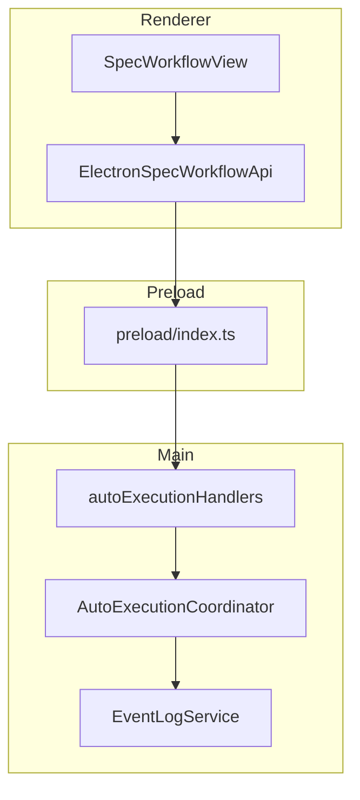
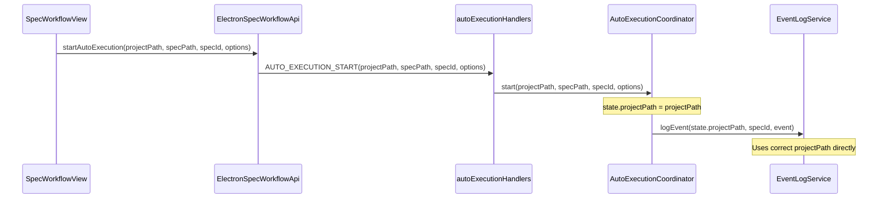

# Design Document: AutoExecution ProjectPath Fix

## Overview

**Purpose**: この機能は、worktree環境における`AutoExecutionCoordinator`および`BugAutoExecutionCoordinator`のイベントログ記録パス問題を修正する。

**Users**: SDD Orchestratorを使用してgit worktreeを活用した開発を行う開発者が、正しい場所にイベントログが記録されることを保証する。

**Impact**: `start()`メソッドのシグネチャ変更により、IPC境界、preload、renderer API層に影響を与える。

### Goals

- `AutoExecutionState`/`BugAutoExecutionState`に`projectPath`フィールドを追加し、状態として保持
- `start()`メソッドのシグネチャを変更し、`projectPath`を明示的に渡す
- イベントログ記録時に`specPath`からの逆算ロジックを削除し、`state.projectPath`を直接使用

### Non-Goals

- 既存worktree内のevents.jsonlのマイグレーション（マージ時に消えるため不要）
- EventLogService自体のAPI変更
- 他のサービスでの類似問題の調査・修正

## Architecture

### Existing Architecture Analysis

現在の問題点:
```typescript
// autoExecutionCoordinator.ts (lines 211-214)
private logAutoExecutionEvent(specPath: string, specId: string, event: EventLogInput): void {
  // specPathから逆算 - worktree環境では失敗
  const pathParts = specPath.split('.kiro/specs/');
  const projectPath = pathParts[0] ? pathParts[0].replace(/\/$/, '') : specPath;
  // ...
}
```

worktree環境では`specPath`が以下のようなパスになる:
- `/project/.kiro/worktrees/specs/feature-x/.kiro/specs/feature-x`

このため、`.kiro/specs/`で分割すると誤ったパスが取得される。

### Architecture Pattern & Boundary Map



**Architecture Integration**:
- Selected pattern: 既存のIPC境界パターンを維持
- Domain boundaries: Main Processが`projectPath`を管理し、状態として保持（SSOT原則）
- Existing patterns preserved: IPC handler -> Coordinator -> Service の呼び出しチェーン
- New components rationale: 新規コンポーネントなし、既存APIの拡張のみ
- Steering compliance: Main Processでの状態管理（structure.md準拠）

### Technology Stack

| Layer | Choice / Version | Role in Feature | Notes |
|-------|------------------|-----------------|-------|
| Backend / Services | TypeScript 5.8+ | Coordinator API拡張 | 型安全性の維持 |
| IPC | Electron contextBridge | パラメータ追加 | 既存パターン踏襲 |

## System Flows

### Auto Execution Start Flow (修正後)



## Requirements Traceability

| Criterion ID | Summary | Components | Implementation Approach |
|--------------|---------|------------|------------------------|
| 1.1 | AutoExecutionStateにprojectPathフィールド追加 | AutoExecutionCoordinator | 新規フィールド追加 |
| 1.2 | start()シグネチャ変更 | AutoExecutionCoordinator | メソッドシグネチャ変更 |
| 1.3 | projectPathをAutoExecutionStateに保存 | AutoExecutionCoordinator | createState/start内で保存 |
| 1.4 | logAutoExecutionEvent()でstate.projectPath使用 | AutoExecutionCoordinator | 逆算ロジック削除 |
| 1.5 | specPathからの逆算ロジック削除 | AutoExecutionCoordinator | 削除 |
| 2.1 | BugAutoExecutionStateにprojectPathフィールド追加 | BugAutoExecutionCoordinator | 新規フィールド追加 |
| 2.2 | BugAutoExecutionCoordinator.start()シグネチャ変更 | BugAutoExecutionCoordinator | メソッドシグネチャ変更 |
| 2.3 | Bugイベントログでprojectpath使用 | BugAutoExecutionCoordinator | 将来の拡張に備えた設計 |
| 3.1 | StartParamsにprojectPath追加 | autoExecutionHandlers | インターフェース拡張 |
| 3.2 | BugStartParamsにprojectPath追加 | bugAutoExecutionHandlers | インターフェース拡張 |
| 3.3 | IPCハンドラでprojectPath伝播 | autoExecutionHandlers, bugAutoExecutionHandlers | start()呼び出し修正 |
| 4.1 | preload IPC呼び出しでprojectPath送信 | preload/index.ts | パラメータ追加 |
| 4.2 | ElectronSpecWorkflowApi.startAutoExecution()でprojectPath渡し | ElectronSpecWorkflowApi | パラメータ追加 |
| 4.3 | Renderer側store/hookでprojectPath取得・送信 | useAutoExecution, autoExecutionStore | projectPath取得ロジック追加 |
| 5.1 | specToolHandlers.startAutoExecution()でprojectPath渡し | specToolHandlers | start()呼び出し修正 |
| 5.2 | bugToolHandlers修正 | bugToolHandlers | 同様の修正 |
| 6.1 | autoExecutionCoordinator.test.ts修正 | テストファイル | 全start()呼び出し更新 |
| 6.2 | autoExecutionHandlers.test.ts修正 | テストファイル | テスト更新 |
| 6.3 | bugAutoExecutionCoordinator.test.ts修正 | テストファイル | テスト更新 |
| 6.4 | Renderer側テスト修正 | テストファイル | テスト更新 |
| 6.5 | 全テストパス | テストファイル | CI検証 |

### Coverage Validation Checklist

- [x] Every criterion ID from requirements.md appears in the table above
- [x] Each criterion has specific component names (not generic references)
- [x] Implementation approach distinguishes "reuse existing" vs "new implementation"
- [x] User-facing criteria specify concrete UI components

## Components and Interfaces

| Component | Domain/Layer | Intent | Req Coverage | Key Dependencies | Contracts |
|-----------|--------------|--------|--------------|------------------|-----------|
| AutoExecutionCoordinator | Main/Services | Spec自動実行の状態管理 | 1.1-1.5 | EventLogService (P0) | Service, State |
| BugAutoExecutionCoordinator | Main/Services | Bug自動実行の状態管理 | 2.1-2.3 | - | Service, State |
| autoExecutionHandlers | Main/IPC | IPC経由での自動実行制御 | 3.1, 3.3 | AutoExecutionCoordinator (P0) | API |
| bugAutoExecutionHandlers | Main/IPC | Bug自動実行IPC制御 | 3.2, 3.3 | BugAutoExecutionCoordinator (P0) | API |
| preload/index.ts | Preload | IPC呼び出しブリッジ | 4.1 | Electron IPC (P0) | API |
| ElectronSpecWorkflowApi | Renderer/API | Spec操作API | 4.2 | preload (P0) | API |
| specToolHandlers | Main/MCP | MCP経由Spec操作 | 5.1 | AutoExecutionCoordinator (P0) | API |
| bugToolHandlers | Main/MCP | MCP経由Bug操作 | 5.2 | BugAutoExecutionCoordinator (P0) | API |

### Main / Services

#### AutoExecutionCoordinator

| Field | Detail |
|-------|--------|
| Intent | Spec自動実行の状態管理とイベントログ記録 |
| Requirements | 1.1, 1.2, 1.3, 1.4, 1.5 |

**Responsibilities & Constraints**
- specPath単位での実行状態管理
- projectPathを状態として保持し、イベントログに使用
- SSoT原則に基づくMain Process内状態管理

**Dependencies**
- Outbound: EventLogService - ログ記録 (P0)
- Outbound: FileService - spec.json読み取り (P1)

**Contracts**: Service [x] / State [x]

##### State Interface (修正後)

```typescript
/**
 * 自動実行状態管理
 * Requirement 1.1: projectPathフィールド追加
 */
export interface AutoExecutionState {
  /** プロジェクトパス（メインリポジトリ） */
  readonly projectPath: string;
  /** specのパス（worktreeの場合はworktree内パス） */
  readonly specPath: string;
  /** specのID */
  readonly specId: string;
  /** 現在の状態 */
  status: AutoExecutionStatus;
  /** 現在実行中のフェーズ */
  currentPhase: WorkflowPhase | null;
  /** 実行済みフェーズ一覧 */
  executedPhases: WorkflowPhase[];
  /** エラー一覧 */
  errors: string[];
  /** 実行開始時刻 */
  startTime: number;
  /** 最終アクティビティ時刻 */
  lastActivityTime: number;
  /** 現在実行中のAgentId */
  currentAgentId?: string;
  /** タイムアウトタイマーID */
  timeoutId?: ReturnType<typeof setTimeout>;
  /** 現在のDocument Reviewループ回数 */
  currentDocumentReviewRound?: number;
}
```

##### Service Interface (修正後)

```typescript
/**
 * AutoExecutionCoordinator
 * Requirement 1.2: start()シグネチャ変更
 */
export class AutoExecutionCoordinator extends EventEmitter {
  /**
   * 自動実行を開始
   * @param projectPath プロジェクトパス（メインリポジトリ）
   * @param specPath specのパス
   * @param specId specのID
   * @param options 自動実行オプション
   * @returns 成功時は状態、失敗時はエラー
   */
  async start(
    projectPath: string,
    specPath: string,
    specId: string,
    options: AutoExecutionOptions
  ): Promise<Result<AutoExecutionState, AutoExecutionError>>;

  // 他のメソッドは変更なし
}
```

##### Event Logging (修正後)

```typescript
/**
 * Requirement 1.4, 1.5: state.projectPathを使用
 */
private logAutoExecutionEvent(specPath: string, specId: string, event: EventLogInput): void {
  const state = this.executionStates.get(specPath);
  if (!state) {
    logger.warn('[AutoExecutionCoordinator] logAutoExecutionEvent: state not found', { specPath });
    return;
  }

  // Requirement 1.5: 逆算ロジック削除
  // projectPathは状態から取得
  getDefaultEventLogService().logEvent(
    state.projectPath,
    specId,
    event
  ).catch(() => {
    // Errors are logged internally by EventLogService
  });
}
```

**Implementation Notes**
- Integration: 既存のIPCパターンに従う
- Validation: projectPathの妥当性はIPCハンドラ層で検証済み（getCurrentProjectPath()使用）
- Risks: シグネチャ変更による全呼び出し箇所の更新が必要

#### BugAutoExecutionCoordinator

| Field | Detail |
|-------|--------|
| Intent | Bug自動実行の状態管理 |
| Requirements | 2.1, 2.2, 2.3 |

**Responsibilities & Constraints**
- bugPath単位での実行状態管理
- projectPathを状態として保持（将来のイベントログ拡張に備える）

**Contracts**: Service [x] / State [x]

##### State Interface (修正後)

```typescript
/**
 * Bug自動実行状態管理
 * Requirement 2.1: projectPathフィールド追加
 */
export interface BugAutoExecutionState {
  /** プロジェクトパス（メインリポジトリ） */
  readonly projectPath: string;
  /** bugのパス */
  readonly bugPath: string;
  /** bugの名前 */
  readonly bugName: string;
  /** 現在の状態 */
  status: BugAutoExecutionStatus;
  /** 現在実行中のフェーズ */
  currentPhase: BugWorkflowPhase | null;
  /** 実行済みフェーズ一覧 */
  executedPhases: BugWorkflowPhase[];
  /** エラー一覧 */
  errors: string[];
  /** 実行開始時刻 */
  startTime: number;
  /** 最終アクティビティ時刻 */
  lastActivityTime: number;
  /** 現在実行中のAgentId */
  currentAgentId?: string;
  /** タイムアウトタイマーID */
  timeoutId?: ReturnType<typeof setTimeout>;
  /** リトライ回数 */
  retryCount: number;
  /** 最後に失敗したフェーズ */
  lastFailedPhase: BugWorkflowPhase | null;
}
```

##### Service Interface (修正後)

```typescript
/**
 * BugAutoExecutionCoordinator
 * Requirement 2.2: start()シグネチャ変更
 */
export class BugAutoExecutionCoordinator extends EventEmitter {
  /**
   * 自動実行を開始
   * @param projectPath プロジェクトパス（メインリポジトリ）
   * @param bugPath bugのパス
   * @param bugName bugの名前
   * @param options 自動実行オプション
   * @param lastCompletedPhase 最後に完了したフェーズ
   * @returns 成功時は状態、失敗時はエラー
   */
  async start(
    projectPath: string,
    bugPath: string,
    bugName: string,
    options: BugAutoExecutionOptions,
    lastCompletedPhase: BugWorkflowPhase | null
  ): Promise<Result<BugAutoExecutionState, BugAutoExecutionError>>;
}
```

### Main / IPC

#### autoExecutionHandlers

| Field | Detail |
|-------|--------|
| Intent | IPC経由での自動実行制御 |
| Requirements | 3.1, 3.3 |

**Contracts**: API [x]

##### API Contract (修正後)

```typescript
/**
 * Requirement 3.1: StartParamsにprojectPath追加
 */
interface StartParams {
  projectPath: string;
  specPath: string;
  specId: string;
  options: AutoExecutionOptions;
}

// AUTO_EXECUTION_START handler
ipcMain.handle(
  IPC_CHANNELS.AUTO_EXECUTION_START,
  async (_event, params: StartParams): Promise<Result<SerializableAutoExecutionState, AutoExecutionError>> => {
    // Requirement 3.3: projectPathをcoordinator.start()に渡す
    const result = await coordinator.start(
      params.projectPath,
      resolvedSpecPath,
      params.specId,
      params.options
    );
    return toSerializableResult(result);
  }
);
```

#### bugAutoExecutionHandlers

| Field | Detail |
|-------|--------|
| Intent | Bug自動実行IPC制御 |
| Requirements | 3.2, 3.3 |

**Contracts**: API [x]

##### API Contract (修正後)

```typescript
/**
 * Requirement 3.2: BugStartParamsにprojectPath追加
 */
interface BugStartParams {
  projectPath: string;
  bugPath: string;
  bugName: string;
  options: BugAutoExecutionOptions;
  lastCompletedPhase: BugWorkflowPhase | null;
}

// BUG_AUTO_EXECUTION_START handler
ipcMain.handle(
  IPC_CHANNELS.BUG_AUTO_EXECUTION_START,
  async (_event, params: BugStartParams): Promise<Result<SerializableBugAutoExecutionState, BugAutoExecutionError>> => {
    // Requirement 3.3: projectPathをcoordinator.start()に渡す
    const result = await coordinator.start(
      params.projectPath,
      params.bugPath,
      params.bugName,
      params.options,
      params.lastCompletedPhase
    );
    return toSerializableResult(result);
  }
);
```

### Preload

#### preload/index.ts

| Field | Detail |
|-------|--------|
| Intent | IPC呼び出しブリッジ |
| Requirements | 4.1 |

**Contracts**: API [x]

##### API Contract (修正後)

```typescript
/**
 * Requirement 4.1: autoExecutionStartにprojectPath追加
 */
autoExecutionStart: (params: {
  projectPath: string;
  specPath: string;
  specId: string;
  options: AutoExecutionOptions;
}) => ipcRenderer.invoke(IPC_CHANNELS.AUTO_EXECUTION_START, params),

bugAutoExecutionStart: (params: {
  projectPath: string;
  bugPath: string;
  bugName: string;
  options: BugAutoExecutionOptions;
  lastCompletedPhase: BugWorkflowPhase | null;
}) => ipcRenderer.invoke(IPC_CHANNELS.BUG_AUTO_EXECUTION_START, params),
```

### Renderer / API

#### ElectronSpecWorkflowApi

| Field | Detail |
|-------|--------|
| Intent | Spec操作API |
| Requirements | 4.2 |

**Contracts**: API [x]

##### API Contract (修正後)

```typescript
/**
 * Requirement 4.2: startAutoExecution()でprojectPath渡し
 */
async startAutoExecution(
  projectPath: string,
  specPath: string,
  specId: string,
  options: AutoExecutionOptions
): Promise<Result<AutoExecutionState, ApiError>> {
  return wrapResult(async () => {
    const result = await window.electronAPI.autoExecutionStart({
      projectPath,
      specPath,
      specId,
      options: { /* ... */ },
    });
    // ...
  });
}
```

### Main / MCP

#### specToolHandlers

| Field | Detail |
|-------|--------|
| Intent | MCP経由Spec操作 |
| Requirements | 5.1 |

**Contracts**: API [x]

##### API Contract (修正後)

```typescript
/**
 * Requirement 5.1: startAutoExecution()でprojectPath渡し
 */
// spec_start_execution tool handler
const result = await coordinator.start(
  projectPath,  // プロジェクトパスを明示的に渡す
  specPath,
  specName,
  options
);
```

## Data Models

### Domain Model

**AutoExecutionState Aggregate**:
- Root Entity: AutoExecutionState
- 追加フィールド: projectPath (不変)
- Invariants: projectPathはspecPath存在中は常に有効

### Logical Data Model

**Structure Definition**:
- projectPath: string (readonly) - メインリポジトリの絶対パス
- specPath: string (readonly) - spec.jsonが存在するディレクトリの絶対パス

**Consistency & Integrity**:
- projectPathはstart()呼び出し時に設定され、実行中は変更されない
- worktree環境では projectPath != dirname(dirname(specPath))

## Error Handling

### Error Strategy

既存のエラーハンドリングパターンを維持。新規エラーケースは追加しない。

### Error Categories and Responses

**Precondition Errors**:
- projectPath未指定: 'PRECONDITION_FAILED' エラー（既存パターン）

## Testing Strategy

### Unit Tests

- `AutoExecutionCoordinator.start()`にprojectPath引数を追加したテスト
- `logAutoExecutionEvent()`がstate.projectPathを使用することのテスト
- `BugAutoExecutionCoordinator.start()`にprojectPath引数を追加したテスト

### Integration Tests

- IPC経由でprojectPathが正しく伝播されることのテスト
- Worktree環境でイベントログがメインリポジトリに記録されることのテスト

### E2E Tests

- 既存E2Eテストの修正（シグネチャ変更対応）

## Design Decisions

### DD-001: projectPathをstart()の引数として渡す

| Field | Detail |
|-------|--------|
| Status | Accepted |
| Context | `logAutoExecutionEvent()`がspecPathからprojectPathを逆算しており、worktree環境で失敗する。Open Questionで「LogFileServiceのようにDIパターンを使用すべきか」という検討があった。 |
| Decision | start()メソッドの引数としてprojectPathを追加する。DIパターンではなく、既存のAPIパターンを拡張する。 |
| Rationale | 1. 既存のIPCパターンとの一貫性を維持できる 2. 変更範囲が明確で限定的 3. LogFileServiceのDIパターンはSpecManagerService初期化時に設定されるが、AutoExecutionCoordinatorはシングルトンでプロジェクト横断的に使用されるため異なる設計が適切 |
| Alternatives Considered | 1. コンストラクタDI: シングルトンパターンと相性が悪い 2. setProjectPath()メソッド追加: 状態管理が複雑になる |
| Consequences | IPC境界、preload、rendererの全層での引数追加が必要。テスト修正が多数発生（約84箇所）。 |

### DD-002: BugAutoExecutionCoordinatorにも同様の変更を適用

| Field | Detail |
|-------|--------|
| Status | Accepted |
| Context | AutoExecutionCoordinatorと同様のパターンがBugAutoExecutionCoordinatorにも存在する可能性。Decision Logで「同時に修正する」と決定済み。 |
| Decision | BugAutoExecutionCoordinatorのstart()シグネチャにもprojectPathを追加する。 |
| Rationale | 1. 一貫性の維持 2. 将来的なイベントログ追加への備え 3. 同じタイミングで修正することで二度手間を防ぐ |
| Alternatives Considered | Bugには現時点でイベントログがないため修正不要: 将来の拡張時に同じ問題が発生する |
| Consequences | BugAutoExecutionCoordinatorの呼び出し箇所も全て更新が必要。 |

### DD-003: 既存events.jsonlのマイグレーション不要

| Field | Detail |
|-------|--------|
| Status | Accepted |
| Context | 既にworktree内に記録されたログの扱い。Decision Logで「放置（マージ時に消える）」と決定済み。 |
| Decision | マイグレーションは実施しない。 |
| Rationale | events.jsonlは.gitignoreされており、worktreeマージ時に自動的に消える。マイグレーションの複雑さに対してメリットが少ない。 |
| Alternatives Considered | ログファイルのマイグレーション: 複雑で、そもそも.gitignoreされているため価値が低い |
| Consequences | 修正前に記録された一部のログは失われるが、開発上の影響は軽微。 |

## Integration & Deprecation Strategy

### 結合ポイント（既存ファイルの修正）

以下のファイルは、新しいAPIシグネチャに対応するために修正が必要:

**Main Process**:
- `electron-sdd-manager/src/main/services/autoExecutionCoordinator.ts` - start()シグネチャ変更、状態型変更、logAutoExecutionEvent修正
- `electron-sdd-manager/src/main/services/bugAutoExecutionCoordinator.ts` - start()シグネチャ変更、状態型変更
- `electron-sdd-manager/src/main/ipc/autoExecutionHandlers.ts` - StartParams型変更、start()呼び出し修正
- `electron-sdd-manager/src/main/ipc/bugAutoExecutionHandlers.ts` - BugStartParams型変更、start()呼び出し修正
- `electron-sdd-manager/src/main/services/mcp/specToolHandlers.ts` - start()呼び出し修正
- `electron-sdd-manager/src/main/services/mcp/bugToolHandlers.ts` - start()呼び出し修正

**Preload**:
- `electron-sdd-manager/src/preload/index.ts` - IPC呼び出しパラメータ追加

**Renderer/Shared**:
- `electron-sdd-manager/src/shared/api/IpcApiClient.ts` - startAutoExecution()パラメータ追加
- `electron-sdd-manager/src/shared/api/WebSocketApiClient.ts` - startAutoExecution()パラメータ追加
- `electron-sdd-manager/src/shared/api/ISpecWorkflowApi.ts` - インターフェース更新
- `electron-sdd-manager/src/shared/api/types.ts` - AutoExecutionState型更新
- `electron-sdd-manager/src/renderer/api/ElectronSpecWorkflowApi.ts` - startAutoExecution()パラメータ追加
- `electron-sdd-manager/src/renderer/hooks/useAutoExecution.ts` - projectPath取得・送信ロジック追加
- `electron-sdd-manager/src/renderer/stores/spec/autoExecutionStore.ts` - startAutoExecution呼び出し修正

**型定義**:
- `electron-sdd-manager/src/renderer/types/electron.d.ts` - IPC型定義更新

**テスト**:
- `electron-sdd-manager/src/main/services/autoExecutionCoordinator.test.ts` - 全start()呼び出し更新（約84箇所）
- `electron-sdd-manager/src/main/ipc/autoExecutionHandlers.test.ts` - テスト更新
- `electron-sdd-manager/src/main/services/bugAutoExecutionCoordinator.test.ts` - start()呼び出し更新
- Renderer側テストファイル - 該当箇所更新

### 削除対象

- No existing files affected (削除対象なし)

### 廃止されるコード

- `AutoExecutionCoordinator.logAutoExecutionEvent()`内のspecPathからの逆算ロジック（lines 213-214）は削除される
