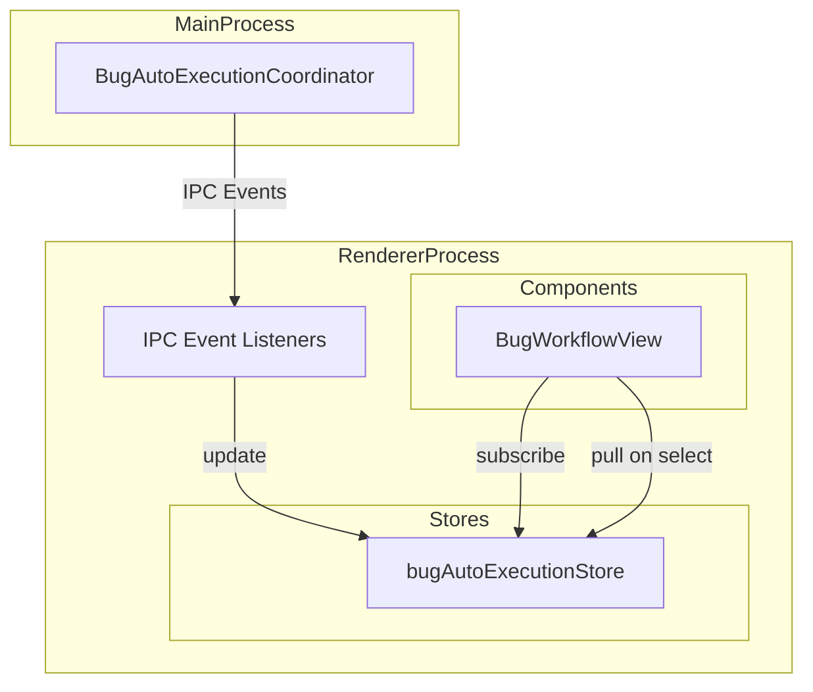
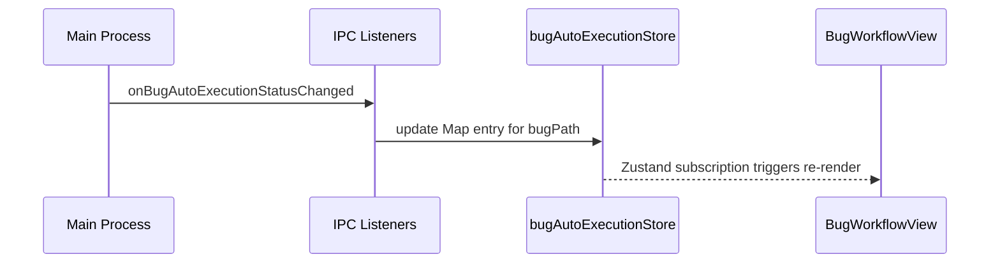
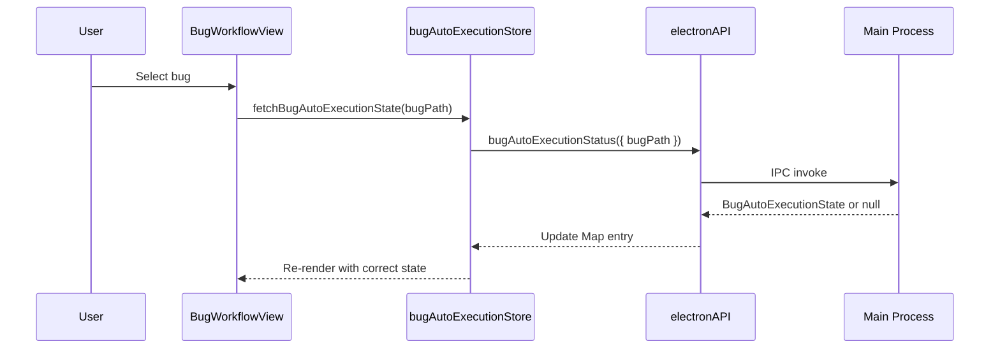

# Design: Bug Auto Execution Per-Bug State

## Overview

**Purpose**: Bug自動実行状態をBug毎に独立管理し、バグ切り替え時に正しい状態を表示する。

**Users**: ユーザーはBug一覧からバグを切り替えながら、各バグの自動実行状態を正確に確認できる。

**Impact**: 現在のシングルトン `BugAutoExecutionService` を削除し、`autoExecutionStore.ts` と同じパターンの `bugAutoExecutionStore.ts` で置き換える。

### Goals

- Bug毎の自動実行状態を `Map<bugPath, BugAutoExecutionRuntimeState>` で管理
- IPCイベント（push）とバグ選択時の状態取得（pull）の両方をサポート
- Spec用 `autoExecutionStore.ts` と同じパターンで実装し、コードベースの一貫性を維持
- Remote UI対応（`shared/stores/` に配置）

### Non-Goals

- Main Process側（`BugAutoExecutionCoordinator`, `bugAutoExecutionHandlers`）の変更
- Bug自動実行のビジネスロジック変更
- 新しいIPC APIの追加（既存APIを使用）

## Architecture

### Existing Architecture Analysis

現在の `BugAutoExecutionService` には以下の問題がある:

1. **シングルトンパターン**: 1つのインスタンスが1つの `cachedState` のみを保持
2. **currentBugPath による状態フィルタリング**: IPCイベント受信時に `bugPath !== this.currentBugPath` でフィルタリングするため、他のバグの状態更新が無視される
3. **ポーリングによる状態更新**: `BugWorkflowView` が100msインターバルでサービスから状態を取得（非効率）

**Spec用 `autoExecutionStore.ts` パターン**:

- Zustand store で `Map<specId, AutoExecutionRuntimeState>` を管理
- IPCイベントリスナーがstoreを直接更新（reactive）
- コンポーネントはstoreを直接参照（ポーリング不要）

### Architecture Pattern & Boundary Map



**Architecture Integration**:
- Selected pattern: Zustand store with Map（Spec用 `autoExecutionStore.ts` と同一パターン）
- Domain/feature boundaries: Store（状態管理）とComponent（表示）の責務分離
- Existing patterns preserved: `autoExecutionStore.ts` のパターンを踏襲
- New components rationale: `bugAutoExecutionStore.ts` はBug自動実行状態のSSoT
- Steering compliance: SSOT, DRY, 関心の分離

### Technology Stack

| Layer | Choice / Version | Role in Feature | Notes |
|-------|------------------|-----------------|-------|
| State Management | Zustand | Bug毎の自動実行状態管理 | 既存パターン踏襲 |
| IPC | Electron contextBridge | Main Process からの状態同期 | 既存API使用 |
| Component | React | 状態表示・操作 | BugWorkflowView 改修 |

## System Flows

### IPC Event による状態更新（push）



### バグ選択時の状態取得（pull）



## Requirements Traceability

| Criterion ID | Summary | Components | Implementation Approach |
|--------------|---------|------------|------------------------|
| 1.1 | Map<bugPath, BugAutoExecutionRuntimeState>で状態管理 | bugAutoExecutionStore | 新規実装 |
| 1.2 | バグAのエラーがバグBに影響しない | bugAutoExecutionStore | Map による独立管理 |
| 1.3 | バグ選択時に対応する状態を表示 | BugWorkflowView, bugAutoExecutionStore | store selector使用 |
| 1.4 | 状態保持（isAutoExecuting等） | BugAutoExecutionRuntimeState型 | autoExecutionStore.ts 型を参考 |
| 2.1 | onBugAutoExecutionStatusChanged でstore更新 | initBugAutoExecutionIpcListeners | 新規実装 |
| 2.2 | onBugAutoExecutionPhaseCompleted でログ出力 | initBugAutoExecutionIpcListeners | 新規実装 |
| 2.3 | onBugAutoExecutionCompleted で状態更新 | initBugAutoExecutionIpcListeners | 新規実装 |
| 2.4 | onBugAutoExecutionError で状態更新 | initBugAutoExecutionIpcListeners | 新規実装 |
| 2.5 | IPCリスナー一度だけ登録 | initBugAutoExecutionIpcListeners | 重複登録防止ロジック |
| 3.1 | バグ選択時にMain Processから状態取得 | bugAutoExecutionStore.fetchBugAutoExecutionState | 新規実装 |
| 3.2 | 取得成功時にstore更新 | bugAutoExecutionStore.fetchBugAutoExecutionState | 新規実装 |
| 3.3 | 状態なしの場合はデフォルト設定 | bugAutoExecutionStore.fetchBugAutoExecutionState | 新規実装 |
| 3.4 | bugAutoExecutionStatus API使用 | bugAutoExecutionStore | 既存API使用 |
| 4.1 | BugWorkflowViewがstoreから状態取得 | BugWorkflowView | 既存コード改修 |
| 4.2 | 自動実行開始時にelectronAPI直接呼び出し | BugWorkflowView | 既存コード改修 |
| 4.3 | 自動実行停止時にelectronAPI直接呼び出し | BugWorkflowView | 既存コード改修 |
| 4.4 | リトライ時にelectronAPI直接呼び出し | BugWorkflowView | 既存コード改修 |
| 4.5 | BugAutoExecutionService参照削除 | BugWorkflowView | 既存コード改修 |
| 5.1 | BugAutoExecutionService.ts削除 | ファイル削除 | 削除 |
| 5.2 | BugAutoExecutionService.test.ts削除 | ファイル削除 | 削除 |
| 5.3 | BugAutoExecutionService参照削除 | 全ファイル | grep検索・削除 |
| 5.4 | getBugAutoExecutionService参照削除 | 全ファイル | grep検索・削除 |
| 6.1 | bugAutoExecutionStoreをshared/stores/に配置 | bugAutoExecutionStore | 新規作成（shared/stores/） |
| 6.2 | Remote UIがWebSocket経由で状態受信 | Remote UI側対応 | WebSocketハンドラ経由 |
| 6.3 | Remote UIでバグ選択時にWebSocket経由で状態取得 | Remote UI側対応 | ApiClient抽象化活用 |
| 6.4 | Electron版とRemote UI版で同一インターフェース | bugAutoExecutionStore | shared/stores/配置で実現 |

### Coverage Validation Checklist

- [x] Every criterion ID from requirements.md appears in the table above
- [x] Each criterion has specific component names (not generic references)
- [x] Implementation approach distinguishes "reuse existing" vs "new implementation"
- [x] User-facing criteria specify concrete UI components (not just "shared components")

## Components and Interfaces

| Component | Domain/Layer | Intent | Req Coverage | Key Dependencies | Contracts |
|-----------|--------------|--------|--------------|------------------|-----------|
| bugAutoExecutionStore | shared/stores | Bug毎の自動実行状態SSoT | 1.1-1.4, 3.1-3.4, 6.1, 6.4 | electronAPI (P0) | State |
| initBugAutoExecutionIpcListeners | shared/stores | IPCイベントリスナー登録 | 2.1-2.5 | bugAutoExecutionStore (P0) | - |
| BugWorkflowView | renderer/components | Bug自動実行UI | 4.1-4.5 | bugAutoExecutionStore (P0), electronAPI (P0) | - |

### shared/stores

#### bugAutoExecutionStore

| Field | Detail |
|-------|--------|
| Intent | Bug毎の自動実行ランタイム状態を管理するZustand store |
| Requirements | 1.1, 1.2, 1.3, 1.4, 3.1, 3.2, 3.3, 3.4, 6.1, 6.4 |

**Responsibilities & Constraints**
- Bug自動実行状態のSingle Source of Truth（SSoT）
- `Map<bugPath, BugAutoExecutionRuntimeState>` による独立した状態管理
- IPCイベント・pull両方の更新を受け付け

**Dependencies**
- Outbound: electronAPI.bugAutoExecutionStatus - 状態取得 (P0)

**Contracts**: State [x]

##### State Management

```typescript
/**
 * Bug自動実行ランタイム状態（per-bug）
 * autoExecutionStore.ts の AutoExecutionRuntimeState を参考
 */
interface BugAutoExecutionRuntimeState {
  /** 自動実行中フラグ */
  readonly isAutoExecuting: boolean;
  /** 現在の自動実行フェーズ */
  readonly currentAutoPhase: BugWorkflowPhase | null;
  /** 詳細な自動実行ステータス */
  readonly autoExecutionStatus: BugAutoExecutionStatus;
  /** 最後に失敗したフェーズ */
  readonly lastFailedPhase: BugWorkflowPhase | null;
  /** リトライ回数 */
  readonly retryCount: number;
}

/** Bug自動実行ランタイムMap型 */
type BugAutoExecutionRuntimeMap = Map<string, BugAutoExecutionRuntimeState>;

/** デフォルト状態 */
const DEFAULT_BUG_AUTO_EXECUTION_RUNTIME: BugAutoExecutionRuntimeState = {
  isAutoExecuting: false,
  currentAutoPhase: null,
  autoExecutionStatus: 'idle',
  lastFailedPhase: null,
  retryCount: 0,
};

/** Store State */
interface BugAutoExecutionState {
  readonly bugAutoExecutionRuntimeMap: BugAutoExecutionRuntimeMap;
}

/** Store Actions */
interface BugAutoExecutionActions {
  /** 特定bugPathの状態を取得（存在しない場合はデフォルト） */
  getBugAutoExecutionRuntime(bugPath: string): BugAutoExecutionRuntimeState;

  /** Main Processから状態をfetch（pull） */
  fetchBugAutoExecutionState(bugPath: string): Promise<void>;

  /** 自動実行開始（Map更新） */
  startAutoExecution(bugPath: string): void;

  /** 自動実行停止（Map更新） */
  stopAutoExecution(bugPath: string): void;

  /** ステータス更新（IPCイベント用） */
  updateFromMainProcess(bugPath: string, state: MainProcessBugAutoExecutionState): void;

  /** エラー状態設定（IPCイベント用） */
  setErrorState(bugPath: string, lastFailedPhase: BugWorkflowPhase | null, retryCount: number): void;

  /** 完了状態設定（IPCイベント用） */
  setCompletedState(bugPath: string): void;
}

type BugAutoExecutionStore = BugAutoExecutionState & BugAutoExecutionActions;
```

- State model: `Map<bugPath, BugAutoExecutionRuntimeState>`
- Persistence: なし（ランタイム状態のみ）
- Concurrency: Zustandの同期更新で競合なし

**Implementation Notes**
- Integration: `initBugAutoExecutionIpcListeners()` をApp初期化時に呼び出し
- Validation: bugPathがMapに存在しない場合はデフォルト状態を返却
- Risks: IPCイベント欠損時はpull（fetchBugAutoExecutionState）でリカバリー

#### initBugAutoExecutionIpcListeners

| Field | Detail |
|-------|--------|
| Intent | Bug自動実行IPCイベントリスナーを登録し、storeを更新 |
| Requirements | 2.1, 2.2, 2.3, 2.4, 2.5 |

**Responsibilities & Constraints**
- アプリ初期化時に一度だけ呼び出される
- 重複登録防止ロジックを含む
- 4種類のIPCイベントを購読してstoreを更新

**Dependencies**
- Inbound: App.tsx (初期化時) - 呼び出し元 (P0)
- Outbound: useBugAutoExecutionStore - 状態更新 (P0)
- External: window.electronAPI - IPCイベント購読 (P0)

##### Service Interface

```typescript
/**
 * IPCイベントリスナー初期化
 * autoExecutionStore.ts の initAutoExecutionIpcListeners を参考
 */
function initBugAutoExecutionIpcListeners(): void;

/**
 * IPCイベントリスナークリーンアップ
 */
function cleanupBugAutoExecutionIpcListeners(): void;
```

- Preconditions: window.electronAPI が利用可能
- Postconditions: 4種類のIPCイベントリスナーが登録される
- Invariants: リスナーは最大1回のみ登録される

**Implementation Notes**
- Integration: App.tsx の useEffect で initBugAutoExecutionIpcListeners() を呼び出し
- Validation: 既存リスナーがある場合は警告ログを出力して早期return
- Risks: リスナー登録前のIPCイベントは失われる（許容範囲）

### renderer/components

#### BugWorkflowView

| Field | Detail |
|-------|--------|
| Intent | Bug自動実行UIを表示し、操作を受け付ける |
| Requirements | 4.1, 4.2, 4.3, 4.4, 4.5 |

**Responsibilities & Constraints**
- bugAutoExecutionStore から選択中バグの状態を取得・表示
- 自動実行開始/停止/リトライをelectronAPI経由で呼び出し
- BugAutoExecutionService への依存を完全削除

**Dependencies**
- Inbound: ユーザー操作 - 自動実行開始/停止/リトライ (P0)
- Outbound: useBugAutoExecutionStore - 状態購読 (P0)
- Outbound: window.electronAPI - IPC呼び出し (P0)

**Implementation Notes**
- Integration: `useBugStore` から `selectedBug` を取得し、bugPath を構築して store を参照
- Validation: selectedBug が null の場合はデフォルト状態を表示
- Risks: バグ選択時の状態fetch失敗時はデフォルト状態を表示（graceful degradation）

## Data Models

### Domain Model

**Aggregates**:
- `BugAutoExecutionRuntimeState`: Bug毎の自動実行状態を表すValue Object

**Business Rules**:
- `isAutoExecuting` は `autoExecutionStatus` が 'running' または 'paused' の場合に true
- `lastFailedPhase` は `autoExecutionStatus` が 'error' の場合のみ有効
- `retryCount` は連続エラー回数（成功時にリセット）

### Logical Data Model

**Structure Definition**:
```
BugAutoExecutionRuntimeMap
├── Key: bugPath (string)
│   └── Format: "{projectPath}/.kiro/bugs/{bugName}"
└── Value: BugAutoExecutionRuntimeState
    ├── isAutoExecuting: boolean
    ├── currentAutoPhase: BugWorkflowPhase | null
    ├── autoExecutionStatus: BugAutoExecutionStatus
    ├── lastFailedPhase: BugWorkflowPhase | null
    └── retryCount: number
```

**Referential Integrity**:
- bugPath は一意（Map のキー）
- BugWorkflowPhase は既存の型を使用

## Error Handling

### Error Strategy

**IPC通信エラー**:
- fetchBugAutoExecutionState 失敗時はデフォルト状態を設定
- ログ出力のみ、UIへのエラー表示は行わない（graceful degradation）

**IPCイベント欠損**:
- バグ選択時のpullで最新状態を取得
- イベント欠損は自動リカバリー

### Error Categories and Responses

**System Errors**:
- IPC通信タイムアウト: デフォルト状態を設定、ログ出力
- Main Processからの不正なデータ: デフォルト状態を設定、ログ出力

## Testing Strategy

### Unit Tests

1. `bugAutoExecutionStore.test.ts`
   - getBugAutoExecutionRuntime: 存在するbugPath、存在しないbugPath
   - updateFromMainProcess: Map更新、新規エントリ追加
   - startAutoExecution / stopAutoExecution: 状態変更
   - fetchBugAutoExecutionState: API呼び出しとstore更新

2. `initBugAutoExecutionIpcListeners.test.ts`
   - 重複登録防止
   - 各IPCイベントハンドラのstore更新

### Integration Tests

1. BugWorkflowView + bugAutoExecutionStore 連携
   - バグ選択時の状態取得と表示
   - 自動実行開始/停止のUI操作とstore状態

2. IPCイベントフロー
   - Main ProcessからのイベントによるUI更新

### E2E Tests

1. バグ切り替え時の状態表示
   - バグAでエラー発生後、バグBに切り替えてidle状態を確認
   - バグBからバグAに戻ってエラー状態を確認

## Design Decisions

### DD-001: Zustand Store パターンの採用

| Field | Detail |
|-------|--------|
| Status | Accepted |
| Context | Bug自動実行状態をBug毎に独立管理する必要がある。現在の `BugAutoExecutionService` はシングルトンで1状態のみ。 |
| Decision | `autoExecutionStore.ts` と同じZustand storeパターンで `bugAutoExecutionStore.ts` を実装 |
| Rationale | 1. 既存パターンとの一貫性（autoExecutionStore.ts） 2. Map<bugPath, State>による独立管理 3. Zustandのreactive更新でポーリング不要 4. テスト容易性 |
| Alternatives Considered | 1. BugAutoExecutionServiceのリファクタリング（Map追加）: 関心の分離が不明瞭 2. Context API: グローバル状態管理に不向き |
| Consequences | BugAutoExecutionService完全削除、コンポーネントのstore依存への変更 |

### DD-002: shared/stores/ への配置

| Field | Detail |
|-------|--------|
| Status | Accepted |
| Context | Remote UIでもBug自動実行状態を表示する必要がある |
| Decision | `bugAutoExecutionStore.ts` を `src/shared/stores/` に配置 |
| Rationale | 1. Remote UI対応（Requirement 6） 2. 既存の `shared/stores/` パターン（bugStore.ts等）との一貫性 3. ApiClient抽象化によるElectron/Remote UI透過 |
| Alternatives Considered | renderer/stores/ に配置してRemote UI用に別実装: DRY原則違反 |
| Consequences | Electron版とRemote UI版で同一コードを共有 |

### DD-003: push + pull 両方の状態同期

| Field | Detail |
|-------|--------|
| Status | Accepted |
| Context | IPCイベント（push）のみでは、イベント欠損時に状態が不整合になる可能性 |
| Decision | IPCイベント（push）に加え、バグ選択時にMain Processから状態を取得（pull） |
| Rationale | 1. イベント欠損時のリカバリー 2. バグ選択直後の即座な状態表示 3. 信頼性向上 |
| Alternatives Considered | pushのみ: シンプルだがイベント欠損に脆弱 |
| Consequences | fetchBugAutoExecutionState アクション追加、バグ選択時のIPC呼び出し |

### DD-004: BugAutoExecutionService の完全削除

| Field | Detail |
|-------|--------|
| Status | Accepted |
| Context | BugAutoExecutionService をリファクタリングして維持するか、完全削除するか |
| Decision | BugAutoExecutionService.ts と関連テストを完全削除 |
| Rationale | 1. 新しいstoreパターンとの役割重複回避 2. 混乱防止 3. コードベースの簡素化 |
| Alternatives Considered | サービスを維持してstoreのラッパーに: 不要な抽象化層 |
| Consequences | BugWorkflowViewからの直接electronAPI呼び出し、import文の削除 |

### DD-005: 状態キーとして bugPath を使用

| Field | Detail |
|-------|--------|
| Status | Accepted |
| Context | Map のキーとして bugName または bugPath のどちらを使用するか |
| Decision | bugPath（`{projectPath}/.kiro/bugs/{bugName}`）をキーとして使用 |
| Rationale | 1. Main Process側のIPCイベントが bugPath を使用 2. プロジェクト跨ぎの一意性保証 3. 既存API（bugAutoExecutionStatus）との整合性 |
| Alternatives Considered | bugNameのみ: 複数プロジェクト対応時に衝突リスク |
| Consequences | BugWorkflowViewでbugPathを構築する必要あり |
