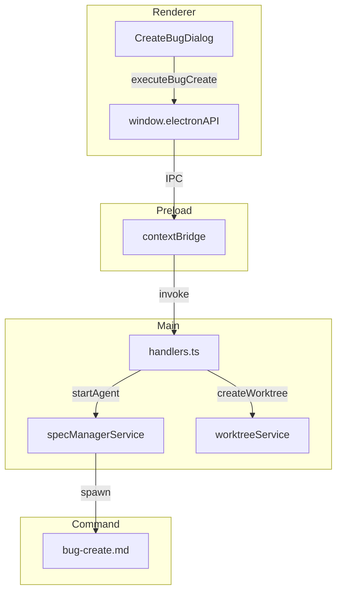
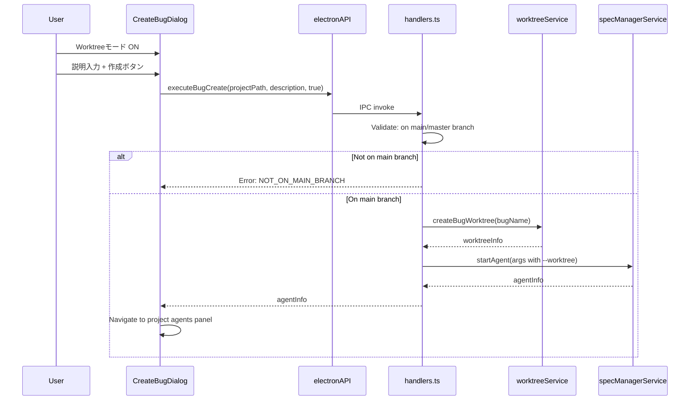

# Design: Bug Create Dialog Unification

## Overview

**Purpose**: この機能は、CreateBugDialogのUIをCreateSpecDialogと統一し、バグ作成時にWorktreeモードを選択可能にすることで、一貫したユーザー体験を提供する。

**Users**: SDD OrchestratorでバグワークフローとSpecワークフローの両方を使用する開発者が、統一されたUI体験を得られる。

**Impact**: 既存のCreateBugDialogコンポーネントを拡張し、IPC層とコマンド層にWorktreeサポートを追加する。

### Goals

- CreateBugDialogとCreateSpecDialogのUI一貫性を確保する
- バグ作成時点でWorktreeモードを選択可能にする（早期分離）
- 既存のspec-plan/spec-worktree-early-creationパターンに従った実装

### Non-Goals

- bug-fixコマンドのWorktree作成ロジック変更（既存維持）
- CreateBugDialogRemote（Remote UI版）の変更
- ヘッダーアイコン（Bugアイコン）の変更

## Architecture

### Existing Architecture Analysis

本機能はspec-worktree-early-creation、create-spec-dialog-simplifyの設計パターンを踏襲する既存システムの拡張である。

**現在のCreateBugDialog**:
- ダイアログサイズ: `max-w-md`（SpecDialogより小さい）
- Worktreeモード: 未対応（bugs-workflow-footerで事後変換のみ）
- ボタン: `Plus`アイコン、赤色固定
- IPC: `executeBugCreate(projectPath, description)` - worktreeModeパラメータなし

**参照対象のCreateSpecDialog**:
- ダイアログサイズ: `max-w-xl`
- Worktreeモード: トグルスイッチあり（紫ハイライト、説明文）
- ボタン: `AgentIcon`/`AgentBranchIcon`、青/紫切替
- IPC: `executeSpecPlan(projectPath, description, commandPrefix, worktreeMode)`

### Architecture Pattern & Boundary Map



**Architecture Integration**:
- Selected pattern: 既存IPC拡張パターン（spec-worktree-early-creationと同一）
- Domain boundaries: Renderer（UI状態）-> Preload（型安全IPC）-> Main（ビジネスロジック）
- Existing patterns preserved: spec-worktree-early-creation、create-spec-dialog-simplifyのUIパターン
- New components rationale: 既存コンポーネントの拡張のみ、新規コンポーネントなし
- Steering compliance: DRY（Specパターン流用）、KISS（最小変更）

### Technology Stack

| Layer | Choice / Version | Role in Feature | Notes |
|-------|------------------|-----------------|-------|
| Frontend | React 19, TypeScript | UI拡張 | 既存CreateBugDialog改修 |
| IPC | Electron contextBridge | パラメータ追加 | worktreeModeフラグ |
| Backend | Node.js (Electron 35) | Worktree作成 | worktreeServiceの既存メソッド使用 |

## System Flows

### Worktreeモードでのバグ作成フロー



## Requirements Traceability

| Criterion ID | Summary | Components | Implementation Approach |
|--------------|---------|------------|------------------------|
| 1.1 | ダイアログ幅を`max-w-xl`に変更 | CreateBugDialog | 既存スタイル変更 |
| 1.2 | テキストエリア行数を5行に変更 | CreateBugDialog | 既存プロパティ変更 |
| 2.1 | Worktreeモードスイッチ追加 | CreateBugDialog | CreateSpecDialogからコピー・適用 |
| 2.2 | スイッチON時紫色ハイライト | CreateBugDialog | CreateSpecDialogパターン流用 |
| 2.3 | スイッチON時説明文表示 | CreateBugDialog | CreateSpecDialogパターン流用 |
| 2.4 | data-testid属性付与 | CreateBugDialog | 新規追加 |
| 3.1 | ボタンアイコンをAgentIcon/AgentBranchIconに変更 | CreateBugDialog | AgentIcon import追加 |
| 3.2 | ボタン色をモードに応じて切替 | CreateBugDialog | 条件分岐追加（青/紫） |
| 3.3 | ボタンラベルは「作成」維持 | CreateBugDialog | 変更なし |
| 4.1 | bug-createコマンドが`--worktree`フラグ受付 | handlers.ts | コマンド引数追加 |
| 4.2 | mainブランチ確認 | handlers.ts | worktreeCheckMain呼び出し |
| 4.3 | Worktree作成処理 | handlers.ts | createBugWorktree呼び出し |
| 4.4 | bug.jsonにworktreeフィールド追加 | handlers.ts | bugService.addWorktreeField呼び出し |
| 4.5 | Worktree作成失敗時ロールバック | handlers.ts | try-catch + ブランチ削除 |
| 5.1 | executeBugCreateシグネチャにworktreeMode追加 | preload/index.ts | パラメータ追加 |
| 5.2 | preloadでworktreeModeをIPCに渡す | preload/index.ts | 引数追加 |
| 5.3 | handlers.tsでworktreeMode処理 | handlers.ts | 条件分岐追加 |
| 5.4 | electron.d.ts型定義更新 | electron.d.ts | 型定義更新 |
| 6.1 | Worktreeモードスイッチテスト | CreateBugDialog.test.tsx | 新規テスト追加 |
| 6.2 | worktreeModeパラメータテスト | CreateBugDialog.test.tsx | 新規テスト追加 |

### Coverage Validation Checklist

- [x] Every criterion ID from requirements.md appears in the table above
- [x] Each criterion has specific component names (not generic references)
- [x] Implementation approach distinguishes "reuse existing" vs "new implementation"
- [x] User-facing criteria specify concrete UI components

## Components and Interfaces

### Component Summary

| Component | Domain/Layer | Intent | Req Coverage | Key Dependencies | Contracts |
|-----------|--------------|--------|--------------|------------------|-----------|
| CreateBugDialog | Renderer/UI | バグ作成ダイアログ（Worktree対応） | 1.1-1.2, 2.1-2.4, 3.1-3.3 | AgentIcon, electronAPI (P0) | Service |
| preload/index.ts | Preload/IPC | IPC型安全ブリッジ | 5.1-5.2 | channels (P0) | Service |
| handlers.ts | Main/IPC | IPCハンドラ | 4.1-4.5, 5.3 | worktreeService, specManagerService (P0) | Service |
| electron.d.ts | Types | 型定義 | 5.4 | - | - |
| CreateBugDialog.test.tsx | Test | テスト | 6.1-6.2 | vitest (P0) | - |

### Renderer Layer

#### CreateBugDialog

| Field | Detail |
|-------|--------|
| Intent | バグ作成ダイアログにWorktreeモードUIを追加 |
| Requirements | 1.1, 1.2, 2.1, 2.2, 2.3, 2.4, 3.1, 3.2, 3.3 |

**Responsibilities & Constraints**
- Worktreeモード状態管理（ローカルState）
- UI表示切替（サイズ、スイッチ、ボタン）
- IPC呼び出し時にworktreeModeを渡す

**Dependencies**
- Inbound: DocsTabs - ダイアログ表示制御 (P1)
- Outbound: window.electronAPI.executeBugCreate - IPC呼び出し (P0)
- External: AgentIcon, AgentBranchIcon - アイコンコンポーネント (P0)

**Contracts**: Service [x]

##### Service Interface

```typescript
interface CreateBugDialogProps {
  isOpen: boolean;
  onClose: () => void;
}

// 内部State
interface CreateBugDialogState {
  description: string;
  worktreeMode: boolean;
  error: string | null;
  isCreating: boolean;
}
```

**Implementation Notes**
- Integration: CreateSpecDialogのWorktreeモードUI実装をテンプレートとして使用
- Validation: 説明文必須、worktreeMode時はmainブランチ必須（Main側で検証）
- Risks: なし（既存パターンの適用）

### Preload Layer

#### preload/index.ts

| Field | Detail |
|-------|--------|
| Intent | executeBugCreateにworktreeModeパラメータを追加 |
| Requirements | 5.1, 5.2 |

**Responsibilities & Constraints**
- 型安全なIPCブリッジ
- worktreeModeパラメータの透過的な転送

**Contracts**: Service [x]

##### Service Interface

```typescript
// Before
executeBugCreate: (projectPath: string, description: string): Promise<AgentInfo>

// After
executeBugCreate: (
  projectPath: string,
  description: string,
  worktreeMode?: boolean
): Promise<AgentInfo>
```

**Implementation Notes**
- Integration: 既存パターン（executeSpecPlan）と同一
- Risks: 後方互換性維持（worktreeModeはオプショナル、デフォルトfalse）

### Main Layer

#### handlers.ts (EXECUTE_BUG_CREATE handler)

| Field | Detail |
|-------|--------|
| Intent | bug-create IPCハンドラにWorktree作成ロジックを追加 |
| Requirements | 4.1, 4.2, 4.3, 4.4, 4.5, 5.3 |

**Responsibilities & Constraints**
- worktreeMode時のmainブランチ検証
- Worktree作成（createBugWorktree呼び出し）
- エラー時のロールバック（ブランチ削除）
- bug.jsonへのworktreeフィールド書き込み

**Dependencies**
- Outbound: worktreeService.checkMain - mainブランチ確認 (P0)
- Outbound: worktreeService.createBugWorktree - Worktree作成 (P0)
- Outbound: bugService.updateBugJson - bug.json更新 (P0)
- Outbound: specManagerService.startAgent - Agent起動 (P0)

**Contracts**: Service [x]

##### Service Interface

```typescript
// IPC Handler signature (internal)
ipcMain.handle(
  IPC_CHANNELS.EXECUTE_BUG_CREATE,
  async (
    event,
    projectPath: string,
    description: string,
    worktreeMode?: boolean
  ) => {
    // ...implementation
  }
);
```

**Implementation Notes**
- Integration: executeSpecPlanのworktreeMode処理パターンを参考に実装
- Validation: worktreeMode=trueの場合、mainブランチ必須
- Risks: Worktree作成失敗時のロールバック処理が必要

### Types Layer

#### electron.d.ts

| Field | Detail |
|-------|--------|
| Intent | executeBugCreateの型定義を更新 |
| Requirements | 5.4 |

**Contracts**: State [x]

##### State Management

```typescript
// interface ElectronAPI内
executeBugCreate(
  projectPath: string,
  description: string,
  worktreeMode?: boolean
): Promise<AgentInfo>;
```

## Data Models

### Domain Model

Worktreeモード時のbug.jsonフィールド構造:

```typescript
interface BugJson {
  // 既存フィールド省略...

  // Worktreeモード時に追加されるフィールド
  worktree?: {
    enabled: true;
    path: string;      // e.g., ".kiro/worktrees/bugs/{bug-name}"
    branch: string;    // e.g., "bugfix/{bug-name}"
    created_at: string; // ISO 8601 timestamp
  };
}
```

**Business Rules & Invariants**:
- `worktree`フィールドはWorktreeモードでバグ作成時のみ追加
- `path`は親リポジトリからの相対パス
- `branch`は`bugfix/`プレフィックス付き

## Error Handling

### Error Strategy

| Error Type | Condition | Response | Recovery |
|------------|-----------|----------|----------|
| NOT_ON_MAIN_BRANCH | worktreeMode=trueでmain以外 | エラーダイアログ表示 | ユーザーがmainに切替 |
| WORKTREE_CREATE_FAILED | git worktree add失敗 | エラーダイアログ表示、ブランチ削除 | リトライ |
| BRANCH_CREATE_FAILED | git branch失敗 | エラーダイアログ表示 | リトライ |

### Error Categories and Responses

**User Errors (4xx)**:
- mainブランチ以外でWorktreeモードを選択 -> ユーザーへの明確なガイダンス表示

**System Errors (5xx)**:
- Worktree作成失敗 -> ロールバック処理後にエラー通知

## Testing Strategy

### Unit Tests

CreateBugDialog.test.tsx に以下を追加:

1. **Worktreeモードスイッチ表示確認**
   - `data-testid="worktree-mode-switch"` の存在確認
   - スイッチトグル時のUI変化確認

2. **Worktreeモード状態管理**
   - スイッチON/OFF切替
   - 紫色ハイライト表示
   - 説明文表示/非表示

3. **ボタンスタイル確認**
   - Worktreeモード OFF: AgentIcon、青色
   - Worktreeモード ON: AgentBranchIcon、紫色

4. **IPC呼び出し確認**
   - executeBugCreateにworktreeModeが渡される
   - worktreeMode=falseの場合は省略またはfalse

### Integration Tests

- E2Eテストでのダイアログ操作確認（既存テストの拡張）

## Integration & Deprecation Strategy

### 既存ファイル修正一覧（Wiring Points）

| File | Modification | Reason |
|------|-------------|--------|
| `electron-sdd-manager/src/renderer/components/CreateBugDialog.tsx` | UI拡張 | ダイアログサイズ、Worktreeスイッチ、ボタン変更 |
| `electron-sdd-manager/src/preload/index.ts` | シグネチャ変更 | worktreeModeパラメータ追加 |
| `electron-sdd-manager/src/main/ipc/handlers.ts` | ハンドラ拡張 | Worktree作成ロジック追加 |
| `electron-sdd-manager/src/renderer/types/electron.d.ts` | 型定義変更 | executeBugCreate型更新 |
| `electron-sdd-manager/src/renderer/components/CreateBugDialog.test.tsx` | テスト追加 | Worktreeモードテスト |

### 削除対象ファイル

なし（既存ファイルの拡張のみ）

### 並行開発の考慮

- CreateBugDialogRemote（Remote UI版）は今回のスコープ外
- 将来的にRemote UIにも同様のUI統一が必要な場合、別Specで対応

## Design Decisions

### DD-001: CreateSpecDialogのUIパターン流用

| Field | Detail |
|-------|--------|
| Status | Accepted |
| Context | CreateBugDialogにWorktreeモードを追加する際、UIデザインをどうするか |
| Decision | CreateSpecDialogのWorktreeモードUI（スイッチ、色、アイコン）をそのまま流用 |
| Rationale | UI一貫性の確保、ユーザーの学習コスト削減、実装コスト削減（既存パターン適用） |
| Alternatives Considered | 1) Bug専用のUI設計 -> 一貫性が損なわれる 2) 共通コンポーネント化 -> オーバーエンジニアリング |
| Consequences | Specとバグで同じUI体験、将来的に共通コンポーネント化の余地あり |

### DD-002: bug-create時点でのWorktree早期作成

| Field | Detail |
|-------|--------|
| Status | Accepted |
| Context | Worktreeをいつ作成するか（bug-create時 vs bug-fix時） |
| Decision | bug-create時にWorktreeを作成する（Specと同様の早期作成方式） |
| Rationale | 1) UIの一貫性（スイッチON = 即座にWorktree作成）2) spec-planの設計パターンに準拠 3) ユーザーの期待に沿う |
| Alternatives Considered | bug-fix時に作成（既存動作）-> UIと動作の乖離が発生 |
| Consequences | Worktreeがbug-create時点で作成されるため、bug-fixの既存ロジックは影響なし |

### DD-003: 後方互換性のためのオプショナルパラメータ

| Field | Detail |
|-------|--------|
| Status | Accepted |
| Context | IPCシグネチャ変更時の後方互換性をどう確保するか |
| Decision | worktreeModeをオプショナルパラメータ（デフォルトfalse）として追加 |
| Rationale | 既存の呼び出しコードが変更なしで動作継続、Remote UI等の将来対応も容易 |
| Alternatives Considered | 1) 新しいIPCチャンネル追加 -> 冗長 2) 必須パラメータ -> 破壊的変更 |
| Consequences | 既存コードの互換性維持、型定義のオプショナル指定が必要 |

### DD-004: Main Processでのブランチ検証

| Field | Detail |
|-------|--------|
| Status | Accepted |
| Context | mainブランチの検証をRenderer/Mainどちらで行うか |
| Decision | Main Process（handlers.ts）でmainブランチ検証を行う |
| Rationale | 1) セキュリティ（Rendererは信頼境界外）2) 既存パターン（spec-worktree-early-creation）に準拠 3) Worktree作成と同一トランザクション内で検証 |
| Alternatives Considered | Renderer側で事前検証 -> 二重検証が必要、race condition |
| Consequences | エラー時はIPCエラーとしてRendererに通知、ユーザーへのガイダンス表示 |
