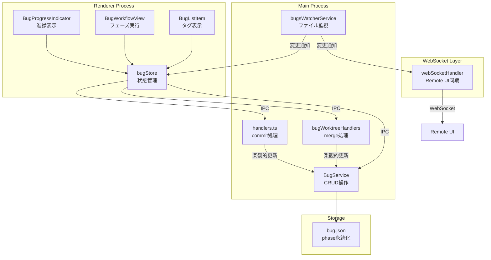
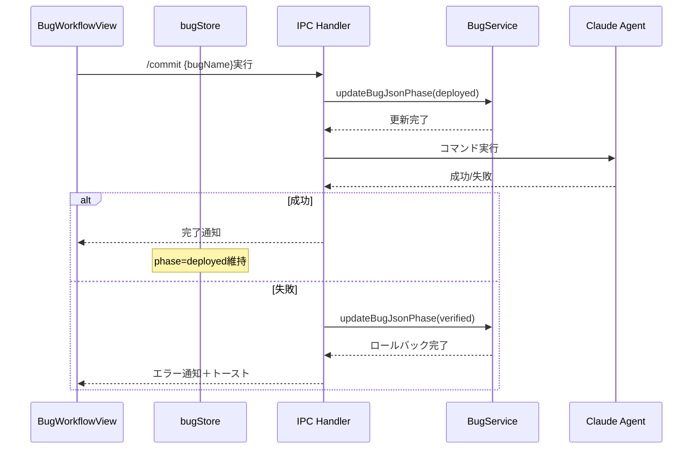
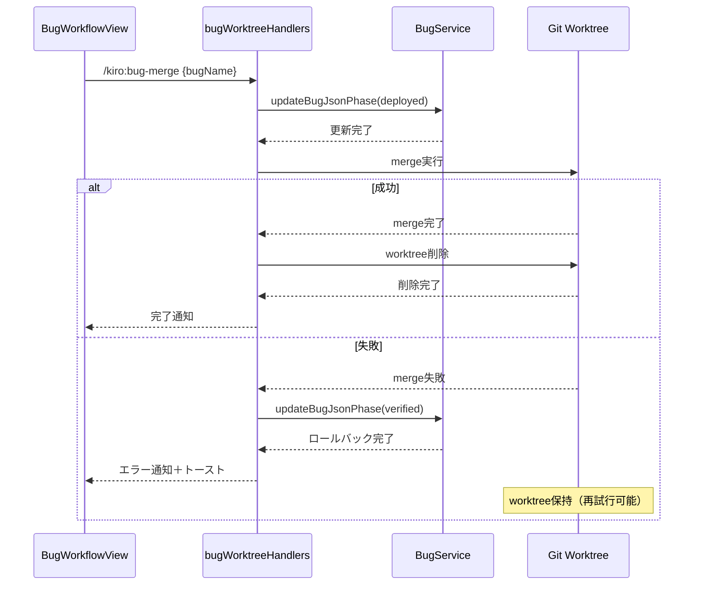

# Design: Bug Deploy Phase

## Overview

**Purpose**: BugワークフローにDeploy完了状態（`deployed`フェーズ）を追加し、bugListItemのタグ表示に反映する機能を提供する。

**Users**: SDD Orchestratorを使用してBugワークフローを管理するユーザーが、Bugの最終状態（デプロイ完了）を視覚的に確認し、ワークフロー完了を追跡できるようになる。

**Impact**: 既存のBugワークフローシステムに対して、BugPhase型の拡張、bug.jsonへのphaseフィールド追加、BugListItemコンポーネントへの「デプロイ完了」表示追加、楽観的更新パターンによるphase管理を行う。

### Goals

- BugPhase型に`deployed`を追加し、型安全にデプロイ完了状態を管理
- bug.jsonにphaseフィールドを追加し、アプリ再起動後もデプロイ完了状態を永続化
- BugListItemで「デプロイ完了」ラベルを紫色タグで表示
- 楽観的更新パターンでdeploy/merge実行前にphaseを更新し、失敗時にロールバック
- Remote UIとDesktop UIで同一の「デプロイ完了」表示を実現

### Non-Goals

- マーカーファイルによるdeploy検出（Specとは異なるアプローチ）
- `deploying`のような中間phase状態の追加
- archive/closedなどの追加状態

## Architecture

### Existing Architecture Analysis

**現行アーキテクチャパターン**:
- BugPhase型: `'reported' | 'analyzed' | 'fixed' | 'verified'` の4フェーズ
- BugWorkflowPhase型: `'report' | 'analyze' | 'fix' | 'verify' | 'deploy'` の5フェーズ（UI表示用）
- bug.json: `bug_name`, `created_at`, `updated_at`, `worktree?` フィールドを持つ
- 状態判定: アーティファクト（.mdファイル）の存在でphaseを決定

**Spec deploy-completeパターンとの比較**:
- Specは `spec.json.phase: 'deploy-complete'` でデプロイ状態を管理
- Bugも同様に `bug.json.phase: 'deployed'` で管理する（一貫性）
- マーカーファイル検出はBugでは不要（楽観的更新で十分）

**既存制約**:
- BugProgressIndicatorは4フェーズ（report→analyze→fix→verify）を表示
- BugListItemはPHASE_COLORSで4色定義（deployed用の紫を追加）
- BugServiceはアーティファクトからphaseを決定（phase fieldのフォールバック必要）

### Architecture Pattern & Boundary Map



**Architecture Integration**:
- 選択パターン: 楽観的更新パターン（コマンド実行前にphase更新、失敗時ロールバック）
- ドメイン境界: BugService（CRUD）、bugWorktreeHandlers（merge）、handlers（commit）が独立してphaseを更新
- 既存パターン保持: BugWorkflowPhaseの`deploy`は既存、BugPhaseに`deployed`を追加
- 新規コンポーネント: なし（既存コンポーネントの拡張のみ）
- Steering準拠: SSOT（bug.json.phaseが真実の情報源）、DRY（共通のupdateBugJsonPhaseメソッド）

### Technology Stack

| Layer | Choice / Version | Role in Feature | Notes |
|-------|------------------|-----------------|-------|
| Frontend | React 19, Zustand | BugListItem表示更新、bugStore状態管理 | 既存パターン踏襲 |
| Backend | Node.js 20+, Electron 35 | BugService CRUD、IPC処理 | 既存サービス拡張 |
| Data | JSON (bug.json) | phase永続化 | 既存スキーマ拡張 |
| Messaging | IPC, WebSocket | Renderer-Main通信、Remote UI同期 | 既存チャンネル利用 |

## System Flows

### Deploy実行フロー（通常モード）



### Merge実行フロー（worktreeモード）



## Requirements Traceability

| Criterion ID | Summary | Components | Implementation Approach |
|--------------|---------|------------|------------------------|
| 1.1 | BugPhaseに`deployed`追加 | bug.ts | 既存型を拡張 |
| 1.2 | BUG_PHASESに`deployed`追加 | bug.ts | 既存配列を拡張 |
| 1.3 | bug.json読込時のphase検証 | BugService | 既存readBugJsonを拡張 |
| 2.1 | BugJsonにphaseフィールド追加 | bugJson.ts | 既存インターフェース拡張 |
| 2.2 | phaseフィールド優先使用 | BugService | readSingleBugを修正 |
| 2.3 | phaseフィールド未存在時のフォールバック | BugService | determineBugPhaseFromFiles継続使用 |
| 2.4 | phase更新時のupdated_at同時更新 | BugService.updateBugJsonPhase | 新規メソッド追加 |
| 3.1 | deployed時の「デプロイ完了」表示 | BugListItem | PHASE_LABELS拡張 |
| 3.2 | deployed時の紫色タグ | BugListItem | PHASE_COLORS拡張 |
| 3.3 | phase変更時の自動更新 | bugStore, bugsWatcherService | 既存監視パターン利用 |
| 4.1 | deploy前のphase楽観的更新 | handlers.ts | commit処理前にphase更新 |
| 4.2 | 成功時のphase維持 | handlers.ts | 既存動作（変更なし） |
| 4.3 | 失敗時のphaseロールバック | handlers.ts | catch節でverifiedに戻す |
| 4.4 | ロールバック時のトースト通知 | handlers.ts | notify.error呼び出し |
| 5.1 | /commit実行前のphase更新 | handlers.ts | 4.1と同一 |
| 5.2 | /commit成功時のphase維持 | handlers.ts | 4.2と同一 |
| 5.3 | /commit失敗時のロールバック | handlers.ts | 4.3と同一 |
| 5.4 | 実行中のBugProgressIndicator表示 | BugWorkflowView | calculatePhaseStatus修正 |
| 6.1 | merge前のphase更新 | bugWorktreeHandlers | merge処理前にphase更新 |
| 6.2 | merge成功時のworktree削除 | bugWorktreeHandlers | 既存パターン踏襲 |
| 6.3 | merge失敗時のロールバックとworktree保持 | bugWorktreeHandlers | catch節でverifiedに戻す |
| 6.4 | 処理順序の保証 | bugWorktreeHandlers | phase更新→merge→worktree削除 |
| 7.1 | phase更新時のWebSocket通知 | bugsWatcherService | 既存BUGS_CHANGED利用 |
| 7.2 | Remote UIのBug一覧更新 | Remote UI bugStore | 既存同期パターン利用 |
| 7.3 | Remote UIの「デプロイ完了」表示 | Remote UI BugListItem | 共有コンポーネント |
| 8.1 | BugWorkflowPhase `deploy`とBugPhase `deployed`の対応 | bug.ts | 既存マッピング確認 |
| 8.2 | deployed時のBugProgressIndicator完了表示 | BugProgressIndicator | 5フェーズ対応に拡張 |
| 8.3 | deploy実行中のexecuting表示 | BugWorkflowView | calculatePhaseStatus修正 |
| 8.4 | deployed時のgetNextAction null返却 | bug.ts | getNextAction修正 |

### Coverage Validation Checklist

- [x] Every criterion ID from requirements.md appears in the table above
- [x] Each criterion has specific component names (not generic references)
- [x] Implementation approach distinguishes "reuse existing" vs "new implementation"
- [x] User-facing criteria specify concrete UI components

## Components and Interfaces

| Component | Domain/Layer | Intent | Req Coverage | Key Dependencies | Contracts |
|-----------|--------------|--------|--------------|------------------|-----------|
| bug.ts | Types | BugPhase型定義 | 1.1, 1.2, 8.1, 8.4 | - | State |
| bugJson.ts | Types | BugJsonインターフェース | 2.1 | - | State |
| BugService | Main/Services | bug.json CRUD | 1.3, 2.2, 2.3, 2.4 | fs/promises (P0) | Service |
| BugListItem | Shared/Components | Bug一覧表示 | 3.1, 3.2, 3.3 | bugStore (P0) | - |
| BugProgressIndicator | Renderer/Components | 進捗表示 | 8.2, 8.3 | bug.ts (P0) | - |
| BugWorkflowView | Renderer/Components | フェーズ実行 | 5.4, 8.3 | bugStore (P0), agentStore (P1) | - |
| handlers.ts | Main/IPC | /commit処理 | 4.1-4.4, 5.1-5.3 | BugService (P0), agentProcess (P1) | Service |
| bugWorktreeHandlers | Main/IPC | merge処理 | 6.1-6.4 | BugService (P0), worktreeService (P1) | Service |
| bugsWatcherService | Main/Services | ファイル監視 | 7.1 | chokidar (P0) | Event |

### Types Layer

#### bug.ts (型定義拡張)

| Field | Detail |
|-------|--------|
| Intent | BugPhase型に`deployed`を追加、関連定数を拡張 |
| Requirements | 1.1, 1.2, 8.1, 8.4 |

**Responsibilities & Constraints**
- BugPhase型のSSOT（Single Source of Truth）
- 既存4フェーズとの後方互換性維持
- getNextAction関数の`deployed`対応

**Contracts**: State [x]

##### State Management

```typescript
// Extended BugPhase type
export type BugPhase = 'reported' | 'analyzed' | 'fixed' | 'verified' | 'deployed';

// Extended BUG_PHASES array
export const BUG_PHASES: readonly BugPhase[] = [
  'reported', 'analyzed', 'fixed', 'verified', 'deployed'
] as const;

// Extended PHASE_LABELS
export const PHASE_LABELS: Record<BugPhase, string> = {
  reported: '報告済',
  analyzed: '分析済',
  fixed: '修正済',
  verified: '検証済',
  deployed: 'デプロイ完了',
};

// Extended PHASE_COLORS
export const PHASE_COLORS: Record<BugPhase, string> = {
  reported: 'bg-red-100 text-red-700',
  analyzed: 'bg-yellow-100 text-yellow-700',
  fixed: 'bg-blue-100 text-blue-700',
  verified: 'bg-green-100 text-green-700',
  deployed: 'bg-purple-100 text-purple-700',
};

// Extended getNextAction function
export function getNextAction(phase: BugPhase): BugAction | null {
  switch (phase) {
    case 'reported': return 'analyze';
    case 'analyzed': return 'fix';
    case 'fixed': return 'verify';
    case 'verified': return null; // deploy is manual, returns null
    case 'deployed': return null; // workflow complete
  }
}
```

**Implementation Notes**
- Validation: BugPhaseリテラル型で型安全性を確保
- Risks: 既存コードでBugPhaseを使用している箇所への影響（型エラーで検出可能）

#### bugJson.ts (スキーマ拡張)

| Field | Detail |
|-------|--------|
| Intent | BugJsonインターフェースにphaseフィールドを追加 |
| Requirements | 2.1 |

**Contracts**: State [x]

##### State Management

```typescript
import type { BugPhase } from './bug';

export interface BugJson {
  bug_name: string;
  created_at: string;
  updated_at: string;
  worktree?: BugWorktreeConfig;
  /** Bug phase (optional for backward compatibility) */
  phase?: BugPhase;
}
```

**Implementation Notes**
- Validation: phaseフィールドはオプショナルで後方互換性確保
- Integration: 既存bug.jsonへの影響なし（読込時にundefinedならアーティファクトから判定）

### Main Process / Services

#### BugService (CRUD拡張)

| Field | Detail |
|-------|--------|
| Intent | bug.json phaseフィールドのCRUD操作 |
| Requirements | 1.3, 2.2, 2.3, 2.4 |

**Responsibilities & Constraints**
- bug.jsonのphaseフィールド読み書き
- phaseフィールド未存在時のアーティファクトからのフォールバック判定
- phase更新時のupdated_at同時更新

**Dependencies**
- Outbound: fs/promises - ファイルI/O (P0)

**Contracts**: Service [x]

##### Service Interface

```typescript
interface BugServiceExtension {
  /**
   * Update bug.json phase field
   * Requirements: 2.4
   * @param bugPath - Absolute path to bug directory
   * @param phase - New phase value
   * @returns void on success
   */
  updateBugJsonPhase(bugPath: string, phase: BugPhase): Promise<Result<void, FileError>>;
}
```

- Preconditions: bugPathが有効なbugディレクトリ、bug.jsonが存在
- Postconditions: bug.json.phase更新、updated_at更新
- Invariants: phaseは有効なBugPhase値のみ

**Implementation Notes**
- Integration: readSingleBugメソッドでphaseフィールド優先、未存在時はdetermineBugPhaseFromFiles
- Validation: BugPhase型でランタイム検証不要（TypeScript型安全性）
- Risks: ファイル書込み競合（単一プロセスなので低リスク）

### Main Process / IPC

#### handlers.ts (commit処理拡張)

| Field | Detail |
|-------|--------|
| Intent | /commit実行時の楽観的更新とロールバック |
| Requirements | 4.1-4.4, 5.1-5.3 |

**Responsibilities & Constraints**
- commit実行前にphaseをdeployedに更新
- 失敗時にphaseをverifiedにロールバック
- トースト通知による失敗フィードバック

**Dependencies**
- Outbound: BugService - phase更新 (P0)
- Outbound: agentProcess - コマンド実行 (P1)

**Contracts**: Service [x]

##### Service Interface

```typescript
// Extended execute handler for bug deploy
interface ExecuteDeployHandler {
  /**
   * Execute /commit for bug with optimistic phase update
   * Requirements: 4.1, 4.2, 4.3, 4.4, 5.1, 5.2, 5.3
   */
  handleBugCommit(bugName: string): Promise<Result<AgentInfo, ApiError>>;
}
```

- Preconditions: bugがverified状態
- Postconditions: 成功時phase=deployed、失敗時phase=verified
- Invariants: ロールバック時は必ずトースト通知

**Implementation Notes**
- Integration: 既存startAgent処理の前後にphase更新を追加
- Validation: bugの現在phaseがverifiedであることを確認
- Risks: Agent実行中のphase状態不整合（監視で検出）

#### bugWorktreeHandlers (merge処理拡張)

| Field | Detail |
|-------|--------|
| Intent | merge実行時の楽観的更新とロールバック |
| Requirements | 6.1-6.4 |

**Responsibilities & Constraints**
- merge実行前にphaseをdeployedに更新
- 成功時のみworktree削除
- 失敗時はphaseロールバックとworktree保持

**Dependencies**
- Outbound: BugService - phase更新 (P0)
- Outbound: worktreeService - merge/削除 (P1)

**Contracts**: Service [x]

##### Service Interface

```typescript
// Extended merge handler
interface MergeWithPhaseHandler {
  /**
   * Execute merge with optimistic phase update
   * Requirements: 6.1, 6.2, 6.3, 6.4
   * Processing order: phase update -> merge -> worktree cleanup
   */
  handleBugMerge(bugName: string): Promise<Result<void, ApiError>>;
}
```

- Preconditions: bugがworktreeモード、verified状態
- Postconditions: 成功時phase=deployed＋worktree削除、失敗時phase=verified＋worktree保持
- Invariants: merge失敗時は再試行可能な状態を保持

**Implementation Notes**
- Integration: 既存mergeフローの前後にphase更新を追加
- Risks: merge途中での障害（worktreeが残るので手動対応可能）

### Shared / Components

#### BugListItem (表示拡張)

| Field | Detail |
|-------|--------|
| Intent | deployed状態の「デプロイ完了」タグ表示 |
| Requirements | 3.1, 3.2, 3.3 |

**Responsibilities & Constraints**
- BugPhaseに応じたラベルと色の表示
- bugStore変更時の自動再レンダリング

**Dependencies**
- Inbound: bugStore - Bug状態 (P0)

**Contracts**: - (表示のみ)

**Implementation Notes**
- Integration: PHASE_LABELS, PHASE_COLORSを参照するのみで変更不要
- bug.ts側の定数拡張で自動的にdeployed対応

#### BugProgressIndicator (進捗表示拡張)

| Field | Detail |
|-------|--------|
| Intent | deployedフェーズの完了表示対応 |
| Requirements | 8.2, 8.3 |

**Responsibilities & Constraints**
- 5フェーズ表示への拡張
- deployed時は全フェーズ完了表示

**Dependencies**
- Inbound: bug.ts - BUG_PHASES, PHASE_CONFIGS (P0)

**Contracts**: - (表示のみ)

**Implementation Notes**
- Integration: PHASE_CONFIGSにdeployedを追加
- Risks: 既存4フェーズUIレイアウトへの影響（幅調整が必要な場合あり）

## Data Models

### Domain Model

**エンティティ**:
- Bug: name, phase, updatedAt, reportedAt, worktree?を持つ
- BugPhase: 値オブジェクト（5状態の列挙型）

**ビジネスルール**:
- phaseは `reported -> analyzed -> fixed -> verified -> deployed` の順序で遷移
- deployedへの遷移はverifiedからのみ可能
- deployedからは遷移不可（最終状態）

**集約境界**:
- Bug集約: bug.jsonが永続化の単位

### Logical Data Model

**bug.json スキーマ拡張**:

```json
{
  "bug_name": "string (required)",
  "created_at": "string (ISO-8601, required)",
  "updated_at": "string (ISO-8601, required)",
  "worktree": {
    "path": "string",
    "branch": "string",
    "created_at": "string"
  },
  "phase": "BugPhase (optional, new field)"
}
```

**Consistency & Integrity**:
- phase未存在時はアーティファクトから判定（後方互換性）
- phase更新時は必ずupdated_atも更新
- phase値はBugPhase型で制約

## Error Handling

### Error Strategy

楽観的更新パターンにおけるロールバック戦略を採用。

### Error Categories and Responses

**User Errors (4xx)**:
- Bug未選択でdeploy実行 → UIでボタン無効化
- verified以外からdeploy実行 → エラートースト「検証完了後にデプロイできます」

**System Errors (5xx)**:
- bug.json書込み失敗 → ロールバック不要（phase未変更）、エラートースト
- Agent実行失敗 → phaseをverifiedにロールバック、エラートースト「デプロイ失敗：ロールバックしました」
- merge実行失敗 → phaseをverifiedにロールバック、worktree保持、エラートースト

**Business Logic Errors (422)**:
- merge競合 → ロールバック、worktree保持、競合解決ガイダンス表示

### Monitoring

- エラー発生時のlogger.error呼び出し
- ロールバック発生時のlogger.warn呼び出し
- 既存のProjectLoggerパターン踏襲

## Testing Strategy

### Unit Tests

- bug.ts: getNextAction('deployed')がnullを返すこと
- bug.ts: PHASE_LABELSにdeployedが含まれること
- BugService.updateBugJsonPhase: phaseとupdated_atが更新されること
- BugService.readSingleBug: phaseフィールド優先、未存在時アーティファクトフォールバック
- getNextAction('verified'): nullを返すこと（deployは手動トリガー）

### Integration Tests

- commit成功フロー: phase=deployed維持確認
- commit失敗フロー: phase=verifiedロールバック確認
- merge成功フロー: phase=deployed＋worktree削除確認
- merge失敗フロー: phase=verifiedロールバック＋worktree保持確認
- WebSocket通知: phase変更時のRemote UI同期確認

### E2E Tests

- BugListItemで「デプロイ完了」タグが紫色で表示されること
- deploy実行後にphaseがdeployedに変わること
- deploy失敗時にロールバック通知が表示されること
- Remote UIで「デプロイ完了」が同期表示されること

## Design Decisions

### DD-001: 楽観的更新パターンの採用

| Field | Detail |
|-------|--------|
| Status | Accepted |
| Context | deployコマンド実行時のphase更新タイミングをどうするか |
| Decision | deploy前にphaseを`deployed`に更新し、失敗時にロールバックする楽観的更新パターンを採用 |
| Rationale | UIが即時反映され、Agentがdeploy phaseを「実行中」として認識できる。Specの既存パターンとも整合 |
| Alternatives Considered | (1) 成功後に更新 → UIレスポンスが遅い、(2) 中間状態`deploying`追加 → 状態管理が複雑化 |
| Consequences | 失敗時のロールバック処理が必須、try-catch-finallyパターンの徹底が必要 |

### DD-002: bug.json.phaseフィールドの追加

| Field | Detail |
|-------|--------|
| Status | Accepted |
| Context | Bugのdeploy完了状態をどのように永続化するか |
| Decision | bug.jsonにphaseフィールドを追加し、オプショナルとして後方互換性を維持 |
| Rationale | Specのspec.json.phaseと同様のアプローチで一貫性が高い。アーティファクトベースの判定では`deployed`は表現不可 |
| Alternatives Considered | (1) deployed_atフィールド追加 → 状態判定ロジックが複雑、(2) deploy.mdマーカー追加 → Bugワークフローには過剰 |
| Consequences | 既存bug.jsonとの互換性維持のためフォールバック判定が必要、Requirements 2.2, 2.3 |

### DD-003: マーカーファイル検出の不採用

| Field | Detail |
|-------|--------|
| Status | Accepted |
| Context | Specではマーカーファイルでdeploy検出するが、Bugも同様にするか |
| Decision | マーカーファイル検出は採用せず、楽観的更新のみでdeploy状態を管理 |
| Rationale | Bugワークフローはシンプルで、コマンド実行の成否で判定可能。マーカーファイルの監視オーバーヘッド不要 |
| Alternatives Considered | (1) Specと同様のマーカーファイル → 監視複雑化、ファイル生成タイミング制御が必要 |
| Consequences | Agent側でのマーカーファイル生成不要、よりシンプルな実装 |

### DD-004: getNextAction('verified')のnull返却

| Field | Detail |
|-------|--------|
| Status | Accepted |
| Context | verified状態でgetNextActionが何を返すべきか |
| Decision | `null`を返す（deployは手動トリガーのためactionとして含めない） |
| Rationale | BugAction型は`'analyze' | 'fix' | 'verify'`であり、deployは含まれない。自動実行チェーンはverifyで完了 |
| Alternatives Considered | (1) 'deploy'を返す → BugAction型の変更が必要、自動実行の意図と不整合 |
| Consequences | Requirements 8.4対応。deploy実行はUIの明示的操作のみ |

### DD-005: BugProgressIndicatorの5フェーズ拡張

| Field | Detail |
|-------|--------|
| Status | Accepted |
| Context | BugProgressIndicatorを4フェーズから5フェーズに拡張するか |
| Decision | 拡張し、deployedフェーズを最終フェーズとして表示 |
| Rationale | ワークフロー全体の進捗を可視化するため。BugWorkflowViewのBUG_WORKFLOW_PHASESと整合 |
| Alternatives Considered | (1) 4フェーズ維持 → deployed状態の進捗表示不可 |
| Consequences | アイコン追加、レイアウト調整が必要な場合あり |
