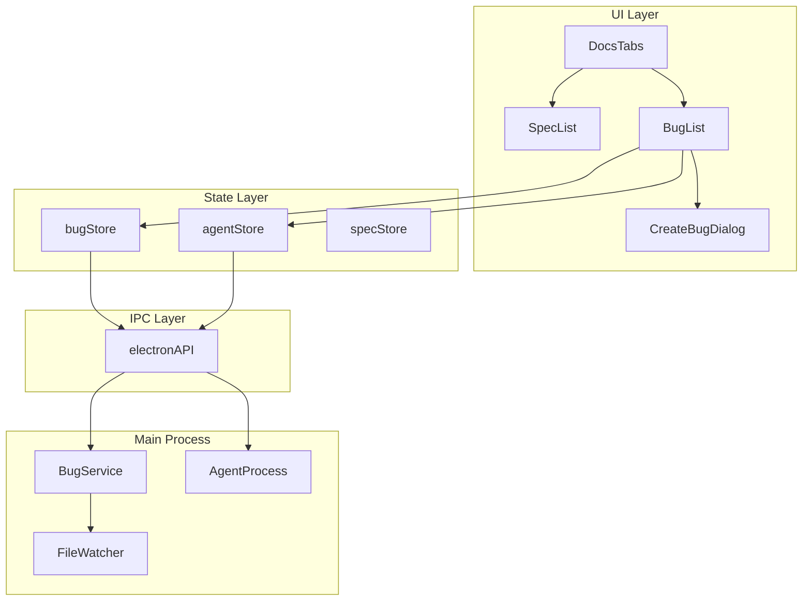
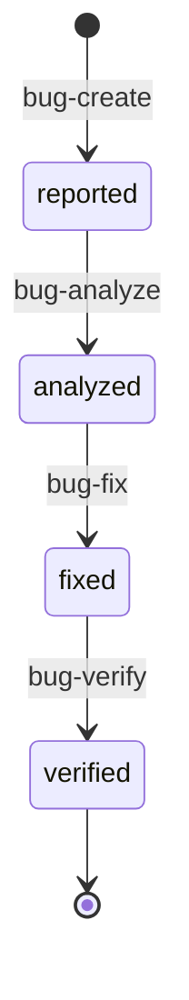
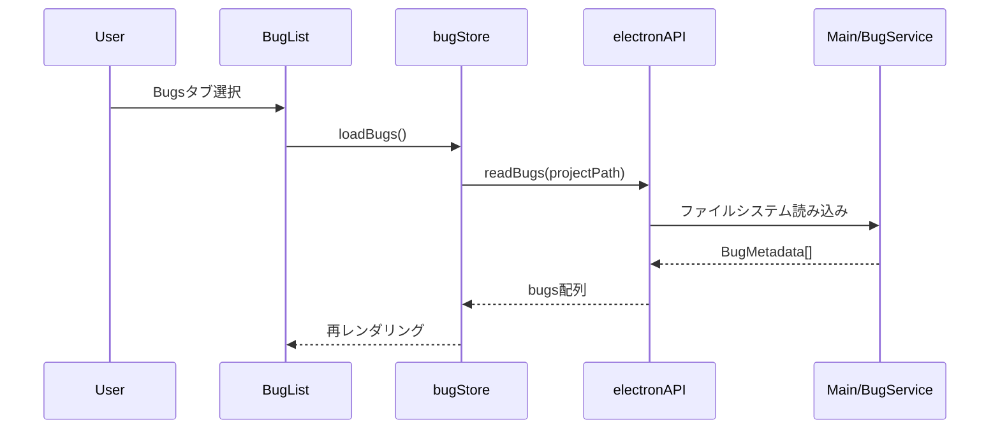
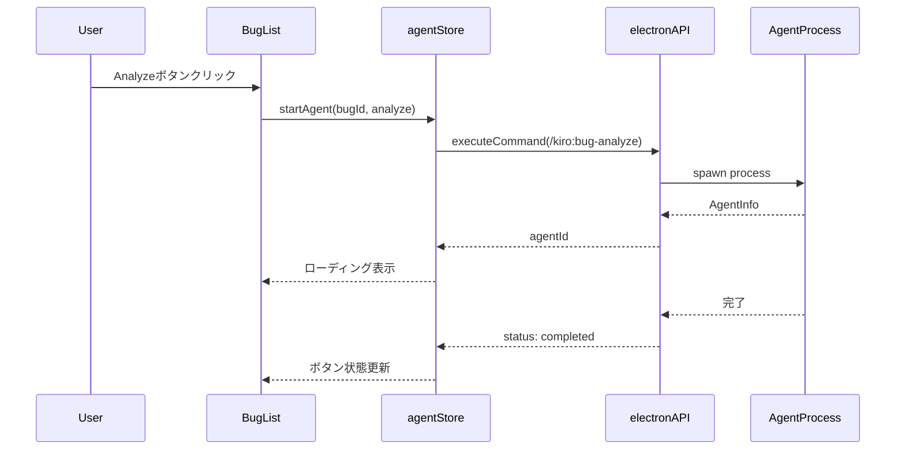

# Technical Design Document

## Overview

**Purpose**: Bug Workflow UIは、SDD Manager Electronアプリケーションのサイドバーにバグワークフロー管理機能を追加する。既存のSpec一覧（SpecList）と新規のバグ一覧（BugList）をタブ切り替え可能なDocsTabs親コンポーネントで統合し、`.kiro/bugs/`ディレクトリ内のバグをReport → Analyze → Fix → Verifyの4段階ワークフローで可視化・管理する。

**Users**: 開発者がUIから直接バグ報告の作成、進捗確認、ワークフローコマンド実行を行う。

**Impact**: 既存のサイドバー構成を変更し、SpecListをDocsTabsの子コンポーネントとして再配置。新規にBugList、CreateBugDialog、bugStoreを追加。

### Goals
- サイドバーでSpec一覧とバグ一覧をタブで切り替え可能にする
- バグのワークフロー進捗（Report/Analyze/Fix/Verify）を視覚的に表示する
- UIから直接バグワークフローコマンドを実行可能にする
- 既存のSpecList/specStoreパターンを踏襲した一貫性のある実装

### Non-Goals
- バグレポートの内容編集機能（エディタパネルで対応）
- バグの自動検出・提案機能
- バグ統計・分析ダッシュボード
- 複数プロジェクト間のバグ共有

## Architecture

### Existing Architecture Analysis

現在のサイドバー構成:
```
<aside> (左サイドバー)
├── ErrorBanner
├── SpecListHeader (新規作成ボタン)
├── SpecList (スクロール可能)
└── GlobalAgentPanel (下部固定)
```

変更後の構成:
```
<aside> (左サイドバー)
├── ErrorBanner
├── DocsTabs (タブヘッダー + 新規作成)
│   ├── [Specs タブ] → SpecList
│   └── [Bugs タブ] → BugList
└── GlobalAgentPanel (下部固定)
```

既存パターン:
- **状態管理**: Zustand store（specStore, agentStore）
- **コンポーネント構造**: 一覧 + 詳細 + アクションパネル
- **Agent連携**: agentStore経由でコマンド実行
- **ファイル監視**: electronAPI経由のwatcher

### Architecture Pattern & Boundary Map



**Architecture Integration**:
- Selected pattern: 既存のZustand + IPC パターンを踏襲
- Domain boundaries: Spec管理とBug管理を独立したストアで分離
- Existing patterns preserved: specStore/SpecListの構造をbugStore/BugListにミラー
- New components rationale: DocsTabs（タブ統合）、BugList（バグ一覧）、CreateBugDialog（バグ作成）、bugStore（状態管理）
- Steering compliance: TypeScript strict、Zustand状態管理、コンポーネントコロケーション

### Technology Stack

| Layer | Choice / Version | Role in Feature | Notes |
|-------|------------------|-----------------|-------|
| Frontend | React 19 + TypeScript 5.8+ | UIコンポーネント | 既存スタック |
| State | Zustand | bugStore状態管理 | specStoreパターン踏襲 |
| Styling | Tailwind CSS 4 | UIスタイリング | 既存クラス再利用 |
| Icons | Lucide React | ステータスアイコン | Bug, CheckCircle等 |
| IPC | contextBridge | Main/Renderer通信 | 既存electronAPI拡張 |

## System Flows

### Bug Workflow State Transition



### Bug List Load Flow



### Bug Workflow Action Flow



## Requirements Traceability

| Requirement | Summary | Components | Interfaces | Flows |
|-------------|---------|------------|------------|-------|
| 1.1 | タブ表示（Specs/Bugs） | DocsTabs | DocsTabsProps | - |
| 1.2 | タブ切り替え | DocsTabs | onTabChange | - |
| 1.3 | 選択タブハイライト | DocsTabs | activeTab state | - |
| 1.4 | タブ状態維持 | DocsTabs | useState | - |
| 2.1 | バグ一覧表示 | BugList | BugListProps | Bug List Load |
| 2.2 | ステータスバッジ表示 | BugList, BugListItem | BugPhase | - |
| 2.3 | バグ選択→詳細表示 | BugList | onSelect | - |
| 2.4 | 未選択時メッセージ | BugList | - | - |
| 2.5 | 空状態メッセージ | BugList | - | - |
| 3.1 | bug.json読み取り | bugStore | loadBugs | - |
| 3.2 | 4段階ステップ表示 | BugListItem | BugProgressIndicator | - |
| 3.3 | 完了フェーズ区別 | BugProgressIndicator | - | - |
| 3.4 | 現在フェーズハイライト | BugProgressIndicator | - | - |
| 4.1 | ダイアログ開閉 | CreateBugDialog | isOpen, onClose | - |
| 4.2 | バグ名入力 | CreateBugDialog | name field | - |
| 4.3 | バグ説明入力 | CreateBugDialog | description field | - |
| 4.4 | 作成コマンド送信 | CreateBugDialog | agentStore.startAgent | Bug Create |
| 4.5 | 空名バリデーション | CreateBugDialog | validation | - |
| 4.6 | 作成後リスト更新 | CreateBugDialog, bugStore | refreshBugs | - |
| 5.1 | アクションボタン表示 | BugList | BugActionButtons | - |
| 5.2 | Analyzeコマンド | BugActionButtons | agentStore | Bug Workflow |
| 5.3 | Fixコマンド | BugActionButtons | agentStore | Bug Workflow |
| 5.4 | Verifyコマンド | BugActionButtons | agentStore | Bug Workflow |
| 5.5 | ローディング状態 | BugActionButtons | isExecuting | - |
| 5.6 | フェーズ別有効化 | BugActionButtons | currentPhase | - |
| 6.1 | bugs配列管理 | bugStore | bugs state | - |
| 6.2 | 選択バグ管理 | bugStore | selectedBugName | - |
| 6.3 | loadBugsアクション | bugStore | loadBugs() | Bug List Load |
| 6.4 | selectBugアクション | bugStore | selectBug() | - |
| 6.5 | ファイル変更監視 | bugStore | watcher | - |
| 7.1 | コマンド送信機能 | agentStore | startAgent | Bug Workflow |
| 7.2 | ログ出力表示 | AgentLogPanel | existing | - |
| 7.3 | エラー通知 | notify | existing | - |
| 7.4 | 実行状態管理 | agentStore | isExecuting | - |

## Components and Interfaces

| Component | Domain/Layer | Intent | Req Coverage | Key Dependencies | Contracts |
|-----------|--------------|--------|--------------|------------------|-----------|
| DocsTabs | UI/Sidebar | Spec/Bugタブ切り替え親コンポーネント | 1.1-1.4 | SpecList, BugList | State |
| BugList | UI/Sidebar | バグ一覧と進捗表示 | 2.1-2.5, 3.1-3.4, 5.1-5.6 | bugStore, agentStore (P0) | Service, State |
| BugListItem | UI/Sidebar | 個別バグ行表示 | 2.2, 3.2-3.4 | BugMetadata | - |
| BugProgressIndicator | UI/Sidebar | 4段階進捗インジケーター | 3.2-3.4 | BugPhase | - |
| BugActionButtons | UI/Sidebar | ワークフローアクションボタン | 5.1-5.6 | agentStore (P0) | Service |
| CreateBugDialog | UI/Dialog | バグ作成ダイアログ | 4.1-4.6 | agentStore (P0), bugStore (P1) | Service |
| bugStore | State | バグ状態管理 | 6.1-6.5, 7.1-7.4 | electronAPI (P0) | Service, State |

### UI Layer

#### DocsTabs

| Field | Detail |
|-------|--------|
| Intent | サイドバーでSpec一覧とバグ一覧をタブで切り替える親コンポーネント |
| Requirements | 1.1, 1.2, 1.3, 1.4 |

**Responsibilities & Constraints**
- Specs/Bugsの2タブを表示
- 選択状態をローカルstateで管理
- 子コンポーネント（SpecList/BugList）の切り替えを制御
- SpecListHeaderの「新規作成」機能をタブヘッダーに統合

**Dependencies**
- Inbound: App.tsx — サイドバー親 (P0)
- Outbound: SpecList, BugList — タブコンテンツ (P0)

**Contracts**: State [x]

##### State Management

```typescript
interface DocsTabsState {
  activeTab: 'specs' | 'bugs';
}
```

##### Props Interface

```typescript
interface DocsTabsProps {
  specCount: number;
  bugCount: number;
  onCreateSpec: () => void;
  onCreateBug: () => void;
  disabled?: boolean;
}
```

**Implementation Notes**
- Integration: SpecListHeaderの機能を統合、タブごとの新規作成ボタン
- Validation: タブ切り替え時の状態保持
- Risks: 既存のSpecListHeader削除によるレイアウト調整が必要

---

#### BugList

| Field | Detail |
|-------|--------|
| Intent | .kiro/bugs/内のバグ一覧を表示し、ワークフローアクションを提供 |
| Requirements | 2.1, 2.2, 2.3, 2.4, 2.5, 3.1, 3.2, 3.3, 3.4, 5.1, 5.2, 5.3, 5.4, 5.5, 5.6 |

**Responsibilities & Constraints**
- bugStoreからバグ一覧を取得・表示
- 各バグの進捗ステータスをBugListItemで表示
- バグ選択時にエディタパネルに詳細を表示
- 選択バグに対するワークフローアクションボタンを表示
- プロジェクト未選択時/空状態のメッセージ表示

**Dependencies**
- Inbound: DocsTabs — 親コンポーネント (P0)
- Outbound: bugStore — 状態管理 (P0)
- Outbound: agentStore — コマンド実行 (P0)
- Outbound: editorStore — 詳細表示 (P1)

**Contracts**: Service [x] / State [x]

##### Service Interface

```typescript
interface BugListActions {
  onSelectBug(bugName: string): void;
  onExecuteAction(bugName: string, action: BugAction): Promise<void>;
}

type BugAction = 'analyze' | 'fix' | 'verify';
```

##### Component Props

```typescript
interface BugListProps {
  // Props from parent if needed
}
```

**Implementation Notes**
- Integration: SpecListと同様の構造、既存スタイルクラス再利用
- Validation: 選択バグの存在確認
- Risks: 大量バグ時のパフォーマンス（仮想化検討は将来対応）

---

#### BugListItem

| Field | Detail |
|-------|--------|
| Intent | 個別バグの行表示（名前、進捗、更新日時） |
| Requirements | 2.2, 3.2, 3.3, 3.4 |

**Responsibilities & Constraints**
- バグ名、進捗インジケーター、更新日時を表示
- 選択状態のハイライト
- クリック/キーボードでの選択

**Dependencies**
- Inbound: BugList — 親コンポーネント (P0)
- Outbound: BugProgressIndicator — 進捗表示 (P0)

**Contracts**: なし（プレゼンテーショナル）

##### Props Interface

```typescript
interface BugListItemProps {
  bug: BugMetadata;
  isSelected: boolean;
  onSelect: () => void;
}
```

---

#### BugProgressIndicator

| Field | Detail |
|-------|--------|
| Intent | Report→Analyze→Fix→Verifyの4段階進捗を視覚表示 |
| Requirements | 3.2, 3.3, 3.4 |

**Responsibilities & Constraints**
- 4段階のステップを水平に表示
- 完了フェーズ: 塗りつぶしアイコン
- 未完了フェーズ: アウトラインアイコン
- 現在フェーズ: ハイライト表示

**Dependencies**
- Inbound: BugListItem — 親コンポーネント (P0)

**Contracts**: なし（プレゼンテーショナル）

##### Props Interface

```typescript
interface BugProgressIndicatorProps {
  phase: BugPhase;
}

type BugPhase = 'reported' | 'analyzed' | 'fixed' | 'verified';
```

---

#### BugActionButtons

| Field | Detail |
|-------|--------|
| Intent | 選択バグに対するワークフローアクションボタン |
| Requirements | 5.1, 5.2, 5.3, 5.4, 5.5, 5.6 |

**Responsibilities & Constraints**
- Analyze/Fix/Verifyボタンを表示
- 現在フェーズに応じて次アクションのみ有効化
- 実行中はローディング状態を表示
- agentStore経由でコマンド実行

**Dependencies**
- Inbound: BugList — 親コンポーネント (P0)
- Outbound: agentStore — コマンド実行 (P0)

**Contracts**: Service [x]

##### Service Interface

```typescript
interface BugActionButtonsActions {
  onAnalyze(): Promise<void>;
  onFix(): Promise<void>;
  onVerify(): Promise<void>;
}
```

##### Props Interface

```typescript
interface BugActionButtonsProps {
  bugName: string;
  currentPhase: BugPhase;
  isExecuting: boolean;
  onAction: (action: BugAction) => Promise<void>;
}
```

---

#### CreateBugDialog

| Field | Detail |
|-------|--------|
| Intent | 新規バグ作成ダイアログ |
| Requirements | 4.1, 4.2, 4.3, 4.4, 4.5, 4.6 |

**Responsibilities & Constraints**
- バグ名と説明の入力フォーム
- バグ名の空チェックバリデーション
- agentStoreを通じて/kiro:bug-createコマンド実行
- 作成完了後にダイアログを閉じてリスト更新

**Dependencies**
- Inbound: DocsTabs — 開閉制御 (P0)
- Outbound: agentStore — コマンド実行 (P0)
- Outbound: bugStore — リスト更新 (P1)

**Contracts**: Service [x]

##### Service Interface

```typescript
interface CreateBugDialogActions {
  onCreate(name: string, description: string): Promise<void>;
}
```

##### Props Interface

```typescript
interface CreateBugDialogProps {
  isOpen: boolean;
  onClose: () => void;
}
```

**Implementation Notes**
- Integration: CreateSpecDialogと同様のUI/UXパターン
- Validation: 名前必須、説明任意（空でも作成可能）
- Risks: バグ名の重複チェックはAgent側で実行

---

### State Layer

#### bugStore

| Field | Detail |
|-------|--------|
| Intent | バグ一覧と選択状態の管理 |
| Requirements | 6.1, 6.2, 6.3, 6.4, 6.5, 7.1, 7.2, 7.3, 7.4 |

**Responsibilities & Constraints**
- bugs配列の管理
- selectedBugNameの管理
- electronAPI経由でバグ一覧を読み込み
- ファイル監視による自動更新
- specStoreと同様の構造・パターン

**Dependencies**
- Outbound: electronAPI — IPC通信 (P0)
- External: FileWatcher — ファイル変更監視 (P1)

**Contracts**: Service [x] / State [x]

##### Service Interface

```typescript
interface BugStoreActions {
  loadBugs(projectPath: string): Promise<void>;
  selectBug(bugName: string | null): void;
  refreshBugs(): Promise<void>;
  startWatching(): Promise<void>;
  stopWatching(): Promise<void>;
  getSortedBugs(): BugMetadata[];
}
```

##### State Management

```typescript
interface BugState {
  bugs: BugMetadata[];
  selectedBugName: string | null;
  isLoading: boolean;
  error: string | null;
  isWatching: boolean;
}
```

**Implementation Notes**
- Integration: specStoreパターンを踏襲、electronAPI拡張が必要
- Validation: projectPathの存在確認
- Risks: Main Process側のBugService実装が前提

---

### IPC Layer (electronAPI Extensions)

#### Bug関連API追加

```typescript
// electron.d.ts への追加
interface ElectronAPI {
  // 既存のAPI...

  // Bug Management
  readBugs(projectPath: string): Promise<BugMetadata[]>;
  readBugDetail(bugPath: string): Promise<BugDetail>;

  // Bug Watcher
  startBugsWatcher(): Promise<void>;
  stopBugsWatcher(): Promise<void>;
  onBugsChanged(callback: (event: BugsChangeEvent) => void): () => void;

  // Bug Workflow Commands
  executeBugCreate(projectPath: string, name: string, description: string): Promise<AgentInfo>;
  executeBugAnalyze(bugName: string): Promise<AgentInfo>;
  executeBugFix(bugName: string): Promise<AgentInfo>;
  executeBugVerify(bugName: string): Promise<AgentInfo>;
}
```

## Data Models

### Domain Model

#### BugMetadata

```typescript
interface BugMetadata {
  readonly name: string;           // バグ名（ディレクトリ名）
  readonly path: string;           // フルパス
  readonly phase: BugPhase;        // 現在のフェーズ
  readonly updatedAt: string;      // 最終更新日時
  readonly reportedAt: string;     // 報告日時
}

type BugPhase = 'reported' | 'analyzed' | 'fixed' | 'verified';
```

#### BugDetail

```typescript
interface BugDetail {
  metadata: BugMetadata;
  artifacts: {
    report: ArtifactInfo | null;      // report.md
    analysis: ArtifactInfo | null;    // analysis.md
    fix: ArtifactInfo | null;         // fix.md
    verification: ArtifactInfo | null; // verification.md
  };
}
```

#### BugsChangeEvent

```typescript
interface BugsChangeEvent {
  type: 'add' | 'change' | 'unlink' | 'addDir' | 'unlinkDir';
  path: string;
  bugName?: string;
}
```

### Phase Determination Logic

バグのフェーズは存在するファイルから判定:

| 存在ファイル | Phase |
|-------------|-------|
| report.md のみ | reported |
| report.md + analysis.md | analyzed |
| report.md + analysis.md + fix.md | fixed |
| report.md + analysis.md + fix.md + verification.md | verified |

```typescript
function determineBugPhase(artifacts: BugDetail['artifacts']): BugPhase {
  if (artifacts.verification?.exists) return 'verified';
  if (artifacts.fix?.exists) return 'fixed';
  if (artifacts.analysis?.exists) return 'analyzed';
  return 'reported';
}
```

## Error Handling

### Error Categories and Responses

**User Errors**:
- 空のバグ名 → フィールドバリデーション、送信ボタン無効化
- 重複バグ名 → Agent側でエラー、通知表示

**System Errors**:
- ファイル読み込み失敗 → bugStore.error設定、エラーメッセージ表示
- Agent起動失敗 → notify.error、ボタン状態リセット
- IPC通信失敗 → try-catch、ユーザーフレンドリーなメッセージ

**Business Logic Errors**:
- 不正なフェーズ遷移（例: reported → fix） → ボタン無効化で防止
- プロジェクト未選択 → 「プロジェクトを選択してください」メッセージ

### Monitoring

- console.log/errorによるデバッグログ出力
- agentStoreのエラーステート監視
- electronAPIエラーのキャッチと通知

## Testing Strategy

### Unit Tests

| 対象 | テスト内容 |
|------|-----------|
| bugStore | loadBugs、selectBug、refreshBugs、状態更新 |
| BugProgressIndicator | フェーズに応じた表示 |
| CreateBugDialog | バリデーション、フォーム送信 |
| determineBugPhase | 各ファイル組み合わせでの判定 |

### Integration Tests

| 対象 | テスト内容 |
|------|-----------|
| BugList + bugStore | 一覧表示、選択、更新 |
| DocsTabs | タブ切り替え、状態維持 |
| CreateBugDialog + agentStore | 作成フロー |

### E2E Tests

| シナリオ | 検証内容 |
|----------|----------|
| バグ作成フロー | ダイアログ→入力→作成→一覧更新 |
| ワークフロー実行 | Analyze→Fix→Verify順次実行 |
| タブ切り替え | Specs↔Bugs切り替え、状態保持 |

## Performance & Scalability

**Target Metrics**:
- バグ一覧初期表示: 100ms以内（50件まで）
- タブ切り替え: 瞬時（状態保持による再レンダリング最小化）

**Optimization**:
- バグ一覧のメモ化（useMemo）
- ファイル監視のデバウンス
- 大量バグ時の仮想化は将来対応（現状は100件未満想定）
