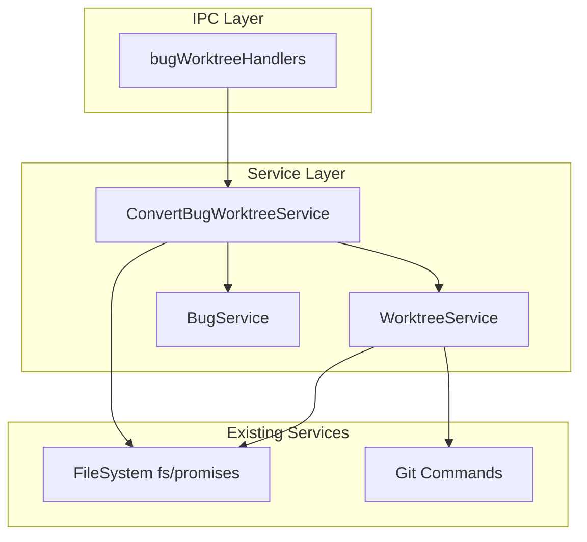
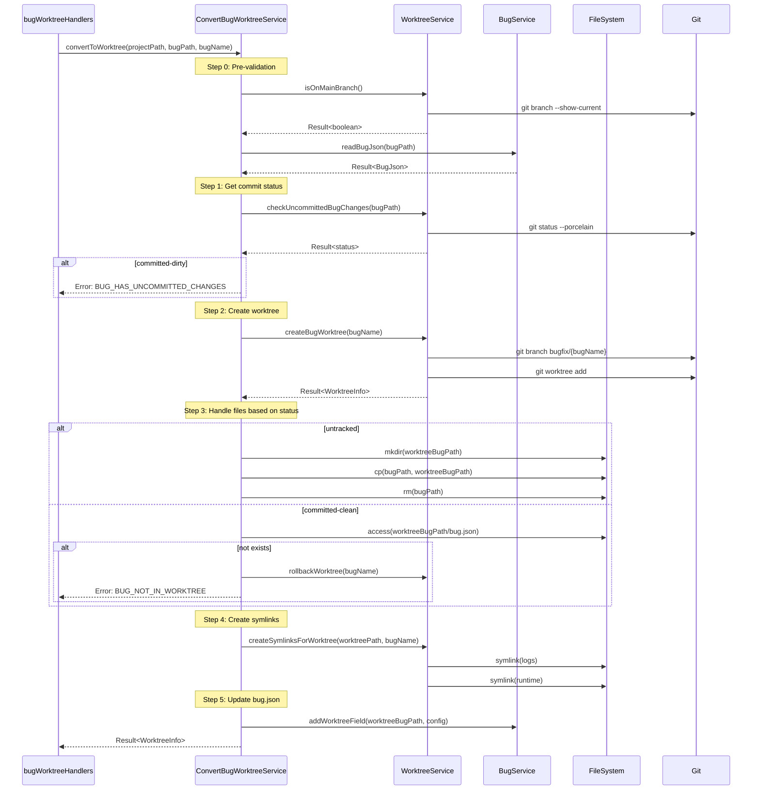

# Design: Bug Worktree Spec Alignment

## Overview

**Purpose**: Bugのworktree変換処理をSpecと同じ動作に統一し、コードベースの一貫性を向上させる。

**Users**: SDD Orchestratorを使用する開発者が、Bug修正時にworktreeモードを使用する際、Specと同等の信頼性とファイル整合性が保証される。

**Impact**: 現在のBugの「ディレクトリモード」を廃止し、Specの`ConvertWorktreeService`と同等のコミット状態チェック・ファイル処理ロジックを導入する。

### Goals

- Bugのworktree変換処理にSpecと同じ3状態コミットチェック（untracked, committed-clean, committed-dirty）を導入
- 未コミットBugの変換時にメイン側ファイルを削除し、ファイル重複を防止
- worktree内にlogs/runtimeへのシンボリックリンクを作成
- エラー発生時の適切なロールバック処理

### Non-Goals

- 既存のworktreeモードBugの自動移行処理
- worktree削除時の動作変更
- Specのworktree変換処理の変更
- UIの変更

## Architecture

### Existing Architecture Analysis

現在のBug worktree実装（「ディレクトリモード」）:
- `bugWorktreeHandlers.ts`の`handleBugWorktreeCreate`がエントリーポイント
- `worktreeService.createEntityWorktree`でworktree作成
- `bugService.copyBugToWorktree`でファイルコピー
- コミット状態チェックなし、メイン側ファイルは残存

Spec worktree実装（`ConvertWorktreeService`）:
- `convertWorktreeHandlers.ts`がエントリーポイント
- `ConvertWorktreeService.convertToWorktree`で統括
- 3状態コミットチェック（`getSpecStatus`）
- untracked: コピー後にメイン側削除
- committed-clean: コピースキップ、worktree内存在確認
- committed-dirty: エラー
- シンボリックリンク作成（logs/runtime）

### Architecture Pattern & Boundary Map



**Architecture Integration**:
- **Selected pattern**: Service Layer Pattern - 既存の`ConvertWorktreeService`と同じ構造を踏襲
- **Domain boundaries**: Bug worktree変換ロジックを`ConvertBugWorktreeService`に集約
- **Existing patterns preserved**: `WorktreeService`の再利用、Result型によるエラーハンドリング
- **New components rationale**: `ConvertBugWorktreeService`のみ新規作成（Specとの対称性）
- **Steering compliance**: DRY原則に従い、共通ロジックを`WorktreeService`に委譲

### Technology Stack

| Layer | Choice / Version | Role in Feature | Notes |
|-------|------------------|-----------------|-------|
| Backend / Services | TypeScript 5.8+ | 型安全なサービス実装 | 既存スタック |
| Data / Storage | fs/promises | ファイル操作 | 既存スタック |
| Infrastructure / Runtime | Node.js 20+ / Electron 35 | Git操作、プロセス管理 | 既存スタック |

## System Flows

### Bug Worktree変換フロー



**Key Decisions**:
- committed-dirty状態はエラーとして早期リターン
- untracked時のみメイン側ファイル削除
- シンボリックリンク作成失敗は部分的セットアップ状態として報告

## Requirements Traceability

| Criterion ID | Summary | Components | Implementation Approach |
|--------------|---------|------------|------------------------|
| 1.1 | git status --porcelainでコミット状態判定 | ConvertBugWorktreeService.getBugStatus | 新規実装 - WorktreeService.checkUncommittedBugChangesを呼び出し |
| 1.2 | untracked状態で変換許可 | ConvertBugWorktreeService.canConvert | 新規実装 |
| 1.3 | committed-clean状態で変換許可 | ConvertBugWorktreeService.canConvert | 新規実装 |
| 1.4 | committed-dirty状態でエラー | ConvertBugWorktreeService.canConvert | 新規実装 |
| 2.1 | untrackedでworktreeにコピー | ConvertBugWorktreeService.convertToWorktree | 新規実装 - fs.cp使用 |
| 2.2 | コピー成功後メイン側削除 | ConvertBugWorktreeService.convertToWorktree | 新規実装 - fs.rm使用 |
| 2.3 | コピー失敗時ロールバック | ConvertBugWorktreeService.convertToWorktree, rollbackWorktree | 新規実装 |
| 3.1 | committed-cleanでコピースキップ | ConvertBugWorktreeService.convertToWorktree | 新規実装 |
| 3.2 | worktree作成で自動含有前提 | ConvertBugWorktreeService.convertToWorktree | Gitの動作に依存 |
| 3.3 | worktree内Bug存在確認 | ConvertBugWorktreeService.convertToWorktree | 新規実装 - fs.access使用 |
| 3.4 | Bug不在時エラー | ConvertBugWorktreeService.convertToWorktree | 新規実装 |
| 4.1 | logsシンボリックリンク作成 | WorktreeService.createSymlinksForWorktree | 既存再利用 |
| 4.2 | runtimeシンボリックリンク作成 | WorktreeService.createSymlinksForWorktree | 既存再利用 |
| 4.3 | ターゲットディレクトリ存在確認・作成 | WorktreeService.createSymlinksForWorktree | 既存再利用 |
| 4.4 | 既存ディレクトリ削除後シンボリックリンク作成 | WorktreeService.createSymlinksForWorktree | 既存再利用 |
| 5.1 | ブランチ作成失敗エラー | ConvertBugWorktreeService.convertToWorktree | 新規実装 |
| 5.2 | worktree作成失敗時ブランチ削除 | ConvertBugWorktreeService.convertToWorktree | 新規実装 |
| 5.3 | ファイルコピー失敗時ロールバック | ConvertBugWorktreeService.convertToWorktree | 新規実装 |
| 5.4 | シンボリックリンク作成失敗エラー | ConvertBugWorktreeService.convertToWorktree | 新規実装 |

### Coverage Validation Checklist

- [x] Every criterion ID from requirements.md appears in the table above
- [x] Each criterion has specific component names
- [x] Implementation approach distinguishes "reuse existing" vs "new implementation"
- [x] Error handling criteria specify concrete error types and rollback mechanisms

## Components and Interfaces

| Component | Domain/Layer | Intent | Req Coverage | Key Dependencies | Contracts |
|-----------|--------------|--------|--------------|------------------|-----------|
| ConvertBugWorktreeService | Service | Bug worktree変換ロジック統括 | 1.1-1.4, 2.1-2.3, 3.1-3.4, 5.1-5.4 | WorktreeService (P0), BugService (P0), fs (P0) | Service |
| WorktreeService | Service | Git worktree操作 | 4.1-4.4 | Git CLI (P0), fs (P0) | Service |
| BugService | Service | Bug.json CRUD | - | fs (P0) | Service |
| bugWorktreeHandlers | IPC | IPCエントリーポイント | - | ConvertBugWorktreeService (P0) | - |

### Service Layer

#### ConvertBugWorktreeService

| Field | Detail |
|-------|--------|
| Intent | Bugをworktreeモードに変換する処理を統括 |
| Requirements | 1.1-1.4, 2.1-2.3, 3.1-3.4, 5.1-5.4 |

**Responsibilities & Constraints**
- Bugのgitコミット状態判定（untracked, committed-clean, committed-dirty）
- 状態に応じたファイル処理（コピー/スキップ/エラー）
- エラー時のロールバック処理
- Specの`ConvertWorktreeService`と同等の動作保証

**Dependencies**
- Inbound: bugWorktreeHandlers - IPC呼び出し (P0)
- Outbound: WorktreeService - worktree作成/削除/シンボリックリンク (P0)
- Outbound: BugService - bug.json更新 (P0)
- External: fs/promises - ファイル操作 (P0)

**Contracts**: Service [x]

##### Service Interface

```typescript
/**
 * Bugのgitコミット状態
 * Requirements: 1.1, 1.2, 1.3, 1.4
 */
export type BugCommitStatus = 'untracked' | 'committed-clean' | 'committed-dirty';

/**
 * ConvertBugWorktreeService操作のエラー型
 * Requirements: 5.1-5.4
 */
export type ConvertBugError =
  | { type: 'NOT_ON_MAIN_BRANCH'; currentBranch: string }
  | { type: 'BUG_NOT_FOUND'; bugPath: string }
  | { type: 'ALREADY_WORKTREE_MODE'; bugPath: string }
  | { type: 'BUG_HAS_UNCOMMITTED_CHANGES'; bugPath: string; files: string[] }
  | { type: 'BRANCH_CREATE_FAILED'; message: string }
  | { type: 'WORKTREE_CREATE_FAILED'; message: string }
  | { type: 'FILE_MOVE_FAILED'; message: string }
  | { type: 'SYMLINK_CREATE_FAILED'; message: string }
  | { type: 'BUG_JSON_UPDATE_FAILED'; message: string }
  | { type: 'BUG_NOT_IN_WORKTREE'; bugPath: string };

/**
 * Result型
 */
export type ConvertBugResult<T> =
  | { ok: true; value: T }
  | { ok: false; error: ConvertBugError };

/**
 * ConvertBugWorktreeService Interface
 */
interface ConvertBugWorktreeService {
  /**
   * Bugのgitコミット状態を取得
   * Requirements: 1.1, 1.2, 1.3, 1.4
   */
  getBugStatus(bugPath: string): Promise<ConvertBugResult<BugCommitStatus>>;

  /**
   * Bugをworktreeに変換可能かチェック
   * Requirements: 1.2, 1.3, 1.4, 5.1
   */
  canConvert(projectPath: string, bugPath: string): Promise<ConvertBugResult<boolean>>;

  /**
   * Bugをworktreeモードに変換
   * Requirements: 2.1-2.3, 3.1-3.4, 4.1-4.4, 5.1-5.4
   */
  convertToWorktree(
    projectPath: string,
    bugPath: string,
    bugName: string
  ): Promise<ConvertBugResult<WorktreeInfo>>;
}
```

- Preconditions: projectPathが有効なgitリポジトリ、bugPathにbug.jsonが存在
- Postconditions: worktree作成成功時、bug.jsonにworktreeフィールドが追加される
- Invariants: エラー発生時は可能な限りロールバックされる

**Implementation Notes**
- Integration: `ConvertWorktreeService`の実装をベースに、Bug固有のパス・ブランチ命名に対応
- Validation: mainブランチチェック、コミット状態チェック、worktree重複チェック
- Risks: ファイルコピー中の競合、シンボリックリンク作成失敗時の部分的状態

#### WorktreeService（既存拡張）

| Field | Detail |
|-------|--------|
| Intent | Git worktree操作のラッパー |
| Requirements | 4.1-4.4 |

**Contracts**: Service [x]

##### Service Interface（追加メソッド）

```typescript
interface WorktreeService {
  // 既存メソッド（省略）

  /**
   * Bugディレクトリの未コミット変更をチェック
   * Requirements: 1.1
   *
   * ConvertWorktreeService.checkUncommittedSpecChangesと同等
   */
  checkUncommittedBugChanges(bugPath: string): Promise<WorktreeServiceResult<{
    hasChanges: boolean;
    files: string[];
    statusOutput: string;
  }>>;
}
```

**Implementation Notes**
- `checkUncommittedSpecChanges`と同じロジックを`checkUncommittedBugChanges`として提供
- 既存の`createSymlinksForWorktree`をBug worktreeにも再利用

## Data Models

### Domain Model

**BugCommitStatus**: Bugのgitコミット状態を表す列挙型
- `untracked`: 未追跡または新規追加（`??`または`A `）
- `committed-clean`: コミット済み・差分なし（空出力）
- `committed-dirty`: コミット済み・差分あり（`M`, `D`, `R`等）

**ConvertBugError**: 変換エラーの判別共用体型
- Specの`ConvertError`と対称的な構造

### Logical Data Model

**bug.json拡張（既存）**:
```typescript
interface BugJson {
  bug_name: string;
  created_at: string;
  updated_at: string;
  phase?: BugPhase;
  worktree?: {
    path: string;      // 例: ".kiro/worktrees/bugs/{bugName}"
    branch: string;    // 例: "bugfix/{bugName}"
    created_at: string;
  };
}
```

## Error Handling

### Error Strategy

Result型パターンを使用し、エラーを明示的に型で表現する。エラー発生時は可能な限りロールバックを実行。

### Error Categories and Responses

**User Errors (Pre-validation failures)**:
| Error Type | Condition | User Message | Recovery |
|------------|-----------|--------------|----------|
| NOT_ON_MAIN_BRANCH | main/master以外のブランチ | mainブランチでのみ変換できます | ブランチ切り替え案内 |
| BUG_NOT_FOUND | bug.jsonが存在しない | Bugが見つかりません | パス確認案内 |
| ALREADY_WORKTREE_MODE | worktreeフィールドが既存 | 既にWorktreeモードです | 操作不要 |
| BUG_HAS_UNCOMMITTED_CHANGES | committed-dirty状態 | Bugに未コミットの変更があります | コミット案内 |

**System Errors (Operation failures)**:
| Error Type | Condition | User Message | Recovery |
|------------|-----------|--------------|----------|
| BRANCH_CREATE_FAILED | git branch失敗 | ブランチ作成に失敗しました | Gitエラー確認 |
| WORKTREE_CREATE_FAILED | git worktree add失敗 | Worktree作成に失敗しました | ブランチ自動削除 |
| FILE_MOVE_FAILED | コピー/削除失敗 | ファイル移動に失敗しました | Worktree自動削除、メイン側ファイル保持 |
| SYMLINK_CREATE_FAILED | シンボリックリンク失敗 | シンボリックリンク作成に失敗しました | 部分的セットアップ状態で報告 |
| BUG_NOT_IN_WORKTREE | committed-clean時にworktree内にBugなし | Worktree内にBugが見つかりません | Worktree自動削除 |

### Monitoring

- `logger.error`でエラー詳細をログ出力
- エラー型により適切なユーザーメッセージを生成（`getConvertBugErrorMessage`関数）

**ログ出力ポイント（ConvertBugWorktreeService）**:

| メソッド | レベル | タイミング | 出力内容 |
|----------|--------|-----------|----------|
| getBugStatus | debug | 開始時 | `[ConvertBugWorktreeService] getBugStatus called`, bugPath |
| getBugStatus | debug | 終了時 | `[ConvertBugWorktreeService] Bug status: {status}`, bugPath |
| canConvert | debug | 開始時 | `[ConvertBugWorktreeService] canConvert called`, projectPath, bugPath |
| canConvert | warn | エラー時 | `[ConvertBugWorktreeService] {エラー理由}`, 詳細情報 |
| canConvert | info | 成功時 | `[ConvertBugWorktreeService] Bug can be converted`, bugPath, status |
| convertToWorktree | info | 開始時 | `[ConvertBugWorktreeService] convertToWorktree started`, projectPath, bugPath, bugName |
| convertToWorktree | info | ステップ完了時 | `[ConvertBugWorktreeService] {ステップ名} completed`, 詳細情報 |
| convertToWorktree | error | エラー時 | `[ConvertBugWorktreeService] Failed to {操作}`, error詳細 |
| convertToWorktree | warn | ロールバック時 | `[ConvertBugWorktreeService] Rolling back worktree`, bugName |
| convertToWorktree | info | 成功時 | `[ConvertBugWorktreeService] Conversion completed successfully`, bugName, worktreePath |

※既存の`ConvertWorktreeService`のログ出力パターンを踏襲

## Testing Strategy

### Unit Tests
- `ConvertBugWorktreeService.getBugStatus`: 各コミット状態（untracked, committed-clean, committed-dirty）の判定
- `ConvertBugWorktreeService.canConvert`: mainブランチチェック、既存worktreeチェック、コミット状態チェック
- `ConvertBugWorktreeService.convertToWorktree`: 正常系（untracked, committed-clean）、エラー系
- `WorktreeService.checkUncommittedBugChanges`: git statusパース

### Integration Tests
- untracked Bugの変換フロー（コピー→削除→シンボリックリンク→bug.json更新）
- committed-clean Bugの変換フロー（スキップ→検証→シンボリックリンク→bug.json更新）
- committed-dirty Bugのエラー処理
- 各種エラー時のロールバック動作

### E2E Tests
- UIからのworktree変換操作（将来のUI変更時に追加）

## Design Decisions

### DD-001: ConvertBugWorktreeServiceの新規作成

| Field | Detail |
|-------|--------|
| Status | Accepted |
| Context | Bugのworktree変換をSpecと同じ動作に統一する必要がある |
| Decision | `ConvertWorktreeService`と対称的な`ConvertBugWorktreeService`を新規作成 |
| Rationale | 既存の`handleBugWorktreeCreate`を拡張するよりも、責務を明確に分離した方が保守性が高い |
| Alternatives Considered | 1. `handleBugWorktreeCreate`に直接ロジック追加 - 関数が肥大化、テスト困難 2. `ConvertWorktreeService`を汎用化 - 過度な抽象化、Spec/Bug固有の処理が混在 |
| Consequences | 新規ファイル追加、Specとの対称性による理解しやすさ向上 |

### DD-002: 3状態コミットチェックの導入

| Field | Detail |
|-------|--------|
| Status | Accepted |
| Context | 現在のBug worktreeはコミット状態をチェックせず、常にファイルをコピーしている |
| Decision | Specと同じ3状態（untracked, committed-clean, committed-dirty）判定を導入 |
| Rationale | Requirements 1.1-1.4に明記。ファイルの整合性保証、予期しない上書き防止 |
| Alternatives Considered | 1. 常にコピー（現状維持）- committed-dirty時の上書きリスク 2. 常にスキップ - untrackedファイルがworktreeに含まれない |
| Consequences | committed-dirty時はユーザーに明示的なコミットを要求 |

### DD-003: メイン側ファイル削除（untrackedのみ）

| Field | Detail |
|-------|--------|
| Status | Accepted |
| Context | Specではuntracked状態でメイン側ファイルを削除している |
| Decision | Bugでも同様にuntracked状態でメイン側ファイルを削除 |
| Rationale | Requirements 2.2に明記。ファイル重複を避け、worktreeが唯一の真実の情報源となる |
| Alternatives Considered | 1. 常にメイン側を残す - ファイル重複、同期問題 2. committed-cleanでもメイン側削除 - Gitの追跡下にあるファイルを削除すると問題発生 |
| Consequences | untracked Bugは変換後にメイン側から消える（worktreeに移動） |

### DD-004: 既存WorktreeService.createSymlinksForWorktreeの再利用

| Field | Detail |
|-------|--------|
| Status | Accepted |
| Context | シンボリックリンク作成ロジックは既にSpecで実装済み |
| Decision | 既存の`createSymlinksForWorktree`をBug worktreeにも再利用 |
| Rationale | DRY原則。logs/runtimeのシンボリックリンク作成ロジックは同一 |
| Alternatives Considered | 1. Bug専用メソッドを作成 - コード重複 |
| Consequences | Specとの一貫性向上、保守コスト削減 |

## Integration & Deprecation Strategy

### 変更が必要な既存ファイル（統合ポイント）

| File | Change Type | Description |
|------|-------------|-------------|
| `electron-sdd-manager/src/main/ipc/bugWorktreeHandlers.ts` | Modify | `handleBugWorktreeCreate`を`ConvertBugWorktreeService.convertToWorktree`呼び出しに変更 |
| `electron-sdd-manager/src/main/services/worktreeService.ts` | Modify | `checkUncommittedBugChanges`メソッド追加 |

### 新規作成ファイル

| File | Description |
|------|-------------|
| `electron-sdd-manager/src/main/services/convertBugWorktreeService.ts` | Bug worktree変換サービス |
| `electron-sdd-manager/src/main/services/convertBugWorktreeService.test.ts` | ユニットテスト |

### 削除対象ファイル

なし

### 非推奨化される機能

- `bugWorktreeHandlers.ts`内の既存「ディレクトリモード」ロジック（`copyBugToWorktree`呼び出し部分）は`ConvertBugWorktreeService`に置き換え
