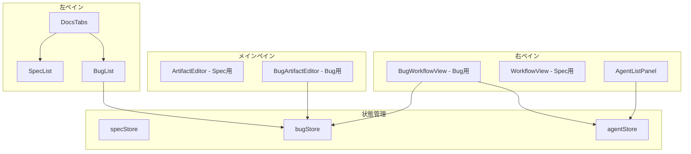
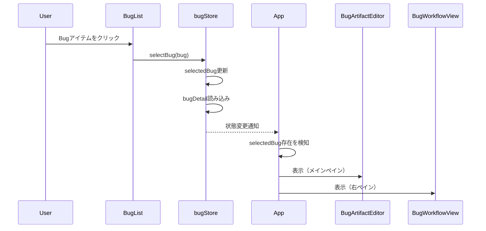
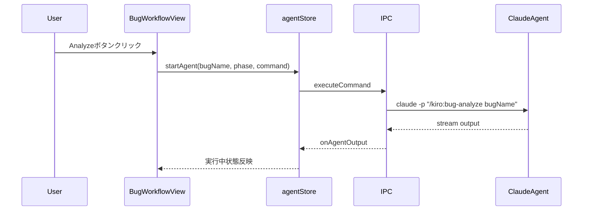

# Technical Design Document

## Overview

**Purpose**: Bugsタブ選択時にSpecsタブと同様の3ペイン連動動作を実現し、Bug修正ワークフローのUI操作性を向上させる。

**Users**: SDD OrchestratorでBug修正ワークフローを実行するユーザーが、直感的にBugドキュメントの閲覧・編集とワークフロー操作を行える。

**Impact**: App.tsxのペイン表示ロジックを拡張し、Bug選択時にメインペイン（ドキュメントタブ）と右ペイン（ワークフロー+Agent一覧）を表示する。

### Goals
- Bugsタブ選択時のペイン連動をSpecsタブと一貫した動作で実現
- Bug選択時にドキュメントタブ（report, analysis, fix, verification）を表示
- Bug選択時にワークフロービュー（5フェーズ）とAgent一覧を表示
- フェーズ自動実行ボタンでBugワークフローコマンドを実行

### Non-Goals
- Bugの自動実行（AutoExecution）機能の実装（将来検討）
- ドキュメントレビュー機能のBugへの適用
- Bugワークフローの永続化設定

## Architecture

### Existing Architecture Analysis

現在のアーキテクチャ:
- App.tsx: `selectedSpec`の有無でメイン・右ペインの表示を制御
- DocsTabs: Specs/Bugsタブ切り替えのみ（ペイン連動ロジックなし）
- WorkflowView: Spec専用のワークフロー表示・操作
- bugStore: Bug選択状態管理（selectedBug, bugDetail）

拡張ポイント:
- App.tsx: Bug選択時のペイン表示条件を追加
- 新規BugWorkflowView: Bugワークフロー表示・操作
- 新規BugArtifactEditor: Bugドキュメントタブ表示

### Architecture Pattern & Boundary Map



**Architecture Integration**:
- Selected pattern: Specsタブ並列パターン（詳細は`research.md`参照）
- Domain boundaries: Spec系/Bug系コンポーネントを明確に分離
- Existing patterns preserved: WorkflowView, PhaseItem, AgentListPanelを再利用
- New components rationale: Bug専用のワークフローとドキュメント表示が必要
- Steering compliance: DRY原則に従い、共通コンポーネント（PhaseItem）を再利用

### Technology Stack

| Layer | Choice / Version | Role in Feature | Notes |
|-------|------------------|-----------------|-------|
| Frontend | React 19 | コンポーネント構築 | 既存 |
| State | Zustand | Bug選択状態管理 | bugStore拡張 |
| UI | Tailwind CSS 4 | スタイリング | 既存パターン踏襲 |
| Icons | Lucide React | アイコン表示 | 既存 |

## System Flows

### Bug選択時のペイン連動フロー



### フェーズ実行フロー



## Requirements Traceability

| Requirement | Summary | Components | Interfaces | Flows |
|-------------|---------|------------|------------|-------|
| 1.1 | Bugsタブ選択時にメインペイン空表示 | App, DocsTabs | - | Bug選択フロー |
| 1.2 | Bugsタブ選択時に右ペイン空表示 | App | - | Bug選択フロー |
| 1.3 | タブ切り替え時の選択状態維持 | bugStore | selectBug | - |
| 2.1 | Bug選択時にドキュメントタブ表示 | BugArtifactEditor | BugArtifactEditorProps | Bug選択フロー |
| 2.2 | 4つのドキュメントタブ表示 | BugArtifactEditor | - | - |
| 2.3 | Markdownプレビュー表示 | BugArtifactEditor | - | - |
| 2.4 | 未生成ドキュメントのプレースホルダー | BugArtifactEditor | - | - |
| 3.1 | Bug選択時にワークフロービュー表示 | BugWorkflowView | BugWorkflowViewProps | Bug選択フロー |
| 3.2 | 5フェーズ表示 | BugWorkflowView, BugPhaseItem | - | - |
| 3.3 | フェーズ進捗状態表示 | BugPhaseItem | - | - |
| 3.4 | Agent一覧パネル表示 | AgentListPanel | - | - |
| 3.5 | 実行中エージェント表示 | AgentListPanel | - | - |
| 4.1 | Reportフェーズに実行ボタンなし | BugWorkflowView | - | - |
| 4.2 | Analyzeフェーズ実行 | BugWorkflowView | executeBugPhase | フェーズ実行フロー |
| 4.3 | Fixフェーズ実行 | BugWorkflowView | executeBugPhase | フェーズ実行フロー |
| 4.4 | Verifyフェーズ実行 | BugWorkflowView | executeBugPhase | フェーズ実行フロー |
| 4.5 | Deployフェーズ実行 | BugWorkflowView | executeBugPhase | フェーズ実行フロー |
| 4.6 | 実行中ボタン無効化 | BugPhaseItem | - | - |
| 4.7 | 実行中インジケータ表示 | BugPhaseItem | - | - |
| 5.1 | 選択状態のメモリ保持 | bugStore | - | - |
| 5.2 | タブ切り替え時の状態維持 | bugStore | - | - |
| 5.3 | 再起動時の状態リセット | bugStore | - | - |
| 5.4 | 削除時の選択解除 | bugStore | refreshBugs | - |
| 6.1 | 3ペインレイアウト一貫性 | App | - | - |
| 6.2 | ワークフローUIデザイン一貫性 | BugWorkflowView, BugPhaseItem | - | - |
| 6.3 | Agent一覧パネルUIデザイン一貫性 | AgentListPanel | - | - |
| 6.4 | フェーズ実行動作の一貫性 | BugWorkflowView | - | フェーズ実行フロー |

## Components and Interfaces

| Component | Domain/Layer | Intent | Req Coverage | Key Dependencies | Contracts |
|-----------|--------------|--------|--------------|------------------|-----------|
| App | UI/Layout | ペイン表示制御 | 1.1, 1.2, 6.1 | bugStore (P0), specStore (P0) | State |
| BugArtifactEditor | UI/Main | Bugドキュメント表示 | 2.1, 2.2, 2.3, 2.4 | bugStore (P0) | Service, State |
| BugWorkflowView | UI/Right | Bugワークフロー表示・操作 | 3.1, 3.2, 4.1-4.7, 6.2, 6.4 | bugStore (P0), agentStore (P0) | Service, State |
| BugPhaseItem | UI/Right | フェーズアイテム表示 | 3.3, 4.6, 4.7 | - | - |
| bugStore | State | Bug選択状態管理 | 1.3, 5.1-5.4 | - | State |

### UI Layer

#### App (拡張)

| Field | Detail |
|-------|--------|
| Intent | Bug選択時のメイン・右ペイン表示を制御する条件分岐を追加 |
| Requirements | 1.1, 1.2, 6.1 |

**Responsibilities & Constraints**
- `selectedBug`の有無でBug用ペインを表示
- `selectedSpec`と`selectedBug`は排他的ではなく、アクティブタブで判定

**Dependencies**
- Inbound: bugStore — selectedBug状態取得 (P0)
- Inbound: specStore — selectedSpec状態取得 (P0)

**Contracts**: State [x]

##### State Management
- State model: `selectedBug`, `activeTab` (specs/bugs)
- 表示ロジック:
  - Bugsタブ選択 && selectedBug存在 → BugArtifactEditor + BugWorkflowView
  - Bugsタブ選択 && selectedBug未選択 → 空ペイン
  - Specsタブ選択 → 既存ロジック維持

**activeTab管理方針**
DocsTabsからactiveTabをコールバックで通知する方式を採用：
- DocsTabs: `onTabChange: (tab: 'specs' | 'bugs') => void` コールバックProps追加
- App.tsx: `activeDocsTab`をローカルstate（useState）で管理
- タブ変更時にコールバック経由でApp.tsxの状態を更新
- 理由: uiStoreを新設するほどの複雑さがなく、シンプルなコールバック方式で十分

**Implementation Notes**
- Integration: DocsTabs.onTabChangeコールバックでApp.tsxにタブ状態を通知
- Validation: なし
- Risks: タブ状態とペイン表示のsync漏れ → コールバック方式により同期を保証

---

#### BugArtifactEditor

| Field | Detail |
|-------|--------|
| Intent | Bug選択時にメインペインで4つのドキュメントタブを表示 |
| Requirements | 2.1, 2.2, 2.3, 2.4 |

**Responsibilities & Constraints**
- report.md, analysis.md, fix.md, verification.mdの4タブ表示
- 選択タブのMarkdownプレビュー表示
- 存在しないドキュメントはプレースホルダー表示

**Dependencies**
- Inbound: bugStore — bugDetail取得 (P0)

**Contracts**: Service [x] / State [x]

##### Service Interface
```typescript
interface BugArtifactEditorProps {
  /** bugStoreから取得したBugDetail */
  bugDetail: BugDetail;
}

type BugDocumentTab = 'report' | 'analysis' | 'fix' | 'verification';
```
- Preconditions: bugDetailがnullでないこと
- Postconditions: 選択タブの内容を表示

##### State Management
- State model: `activeTab: BugDocumentTab`
- ローカル状態でタブ切り替えを管理

**Implementation Notes**
- Integration: 既存ArtifactEditorのUIパターンを踏襲
- Validation: なし
- Risks: なし

---

#### BugWorkflowView

| Field | Detail |
|-------|--------|
| Intent | Bug選択時に右ペインで5フェーズワークフローを表示・操作 |
| Requirements | 3.1, 3.2, 4.1-4.7, 6.2, 6.4 |

**Responsibilities & Constraints**
- Report, Analyze, Fix, Verify, Deployの5フェーズ表示
- 各フェーズの進捗状態をアイコン/バッジで表示
- フェーズ実行ボタンでコマンド実行（Reportは実行ボタンなし）
- 実行中フェーズのボタン無効化とインジケータ表示

**Dependencies**
- Inbound: bugStore — selectedBug, bugDetail (P0)
- Inbound: agentStore — runningAgents (P0)
- Outbound: IPC — executeBugPhase (P0)

**Contracts**: Service [x] / State [x]

##### Service Interface
```typescript
interface BugWorkflowViewProps {
  // Props不要（Store経由で状態取得）
}

type BugWorkflowPhase = 'report' | 'analyze' | 'fix' | 'verify' | 'deploy';

interface BugPhaseStatus {
  phase: BugWorkflowPhase;
  status: 'pending' | 'completed' | 'executing';
}

// フェーズ実行関数
async function executeBugPhase(
  bugName: string,
  phase: BugWorkflowPhase
): Promise<void>;
```
- Preconditions: selectedBugがnullでないこと
- Postconditions: フェーズコマンドがagent経由で実行される

##### State Management
- State model: `runningPhases: Set<BugWorkflowPhase>`
- agentStoreから実行中エージェントを取得してrunningPhasesを算出

**Implementation Notes**
- Integration: WorkflowViewのPhaseItemパターンを参照
- Validation: 前フェーズ完了判定（Specと異なりapprovalなし）
- Risks: Deployフェーズ（/commit）の挙動確認が必要

---

#### BugPhaseItem

| Field | Detail |
|-------|--------|
| Intent | 個別フェーズアイテムの表示（進捗アイコン、実行ボタン） |
| Requirements | 3.3, 4.6, 4.7 |

**Responsibilities & Constraints**
- フェーズラベルと進捗アイコン表示
- 実行ボタン表示（Reportフェーズ除く）
- 実行中はLoaderアイコンとボタン無効化

**Dependencies**
- なし（Props経由で全情報受け取り）

**Contracts**: Service [x]

##### Service Interface
```typescript
interface BugPhaseItemProps {
  phase: BugWorkflowPhase;
  label: string;
  status: 'pending' | 'completed' | 'executing';
  canExecute: boolean;
  showExecuteButton: boolean;
  onExecute: () => void;
}
```

**Implementation Notes**
- Integration: 既存PhaseItemのUIデザインを踏襲
- Validation: なし
- Risks: なし

---

### State Layer

#### bugStore (拡張)

| Field | Detail |
|-------|--------|
| Intent | Bug削除時の選択状態整合性を確保 |
| Requirements | 5.4 |

**Responsibilities & Constraints**
- refreshBugs時にselectedBugの存在確認
- 存在しない場合はclearSelectedBug呼び出し

**Dependencies**
- なし

**Contracts**: State [x]

##### State Management
```typescript
// 拡張ロジック（refreshBugs内）
const updatedBug = bugs.find((b) => b.path === selectedBug.path);
if (!updatedBug) {
  // 選択中Bugが削除された
  get().clearSelectedBug();
}
```

**Implementation Notes**
- Integration: 既存refreshBugsに条件追加
- Validation: なし
- Risks: なし

## Data Models

### Domain Model

**BugWorkflowPhase**（新規）
- ワークフロー表示専用のフェーズ型
- BugPhase（ドキュメント存在判定用）とは別概念
- 値: `report`, `analyze`, `fix`, `verify`, `deploy`

**フェーズとコマンドのマッピング**

| Phase | Command | Notes |
|-------|---------|-------|
| report | なし | 手動作成のため実行ボタンなし |
| analyze | `/kiro:bug-analyze` | 既存コマンド |
| fix | `/kiro:bug-fix` | 既存コマンド |
| verify | `/kiro:bug-verify` | 既存コマンド |
| deploy | `/commit` | コミットコマンド |

### Logical Data Model

**BugPhaseStatusの算出ロジック**

```
report:
  - bugDetail.artifacts.report.exists → completed
  - else → pending

analyze:
  - bugDetail.artifacts.analysis.exists → completed
  - runningPhases.has('analyze') → executing
  - else → pending

fix:
  - bugDetail.artifacts.fix.exists → completed
  - runningPhases.has('fix') → executing
  - else → pending

verify:
  - bugDetail.artifacts.verification.exists → completed
  - runningPhases.has('verify') → executing
  - else → pending

deploy:
  - 常にpending（ファイル判定なし）
  - runningPhases.has('deploy') → executing
```

## Error Handling

### Error Strategy
- フェーズ実行失敗: notificationStore経由でエラーメッセージ表示
- Bug読み込み失敗: bugStore.errorに格納、BugList内でエラー表示

### Error Categories and Responses
- **User Errors (4xx)**: 該当なし
- **System Errors (5xx)**: IPC通信エラー → エラー通知表示
- **Business Logic Errors**: フェーズ実行条件不備 → ボタン無効化

## Testing Strategy

### Unit Tests
- BugArtifactEditor: タブ切り替え、プレースホルダー表示
- BugWorkflowView: フェーズステータス算出、実行ボタン有効/無効
- BugPhaseItem: Props反映、クリックハンドラ
- bugStore: refreshBugs時の選択状態クリア

### Integration Tests
- Bug選択 → メインペイン更新 → ドキュメント表示
- Bug選択 → 右ペイン更新 → ワークフロー表示
- フェーズ実行 → Agent起動 → 実行中表示

### E2E/UI Tests
- Bugsタブ選択 → Bug選択 → 3ペイン連動確認
- フェーズ実行ボタンクリック → コマンド実行確認
- タブ切り替え → 選択状態維持確認
