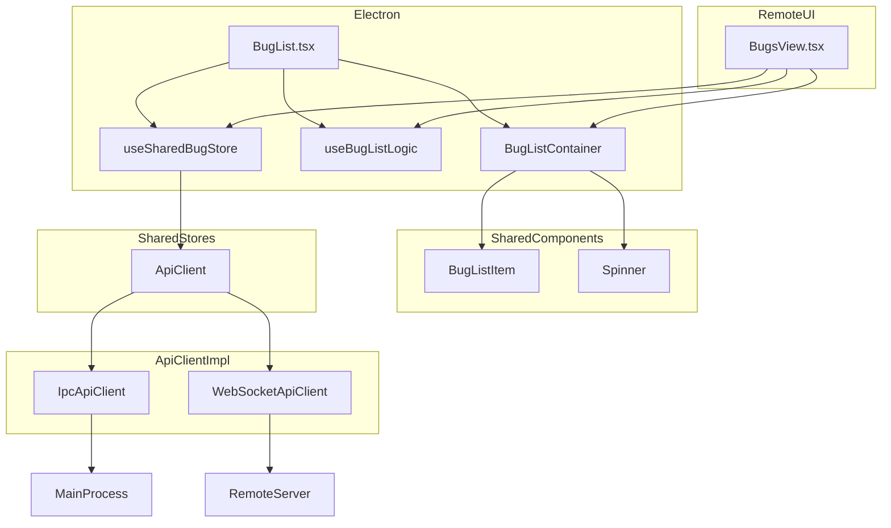
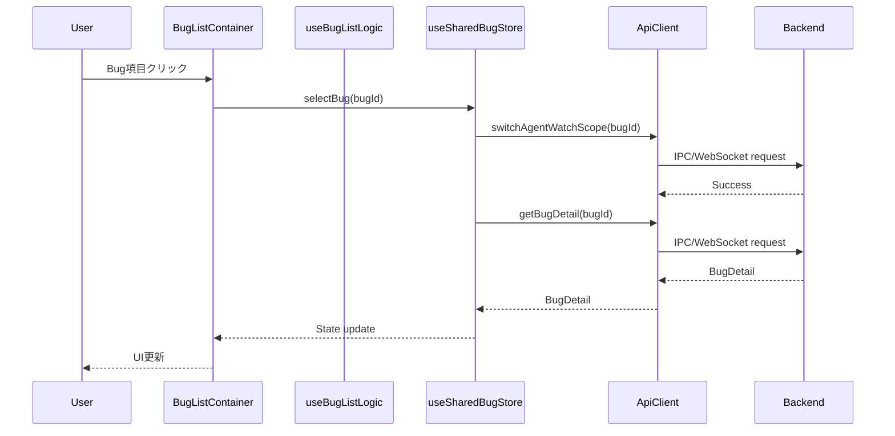
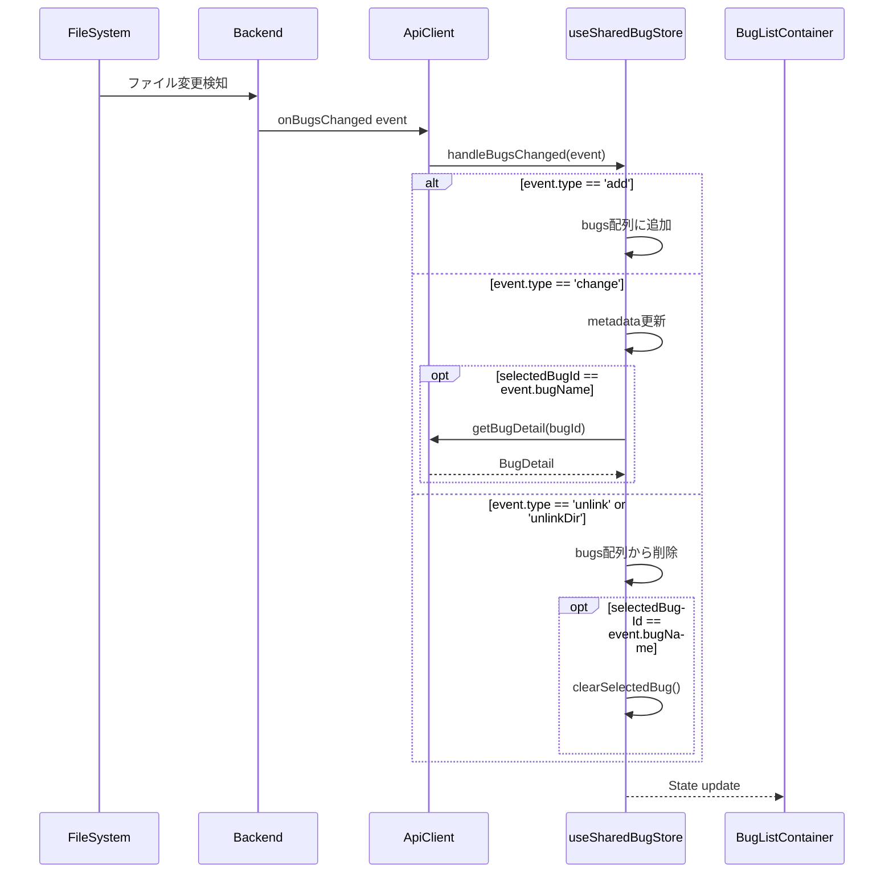

# Design: BugsView共通化

## Overview

**Purpose**: この機能は、Remote UI版のBugsViewとElectron版のBugListを共通化し、UIコンポーネント層、ロジック層、状態管理層の3層すべてを統一することで、両環境で同一の機能・UXを提供する。

**Users**: 開発者がBug一覧の表示・操作を行う際に、Electron版とRemote UI版で一貫したエクスペリエンスを得られる。

**Impact**: 現在分散している2つの実装（BugList.tsx、BugsView.tsx）と2つのbugStore（renderer/stores/bugStore.ts、shared/stores/bugStore.ts）を統一し、SSOTを実現する。

### Goals

- BugListContainerコンポーネントによるUI層の共通化
- useBugListLogicフックによるフィルタリング・ソートロジックの共通化
- useSharedBugStoreの拡張による状態管理の統一
- ApiClient抽象化の拡張によるIPC/WebSocket通信の透過化
- renderer/bugStoreの廃止によるSSoT実現

### Non-Goals

- BugDetailViewの共通化（別スペックで対応）
- Bug作成ダイアログのさらなる共通化（bug-create-dialog-unificationで完了済み）
- specStoreの統一（別の独立した課題）
- WebSocket APIでの差分更新イベントのネイティブサポート（イベント形式変換で対応）

## Architecture

### Existing Architecture Analysis

現在のバグ一覧実装は以下のように分散している。

**Electron版**:
- `renderer/components/BugList.tsx`: UI実装、renderer/bugStoreを使用
- `renderer/stores/bugStore.ts`: IPC経由でMainプロセスと通信、差分更新対応
- `renderer/stores/agentStore.ts`: Agent一覧管理、runningAgentCount取得

**Remote UI版**:
- `remote-ui/views/BugsView.tsx`: UI実装、ローカルstateとApiClient直接使用
- `shared/stores/bugStore.ts`: 基本的なbug一覧管理のみ、差分更新非対応

**機能差分**:
| 機能 | Electron版 | Remote UI版 |
|------|------------|-------------|
| Phaseフィルター | あり | なし |
| テキスト検索 | なし | あり |
| Agent数表示 | あり | なし |
| 差分更新 | あり | なし（全件更新） |
| Worktree表示 | あり | あり |

### Architecture Pattern & Boundary Map



**Architecture Integration**:
- Selected pattern: Container/Logic Hook/Store分離パターン（SpecListContainerの成熟パターンに準拠）
- Domain boundaries: UI層（BugListContainer）、ロジック層（useBugListLogic）、状態管理層（useSharedBugStore）の3層分離
- Existing patterns preserved: SpecListContainer、useSpecListLogic、useSharedSpecStoreのパターンを踏襲
- New components rationale: BugListContainerはSpecListContainerと同様の責務分担を実現
- Steering compliance: DRY、SSOT、関心の分離原則に準拠

### Technology Stack

| Layer | Choice / Version | Role in Feature | Notes |
|-------|------------------|-----------------|-------|
| Frontend | React 19 + TypeScript 5.8+ | UIコンポーネント、カスタムフック | 既存スタックに準拠 |
| State Management | Zustand | 共有状態管理 | useSharedBugStore拡張 |
| Styling | Tailwind CSS 4 + clsx | UIスタイリング | 既存パターン継続 |
| Icons | Lucide React | アイコン表示 | 既存ライブラリ使用 |
| API Abstraction | ApiClient interface | IPC/WebSocket透過化 | 既存パターン拡張 |

## System Flows

### Bug選択フロー



### 差分更新フロー



## Requirements Traceability

| Criterion ID | Summary | Components | Implementation Approach |
|--------------|---------|------------|------------------------|
| 1.1 | BugListItem使用リスト表示 | BugListContainer, BugListItem | 既存BugListItem再利用 |
| 1.2 | ローディング表示 | BugListContainer | Spinnerコンポーネント使用 |
| 1.3 | エラー表示 | BugListContainer | 新規実装 |
| 1.4 | 空状態表示 | BugListContainer | 新規実装 |
| 1.5 | Phaseフィルター | BugListContainer | 新規実装（SpecListContainerパターン準拠） |
| 1.6 | テキスト検索 | BugListContainer | 新規実装（SpecListContainerパターン準拠） |
| 1.7 | Bug選択コールバック | BugListContainer | props経由 |
| 1.8 | Agent数表示 | BugListContainer, BugListItem | getRunningAgentCount prop |
| 1.9 | レスポンシブ対応 | BugListContainer | deviceType prop |
| 2.1 | updatedAtソート | useBugListLogic | 新規実装 |
| 2.2 | テキスト検索フィルター | useBugListLogic | 新規実装 |
| 2.3 | Phaseフィルター | useBugListLogic | 新規実装 |
| 2.4 | allフィルター | useBugListLogic | 新規実装 |
| 2.5 | フィルター状態setter | useBugListLogic | 新規実装 |
| 2.6 | filteredBugs返却 | useBugListLogic | 新規実装 |
| 3.1 | bugDetail状態管理 | useSharedBugStore | 既存拡張 |
| 3.2 | selectBug詳細取得 | useSharedBugStore | 既存拡張 |
| 3.3 | handleBugsChanged差分更新 | useSharedBugStore | 既存拡張 |
| 3.4 | add イベント処理 | useSharedBugStore | 新規実装 |
| 3.5 | change イベント処理 | useSharedBugStore | 新規実装 |
| 3.6 | unlink/unlinkDir イベント処理 | useSharedBugStore | 新規実装 |
| 3.7 | startWatching/stopWatching | useSharedBugStore | 新規実装 |
| 3.8 | switchAgentWatchScope呼び出し | useSharedBugStore | 新規実装 |
| 4.1 | switchAgentWatchScopeメソッド | ApiClient, IpcApiClient, WebSocketApiClient | 新規実装 |
| 4.2 | startBugsWatcherメソッド | ApiClient, IpcApiClient, WebSocketApiClient | 新規実装 |
| 4.3 | stopBugsWatcherメソッド | ApiClient, IpcApiClient, WebSocketApiClient | 新規実装 |
| 4.4 | onBugsChangedメソッド | ApiClient, IpcApiClient, WebSocketApiClient | IpcApiClient拡張、WebSocketApiClient拡張 |
| 4.5 | IpcApiClient委譲 | IpcApiClient | window.electronAPI委譲 |
| 4.6 | WebSocketApiClient委譲 | WebSocketApiClient | WebSocket message handler委譲 |
| 4.7 | イベント形式正規化 | IpcApiClient, WebSocketApiClient | BugsChangeEvent形式統一 |
| 5.1 | BugListContainer内部使用 | BugList | 既存コンポーネント改修 |
| 5.2 | useSharedBugStore使用 | BugList | 既存stores/bugStoreから移行 |
| 5.3 | getRunningAgentCount連携 | BugList | useAgentStore連携維持 |
| 5.4 | 選択時store・watchScope更新 | BugList | 既存動作維持 |
| 5.5 | 後方互換性維持 | BugList | 既存usage pattern維持 |
| 6.1 | BugListContainer内部使用 | BugsView | 既存コンポーネント改修 |
| 6.2 | useSharedBugStore使用 | BugsView | ローカルstate削除 |
| 6.3 | Phaseフィルター追加 | BugsView | 新機能追加 |
| 6.4 | Agent数表示追加 | BugsView | 新機能追加 |
| 6.5 | レスポンシブ維持 | BugsView | 既存機能維持 |
| 6.6 | CreateBugDialog連携維持 | BugsView | 既存機能維持 |
| 7.1 | renderer/bugStoreインポート削除 | 全参照ファイル | grep & replace |
| 7.2 | bugStoreファイル削除 | renderer/stores/bugStore.ts | ファイル削除 |
| 7.3 | useSharedBugStore参照更新 | 全参照ファイル | インポートパス変更 |
| 7.4 | 既存機能維持 | 全コンポーネント | 回帰テスト |

### Coverage Validation Checklist

- [x] Every criterion ID from requirements.md appears in the table above
- [x] Each criterion has specific component names (not generic references)
- [x] Implementation approach distinguishes "reuse existing" vs "new implementation"
- [x] User-facing criteria specify concrete UI components (not just "shared components")

## Components and Interfaces

| Component | Domain/Layer | Intent | Req Coverage | Key Dependencies | Contracts |
|-----------|--------------|--------|--------------|------------------|-----------|
| BugListContainer | shared/components/bug | Bug一覧のUI表示 | 1.1-1.9 | BugListItem (P0), Spinner (P1) | Props |
| useBugListLogic | shared/hooks | フィルタリング・ソートロジック | 2.1-2.6 | None | Hook Return |
| useSharedBugStore | shared/stores | Bug状態管理 | 3.1-3.8 | ApiClient (P0) | State/Actions |
| ApiClient (拡張) | shared/api | 通信抽象化 | 4.1-4.7 | None | Interface |
| IpcApiClient (拡張) | shared/api | Electron IPC実装 | 4.5, 4.7 | window.electronAPI (P0) | Implementation |
| WebSocketApiClient (拡張) | shared/api | WebSocket実装 | 4.6, 4.7 | WebSocket (P0) | Implementation |
| BugList (改修) | renderer/components | Electron版Bug一覧 | 5.1-5.5 | BugListContainer (P0), useSharedBugStore (P0), useAgentStore (P1) | Component |
| BugsView (改修) | remote-ui/views | Remote UI版Bug一覧 | 6.1-6.6 | BugListContainer (P0), useSharedBugStore (P0), ApiClient (P0) | Component |

### Shared Components Layer

#### BugListContainer

| Field | Detail |
|-------|--------|
| Intent | Bug一覧のUI表示を両環境で共有可能な形で提供 |
| Requirements | 1.1, 1.2, 1.3, 1.4, 1.5, 1.6, 1.7, 1.8, 1.9 |

**Responsibilities & Constraints**
- Bug一覧のリスト表示、ローディング・エラー・空状態の表示
- Phaseフィルターとテキスト検索UIの提供
- ロジック層（useBugListLogic）との疎結合
- SpecListContainerと同様のProps設計パターン準拠

**Dependencies**
- Inbound: BugList, BugsView - 共通UI利用 (P0)
- Outbound: BugListItem - リスト項目表示 (P0)
- Outbound: Spinner - ローディング表示 (P1)

**Contracts**: State [ ]

##### Props Interface

```typescript
/**
 * BugPhaseフィルターオプション
 */
export type BugPhaseFilter = 'all' | 'reported' | 'analyzed' | 'fixed' | 'verified' | 'deployed';

/**
 * Bug一覧フィルターオプション定数
 */
export const BUG_PHASE_FILTER_OPTIONS: { value: BugPhaseFilter; label: string }[] = [
  { value: 'all', label: 'すべて' },
  { value: 'reported', label: '報告済' },
  { value: 'analyzed', label: '分析済' },
  { value: 'fixed', label: '修正済' },
  { value: 'verified', label: '検証済' },
  { value: 'deployed', label: 'デプロイ完了' },
];

export interface BugListContainerProps {
  /** ソート・フィルター済みのBug一覧 */
  bugs: BugMetadata[];
  /** 選択中のBug名 */
  selectedBugName?: string | null;
  /** Bug選択時のコールバック */
  onSelectBug: (bug: BugMetadata) => void;
  /** ローディング状態 */
  isLoading: boolean;
  /** エラーメッセージ */
  error?: string | null;

  // Filter Controls
  /** Phaseフィルター表示（デフォルト: false） */
  showPhaseFilter?: boolean;
  /** 現在のPhaseフィルター値 */
  phaseFilter?: BugPhaseFilter;
  /** Phaseフィルター変更ハンドラ */
  onPhaseFilterChange?: (filter: BugPhaseFilter) => void;

  // Search Controls
  /** テキスト検索表示（デフォルト: false） */
  showSearch?: boolean;
  /** 現在の検索クエリ */
  searchQuery?: string;
  /** 検索クエリ変更ハンドラ */
  onSearchChange?: (query: string) => void;

  // Optional feature props
  /** Bug毎の実行中Agent数取得関数 */
  getRunningAgentCount?: (bugName: string) => number;
  /** デバイスタイプ（レスポンシブ対応） */
  deviceType?: 'desktop' | 'smartphone';

  /** 追加CSSクラス */
  className?: string;
  /** テストID接頭辞 */
  testIdPrefix?: string;
}
```

**Implementation Notes**
- Integration: SpecListContainerと同様の構造・スタイリングを使用
- Validation: bugs配列、コールバック関数の存在チェック
- Risks: なし（既存パターンの適用）

### Shared Hooks Layer

#### useBugListLogic

| Field | Detail |
|-------|--------|
| Intent | Bug一覧のフィルタリング・ソートロジックを共有 |
| Requirements | 2.1, 2.2, 2.3, 2.4, 2.5, 2.6 |

**Responsibilities & Constraints**
- updatedAt降順ソート
- Phase別フィルタリング
- テキスト検索（名前部分一致）
- フィルター状態の管理

**Dependencies**
- Inbound: BugList, BugsView - ロジック利用 (P0)
- External: None

**Contracts**: State [ ]

##### Hook Interface

```typescript
export interface UseBugListLogicOptions {
  /** Bug一覧 */
  bugs: readonly BugMetadata[];
  /** 初期Phaseフィルター（デフォルト: 'all'） */
  initialPhaseFilter?: BugPhaseFilter;
  /** テキスト検索有効化（デフォルト: false） */
  enableTextSearch?: boolean;
}

export interface UseBugListLogicResult {
  /** フィルター・ソート済みBug一覧 */
  filteredBugs: BugMetadata[];
  /** 現在のPhaseフィルター */
  phaseFilter: BugPhaseFilter;
  /** 現在の検索クエリ（enableTextSearch時のみ有効） */
  searchQuery: string;
  /** Phaseフィルター設定 */
  setPhaseFilter: (filter: BugPhaseFilter) => void;
  /** 検索クエリ設定（enableTextSearch時のみ有効） */
  setSearchQuery: (query: string) => void;
}

export function useBugListLogic(options: UseBugListLogicOptions): UseBugListLogicResult;
```

**Implementation Notes**
- Integration: useSpecListLogicと同様のパターンを使用
- Validation: bugs配列の型安全性確保
- Risks: なし（純粋なロジックフック）

### Shared Stores Layer

#### useSharedBugStore (拡張)

| Field | Detail |
|-------|--------|
| Intent | Bug状態管理を両環境で統一 |
| Requirements | 3.1, 3.2, 3.3, 3.4, 3.5, 3.6, 3.7, 3.8 |

**Responsibilities & Constraints**
- Bug一覧、選択中Bug、bugDetailの状態管理
- ApiClient経由でのデータ取得
- 差分更新（handleBugsChanged）
- ファイル監視の開始/停止

**Dependencies**
- Inbound: BugList, BugsView - 状態利用 (P0)
- Outbound: ApiClient - データ取得 (P0)

**Contracts**: State [x]

##### State Interface (拡張)

```typescript
export interface SharedBugState {
  /** Bug一覧 */
  bugs: BugMetadata[];
  /** 選択中のBug ID（名前） */
  selectedBugId: string | null;
  /** 選択中Bugの詳細 */
  bugDetail: BugDetail | null;
  /** 読み込み中フラグ */
  isLoading: boolean;
  /** エラーメッセージ */
  error: string | null;
  /** Worktreeモードフラグ */
  useWorktree: boolean;
  /** Bug作成中フラグ */
  isCreating: boolean;
  /** ファイル監視中フラグ */
  isWatching: boolean;
}

export interface SharedBugActions {
  /** ApiClient経由でbugsを読み込む */
  loadBugs: (apiClient: ApiClient) => Promise<void>;
  /** Bugを選択し詳細を取得する */
  selectBug: (apiClient: ApiClient, bugId: string | null) => Promise<void>;
  /** IDでBugを取得する */
  getBugById: (bugId: string) => BugMetadata | undefined;
  /** Bugs配列を更新する（イベント購読用） */
  updateBugs: (bugs: BugMetadata[]) => void;
  /** エラーをクリアする */
  clearError: () => void;
  /** Worktreeモード設定を更新 */
  setUseWorktree: (useWorktree: boolean) => void;
  /** ApiClient経由でBugを作成 */
  createBug: (apiClient: ApiClient, name: string, description: string) => Promise<boolean>;
  /** ファイル監視を開始する */
  startWatching: (apiClient: ApiClient) => void;
  /** ファイル監視を停止する */
  stopWatching: (apiClient: ApiClient) => void;
  /** Bug変更イベントを処理する（差分更新） */
  handleBugsChanged: (apiClient: ApiClient, event: BugsChangeEvent) => Promise<void>;
  /** 選択中Bugの詳細を再取得する */
  refreshBugDetail: (apiClient: ApiClient) => Promise<void>;
  /** 選択解除 */
  clearSelectedBug: () => void;
}

export type SharedBugStore = SharedBugState & SharedBugActions;
```

**Implementation Notes**
- Integration: renderer/bugStoreのhandleBugsChangedロジックを移植
- Validation: ApiClient存在チェック、bugId存在チェック
- Risks: 移行時の既存機能回帰（テストで担保）

### API Abstraction Layer

#### ApiClient Interface (拡張)

| Field | Detail |
|-------|--------|
| Intent | Bug監視関連APIの抽象化 |
| Requirements | 4.1, 4.2, 4.3, 4.4 |

**Responsibilities & Constraints**
- switchAgentWatchScope: Agent監視スコープ切り替え
- startBugsWatcher: Bug監視開始
- stopBugsWatcher: Bug監視停止
- onBugsChanged: Bug変更イベント購読

**Contracts**: API [x]

##### Interface Extension

```typescript
/**
 * Bug変更イベント型
 */
export interface BugsChangeEvent {
  type: 'add' | 'addDir' | 'change' | 'unlink' | 'unlinkDir';
  bugName: string | null;
  path?: string;
}

// ApiClient interface extension
export interface ApiClient {
  // ... existing methods ...

  /**
   * Agent監視スコープを切り替える
   * @param specId - Spec ID（bug:{name}形式）
   */
  switchAgentWatchScope(specId: string): Promise<Result<void, ApiError>>;

  /**
   * Bug監視を開始する
   */
  startBugsWatcher(): Promise<Result<void, ApiError>>;

  /**
   * Bug監視を停止する
   */
  stopBugsWatcher(): Promise<Result<void, ApiError>>;

  /**
   * Bug変更イベントを購読する
   * @param listener - イベントリスナー
   * @returns 購読解除関数
   */
  onBugsChanged(listener: (event: BugsChangeEvent) => void): () => void;
}
```

**Implementation Notes**
- Integration: IpcApiClientはwindow.electronAPI委譲、WebSocketApiClientはイベント変換
- Validation: specId形式チェック
- Risks: WebSocket側でのイベント形式差異（正規化で対応）

### Platform Components Layer

#### BugList (改修)

| Field | Detail |
|-------|--------|
| Intent | Electron版Bug一覧をBugListContainer使用に移行 |
| Requirements | 5.1, 5.2, 5.3, 5.4, 5.5 |

**Responsibilities & Constraints**
- BugListContainerを内部で使用
- useSharedBugStoreから状態取得
- useAgentStoreからAgent数取得
- 後方互換性維持

**Dependencies**
- Outbound: BugListContainer - UI表示 (P0)
- Outbound: useSharedBugStore - 状態管理 (P0)
- Outbound: useAgentStore - Agent数取得 (P1)

**Implementation Notes**
- Integration: 既存のuseBugStoreインポートをuseSharedBugStoreに変更
- Validation: 既存のusage patternが維持されることをテストで確認
- Risks: 移行時の回帰（E2Eテストで担保）

#### BugsView (改修)

| Field | Detail |
|-------|--------|
| Intent | Remote UI版Bug一覧をBugListContainer使用に移行 |
| Requirements | 6.1, 6.2, 6.3, 6.4, 6.5, 6.6 |

**Responsibilities & Constraints**
- BugListContainerを内部で使用
- useSharedBugStoreから状態取得
- Phaseフィルター機能追加（新機能）
- Agent数表示追加（新機能）
- レスポンシブ対応維持

**Dependencies**
- Outbound: BugListContainer - UI表示 (P0)
- Outbound: useSharedBugStore - 状態管理 (P0)
- Outbound: ApiClient - API通信 (P0)

**Implementation Notes**
- Integration: ローカルstateをuseSharedBugStoreに移行
- Validation: 既存のテキスト検索機能維持
- Risks: Phaseフィルター追加によるUI変更（E2Eテストで担保）

## Data Models

### Domain Model

本機能は既存のBugMetadata、BugDetail型を使用する。新規のドメインモデルは追加しない。

**既存型の使用**:
- `BugMetadata`: Bug一覧表示用メタデータ
- `BugDetail`: Bug詳細情報
- `BugsChangeEvent`: ファイル変更イベント

### Data Contracts & Integration

**イベント形式の正規化**:

IPC側（Electron）のBugsChangeEventはそのまま使用。WebSocket側では全件更新形式（BugMetadata[]）を受信し、差分検出してBugsChangeEvent形式に変換する。

```typescript
// WebSocket → BugsChangeEvent変換ロジック（useSharedBugStore内）
function detectBugsChanges(
  previousBugs: BugMetadata[],
  currentBugs: BugMetadata[]
): BugsChangeEvent[] {
  const events: BugsChangeEvent[] = [];
  const prevMap = new Map(previousBugs.map(b => [b.name, b]));
  const currMap = new Map(currentBugs.map(b => [b.name, b]));

  // 追加・変更検出
  for (const [name, bug] of currMap) {
    const prev = prevMap.get(name);
    if (!prev) {
      events.push({ type: 'add', bugName: name });
    } else if (prev.updatedAt !== bug.updatedAt || prev.phase !== bug.phase) {
      events.push({ type: 'change', bugName: name });
    }
  }

  // 削除検出
  for (const [name] of prevMap) {
    if (!currMap.has(name)) {
      events.push({ type: 'unlinkDir', bugName: name });
    }
  }

  return events;
}
```

## Error Handling

### Error Strategy

| エラー種別 | 発生箇所 | 対処 |
|-----------|----------|------|
| API通信エラー | loadBugs, selectBug | error stateに設定、UIでエラー表示 |
| Bug未選択 | selectBug | 無視（nullを許容） |
| Bug削除済み | handleBugsChanged | 選択解除、一覧から削除 |
| 監視開始失敗 | startWatching | console.error、isWatching=false維持 |

### Error Categories and Responses

**User Errors**: Bug選択時の該当Bug不在 → 空状態表示
**System Errors**: API通信失敗 → エラーメッセージ表示、リトライ可能
**Business Logic Errors**: なし（本機能は表示のみ）

## Testing Strategy

### Unit Tests

1. **useBugListLogic**: フィルタリング・ソートロジックの正確性
   - updatedAt降順ソート
   - Phase別フィルター
   - テキスト検索（部分一致）
   - フィルター組み合わせ

2. **useSharedBugStore**: 状態管理の正確性
   - loadBugs: 正常系・エラー系
   - selectBug: 詳細取得・switchAgentWatchScope呼び出し
   - handleBugsChanged: add/change/unlink/unlinkDir各イベント

3. **BugListContainer**: UI表示の正確性
   - ローディング・エラー・空状態表示
   - フィルター・検索UI表示/非表示
   - Bug項目選択コールバック

### Integration Tests

1. **BugList + useSharedBugStore**: Electron版統合
   - Bug選択 → 詳細取得 → UI更新
   - Agent数表示連携

2. **BugsView + useSharedBugStore**: Remote UI版統合
   - Bug選択 → 詳細取得 → UI更新
   - Phaseフィルター → 一覧更新

3. **useSharedBugStore + ApiClient**: API連携
   - IpcApiClient経由のデータ取得
   - WebSocketApiClient経由のデータ取得

### E2E Tests

1. **Electron版**: 既存E2Eテストの回帰確認
   - Bug一覧表示
   - Bug選択
   - Phaseフィルター

2. **Remote UI版**: 新機能E2Eテスト
   - Bug一覧表示
   - テキスト検索
   - Phaseフィルター（新機能）
   - Agent数表示（新機能）

## Design Decisions

### DD-001: Container/Logic Hook/Store分離パターンの採用

| Field | Detail |
|-------|--------|
| Status | Accepted |
| Context | BugList/BugsViewの共通化において、どの粒度で共通化するか |
| Decision | SpecListContainerパターンに従い、UI層（Container）、ロジック層（Hook）、状態管理層（Store）の3層すべてを共通化 |
| Rationale | SpecListContainerの成熟したパターンを踏襲することで、設計の一貫性と保守性を確保。UIのみの共通化では重複コードが残る |
| Alternatives Considered | (1) UIコンポーネントのみ共通化、(2) UI+ロジックのみ共通化 |
| Consequences | 実装工数は増加するが、長期的な保守コストは削減。両環境で完全に同一のUXを提供可能 |

### DD-002: WebSocket差分更新のクライアント側変換

| Field | Detail |
|-------|--------|
| Status | Accepted |
| Context | WebSocket APIはBugMetadata[]の全件更新形式、IPC側はBugsChangeEventの差分更新形式。どちらに統一するか |
| Decision | クライアント側（useSharedBugStore）でWebSocket受信データを差分検出し、BugsChangeEvent形式に変換 |
| Rationale | サーバー側（WebSocket API）の変更は影響範囲が大きく、クライアント側での変換は局所的な変更で済む。将来的にWebSocket側で差分更新をサポートする場合も、クライアント側の変換ロジックを削除するだけで対応可能 |
| Alternatives Considered | (1) WebSocket APIで差分更新イベント形式をサポート、(2) IPC側も全件更新形式に統一 |
| Consequences | クライアント側で差分検出の計算コストが発生するが、通常のBug数（数十件程度）では無視できるレベル |

### DD-003: renderer/bugStoreの完全廃止

| Field | Detail |
|-------|--------|
| Status | Accepted |
| Context | renderer/bugStoreとshared/bugStoreの2つが存在し、SSOT違反。どちらに統一するか |
| Decision | shared/bugStoreに機能を集約し、renderer/bugStoreを完全廃止 |
| Rationale | SSOT原則に従い、状態管理は1箇所に集約すべき。shared/bugStoreはApiClient抽象化により両環境で使用可能 |
| Alternatives Considered | (1) 両方維持してUI層のみ共通化、(2) renderer/bugStoreに統一（Remote UIではApiClient経由で呼び出し） |
| Consequences | 移行作業が発生するが、長期的な保守性は向上。renderer/bugStoreの参照箇所すべてを更新する必要がある |

### DD-004: Remote UIでのPhaseフィルター・Agent数表示の追加

| Field | Detail |
|-------|--------|
| Status | Accepted |
| Context | 現在Remote UIにはPhaseフィルターとAgent数表示がない。共通化時に機能差を維持するか統一するか |
| Decision | 全機能を両環境で使用可能にする（Phaseフィルター、Agent数表示をRemote UIに追加） |
| Rationale | 共通化の目的は一貫したUXの提供。機能差を維持すると共通化の効果が半減し、ユーザー体験も不統一になる |
| Alternatives Considered | (1) 現状の機能差を維持、(2) Electron版の機能をRemote UIに合わせて削減 |
| Consequences | Remote UI側でsharedAgentStoreとの連携が必要。UI表示面積が若干増加 |

## Integration & Deprecation Strategy

### 修正が必要な既存ファイル（Wiring Points）

| ファイル | 修正内容 |
|----------|----------|
| `src/shared/api/types.ts` | ApiClient interface拡張（switchAgentWatchScope, startBugsWatcher, stopBugsWatcher, onBugsChanged追加） |
| `src/shared/api/IpcApiClient.ts` | 新規メソッドの実装追加 |
| `src/shared/api/WebSocketApiClient.ts` | 新規メソッドの実装追加、イベントハンドリング追加 |
| `src/shared/stores/bugStore.ts` | State/Actions拡張（bugDetail, handleBugsChanged, startWatching, stopWatching等追加） |
| `src/shared/stores/index.ts` | エクスポート確認 |
| `src/renderer/components/BugList.tsx` | BugListContainer使用に改修、useSharedBugStoreへ移行 |
| `src/remote-ui/views/BugsView.tsx` | BugListContainer使用に改修、useSharedBugStoreへ移行、Phaseフィルター追加 |
| `src/renderer/App.tsx` | bugStore参照の確認・更新 |
| `src/renderer/components/BugPane.tsx` | bugStore参照の確認・更新 |
| `src/renderer/components/BugWorkflowView.tsx` | bugStore参照の確認・更新 |
| `src/renderer/components/CreateBugDialog.tsx` | bugStore参照の確認・更新 |
| `src/renderer/stores/index.ts` | bugStoreエクスポート削除 |
| `src/renderer/stores/projectStore.ts` | bugStore参照の確認・更新 |

### 削除が必要な既存ファイル（Cleanup）

| ファイル | 削除理由 |
|----------|----------|
| `src/renderer/stores/bugStore.ts` | useSharedBugStoreに統合 |
| `src/renderer/stores/bugStore.test.ts` | 対応するテストファイル |

### 新規作成ファイル

| ファイル | 内容 |
|----------|------|
| `src/shared/components/bug/BugListContainer.tsx` | 共通Bug一覧コンテナ |
| `src/shared/hooks/useBugListLogic.ts` | フィルタリング・ソートロジックフック |
| `src/shared/components/bug/BugListContainer.test.tsx` | コンテナテスト |
| `src/shared/hooks/useBugListLogic.test.ts` | フックテスト |
| `src/shared/stores/bugStore.test.ts` | 拡張部分のテスト追加 |
