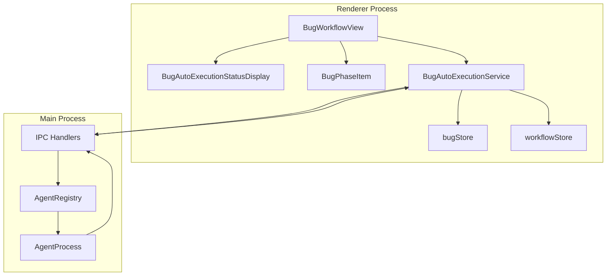
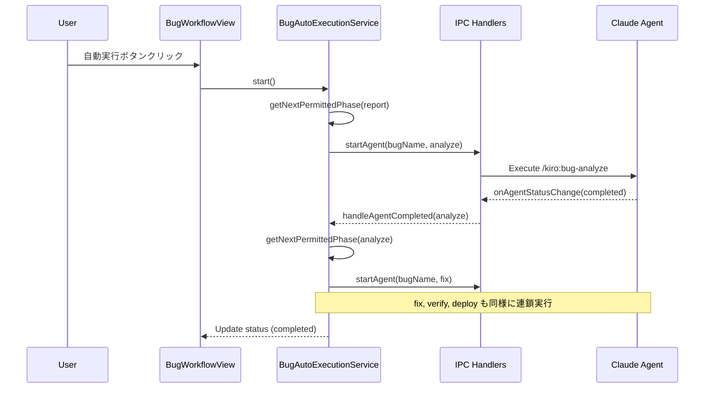
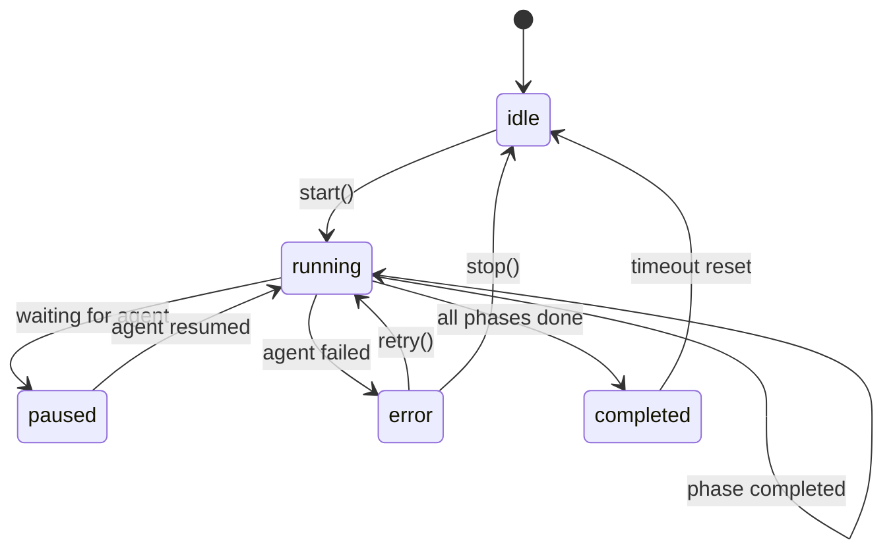

# Technical Design Document

## Overview

**Purpose**: 本機能は、SDD OrchestratorのBugsワークフローに自動実行機能を追加し、バグ修正プロセスの効率化を実現する。

**Users**: 開発者はワンクリックでBugsワークフロー（analyze → fix → verify → deploy）を連続実行でき、手動での繰り返し操作を削減できる。

**Impact**: 既存のBugWorkflowViewコンポーネントに自動実行機能を追加し、Specワークフローと一貫したUI/UX体験を提供する。

### Goals
- Bugsワークフローでワンクリック自動実行を実現
- Specワークフローと一貫したUI/UX体験の提供
- フェーズ許可設定によるきめ細かな実行制御
- エラー発生時の適切なハンドリングと再実行機能

### Non-Goals
- Specワークフローの自動実行機能の変更
- Bug作成（report）フェーズの自動化
- バグ修正内容の自動検証ロジック

## Architecture

### Existing Architecture Analysis

現在のBugワークフローは以下の特徴を持つ:
- **BugWorkflowView**: 5フェーズ（report → analyze → fix → verify → deploy）を表示
- **BugPhaseItem**: 各フェーズの状態と実行ボタンを表示
- **bugStore**: Bug一覧と詳細状態を管理（Zustand）
- **状態判定**: bug.jsonは存在せず、ファイル存在ベースでフェーズステータスを判定

既存のSpec自動実行機能との統合ポイント:
- **AutoExecutionService**: IPC監視、タイムアウト管理、エラーハンドリングのパターンを参考
- **AutoExecutionStatusDisplay**: Props駆動設計で再利用可能
- **workflowStore**: 自動実行設定の永続化パターンを参考

### Architecture Pattern & Boundary Map



**Architecture Integration**:
- **Selected pattern**: サービスレイヤーパターン（BugAutoExecutionService）
- **Domain/feature boundaries**: Bug自動実行はSpec自動実行と独立して管理
- **Existing patterns preserved**: IPC通信パターン、Zustandストアパターン
- **New components rationale**: BugAutoExecutionServiceでBug固有のワークフロー制御を分離

### Technology Stack

| Layer | Choice / Version | Role in Feature | Notes |
|-------|------------------|-----------------|-------|
| Frontend | React 19 | UI コンポーネント | 既存スタック維持 |
| State | Zustand | 自動実行設定管理 | workflowStoreを拡張 |
| Runtime | Electron 35 | IPC通信 | 既存パターン活用 |

## System Flows

### 自動実行フロー



### エラーハンドリングフロー



## Requirements Traceability

| Requirement | Summary | Components | Interfaces | Flows |
|-------------|---------|------------|------------|-------|
| 1.1 | 自動実行ボタンクリックで連続実行開始 | BugWorkflowView | BugAutoExecutionService.start() | 自動実行フロー |
| 1.2 | reportフェーズ完了済みからanalyze開始 | BugAutoExecutionService | getLastCompletedPhase() | 自動実行フロー |
| 1.3 | 自動実行中は停止ボタン表示 | BugWorkflowView | BugAutoExecutionButtonProps | - |
| 1.4 | 停止ボタンで現在のAgentを停止 | BugAutoExecutionService | stop() | - |
| 1.5 | 他エージェント実行中は自動実行ボタン無効 | BugWorkflowView | isAutoExecuteDisabled | - |
| 1.6 | ボタンは「自動実行」ラベルとアイコン表示 | BugWorkflowView | - | - |
| 2.1 | デフォルトでanalyze, fix, verify許可 | workflowStore | BugAutoExecutionPermissions | - |
| 2.2 | フェーズ許可設定変更で動作変更 | workflowStore | setBugAutoExecutionPermissions() | - |
| 2.3 | deploy許可時はverify後にdeploy実行 | BugAutoExecutionService | getNextPermittedPhase() | 自動実行フロー |
| 2.4 | 許可フェーズ完了で自動停止 | BugAutoExecutionService | completeAutoExecution() | 自動実行フロー |
| 2.5 | 次の許可フェーズがない場合表示 | BugAutoExecutionStatusDisplay | - | - |
| 3.1 | 実行中はフェーズ名とスピナー表示 | BugAutoExecutionStatusDisplay | status, currentPhase | - |
| 3.2 | 一時停止中は「Agent待機中」表示 | BugAutoExecutionStatusDisplay | status=paused | - |
| 3.3 | 完了時は「自動実行完了」表示 | BugAutoExecutionStatusDisplay | status=completed | - |
| 3.4 | エラー時はエラーメッセージとフェーズ名表示 | BugAutoExecutionStatusDisplay | lastFailedPhase | - |
| 3.5 | idle時は非表示 | BugAutoExecutionStatusDisplay | status=idle | - |
| 4.1 | analyze完了後fix許可時はfix開始 | BugAutoExecutionService | handleAgentCompleted() | 自動実行フロー |
| 4.2 | fix完了後verify許可時はverify開始 | BugAutoExecutionService | handleAgentCompleted() | 自動実行フロー |
| 4.3 | verify完了後deploy許可時はdeploy開始 | BugAutoExecutionService | handleAgentCompleted() | 自動実行フロー |
| 4.4 | フェーズエラー時は停止してエラー表示 | BugAutoExecutionService | handleAgentFailed() | エラーフロー |
| 4.5 | 次の許可フェーズがない場合は完了遷移 | BugAutoExecutionService | completeAutoExecution() | 自動実行フロー |
| 5.1 | エラー時は再実行ボタン提供 | BugAutoExecutionStatusDisplay | onRetry | - |
| 5.2 | 再実行で失敗フェーズから再開 | BugAutoExecutionService | retryFrom() | - |
| 5.3 | リトライ回数表示 | BugAutoExecutionStatusDisplay | retryCount | - |
| 5.4 | 3回連続エラーで停止と手動介入メッセージ | BugAutoExecutionService | MAX_RETRIES | - |
| 5.5 | エラー状態から停止でidle状態 | BugAutoExecutionService | stop() | エラーフロー |
| 6.1 | Specと同じボタンスタイル・レイアウト | BugWorkflowView | - | - |
| 6.2 | Specと同じ進捗表示デザイン | BugAutoExecutionStatusDisplay | - | - |
| 6.3 | 実行中フェーズ強調表示 | BugPhaseItem | isAutoExecutingPhase | - |
| 6.4 | 停止/再実行ボタンは同じアイコン・ラベル | BugAutoExecutionStatusDisplay | - | - |
| 6.5 | 自動実行中は手動実行ボタン無効 | BugPhaseItem | canExecute | - |
| 7.1 | フェーズ許可設定を永続化 | workflowStore | persist middleware | - |
| 7.2 | 再起動後に設定復元 | workflowStore | partialize | - |
| 7.3 | プロジェクトごとに保存 | workflowStore | storage key | - |
| 7.4 | 保存設定なしでデフォルト使用 | workflowStore | DEFAULT_BUG_AUTO_EXECUTION_PERMISSIONS | - |

## Components and Interfaces

| Component | Domain/Layer | Intent | Req Coverage | Key Dependencies | Contracts |
|-----------|--------------|--------|--------------|------------------|-----------|
| BugAutoExecutionService | Service | Bug自動実行制御 | 1.1-1.6, 4.1-4.5, 5.1-5.5 | bugStore (P0), IPC (P0), workflowStore (P1) | Service |
| BugAutoExecutionStatusDisplay | UI | 自動実行進捗表示 | 3.1-3.5, 5.1, 5.3, 6.2, 6.4 | None | Props |
| BugWorkflowView (拡張) | UI | ワークフロー表示と実行制御 | 1.1, 1.3, 1.5, 1.6, 6.1 | BugAutoExecutionService (P0), BugPhaseItem (P1) | Props |
| BugPhaseItem (拡張) | UI | フェーズ状態表示 | 6.3, 6.5 | None | Props |
| workflowStore (拡張) | State | 自動実行設定管理 | 2.1-2.4, 7.1-7.4 | localStorage (P1) | State |

### Service Layer

#### BugAutoExecutionService

| Field | Detail |
|-------|--------|
| Intent | Bugワークフローの自動実行制御を管理するシングルトンサービス |
| Requirements | 1.1, 1.2, 1.4, 4.1, 4.2, 4.3, 4.4, 4.5, 5.2, 5.4, 5.5 |

**Responsibilities & Constraints**
- IPC経由でAgentステータス変更を監視し、フェーズ完了時に次フェーズへ自動遷移
- フェーズ許可設定に基づいて実行対象フェーズを決定
- タイムアウト管理（デフォルト10分）
- エラー発生時のリトライ管理（最大3回）

**Dependencies**
- Inbound: BugWorkflowView — 自動実行開始/停止/リトライ呼び出し (P0)
- Outbound: bugStore — Bug詳細の取得 (P0)
- Outbound: workflowStore — 自動実行設定の取得 (P1)
- External: IPC (electronAPI) — Agent起動とステータス監視 (P0)

**Contracts**: Service [x] / API [ ] / Event [ ] / Batch [ ] / State [ ]

##### Service Interface
```typescript
interface BugAutoExecutionService {
  // 自動実行開始（現在のBug進捗から開始フェーズを決定）
  start(): boolean;

  // 自動実行停止
  stop(): Promise<void>;

  // 失敗フェーズから再実行
  retryFrom(phase: BugWorkflowPhase): boolean;

  // 現在の自動実行状態を取得
  getStatus(): BugAutoExecutionStatus;

  // 現在実行中のフェーズを取得
  getCurrentPhase(): BugWorkflowPhase | null;

  // サービス破棄（リソース解放）
  dispose(): void;
}
```

- Preconditions: start() — selectedBugが存在すること
- Postconditions: start() — 自動実行開始、stop() — idle状態に遷移
- Invariants: 同時に1つのBugのみ自動実行可能

**Implementation Notes**
- Integration: IPC onAgentStatusChange()でAgent完了を検知
- Validation: フェーズ実行前に前提条件（前フェーズ完了）をチェック
- Risks: Agent長時間実行時のタイムアウト対応

### UI Layer

#### BugAutoExecutionStatusDisplay

| Field | Detail |
|-------|--------|
| Intent | Bug自動実行の進捗状態を表示するプレゼンテーショナルコンポーネント |
| Requirements | 3.1, 3.2, 3.3, 3.4, 3.5, 5.1, 5.3, 6.2, 6.4 |

**Responsibilities & Constraints**
- 自動実行状態（running/paused/error/completed/idle）に応じた表示切り替え
- 現在実行中のフェーズ名とスピナー表示
- エラー時のエラーメッセージと再実行ボタン表示
- idle状態では非表示

**Dependencies**
- Inbound: BugWorkflowView — Props経由でstatus, currentPhase等を受け取る (P0)
- Outbound: None

**Contracts**: Service [ ] / API [ ] / Event [ ] / Batch [ ] / State [ ]

##### Props Interface
```typescript
interface BugAutoExecutionStatusDisplayProps {
  /** 自動実行状態 */
  status: BugAutoExecutionStatus;
  /** 現在実行中のフェーズ */
  currentPhase: BugWorkflowPhase | null;
  /** 最後に失敗したフェーズ */
  lastFailedPhase: BugWorkflowPhase | null;
  /** リトライ回数 */
  retryCount: number;
  /** 再実行ハンドラ */
  onRetry: () => void;
  /** 停止ハンドラ */
  onStop: () => void;
}
```

**Implementation Notes**
- Integration: 既存AutoExecutionStatusDisplayと同じデザインパターンを適用
- Validation: status=idleの場合はnullを返却
- Risks: なし

#### BugWorkflowView (拡張)

| Field | Detail |
|-------|--------|
| Intent | 自動実行ボタンと進捗表示を既存BugWorkflowViewに追加 |
| Requirements | 1.1, 1.3, 1.5, 1.6, 6.1 |

**Responsibilities & Constraints**
- 自動実行ボタンの表示と有効/無効制御
- 自動実行中は停止ボタンとして表示
- 他のエージェント実行中は自動実行ボタンを無効化
- BugAutoExecutionStatusDisplayの配置

**Dependencies**
- Inbound: BugPane — 親コンポーネントからの表示制御 (P1)
- Outbound: BugAutoExecutionService — 自動実行制御 (P0)
- Outbound: BugPhaseItem — フェーズ表示 (P1)
- Outbound: BugAutoExecutionStatusDisplay — 進捗表示 (P1)

**Contracts**: Service [ ] / API [ ] / Event [ ] / Batch [ ] / State [ ]

**Implementation Notes**
- Integration: 既存BugWorkflowViewに自動実行ボタンとステータス表示を追加
- Validation: selectedBugがnullの場合はプレースホルダー表示
- Risks: なし

#### BugPhaseItem (拡張)

| Field | Detail |
|-------|--------|
| Intent | 自動実行中のフェーズ強調表示と手動実行ボタン無効化を追加 |
| Requirements | 6.3, 6.5 |

**Responsibilities & Constraints**
- 自動実行中のフェーズをリング表示で強調
- 自動実行中は全フェーズの手動実行ボタンを無効化

**Dependencies**
- Inbound: BugWorkflowView — isAutoExecuting, isAutoExecutingPhase Props (P0)
- Outbound: None

**Contracts**: Service [ ] / API [ ] / Event [ ] / Batch [ ] / State [ ]

##### Props Interface (拡張)
```typescript
interface BugPhaseItemProps {
  phase: BugWorkflowPhase;
  label: string;
  status: BugPhaseStatus;
  canExecute: boolean;
  showExecuteButton: boolean;
  onExecute: () => void;
  /** 追加: 自動実行が進行中かどうか */
  isAutoExecuting?: boolean;
  /** 追加: このフェーズが自動実行中かどうか */
  isAutoExecutingPhase?: boolean;
}
```

**Implementation Notes**
- Integration: 既存BugPhaseItemにisAutoExecuting, isAutoExecutingPhase Propsを追加
- Validation: なし
- Risks: なし

### State Layer

#### workflowStore (拡張)

| Field | Detail |
|-------|--------|
| Intent | Bug自動実行許可設定の管理と永続化 |
| Requirements | 2.1, 2.2, 2.3, 2.4, 7.1, 7.2, 7.3, 7.4 |

**Responsibilities & Constraints**
- Bug用フェーズ許可設定（analyze, fix, verify, deploy）の管理
- localStorage への永続化（プロジェクト単位）
- デフォルト設定の提供（analyze, fix, verify許可、deploy無効）

**Dependencies**
- Inbound: BugAutoExecutionService — 許可設定の参照 (P0)
- Inbound: BugWorkflowView — 許可設定の変更 (P1)
- Outbound: localStorage — 永続化 (P1)

**Contracts**: Service [ ] / API [ ] / Event [ ] / Batch [ ] / State [x]

##### State Management
```typescript
// Bug自動実行許可設定
interface BugAutoExecutionPermissions {
  analyze: boolean;
  fix: boolean;
  verify: boolean;
  deploy: boolean;
}

// デフォルト設定
const DEFAULT_BUG_AUTO_EXECUTION_PERMISSIONS: BugAutoExecutionPermissions = {
  analyze: true,
  fix: true,
  verify: true,
  deploy: false,  // deployはデフォルト無効
};

// Bug自動実行状態
interface BugAutoExecutionState {
  isAutoExecuting: boolean;
  currentAutoPhase: BugWorkflowPhase | null;
  autoExecutionStatus: BugAutoExecutionStatus;
  lastFailedPhase: BugWorkflowPhase | null;
  failedRetryCount: number;
}
```

- State model: Zustand store with persist middleware
- Persistence & consistency: localStorage with project-scoped key
- Concurrency strategy: Single-thread (UI thread only)

**Implementation Notes**
- Integration: 既存workflowStoreにBug用設定を追加
- Validation: フェーズ名の型チェック
- Risks: プロジェクトパス変更時の設定リセット

## Data Models

### Domain Model

**BugAutoExecutionStatus（値オブジェクト）**
```typescript
type BugAutoExecutionStatus =
  | 'idle'       // 待機中
  | 'running'    // 実行中
  | 'paused'     // 一時停止（Agent待機中）
  | 'error'      // エラー停止
  | 'completed'; // 完了
```

**BugWorkflowPhase（値オブジェクト）**
- 既存の `BugWorkflowPhase` 型を使用: `'report' | 'analyze' | 'fix' | 'verify' | 'deploy'`

**Business Rules & Invariants**
- reportフェーズは自動実行対象外（手動作成）
- deployフェーズはデフォルト無効
- 前フェーズが完了していないと次フェーズは実行不可
- 同時に1つのBugのみ自動実行可能

**deployフェーズに関する注記**
- 現時点で `/kiro:bug-deploy` コマンドは未実装
- deployフェーズの自動実行は将来の拡張機能として設計に含めるが、初期実装ではスキップされる
- BugAutoExecutionService.getNextPermittedPhase()はdeployフェーズを許可設定に関わらずスキップする（コマンド実装まで）

## Error Handling

### Error Strategy

| Error Type | Condition | Response | Recovery |
|------------|-----------|----------|----------|
| Agent失敗 | Agent実行中にエラー発生 | error状態に遷移、エラーメッセージ表示 | 再実行ボタンで失敗フェーズから再開 |
| タイムアウト | 10分以上Agent応答なし | error状態に遷移、タイムアウトメッセージ表示 | 再実行ボタンで失敗フェーズから再開 |
| 最大リトライ超過 | 同一フェーズで3回連続失敗 | 自動実行停止、手動介入メッセージ表示 | 手動でフェーズを実行 |
| Bug未選択 | selectedBugがnull | start()がfalseを返却 | Bugを選択してから再試行 |

### Monitoring
- console.log でフェーズ遷移とエラーをログ出力
- 既存のnotify.error()でユーザーへエラー通知

## Testing Strategy

### Unit Tests
- BugAutoExecutionService.start() — 開始フェーズの決定ロジック
- BugAutoExecutionService.getNextPermittedPhase() — 次フェーズ取得ロジック
- BugAutoExecutionService.handleAgentCompleted() — フェーズ完了時の遷移
- workflowStore.toggleBugAutoPermission() — 許可設定のトグル
- BugAutoExecutionStatusDisplay — 各状態での表示切り替え

### Integration Tests
- 自動実行開始 → analyze完了 → fix開始の連鎖フロー
- エラー発生 → error状態遷移 → 再実行 → 継続のフロー
- フェーズ許可設定変更 → 動作反映のフロー

### E2E Tests
- 自動実行ボタンの表示確認
- 自動実行開始 → 停止ボタン表示確認
- Mock Claude CLIを使用した自動実行フロー全通テスト
- フェーズ許可設定UIの操作確認
