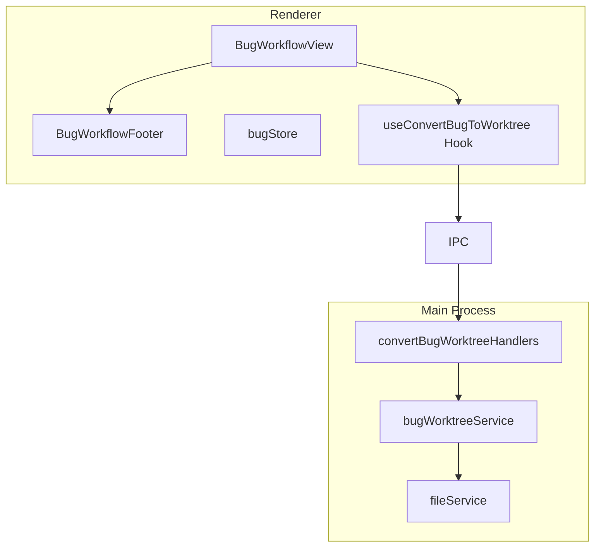
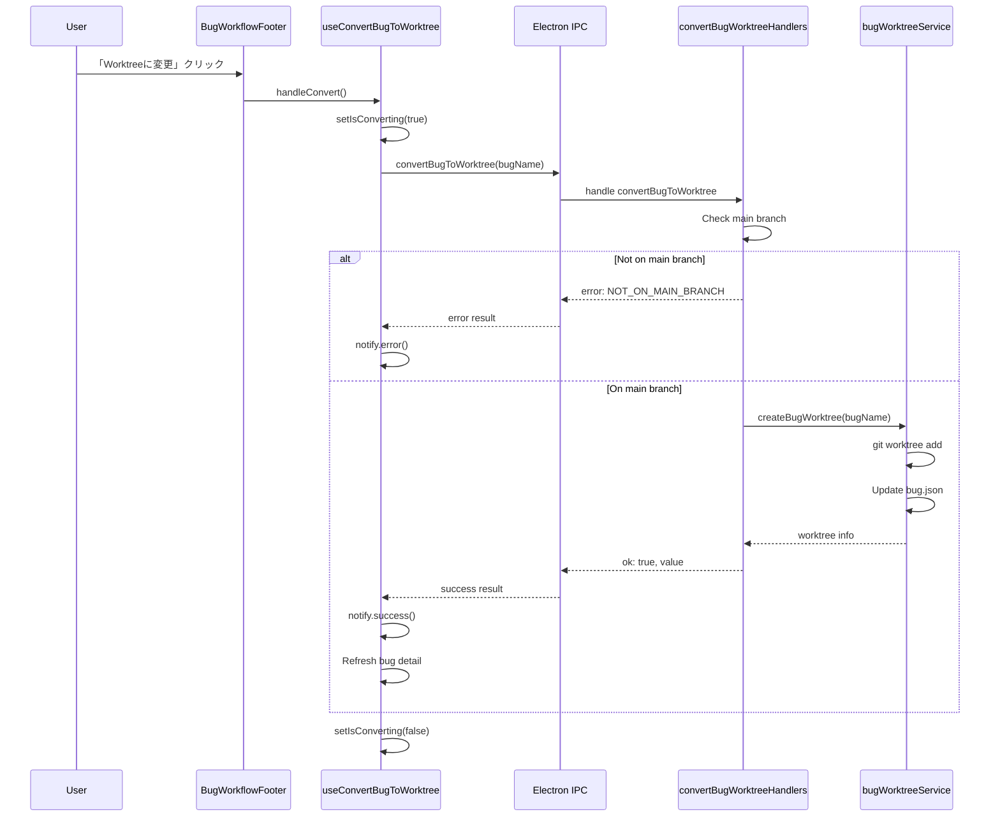

# Design: Bugs Workflow Footer

## Overview

**Purpose**: Bug ワークフロー画面にフッターエリア（BugWorkflowFooter）を追加し、自動実行ボタンと「Worktreeに変更」ボタンを配置する。これにより、Spec ワークフローとの UI 一貫性を保ち、Bug ワークフローでも worktree への事前変換を可能にする。

**Users**: 開発者が Bug ワークフロー画面でワークフロー全体の操作（自動実行、Worktree 変換）を行う。

**Impact**: 現在ヘッダーにある自動実行ボタンをフッターに移動し、worktree 使用を選択するチェックボックスを廃止。新規 IPC API `convertBugToWorktree` を追加。

### Goals

- SpecWorkflowFooter と同様の UI パターンで BugWorkflowFooter を実装
- 自動実行ボタンをヘッダーからフッターに移動
- 「Worktreeに変更」ボタンで事前 worktree 変換を提供
- useWorktree チェックボックスと fix 実行時の自動作成ロジックを削除
- bugStore から不要な useWorktree ステートを削除

### Non-Goals

- イベントログボタンの追加（Bug ワークフローにイベントログ機能が未実装のため）
- Remote UI への対応（Desktop UI のみ）
- Bug の自動実行設定の永続化
- Worktree 作成場所・ブランチ命名規則のカスタマイズ

## Architecture

### Existing Architecture Analysis

現在の BugWorkflowView は以下の構造を持つ：

1. **ヘッダー領域**（294-360行目）
   - Bug Workflow タイトル
   - 自動実行/停止ボタン
   - 「Worktreeを使用」チェックボックス（346-364行目）

2. **自動実行ステータス表示**
3. **ワークフローフェーズ一覧**

変更点：
- ヘッダーから自動実行ボタンを削除
- チェックボックスセクションを削除
- フッターに BugWorkflowFooter を追加

### Architecture Pattern & Boundary Map



**Architecture Integration**:
- Selected pattern: Component composition pattern（SpecWorkflowFooter と同一）
- Domain boundaries: UI コンポーネント / IPC / Main Process サービスの分離を維持
- Existing patterns preserved: SpecWorkflowFooter、useConvertToWorktree の設計パターンを踏襲
- New components rationale:
  - `BugWorkflowFooter`: フッター UI の責務分離
  - `useConvertBugToWorktree`: Worktree 変換ロジックの再利用性確保
  - `convertBugToWorktree` IPC: Main Process での安全な worktree 操作
- Steering compliance: DRY（既存パターンの踏襲）、SSOT（bug.json が worktree 状態の唯一の情報源）

### Technology Stack

| Layer | Choice / Version | Role in Feature | Notes |
|-------|------------------|-----------------|-------|
| Frontend | React 19, TypeScript 5.8+ | BugWorkflowFooter コンポーネント、フック | 既存スタック |
| State | Zustand | bugStore の useWorktree 削除 | 既存スタック |
| IPC | Electron contextBridge | convertBugToWorktree API | 既存パターン |
| Git | git CLI | worktree 作成・ブランチ操作 | worktreeService 経由 |

## System Flows

### Worktree 変換フロー



**Key Decisions**:
- Main branch チェックは IPC ハンドラ側で実行（セキュリティ境界を守る）
- 変換成功後は bug detail を再読み込みして UI に反映
- エラー時は即座に notify.error() で通知

## Requirements Traceability

| Criterion ID | Summary | Components | Implementation Approach |
|--------------|---------|------------|------------------------|
| 1.1 | BugWorkflowFooter.tsx を作成 | BugWorkflowFooter | 新規実装（SpecWorkflowFooter を参考） |
| 1.2 | props 定義 | BugWorkflowFooter | 新規実装 |
| 1.3 | p-4 border-t スタイル | BugWorkflowFooter | 新規実装 |
| 1.4 | SpecWorkflowFooter と同様の視覚的デザイン | BugWorkflowFooter | 既存 CSS クラス再利用 |
| 2.1 | 自動実行ボタン表示（非実行時） | BugWorkflowFooter | 新規実装 |
| 2.2 | 停止ボタン表示（実行時） | BugWorkflowFooter | 新規実装 |
| 2.3 | Agent 実行中は disabled | BugWorkflowFooter | 新規実装 |
| 2.4 | onAutoExecution ハンドラ呼び出し | BugWorkflowFooter | 新規実装 |
| 2.5 | 停止クリック時のハンドラ呼び出し | BugWorkflowFooter | 新規実装 |
| 2.6 | Play/Square アイコン | BugWorkflowFooter | lucide-react 再利用 |
| 2.7 | flex-1 スタイル | BugWorkflowFooter | 新規実装 |
| 3.1 | 表示条件を満たすときのみボタン表示 | BugWorkflowFooter, canShowConvertButton | 新規実装 |
| 3.2 | 表示条件の定義 | canShowConvertButton | 新規実装 |
| 3.3 | onConvertToWorktree ハンドラ呼び出し | BugWorkflowFooter | 新規実装 |
| 3.4 | 変換中・Agent実行中・自動実行中は disabled | BugWorkflowFooter | 新規実装 |
| 3.5 | GitBranch アイコン | BugWorkflowFooter | lucide-react 再利用 |
| 3.6 | 変換中テキスト表示 | BugWorkflowFooter | 新規実装 |
| 4.1 | canShowConvertButton 関数提供 | BugWorkflowFooter | 新規実装 |
| 4.2 | main ブランチでない場合 false | canShowConvertButton | 新規実装 |
| 4.3 | bugJson が null の場合 false | canShowConvertButton | 新規実装 |
| 4.4 | worktree フィールド存在時 false | canShowConvertButton | 新規実装 |
| 4.5 | 全条件満たす場合 true | canShowConvertButton | 新規実装 |
| 5.1 | convertBugToWorktree IPC API 提供 | electron.d.ts, preload, handlers | 新規実装 |
| 5.2 | main ブランチ確認 | convertBugWorktreeHandlers | 既存 worktreeService 再利用 |
| 5.3 | NOT_ON_MAIN_BRANCH エラー | convertBugWorktreeHandlers | 新規実装 |
| 5.4 | worktree パス生成 | convertBugWorktreeHandlers | 既存 worktreeService パターン再利用 |
| 5.5 | bugfix/{bugName} ブランチ作成 | convertBugWorktreeHandlers | 既存 worktreeService 再利用 |
| 5.6 | bug.json に worktree フィールド追加 | convertBugWorktreeHandlers | 既存 bugService 再利用 |
| 5.7 | 成功時 ok: true と worktree 情報返却 | convertBugWorktreeHandlers | 新規実装 |
| 5.8 | 失敗時 ok: false とエラー情報返却 | convertBugWorktreeHandlers | 新規実装 |
| 6.1 | ヘッダーから自動実行ボタン削除 | BugWorkflowView | 削除 |
| 6.2 | チェックボックスセクション削除 | BugWorkflowView | 削除 |
| 6.3 | BugWorkflowFooter 追加 | BugWorkflowView | 新規実装 |
| 6.4 | BugWorkflowFooter に props 渡し | BugWorkflowView | 新規実装 |
| 7.1 | handleConvertToWorktree ハンドラ追加 | BugWorkflowView | 新規実装 |
| 7.2 | isConverting ステート設定 | BugWorkflowView | 新規実装 |
| 7.3 | selectedBug null 時の早期リターン | BugWorkflowView | 新規実装 |
| 7.4 | convertBugToWorktree IPC 呼び出し | BugWorkflowView | 新規実装 |
| 7.5 | 成功メッセージ表示 | BugWorkflowView | notify.success 再利用 |
| 7.6 | エラーメッセージ表示 | BugWorkflowView | notify.error 再利用 |
| 7.7 | finally で isConverting を false に | BugWorkflowView | 新規実装 |
| 8.1 | ブランチ取得手段の提供 | BugWorkflowView, useConvertBugToWorktree | 新規実装 |
| 8.2 | IPC 経由でブランチ情報取得 | useConvertBugToWorktree | worktreeCheckMain 再利用 |
| 8.3 | isOnMain ステート保持 | useConvertBugToWorktree | 新規実装 |
| 8.4 | main/master 時 isOnMain を true に | useConvertBugToWorktree | 新規実装 |
| 9.1 | useWorktree ステート削除 | bugStore | 削除 |
| 9.2 | setUseWorktree アクション削除 | bugStore | 削除 |
| 9.3 | BugWorkflowView から import 削除 | BugWorkflowView | 削除 |
| 10.1 | fix 実行時の自動作成ロジック削除 | BugWorkflowView | 削除 |
| 10.2 | bug.json worktree フィールド参照のみ | BugWorkflowView | 既存ロジック維持 |
| 10.3 | deploy ボタンの既存ロジック維持 | BugWorkflowView | 既存ロジック維持 |
| 11.1 | BugJson 型に worktree フィールド確認 | bugJson.ts | 既存（変更不要） |
| 11.2 | worktree フィールドの構造 | bugJson.ts | 既存（BugWorktreeConfig） |
| 12.1 | electron.d.ts に型定義追加 | electron.d.ts | 新規実装 |
| 12.2 | 型定義の構造 | electron.d.ts | 新規実装 |

### Coverage Validation Checklist

- [x] Every criterion ID from requirements.md appears in the table above
- [x] Each criterion has specific component names (not generic references)
- [x] Implementation approach distinguishes "reuse existing" vs "new implementation"
- [x] User-facing criteria specify concrete UI components

## Components and Interfaces

| Component | Domain/Layer | Intent | Req Coverage | Key Dependencies (P0/P1) | Contracts |
|-----------|--------------|--------|--------------|--------------------------|-----------|
| BugWorkflowFooter | UI | フッターエリアの表示と操作 | 1.1-1.4, 2.1-2.7, 3.1-3.6 | BugWorkflowView (P0) | Props |
| canShowConvertButton | UI / Logic | 変換ボタン表示条件判定 | 4.1-4.5 | BugJson (P0) | Function |
| useConvertBugToWorktree | Hooks | Worktree 変換ロジック | 7.1-7.7, 8.1-8.4 | IPC (P0), bugStore (P1) | Hook |
| BugWorkflowView | UI | ワークフロー画面（変更） | 6.1-6.4 | BugWorkflowFooter (P0) | Props |
| bugStore | State | useWorktree 削除 | 9.1-9.3 | - | State |
| convertBugToWorktree IPC | IPC | Worktree 変換 API | 5.1-5.8 | worktreeService (P0) | API |

### UI Layer

#### BugWorkflowFooter

| Field | Detail |
|-------|--------|
| Intent | Bug ワークフローフッターエリアの表示と操作を提供 |
| Requirements | 1.1, 1.2, 1.3, 1.4, 2.1, 2.2, 2.3, 2.4, 2.5, 2.6, 2.7, 3.1, 3.2, 3.3, 3.4, 3.5, 3.6, 4.1, 4.2, 4.3, 4.4, 4.5 |

**Responsibilities & Constraints**
- 自動実行ボタンの表示・状態管理
- 「Worktreeに変更」ボタンの表示条件判定・操作
- SpecWorkflowFooter と同一の視覚的デザインを維持

**Dependencies**
- Inbound: BugWorkflowView から props として状態を受け取る (P0)
- External: lucide-react (GitBranch, Play, Square アイコン) (P1)

**Contracts**: Props [x]

##### Props Interface

```typescript
export interface BugWorkflowFooterProps {
  /** 自動実行中かどうか */
  isAutoExecuting: boolean;
  /** Agent実行中かどうか（自動実行ボタンの無効化判定用） */
  hasRunningAgents: boolean;
  /** 自動実行ボタンクリック時のハンドラ */
  onAutoExecution: () => void;
  /** mainブランチにいるかどうか（Convert buttonの表示判定用） */
  isOnMain: boolean;
  /** BugJson（Convert buttonの表示判定用） */
  bugJson: BugJson | null;
  /** 「Worktreeに変更」ボタンクリック時のハンドラ */
  onConvertToWorktree: () => void;
  /** 変換処理中かどうか */
  isConverting: boolean;
}
```

- Preconditions: isOnMain は IPC 経由で取得済みであること
- Postconditions: ボタンクリック時に対応するハンドラが呼ばれること

**Implementation Notes**
- Integration: BugWorkflowView の最下部に配置
- Validation: bugJson が null の場合は変換ボタン非表示
- Risks: なし（既存パターンの踏襲）

#### canShowConvertButton

| Field | Detail |
|-------|--------|
| Intent | 「Worktreeに変更」ボタンの表示条件を判定 |
| Requirements | 4.1, 4.2, 4.3, 4.4, 4.5 |

**Contracts**: Function [x]

##### Function Signature

```typescript
/**
 * Check if "Convert to Worktree" button should be shown
 * @param isOnMain - Whether currently on main branch
 * @param bugJson - BugJson object to check worktree state
 * @returns true if button should be shown
 */
export function canShowConvertButton(
  isOnMain: boolean,
  bugJson: BugJson | null
): boolean;
```

- Preconditions: isOnMain は有効なブール値であること
- Postconditions: 表示条件を満たす場合のみ true を返す
- Invariants:
  - isOnMain が false の場合は常に false
  - bugJson が null の場合は常に false
  - bugJson.worktree が存在する場合は常に false

### Hooks Layer

#### useConvertBugToWorktree

| Field | Detail |
|-------|--------|
| Intent | Bug の Worktree 変換ロジックをカプセル化 |
| Requirements | 7.1, 7.2, 7.3, 7.4, 7.5, 7.6, 7.7, 8.1, 8.2, 8.3, 8.4 |

**Responsibilities & Constraints**
- main ブランチ状態の取得と管理
- 変換処理の実行とエラーハンドリング
- 通知メッセージの表示

**Dependencies**
- Inbound: BugWorkflowView から呼び出される (P0)
- Outbound: IPC convertBugToWorktree API (P0)
- Outbound: IPC worktreeCheckMain API (P0)
- Outbound: notify サービス (P1)
- Outbound: bugStore selectBug for refresh (P1)

**Contracts**: Hook [x]

##### Hook Interface

```typescript
export interface UseConvertBugToWorktreeResult {
  /** mainブランチにいるかどうか */
  isOnMain: boolean;
  /** 変換処理中かどうか */
  isConverting: boolean;
  /** 変換処理を実行 */
  handleConvert: (bugName: string) => Promise<void>;
  /** mainブランチ状態をリフレッシュ */
  refreshMainBranchStatus: () => Promise<void>;
}

export function useConvertBugToWorktree(): UseConvertBugToWorktreeResult;
```

- Preconditions: プロジェクトが選択されていること
- Postconditions: 変換成功時は bugDetail が更新されていること

**Implementation Notes**
- Integration: useConvertToWorktree を参考に Bug 用に実装
- Validation: selectedBug が null の場合は早期リターン
- Risks: IPC 呼び出し失敗時のエラーハンドリングが必要
- Refresh: 変換成功後は `bugStore.selectBug(selectedBug, { silent: true })` を呼び出して詳細をリフレッシュする

### IPC Layer

#### convertBugToWorktree

| Field | Detail |
|-------|--------|
| Intent | Bug を Worktree モードに変換する IPC API |
| Requirements | 5.1, 5.2, 5.3, 5.4, 5.5, 5.6, 5.7, 5.8, 12.1, 12.2 |

**Responsibilities & Constraints**
- main ブランチ検証
- worktree 作成（git worktree add）
- ブランチ作成（bugfix/{bugName}）
- bug.json への worktree フィールド追加

**Dependencies**
- Inbound: Renderer から IPC 経由で呼び出される (P0)
- Outbound: worktreeService.createWorktree (P0)
- Outbound: worktreeService.isOnMainBranch (P0)
- Outbound: bugService / fileService for bug.json update (P0)

**Contracts**: API [x]

##### API Contract

```typescript
// electron.d.ts に追加
convertBugToWorktree(bugName: string): Promise<{
  ok: true;
  value: {
    path: string;
    absolutePath: string;
    branch: string;
    created_at: string;
  };
} | {
  ok: false;
  error: {
    type: 'NOT_ON_MAIN_BRANCH' | 'BUG_NOT_FOUND' | 'ALREADY_WORKTREE_MODE' | 'WORKTREE_CREATE_FAILED' | 'BUG_JSON_UPDATE_FAILED';
    currentBranch?: string;
    message?: string;
  };
}>;
```

| Method | Endpoint | Request | Response | Errors |
|--------|----------|---------|----------|--------|
| IPC | convertBugToWorktree | bugName: string | WorktreeInfo | NOT_ON_MAIN_BRANCH, BUG_NOT_FOUND, ALREADY_WORKTREE_MODE, WORKTREE_CREATE_FAILED, BUG_JSON_UPDATE_FAILED |

- Preconditions:
  - main ブランチにいること
  - 指定された bugName の bug.json が存在すること
  - bug.json に worktree フィールドが存在しないこと
- Postconditions:
  - worktree ディレクトリが `../{project}-worktrees/bugs/{bugName}` に作成されていること
  - ブランチ `bugfix/{bugName}` が作成されていること
  - bug.json に worktree フィールドが追加されていること

**Implementation Notes**
- Integration: 既存の bugWorktreeHandlers に追加
- Validation: main ブランチチェックを最初に実行
- Risks: git コマンド失敗時のロールバック処理が必要

### State Layer

#### bugStore (変更)

| Field | Detail |
|-------|--------|
| Intent | useWorktree ステートと関連アクションを削除 |
| Requirements | 9.1, 9.2, 9.3 |

**変更内容**

削除する項目:
- `useWorktree: boolean` ステート
- `setUseWorktree: (value: boolean) => void` アクション
- `initializeUseWorktree: (defaultValue: boolean) => void` アクション

**Implementation Notes**
- Integration: BugWorkflowView から useWorktree の import を削除
- Risks: 既存の CreateBugDialog で useWorktree を参照している場合は確認が必要

## Data Models

### Domain Model

既存の `BugJson` 型と `BugWorktreeConfig` 型をそのまま使用。

```typescript
// 既存の bugJson.ts
export interface BugWorktreeConfig {
  path: string;      // ../{project}-worktrees/bugs/{bug-name}
  branch: string;    // bugfix/{bug-name}
  created_at: string; // ISO-8601
}

export interface BugJson {
  bug_name: string;
  created_at: string;
  updated_at: string;
  worktree?: BugWorktreeConfig;
  phase?: BugPhase;
}
```

**Invariants**:
- worktree フィールドが存在する場合、Bug は Worktree モードで動作中
- worktree.path は main プロジェクトからの相対パス

## Error Handling

### Error Strategy

Result 型パターンを使用し、IPC レイヤーで全エラーを捕捉して型安全に返却。

### Error Categories and Responses

**User Errors (Renderer 側で通知)**:
- `NOT_ON_MAIN_BRANCH`: 「mainブランチでのみ変換できます」を notify.error で表示
- `ALREADY_WORKTREE_MODE`: 「既にWorktreeモードです」を notify.error で表示

**System Errors (ログ出力 + 通知)**:
- `WORKTREE_CREATE_FAILED`: git worktree add 失敗 → ログ出力 + エラー通知
- `BUG_JSON_UPDATE_FAILED`: bug.json 更新失敗 → ロールバック試行 + エラー通知

### Monitoring

既存の logger サービスを使用してエラーをログ出力。

## Testing Strategy

### Unit Tests

1. `canShowConvertButton` 関数
   - isOnMain = false の場合 false を返す
   - bugJson = null の場合 false を返す
   - bugJson.worktree が存在する場合 false を返す
   - 全条件満たす場合 true を返す

2. `BugWorkflowFooter` コンポーネント
   - 自動実行ボタンの表示切り替え（実行中/非実行中）
   - Agent 実行中の disabled 状態
   - 変換ボタンの表示条件
   - 変換中の disabled 状態とテキスト変更

3. `useConvertBugToWorktree` フック
   - main ブランチ状態の取得
   - 変換処理の成功フロー
   - 変換処理のエラーハンドリング

### Integration Tests

1. BugWorkflowView + BugWorkflowFooter
   - フッターが正しく表示される
   - 自動実行ボタンクリックでハンドラが呼ばれる
   - 変換ボタンクリックで IPC が呼ばれる

2. convertBugToWorktree IPC
   - main ブランチでの変換成功
   - main 以外のブランチでのエラー
   - 既存 worktree での重複エラー

### E2E Tests

1. Bug Worktree 変換フロー
   - main ブランチで「Worktreeに変更」ボタンクリック
   - 変換成功後の UI 更新確認
   - 変換後は変換ボタンが非表示になる

## Design Decisions

### DD-001: BugWorkflowFooter を独立コンポーネントとして実装

| Field | Detail |
|-------|--------|
| Status | Accepted |
| Context | Bug ワークフローにフッターエリアを追加する必要がある。既存の SpecWorkflowFooter と同様の機能を持つ。 |
| Decision | SpecWorkflowFooter と同様に、BugWorkflowFooter を独立したコンポーネントとして実装する。 |
| Rationale | - UI の一貫性を保つ（Spec と Bug で同じ操作体系）<br>- コードの再利用性（将来的に共通化も可能）<br>- 責務の分離（フッター UI のロジックを BugWorkflowView から分離） |
| Alternatives Considered | 1. BugWorkflowView 内にインラインで実装 → 責務が肥大化<br>2. SpecWorkflowFooter を汎用化 → 現時点では Bug 固有の要件があるため見送り |
| Consequences | - 新規コンポーネントの作成が必要<br>- テストコードも新規作成が必要<br>+ UI の一貫性が向上<br>+ メンテナンス性が向上 |

### DD-002: useConvertBugToWorktree フックを新規作成

| Field | Detail |
|-------|--------|
| Status | Accepted |
| Context | Worktree 変換ロジックを BugWorkflowView に直接書くか、フックとして分離するか。 |
| Decision | useConvertToWorktree を参考に、Bug 用の useConvertBugToWorktree フックを新規作成する。 |
| Rationale | - 既存の useConvertToWorktree パターンとの一貫性<br>- ロジックの再利用性（将来的に他の画面から呼び出す可能性）<br>- テストの容易性 |
| Alternatives Considered | 1. useConvertToWorktree を拡張して Bug にも対応 → API が複雑化<br>2. BugWorkflowView に直接実装 → 責務の肥大化 |
| Consequences | - フックファイルの新規作成が必要<br>+ ロジックの分離により可読性向上<br>+ 単体テストが書きやすい |

### DD-003: 事前変換のみを提供（fix 実行時の自動作成を廃止）

| Field | Detail |
|-------|--------|
| Status | Accepted |
| Context | worktree への変換を事前に行うか、fix 実行時に自動作成するか、両方を提供するか。Requirements の Decision Log で決定済み。 |
| Decision | 事前変換のみを提供（「Worktreeに変更」ボタン）。fix 実行時の自動作成は廃止。 |
| Rationale | - 事前変換により、ユーザーが明示的に worktree モードを選択できる<br>- 自動作成は暗黙的な動作で混乱を招く可能性がある<br>- Spec の「Worktreeに変更」ボタンと操作体系が統一される<br>- fix 実行ロジックがシンプルになる |
| Alternatives Considered | 1. 両方を提供 → UI が複雑化、ユーザーが混乱<br>2. fix 実行時のみ自動作成 → 事前に worktree を準備できない |
| Consequences | - useWorktree チェックボックスと関連ロジックを削除（9.1-9.3, 10.1）<br>- bugStore のステートがシンプルになる<br>+ Spec ワークフローとの一貫性が向上 |

### DD-004: convertBugToWorktree を新規 IPC API として追加

| Field | Detail |
|-------|--------|
| Status | Accepted |
| Context | 既存の createBugWorktree API を再利用するか、新規 API を作成するか。 |
| Decision | convertBugToWorktree を新規 IPC API として追加する。main ブランチチェックを含む。 |
| Rationale | - createBugWorktree は fix 実行時に呼ばれることを想定した API<br>- 事前変換は main ブランチでのみ許可するという新しい要件がある<br>- 責務を明確に分離（事前変換 vs 実行時作成） |
| Alternatives Considered | 1. createBugWorktree を拡張 → API の責務が曖昧になる<br>2. Renderer 側で main ブランチチェック → セキュリティ境界違反 |
| Consequences | - 新規 IPC API の追加（electron.d.ts, preload, handlers）<br>- 既存 API との整合性を維持する必要あり<br>+ 明確な責務分離<br>+ セキュリティ境界を守る設計 |

### DD-005: bugStore から useWorktree ステートを削除

| Field | Detail |
|-------|--------|
| Status | Accepted |
| Context | 事前変換方式への移行に伴い、useWorktree ステートが不要になる。 |
| Decision | bugStore から useWorktree ステートと関連アクションを削除する。 |
| Rationale | - 事前変換方式では不要（変換済みかどうかは bug.json で判定）<br>- YAGNI 原則（使わないコードは残さない）<br>- Spec ワークフローとの対称性（Spec にもチェックボックスは存在しない） |
| Alternatives Considered | 1. 残しておく → 使われないコードが残る、混乱の元<br>2. deprecated として残す → 将来的に削除する手間が増える |
| Consequences | - bugStore の変更<br>- BugWorkflowView からの import 削除<br>- CreateBugDialog への影響確認が必要<br>+ コードベースがシンプルになる |
