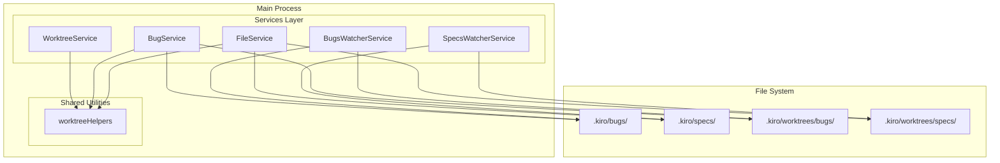
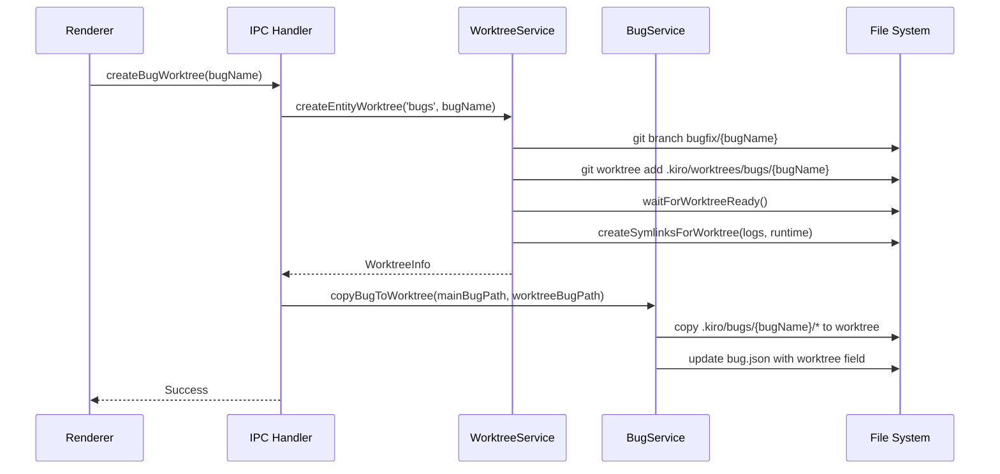
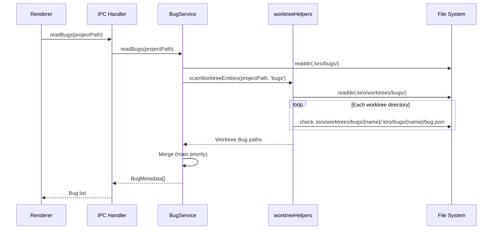

# Design: Bugs Worktree Directory Mode

## Overview

**Purpose**: BugsのWorktree管理方式をSpecsと同一のディレクトリ方式に統一し、WorktreeService・WatcherService・一覧読み込み処理を共通化する。

**Users**: 開発者がBugワークフローでWorktreeを使用する際、Specsと一貫した方式で作業できる。

**Impact**: 既存のフラグ方式（`bug.json.worktree`フィールド）を完全に廃止し、ディレクトリ方式（`.kiro/worktrees/bugs/{bug-name}/`）に移行する。

### Goals

- Bugs WorktreeをSpecsと同じディレクトリ方式（`.kiro/worktrees/bugs/{bug-name}/.kiro/bugs/{bug-name}/`）に統一
- WorktreeServiceの汎用API（`getEntityWorktreePath`, `createEntityWorktree`, `removeEntityWorktree`）を提供
- BugService.readBugsでWorktreeディレクトリからのBug読み込みを実装
- BugsWatcherServiceでWorktreeパスの監視を追加
- 共通ヘルパー関数による重複コード排除

### Non-Goals

- Remote UI対応（既存の制限を維持）
- Worktree作成場所のカスタマイズ
- ブランチ命名規則のカスタマイズ（`feature/*` vs `bugfix/*`）
- 旧フラグ方式からの自動マイグレーション

## Architecture

### Existing Architecture Analysis

現在のWorktree管理は以下の問題を抱えている：

1. **Specs**: ディレクトリ方式（`.kiro/worktrees/specs/{specId}/.kiro/specs/{specId}/`）
2. **Bugs**: フラグ方式（`.kiro/bugs/{bug-name}/bug.json.worktree`フィールド）

この不一致により：
- WorktreeServiceに重複ロジックが存在（`getWorktreePath`/`getBugWorktreePath`等）
- FileService.readSpecsとBugService.readBugsで異なるWorktree読み込みロジック
- WatcherServiceで異なる監視パターン

### Architecture Pattern & Boundary Map



**Architecture Integration**:
- Selected pattern: サービス層での共通ヘルパー関数による統一
- Domain boundaries: WorktreeService（Git操作）、BugService/FileService（ファイル読み取り）、WatcherService（監視）
- Existing patterns preserved: Result型、エラーハンドリング、ロギングパターン
- New components rationale: `worktreeHelpers.ts`でSpecs/Bugs共通のWorktreeディレクトリスキャンロジックを提供
- Steering compliance: DRY原則、SSOT原則、型安全性

### Technology Stack

| Layer | Choice / Version | Role in Feature | Notes |
|-------|------------------|-----------------|-------|
| Backend / Services | TypeScript 5.8+ | ヘルパー関数、サービス拡張 | 既存スタックを維持 |
| Data / Storage | File System (fs/promises) | Worktreeディレクトリ読み取り | 既存パターンを踏襲 |
| Messaging / Events | chokidar | ファイル監視 | BugsWatcherService拡張 |

## System Flows

### Bug Worktree作成フロー



### Bug一覧読み込みフロー



## Requirements Traceability

| Criterion ID | Summary | Components | Implementation Approach |
|--------------|---------|------------|------------------------|
| 1.1 | Worktree Bugのディレクトリ配置 | WorktreeService, worktreeHelpers | 新規実装: `getEntityWorktreePath` |
| 1.2 | bug.json.worktreeフィールド | BugService | 既存流用: `addWorktreeField` |
| 1.3 | メインbugsにWorktree Bug非存在 | BugService.readBugs | 新規実装: 読み取り分離 |
| 1.4 | worktreeフィールド設定 | BugService | 既存流用: `addWorktreeField` |
| 2.1 | getEntityWorktreePath提供 | WorktreeService | 新規実装 |
| 2.2 | createEntityWorktree提供 | WorktreeService | 新規実装（既存ロジック統合） |
| 2.3 | removeEntityWorktree提供 | WorktreeService | 新規実装（既存ロジック統合） |
| 2.4 | 既存getWorktreePathエイリアス | WorktreeService | リファクタリング |
| 2.5 | 既存getBugWorktreePathエイリアス | WorktreeService | リファクタリング |
| 2.6 | ブランチ命名（feature/bugfix） | WorktreeService | 既存維持 |
| 3.1 | readBugsのWorktree読み込み | BugService, worktreeHelpers | 新規実装 |
| 3.2 | メインBug優先マージ | BugService | 新規実装 |
| 3.3 | worktree情報マッピング | BugService | 既存流用 |
| 3.4 | 共通スキャンロジック使用 | worktreeHelpers | 新規実装 |
| 4.1 | BugsWatcherのworktree監視 | BugsWatcherService | 新規実装 |
| 4.2 | Worktree Bug変更イベント | BugsWatcherService | 新規実装 |
| 4.3 | SpecsWatcherと同様のパターン | BugsWatcherService | 既存パターン踏襲 |
| 4.4 | addDirイベント対応 | BugsWatcherService | 新規実装 |
| 4.5 | unlinkDirイベント対応 | BugsWatcherService | 新規実装 |
| 5.1 | 旧フラグ方式ロジック削除 | 複数コンポーネント | 削除 |
| 5.2 | UIコンポーネント更新 | BugListItem等 | リファクタリング |
| 5.3 | テスト更新 | 各テストファイル | 更新 |
| 6.1 | bug-fix時のWorktreeディレクトリ作成 | bugWorktreeHandlers | 新規実装 |
| 6.2 | Worktree内の.kiro/bugs構造作成 | bugWorktreeHandlers | 新規実装 |
| 6.3 | Bugファイルのコピー | bugWorktreeHandlers | 新規実装 |
| 6.4 | bug.json.worktreeフィールド追加 | BugService | 既存流用 |
| 6.5 | Symlink作成（logs, runtime） | WorktreeService | 既存流用 |
| 7.1 | bug-merge時のディレクトリ削除 | bugWorktreeHandlers | 新規実装 |
| 7.2 | bugfixブランチ削除 | WorktreeService | 既存流用 |
| 7.3 | worktreeフィールド削除 | BugService | 既存流用 |
| 8.1 | scanWorktreeEntities提供 | worktreeHelpers | 新規実装 |
| 8.2 | FileService.readSpecsでの使用 | FileService | リファクタリング |
| 8.3 | BugService.readBugsでの使用 | BugService | リファクタリング |
| 8.4 | スキャンパターン定義 | worktreeHelpers | 新規実装 |

### Coverage Validation Checklist

- [x] Every criterion ID from requirements.md appears in the table above
- [x] Each criterion has specific component names (not generic references)
- [x] Implementation approach distinguishes "reuse existing" vs "new implementation"
- [x] User-facing criteria specify concrete UI components

## Components and Interfaces

### Component Summary

| Component | Domain/Layer | Intent | Req Coverage | Key Dependencies | Contracts |
|-----------|--------------|--------|--------------|------------------|-----------|
| worktreeHelpers | Shared Utilities | Worktreeディレクトリスキャン共通化 | 8.1, 8.4 | fs/promises (P0) | Service |
| WorktreeService | Services | 統一Worktree API提供 | 2.1-2.6 | worktreeHelpers (P0), git (P0) | Service |
| BugService | Services | Bug読み込みのWorktree対応 | 3.1-3.4 | worktreeHelpers (P0) | Service |
| BugsWatcherService | Services | Worktreeパス監視追加 | 4.1-4.5 | chokidar (P0) | Service, Event |
| bugWorktreeHandlers | IPC | Worktree作成/削除フロー | 6.1-6.5, 7.1-7.3 | WorktreeService (P0), BugService (P0) | Service |

### Shared Utilities

#### worktreeHelpers

| Field | Detail |
|-------|--------|
| Intent | Specs/Bugs共通のWorktreeディレクトリスキャンロジック提供 |
| Requirements | 8.1, 8.4 |

**Responsibilities & Constraints**
- Worktreeディレクトリパターン（`.kiro/worktrees/{type}/{name}/.kiro/{type}/{name}/`）のスキャン
- 存在確認とメタデータJSON読み取り
- Specs/Bugsで共通使用可能な汎用インターフェース

**Dependencies**
- Outbound: fs/promises - ファイルシステム操作 (P0)

**Contracts**: Service [x]

##### Service Interface

```typescript
/**
 * Entity type for worktree operations
 */
type EntityType = 'specs' | 'bugs';

/**
 * Worktree entity info returned by scanner
 */
interface WorktreeEntityInfo {
  name: string;
  path: string;  // Absolute path to entity directory inside worktree
  worktreeBasePath: string;  // .kiro/worktrees/{type}/{name}
}

/**
 * Scan worktree entities of a given type
 * Pattern: .kiro/worktrees/{type}/{name}/.kiro/{type}/{name}/
 *
 * @param projectPath - Project root path
 * @param type - Entity type ('specs' | 'bugs')
 * @returns Array of worktree entity info
 */
function scanWorktreeEntities(
  projectPath: string,
  type: EntityType
): Promise<WorktreeEntityInfo[]>;

/**
 * Get worktree base path for an entity
 * Returns: .kiro/worktrees/{type}/{name}
 *
 * @param projectPath - Project root path
 * @param type - Entity type
 * @param name - Entity name (spec feature or bug name)
 */
function getWorktreeBasePath(
  projectPath: string,
  type: EntityType,
  name: string
): { relative: string; absolute: string };

/**
 * Get entity path inside worktree
 * Returns: .kiro/worktrees/{type}/{name}/.kiro/{type}/{name}
 */
function getWorktreeEntityPath(
  projectPath: string,
  type: EntityType,
  name: string
): { relative: string; absolute: string };
```

- Preconditions: projectPathは有効なディレクトリパス
- Postconditions: 存在するWorktreeエンティティのみを返却
- Invariants: パターン `.kiro/worktrees/{type}/{name}/.kiro/{type}/{name}/` を厳守

**Implementation Notes**
- Integration: FileService.readSpecs, BugService.readBugsから呼び出し
- Validation: ディレクトリ存在確認、メタデータJSON存在確認
- Risks: 大量のWorktreeディレクトリ存在時のパフォーマンス

### Services Layer

#### WorktreeService（拡張）

| Field | Detail |
|-------|--------|
| Intent | 汎用Worktree API提供と既存メソッドのエイリアス化 |
| Requirements | 2.1, 2.2, 2.3, 2.4, 2.5, 2.6 |

**Responsibilities & Constraints**
- 汎用`getEntityWorktreePath`、`createEntityWorktree`、`removeEntityWorktree`メソッド提供
- 既存の`getWorktreePath`、`getBugWorktreePath`等をエイリアスとして維持
- ブランチ命名規則（`feature/*` vs `bugfix/*`）の維持

**Dependencies**
- Inbound: bugWorktreeHandlers, worktreeImplHandlers - Worktree操作 (P0)
- Outbound: git CLI - Git操作 (P0)
- Outbound: worktreeHelpers - パス生成 (P0)

**Contracts**: Service [x]

##### Service Interface

```typescript
/**
 * Get worktree path for any entity type
 * Unifies getWorktreePath and getBugWorktreePath
 */
getEntityWorktreePath(
  type: EntityType,
  name: string
): { relative: string; absolute: string };

/**
 * Create worktree for any entity type
 * Unifies createWorktree and createBugWorktree
 */
createEntityWorktree(
  type: EntityType,
  name: string
): Promise<WorktreeServiceResult<WorktreeInfo>>;

/**
 * Remove worktree for any entity type
 * Unifies removeWorktree and removeBugWorktree
 */
removeEntityWorktree(
  type: EntityType,
  name: string
): Promise<WorktreeServiceResult<void>>;

// Backward compatible aliases
getWorktreePath(featureName: string): { relative: string; absolute: string };
createWorktree(featureName: string): Promise<WorktreeServiceResult<WorktreeInfo>>;
removeWorktree(featureName: string): Promise<WorktreeServiceResult<void>>;
getBugWorktreePath(bugName: string): { relative: string; absolute: string };
createBugWorktree(bugName: string): Promise<WorktreeServiceResult<WorktreeInfo>>;
removeBugWorktree(bugName: string): Promise<WorktreeServiceResult<void>>;
```

- Preconditions: main/masterブランチ上であること（create時）
- Postconditions: Worktreeディレクトリとブランチが作成/削除される
- Invariants: ブランチ命名規則（type='specs'は`feature/`、type='bugs'は`bugfix/`）

**Implementation Notes**
- Integration: 既存メソッドを内部で`getEntityWorktreePath`等に委譲
- Validation: validateFeatureName再利用
- Risks: なし（既存ロジックの統合のみ）

#### BugService（拡張）

| Field | Detail |
|-------|--------|
| Intent | readBugsでWorktreeディレクトリからのBug読み込み対応 |
| Requirements | 3.1, 3.2, 3.3, 3.4 |

**Responsibilities & Constraints**
- `.kiro/bugs/`と`.kiro/worktrees/bugs/{name}/.kiro/bugs/{name}/`の両方からBug読み込み
- メインBug優先のマージロジック
- worktree情報のBugMetadataへのマッピング

**Dependencies**
- Inbound: IPC handlers - Bug一覧取得 (P0)
- Outbound: worktreeHelpers - Worktreeスキャン (P0)
- Outbound: fs/promises - ファイル操作 (P0)

**Contracts**: Service [x]

##### Service Interface

```typescript
/**
 * Read all bugs including worktree bugs
 * Main bugs take priority over worktree bugs with same name
 */
async readBugs(projectPath: string): Promise<Result<BugMetadata[], FileError>>;
```

- Preconditions: projectPathは有効なプロジェクトパス
- Postconditions: メインBugとWorktree Bugがマージされた一覧を返却
- Invariants: 同名Bug存在時はメインBugが優先

**Implementation Notes**
- Integration: scanWorktreeEntitiesを使用してWorktree Bugを検出
- Validation: bug.json存在確認
- Risks: なし（FileService.readSpecsパターンの踏襲）

#### BugsWatcherService（拡張）

| Field | Detail |
|-------|--------|
| Intent | Worktreeパス監視の追加 |
| Requirements | 4.1, 4.2, 4.3, 4.4, 4.5 |

**Responsibilities & Constraints**
- `.kiro/worktrees/bugs/`ディレクトリも監視対象に含める
- Worktree内のBugファイル変更時に適切なイベントをディスパッチ
- SpecsWatcherServiceと同様の監視パターン

**Dependencies**
- Outbound: chokidar - ファイル監視 (P0)

**Contracts**: Service [x] / Event [x]

##### Service Interface

```typescript
/**
 * Start watching both main bugs and worktree bugs directories
 * Pattern follows SpecsWatcherService implementation
 */
async start(): Promise<void>;

/**
 * Extract bug name from file path
 * Supports both:
 * - /project/.kiro/bugs/my-bug/... -> my-bug
 * - /project/.kiro/worktrees/bugs/my-bug/.kiro/bugs/my-bug/... -> my-bug
 */
private extractBugName(filePath: string): string | undefined;
```

##### Event Contract

- Published events: `BugsChangeEvent { type, path, bugName }`
- Subscribed events: chokidar `add`, `change`, `unlink`, `addDir`, `unlinkDir`
- Ordering / delivery guarantees: デバウンス（300ms）適用

**Implementation Notes**
- Integration: SpecsWatcherServiceの`start()`実装パターンを踏襲
- Validation: isWithinBugsDir拡張でWorktreeパスも許可
- Risks: 監視パス増加による負荷（軽微）

### IPC Layer

#### bugWorktreeHandlers（拡張）

| Field | Detail |
|-------|--------|
| Intent | Bug Worktree作成/削除フローの更新 |
| Requirements | 6.1, 6.2, 6.3, 6.4, 6.5, 7.1, 7.2, 7.3 |

**Responsibilities & Constraints**
- ディレクトリ方式でのWorktree作成
- BugファイルのメインからWorktreeへのコピー
- Worktree内の`.kiro/bugs/{bug-name}/`構造作成
- Symlink作成（logs, runtime）

**Dependencies**
- Outbound: WorktreeService - Worktree操作 (P0)
- Outbound: BugService - Bug.json操作 (P0)
- Outbound: fs/promises - ファイルコピー (P0)

**Contracts**: Service [x]

##### Service Interface

```typescript
/**
 * Create bug worktree with directory mode
 * 1. Create worktree at .kiro/worktrees/bugs/{bugName}
 * 2. Create .kiro/bugs/{bugName}/ structure inside worktree
 * 3. Copy bug files from main to worktree
 * 4. Add worktree field to bug.json in worktree
 * 5. Create symlinks for logs/runtime
 */
async handleCreateBugWorktree(
  projectPath: string,
  bugName: string
): Promise<Result<WorktreeInfo, WorktreeError>>;

/**
 * Remove bug worktree and cleanup
 * 1. Remove git worktree
 * 2. Delete bugfix/{bugName} branch
 * 3. Remove worktree field from main bug.json (if exists)
 */
async handleRemoveBugWorktree(
  projectPath: string,
  bugName: string
): Promise<Result<void, WorktreeError>>;
```

- Preconditions: Bug存在、main/masterブランチ上
- Postconditions: Worktreeディレクトリ作成/削除完了
- Invariants: メインBug.jsonは変更しない（Worktree内のbug.jsonのみ更新）

**Implementation Notes**
- Integration: 既存のhandleCreateBugWorktreeロジックを拡張
- Validation: Bug存在確認、ブランチ確認
- Risks: コピー失敗時のロールバック処理

## Data Models

### Domain Model

既存のBugJson型を維持：

```typescript
interface BugJson {
  bug_name: string;
  created_at: string;
  updated_at: string;
  worktree?: BugWorktreeConfig;  // オプショナル：worktreeモード時のみ
}

interface BugWorktreeConfig {
  path: string;      // 例: ".kiro/worktrees/bugs/my-bug"
  branch: string;    // 例: "bugfix/my-bug"
  created_at: string;
}
```

### Logical Data Model

**ディレクトリ構造**:

```
{project}/
├── .kiro/
│   ├── bugs/
│   │   └── {bug-name}/          # メインBug（通常モード）
│   │       ├── bug.json
│   │       ├── report.md
│   │       └── ...
│   ├── specs/
│   │   └── {spec-name}/
│   └── worktrees/               # git管理対象外
│       ├── specs/
│       │   └── {spec-name}/     # Spec worktree
│       │       └── .kiro/specs/{spec-name}/
│       └── bugs/
│           └── {bug-name}/      # Bug worktree（新方式）
│               └── .kiro/bugs/{bug-name}/
│                   ├── bug.json
│                   ├── report.md
│                   └── ...
```

**Worktree内bug.jsonの例**:

```json
{
  "bug_name": "memory-leak-fix",
  "created_at": "2026-01-15T00:00:00Z",
  "updated_at": "2026-01-15T12:00:00Z",
  "worktree": {
    "path": ".kiro/worktrees/bugs/memory-leak-fix",
    "branch": "bugfix/memory-leak-fix",
    "created_at": "2026-01-15T10:00:00Z"
  }
}
```

## Error Handling

### Error Strategy

既存のResult型パターンを踏襲。WorktreeServiceResult、FileErrorを使用。

### Error Categories and Responses

| エラーカテゴリ | 原因 | 対応 |
|--------------|------|------|
| NOT_ON_MAIN_BRANCH | main/master以外でworktree作成試行 | エラーメッセージ表示、操作中止 |
| BRANCH_EXISTS | 同名ブランチ既存 | エラーメッセージ表示、既存worktree確認を促す |
| WORKTREE_EXISTS | 同名worktree既存 | エラーメッセージ表示、既存worktree確認を促す |
| INVALID_FEATURE_NAME | 無効な名前 | バリデーションエラー表示 |
| GIT_ERROR | Git操作失敗 | 詳細エラーログ、ロールバック試行 |
| NOT_FOUND | Bug/ファイル不存在 | 該当項目スキップ |

## Testing Strategy

### Unit Tests

- `worktreeHelpers.test.ts`: scanWorktreeEntities、getWorktreeBasePath、getWorktreeEntityPath
- `WorktreeService.test.ts`: getEntityWorktreePath、createEntityWorktree、removeEntityWorktree、エイリアス動作
- `BugService.test.ts`: readBugsのWorktree Bug読み込み、マージロジック
- `BugsWatcherService.test.ts`: extractBugNameのWorktreeパス対応、監視パス追加

### Integration Tests

- `bugWorktreeFlow.integration.test.ts`: Worktree作成→ファイルコピー→削除の一連フロー
- BugsWatcherService: Worktreeディレクトリ追加/削除イベント発火

### E2E Tests

- Bug Worktree作成フロー（UI経由）
- Bug一覧でのWorktree Bug表示
- Bug merge後のクリーンアップ

## Design Decisions

### DD-001: ディレクトリ方式への統一

| Field | Detail |
|-------|--------|
| Status | Accepted |
| Context | BugsのWorktree管理がSpecsと異なるフラグ方式を採用しており、コードの重複と保守性の問題がある |
| Decision | BugsもSpecsと同じディレクトリ方式（`.kiro/worktrees/bugs/{bug-name}/.kiro/bugs/{bug-name}/`）に統一する |
| Rationale | 1. DRY原則：共通ヘルパーでコード重複を排除 2. 一貫性：開発者の認知負荷軽減 3. 物理的分離：worktreeの実ファイルがブランチ間で混乱しない |
| Alternatives Considered | 1. フラグ方式を維持してSpecs側も統一 → Specsの既存実装変更が大きい 2. 両方式を併用 → 複雑性増大 |
| Consequences | 後方互換性なし（旧フラグ方式のBugは手動マイグレーション必要）、コードベースのクリーン化 |

### DD-002: 共通ヘルパー関数の導入

| Field | Detail |
|-------|--------|
| Status | Accepted |
| Context | FileService.readSpecsとBugService.readBugsで類似のWorktreeスキャンロジックが必要 |
| Decision | `worktreeHelpers.ts`に共通関数（scanWorktreeEntities等）を実装し、両サービスから使用 |
| Rationale | 1. SSOT：スキャンロジックを一箇所に集約 2. テスタビリティ：ヘルパー単体でテスト可能 3. 拡張性：将来の新エンティティタイプにも対応可能 |
| Alternatives Considered | 1. 各サービスに直接実装 → コード重複 2. WorktreeServiceに統合 → 責務過多 |
| Consequences | 新ファイル追加、import依存関係の追加 |

### DD-003: 既存APIのエイリアス維持

| Field | Detail |
|-------|--------|
| Status | Accepted |
| Context | 既存コードがgetWorktreePath、getBugWorktreePath等を使用している |
| Decision | 新しい汎用API（getEntityWorktreePath等）を追加し、既存メソッドはエイリアスとして維持 |
| Rationale | 1. 後方互換性：既存呼び出し元の変更不要 2. 段階的移行：新コードは汎用APIを使用、既存コードは時間をかけて移行 |
| Alternatives Considered | 1. 既存メソッド削除 → 大規模リファクタリング必要 2. 既存メソッドのみ維持 → 汎用化の恩恵なし |
| Consequences | API表面積の一時的な増加、将来のdeprecation作業が必要 |

### DD-004: ブランチ命名規則の維持

| Field | Detail |
|-------|--------|
| Status | Accepted |
| Context | Specsは`feature/*`、Bugsは`bugfix/*`のブランチ命名規則を使用 |
| Decision | 統一せず、現行の命名規則を維持する |
| Rationale | 1. git-flow準拠：業界標準の命名規則 2. 識別性：ブランチ名からSpec/Bugを判別可能 3. 既存ワークフロー互換 |
| Alternatives Considered | 1. 統一（例：`worktree/*`） → git-flow非準拠、既存ツールとの互換性問題 |
| Consequences | EntityTypeに応じたブランチプレフィックス分岐が必要 |

### DD-005: 後方互換性の非考慮

| Field | Detail |
|-------|--------|
| Status | Accepted |
| Context | 旧フラグ方式（`.kiro/bugs/{bug-name}/bug.json.worktree`）からの移行 |
| Decision | 自動マイグレーションを提供せず、旧フラグ方式を完全に削除する |
| Rationale | 1. 複雑性回避：二重のworktree管理ロジックは保守困難 2. 実データ少数：現時点でフラグ方式使用の実データは限定的 3. クリーン実装優先 |
| Alternatives Considered | 1. 自動マイグレーション提供 → 移行ロジックの実装・テストコスト 2. 両方式併用 → 永続的な複雑性 |
| Consequences | 旧方式使用ユーザーは手動でworktreeを再作成する必要あり |
