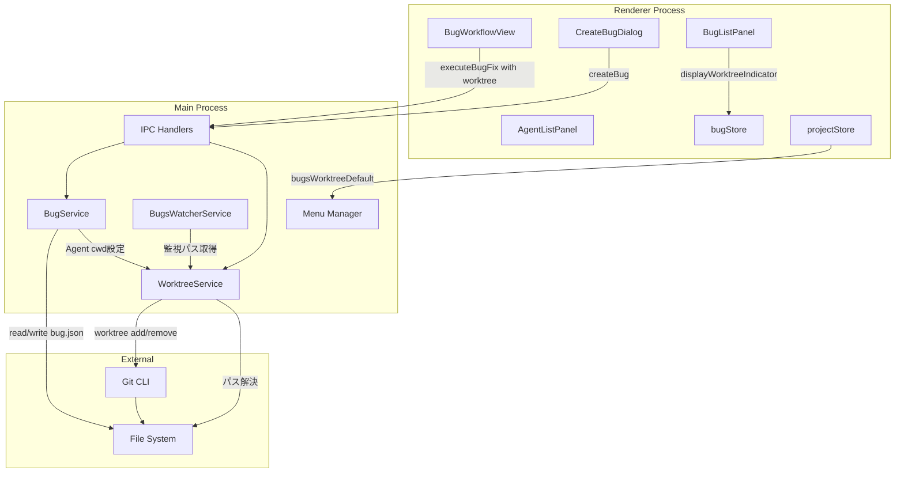
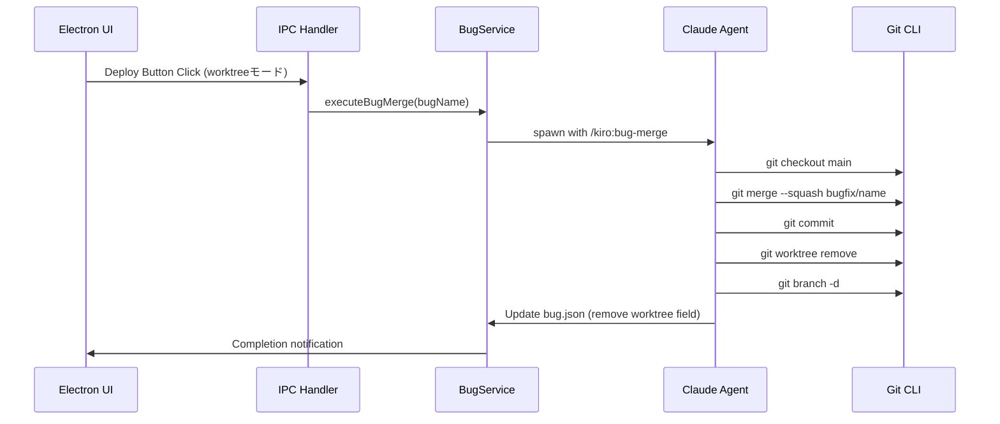
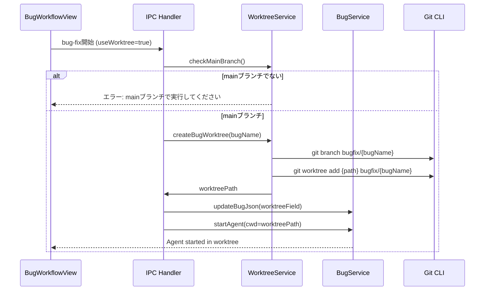
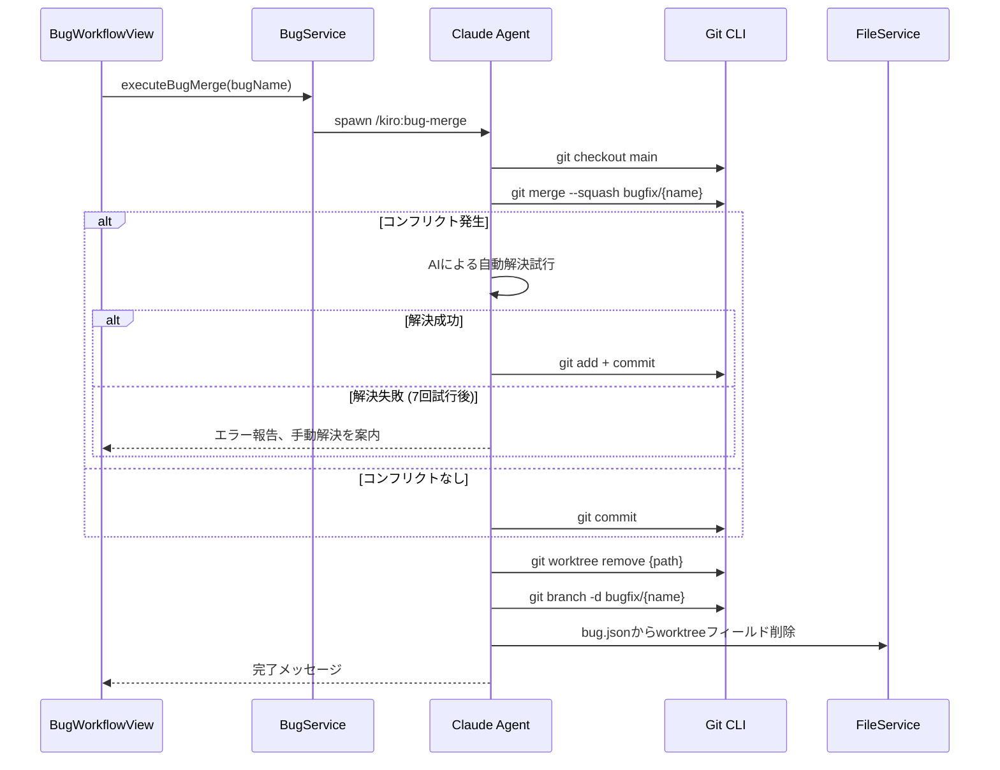
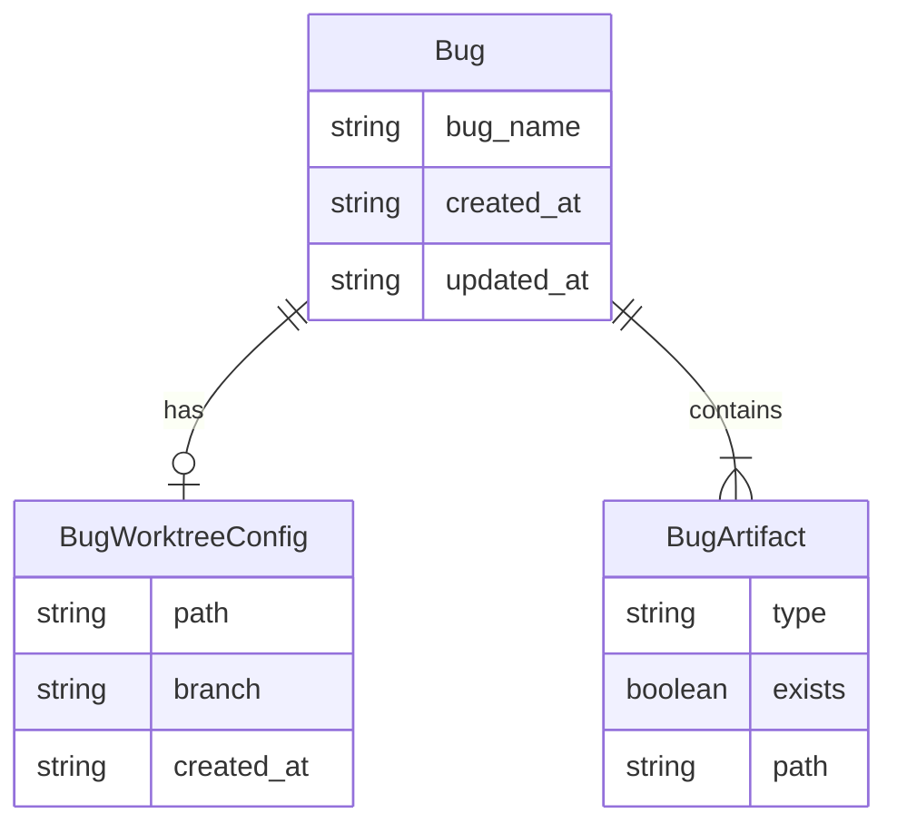

# Design: Bugs Worktree Support

## Overview

**Purpose**: Bugsワークフロー（bug-create → bug-analyze → bug-fix → bug-verify）にgit worktree機能を追加し、mainブランチで調査しながら別のworktreeで修正作業を行える機能を提供する。

**Users**: バグ修正を行う開発者が、調査と修正作業の分離、クリーンなブランチ管理を実現するために利用する。

**Impact**: 既存のBugsワークフローを拡張し、bug-fix開始時にオプションでworktreeを作成。bug.jsonによるメタデータ管理を導入し、修正・検証完了後にbug-mergeでmainブランチにマージ、worktreeをクリーンアップする。

### Goals
- bug.json導入によるバグメタデータとworktree状態の一元管理
- bug-fix開始時のオプショナルworktree作成
- bug-mergeスキルによるマージ・クリーンアップの自動化
- プロジェクト設定でworktreeデフォルト値を管理
- UIでのworktree使用選択とインジケーター表示

### Non-Goals
- 既存worktreeの検出・紐付け機能（手動でbug.json編集は可能）
- worktree作成場所のカスタマイズ
- ブランチ命名規則のカスタマイズ
- Remote UI対応（初期スコープ外、Desktop UI専用機能）
- bug-verify成功時の自動マージ

## Architecture

### Architecture Pattern & Boundary Map



**Architecture Integration**:
- Selected pattern: 既存のgit-worktree-support（Spec用）パターンを踏襲し、BugService/WorktreeServiceを拡張
- Domain/feature boundaries: worktree操作はWorktreeServiceに集約（Spec/Bug共通）、Bug固有のメタデータ管理はBugServiceが担当
- Existing patterns preserved: IPC handler -> Service -> External のフロー、ファイル監視パターン
- New components rationale: bug.jsonテンプレート追加、bug-mergeスキル新設、UI拡張
- Steering compliance: DRY（WorktreeServiceを共通化）、SSOT（bug.jsonでメタデータ一元管理）、KISS（オプトイン方式でシンプルに）

### Technology Stack

| Layer | Choice / Version | Role in Feature | Notes |
|-------|------------------|-----------------|-------|
| Backend / Services | Node.js child_process | git CLI実行 | 既存WorktreeServiceを活用 |
| Data / Storage | bug.json | worktree状態・メタデータ永続化 | 新規ファイル追加 |
| Data / Storage | projectSettings | worktreeデフォルト設定 | configStore拡張 |
| Infrastructure / Runtime | Git 2.x+ | worktree操作 | git worktree add/remove/list |

### Command Prompt Architecture (Claude Code features only)

**Execution Model**:
- [x] CLI invocation: External process with file-based data exchange

**Rationale**: bug-mergeスキルはgit操作（merge, worktree remove, branch delete）を含むため、Bash経由のCLI実行が必要。Spec用のspec-mergeと同様のパターン。

**Data Flow**:


## System Flows

### Bug-fix Worktree Creation Flow



### Bug-merge Flow (Deploy時)



## Requirements Traceability

| Criterion ID | Summary | Components | Implementation Approach |
|--------------|---------|------------|------------------------|
| 1.1 | bug-create時にbug.json作成 | BugService, bug-createスキル | 新規実装: bug.jsonファイル生成 |
| 1.2 | bug.json基本構造 | BugJson型定義 | 新規実装: 型定義とバリデーション |
| 1.3 | worktreeフィールド追加 | BugJson.worktree型 | 新規実装: WorktreeConfig再利用 |
| 1.4 | worktreeフィールドでモード判定 | isBugWorktreeMode関数 | 新規実装: ヘルパー関数 |
| 2.1 | bug-createでbug.json新規作成 | bug-createスキル拡張 | 既存スキル修正 |
| 2.2 | bug-analyzeでupdated_at更新 | bug-analyzeスキル拡張 | 既存スキル修正 |
| 2.3 | bug-fixでworktreeフィールド追加 | bug-fixスキル拡張, WorktreeService | 既存スキル修正 + 新規連携 |
| 2.4 | bug-verifyでupdated_at更新 | bug-verifyスキル拡張 | 既存スキル修正 |
| 2.5 | bug-statusでworktree状態表示 | bug-statusスキル拡張 | 既存スキル修正 |
| 3.1 | mainブランチ確認 | WorktreeService.isOnMainBranch | 既存再利用 |
| 3.2 | mainブランチ外エラー | BugWorkflowView | 新規実装: エラーハンドリング |
| 3.3 | worktree作成 | WorktreeService.createBugWorktree | 新規実装: bugs専用パス |
| 3.4 | ブランチ命名規則 | WorktreeService | 新規実装: bugfix/{bug-name}形式 |
| 3.5 | bug.jsonにworktreeフィールド追加 | BugService | 新規実装: ファイル更新 |
| 3.6 | worktree作成失敗時エラー | BugWorkflowView | 新規実装: エラーハンドリング |
| 3.7 | 相対パス保存 | BugJson.worktree.path | 新規実装: パス形式 |
| 3.8 | worktree未使用時の通常動作 | BugWorkflowView | 既存動作維持 |
| 4.1 | bug-mergeコマンド提供 | bug-mergeスキル | 新規実装: スキル作成 |
| 4.2 | mainブランチ確認 | bug-mergeスキル | 新規実装: 前提条件チェック |
| 4.3 | worktreeブランチマージ | bug-mergeスキル | 新規実装: git merge --squash |
| 4.4 | コンフリクト自動解決試行 | bug-mergeスキル | 新規実装: AI解決ロジック |
| 4.5 | 自動解決失敗時報告 | bug-mergeスキル | 新規実装: エラー報告 |
| 4.6 | worktree削除 | bug-mergeスキル, WorktreeService | 新規実装 |
| 4.7 | bug.jsonからworktreeフィールド削除 | bug-mergeスキル | 新規実装 |
| 4.8 | 成功メッセージ表示 | bug-mergeスキル | 新規実装 |
| 5.1 | コマンドセットにbug-merge含める | commandsetInstaller | 既存拡張 |
| 5.2 | 同じ場所に配置 | commandsetInstaller | 既存パターン踏襲 |
| 6.1 | bug.jsonテンプレート提供 | templates/bugs/bug.json | 新規実装 |
| 6.2 | テンプレートからbug.json生成 | bug-createスキル | 新規実装 |
| 7.1 | skill-reference.mdにbug.json管理記述 | skill-reference.md | ドキュメント更新 |
| 7.2 | skill-reference.mdにbug-merge説明 | skill-reference.md | ドキュメント更新 |
| 7.3 | skill-reference.mdにworktree状態遷移記述 | skill-reference.md | ドキュメント更新 |
| 8.1 | バグ新規作成ダイアログにチェックボックス | CreateBugDialog | 新規実装: UIコンポーネント追加 |
| 8.2 | ワークフローエリアにチェックボックス | BugWorkflowView | 新規実装: UIコンポーネント追加 |
| 8.3 | デフォルト値で初期化 | CreateBugDialog, BugWorkflowView | 新規実装: projectStore連携 |
| 8.4 | 値をオンメモリ保持 | bugStore | 新規実装: state追加 |
| 8.5 | bug-fix開始時にworktree決定 | BugWorkflowView | 新規実装: 実行ロジック |
| 9.1 | ツールメニューにトグル表示 | Menu Manager | 新規実装: メニュー項目追加 |
| 9.2 | 設定永続化 | configStore | 新規実装: 設定項目追加 |
| 9.3 | デフォルト値OFF | configStore | 新規実装: 初期値設定 |
| 9.4 | 新規バグ作成時にデフォルト値使用 | CreateBugDialog | 新規実装: 初期値参照 |
| 10.1 | バグ一覧でworktree状態判定 | BugListPanel | 新規実装: bug.json読み取り |
| 10.2 | worktreeフィールド存在時インジケーター表示 | BugListItem | 新規実装: UIコンポーネント |
| 10.3 | Specと一貫したデザイン | BugListItem | 既存SpecListItemパターン踏襲 |
| 11.1 | Agent起動時にworktree.pathをpwd設定 | BugService | 新規実装: cwd設定 |
| 11.2 | 複数Agent起動時に同じworktreeパス | BugService | 新規実装: 一貫性確保 |
| 12.1 | 自動実行時にbugsWorktreeDefault参照 | BugWorkflowService | 新規実装: 設定取得 |
| 12.2 | bugsWorktreeDefault=true時にworktree作成 | BugWorkflowService, WorktreeService | 新規実装: 自動worktree作成 |
| 12.3 | bugsWorktreeDefault=false時に通常動作 | BugWorkflowService | 既存動作維持 |
| 12.4 | UIと同じロジックを使用 | BugWorkflowService | 共通ロジック呼び出し |

### Coverage Validation Checklist

- [x] Every criterion ID from requirements.md appears in the table above
- [x] Each criterion has specific component names (not generic references)
- [x] Implementation approach distinguishes "reuse existing" vs "new implementation"
- [x] User-facing criteria specify concrete UI components

## Components and Interfaces

| Component | Domain/Layer | Intent | Req Coverage | Key Dependencies | Contracts |
|-----------|--------------|--------|--------------|------------------|-----------|
| BugJson型 | Types | bug.jsonのメタデータとworktree状態を定義 | 1.1-1.4 | WorktreeConfig (P1) | State |
| BugService拡張 | Main/Service | bug.jsonの読み書き、worktree連携 | 1.1, 2.1-2.5, 3.5, 11.1-11.2 | WorktreeService (P0), FileService (P1) | Service |
| WorktreeService拡張 | Main/Service | Bugs用worktree操作メソッド追加 | 3.1, 3.3, 3.4, 4.6 | Git CLI (P0) | Service |
| bug-mergeスキル | Skills | マージ・クリーンアップ実行 | 4.1-4.8, 5.1-5.2 | Git CLI (P0), bug.json (P1) | - |
| bug-*スキル拡張 | Skills | bug.json操作の追加 | 2.1-2.5 | bug.json (P1) | - |
| BugWorkflowView拡張 | Renderer/UI | worktreeチェックボックス、Deploy分岐 | 8.2, 8.5 | bugStore (P1), IPC (P0) | - |
| CreateBugDialog拡張 | Renderer/UI | worktreeチェックボックス追加 | 8.1, 8.3-8.4 | bugStore (P1), projectStore (P1) | - |
| BugListItem拡張 | Renderer/UI | worktreeインジケーター表示 | 10.1-10.3 | BugMetadata (P1) | - |
| Menu Manager拡張 | Main/Menu | worktreeデフォルト設定トグル | 9.1-9.4 | configStore (P0) | - |
| configStore拡張 | Main/Service | bugsWorktreeDefault設定 | 9.2-9.4 | - | State |
| BugsWatcherService拡張 | Main/Service | worktreeモード時の監視パス切り替え | 3.7 | WorktreeService (P1) | Service |
| BugWorkflowService拡張 | Main/Service | 自動実行時のworktree設定参照・作成 | 12.1-12.4 | configStore (P0), WorktreeService (P0), BugService (P1) | Service |
| bug.jsonテンプレート | Templates | bug.json生成用テンプレート | 6.1-6.2 | - | - |

### Types

#### BugJson

| Field | Detail |
|-------|--------|
| Intent | bug.jsonのメタデータとworktree状態を定義 |
| Requirements | 1.1, 1.2, 1.3, 1.4 |

**Contracts**: State [x]

##### State Management
```typescript
/**
 * Bug metadata stored in bug.json
 * Requirements: 1.1, 1.2
 */
interface BugJson {
  /** Bug name (directory name) */
  bug_name: string;
  /** Creation timestamp (ISO-8601) */
  created_at: string;
  /** Last update timestamp (ISO-8601) */
  updated_at: string;
  /** Worktree configuration (optional) - Requirements: 1.3 */
  worktree?: BugWorktreeConfig;
}

/**
 * Worktree configuration for bugs
 * Requirements: 1.3, 3.4, 3.7
 */
interface BugWorktreeConfig {
  /** Relative path from main project root: ../{project}-worktrees/bugs/{bug-name} */
  path: string;
  /** Branch name: bugfix/{bug-name} */
  branch: string;
  /** Creation timestamp (ISO-8601) */
  created_at: string;
}
```

- State model: worktreeフィールドの有無でモード判定（Requirements: 1.4）
- Persistence: `.kiro/bugs/{bug-name}/bug.json`に保存
- Consistency: フィールド追加/削除は単一操作で実行

#### BugMetadata拡張

既存の`BugMetadata`型（UI表示用）にworktreeフィールドを追加：

```typescript
/**
 * Bug metadata interface (UI表示用)
 * 既存フィールドに加え、worktreeフィールドをオプショナルで追加
 */
export interface BugMetadata {
  readonly name: string;           // バグ名（ディレクトリ名）
  readonly path: string;           // フルパス
  readonly phase: BugPhase;        // 現在のフェーズ
  readonly updatedAt: string;      // 最終更新日時
  readonly reportedAt: string;     // 報告日時
  /** Worktree configuration (optional) - bug.jsonから読み取り */
  readonly worktree?: BugWorktreeConfig;
}
```

**マッピング戦略**:
- BugService.readBugsでbug.jsonを読み取る際、worktreeフィールドが存在すればBugMetadataにマッピング
- BugListItemはBugMetadata.worktreeの有無でインジケーター表示を判定
- BugJsonはファイル永続化用、BugMetadataはUI表示用として役割分離

#### isBugWorktreeMode関数

```typescript
/**
 * Check if a bug is in worktree mode
 * Requirements: 1.4
 *
 * @param bugJson - BugJson object
 * @returns true if bug has a valid worktree configuration
 */
function isBugWorktreeMode(bugJson: BugJson): boolean {
  return bugJson.worktree !== undefined &&
         typeof bugJson.worktree.path === 'string' &&
         bugJson.worktree.path.length > 0;
}
```

### Main/Service

#### BugService拡張

| Field | Detail |
|-------|--------|
| Intent | bug.jsonの読み書き、worktree状態管理、Agent cwd設定 |
| Requirements | 1.1, 2.1, 2.2, 2.3, 2.4, 2.5, 3.5, 11.1, 11.2 |

**Responsibilities & Constraints**
- bug.json CRUD操作
- worktreeフィールドの追加・削除
- Agent起動時のcwd設定

**Dependencies**
- Inbound: IPC Handlers - bug操作呼び出し (P0)
- Outbound: WorktreeService - パス解決 (P0)
- Outbound: FileService - ファイル操作 (P1)

**Contracts**: Service [x]

##### Service Interface (追加分)
```typescript
interface BugServiceExtension {
  /**
   * Create bug.json for a new bug
   * Requirements: 1.1, 2.1
   */
  createBugJson(bugPath: string, bugName: string): Promise<Result<BugJson, FileError>>;

  /**
   * Read bug.json
   * Requirements: 2.5
   */
  readBugJson(bugPath: string): Promise<Result<BugJson | null, FileError>>;

  /**
   * Update bug.json timestamps
   * Requirements: 2.2, 2.4
   */
  updateBugJsonTimestamp(bugPath: string): Promise<Result<void, FileError>>;

  /**
   * Add worktree field to bug.json
   * Requirements: 2.3, 3.5
   */
  addWorktreeField(bugPath: string, worktreeConfig: BugWorktreeConfig): Promise<Result<void, FileError>>;

  /**
   * Remove worktree field from bug.json
   * Requirements: 4.7
   */
  removeWorktreeField(bugPath: string): Promise<Result<void, FileError>>;

  /**
   * Get agent working directory (worktree path or project path)
   * Requirements: 11.1, 11.2
   */
  getAgentCwd(bugPath: string): Promise<string>;
}
```

**Implementation Notes**
- Integration: 既存のreadBugDetail, readBugsメソッドはbug.json読み取りに対応済み（既存コードでbugJson読み取り処理あり）
- Validation: bug.json存在しない場合はnullを返す（後方互換性）
- Risks: 既存バグディレクトリにbug.jsonがない場合の移行

#### WorktreeService拡張

| Field | Detail |
|-------|--------|
| Intent | Bugs用worktree操作メソッドを追加 |
| Requirements | 3.1, 3.3, 3.4, 4.6 |

**Responsibilities & Constraints**
- Bugs専用のworktreeパス生成（`../{project}-worktrees/bugs/{bug-name}`）
- `bugfix/{bug-name}`形式のブランチ作成
- worktree削除

**Dependencies**
- Outbound: Git CLI - worktree操作 (P0)
- Outbound: child_process - コマンド実行 (P0)

**Contracts**: Service [x]

##### Service Interface (追加分)
```typescript
interface WorktreeServiceBugExtension {
  /**
   * Get bug worktree path
   * Requirements: 3.3, 3.7
   *
   * @param bugName - Bug name
   * @returns Object with relative and absolute paths
   */
  getBugWorktreePath(bugName: string): { relative: string; absolute: string };

  /**
   * Create a worktree for a bug
   * Requirements: 3.3, 3.4
   *
   * @param bugName - Bug name (will be used for branch: bugfix/{bugName})
   * @returns WorktreeInfo on success
   */
  createBugWorktree(bugName: string): Promise<WorktreeServiceResult<WorktreeInfo>>;

  /**
   * Remove a bug worktree and its branch
   * Requirements: 4.6
   *
   * @param bugName - Bug name
   */
  removeBugWorktree(bugName: string): Promise<WorktreeServiceResult<void>>;
}
```

**Implementation Notes**
- Integration: 既存のWorktreeServiceを継承または拡張
- パス形式: `../{project}-worktrees/bugs/{bug-name}`（Specとは別ディレクトリ）
- ブランチ形式: `bugfix/{bug-name}`（Specのfeature/とは区別）

#### configStore拡張

| Field | Detail |
|-------|--------|
| Intent | Bugs worktreeデフォルト設定の永続化 |
| Requirements | 9.2, 9.3, 9.4 |

**Contracts**: State [x]

##### State Management (追加分)
```typescript
interface ConfigStoreExtension {
  /** Get bugs worktree default setting */
  getBugsWorktreeDefault(): boolean;

  /** Set bugs worktree default setting */
  setBugsWorktreeDefault(value: boolean): void;
}
```

- 初期値: `false`（Requirements: 9.3）
- 永続化: electron-storeによるファイル保存

#### BugWorkflowService拡張

| Field | Detail |
|-------|--------|
| Intent | 自動実行時のworktree設定参照とworktree作成 |
| Requirements | 12.1, 12.2, 12.3, 12.4 |

**Responsibilities & Constraints**
- 自動実行（autoExecution）時にbugsWorktreeDefault設定を参照
- 設定に基づいてworktree作成の判断と実行
- UIチェックボックスと同じworktree作成ロジックを共有

**Dependencies**
- Outbound: configStore - bugsWorktreeDefault取得 (P0)
- Outbound: WorktreeService - worktree作成 (P0)
- Outbound: BugService - bug.json更新 (P1)

**Contracts**: Service [x]

##### Service Interface (追加分)
```typescript
interface BugWorkflowServiceExtension {
  /**
   * Start bug-fix with auto-execution worktree handling
   * Requirements: 12.1, 12.2, 12.3, 12.4
   *
   * @param bugName - Bug name
   * @param projectPath - Project path
   * @returns Result with worktree info if created, or void if not
   */
  startBugFixWithAutoWorktree(
    bugName: string,
    projectPath: string
  ): Promise<Result<BugWorktreeConfig | null, WorktreeError>>;
}
```

**Implementation Notes**
- Integration: 既存のbug-fix開始フローに自動worktree判定を追加
- Logic: `configStore.getBugsWorktreeDefault()` がtrueの場合のみworktree作成
- Reuse: UIチェックボックスからの呼び出しと同じworktree作成ロジックを使用（DRY原則）

### Main/IPC

#### IPC Handlers拡張

| Field | Detail |
|-------|--------|
| Intent | Bugs worktree関連操作のIPCチャンネル追加 |
| Requirements | 3.1, 3.3, 8.5, 9.1 |

**Contracts**: API [x]

##### API Contract
| Method | Channel | Request | Response | Errors |
|--------|---------|---------|----------|--------|
| invoke | bug:worktree:create | `{ projectPath: string; bugName: string }` | `BugWorktreeConfig` | NOT_ON_MAIN_BRANCH, GIT_ERROR |
| invoke | bug:worktree:remove | `{ projectPath: string; bugName: string }` | `void` | PATH_NOT_FOUND, GIT_ERROR |
| invoke | settings:bugs-worktree-default:get | `void` | `boolean` | - |
| invoke | settings:bugs-worktree-default:set | `{ value: boolean }` | `void` | - |

### Main/Menu

#### Menu Manager拡張

| Field | Detail |
|-------|--------|
| Intent | ツールメニューにworktreeデフォルト設定トグルを追加 |
| Requirements | 9.1, 9.2, 9.3 |

**Implementation Notes**
- 配置: 「ツール」メニュー内、「コマンドセットをインストール...」の下
- ラベル: 「Bugs: Worktreeをデフォルトで使用」
- 種類: チェックボックス（type: 'checkbox'）
- 状態: configStore.getBugsWorktreeDefault()と同期

### Renderer/UI

#### CreateBugDialog拡張

| Field | Detail |
|-------|--------|
| Intent | バグ新規作成時のworktree使用チェックボックス追加 |
| Requirements | 8.1, 8.3, 8.4 |

**Implementation Notes**
- チェックボックス配置: 説明フィールドの下、アクションボタンの上
- ラベル: 「Worktreeを使用」
- 初期値: projectStore経由でconfigStoreのデフォルト値を取得
- 値保持: bugStoreのuseWorktreeフラグで管理（オンメモリ）
- **スコープ**: useWorktreeはグローバルに1つ保持し、CreateBugDialog/BugWorkflowViewで共有する（バグごとではない）

#### BugWorkflowView拡張

| Field | Detail |
|-------|--------|
| Intent | ワークフローエリアでのworktree使用選択とDeploy動作分岐 |
| Requirements | 8.2, 8.5 |

**Implementation Notes**
- チェックボックス配置: ワークフローフェーズ表示の上部
- Deployボタン動作:
  - worktreeあり: `/kiro:bug-merge {bug-name}` 実行
  - worktreeなし: `/commit {bug-name}` 実行
- bug-fix実行時: チェックボックス値に基づいてworktree作成を決定

#### BugListItem拡張（新規）

| Field | Detail |
|-------|--------|
| Intent | バグ一覧でのworktreeインジケーター表示 |
| Requirements | 10.1, 10.2, 10.3 |

**Implementation Notes**
- インジケーター: GitBranchアイコン（Spec用SpecListItemと同様）
- 表示条件: bug.jsonにworktreeフィールドが存在する場合
- デザイン: SpecListItemのworktreeバッジと一貫したスタイル

### Skills

#### bug-mergeスキル

| Field | Detail |
|-------|--------|
| Intent | worktreeのマージとクリーンアップを自動実行 |
| Requirements | 4.1, 4.2, 4.3, 4.4, 4.5, 4.6, 4.7, 4.8 |

**Responsibilities & Constraints**
- pwdがmainブランチにいることの確認
- worktreeブランチのマージ（squash）
- コンフリクト発生時のAI自動解決試行（最大7回）
- worktree削除
- bug.jsonのworktreeフィールド削除

**Implementation Notes**
- allowed-tools: Bash, Read, Write, Edit, Glob
- コンフリクト解決: spec-mergeと同様のロジック（詳細は`.claude/commands/kiro/spec-merge.md`のStep 3を参照）
- 配置: `.claude/commands/kiro/bug-merge.md`

**spec-mergeとの関係性**（DRY原則に基づく設計）
- bug-mergeとspec-mergeはMarkdownで記述されたClaude Codeスラッシュコマンドである
- 両スキルは同一のコンフリクト解決アルゴリズム（7回試行、Additive merge preferred、Feature branch priority）を使用
- コードの共通化ではなく、プロンプト構造の一貫性を重視（スラッシュコマンドは関数ではないため）
- 実装時はspec-merge.mdの構造をテンプレートとして参照し、bugfix/ブランチ名とbug.json操作のみ差分として記述

#### bug-*スキル拡張

| Field | Detail |
|-------|--------|
| Intent | 各スキルでbug.jsonを適切に管理 |
| Requirements | 2.1, 2.2, 2.3, 2.4, 2.5 |

**変更内容**:
- `bug-create`: bug.json新規作成
- `bug-analyze`: bug.json updated_at更新
- `bug-fix`: worktree使用時にbug.jsonへworktreeフィールド追加
- `bug-verify`: bug.json updated_at更新
- `bug-status`: bug.jsonからworktree状態を読み取り表示

### Templates

#### bug.jsonテンプレート

| Field | Detail |
|-------|--------|
| Intent | bug.json生成用テンプレート提供 |
| Requirements | 6.1, 6.2 |

**配置**: `.kiro/settings/templates/bugs/bug.json`

```json
{
  "bug_name": "{bug-name}",
  "created_at": "{ISO-8601}",
  "updated_at": "{ISO-8601}"
}
```

## Data Models

### Domain Model



- Aggregates: Bug（bug.jsonが集約ルート）
- Entities: BugWorktreeConfig（Bugに属する値オブジェクト）
- Business rules:
  - worktreeフィールドの有無でworktreeモードを判定
  - bug-fix開始時（オプション）にworktreeフィールドを追加
  - bug-merge完了時にworktreeフィールドを削除

### Logical Data Model

**Structure Definition**:
- BugWorktreeConfigはbug.jsonのオプショナルフィールド
- pathは相対パス（mainプロジェクトルート基準）: `../{project}-worktrees/bugs/{bug-name}`
- branchは`bugfix/{bug-name}`形式

**Consistency & Integrity**:
- Transaction boundaries: bug.json更新は単一操作
- Cascading rules: worktree削除時にbug.jsonのフィールドも削除

## Error Handling

### Error Strategy
- git操作失敗: Result型でエラーを返し、UI層でメッセージ表示
- worktree作成失敗時のロールバック:
  1. ブランチ作成成功 → worktree追加失敗の場合: `git branch -d bugfix/{name}` でブランチを削除
  2. worktree追加成功 → bug.json更新失敗の場合: `git worktree remove` + `git branch -d` で完全ロールバック
- bug-merge失敗: コンフリクト解決7回試行後にユーザーに報告

### Error Categories and Responses
**User Errors** (4xx): mainブランチ以外でbug-fix（worktree）開始 -> エラーメッセージ表示、実行中断
**System Errors** (5xx): git worktree add失敗 -> エラーメッセージ表示、実行中断
**Business Logic Errors** (422): コンフリクト解決失敗 -> 7回試行後にユーザーへ報告、手動解決を案内

### Monitoring
- ログ出力: WorktreeService, BugService操作をlogger.infoで記録
- エラー追跡: gitコマンド失敗をlogger.errorで記録

## Testing Strategy

### Unit Tests
- BugJson型バリデーション
- isBugWorktreeMode関数
- WorktreeService.getBugWorktreePath: パス生成
- WorktreeService.createBugWorktree: git worktree addのモック
- WorktreeService.removeBugWorktree: git worktree removeのモック
- BugService.createBugJson, readBugJson, updateBugJsonTimestamp
- BugService.addWorktreeField, removeWorktreeField

### Integration Tests
- bug-fix開始からworktree作成までのフロー
- bug-merge実行からworktree削除までのフロー
- configStoreのbugsWorktreeDefault永続化

### E2E Tests
- CreateBugDialogでworktreeチェックボックス操作
- BugWorkflowViewでbug-fix（worktree）実行
- Deployボタン押下でbug-merge実行
- バグ一覧でのworktreeインジケーター表示
- ツールメニューでworktreeデフォルト設定変更

## Design Decisions

### DD-001: bug.json導入によるメタデータ管理

| Field | Detail |
|-------|--------|
| Status | Accepted |
| Context | Bugsワークフローのworktree状態とメタデータをどこで管理するかを決定する必要がある（Requirements: 1.1-1.4） |
| Decision | bug.jsonを新設し、bug_name, created_at, updated_at, worktreeフィールドを持たせる |
| Rationale | SSOT原則に従い、メタデータはJSONで管理。spec.jsonと同じパターンで一貫性があり、将来的な拡張も容易。ファイル存在ベースのステータス管理は維持しつつ、追加メタデータをJSONで管理 |
| Alternatives Considered | 1. ファイル存在ベースのまま維持（worktree状態管理が困難） 2. 既存ファイルにメタデータ追記（パース複雑化） |
| Consequences | 新規ファイル追加が必要、既存バグへの後方互換性確保が必要（bug.json不在時はnull扱い） |

### DD-002: Bugs専用worktreeディレクトリ

| Field | Detail |
|-------|--------|
| Status | Accepted |
| Context | BugsのworktreeパスをSpecと共有するか分離するかを決定する必要がある（Requirements: 3.3） |
| Decision | `../{project}-worktrees/bugs/{bug-name}` 形式でbugs専用サブディレクトリを使用 |
| Rationale | ファイルシステム上でSpec用（feature）とBug用が明確に分離され、一目で識別可能。管理・クリーンアップが容易 |
| Alternatives Considered | 1. Specと同じパス（`../{project}-worktrees/{bug-name}`）- 識別困難 |
| Consequences | パス生成ロジックにbugs/サブディレクトリを追加 |

### DD-003: bugfix/ブランチ命名規則

| Field | Detail |
|-------|--------|
| Status | Accepted |
| Context | Bug用worktreeのブランチ命名規則を決定する必要がある（Requirements: 3.4） |
| Decision | `bugfix/{bug-name}` 形式で固定 |
| Rationale | Specのfeature/ブランチとの明確な区別が可能。一般的なgit-flow命名規則に準拠 |
| Alternatives Considered | 1. feature/と同じ形式 - Specと区別困難 2. bug/プレフィックス - bugfix/の方が一般的 |
| Consequences | ブランチ名からSpec/Bugを識別可能 |

### DD-004: オプトイン方式のworktree使用

| Field | Detail |
|-------|--------|
| Status | Accepted |
| Context | Bugsワークフローでworktreeを常に使用するか、オプションにするかを決定する必要がある（Requirements: 8.1-8.5） |
| Decision | オプトイン方式。プロジェクト設定でデフォルト値を持ち、UI上でオーバーライド可能 |
| Rationale | バグ修正は規模が様々なため、小規模な修正ではworktreeが不要な場合もある。Specワークフローの既存動作（常にworktree）を変更せず、段階的に機能拡張 |
| Alternatives Considered | 1. Specのように常にworktree - 小規模修正でオーバーヘッド 2. 常にworktreeなし - 大規模修正で不便 |
| Consequences | UI設計が必要（チェックボックス追加）、設定永続化が必要 |

### DD-005: bug-fix開始時にworktree作成

| Field | Detail |
|-------|--------|
| Status | Accepted |
| Context | worktree作成タイミングを決定する必要がある（Requirements: 3.1-3.8） |
| Decision | bug-fix開始時にworktreeを作成（オプション選択時） |
| Rationale | bug-create/analyzeはコードを「読む」フェーズで、mainブランチで調査する方が自然。bug-fixで初めてコードを「書く」ため、ここで分離するのがSpecワークフローの「impl開始時」と対称的で一貫性がある |
| Alternatives Considered | 1. bug-create時 - 調査段階で分離は不要 2. bug-analyze時 - 分析もmainで行う方が自然 |
| Consequences | mainブランチ確認ロジックが必要、bug-fixスキルにworktree連携が必要 |

### DD-006: bug-mergeスキル新設

| Field | Detail |
|-------|--------|
| Status | Accepted |
| Context | worktree使用時のマージ・クリーンアップをどう行うかを決定する必要がある（Requirements: 4.1-4.8） |
| Decision | `/kiro:bug-merge {bug-name}` を新設し、コマンドセットインストールに含める |
| Rationale | worktree使用時のマージ・クリーンアップを自動化。spec-mergeと同様のパターンで一貫性がある |
| Alternatives Considered | 1. 手動操作 - ユーザー負担大 2. bug-verify成功時に自動実行 - 柔軟性低下 |
| Consequences | 新規スキル作成が必要、コマンドセットインストーラー拡張が必要 |

### DD-007: Deployボタンの条件分岐

| Field | Detail |
|-------|--------|
| Status | Accepted |
| Context | worktreeモード時のDeployボタン動作を決定する必要がある（Requirements: 4.1） |
| Decision | bug.jsonのworktreeフィールドの有無で `/commit` または `/kiro:bug-merge` を実行 |
| Rationale | 既存UIを活用しつつ、worktreeモードに適した動作を提供。Spec用WorkflowViewと同様のパターン |
| Alternatives Considered | 1. 別ボタンを追加 - UI複雑化 2. 常にbug-merge（worktree判定をスキル内で） - スキル複雑化 |
| Consequences | BugWorkflowViewにbug.json読み取りとDeploy動作分岐が必要 |

### DD-008: ツールメニューでのデフォルト設定

| Field | Detail |
|-------|--------|
| Status | Accepted |
| Context | worktreeデフォルト設定のUIをどこに配置するかを決定する必要がある（Requirements: 9.1-9.4） |
| Decision | ツールメニューにトグル表示（インストール時デフォルトはOFF） |
| Rationale | 既存のツールメニュー構造を活用。プロジェクト設定として永続化し、新規バグ作成時のデフォルト値として使用 |
| Alternatives Considered | 1. 設定画面を新設 - オーバーエンジニアリング 2. CreateBugDialogのみ - デフォルト値がなくなる |
| Consequences | Menu Manager拡張、configStore拡張が必要 |

### DD-009: BugsWatcherService監視パス対応

| Field | Detail |
|-------|--------|
| Status | Accepted |
| Context | worktreeモード時のファイル監視パスをどうするかを決定する必要がある（Requirements: 3.7） |
| Decision | BugsWatcherServiceをSpecsWatcherServiceと同様に拡張し、worktreeモード時は監視パスを動的に切り替え |
| Rationale | worktree内の変更を正しく検出するため。既存のSpecsWatcherServiceパターンを踏襲 |
| Alternatives Considered | 1. 両方を監視 - リソース消費増 2. 監視を無効化 - 変更検出不可 |
| Consequences | BugsWatcherServiceにパス切り替えロジックが必要 |

### DD-010: Remote UI対応の延期

| Field | Detail |
|-------|--------|
| Status | Accepted |
| Context | Remote UIでworktree機能を提供するかを決定する必要がある |
| Decision | 初期スコープ外、Desktop UI専用機能として実装 |
| Rationale | worktree操作はローカルgit操作を伴うため、Remote UIからの操作は複雑。段階的に機能拡張し、まずDesktop UIで完成させる |
| Alternatives Considered | 1. 同時対応 - 実装複雑化、リスク増 |
| Consequences | Remote UIユーザーはworktree機能を利用不可（Out of Scopeに明記済み） |
