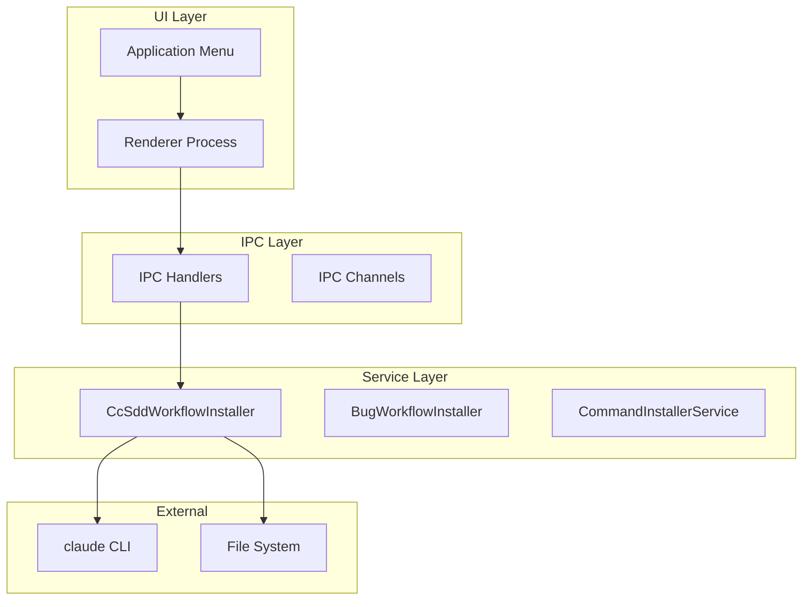
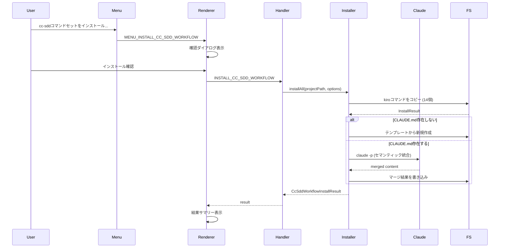

# Design Document

## Overview

本機能は、SDD ManagerのElectronアプリケーションにおいて、cc-sdd（Claude Code Spec-Driven Development）コマンドセットを外部プロジェクトにインストールする機能を提供する。

**Purpose**: 開発者が外部プロジェクトにcc-sddワークフローを簡単に導入できるようにし、14種類のkiroコマンドおよび関連テンプレートを一括インストールする。

**Users**: SDD Managerを使用する開発者がツールメニューからコマンドセットをターゲットプロジェクトにインストールする。

**Impact**: 既存のBugWorkflowInstallerパターンを踏襲し、新たにCcSddWorkflowInstallerサービスを追加する。CLAUDE.mdのセマンティック統合により、ユーザーのカスタマイズを保持しながら新機能を追加する。

### Goals

- 14種類のcc-sddコマンドを外部プロジェクトに一括インストール
- CLAUDE.mdのセマンティック統合（`claude -p`使用）
- 既存のBugWorkflowInstallerと並行動作
- GUIメニューからのシンプルな操作

### Non-Goals

- コマンドファイルの自動更新機能
- プロジェクト間のコマンド同期
- spec-managerコマンドのインストール（既存CommandInstallerServiceが担当）
- kiro設定ファイル（`.kiro/settings/`）のインストール

## Architecture

### Existing Architecture Analysis

現在のアーキテクチャでは以下のインストーラーパターンが確立されている：

- **CommandInstallerService**: spec-managerコマンドとSDD設定のインストール
- **BugWorkflowInstaller**: Bug Workflowコマンド（5種類）とテンプレートのインストール

両サービスは同一のインターフェース構造（`InstallOptions`, `InstallResult`, `InstallError`）を使用し、`getTemplateDir()`で取得したテンプレートディレクトリからファイルをコピーする。

### Architecture Pattern & Boundary Map



**Architecture Integration**:
- Selected pattern: Service Pattern（既存のmain/services/構造に準拠）
- Domain boundaries: CcSddWorkflowInstallerはkiroコマンドのみを管理し、spec-managerコマンドやBugコマンドには触れない
- Existing patterns preserved: InstallOptions/InstallResult/InstallErrorインターフェース、getTemplateDir()パターン
- New components rationale: CcSddWorkflowInstallerは14種類のkiroコマンドを専門に扱うため、既存サービスとは分離
- Steering compliance: Electron固有構造（main/services/）に配置

### Technology Stack

| Layer | Choice / Version | Role in Feature | Notes |
|-------|------------------|-----------------|-------|
| Backend / Services | Node.js + TypeScript | CcSddWorkflowInstallerサービス | Electron main process |
| CLI Integration | claude CLI | CLAUDE.mdセマンティック統合 | `claude -p`コマンド使用 |
| IPC | Electron IPC | メニュー⇔サービス間通信 | contextBridge + preload |

## System Flows

### Install Flow Sequence



**Key Decisions**:
- CLAUDE.mdが存在しない場合は専用テンプレートから新規作成
- 既存CLAUDE.mdがある場合は`claude -p`でセマンティック統合を実行
- タイムアウトは60秒に設定（要件4.4）

## Requirements Traceability

| Requirement | Summary | Components | Interfaces | Flows |
|-------------|---------|------------|------------|-------|
| 1.1, 1.2 | spec-managerテンプレートにdocument-reviewコマンド追加 | spec-manager templates | N/A | テンプレート準備 |
| 1.3, 1.4 | コマンド参照変換（/kiro:* → /spec-manager:*） | Template files | N/A | テンプレート準備 |
| 2.1-2.5 | kiroテンプレートフォルダ作成（14コマンド） | kiro templates | N/A | テンプレート準備 |
| 3.1-3.8 | CcSddWorkflowInstallerサービス実装 | CcSddWorkflowInstaller | installCommands, installAll, checkInstallStatus | Install Flow |
| 4.1-4.8 | CLAUDE.mdセマンティック統合 | CcSddWorkflowInstaller | updateClaudeMd | Install Flow |
| 5.1-5.5 | メニュー統合 | Menu, Renderer, IPC | MENU_INSTALL_CC_SDD_WORKFLOW | Install Flow |
| 6.1-6.5 | インストール結果とステータス管理 | CcSddWorkflowInstaller | InstallResult, InstallStatus | Install Flow |
| 7.1-7.4 | 既存コマンドとの互換性 | CcSddWorkflowInstaller | 共通インターフェース | 並行動作 |

## Components and Interfaces

### Component Summary

| Component | Domain/Layer | Intent | Req Coverage | Key Dependencies (P0/P1) | Contracts |
|-----------|--------------|--------|--------------|--------------------------|-----------|
| CcSddWorkflowInstaller | Service | kiroコマンドとCLAUDE.mdのインストール | 3.1-3.8, 4.1-4.8, 6.1-6.5, 7.1-7.4 | claude CLI (P0), FS (P0) | Service |
| Template Files | Resources | kiroコマンドテンプレート14種 | 1.1-1.4, 2.1-2.5 | N/A | N/A |
| IPC Channels | IPC | メニュー⇔サービス間通信 | 5.1-5.5 | Electron IPC (P0) | Service |
| Menu Integration | UI | ツールメニューにエントリ追加 | 5.1-5.5 | Menu module (P0) | State |

### Service Layer

#### CcSddWorkflowInstaller

| Field | Detail |
|-------|--------|
| Intent | kiroコマンドセット（14種類）とCLAUDE.mdをターゲットプロジェクトにインストール |
| Requirements | 3.1-3.8, 4.1-4.8, 6.1-6.5, 7.1-7.4 |

**Responsibilities & Constraints**
- kiroコマンドファイルのコピー（14種類）
- CLAUDE.mdの作成またはセマンティック統合
- 既存ファイルの上書き/スキップ制御
- インストールステータスの確認

**Dependencies**
- External: claude CLI - CLAUDE.mdセマンティック統合 (P0)
- External: Node.js fs/promises - ファイル操作 (P0)
- Inbound: IPC Handlers - サービス呼び出し (P0)

**Contracts**: Service [x]

##### Service Interface

```typescript
/**
 * cc-sdd コマンド一覧（14種類）
 */
export const CC_SDD_COMMANDS = [
  // Spec Workflow (7)
  'spec-init',
  'spec-requirements',
  'spec-design',
  'spec-tasks',
  'spec-impl',
  'spec-status',
  'spec-quick',
  // Validation (3)
  'validate-gap',
  'validate-design',
  'validate-impl',
  // Document Review (2)
  'document-review',
  'document-review-reply',
  // Steering (2)
  'steering',
  'steering-custom',
] as const;

/**
 * cc-sdd エージェント一覧（9種類）
 * Claude Code subagent として使用されるエージェント定義ファイル
 */
export const CC_SDD_AGENTS = [
  // Spec Agents (4)
  'spec-design',
  'spec-impl',
  'spec-requirements',
  'spec-tasks',
  // Steering Agents (2)
  'steering',
  'steering-custom',
  // Validation Agents (3)
  'validate-design',
  'validate-gap',
  'validate-impl',
] as const;

/**
 * CLAUDE.mdに追加するcc-sddワークフローセクション
 * Feature Development (Full SDD) と Bug Fix (Lightweight Workflow) を含む
 */
export const CC_SDD_WORKFLOW_CLAUDE_MD_SECTION = `## Minimal Workflow

### Feature Development (Full SDD)

- Phase 0 (optional): \`/kiro:steering\`, \`/kiro:steering-custom\`
- Phase 1 (Specification):
  - \`/kiro:spec-init "description"\`
  - \`/kiro:spec-requirements {feature}\`
  - \`/kiro:validate-gap {feature}\` (optional: for existing codebase)
  - \`/kiro:spec-design {feature} [-y]\`
  - \`/kiro:validate-design {feature}\` (optional: design review)
  - \`/kiro:spec-tasks {feature} [-y]\`
- Phase 2 (Implementation): \`/kiro:spec-impl {feature} [tasks]\`
  - \`/kiro:validate-impl {feature}\` (optional: after implementation)
- Progress check: \`/kiro:spec-status {feature}\` (use anytime)

### Bug Fix (Lightweight Workflow)

小規模なバグ修正にはフルSDDプロセスは不要。以下の軽量ワークフローを使用：

\\\`\\\`\\\`
Report → Analyze → Fix → Verify
\\\`\\\`\\\`

| コマンド | 説明 |
|---------|------|
| \`/kiro:bug-create <name> "description"\` | バグレポート作成 |
| \`/kiro:bug-analyze [name]\` | 根本原因の調査 |
| \`/kiro:bug-fix [name]\` | 修正の実装 |
| \`/kiro:bug-verify [name]\` | 修正の検証 |
| \`/kiro:bug-status [name]\` | 進捗確認 |

**使い分け**:
- **小規模バグ**: Bug Fixワークフロー（軽量・高速）
- **設計変更を伴う複雑なバグ**: Full SDDワークフロー`;

/**
 * Install options
 */
export interface InstallOptions {
  readonly force?: boolean;
}

/**
 * Install result
 */
export interface InstallResult {
  readonly installed: readonly string[];
  readonly skipped: readonly string[];
  readonly overwritten: readonly string[];
}

/**
 * CLAUDE.md update result
 */
export interface ClaudeMdUpdateResult {
  readonly action: 'created' | 'merged' | 'skipped';
  readonly reason?: 'already_exists';
}

/**
 * Full install result
 */
export interface CcSddWorkflowInstallResult {
  readonly commands: InstallResult;
  readonly agents: InstallResult;
  readonly claudeMd: ClaudeMdUpdateResult;
}

/**
 * Install status
 */
export interface CcSddWorkflowInstallStatus {
  readonly commands: {
    readonly installed: readonly string[];
    readonly missing: readonly string[];
  };
  readonly agents: {
    readonly installed: readonly string[];
    readonly missing: readonly string[];
  };
  readonly claudeMd: {
    readonly exists: boolean;
    readonly hasCcSddSection: boolean;
  };
}

/**
 * Install error types
 */
export type InstallError =
  | { type: 'TEMPLATE_NOT_FOUND'; path: string }
  | { type: 'WRITE_ERROR'; path: string; message: string }
  | { type: 'PERMISSION_DENIED'; path: string }
  | { type: 'MERGE_ERROR'; message: string }
  | { type: 'TIMEOUT_ERROR'; timeoutMs: number };

/**
 * Result type
 */
export type Result<T, E> =
  | { ok: true; value: T }
  | { ok: false; error: E };

/**
 * CcSddWorkflowInstaller Service
 */
export class CcSddWorkflowInstaller {
  constructor(templateDir: string);

  /**
   * Install cc-sdd commands to project
   * @param projectPath - Project root path
   * @param options - Install options
   * @returns Result with installed/skipped/overwritten commands
   */
  installCommands(
    projectPath: string,
    options?: InstallOptions
  ): Promise<Result<InstallResult, InstallError>>;

  /**
   * Install cc-sdd agents to project
   * @param projectPath - Project root path
   * @param options - Install options
   * @returns Result with installed/skipped/overwritten agents
   */
  installAgents(
    projectPath: string,
    options?: InstallOptions
  ): Promise<Result<InstallResult, InstallError>>;

  /**
   * Update CLAUDE.md with cc-sdd workflow section
   * Uses claude -p for semantic merge if file exists
   * @param projectPath - Project root path
   * @returns Result with action taken
   */
  updateClaudeMd(
    projectPath: string
  ): Promise<Result<ClaudeMdUpdateResult, InstallError>>;

  /**
   * Install all cc-sdd workflow components
   * @param projectPath - Project root path
   * @param options - Install options
   * @returns Full install result
   */
  installAll(
    projectPath: string,
    options?: InstallOptions
  ): Promise<Result<CcSddWorkflowInstallResult, InstallError>>;

  /**
   * Check installation status
   * @param projectPath - Project root path
   * @returns Current install status
   */
  checkInstallStatus(projectPath: string): Promise<CcSddWorkflowInstallStatus>;
}
```

- Preconditions: templateDirにテンプレートファイルが存在すること
- Postconditions: 成功時、ターゲットプロジェクトにコマンドファイル、エージェントファイル、CLAUDE.mdが配置される
- Invariants: 既存のBugWorkflowInstallerやCommandInstallerServiceのファイルには影響しない

**Implementation Notes**
- Integration: `handlers.ts`にIPCハンドラを追加、`menu.ts`にメニューエントリを追加
- Validation: テンプレートファイルの存在確認、書き込み権限確認
- Risks: `claude -p`コマンドが利用不可の場合はMERGE_ERRORを返す

### IPC Layer

#### IPC Channels

| Field | Detail |
|-------|--------|
| Intent | メニューからサービスへのインストール要求とレスポンス |
| Requirements | 5.1-5.5 |

**New Channels**

```typescript
// Menu Events - cc-sdd Workflow
MENU_INSTALL_CC_SDD_WORKFLOW: 'menu:install-cc-sdd-workflow',

// cc-sdd Workflow Install
CHECK_CC_SDD_WORKFLOW_STATUS: 'ipc:check-cc-sdd-workflow-status',
INSTALL_CC_SDD_WORKFLOW: 'ipc:install-cc-sdd-workflow',
```

### Resources Layer

#### Template Files

| Field | Detail |
|-------|--------|
| Intent | インストール対象のkiroコマンドテンプレート |
| Requirements | 1.1-1.4, 2.1-2.5 |

**Directory Structure**

```
resources/templates/
├── commands/
│   └── kiro/
│       ├── spec-init.md
│       ├── spec-requirements.md
│       ├── spec-design.md
│       ├── spec-tasks.md
│       ├── spec-impl.md
│       ├── spec-status.md
│       ├── spec-quick.md
│       ├── validate-gap.md
│       ├── validate-design.md
│       ├── validate-impl.md
│       ├── document-review.md
│       ├── document-review-reply.md
│       ├── steering.md
│       └── steering-custom.md
│   └── spec-manager/
│       ├── document-review.md      (新規: /spec-manager:*形式)
│       └── document-review-reply.md (新規: /spec-manager:*形式)
├── agents/
│   └── kiro/
│       ├── spec-design.md
│       ├── spec-impl.md
│       ├── spec-requirements.md
│       ├── spec-tasks.md
│       ├── steering.md
│       ├── steering-custom.md
│       ├── validate-design.md
│       ├── validate-gap.md
│       └── validate-impl.md
└── CLAUDE.md
```

**Command Reference Conversion (1.3, 1.4)**

spec-managerテンプレート内のコマンド参照変換例：
- `/kiro:spec-impl` → `/spec-manager:spec-impl`
- `/kiro:spec-status` → `/spec-manager:spec-status`

### UI Layer

#### Menu Integration

| Field | Detail |
|-------|--------|
| Intent | ツールメニューにcc-sddインストールエントリを追加 |
| Requirements | 5.1-5.5 |

**Menu Entry**

```typescript
{
  label: 'cc-sddコマンドセットをインストール...',
  enabled: currentProjectPathForMenu !== null,
  click: async () => {
    const window = BrowserWindow.getFocusedWindow() || BrowserWindow.getAllWindows()[0];
    if (!window) return;
    window.webContents.send(IPC_CHANNELS.MENU_INSTALL_CC_SDD_WORKFLOW);
  },
}
```

**State Management**
- プロジェクト未選択時はメニュー項目を無効化（要件5.5）
- インストール確認ダイアログを表示（要件5.2）
- 結果サマリーを表示（要件5.3）

## Data Models

### Domain Model

本機能で扱うデータは主にファイルパスとインストール結果であり、永続化が必要なドメインエンティティは存在しない。

**Value Objects**:
- `InstallResult`: インストール結果（installed, skipped, overwritten）
- `InstallStatus`: インストール状況（コマンド一覧、CLAUDE.md状態）
- `InstallError`: エラー情報（type, path/message）

### Data Contracts & Integration

**IPC Data Transfer**

```typescript
// Request
interface InstallCcSddWorkflowRequest {
  projectPath: string;
  force?: boolean;
}

// Response
type InstallCcSddWorkflowResponse = Result<CcSddWorkflowInstallResult, InstallError>;

// Status Check
interface CcSddWorkflowStatusResponse {
  commands: {
    installed: string[];
    missing: string[];
  };
  claudeMd: {
    exists: boolean;
    hasCcSddSection: boolean;
  };
}
```

## Error Handling

### Error Strategy

エラーは`Result<T, E>`型で返却し、呼び出し側で適切に処理する。

### Error Categories and Responses

| Error Type | Cause | Response |
|------------|-------|----------|
| TEMPLATE_NOT_FOUND | テンプレートファイルが見つからない | エラーメッセージ表示、インストール中止 |
| WRITE_ERROR | ファイル書き込み失敗 | エラーメッセージ表示、部分的な結果を返却 |
| PERMISSION_DENIED | 書き込み権限なし | エラーメッセージ表示、権限付与を促す |
| MERGE_ERROR | claude -p統合失敗 | エラーメッセージ表示、手動統合を促す |
| TIMEOUT_ERROR | claude -p 60秒タイムアウト | エラーメッセージ表示、再試行を促す |

### Monitoring

- エラー発生時はlogger.errorでログ出力
- インストール結果はlogger.infoでログ出力

## Testing Strategy

### Unit Tests

1. **CcSddWorkflowInstaller.installCommands**
   - 正常系：全14コマンドがインストールされる
   - スキップ系：既存ファイルがスキップされる
   - 上書き系：force=trueで上書きされる
   - エラー系：テンプレート不在時にTEMPLATE_NOT_FOUND

2. **CcSddWorkflowInstaller.updateClaudeMd**
   - 新規作成：CLAUDE.md不在時に作成される
   - セマンティック統合：既存CLAUDE.mdとの統合
   - スキップ：既にcc-sddセクションが存在する場合

3. **CcSddWorkflowInstaller.checkInstallStatus**
   - インストール済み/未インストールの正確な検出
   - CLAUDE.mdのcc-sddセクション検出

### Integration Tests

1. **Menu → IPC → Service連携**
   - メニュー選択からインストール完了までのフロー
   - 確認ダイアログの表示と応答
   - 結果サマリーの表示

2. **並行動作テスト**
   - BugWorkflowInstallerとの並行実行
   - 互いのファイルに影響しないことの確認

### Mocking Strategy

**claude CLI モック方針**

`claude -p` コマンドのテストでは、`child_process.spawn` をモックして標準出力をシミュレートする。

```typescript
// テスト用モックパターン
jest.mock('child_process', () => ({
  spawn: jest.fn().mockImplementation((cmd, args) => {
    // モック用のChildProcessオブジェクトを返却
    const mockProcess = new EventEmitter();
    mockProcess.stdout = new EventEmitter();
    mockProcess.stderr = new EventEmitter();

    // 成功ケース：マージ結果を標準出力
    setTimeout(() => {
      mockProcess.stdout.emit('data', Buffer.from('merged CLAUDE.md content'));
      mockProcess.emit('close', 0);
    }, 10);

    return mockProcess;
  }),
}));
```

**テストシナリオ**:
- 正常終了（exit code 0）：マージ結果を返却
- コマンド失敗（exit code != 0）：MERGE_ERRORを返却
- タイムアウト（60秒超過）：TIMEOUT_ERRORを返却
- コマンド未発見（ENOENT）：MERGE_ERRORを返却

### E2E Tests

1. **フルインストールフロー**
   - 空のプロジェクトへの全コマンドインストール
   - 既存CLAUDE.mdへのセマンティック統合
   - インストール結果の確認

## Security Considerations

- 外部コマンド（`claude -p`）の実行は環境変数PATHを使用
- ファイル書き込みは指定されたプロジェクトパス内に限定
- テンプレートファイルは読み取り専用として扱う
