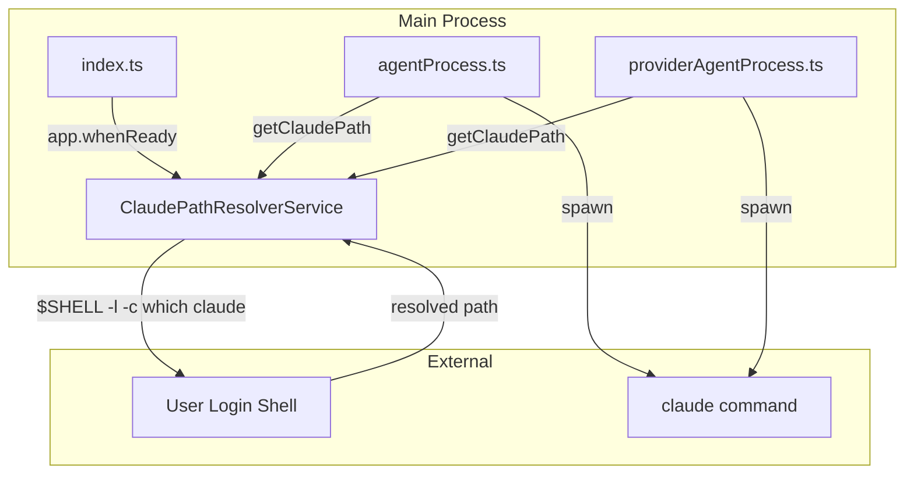
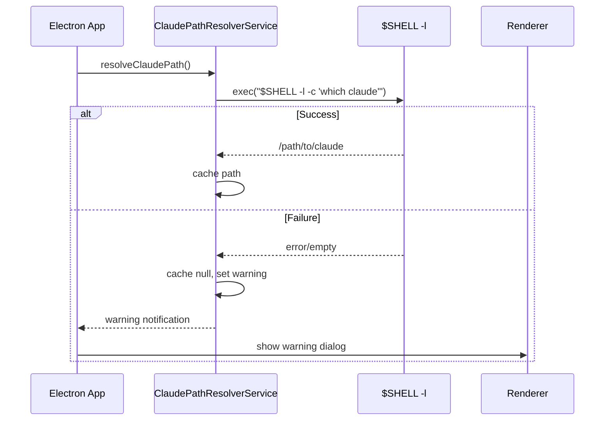

# Design: Claude Path Resolver

## Overview

**Purpose**: 本機能は、アプリケーション起動時に `claude` コマンドのフルパスを動的に解決し、GUIアプリ特有のPATH問題（シェルプロファイルが読み込まれない）を解消する。

**Users**: SDD Orchestratorを使用する開発者。異なる環境でClaude Codeをインストールしているユーザーが、設定不要でエージェントを起動できるようになる。

**Impact**: 既存の `agentProcess.ts` および `providerAgentProcess.ts` からハードコードされたPATH追加を削除し、動的に解決されたパスを使用するように変更する。

### Goals

- アプリ起動時にユーザーのログインシェル経由で `claude` コマンドのフルパスを解決する
- 解決したパスをアプリ終了までキャッシュし、Agent起動時に使用する
- パス解決失敗時は明確なワーニング通知をユーザーに表示する
- ハードコードされたPATH追加（`/opt/homebrew/bin:/usr/local/bin`）を削除する

### Non-Goals

- 設定画面でのパス手動指定機能
- 複数のパス候補へのフォールバック
- パス解決失敗時の自動リトライ
- `claude` 以外のコマンドのパス解決

## Architecture

### Existing Architecture Analysis

現在、`agentProcess.ts` および `providerAgentProcess.ts` では、spawn時に以下のようにハードコードされたPATHを環境変数に追加している:

```typescript
env: {
  ...process.env,
  PATH: `/opt/homebrew/bin:/usr/local/bin:${process.env.PATH || ''}`,
}
```

この方式の問題点:
- ユーザーがClaude Codeを異なる場所にインストールしている場合に対応できない
- Homebrewの標準パスに依存しており、異なるパッケージマネージャーやカスタムインストールに対応できない
- GUIアプリ起動時はシェルプロファイルが読み込まれないため、ユーザーの実際のPATH設定が反映されない

### Architecture Pattern & Boundary Map



**Architecture Integration**:
- Selected pattern: シングルトンサービスによるパス解決とキャッシュ
- Domain boundaries: パス解決ロジックを独立したサービスに分離
- Existing patterns preserved: 既存の `cloudflaredBinaryChecker.ts` と同様のパターン
- New components rationale: パス解決ロジックをagentProcessから分離し、再利用性と保守性を向上
- Steering compliance: DRY（パス解決を一箇所に集約）、KISS（シンプルなwhichコマンド実行）

### Technology Stack

| Layer | Choice / Version | Role in Feature | Notes |
|-------|------------------|-----------------|-------|
| Backend / Services | Node.js child_process | シェルコマンド実行 | ログインシェルでのwhich実行 |
| Infrastructure / Runtime | Electron 35 | アプリ起動時フック | app.whenReady内で初期化 |

## System Flows

### Path Resolution Flow



**Key Decisions**:
- ログインシェル (`-l` フラグ) を使用してユーザーのプロファイルを確実に読み込む
- `$SHELL` 環境変数でユーザーのデフォルトシェルを検出（zsh, bash等に対応）
- 起動時に一度だけ解決してキャッシュすることで、Agent実行時のオーバーヘッドを排除

## Requirements Traceability

| Criterion ID | Summary | Components | Implementation Approach |
|--------------|---------|------------|------------------------|
| 1.1 | which claude をログインシェル内で実行 | ClaudePathResolverService | 新規実装: exec で `$SHELL -l -c 'which claude'` を実行 |
| 1.2 | $SHELL でデフォルトシェル検出、-l フラグ使用 | ClaudePathResolverService | 新規実装: 環境変数から取得、フォールバックとして /bin/sh |
| 1.3 | 解決パスをセッション中キャッシュ | ClaudePathResolverService | 新規実装: シングルトンインスタンスにキャッシュ |
| 1.4 | Agent起動時にキャッシュパスを使用 | agentProcess.ts, providerAgentProcess.ts | 既存更新: getClaudePath()を呼び出しcommandに使用 |
| 2.1 | パス解決失敗時にワーニング通知 | ClaudePathResolverService, index.ts | 新規実装: 解決結果を返却、index.tsで通知処理 |
| 2.2 | ワーニングメッセージ内容 | index.ts | 新規実装: 日本語メッセージをdialog.showMessageBox |
| 2.3 | 起動時に一度だけワーニング表示 | index.ts | 新規実装: resolveClaudePath()の戻り値で判定 |
| 2.4 | 自動フォールバック実装しない | ClaudePathResolverService | 新規実装: フォールバックロジックなし |
| 3.1 | ハードコードPATH追加を削除 | agentProcess.ts | 既存更新: PATH環境変数操作を削除 |
| 3.2 | 解決パスのみで実行 | agentProcess.ts, providerAgentProcess.ts | 既存更新: getClaudePath()のフルパスを直接使用 |

### Coverage Validation Checklist

- [x] Every criterion ID from requirements.md appears in the table above
- [x] Each criterion has specific component names (not generic references)
- [x] Implementation approach distinguishes "reuse existing" vs "new implementation"
- [x] User-facing criteria specify concrete UI components (not just "shared components")

## Components and Interfaces

| Component | Domain/Layer | Intent | Req Coverage | Key Dependencies | Contracts |
|-----------|--------------|--------|--------------|------------------|-----------|
| ClaudePathResolverService | Main/Services | claudeコマンドパス解決・キャッシュ | 1.1, 1.2, 1.3, 2.1, 2.4 | child_process (P0) | Service |
| agentProcess.ts | Main/Services | Agent起動時にパス取得 | 1.4, 3.1, 3.2 | ClaudePathResolverService (P0) | - |
| providerAgentProcess.ts | Main/Services | Provider Agent起動時にパス取得 | 1.4, 3.1, 3.2 | ClaudePathResolverService (P0) | - |
| index.ts | Main/Entry | 起動時パス解決・ワーニング表示 | 2.1, 2.2, 2.3 | ClaudePathResolverService (P0), Electron dialog (P0) | - |

### Main/Services

#### ClaudePathResolverService

| Field | Detail |
|-------|--------|
| Intent | アプリ起動時にclaudeコマンドのフルパスを解決しキャッシュする |
| Requirements | 1.1, 1.2, 1.3, 2.1, 2.4 |

**Responsibilities & Constraints**
- ログインシェル経由で `which claude` を実行しパスを解決
- 解決結果（成功/失敗）をアプリ終了までキャッシュ
- E2Eテスト用の環境変数オーバーライドをサポート

**Dependencies**
- Outbound: child_process.exec — シェルコマンド実行 (P0)

**Contracts**: Service [x]

##### Service Interface

```typescript
/**
 * パス解決結果
 */
interface ClaudePathResolutionResult {
  /** 解決成功の場合true */
  readonly resolved: boolean;
  /** 解決されたフルパス（失敗時はundefined） */
  readonly path?: string;
  /** 解決失敗時のエラーメッセージ */
  readonly error?: string;
}

/**
 * ClaudePathResolverService インターフェース
 */
interface ClaudePathResolverService {
  /**
   * claudeコマンドのパスを解決する（初回のみ実行、以降はキャッシュを返却）
   * @returns 解決結果
   */
  resolveClaudePath(): Promise<ClaudePathResolutionResult>;

  /**
   * キャッシュされたclaudeコマンドパスを取得
   * 未解決またはE2E環境変数設定時は適切な値を返却
   * @returns claudeコマンドのパスまたはコマンド名
   */
  getClaudePath(): string;

  /**
   * パス解決が成功したかどうか
   * @returns 解決成功時true
   */
  isResolved(): boolean;
}
```

- Preconditions:
  - resolveClaudePath(): アプリ起動後に呼び出される
- Postconditions:
  - resolveClaudePath(): キャッシュが設定される
  - getClaudePath(): 常に有効な文字列を返却（未解決時は 'claude'）
- Invariants:
  - 一度resolveClaudePathが成功したら、以降のgetClaudePathは同じ値を返す
  - E2E_MOCK_CLAUDE_COMMAND 環境変数が設定されている場合は常にその値を返す

**Implementation Notes**
- Integration: 既存の `getClaudeCommand()` 関数を本サービスの `getClaudePath()` に置き換える
- Validation: 解決されたパスの実行可能性チェックは行わない（whichコマンドが保証）
- Risks: ログインシェルの起動に時間がかかる可能性（数秒）→ 起動時に非同期で実行し、UIブロックを回避

## Data Models

### Domain Model

本機能で新たなデータ永続化は発生しない。キャッシュはインメモリのみ。

**Cache State**:
- `resolvedPath: string | null` — 解決されたパス（未解決時はnull）
- `isInitialized: boolean` — resolveClaudePath()が呼ばれたかどうか

## Error Handling

### Error Strategy

パス解決失敗時はユーザーへのワーニング通知のみ。アプリの起動は続行する。

### Timeout Configuration

| Parameter | Value | Rationale |
|-----------|-------|-----------|
| シェルコマンド実行タイムアウト | 5000ms (5秒) | ログインシェル起動とプロファイル読み込みに十分な時間を確保しつつ、過度な待機を防ぐ |

### Error Categories and Responses

**User Errors (Warning)**:
- Claude Codeがインストールされていない → 日本語ワーニングメッセージ表示
- PATHが通っていない → 同上

**System Errors (Silent)**:
- シェル実行タイムアウト（5秒超過） → フォールバックとして 'claude' をそのまま使用
- $SHELL未設定 → /bin/sh をフォールバックとして使用

## Testing Strategy

### Unit Tests

1. **resolveClaudePath() 成功ケース**: whichコマンドがパスを返した場合のキャッシュ設定
2. **resolveClaudePath() 失敗ケース**: whichコマンドが失敗した場合のエラーハンドリング
3. **getClaudePath() キャッシュ動作**: 解決前後での返却値の違い
4. **E2E環境変数オーバーライド**: E2E_MOCK_CLAUDE_COMMAND設定時の動作

### Integration Tests

1. **agentProcess.ts統合**: getClaudePath()がspawnのcommandに正しく使用されること
2. **providerAgentProcess.ts統合**: 同上

## Verification Contract

### User Journey Definition

| Journey ID | Operation Flow | Expected Result | E2E Required |
|------------|---------------|-----------------|--------------|
| UJ-001 | アプリ起動 → Agentを実行 | claudeコマンドが正しいパスで実行される | No |
| UJ-002 | Claude Code未インストール状態でアプリ起動 | ワーニングダイアログが表示される | No |

**Note**: 本機能のE2Eテストは不要。理由:
- UJ-001: 既存のE2Eテストで `E2E_MOCK_CLAUDE_COMMAND` を使用しており、実際のパス解決はテストされない
- UJ-002: Claude Code未インストール環境の再現が困難であり、ユニットテストでカバー

### Impact Analysis Contract

| Target File | Action | Reason |
|-------------|--------|--------|
| src/main/services/claudePathResolverService.ts | CREATE | パス解決サービスの新規実装 |
| src/main/services/agentProcess.ts | UPDATE | getClaudeCommand()をgetClaudePath()に置換、PATH環境変数操作を削除 |
| src/main/services/providerAgentProcess.ts | UPDATE | PATH環境変数操作を削除、getClaudePath()使用 |
| src/main/index.ts | UPDATE | resolveClaudePath()呼び出しとワーニング表示ロジック追加 |

## Design Decisions

### DD-001: ログインシェル経由でのパス解決

| Field | Detail |
|-------|--------|
| Status | Accepted |
| Context | GUIアプリ起動時はシェルプロファイルが読み込まれないため、`process.env.PATH` に依存したコマンド解決では不十分 |
| Decision | ユーザーのデフォルトシェル（`$SHELL`）を `-l`（ログインシェル）オプションで起動し、その中で `which claude` を実行 |
| Rationale | ログインシェルとして起動することで、`.zshrc` や `.bash_profile` 等のプロファイルが読み込まれ、ユーザー環境と同じPATH設定でコマンドを探索できる |
| Alternatives Considered | (1) ハードコードパスの拡充 — 保守性が低い、すべての環境に対応不可; (2) 設定画面での手動指定 — ユーザー体験が悪化 |
| Consequences | 起動時に追加の子プロセス起動が発生（数百ミリ秒程度） |

### DD-002: 起動時一度解決・キャッシュ方式

| Field | Detail |
|-------|--------|
| Status | Accepted |
| Context | Agent実行のたびにパスを解決するか、起動時に一度だけ解決してキャッシュするか |
| Decision | アプリ起動時に一度解決し、アプリ終了までキャッシュする |
| Rationale | Agent実行のたびに `which` を実行するのはオーバーヘッドが大きい。通常、アプリ実行中にPATH設定が変わることは稀 |
| Alternatives Considered | Agent実行ごとに解決 — 毎回のwhich実行でレイテンシ増加 |
| Consequences | アプリ実行中にClaude Codeのインストール場所が変わった場合は再起動が必要 |

### DD-003: 自動フォールバック非実装

| Field | Detail |
|-------|--------|
| Status | Accepted |
| Context | パス解決失敗時に自動フォールバック（設定画面での手動指定、よくあるパスへのフォールバック等）を実装するか |
| Decision | 自動フォールバックは実装しない。ワーニング通知のみ |
| Rationale | シンプルさを優先。ユーザーが自分の環境でClaude Codeを正しくインストールしていれば問題は発生しない。問題がある場合は明確に通知することで、ユーザー自身が対処できる |
| Alternatives Considered | (1) 設定画面でのパス手動指定 — 複雑化; (2) よくあるパスへのフォールバック — 現状のハードコードと同じ問題が残る |
| Consequences | Claude Codeが正しくインストールされていない場合、ユーザーは自分で対処する必要がある |
