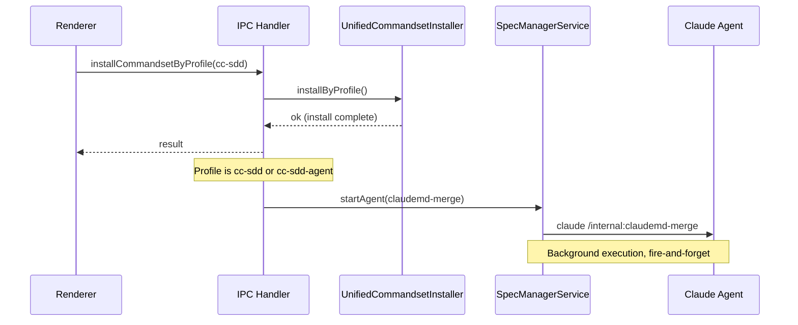
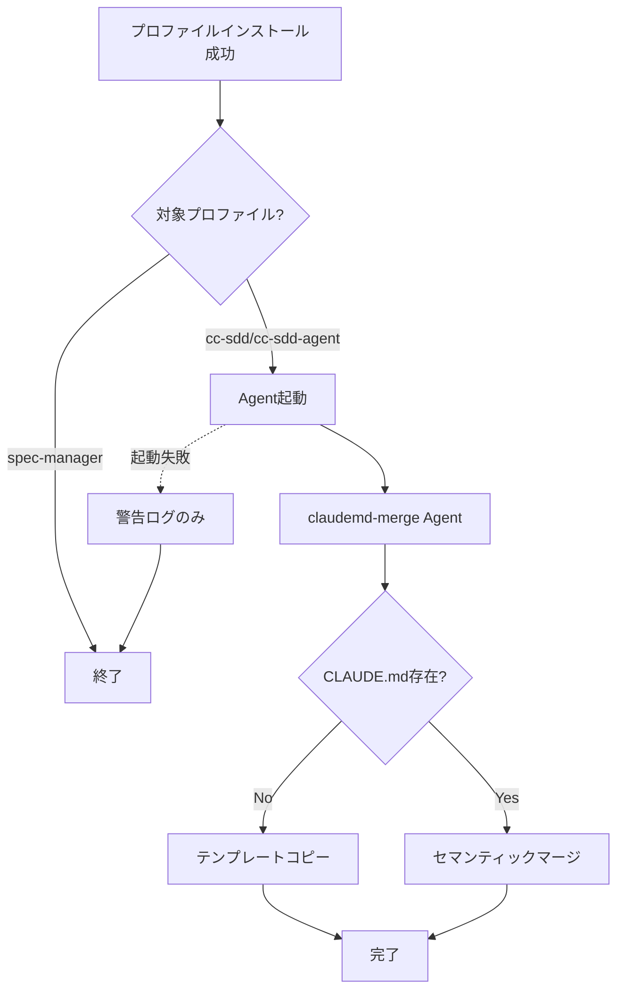

# Design: CLAUDE.md Profile Install Merge

## Overview

**Purpose**: プロファイルインストール時にCLAUDE.mdのセマンティックマージをProject Agent経由で自動実行する機能を実装する。これにより、コマンドセットインストールと同時にCLAUDE.mdが適切に設定される。

**Users**: 開発者がcc-sdd/cc-sdd-agentプロファイルをインストールする際に、自動的にCLAUDE.mdがセットアップされる。

**Impact**: 既存の未使用コード（UIダイアログ、IPCチャネル、サービスメソッド）を削除し、コードベースを整理する。

### Goals
- CLAUDE.mdマージをProject Agent経由で実行（verification-commands.mdと同じパターン）
- cc-sdd/cc-sdd-agentプロファイルインストール成功後に自動的にAgentを起動
- テンプレートからプレースホルダーを削除して即座に使用可能な状態にする
- 未使用のコード（UIダイアログ、IPCチャネル、サービスメソッド）を削除

### Non-Goals
- spec-managerプロファイルでのCLAUDE.mdマージ対応
- CLAUDE.mdマージの進捗表示UI
- マージ結果の確認UI
- マージ失敗時のリトライ機能

## Architecture

### Existing Architecture Analysis

現在のCLAUDE.md処理には以下の問題がある:
1. `ClaudeMdInstallDialog.tsx`: UIダイアログが存在するが到達不可能
2. `commandInstallerService.semanticMergeClaudeMd()`: `claude -p`を直接spawn（Agentパターンではない）
3. `ccSddWorkflowInstaller.updateClaudeMd()`: 同様に`claude -p`を直接spawn
4. 複数のIPCチャネル（`CHECK_CLAUDE_MD_EXISTS`, `INSTALL_CLAUDE_MD`等）が未使用

### Architecture Pattern & Boundary Map



**Architecture Integration**:
- Selected pattern: Agentベース実行（既存のProject Agent実行パターンに準拠）
- Domain/feature boundaries: インストール処理はUnifiedCommandsetInstaller、Agent起動はSpecManagerService
- Existing patterns preserved: `steering-verification`と同じパターンでAgent起動
- New components rationale: claudemd-merge Agent定義ファイルのみ新規追加
- Steering compliance: DRY（既存Agent実行基盤を再利用）、KISS（シンプルなfire-and-forget）

### Technology Stack

| Layer | Choice / Version | Role in Feature | Notes |
|-------|------------------|-----------------|-------|
| Backend / Services | Node.js (Electron 35) | IPCハンドラ、Agent起動 | 既存 |
| Agent Runtime | Claude Code | セマンティックマージ実行 | 既存 |

## System Flows

### CLAUDE.mdマージフロー



**Key Decisions**:
- Agent起動は非同期で実行し、インストール結果は即座に返す（fire-and-forget）
- Agent起動失敗時もプロファイルインストール自体は成功扱い（付随的処理）
- テンプレートからプレースホルダーを事前に削除し、Agentでの展開は不要

## Requirements Traceability

| Criterion ID | Summary | Components | Implementation Approach |
|--------------|---------|------------|------------------------|
| 1.1 | Agent定義ファイル存在 | claudemd-merge.md | 新規作成 |
| 1.2 | CLAUDE.md存在確認 | claudemd-merge Agent | Agent内で判定 |
| 1.3 | 存在しない場合テンプレートコピー | claudemd-merge Agent | Agent内でファイル操作 |
| 1.4 | 存在する場合セマンティックマージ | claudemd-merge Agent | Agent内でマージ実行 |
| 1.5 | マージルール | claudemd-merge Agent | Agent定義に記述 |
| 2.1 | インストール成功後にAgent起動 | installHandlers.ts | 既存ハンドラ拡張 |
| 2.2 | 対象プロファイルcc-sdd/cc-sdd-agent | installHandlers.ts | 条件分岐追加 |
| 2.3 | spec-managerは対象外 | installHandlers.ts | 条件分岐で除外 |
| 2.4 | バックグラウンド実行 | installHandlers.ts | 非同期起動（await不要） |
| 2.5 | インストール結果は即座に返却 | installHandlers.ts | Agent起動前にreturn |
| 2.6 | Agent起動失敗時も成功扱い | installHandlers.ts | try-catch + 警告ログ |
| 3.1 | `{{KIRO_DIR}}`を`.kiro`に置換 | CLAUDE.md template | テンプレート編集 |
| 3.2 | `{{DEV_GUIDELINES}}`を削除 | CLAUDE.md template | テンプレート編集 |
| 3.3 | 有効なMarkdown | CLAUDE.md template | テンプレート編集 |
| 4.1.1 | ClaudeMdInstallDialog削除 | ClaudeMdInstallDialog.tsx | ファイル削除 |
| 4.1.2 | index.tsからexport削除 | components/index.ts | export削除 |
| 4.2.1 | CHECK_CLAUDE_MD_EXISTSチャネル削除 | channels.ts | 行削除 |
| 4.2.2 | INSTALL_CLAUDE_MDチャネル削除 | channels.ts | 行削除 |
| 4.2.3 | CHECK_CC_SDD_WORKFLOW_STATUSチャネル削除 | channels.ts | 行削除 |
| 4.2.4 | INSTALL_CC_SDD_WORKFLOWチャネル削除 | channels.ts | 行削除 |
| 4.3.1 | CHECK_CLAUDE_MD_EXISTSハンドラ削除 | installHandlers.ts | コード削除 |
| 4.3.2 | INSTALL_CLAUDE_MDハンドラ削除 | installHandlers.ts | コード削除 |
| 4.3.3 | CHECK_CC_SDD_WORKFLOW_STATUSハンドラ削除 | installHandlers.ts | コード削除 |
| 4.3.4 | INSTALL_CC_SDD_WORKFLOWハンドラ削除 | installHandlers.ts | コード削除 |
| 4.4.1 | checkClaudeMdExists削除 | preload/index.ts | 行削除 |
| 4.4.2 | installClaudeMd削除 | preload/index.ts | 行削除 |
| 4.4.3 | checkCcSddWorkflowStatus削除 | preload/index.ts | 行削除 |
| 4.4.4 | installCcSddWorkflow削除 | preload/index.ts | 行削除 |
| 4.5.1 | Preload API型定義削除 | electron.d.ts | 型削除 |
| 4.6.1 | commandInstallerServiceメソッド削除 | commandInstallerService.ts | メソッド・型削除 |
| 4.6.2 | ccSddWorkflowInstallerメソッド削除 | ccSddWorkflowInstaller.ts | メソッド・定数・型削除 |
| 4.7.1 | 関連テスト更新/削除 | *.test.ts | テスト削除/更新 |

### Coverage Validation Checklist

- [x] Every criterion ID from requirements.md appears in the table above
- [x] Each criterion has specific component names (not generic references)
- [x] Implementation approach distinguishes "reuse existing" vs "new implementation"
- [x] User-facing criteria specify concrete UI components

## Components and Interfaces

| Component | Domain/Layer | Intent | Req Coverage | Key Dependencies | Contracts |
|-----------|--------------|--------|--------------|------------------|-----------|
| claudemd-merge.md | Agent定義 | CLAUDE.mdマージ実行 | 1.1-1.5 | Read, Write | - |
| installHandlers.ts | IPC/Backend | Agent起動追加 | 2.1-2.6 | SpecManagerService (P0) | Service |
| CLAUDE.md template | Template | プレースホルダー削除 | 3.1-3.3 | - | - |

### Agent Definition Layer

#### claudemd-merge Agent

| Field | Detail |
|-------|--------|
| Intent | CLAUDE.mdのセマンティックマージを実行 |
| Requirements | 1.1, 1.2, 1.3, 1.4, 1.5 |

**Responsibilities & Constraints**
- CLAUDE.md存在確認とマージ/コピーの判断
- テンプレート構造を維持しつつユーザーカスタマイズを保持
- プロジェクトルートでのファイル操作

**Dependencies**
- Inbound: SpecManagerService.startAgent() (P0)
- External: Claude Code Tools (Read, Write) (P0)

**Contracts**: Service [ ]

##### Agent Definition Structure

```markdown
# claudemd-merge Agent

## Role
CLAUDE.mdをセットアップするエージェント

## Execution Steps
1. CLAUDE.mdの存在確認
2. 存在しない場合: テンプレートをコピー
3. 存在する場合: セマンティックマージ実行

## Merge Rules
- テンプレート構造を基本とする
- ユーザーカスタマイズ（プロジェクト固有設定）を保持
- 重複セクションは統合
```

**Implementation Notes**
- Integration: `resources/templates/agents/kiro/claudemd-merge.md`に配置
- Validation: Agentはファイル存在を確認してから処理
- Risks: マージ失敗時は警告ログのみ（プロファイルインストールには影響なし）

### IPC Layer

#### INSTALL_COMMANDSET_BY_PROFILE Handler (Extension)

| Field | Detail |
|-------|--------|
| Intent | プロファイルインストール成功後にCLAUDE.mdマージAgentを起動 |
| Requirements | 2.1, 2.2, 2.3, 2.4, 2.5, 2.6 |

**Responsibilities & Constraints**
- プロファイルインストール成功後のフック処理
- 対象プロファイル（cc-sdd/cc-sdd-agent）の判定
- 非同期Agent起動（結果を待たない）

**Dependencies**
- Inbound: Renderer via IPC (P0)
- Outbound: SpecManagerService.startAgent() (P0)
- Outbound: UnifiedCommandsetInstaller.installByProfile() (P0)

**Contracts**: Service [x]

##### Service Interface

```typescript
// 既存ハンドラの拡張（新規メソッドではない）
// installHandlers.ts内のINSTALL_COMMANDSET_BY_PROFILEハンドラに以下のロジックを追加

interface ClaudeMdMergeAgentParams {
  specId: '';  // Project-level agent
  phase: 'claudemd-merge';
  command: 'claude';
  args: ['/internal:claudemd-merge'];
  group: 'doc';
}

// 起動条件: profileName === 'cc-sdd' || profileName === 'cc-sdd-agent'
// 起動タイミング: result.okがtrueの後、returnの前
// 起動方式: await不要（fire-and-forget）、try-catchで失敗時は警告ログのみ
```

- Preconditions: プロファイルインストールが成功している
- Postconditions: Agent起動を試行（成功/失敗に関わらず元の結果を返す）
- Invariants: プロファイルインストール結果は変更しない

**Implementation Notes**
- Integration: `steering-verification`と同じパターン（`specId: ''`, `group: 'doc'`）
- Validation: プロファイル名の条件チェックのみ
- Risks: Agent起動失敗は警告ログのみで吸収

## Data Models

### Template Changes

**CLAUDE.md Template**:
- `{{KIRO_DIR}}` -> `.kiro` に静的置換
- `{{DEV_GUIDELINES}}` -> 削除（空文字に置換）

変更前:
```markdown
- Steering: `{{KIRO_DIR}}/steering/`
- Specs: `{{KIRO_DIR}}/specs/`
{{DEV_GUIDELINES}}
```

変更後:
```markdown
- Steering: `.kiro/steering/`
- Specs: `.kiro/specs/`

```

## Error Handling

### Error Strategy

| Error Type | Handling | Impact |
|------------|----------|--------|
| Agent起動失敗 | 警告ログ出力 | プロファイルインストールは成功 |
| マージ失敗（Agent内） | Agentログに記録 | CLAUDE.md未更新 |
| テンプレート未存在 | Agentがエラーログ | CLAUDE.md未作成 |

### Monitoring
- Agent起動失敗: `logger.warn('[installHandlers] Failed to start claudemd-merge agent')`
- 正常起動: `logger.info('[installHandlers] claudemd-merge agent started')`

## Testing Strategy

### Unit Tests
- `installHandlers.test.ts`: cc-sdd/cc-sdd-agentプロファイルでAgent起動されることを検証
- `installHandlers.test.ts`: spec-managerプロファイルでAgent起動されないことを検証
- `installHandlers.test.ts`: Agent起動失敗時も元の結果が返されることを検証

### Integration Tests
- なし（Agent実行はClaude CLIに依存するためE2Eで検証）

### E2E Tests
- 既存のプロファイルインストールテストの更新（削除コードのテスト削除）

## Design Decisions

### DD-001: Agent実行方式の選択

| Field | Detail |
|-------|--------|
| Status | Accepted |
| Context | CLAUDE.mdマージをどの方式で実行するか。既存実装は`claude -p`を直接spawnしていた。 |
| Decision | Project Agent経由で実行（`steering-verification`と同じパターン） |
| Rationale | 既存のAgent実行基盤を活用することで一貫性があり、保守性が高い。Agent実行状態の可視化、ログ管理も既存インフラを利用可能。 |
| Alternatives Considered | 1) `claude -p`直接spawn（現状維持）: 一貫性がない 2) UnifiedCommandsetInstaller内で実行: 責務の混在 |
| Consequences | Agent定義ファイルの追加が必要。ただし起動パターンは既存と同じため実装コストは低い。 |

### DD-002: Fire-and-Forget実行

| Field | Detail |
|-------|--------|
| Status | Accepted |
| Context | Agent起動の結果を待つべきか、即座にインストール結果を返すべきか。 |
| Decision | Fire-and-forget（Agent起動を待たずにインストール結果を返す） |
| Rationale | CLAUDE.mdマージはプロファイルインストールの付随処理。ユーザーはインストール完了を待っており、マージは非同期で実行されても問題ない。Agent一覧で進捗確認可能。 |
| Alternatives Considered | 1) await実行: インストール時間が長くなる 2) 結果をUIに通知: 複雑化 |
| Consequences | マージ失敗を即座にユーザーに通知できない。ただしAgent一覧で確認可能。 |

### DD-003: プレースホルダー処理方式

| Field | Detail |
|-------|--------|
| Status | Accepted |
| Context | テンプレート内の`{{KIRO_DIR}}`と`{{DEV_GUIDELINES}}`をどう処理するか。 |
| Decision | テンプレートを事前編集し、`.kiro`に固定、`{{DEV_GUIDELINES}}`は削除 |
| Rationale | 現状`.kiro`以外の設定は使われておらず、最もシンプル。Agent側での動的展開は複雑化を招く。 |
| Alternatives Considered | 1) Agent側で展開: 複雑 2) コードで事前展開: 実行時コスト |
| Consequences | `.kiro`以外のディレクトリ名を使いたい場合は再検討が必要。現時点では不要。 |

## Integration & Deprecation Strategy (結合・廃止戦略)

### 既存ファイル変更（Wiring Points）

| File | Changes |
|------|---------|
| `electron-sdd-manager/src/main/ipc/installHandlers.ts` | INSTALL_COMMANDSET_BY_PROFILEハンドラにAgent起動ロジック追加 |
| `electron-sdd-manager/src/main/ipc/channels.ts` | 4チャネル削除 |
| `electron-sdd-manager/src/preload/index.ts` | 4つのAPI削除 |
| `electron-sdd-manager/src/renderer/types/electron.d.ts` | 4つの型定義削除 |
| `electron-sdd-manager/src/renderer/components/index.ts` | ClaudeMdInstallDialog export削除 |
| `electron-sdd-manager/src/main/services/commandInstallerService.ts` | 3メソッド+2型削除 |
| `electron-sdd-manager/src/main/services/ccSddWorkflowInstaller.ts` | 6メソッド+1定数+1型削除 |
| `electron-sdd-manager/resources/templates/CLAUDE.md` | プレースホルダー置換 |

### 新規ファイル作成

| File | Purpose |
|------|---------|
| `electron-sdd-manager/resources/templates/agents/kiro/claudemd-merge.md` | Agent定義 |

### ファイル削除（Cleanup）

| File | Reason |
|------|--------|
| `electron-sdd-manager/src/renderer/components/ClaudeMdInstallDialog.tsx` | 未使用UIコンポーネント |

### テスト更新

| Test File | Changes |
|-----------|---------|
| `electron-sdd-manager/src/main/ipc/installHandlers.test.ts` | CHECK_CLAUDE_MD_EXISTS, INSTALL_CLAUDE_MD, CHECK_CC_SDD_WORKFLOW_STATUS, INSTALL_CC_SDD_WORKFLOWのテスト削除 |
| `electron-sdd-manager/src/main/services/commandInstallerService.test.ts` | claudeMdExists, installClaudeMd, semanticMergeClaudeMdのテスト削除 |
| `electron-sdd-manager/src/main/services/ccSddWorkflowInstaller.test.ts` | updateClaudeMd, hasCcSddWorkflowSection等のテスト削除 |

## Interface Changes & Impact Analysis (インターフェース変更と影響分析)

### 削除されるIPCチャネルの呼び出し箇所

| Channel | Callers | Impact |
|---------|---------|--------|
| CHECK_CLAUDE_MD_EXISTS | `preload/index.ts` (export only) | export削除で解決 |
| INSTALL_CLAUDE_MD | `preload/index.ts` (export only) | export削除で解決 |
| CHECK_CC_SDD_WORKFLOW_STATUS | `preload/index.ts` (export only) | export削除で解決 |
| INSTALL_CC_SDD_WORKFLOW | `preload/index.ts` (export only) | export削除で解決 |

**Note**: これらのチャネルはpreloadでexportされているがRenderer側で使用されていない（到達不可能なコード）。

### 削除されるサービスメソッドの呼び出し箇所

| Method | Callers | Impact |
|--------|---------|--------|
| `commandInstallerService.claudeMdExists()` | installHandlers.ts (CHECK_CLAUDE_MD_EXISTSハンドラ) | ハンドラ削除で解決 |
| `commandInstallerService.installClaudeMd()` | installHandlers.ts (INSTALL_CLAUDE_MDハンドラ) | ハンドラ削除で解決 |
| `commandInstallerService.semanticMergeClaudeMd()` | commandInstallerService.installClaudeMd()内部 | installClaudeMd削除で解決 |
| `ccSddWorkflowInstaller.updateClaudeMd()` | ccSddWorkflowInstaller.installAll()内部 | installAll()から呼び出し削除 |
| `ccSddWorkflowInstaller.isClaudeAvailable()` | ccSddWorkflowInstaller.mergeClaudeMdWithClaude()内部 | mergeClaudeMdWithClaude削除で解決 |
| `ccSddWorkflowInstaller.mergeClaudeMdWithClaude()` | ccSddWorkflowInstaller.updateClaudeMd()内部 | updateClaudeMd削除で解決 |
| `ccSddWorkflowInstaller.hasCcSddWorkflowSection()` | ccSddWorkflowInstaller.updateClaudeMd(), checkInstallStatus()内部 | updateClaudeMd削除、checkInstallStatusは別途対応 |
| `ccSddWorkflowInstaller.mergeCcSddSection()` | ccSddWorkflowInstaller.updateClaudeMd()内部 | updateClaudeMd削除で解決 |

**Note**: `ccSddWorkflowInstaller.installAll()`から`updateClaudeMd()`の呼び出しを削除する必要がある。`checkInstallStatus()`内の`hasCcSddWorkflowSection()`参照は、claudeMdセクションの存在チェックをスキップするか、シンプルな存在チェックに置き換える。
