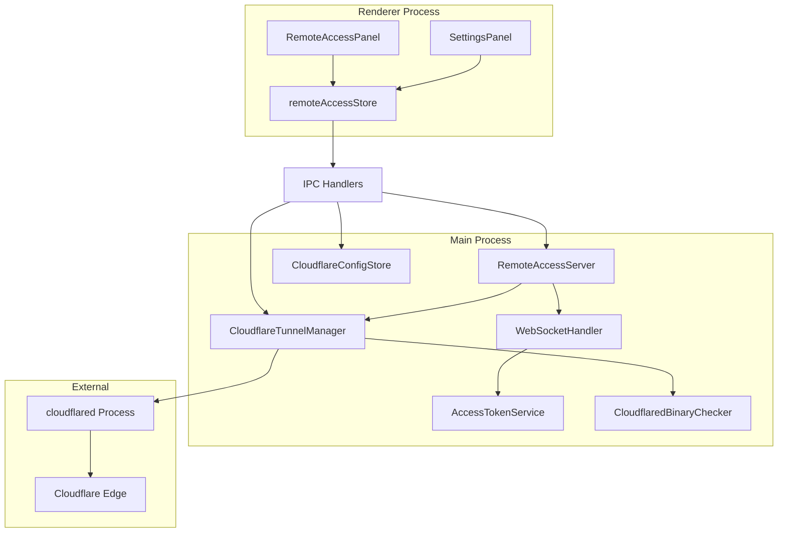
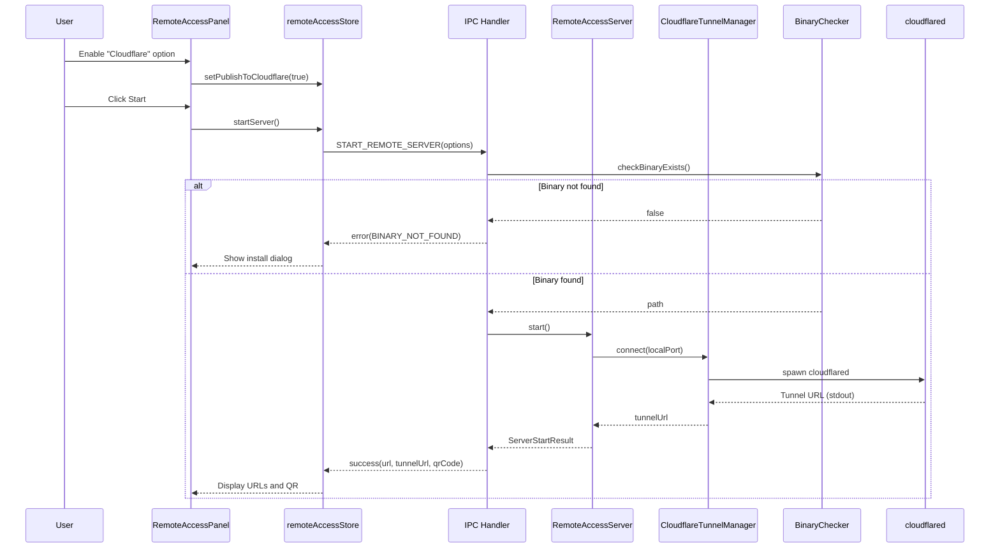
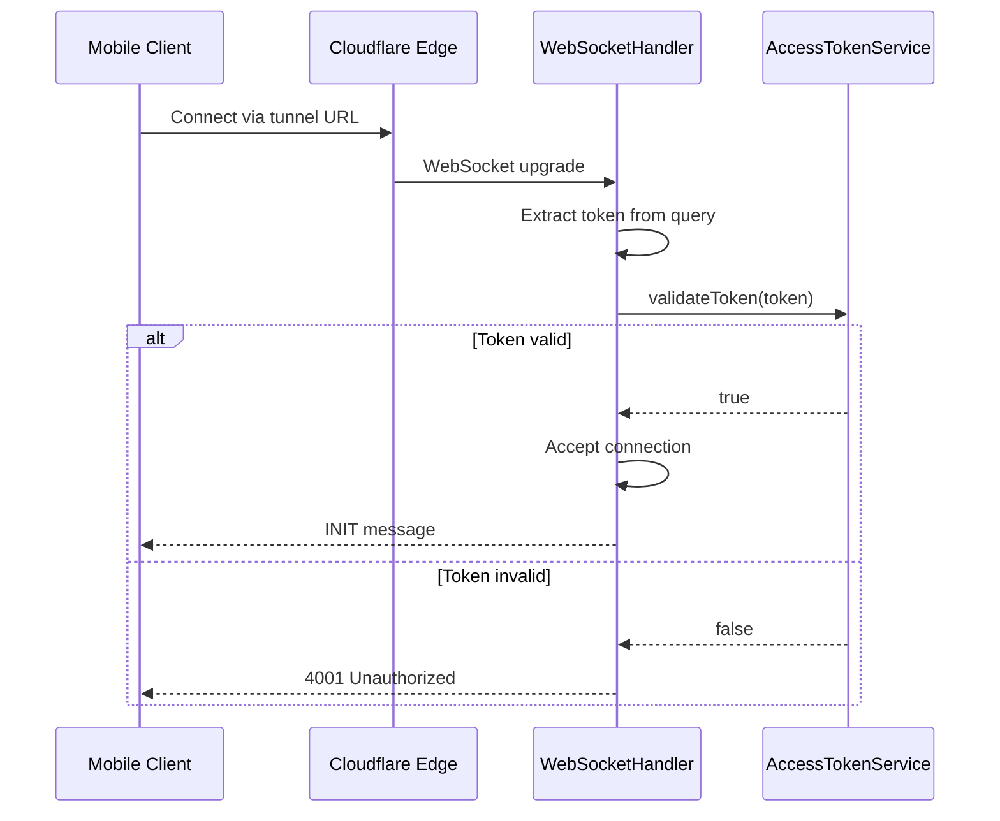
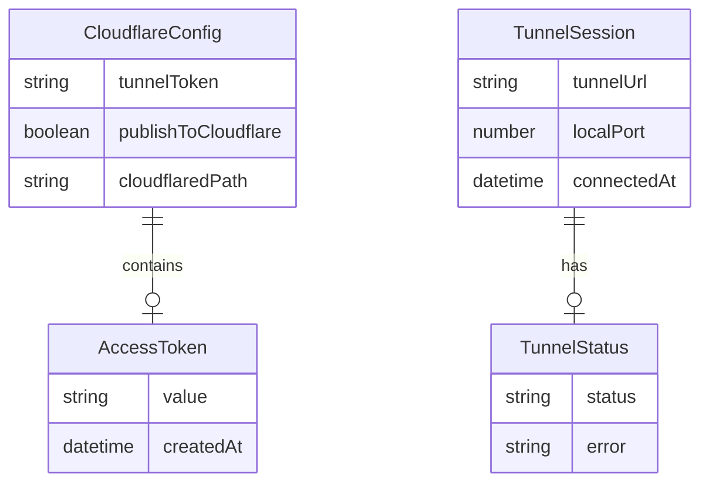

# Design Document: Cloudflare Tunnel Integration

## Overview

**Purpose**: リモートWebサーバー起動時にCloudflare Tunnelへ接続するオプションを追加し、LAN外からもSDD Orchestratorのリモートアクセス機能を利用可能にする。

**Users**: 外出先からSDD Orchestratorを操作したいユーザーが、Named Tunnelを使用してセキュアにリモートアクセスする。

**Impact**: 既存のRemoteAccessServer/WebSocketHandlerを拡張し、cloudflaredプロセス管理、トークン認証、設定永続化機能を追加する。

### Goals

- Cloudflare Named Tunnelを使用したLAN外からのリモートアクセス
- アプリ生成のアクセストークンによる認証
- cloudflaredバイナリの存在確認とインストール案内
- 接続設定の永続化

### Non-Goals

- Quick Tunnel（一時的なURL）のサポート
- cloudflaredの自動インストール
- Cloudflare Accessとの統合
- 複数ユーザーの同時アクセス管理

## Architecture

### Existing Architecture Analysis

現在のリモートアクセス機能:
- `RemoteAccessServer`: HTTP/WebSocketサーバーのライフサイクル管理
- `WebSocketHandler`: WebSocket接続管理、IP検証（プライベートIPのみ許可）
- `remoteAccessStore`: Renderer側状態管理（Zustand）
- `remoteAccessHandlers`: IPC通信

制約:
- プライベートIP検証により外部アクセス不可
- 認証機構なし

### Architecture Pattern & Boundary Map



**Architecture Integration**:
- Selected pattern: Service Pattern（既存のRemoteAccessServer拡張）
- Domain boundaries: Tunnel管理を独立サービスとして分離
- Existing patterns preserved: electron-store設定管理、IPC通信、Zustand状態管理
- New components rationale: CloudflareTunnelManagerはcloudflaredプロセスのライフサイクル管理に特化
- Steering compliance: TypeScript strict mode、Zod validation

### Technology Stack

| Layer | Choice / Version | Role in Feature | Notes |
|-------|------------------|-----------------|-------|
| Process Management | Node.js child_process | cloudflaredプロセス起動・監視 | spawn/exec使用 |
| Storage | electron-store 8.2.0 | 設定永続化（トークン、設定） | 既存利用 |
| Crypto | Node.js crypto | アクセストークン生成 | randomBytes使用 |
| QR Code | qrcode 1.5.4 | URL+トークン埋め込み | 既存利用 |

## System Flows

### Tunnel起動フロー



### アクセストークン認証フロー



## Requirements Traceability

| Requirement | Summary | Components | Interfaces | Flows |
|-------------|---------|------------|------------|-------|
| 1.1 | Tunnel接続オプション | RemoteAccessServer, CloudflareTunnelManager | startServer(), connect() | Tunnel起動フロー |
| 1.2 | デュアルアクセス | WebSocketHandler | validateConnection() | - |
| 1.3 | Tunnel URL表示 | RemoteAccessPanel, remoteAccessStore | ServerStartResult | - |
| 1.4 | エラーハンドリング | CloudflareTunnelManager | TunnelError | Tunnel起動フロー |
| 1.5 | 同時終了 | RemoteAccessServer, CloudflareTunnelManager | stop(), disconnect() | - |
| 2.1 | Token入力フィールド | SettingsPanel | - | - |
| 2.2 | Token永続化 | CloudflareConfigStore | setTunnelToken() | - |
| 2.3 | 環境変数優先 | CloudflareConfigStore | getTunnelToken() | - |
| 2.4 | Token未設定時無効化 | RemoteAccessPanel | - | - |
| 2.5 | セキュアログ | Logger | - | - |
| 3.1 | アクセストークン自動生成 | AccessTokenService | generateToken() | - |
| 3.2 | トークン永続化 | CloudflareConfigStore | getAccessToken() | - |
| 3.3 | リフレッシュ | AccessTokenService, RemoteAccessPanel | refreshToken() | - |
| 3.4 | 接続拒否 | WebSocketHandler | validateToken() | 認証フロー |
| 3.5 | 接続維持 | WebSocketHandler | - | - |
| 4.1 | バイナリ確認 | CloudflaredBinaryChecker | checkBinaryExists() | Tunnel起動フロー |
| 4.2 | インストール案内 | InstallCloudflaredDialog | - | - |
| 4.3 | インストール方法リンク | InstallCloudflaredDialog | - | - |
| 4.4 | バイナリ使用 | CloudflareTunnelManager | - | - |
| 4.5 | カスタムパス | CloudflareConfigStore | getCloudflaredPath() | - |
| 5.1 | Cloudflare公開設定保存 | CloudflareConfigStore | setPublishToCloudflare() | - |
| 5.2 | 設定復元 | remoteAccessStore | - | - |
| 5.3 | アクセストークン永続化 | CloudflareConfigStore | - | - |
| 5.4 | 設定リセット | CloudflareConfigStore | resetCloudflareSettings() | - |
| 6.1 | URL表示 | RemoteAccessPanel | - | - |
| 6.2 | QRコード表示 | RemoteAccessPanel | - | - |
| 6.3 | URLコピー | RemoteAccessPanel | - | - |
| 6.4 | QR拡大表示 | RemoteAccessPanel | - | - |
| 6.5 | URL+トークン埋め込み | QR生成ロジック | - | - |
| 7.1 | LAN継続動作 | RemoteAccessServer | - | - |
| 7.2 | Tunnel同時受付 | RemoteAccessServer | - | - |
| 7.3 | 両方でトークン認証 | WebSocketHandler | - | - |
| 7.4 | 同時接続管理 | WebSocketHandler | - | - |

## Components and Interfaces

| Component | Domain/Layer | Intent | Req Coverage | Key Dependencies | Contracts |
|-----------|--------------|--------|--------------|------------------|-----------|
| CloudflareTunnelManager | Main/Services | cloudflaredプロセスのライフサイクル管理 | 1.1, 1.4, 1.5, 4.4 | child_process (P0), CloudflaredBinaryChecker (P0) | Service |
| CloudflareConfigStore | Main/Services | Cloudflare関連設定の永続化 | 2.2, 2.3, 2.5, 3.2, 4.5, 5.1-5.4 | electron-store (P0) | Service |
| AccessTokenService | Main/Services | アクセストークンの生成・検証 | 3.1, 3.3, 3.4 | crypto (P0), CloudflareConfigStore (P1) | Service |
| CloudflaredBinaryChecker | Main/Services | cloudflaredバイナリの存在確認 | 4.1, 4.2 | fs (P0), child_process (P1) | Service |
| WebSocketHandler (拡張) | Main/Services | トークン認証の追加 | 3.4, 3.5, 7.3, 7.4 | AccessTokenService (P0) | Service |
| RemoteAccessServer (拡張) | Main/Services | Tunnel統合 | 1.1-1.5, 7.1, 7.2 | CloudflareTunnelManager (P0) | Service |
| SettingsPanel | Renderer/Components | Tunnel Token設定UI | 2.1 | IPC (P0) | - |
| RemoteAccessPanel (拡張) | Renderer/Components | Tunnel URL表示、QR、設定 | 6.1-6.5 | remoteAccessStore (P0) | - |
| InstallCloudflaredDialog | Renderer/Components | インストール案内ダイアログ | 4.2, 4.3 | - | - |
| remoteAccessStore (拡張) | Renderer/Stores | Tunnel状態管理 | 5.2, 6.1-6.5 | Zustand (P0) | State |

### Main/Services

#### CloudflareTunnelManager

| Field | Detail |
|-------|--------|
| Intent | cloudflaredプロセスのライフサイクル管理とTunnel URL取得 |
| Requirements | 1.1, 1.4, 1.5, 4.4 |

**Responsibilities & Constraints**
- cloudflaredプロセスのspawn/kill
- stdoutからTunnel URLをパース
- プロセス状態の監視とエラーハンドリング
- 単一プロセスのみ管理（複数Tunnel不可）

**Dependencies**
- Inbound: RemoteAccessServer - Tunnel開始/停止 (P0)
- Outbound: CloudflaredBinaryChecker - バイナリパス取得 (P0)
- External: cloudflared CLI - Tunnel実行 (P0)

**Contracts**: Service

##### Service Interface

```typescript
interface CloudflareTunnelManagerService {
  connect(localPort: number, tunnelToken: string): Promise<TunnelResult>;
  disconnect(): Promise<void>;
  getStatus(): TunnelStatus;
  onStatusChange(callback: (status: TunnelStatus) => void): () => void;
}

interface TunnelResult {
  ok: true;
  value: { tunnelUrl: string };
} | {
  ok: false;
  error: TunnelError;
}

type TunnelError =
  | { type: 'BINARY_NOT_FOUND'; message: string }
  | { type: 'INVALID_TOKEN'; message: string }
  | { type: 'CONNECTION_FAILED'; message: string }
  | { type: 'PROCESS_CRASHED'; message: string };

interface TunnelStatus {
  isConnected: boolean;
  tunnelUrl: string | null;
  error: TunnelError | null;
}
```

- Preconditions: cloudflaredバイナリが存在、tunnelTokenが有効
- Postconditions: isConnected=trueの場合tunnelUrlが有効
- Invariants: 同時に1つのプロセスのみ

**Implementation Notes**
- Integration: `spawn('cloudflared', ['tunnel', 'run', '--url', `http://localhost:${port}`, '--token', token])`
- Validation: Tunnel URL正規表現パース（`https://[a-z0-9-]+\.trycloudflare\.com`相当）
- Risks: プロセスクラッシュ時の再接続ロジックが必要

#### CloudflareConfigStore

| Field | Detail |
|-------|--------|
| Intent | Cloudflare関連設定の永続化管理 |
| Requirements | 2.2, 2.3, 2.5, 3.2, 4.5, 5.1-5.4 |

**Responsibilities & Constraints**
- Tunnel Tokenの保存（環境変数優先）
- アクセストークンの保存
- Cloudflare公開設定の保存
- cloudflaredカスタムパスの保存

**Dependencies**
- Inbound: IPC handlers, AccessTokenService, CloudflareTunnelManager - 設定取得 (P0)
- External: electron-store - 永続化 (P0)

**Contracts**: Service

##### Service Interface

```typescript
interface CloudflareConfigStoreService {
  // Tunnel Token (環境変数優先)
  getTunnelToken(): string | null;
  setTunnelToken(token: string): void;

  // Access Token
  getAccessToken(): string | null;
  setAccessToken(token: string): void;

  // Publish to Cloudflare setting
  getPublishToCloudflare(): boolean;
  setPublishToCloudflare(enabled: boolean): void;

  // Custom cloudflared path
  getCloudflaredPath(): string | null;
  setCloudflaredPath(path: string | null): void;

  // Reset all Cloudflare settings (except Tunnel Token)
  resetCloudflareSettings(): void;
}
```

- Preconditions: なし
- Postconditions: 設定が永続化される
- Invariants: getTunnelTokenは環境変数`CLOUDFLARE_TUNNEL_TOKEN`を優先

**Implementation Notes**
- Integration: 既存ConfigStoreパターンを踏襲、別スキーマとして分離
- Validation: トークンは平文でログ出力しない
- Risks: 環境変数と保存値の優先順位を明確にドキュメント化

#### AccessTokenService

| Field | Detail |
|-------|--------|
| Intent | アクセストークンの生成・検証 |
| Requirements | 3.1, 3.3, 3.4 |

**Responsibilities & Constraints**
- 10文字の英数字トークン生成
- トークンの検証（timing-safe比較）
- リフレッシュ時の新トークン生成

**Dependencies**
- Inbound: WebSocketHandler - トークン検証 (P0)
- Outbound: CloudflareConfigStore - トークン永続化 (P0)
- External: Node.js crypto - ランダム生成 (P0)

**Contracts**: Service

##### Service Interface

```typescript
interface AccessTokenServiceService {
  generateToken(): string;
  validateToken(token: string): boolean;
  refreshToken(): string;
  getToken(): string | null;
}
```

- Preconditions: なし
- Postconditions: generateToken後はgetTokenが非null
- Invariants: validateTokenはtiming-safe比較

**Implementation Notes**
- Integration: `crypto.randomBytes(8).toString('base64url').slice(0, 10)`
- Validation: `crypto.timingSafeEqual`使用
- Risks: なし

#### CloudflaredBinaryChecker

| Field | Detail |
|-------|--------|
| Intent | cloudflaredバイナリの存在確認とパス取得 |
| Requirements | 4.1, 4.2 |

**Responsibilities & Constraints**
- `which cloudflared`でPATH検索
- 共通インストールパスのチェック
- カスタムパスの検証

**Dependencies**
- Inbound: CloudflareTunnelManager - バイナリパス取得 (P0)
- Outbound: CloudflareConfigStore - カスタムパス取得 (P1)
- External: fs, child_process - ファイル確認 (P0)

**Contracts**: Service

##### Service Interface

```typescript
interface CloudflaredBinaryCheckerService {
  checkBinaryExists(): Promise<BinaryCheckResult>;
  getInstallInstructions(): InstallInstructions;
}

type BinaryCheckResult =
  | { exists: true; path: string }
  | { exists: false };

interface InstallInstructions {
  homebrew: string;
  macports: string;
  downloadUrl: string;
}
```

- Preconditions: なし
- Postconditions: なし
- Invariants: なし

**Implementation Notes**
- Integration: カスタムパス → which → 共通パス（`/usr/local/bin`, `/opt/homebrew/bin`）の順
- Validation: 実行可能ファイルかどうか確認
- Risks: パーミッション問題

### Renderer/Components

#### SettingsPanel

| Field | Detail |
|-------|--------|
| Intent | Cloudflare Tunnel Token設定UI |
| Requirements | 2.1 |

**Responsibilities & Constraints**
- Tunnel Token入力フィールド
- トークンマスク表示
- 保存ボタン

**Dependencies**
- Outbound: IPC - setTunnelToken (P0)

**Implementation Notes**
- Integration: 既存の設定パネルに新セクション追加
- Validation: 入力値の基本バリデーション（空でないか）

#### RemoteAccessPanel (拡張)

| Field | Detail |
|-------|--------|
| Intent | Tunnel URL表示、QRコード、Cloudflare公開オプション |
| Requirements | 6.1-6.5 |

**Responsibilities & Constraints**
- 「Cloudflareに公開」チェックボックス
- Tunnel URL表示（コピーボタン付き）
- QRコード表示（URL+トークン埋め込み）
- アクセストークンリフレッシュボタン

**Dependencies**
- Inbound: remoteAccessStore - 状態取得 (P0)
- Outbound: IPC - refreshToken, startServer (P0)

**Implementation Notes**
- Integration: 既存パネルに新UI要素追加
- Validation: Tunnel URL有効時のみ表示

#### InstallCloudflaredDialog

| Field | Detail |
|-------|--------|
| Intent | cloudflaredインストール案内ダイアログ |
| Requirements | 4.2, 4.3 |

**Responsibilities & Constraints**
- プラットフォーム別インストール手順表示
- Homebrew/MacPorts/ダウンロードリンク

**Dependencies**
- Inbound: remoteAccessStore - ダイアログ表示状態 (P0)

**Implementation Notes**
- Integration: モーダルダイアログとして実装
- Validation: なし

### Renderer/Stores

#### remoteAccessStore (拡張)

| Field | Detail |
|-------|--------|
| Intent | Cloudflare Tunnel関連状態管理 |
| Requirements | 5.2, 6.1-6.5 |

**Responsibilities & Constraints**
- tunnelUrl状態
- publishToCloudflare設定
- accessToken状態
- showInstallDialog状態

**Dependencies**
- Inbound: RemoteAccessPanel, SettingsPanel - 状態取得 (P0)
- Outbound: IPC - サーバー操作 (P0)

**Contracts**: State

##### State Management

```typescript
interface RemoteAccessState {
  // 既存フィールド
  isRunning: boolean;
  port: number | null;
  url: string | null;
  qrCodeDataUrl: string | null;
  clientCount: number;
  error: string | null;
  localIp: string | null;
  autoStartEnabled: boolean;
  isLoading: boolean;

  // 新規フィールド（Cloudflare Tunnel）
  publishToCloudflare: boolean;
  tunnelUrl: string | null;
  tunnelQrCodeDataUrl: string | null;
  tunnelStatus: 'disconnected' | 'connecting' | 'connected' | 'error';
  tunnelError: string | null;
  accessToken: string | null;
  showInstallCloudflaredDialog: boolean;
}

interface RemoteAccessActions {
  // 既存アクション
  startServer: (preferredPort?: number) => Promise<void>;
  stopServer: () => Promise<void>;
  // ...

  // 新規アクション
  setPublishToCloudflare: (enabled: boolean) => void;
  refreshAccessToken: () => Promise<void>;
  dismissInstallDialog: () => void;
}
```

- Persistence: publishToCloudflare, accessTokenはlocalStorageに永続化

## Data Models

### Domain Model



**Business Rules**:
- tunnelTokenは環境変数優先、なければ保存値
- accessTokenはリフレッシュまで不変
- tunnelUrlはセッション中のみ有効

### Logical Data Model

**CloudflareConfigSchema (electron-store)**:

```typescript
interface CloudflareConfigSchema {
  tunnelToken: string | null;      // 保存されたTunnel Token
  accessToken: string | null;      // 生成されたアクセストークン
  publishToCloudflare: boolean;    // Cloudflare公開設定
  cloudflaredPath: string | null;  // カスタムバイナリパス
}
```

**ServerStartResult拡張**:

```typescript
interface ServerStartResult {
  // 既存
  readonly port: number;
  readonly url: string;
  readonly qrCodeDataUrl: string;
  readonly localIp: string;

  // 新規
  readonly tunnelUrl: string | null;
  readonly tunnelQrCodeDataUrl: string | null;
  readonly accessToken: string;
}
```

### Data Contracts & Integration

**IPC Channels追加**:

| Channel | Request | Response | Description |
|---------|---------|----------|-------------|
| `cloudflare:get-tunnel-token` | - | `string \| null` | Token取得（環境変数優先） |
| `cloudflare:set-tunnel-token` | `string` | `void` | Token保存 |
| `cloudflare:get-settings` | - | `CloudflareSettings` | 全設定取得 |
| `cloudflare:set-settings` | `Partial<CloudflareSettings>` | `void` | 設定更新 |
| `cloudflare:refresh-access-token` | - | `string` | 新トークン生成 |
| `cloudflare:check-binary` | - | `BinaryCheckResult` | バイナリ確認 |

## Error Handling

### Error Strategy

Cloudflare Tunnel関連のエラーは階層的に処理:
1. バイナリ不在 → インストールダイアログ表示
2. トークン未設定 → Tunnel接続オプション無効化
3. 接続失敗 → エラー表示、LAN継続
4. プロセスクラッシュ → 自動再接続試行（3回まで）

### Error Categories and Responses

**Configuration Errors (User Action Required)**:
- `BINARY_NOT_FOUND` → InstallCloudflaredDialog表示
- `TOKEN_NOT_CONFIGURED` → 設定画面へ誘導メッセージ

**Connection Errors (Recoverable)**:
- `CONNECTION_FAILED` → エラー表示、LAN継続、再試行オプション
- `PROCESS_CRASHED` → 自動再接続（最大3回）

**Authentication Errors (WebSocket)**:
- `INVALID_TOKEN` → 4001 Unauthorized、接続拒否

### Monitoring

- cloudflaredプロセスのexit codeログ
- Tunnel接続/切断イベントログ
- トークン検証失敗ログ（IPアドレス記録）

## Testing Strategy

### Unit Tests

- `CloudflareTunnelManager`: spawn/killのモック、URLパースロジック
- `AccessTokenService`: トークン生成の一意性、validateのtiming-safe
- `CloudflareConfigStore`: 環境変数優先ロジック、永続化
- `CloudflaredBinaryChecker`: パス検索ロジック

### Integration Tests

- RemoteAccessServer + CloudflareTunnelManager: 起動/停止の連携
- WebSocketHandler + AccessTokenService: トークン認証フロー
- IPC handlers + ConfigStore: 設定の永続化と読み込み

### E2E Tests

- Tunnel無効でサーバー起動 → LAN URLのみ表示
- Tunnel有効でサーバー起動（cloudflaredモック）→ 両URL表示
- トークンリフレッシュ → QRコード更新
- バイナリ不在時 → インストールダイアログ表示

## Security Considerations

- **Tunnel Token保護**: electron-storeで保存、ログ出力時はマスク
- **Access Token**: timing-safe比較で検証
- **プロセス引数**: tokenを引数で渡すため`ps`で見える可能性あり（--token-file検討）
- **WebSocket接続**: 全接続でトークン必須、不正トークンは即切断
