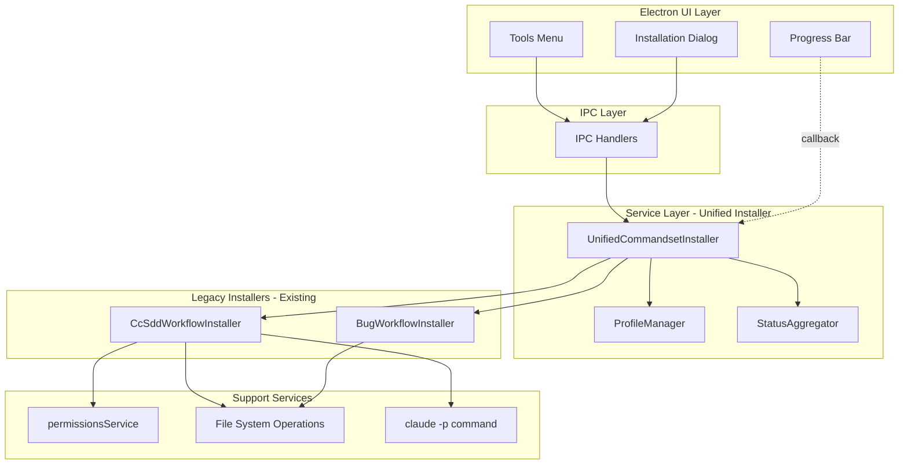
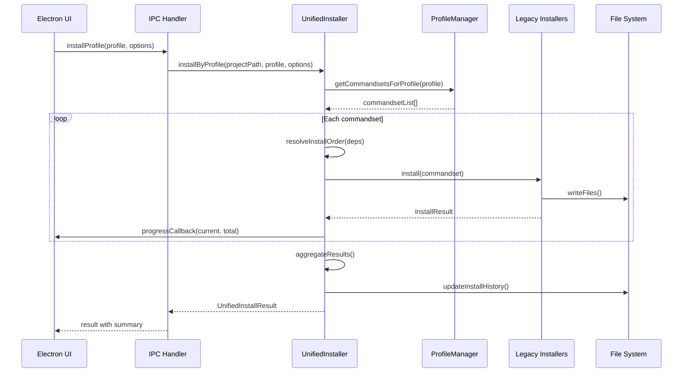
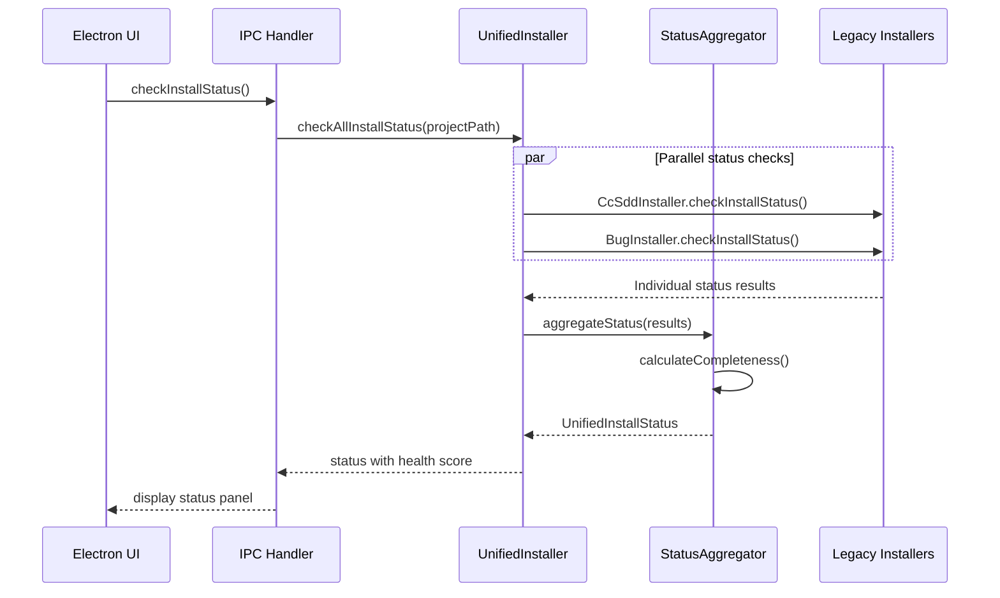

# Design Document

## Overview

本機能は、SDD Managerの複数のコマンドセットインストーラー（cc-sddワークフロー、Bugワークフロー、spec-managerコマンド）を統一的なインターフェースで管理・インストールするための統合インストーラーアーキテクチャを提供する。現在、`CcSddWorkflowInstaller`と`BugWorkflowInstaller`が個別に実装されているが、これらを統一的に扱い、新しいコマンドセットの追加時の拡張性を大幅に向上させる。

**Users**: 開発者およびSDD Manager利用者がClaude Codeコマンドセットのインストール・管理を効率的に実行する。

**Impact**: 既存の個別インストーラー実装を維持しつつ、統一的なインターフェースを追加することで、プロジェクトセットアップの一貫性と保守性を向上させる。

### Goals

- 複数のコマンドセットを統一インターフェースで管理し、新規追加時の変更コストを最小化
- インストールプロファイル（minimal, standard, full, lightweight-bug-fix-only）による用途別インストールの実現
- 一括インストール時の進行状況通知と部分失敗時の継続処理
- インストール状況の一元的な可視化とヘルスチェック機能
- 既存インストーラーとの後方互換性を保ちながら段階的な移行をサポート

### Non-Goals

- 既存の`CcSddWorkflowInstaller`および`BugWorkflowInstaller`の完全な置き換え（当面は共存）
- コマンドファイルのバージョン管理システムの実装（Requirement 14の完全実装は将来対応）
- インタラクティブな競合解決UI（Requirement 6.5: インタラクティブモードによる設定ファイル競合解決は将来対応）
- リモートリポジトリからのコマンドセット取得機能

## Architecture

### Existing Architecture Analysis

現在の実装は以下の特徴を持つ：

- **個別インストーラーパターン**: `CcSddWorkflowInstaller`、`BugWorkflowInstaller`がそれぞれ独立したクラスとして実装
- **共通インターフェース**: `InstallOptions`、`InstallResult`、`Result<T, E>`型が共通定義
- **ファイルベーステンプレート**: `electron-sdd-manager/resources/templates/`配下にカテゴリ別に整理されたコマンド/エージェント/設定ファイル
- **CLAUDE.md統合処理**: `claude -p`コマンドによるセマンティックマージとフォールバック処理
- **パーミッション管理**: `permissionsService`による`.claude/settings.local.json`への権限追加

統合インストーラーは、これらの既存パターンを尊重し、**ラッパー層として実装**することで既存コードへの影響を最小化する。

### Architecture Pattern & Boundary Map



**Architecture Integration**:
- **選択パターン**: Adapter/Wrapperパターン - 既存インストーラーをラップして統一インターフェースを提供
- **Domain境界**: UI層、IPC層、サービス層が明確に分離され、既存のElectron構造に準拠
- **既存パターン保持**: `Result<T, E>`型、`InstallOptions`インターフェースは既存のまま継承
- **新規コンポーネント理由**:
  - `UnifiedCommandsetInstaller`: 統一的なインストール管理と依存関係解決
  - `ProfileManager`: プロファイル定義とコマンドセット選択ロジックの分離
  - `StatusAggregator`: 複数インストーラーの状態を集約し統一的なヘルスチェックを提供
- **Steering準拠**: `.kiro/settings/`での設定管理、型安全性重視のTypeScript実装、サービス層パターンの踏襲

### Technology Stack

| Layer | Choice / Version | Role in Feature | Notes |
|-------|------------------|-----------------|-------|
| Backend / Services | TypeScript 5.8+, Node.js 20+ | 統合インストーラーサービス実装 | 既存サービス層パターンを踏襲 |
| Data / Storage | JSON (ファイルベース) | プロファイル定義とインストール履歴 | `.kiro/settings/profiles.json`, `.kiro/.install-history.json` |
| Infrastructure / Runtime | Electron IPC, fs/promises | ファイル操作とプロセス間通信 | 既存のIPC handlerパターンを拡張 |

## System Flows

### インストールプロファイル実行フロー



**Key Decisions**:
- 依存関係解決は`resolveInstallOrder`で事前に実行し、インストール順序を決定
- 部分失敗時もスキップして継続し、最終結果で失敗情報を集約
- 進行状況はコールバックでリアルタイムにUI層へ通知

### インストール状況確認フロー



**Key Decisions**:
- 並列チェックにより大量のファイル確認を高速化
- 完全性スコア（0-100%）はインストール済みファイル数/総ファイル数で算出
- 不足コンポーネントリストを明示することでユーザー対応を容易化

## Requirements Traceability

| Requirement | Summary | Components | Interfaces | Flows |
|-------------|---------|------------|------------|-------|
| 1.1-1.6 | 統合インストーラーインターフェース | UnifiedCommandsetInstaller | `installCommandset`, `installAll`, `UnifiedInstallResult` | インストールプロファイル実行 |
| 2.1-2.6 | コマンドセット定義とメタデータ | CommandsetDefinitionManager, ProfileManager | `CommandsetDefinition`, `loadDefinitions` | - |
| 3.1-3.6 | 一括インストール機能 | UnifiedCommandsetInstaller, DependencyResolver | `installAll`, `installByProfile`, `ProgressCallback` | インストールプロファイル実行 |
| 4.1-4.5 | インストール状況の一元管理 | StatusAggregator | `checkAllInstallStatus`, `isMinimalSetupComplete`, `UnifiedInstallStatus` | インストール状況確認 |
| 5.1-5.6 | CLAUDE.md統合の統一処理 | ClaudeMdMerger | `mergeAllSections`, `deduplicateSections` | - |
| 6.1-6.5 | 設定ファイルの統合管理 | SettingsFileManager | `mergeSettings`, `detectConflicts`, `MergeStrategy` | - |
| 7.1-7.5 | パーミッション管理の統合 | PermissionsAggregator | `collectRequiredPermissions`, `mergePermissions` | - |
| 8.1-8.6 | インストールプロファイル機能 | ProfileManager | `getProfile`, `Profile`, `validateProfile` | インストールプロファイル実行 |
| 9.1-9.6 | ロールバック機能 | RollbackManager | `createBackup`, `rollback`, `InstallHistory` | - |
| 10.1-10.7 | UIとの統合 | Electron UI, IPC Handlers | `ipcMain.handle('install-commandset')`, `InstallDialog` | インストールプロファイル実行 |
| 11.1-11.6 | インストール後の検証 | ValidationService | `validateInstallation`, `ValidationReport` | - |
| 12.1-12.5 | 既存インストーラーとの共存 | UnifiedCommandsetInstaller (Adapter) | 既存インターフェース継承 | - |
| 13.1-13.6 | ログとデバッグ情報 | LoggingService | `structuredLog`, `LogLevel`, `writeLogFile` | 全フロー |
| 14.1-14.6 | アップデート機能 | UpdateManager | `updateAll`, `detectVersion`, `BackupBeforeUpdate` | - |

## Components and Interfaces

### Component Summary

| Component | Domain/Layer | Intent | Req Coverage | Key Dependencies (P0/P1) | Contracts |
|-----------|--------------|--------|--------------|--------------------------|-----------|
| UnifiedCommandsetInstaller | Service | 統一的なコマンドセットインストール管理 | 1, 3, 12 | CcSddWorkflowInstaller (P0), BugWorkflowInstaller (P0), ProfileManager (P0), DependencyResolver (P0) | Service, State |
| DependencyResolver | Service | コマンドセット間の依存関係解決とインストール順序決定 | 3 | CommandsetDefinitionManager (P0) | Service |
| CommandsetDefinitionManager | Service | コマンドセット定義のメタデータ管理 | 2 | File System (P0) | Service |
| ProfileManager | Service | インストールプロファイル定義と選択 | 2, 8 | CommandsetDefinitionManager (P0) | Service |
| StatusAggregator | Service | インストール状況の集約とヘルスチェック | 4 | 既存インストーラー (P0) | Service |
| ClaudeMdMerger | Service | CLAUDE.mdの統一的なマージ処理 | 5 | claude CLI (P1), File System (P0) | Service |
| SettingsFileManager | Service | 設定ファイルの競合検出とマージ | 6 | File System (P0) | Service |
| PermissionsAggregator | Service | パーミッションの統合と重複排除 | 7 | permissionsService (P0) | Service |
| RollbackManager | Service | インストール操作のロールバック管理 | 9 | File System (P0) | Service |
| ValidationService | Service | インストール後の検証とヘルスチェック | 11 | File System (P0) | Service |
| UpdateManager | Service | コマンドセットのバージョン管理とアップデート | 14 | File System (P0) | Service |
| LoggingService | Service | 構造化ログと診断情報の記録 | 13 | File System (P0) | Service |
| InstallDialog (UI) | UI | プロファイル選択とインストール進捗表示 | 10 | Electron Dialog API (P0) | UI Component |
| IPC Handlers | IPC | Electron IPCハンドラーの拡張 | 10 | UnifiedCommandsetInstaller (P0) | API |

### Service Layer

#### UnifiedCommandsetInstaller

| Field | Detail |
|-------|--------|
| Intent | 複数のコマンドセットインストーラーを集約し、統一的なインストール管理と依存関係解決を提供 |
| Requirements | 1.1, 1.2, 1.3, 1.4, 1.5, 1.6, 3.1, 3.2, 3.3, 3.4, 3.5, 3.6, 12.1, 12.2, 12.3, 12.4, 12.5 |

**Responsibilities & Constraints**
- コマンドセット単位およびプロファイル単位のインストールを統一的に提供
- 依存関係に基づいたインストール順序の自動決定
- 部分失敗時の継続処理と結果集約
- 既存インストーラー（CcSddWorkflowInstaller, BugWorkflowInstaller）をラップし、後方互換性を維持

**Dependencies**
- Outbound: CcSddWorkflowInstaller — cc-sddワークフローインストール (P0)
- Outbound: BugWorkflowInstaller — Bugワークフローインストール (P0)
- Outbound: ProfileManager — プロファイル定義の取得 (P0)
- Outbound: DependencyResolver — 依存関係解決 (P0)
- Outbound: LoggingService — ログ記録 (P1)

**Contracts**: Service [x] / API [ ] / Event [ ] / Batch [ ] / State [x]

##### Service Interface

```typescript
interface UnifiedCommandsetInstaller {
  /**
   * 指定されたコマンドセットをインストール
   * @param projectPath - プロジェクトルートパス
   * @param commandsetName - コマンドセット名（"cc-sdd", "bug", "spec-manager"）
   * @param options - インストールオプション
   */
  installCommandset(
    projectPath: string,
    commandsetName: CommandsetName,
    options?: InstallOptions
  ): Promise<Result<InstallResult, InstallError>>;

  /**
   * 指定されたプロファイルに基づいて一括インストール
   * @param projectPath - プロジェクトルートパス
   * @param profileName - プロファイル名（"minimal", "standard", "full", "lightweight-bug-fix-only"）
   * @param options - インストールオプション
   * @param progressCallback - 進行状況通知コールバック
   */
  installByProfile(
    projectPath: string,
    profileName: ProfileName,
    options?: InstallOptions,
    progressCallback?: ProgressCallback
  ): Promise<Result<UnifiedInstallResult, InstallError>>;

  /**
   * 全てのコマンドセットを一括インストール
   * @param projectPath - プロジェクトルートパス
   * @param options - インストールオプション
   * @param progressCallback - 進行状況通知コールバック
   */
  installAll(
    projectPath: string,
    options?: InstallOptions,
    progressCallback?: ProgressCallback
  ): Promise<Result<UnifiedInstallResult, InstallError>>;

  /**
   * 全てのコマンドセットのインストール状況を確認
   * @param projectPath - プロジェクトルートパス
   */
  checkAllInstallStatus(
    projectPath: string
  ): Promise<UnifiedInstallStatus>;

  /**
   * 最小限のセットアップが完了しているか判定
   * @param projectPath - プロジェクトルートパス
   */
  isMinimalSetupComplete(
    projectPath: string
  ): Promise<boolean>;
}

type CommandsetName = 'cc-sdd' | 'bug' | 'spec-manager';
type ProfileName = 'minimal' | 'standard' | 'full' | 'lightweight-bug-fix-only';

type ProgressCallback = (current: number, total: number, currentCommandset: string) => void;

interface UnifiedInstallResult {
  readonly commandsets: ReadonlyMap<CommandsetName, InstallResult>;
  readonly claudeMd: ClaudeMdUpdateResult;
  readonly permissions: PermissionsUpdateResult;
  readonly settings: SettingsUpdateResult;
  readonly summary: {
    readonly totalInstalled: number;
    readonly totalSkipped: number;
    readonly totalFailed: number;
  };
}

interface UnifiedInstallStatus {
  readonly commandsets: ReadonlyMap<CommandsetName, CommandsetStatus>;
  readonly completenessScore: number; // 0-100
  readonly isMinimalSetupComplete: boolean;
  readonly missingComponents: string[];
}

interface CommandsetStatus {
  readonly name: CommandsetName;
  readonly installedFiles: number;
  readonly missingFiles: number;
  readonly totalFiles: number;
  readonly missingComponents: string[];
}
```

**Preconditions**:
- `projectPath`が有効なディレクトリパスであること
- `templateDir`が既存インストーラーで使用されているテンプレートディレクトリであること

**Postconditions**:
- インストール成功時、指定されたコマンドファイル、エージェント、設定ファイルが`.claude/`および`.kiro/`配下に配置される
- CLAUDE.mdに必要なセクションが統合される
- settings.local.jsonに必要なパーミッションが追加される
- インストール履歴が`.kiro/.install-history.json`に記録される

**Invariants**:
- 既存ファイルはforceオプションなしでは上書きされない
- 依存関係が未解決のコマンドセットは後続としてインストールされる
- 部分失敗時も成功したコマンドセットは有効なままである

**Implementation Notes**
- **Integration**: 既存の`CcSddWorkflowInstaller`と`BugWorkflowInstaller`をコンストラクタで受け取り、内部でデリゲートする
- **Validation**: プロファイル名やコマンドセット名はEnum型で型安全に制限し、実行時チェックで不正値をエラーとする
- **Risks**: 大量のファイルインストール時のパフォーマンス低下（並列化で対応）、既存インストーラーのバグ伝播（エラーハンドリングで隔離）

#### DependencyResolver

| Field | Detail |
|-------|--------|
| Intent | コマンドセット間の依存関係を解決し、インストール順序を決定する |
| Requirements | 3.5 |

**Responsibilities & Constraints**
- コマンドセット定義から依存関係グラフを構築
- トポロジカルソートによるインストール順序の決定
- 循環依存の検出と警告

**Dependencies**
- Outbound: CommandsetDefinitionManager — コマンドセット定義の読み込み (P0)

**Contracts**: Service [x] / API [ ] / Event [ ] / Batch [ ] / State [ ]

##### Service Interface

```typescript
interface DependencyResolver {
  /**
   * コマンドセットの依存関係に基づいてインストール順序を決定
   * @param commandsets - インストール対象のコマンドセット
   */
  resolveInstallOrder(
    commandsets: readonly CommandsetName[]
  ): Result<CommandsetName[], DependencyError>;

  /**
   * 循環依存を検出
   * @param commandsets - チェック対象のコマンドセット
   */
  detectCircularDependencies(
    commandsets: readonly CommandsetName[]
  ): CircularDependency[];
}

type DependencyError =
  | { type: 'CIRCULAR_DEPENDENCY'; cycle: readonly CommandsetName[] }
  | { type: 'MISSING_DEPENDENCY'; commandset: CommandsetName; required: CommandsetName };

interface CircularDependency {
  readonly cycle: readonly CommandsetName[];
}
```

**Implementation Notes**
- **Integration**: トポロジカルソートアルゴリズムを使用してDAG（有向非巡回グラフ）を解決
- **Validation**: 循環依存が検出された場合はエラーを返し、インストールを中断
- **Risks**: 複雑な依存関係グラフでのパフォーマンス低下（コマンドセット数が少ない場合は問題なし）

#### CommandsetDefinitionManager

| Field | Detail |
|-------|--------|
| Intent | コマンドセット定義のメタデータ（名前、説明、カテゴリ、ファイルリスト、依存関係）を管理 |
| Requirements | 2.1, 2.2, 2.3, 2.4, 2.5, 2.6 |

**Responsibilities & Constraints**
- コマンドセット定義の読み込みと検証
- バージョン情報の管理
- ファイルリストと依存関係情報の提供

**Dependencies**
- Outbound: File System (fs/promises) — 定義ファイルの読み込み (P0)

**Contracts**: Service [x] / API [ ] / Event [ ] / Batch [ ] / State [ ]

##### Service Interface

```typescript
interface CommandsetDefinitionManager {
  /**
   * コマンドセット定義を取得
   * @param commandsetName - コマンドセット名
   */
  getDefinition(commandsetName: CommandsetName): CommandsetDefinition;

  /**
   * 全てのコマンドセット定義を読み込み
   */
  loadAllDefinitions(): Promise<Result<ReadonlyMap<CommandsetName, CommandsetDefinition>, LoadError>>;

  /**
   * コマンドセット定義の妥当性を検証
   * @param definition - 検証対象の定義
   */
  validateDefinition(definition: CommandsetDefinition): Result<void, ValidationError>;
}

interface CommandsetDefinition {
  readonly name: CommandsetName;
  readonly description: string;
  readonly category: 'workflow' | 'utility';
  readonly version: string; // セマンティックバージョン
  readonly files: readonly string[]; // 含まれるファイルリスト
  readonly dependencies: readonly CommandsetName[]; // 依存するコマンドセット
}

type LoadError =
  | { type: 'DEFINITION_NOT_FOUND'; name: CommandsetName }
  | { type: 'PARSE_ERROR'; message: string };
```

**Implementation Notes**
- **Integration**: コマンドセット定義はJSON形式で管理し、起動時またはオンデマンドで読み込み
- **Validation**: 存在しないコマンドセット名が依存関係に含まれている場合はエラー
- **Risks**: 定義ファイルの破損時は組み込みデフォルト定義にフォールバック

#### ProfileManager

| Field | Detail |
|-------|--------|
| Intent | インストールプロファイルの定義管理と、プロファイルに基づくコマンドセット選択ロジックを提供 |
| Requirements | 2.1, 2.2, 2.3, 2.4, 2.5, 2.6, 8.1, 8.2, 8.3, 8.4, 8.5, 8.6 |

**Responsibilities & Constraints**
- 事前定義プロファイル（minimal, standard, full, lightweight-bug-fix-only）の管理
- カスタムプロファイルの読み込みと検証
- プロファイル選択に基づくコマンドセットリストの生成

**Dependencies**
- Outbound: CommandsetDefinitionManager — コマンドセット定義の読み込み (P0)
- Outbound: File System (fs/promises) — プロファイルファイルの読み書き (P0)

**Contracts**: Service [x] / API [ ] / Event [ ] / Batch [ ] / State [ ]

##### Service Interface

```typescript
interface ProfileManager {
  /**
   * プロファイル名から対応するコマンドセットリストを取得
   * @param profileName - プロファイル名
   */
  getCommandsetsForProfile(profileName: ProfileName): CommandsetName[];

  /**
   * プロファイル定義を取得
   * @param profileName - プロファイル名
   */
  getProfile(profileName: ProfileName): Profile;

  /**
   * カスタムプロファイルを保存
   * @param profile - プロファイル定義
   */
  saveCustomProfile(profile: Profile): Promise<Result<void, ProfileError>>;

  /**
   * プロファイルの妥当性を検証
   * @param profile - プロファイル定義
   */
  validateProfile(profile: Profile): Result<void, ValidationError>;
}

interface Profile {
  readonly name: ProfileName | string;
  readonly description: string;
  readonly commandsets: readonly CommandsetName[];
  readonly isCustom: boolean;
}

type ProfileError =
  | { type: 'PROFILE_NOT_FOUND'; name: string }
  | { type: 'INVALID_PROFILE'; reason: string };
```

**Implementation Notes**
- **Integration**: `.kiro/settings/profiles.json`にプロファイル定義を保存し、起動時に読み込む
- **Validation**: プロファイル内のコマンドセット名は既知の名前のみ許可（存在しないコマンドセットはエラー）
- **Risks**: プロファイルファイルの破損時は組み込みデフォルトプロファイルにフォールバック

#### StatusAggregator

| Field | Detail |
|-------|--------|
| Intent | 複数のインストーラーの状態を集約し、統一的なインストール状況とヘルスチェックを提供 |
| Requirements | 4.1, 4.2, 4.3, 4.4, 4.5 |

**Responsibilities & Constraints**
- 各既存インストーラーの`checkInstallStatus`結果を集約
- インストール完全性スコア（0-100%）の算出
- 不足コンポーネントのリスト生成
- 最小限セットアップの完了判定

**Dependencies**
- Outbound: CcSddWorkflowInstaller.checkInstallStatus — cc-sddインストール状況 (P0)
- Outbound: BugWorkflowInstaller.checkInstallStatus — Bugワークフローインストール状況 (P0)

**Contracts**: Service [x] / API [ ] / Event [ ] / Batch [ ] / State [ ]

##### Service Interface

```typescript
interface StatusAggregator {
  /**
   * 全コマンドセットの統合ステータスを取得
   * @param projectPath - プロジェクトルートパス
   */
  aggregateStatus(projectPath: string): Promise<UnifiedInstallStatus>;

  /**
   * インストール完全性スコアを計算
   * @param status - 統合インストールステータス
   */
  calculateCompleteness(status: UnifiedInstallStatus): number;

  /**
   * 最小限のセットアップが完了しているか判定
   * @param status - 統合インストールステータス
   */
  isMinimalSetupComplete(status: UnifiedInstallStatus): boolean;
}
```

**Implementation Notes**
- **Integration**: 並列で各インストーラーの状態チェックを実行し、結果をマージ
- **Validation**: 完全性スコアはインストール済みファイル数/総ファイル数で算出（0-100の範囲）
- **Risks**: 既存インストーラーのcheckInstallStatusメソッドがエラーを返した場合も継続し、部分的な結果を返す

#### ClaudeMdMerger

| Field | Detail |
|-------|--------|
| Intent | 複数のコマンドセットから提供されるCLAUDE.mdセクションを重複なく統一的にマージ |
| Requirements | 5.1, 5.2, 5.3, 5.4, 5.5, 5.6 |

**Responsibilities & Constraints**
- 複数のコマンドセットのCLAUDE.mdセクションを集約し、一度の操作でマージ
- 同一セクションの重複検出とスキップ
- `claude -p`コマンドによるセマンティック統合の優先使用
- フォールバック処理として単純なテキストマージを提供

**Dependencies**
- Outbound: claude CLI — セマンティックマージ (P1)
- Outbound: File System (fs/promises) — CLAUDE.md読み書き (P0)

**Contracts**: Service [x] / API [ ] / Event [ ] / Batch [ ] / State [ ]

##### Service Interface

```typescript
interface ClaudeMdMerger {
  /**
   * 複数のコマンドセットセクションを統合してCLAUDE.mdにマージ
   * @param projectPath - プロジェクトルートパス
   * @param sections - コマンドセット別のCLAUDE.mdセクション
   */
  mergeAllSections(
    projectPath: string,
    sections: ReadonlyMap<CommandsetName, string>
  ): Promise<Result<ClaudeMdMergeResult, MergeError>>;

  /**
   * セクションの重複を検出
   * @param existingContent - 既存のCLAUDE.md内容
   * @param newSections - 追加するセクション
   */
  deduplicateSections(
    existingContent: string,
    newSections: ReadonlyMap<CommandsetName, string>
  ): ReadonlyMap<CommandsetName, string>;
}

interface ClaudeMdMergeResult {
  readonly action: 'created' | 'merged' | 'skipped';
  readonly addedSections: readonly CommandsetName[];
  readonly skippedSections: readonly CommandsetName[];
  readonly method: 'claude-semantic' | 'text-merge';
}

type MergeError =
  | { type: 'CLAUDE_COMMAND_FAILED'; message: string }
  | { type: 'TEXT_MERGE_FAILED'; message: string }
  | { type: 'WRITE_ERROR'; path: string; message: string };
```

**Implementation Notes**
- **Integration**: `claude -p`コマンドが利用可能な場合は優先的に使用し、失敗時はテキストマージにフォールバック
- **Validation**: 既存のCLAUDE.md内にキーワード（例: "Feature Development (Full SDD)"）が存在するかでセクション重複を判定
- **Risks**: `claude -p`タイムアウト時の処理遅延（60秒でタイムアウト設定）

#### SettingsFileManager

| Field | Detail |
|-------|--------|
| Intent | 設定ファイルの競合検出とマージ戦略の適用 |
| Requirements | 6.1, 6.2, 6.3, 6.4, 6.5 |

**Responsibilities & Constraints**
- 複数のコマンドセットが含む設定ファイルの重複検出
- ファイルタイプごとのマージ戦略（overwrite/merge/skip）の定義と適用
- 設定ファイルの完全性検証

**Dependencies**
- Outbound: File System (fs/promises) — 設定ファイル読み書き (P0)

**Contracts**: Service [x] / API [ ] / Event [ ] / Batch [ ] / State [ ]

##### Service Interface

```typescript
interface SettingsFileManager {
  /**
   * 設定ファイルの競合を検出
   * @param commandsets - インストール対象のコマンドセット
   */
  detectConflicts(commandsets: readonly CommandsetName[]): Promise<SettingsConflict[]>;

  /**
   * マージ戦略に従って設定ファイルをマージ
   * @param projectPath - プロジェクトルートパス
   * @param conflicts - 検出された競合リスト
   * @param strategy - マージ戦略
   */
  mergeSettings(
    projectPath: string,
    conflicts: readonly SettingsConflict[],
    strategy: MergeStrategy
  ): Promise<Result<SettingsMergeResult, MergeError>>;

  /**
   * 設定ファイルの完全性を検証
   * @param projectPath - プロジェクトルートパス
   */
  validateSettings(projectPath: string): Promise<ValidationResult>;
}

interface SettingsConflict {
  readonly filePath: string;
  readonly conflictingCommandsets: readonly CommandsetName[];
  readonly recommendedStrategy: MergeStrategy;
}

type MergeStrategy = 'overwrite' | 'merge' | 'skip' | 'newer-version';

interface SettingsMergeResult {
  readonly merged: readonly string[];
  readonly skipped: readonly string[];
  readonly conflicts: readonly SettingsConflict[];
}

interface SettingsUpdateResult {
  readonly action: 'merged' | 'skipped';
  readonly mergedFiles: readonly string[];
}
```

**Implementation Notes**
- **Integration**: デフォルトマージ戦略は`newer-version`（より新しいバージョンまたはファイルサイズが大きい方を優先）
- **Validation**: rules/, templates/specs/, templates/bugs/ディレクトリの必須ファイルリストと実際のファイル存在を照合
- **Risks**: カスタマイズされたファイルの上書きリスク（Requirement 6.5のインタラクティブ確認は将来実装）

#### PermissionsAggregator

| Field | Detail |
|-------|--------|
| Intent | 複数のコマンドセットに必要なパーミッションを統合し、重複を排除してsettings.local.jsonに追加 |
| Requirements | 7.1, 7.2, 7.3, 7.4, 7.5 |

**Responsibilities & Constraints**
- 各コマンドセットが要求するパーミッションの収集
- パーミッションの重複検出と排除
- settings.local.jsonへの一括追加

**Dependencies**
- Outbound: permissionsService.addPermissionsToProject — パーミッション追加 (P0)
- Outbound: projectChecker.REQUIRED_PERMISSIONS — 標準パーミッションリスト (P0)

**Contracts**: Service [x] / API [ ] / Event [ ] / Batch [ ] / State [ ]

##### Service Interface

```typescript
interface PermissionsAggregator {
  /**
   * 複数のコマンドセットに必要なパーミッションを収集
   * @param commandsets - コマンドセットリスト
   */
  collectRequiredPermissions(commandsets: readonly CommandsetName[]): readonly string[];

  /**
   * パーミッションの重複を排除してマージ
   * @param projectPath - プロジェクトルートパス
   * @param commandsets - コマンドセットリスト
   */
  mergePermissions(
    projectPath: string,
    commandsets: readonly CommandsetName[]
  ): Promise<Result<PermissionsUpdateResult, PermissionsError>>;
}

interface PermissionsUpdateResult {
  readonly added: readonly string[];
  readonly alreadyExists: readonly string[];
  readonly total: number;
}

type PermissionsError =
  | { type: 'SETTINGS_FILE_NOT_FOUND'; path: string }
  | { type: 'WRITE_ERROR'; path: string; message: string };
```

**Implementation Notes**
- **Integration**: 既存の`REQUIRED_PERMISSIONS`定数をベースに、コマンドセット別の追加パーミッションを定義
- **Validation**: パーミッション追加失敗時はエラーをログに記録するが、インストール全体は失敗させない（警告扱い）
- **Risks**: settings.local.jsonが破損している場合、パーミッション追加が失敗する（既存のpermissionsServiceのエラーハンドリングに依存）

#### RollbackManager

| Field | Detail |
|-------|--------|
| Intent | インストール操作のバックアップとロールバック機能を提供 |
| Requirements | 9.1, 9.2, 9.3, 9.4, 9.5, 9.6 |

**Responsibilities & Constraints**
- インストール前の変更ファイルのバックアップ作成
- ロールバック操作の実行
- インストール履歴の記録（最大10件）

**Dependencies**
- Outbound: File System (fs/promises) — ファイルバックアップと復元 (P0)

**Contracts**: Service [x] / API [ ] / Event [ ] / Batch [ ] / State [ ]

##### Service Interface

```typescript
interface RollbackManager {
  /**
   * インストール前のバックアップを作成
   * @param projectPath - プロジェクトルートパス
   * @param commandsets - インストール対象のコマンドセット
   */
  createBackup(
    projectPath: string,
    commandsets: readonly CommandsetName[]
  ): Promise<Result<BackupId, BackupError>>;

  /**
   * 指定されたバックアップにロールバック
   * @param projectPath - プロジェクトルートパス
   * @param backupId - バックアップID
   */
  rollback(
    projectPath: string,
    backupId: BackupId
  ): Promise<Result<RollbackResult, RollbackError>>;

  /**
   * ロールバック可能な履歴を取得
   * @param projectPath - プロジェクトルートパス
   */
  getHistory(projectPath: string): Promise<readonly InstallHistory[]>;
}

type BackupId = string; // UUID

interface InstallHistory {
  readonly id: BackupId;
  readonly timestamp: string; // ISO 8601
  readonly commandsets: readonly CommandsetName[];
  readonly files: readonly string[]; // バックアップ対象ファイルリスト
}

interface RollbackResult {
  readonly restoredFiles: readonly string[];
  readonly failedFiles: readonly string[];
}

type BackupError =
  | { type: 'BACKUP_CREATION_FAILED'; message: string };

type RollbackError =
  | { type: 'BACKUP_NOT_FOUND'; id: BackupId }
  | { type: 'RESTORE_FAILED'; files: readonly string[] };
```

**Implementation Notes**
- **Integration**: バックアップは`.kiro/.backups/{backupId}/`配下に保存し、履歴は`.kiro/.install-history.json`に記録
- **Validation**: ロールバック履歴は最大10件に制限し、古いバックアップは自動削除
- **Risks**: バックアップファイルの容量が大きくなる可能性（圧縮オプションは将来検討）

#### ValidationService

| Field | Detail |
|-------|--------|
| Intent | インストール後のファイル存在と構造の検証を実行 |
| Requirements | 11.1, 11.2, 11.3, 11.4, 11.5, 11.6 |

**Responsibilities & Constraints**
- 全コマンドファイル、エージェントファイル、設定ファイルの存在確認
- Markdownフォーマットと必須セクションの検証
- CLAUDE.mdの必須セクション存在確認
- テンプレートファイルの安全性チェック（スクリプトインジェクション検出）

**Dependencies**
- Outbound: File System (fs/promises) — ファイル読み取り (P0)

**Contracts**: Service [x] / API [ ] / Event [ ] / Batch [ ] / State [ ]

##### Service Interface

```typescript
interface ValidationService {
  /**
   * インストール完了後の検証を実行
   * @param projectPath - プロジェクトルートパス
   * @param commandsets - インストールされたコマンドセット
   */
  validateInstallation(
    projectPath: string,
    commandsets: readonly CommandsetName[]
  ): Promise<ValidationReport>;

  /**
   * 特定のファイルの構造を検証
   * @param filePath - 検証対象ファイルパス
   * @param fileType - ファイルタイプ（"command", "agent", "template"）
   */
  validateFileStructure(
    filePath: string,
    fileType: FileType
  ): Promise<Result<void, ValidationError>>;
}

interface ValidationReport {
  readonly isValid: boolean;
  readonly errors: readonly ValidationError[];
  readonly warnings: readonly ValidationWarning[];
  readonly summary: {
    readonly totalFiles: number;
    readonly validFiles: number;
    readonly invalidFiles: number;
  };
}

type FileType = 'command' | 'agent' | 'template' | 'setting';

interface ValidationError {
  readonly type: 'FILE_NOT_FOUND' | 'INVALID_FORMAT' | 'MISSING_SECTION';
  readonly filePath: string;
  readonly message: string;
}

interface ValidationWarning {
  readonly type: 'OPTIONAL_SECTION_MISSING' | 'DEPRECATED_FORMAT';
  readonly filePath: string;
  readonly message: string;
}
```

**Implementation Notes**
- **Integration**: インストール完了後に自動的に検証を実行し、結果をログに記録
- **Validation**: Markdownファイルは必須セクション（例: コマンドファイルなら"## Role", "## Task"）の存在を確認
- **Risks**: 検証処理が重い場合にインストール完了が遅延する（並列化で対応）

#### UpdateManager

| Field | Detail |
|-------|--------|
| Intent | インストール済みコマンドセットのバージョン検出とアップデート機能（Phase 2完全実装、初回はスケルトン） |
| Requirements | 14.1, 14.2, 14.3, 14.4, 14.5, 14.6 |

**Responsibilities & Constraints**
- **初回リリース範囲**: バージョン検出ロジックの基本実装とService Interfaceの定義（スケルトン）
- **Phase 2完全実装**: updateAll実行、更新可能コマンドセット判定、自動バックアップと更新の完全実装
- コマンドファイルのバージョン検出
- 更新可能なコマンドセットの判定
- バージョンアップ時の自動バックアップと更新

**Dependencies**
- Outbound: File System (fs/promises) — ファイル読み書き (P0)
- Outbound: RollbackManager — バックアップ作成 (P0)

**Contracts**: Service [x] / API [ ] / Event [ ] / Batch [ ] / State [ ]

##### Service Interface

```typescript
interface UpdateManager {
  /**
   * 全コマンドセットを最新版に更新
   * @param projectPath - プロジェクトルートパス
   */
  updateAll(projectPath: string): Promise<Result<UpdateResult, UpdateError>>;

  /**
   * バージョン情報を検出
   * @param projectPath - プロジェクトルートパス
   * @param commandsetName - コマンドセット名
   */
  detectVersion(
    projectPath: string,
    commandsetName: CommandsetName
  ): Promise<VersionInfo>;

  /**
   * 更新可能なコマンドセットのリストを取得
   * @param projectPath - プロジェクトルートパス
   */
  checkAvailableUpdates(projectPath: string): Promise<readonly UpdateAvailable[]>;
}

interface VersionInfo {
  readonly current: string; // セマンティックバージョン
  readonly latest: string;
  readonly updateAvailable: boolean;
}

interface UpdateAvailable {
  readonly commandset: CommandsetName;
  readonly currentVersion: string;
  readonly latestVersion: string;
  readonly changes: readonly string[]; // 変更サマリー
}

interface UpdateResult {
  readonly updated: readonly CommandsetName[];
  readonly skipped: readonly CommandsetName[];
  readonly failed: readonly CommandsetName[];
}

type UpdateError =
  | { type: 'VERSION_DETECTION_FAILED'; commandset: CommandsetName }
  | { type: 'UPDATE_FAILED'; commandset: CommandsetName; message: string };
```

**Implementation Notes**
- **Integration**: コマンドファイルの先頭にバージョン情報を埋め込み（例: `<!-- version: 1.2.0 -->`）、これを検出
- **Validation**: バージョン番号はセマンティックバージョニング（semver）に準拠
- **Risks**: バージョン情報がないファイルは更新不可として扱う（初期バージョンとみなす）

#### LoggingService

| Field | Detail |
|-------|--------|
| Intent | 構造化ログと診断情報の記録 |
| Requirements | 13.1, 13.2, 13.3, 13.4, 13.5, 13.6 |

**Responsibilities & Constraints**
- インストール操作の全ステップを構造化ログとして出力
- ログレベル（DEBUG, INFO, WARN, ERROR）の設定と制御
- ログファイルへの永続化

**Dependencies**
- Outbound: File System (fs/promises) — ログファイル書き込み (P0)
- Outbound: logger (既存) — 既存のロガーとの統合 (P1)

**Contracts**: Service [x] / API [ ] / Event [ ] / Batch [ ] / State [ ]

##### Service Interface

```typescript
interface LoggingService {
  /**
   * 構造化ログを出力
   * @param level - ログレベル
   * @param message - ログメッセージ
   * @param context - コンテキスト情報（ファイルパス、実行中のステップ等）
   */
  log(level: LogLevel, message: string, context?: LogContext): void;

  /**
   * ログファイルに書き込み
   * @param projectPath - プロジェクトルートパス
   */
  writeLogFile(projectPath: string): Promise<void>;

  /**
   * ログレベルを設定
   * @param level - ログレベル
   */
  setLogLevel(level: LogLevel): void;
}

type LogLevel = 'DEBUG' | 'INFO' | 'WARN' | 'ERROR';

interface LogContext {
  readonly filePath?: string;
  readonly step?: string;
  readonly commandset?: CommandsetName;
  readonly duration?: number; // ミリ秒
  readonly [key: string]: unknown;
}
```

**Implementation Notes**
- **Integration**: 既存の`logger`サービスをラップし、インストーラー専用のコンテキスト情報を追加
- **Validation**: ログファイルは`.kiro/.install.log`に保存し、一定サイズ（例: 10MB）を超えたらローテーション
- **Risks**: デバッグモード時のログ量増大（ログレベル設定で制御）

### UI Layer

#### InstallDialog (UI Component)

| Field | Detail |
|-------|--------|
| Intent | プロファイル選択とインストール進捗をGUIで提供 |
| Requirements | 10.1, 10.2, 10.3, 10.4, 10.5, 10.6, 10.7 |

**Responsibilities & Constraints**
- インストールプロファイル選択ダイアログの表示
- 各プロファイルの説明と含まれるコマンドセットのリスト表示
- インストール進行状況（プログレスバー）の表示
- インストール結果サマリーの表示
- エラー発生時のロールバックオプション提示

**Dependencies**
- Inbound: Electron Menu — Toolsメニューからの起動 (P0)
- Outbound: IPC Handlers — インストール実行リクエスト (P0)

**Contracts**: UI Component [x]

**Implementation Notes**
- **Integration**: Electronのダイアログコンポーネント（React）として実装し、IPCを通じてメインプロセスと通信
- **Validation**: プロジェクト未選択時はメニュー項目を無効化（既存の`projectStore`を参照）
- **Risks**: 長時間インストール時のUI応答性低下（プログレスバーでフィードバック提供）

### IPC Layer

#### IPC Handlers (Extension)

| Field | Detail |
|-------|--------|
| Intent | Electron IPCハンドラーに統合インストーラーAPIを追加 |
| Requirements | 10.1, 10.2 |

**Responsibilities & Constraints**
- `install-commandset-profile`ハンドラーの追加
- `check-install-status`ハンドラーの追加
- `rollback-install`ハンドラーの追加

**Dependencies**
- Outbound: UnifiedCommandsetInstaller — インストール実行 (P0)

**Contracts**: API [x]

##### API Contract

| Method | Endpoint | Request | Response | Errors |
|--------|----------|---------|----------|--------|
| handle | `install-commandset-profile` | `{ profileName: ProfileName, options?: InstallOptions }` | `Result<UnifiedInstallResult, InstallError>` | InstallError |
| handle | `check-install-status` | `{}` | `UnifiedInstallStatus` | - |
| handle | `rollback-install` | `{ backupId: BackupId }` | `Result<RollbackResult, RollbackError>` | RollbackError |

**Implementation Notes**
- **Integration**: 既存の`handlers.ts`に新しいIPCハンドラーを追加し、`UnifiedCommandsetInstaller`インスタンスを呼び出す
- **Validation**: リクエストパラメータはZodスキーマで検証（型安全性の確保）
- **Risks**: IPC通信時のデータシリアライゼーションエラー（Zodバリデーションでキャッチ）

## Data Models

### Domain Model

本機能はファイルベースのインストール管理を行うため、複雑なドメインモデルは不要。主要なエンティティは以下の通り：

**Commandset (Value Object)**:
- `name: CommandsetName` — コマンドセット名
- `files: string[]` — 含まれるファイルリスト
- `dependencies: CommandsetName[]` — 依存するコマンドセット
- `category: 'workflow' | 'utility'` — カテゴリ

**Profile (Aggregate Root)**:
- `name: ProfileName | string` — プロファイル名
- `commandsets: CommandsetName[]` — 含まれるコマンドセット
- `description: string` — プロファイルの説明
- `isCustom: boolean` — カスタムプロファイルか

**InstallHistory (Entity)**:
- `id: BackupId` — インストール履歴ID（UUID）
- `timestamp: string` — インストール日時（ISO 8601）
- `commandsets: CommandsetName[]` — インストールされたコマンドセット
- `files: string[]` — バックアップ対象ファイル

### Logical Data Model

**Structure Definition**:
- プロファイル定義: `.kiro/settings/profiles.json` (JSON形式)
- インストール履歴: `.kiro/.install-history.json` (JSON形式)
- バックアップファイル: `.kiro/.backups/{backupId}/` (ディレクトリ構造)

**Consistency & Integrity**:
- プロファイルファイルとインストール履歴はトランザクション境界なし（単純なファイル書き込み）
- バックアップは履歴記録後に作成され、履歴がない場合はバックアップも存在しない

### Data Contracts & Integration

**API Data Transfer**:
- IPC通信で使用される型は全てTypeScriptインターフェースで定義
- JSON形式でシリアライズされ、Zodスキーマで検証

**Event Schemas**:
- 進行状況通知イベント: `{ current: number, total: number, currentCommandset: string }`

**Cross-Service Data Management**:
- 既存インストーラーとの連携は`Result<T, E>`型で統一
- エラーハンドリングはdiscriminated union型で型安全に実装

## Error Handling

### Error Strategy

各エラータイプに対して明確な回復メカニズムを定義する：

- **ユーザーエラー**: プロファイル名不正、プロジェクトパス不正 → 入力検証で事前にキャッチし、明確なエラーメッセージを表示
- **システムエラー**: ファイル書き込み失敗、パーミッション不足 → エラーログに記録し、ロールバックオプションを提示
- **部分失敗**: 一部のコマンドセットインストール失敗 → 成功した部分は維持し、失敗情報を結果に含める

### Error Categories and Responses

**User Errors (4xx equivalent)**:
- `PROFILE_NOT_FOUND` → プロファイル名の確認を促すメッセージ
- `INVALID_PROJECT_PATH` → 有効なプロジェクトパスを選択するよう案内

**System Errors (5xx equivalent)**:
- `TEMPLATE_NOT_FOUND` → テンプレートディレクトリの存在確認を促す
- `WRITE_ERROR` → ファイルシステムのパーミッション確認を促す
- `PERMISSION_DENIED` → 管理者権限での実行を案内

**Business Logic Errors (422 equivalent)**:
- `DEPENDENCY_UNRESOLVED` → 依存するコマンドセットを先にインストールするよう案内
- `MERGE_CONFLICT` → 競合するファイルのマージ戦略選択を促す

### Monitoring

- 全エラーは`LoggingService`を通じて`.kiro/.install.log`に記録
- エラー発生時のコンテキスト情報（ファイルパス、実行ステップ、スタックトレース）を含める
- Electron UIにエラーサマリーを表示し、詳細ログへのリンクを提供

## Testing Strategy

### Unit Tests

- `UnifiedCommandsetInstaller.installByProfile` — プロファイル名から正しいコマンドセットリストを取得
- `ProfileManager.getCommandsetsForProfile` — 各プロファイルが正しいコマンドセットを返す
- `StatusAggregator.calculateCompleteness` — インストール完全性スコアの算出ロジック
- `ClaudeMdMerger.deduplicateSections` — セクション重複検出とスキップ処理
- `PermissionsAggregator.collectRequiredPermissions` — パーミッションの重複排除

### Integration Tests

- `UnifiedCommandsetInstaller.installAll` → 既存インストーラーを呼び出して全コマンドセットをインストール
- `ClaudeMdMerger.mergeAllSections` → `claude -p`コマンドとフォールバック処理の統合
- `RollbackManager.createBackup + rollback` → バックアップ作成とロールバックの一連の流れ
- `ValidationService.validateInstallation` → インストール後の検証とレポート生成
- IPC Handler → Electron IPCを通じたインストール実行とステータス確認

### E2E/UI Tests

- プロファイル選択ダイアログの表示とプロファイル選択操作
- インストール実行時のプログレスバー表示とリアルタイム更新
- インストール完了後の結果サマリー表示
- エラー発生時のロールバックオプション提示と実行
- プロジェクト未選択時のメニュー項目無効化

### Performance/Load Tests

- 大量のファイルインストール時の処理時間（100ファイル規模）
  - **目標**: 100ファイルのインストールを30秒以内に完了すること
- 並列ステータスチェックのパフォーマンス検証
  - **目標**: 並列ステータスチェックが10秒以内に完了すること
- プログレスコールバックの頻度が高い場合のUI応答性
  - **目標**: プログレスコールバックのUI更新が100ms以内に反映されること
- ログファイルの肥大化時の書き込みパフォーマンス

## Optional Sections

### Migration Strategy

既存のインストーラー利用コードから統合インストーラーへの段階的移行：

**Phase 1 (共存期間)**:
- `UnifiedCommandsetInstaller`を新規追加し、既存インストーラーをラップして実装
- 既存のIPC handlerは維持し、新しいハンドラーを追加
- UI層は新しいダイアログを追加するが、既存のインストール方法も利用可能

**Phase 2 (移行促進)**:
- 既存のインストーラー利用箇所を統合インストーラーに置き換え
- 既存のIPC handlerを非推奨化（Deprecated）し、警告ログを出力
- ドキュメントに移行ガイドを追加

**Phase 3 (完全移行)**:
- 既存のインストーラー単体利用を廃止し、統合インストーラー経由のみに統一
- 既存のIPC handlerを削除
- 統合インストーラーの機能を完全に拡張（Requirement 14のアップデート機能など）

**Rollback Triggers**:
- 統合インストーラーで重大なバグが発見された場合、Phase 1に戻す
- パフォーマンス劣化が確認された場合、原因調査のためPhase 1に一時的に戻す

**Validation Checkpoints**:
- Phase 1完了時: 統合インストーラーで全プロファイルのインストールが成功することを確認
- Phase 2完了時: 既存インストーラー利用箇所が全て統合インストーラーに置き換わったことを確認
- Phase 3完了時: 統合インストーラーのE2Eテストが全て成功することを確認

### Deployment Strategy

統合インストーラーのElectronアプリへの組み込みとリリース手順を定義する。

**Electronアプリへのバンドル**:
- 統合インストーラーサービスは`electron-sdd-manager/src/main/services/`配下に配置
- IPC Handlersは既存の`electron-sdd-manager/src/main/ipc/handlers.ts`に追加
- UI Componentsは`electron-sdd-manager/src/renderer/components/`配下に配置
- ビルドプロセス（`npm run build`）で自動的にバンドルに含める

**リリースパッケージング手順**:
1. 統合インストーラーの全テスト（Unit/Integration/E2E）を実行し、合格を確認
2. `package.json`のバージョンを更新（セマンティックバージョニングに準拠）
3. `electron-builder`を使用してプラットフォーム別パッケージを生成（macOS: .dmg、Windows: .exe）
4. リリースノートに統合インストーラーの新機能と変更点を記載
5. GitHub Releasesまたは配布サーバーにパッケージをアップロード

**アプリ更新時の統合インストーラーバージョン管理**:
- 統合インストーラーのバージョンはElectronアプリのバージョンと連動
- アプリ更新時、統合インストーラーの新機能が自動的に利用可能になる
- 互換性破壊的変更がある場合、マイグレーションスクリプトを提供（例: プロファイル定義の変換）

**既存インストーラーとの共存期間中のデプロイ**:
- Phase 1では既存インストーラーと統合インストーラーの両方をバンドル
- Phase 2では既存インストーラーを非推奨化し、警告ログを表示
- Phase 3で既存インストーラーを完全削除
