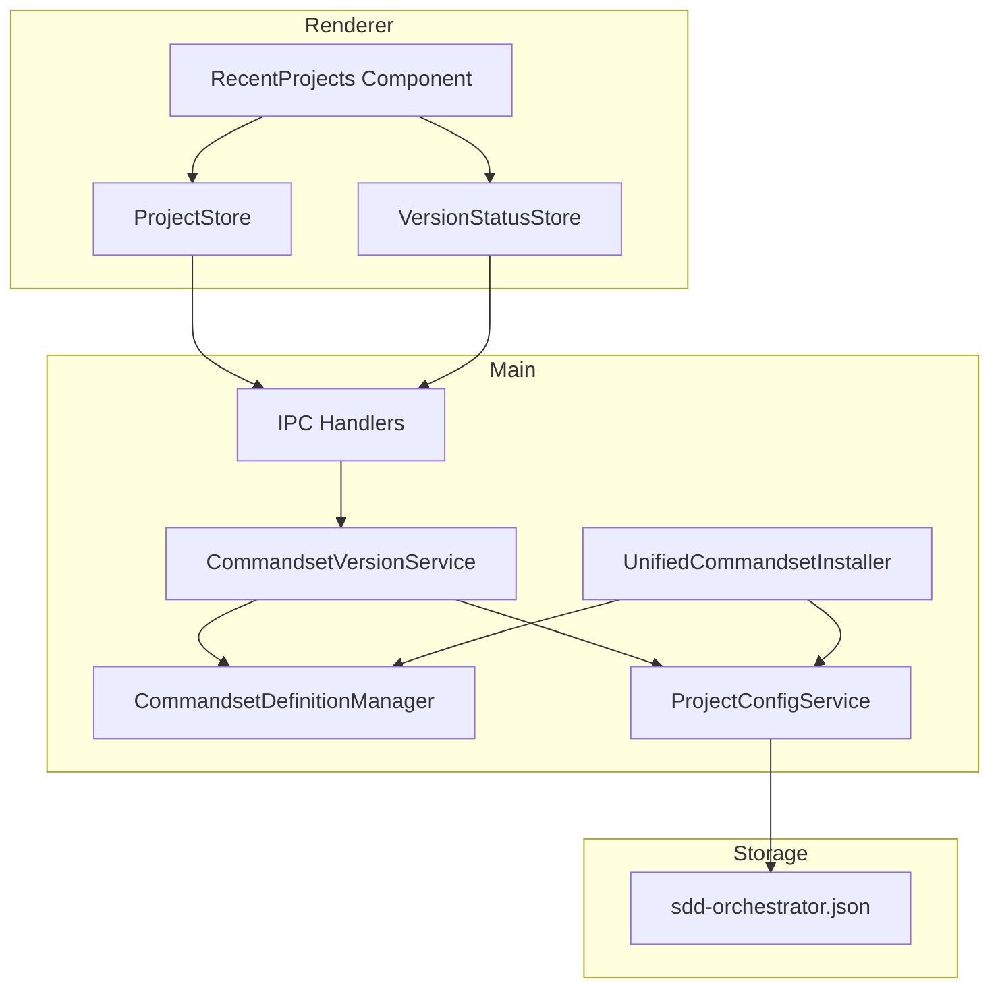
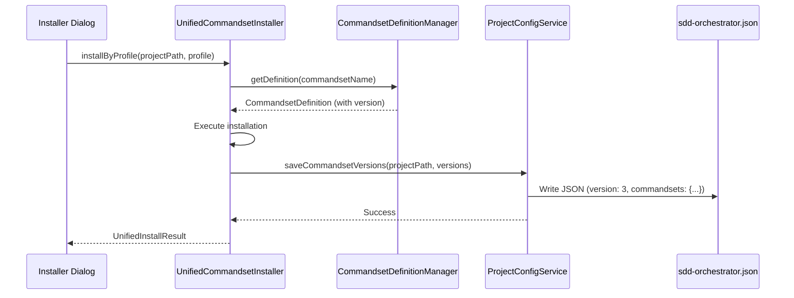
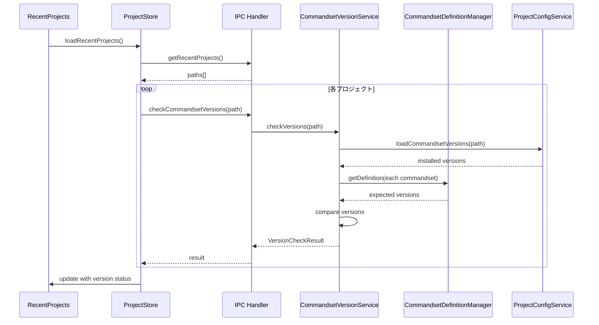
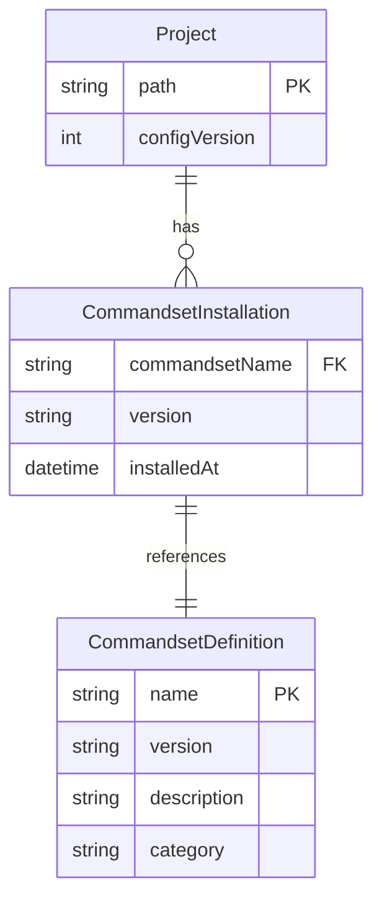

# 技術設計書

## Overview

**Purpose**: SDD Orchestratorのバージョンアップ時に、プロジェクトにインストール済みのコマンドセットが古くなったことを自動検出し、更新を促す機能を提供する。

**Users**: SDD Orchestratorを使用する開発者が、複数プロジェクトのコマンドセット更新状態を把握し、最新バージョンへの更新を容易に行えるようにする。

**Impact**: 既存の`.kiro/sdd-orchestrator.json`スキーマを拡張し、`CommandsetDefinitionManager.ts`をバージョン情報のSSOTとして確立する。

### Goals

- コマンドセットインストール時にバージョン情報を永続化
- プロジェクト読み込み時に古いコマンドセットを自動検出
- プロジェクト一覧で更新が必要なプロジェクトを視覚的に識別
- ワンクリックで更新ダイアログへ遷移
- バージョン定義をCommandsetDefinitionManager.tsに集約（SSOT）

### Non-Goals

- Remote UI対応（Desktop UI専用機能として実装）
- 自動アップデート機能（手動再インストールを促進）
- バージョン履歴の保持
- コマンドセット間の依存関係バージョン管理

## Architecture

### Existing Architecture Analysis

現在のアーキテクチャパターンと拡張ポイント:

- **ProjectConfigService** (`layoutConfigService.ts`): `.kiro/sdd-orchestrator.json`の読み書きを担当。version 2スキーマでprofileとlayoutを管理
- **CommandsetDefinitionManager**: コマンドセット定義（名前、説明、カテゴリ、バージョン、ファイルリスト）を保持。現在version `1.0.0`を静的に定義
- **UpdateManager**: バージョン検出のスケルトン実装。`LATEST_VERSIONS`定数で重複定義が存在
- **UnifiedCommandsetInstaller**: プロファイルベースのインストール処理。インストール後にprofileConfigを保存
- **RecentProjects + ProjectStore**: プロジェクト一覧表示とプロジェクト選択状態管理

### Architecture Pattern & Boundary Map



**Architecture Integration**:
- Selected pattern: Service Layer + Store Pattern (既存パターンを継承)
- Domain/feature boundaries: バージョン検出ロジックを`CommandsetVersionService`として分離し、既存サービスを拡張
- Existing patterns preserved: Zustand stores、IPC通信、Result型パターン
- New components rationale: `CommandsetVersionService`がバージョン比較ロジックを集約し、`UpdateManager`の`LATEST_VERSIONS`重複を解消
- Steering compliance: DRY（バージョン定義のSSOT化）、SSOT（CommandsetDefinitionManagerへの集約）

### Technology Stack

| Layer | Choice / Version | Role in Feature | Notes |
|-------|------------------|-----------------|-------|
| Frontend | React 19 + Zustand | バージョン状態表示・警告UI | 既存パターンを継承 |
| Backend | Electron Main Process | バージョン検出・比較ロジック | 新Service追加 |
| Data | JSON (sdd-orchestrator.json) | バージョン情報永続化 | スキーマv2→v3拡張 |
| Validation | Zod | スキーマバリデーション | 既存パターンを継承 |

## System Flows

### インストール時のバージョン記録フロー



### プロジェクト読み込み時のバージョンチェックフロー



## Requirements Traceability

| Requirement | Summary | Components | Interfaces | Flows |
|-------------|---------|------------|------------|-------|
| 1.1, 1.2, 1.3, 1.4 | コマンドセットバージョンの記録 | UnifiedCommandsetInstaller, ProjectConfigService | saveCommandsetVersions | インストール時フロー |
| 2.1, 2.2, 2.3, 2.4, 2.5 | バージョン差分の検出 | CommandsetVersionService, CommandsetDefinitionManager | checkVersions, compareVersions | 読み込み時フロー |
| 3.1, 3.2, 3.3, 3.4 | プロジェクト一覧での警告表示 | RecentProjects, VersionStatusStore | VersionCheckResult | UI表示 |
| 4.1, 4.2, 4.3 | 再インストールの促進 | RecentProjects, CommandsetInstallerDialog | onUpdateClick | UI操作 |
| 5.1, 5.2, 5.3, 5.4 | バージョン定義のSSOT化 | CommandsetDefinitionManager | getVersion | 全フロー |
| 6.1, 6.2, 6.3, 6.4 | sdd-orchestrator.jsonスキーマ拡張 | ProjectConfigService | ProjectConfigSchemaV3 | 読み書き |

## Components and Interfaces

### Component Summary

| Component | Domain/Layer | Intent | Req Coverage | Key Dependencies | Contracts |
|-----------|--------------|--------|--------------|-----------------|-----------|
| CommandsetVersionService | Main/Service | バージョン検出・比較ロジックを提供 | 2.1-2.5 | CDM (P0), ConfigService (P0) | Service |
| ProjectConfigService Extension | Main/Service | v3スキーマ対応とcommandsetsフィールド管理 | 1.1-1.4, 6.1-6.4 | Zod (P0) | Service |
| CommandsetDefinitionManager Extension | Main/Service | バージョン取得APIを追加 | 5.1-5.4 | - | Service |
| UnifiedCommandsetInstaller Extension | Main/Service | インストール時にバージョン記録 | 1.1-1.4 | CDM (P0), ConfigService (P0) | Service |
| RecentProjects Extension | Renderer/UI | 警告アイコンとツールチップ表示 | 3.1-3.4, 4.1-4.3 | VersionStatusStore (P0) | State |
| VersionStatusStore | Renderer/Store | プロジェクト別バージョン状態管理 | 3.1-3.4 | IPC (P0) | State |

### Main / Service Layer

#### CommandsetVersionService

| Field | Detail |
|-------|--------|
| Intent | コマンドセットのバージョン検出・比較・判定ロジックを集約 |
| Requirements | 2.1, 2.2, 2.3, 2.4, 2.5 |

**Responsibilities & Constraints**
- インストール済みバージョンと期待バージョンの比較
- レガシープロジェクト（commandsetsフィールドなし）の0.0.1扱い
- セマンティックバージョン比較ルールの適用

**Dependencies**
- Inbound: IPC Handlers - バージョンチェックリクエスト (P0)
- Outbound: CommandsetDefinitionManager - 期待バージョン取得 (P0)
- Outbound: ProjectConfigService - インストール済みバージョン取得 (P0)

**Contracts**: Service [x]

##### Service Interface

```typescript
interface CommandsetVersionInfo {
  readonly commandset: CommandsetName;
  readonly installedVersion: string;  // "0.0.1" for legacy
  readonly expectedVersion: string;
  readonly updateRequired: boolean;
}

interface VersionCheckResult {
  readonly projectPath: string;
  readonly hasCommandsets: boolean;  // false if no sdd-orchestrator.json
  readonly commandsets: readonly CommandsetVersionInfo[];
  readonly anyUpdateRequired: boolean;
}

interface CommandsetVersionService {
  /**
   * プロジェクトのコマンドセットバージョンをチェック
   * @param projectPath プロジェクトルートパス
   * @returns バージョンチェック結果
   */
  checkVersions(projectPath: string): Promise<VersionCheckResult>;

  /**
   * 2つのセマンティックバージョンを比較
   * @returns negative if a < b, 0 if a == b, positive if a > b
   */
  compareVersions(a: string, b: string): number;
}
```

- Preconditions: projectPathが有効なディレクトリパス
- Postconditions: 全インストール済みコマンドセットのバージョン情報を返す
- Invariants: expectedVersionはCommandsetDefinitionManagerから取得（SSOT）

**Implementation Notes**
- Integration: UpdateManagerの`LATEST_VERSIONS`を削除し、このサービスに統合
- Validation: セマンティックバージョン形式（MAJOR.MINOR.PATCH）のみ許可
- Risks: 大量のプロジェクトでのパフォーマンス（並列チェックで対応）

#### ProjectConfigService Extension

| Field | Detail |
|-------|--------|
| Intent | sdd-orchestrator.jsonのv3スキーマ対応とcommandsetsフィールド管理 |
| Requirements | 1.1, 1.2, 1.3, 1.4, 6.1, 6.2, 6.3, 6.4 |

**Responsibilities & Constraints**
- v1→v2→v3のマイグレーション対応
- 後方互換性の維持（commandsetsフィールドなしでもエラーにしない）
- commandsetsフィールドの読み書き

**Contracts**: Service [x]

##### Service Interface

```typescript
/**
 * コマンドセットバージョン情報
 */
interface CommandsetVersionRecord {
  readonly version: string;  // Semantic version
  readonly installedAt: string;  // ISO8601 timestamp
}

/**
 * v3スキーマ
 */
interface ProjectConfigV3 {
  readonly version: 3;
  readonly profile?: ProfileConfig;
  readonly layout?: LayoutValues;
  readonly commandsets?: Record<CommandsetName, CommandsetVersionRecord>;
}

/**
 * ProjectConfigService拡張
 */
interface ProjectConfigServiceExtension {
  /**
   * コマンドセットバージョン情報を読み込む
   * @returns commandsetsフィールド、またはレガシーの場合undefined
   */
  loadCommandsetVersions(projectPath: string): Promise<Record<CommandsetName, CommandsetVersionRecord> | undefined>;

  /**
   * コマンドセットバージョン情報を保存
   * 既存のprofile/layoutは維持
   */
  saveCommandsetVersions(
    projectPath: string,
    commandsets: Record<CommandsetName, CommandsetVersionRecord>
  ): Promise<void>;
}
```

- Preconditions: projectPathが有効
- Postconditions: v3フォーマットで保存、既存フィールドは維持
- Invariants: version: 3として書き込み

**Implementation Notes**
- Integration: 既存のloadProjectConfig/saveProjectConfigを拡張
- Validation: Zodスキーマによるランタイムバリデーション
- Risks: スキーママイグレーション時のデータ損失（v2→v3は追加のみで安全）

#### CommandsetDefinitionManager Extension

| Field | Detail |
|-------|--------|
| Intent | バージョン取得専用APIを追加し、SSOTを確立 |
| Requirements | 5.1, 5.2, 5.3, 5.4 |

**Responsibilities & Constraints**
- 全コマンドセットのバージョン定義を保持
- 外部からのバージョン参照はこのクラス経由

**Contracts**: Service [x]

##### Service Interface

```typescript
interface CommandsetDefinitionManagerExtension {
  /**
   * コマンドセットのバージョンを取得
   * @param commandsetName コマンドセット名
   * @returns セマンティックバージョン
   */
  getVersion(commandsetName: CommandsetName): string;

  /**
   * 全コマンドセットのバージョンマップを取得
   * @returns コマンドセット名→バージョンのマップ
   */
  getAllVersions(): ReadonlyMap<CommandsetName, string>;
}
```

- Preconditions: commandsetNameが有効な値
- Postconditions: 未知のコマンドセットには"0.0.0"を返す
- Invariants: definitionsマップからversionを抽出

**Implementation Notes**
- Integration: 既存のgetDefinition()を使用してversion抽出
- Risks: 新コマンドセット追加時の更新忘れ（テストで検出）

#### UnifiedCommandsetInstaller Extension

| Field | Detail |
|-------|--------|
| Intent | インストール完了時にバージョン情報を記録 |
| Requirements | 1.1, 1.2, 1.3, 1.4 |

**Responsibilities & Constraints**
- インストール成功後にCommandsetDefinitionManagerからバージョン取得
- ProjectConfigServiceを使用してcommandsetsフィールドに記録

**Contracts**: Service [x]

##### Service Interface

```typescript
// 既存のinstallByProfile/installCommandsetメソッドを拡張
// インストール成功後に自動的にバージョン情報を記録
```

**Implementation Notes**
- Integration: saveProfileConfig()を拡張してsaveCommandsetVersions()も呼び出し
- Validation: インストール成功時のみバージョン記録
- Risks: 部分的インストール失敗時のバージョン不整合（成功したコマンドセットのみ記録）

### Renderer / UI Layer

#### RecentProjects Extension

| Field | Detail |
|-------|--------|
| Intent | 更新が必要なプロジェクトに警告アイコンとツールチップを表示 |
| Requirements | 3.1, 3.2, 3.3, 3.4, 4.1, 4.2, 4.3 |

**Responsibilities & Constraints**
- 各プロジェクトのバージョン状態に基づいて警告アイコン表示
- ホバー時にツールチップで詳細表示
- 更新ボタンクリックでインストールダイアログを開く

**Dependencies**
- Inbound: VersionStatusStore - バージョン状態 (P0)
- Outbound: CommandsetInstallerDialog - 更新ダイアログ表示 (P1)

**Contracts**: State [x]

##### State Management

```typescript
interface VersionStatusState {
  // プロジェクトパス → バージョンチェック結果
  readonly versionStatus: Map<string, VersionCheckResult>;
  readonly isChecking: boolean;
}

interface VersionStatusActions {
  checkProjectVersions(projectPaths: string[]): Promise<void>;
  clearVersionStatus(): void;
}
```

##### CommandsetInstallerDialog連携インターフェース

```typescript
/**
 * CommandsetInstallDialogに渡す更新対象情報
 * インストールダイアログを開く際に、更新が必要なコマンドセットを伝達
 */
interface CommandsetInstallDialogProps {
  isOpen: boolean;
  projectPath: string;
  onClose: () => void;
  onInstall: (profileName: ProfileName, progressCallback?: ProgressCallback) => Promise<InstallResultSummary | void>;
  onCheckAgentFolderExists?: (projectPath: string) => Promise<boolean>;
  onDeleteAgentFolder?: (projectPath: string) => Promise<{ ok: true } | { ok: false; error: string }>;
  /**
   * 更新が必要なコマンドセット一覧（オプショナル）
   * 指定された場合、該当コマンドセットがハイライト表示される
   */
  updateTargets?: readonly CommandsetName[];
}
```

**ハイライト表示仕様**
- 更新対象のコマンドセットには背景色 `bg-amber-50` を適用
- 既存のプロジェクト内UIパターン（警告表示）に準拠
- ハイライト表示は視覚的な案内であり、インストール動作には影響しない

**Implementation Notes**
- Integration: 既存のRecentProjectsコンポーネントにアイコン追加
- Validation: VersionCheckResult.anyUpdateRequiredで警告判定
- Risks: 大量プロジェクトでのUIパフォーマンス（遅延ロードで対応）

## Data Models

### Domain Model



**Aggregates**:
- Project: プロジェクト設定のルートエンティティ
- CommandsetDefinition: コマンドセット定義（read-only、アプリ内蔵）

**Business Rules**:
- インストール済みバージョン < 期待バージョン → 更新が必要
- commandsetsフィールドなし → レガシープロジェクト（バージョン0.0.1扱い）
- sdd-orchestrator.jsonなし → コマンドセット未インストール

### Logical Data Model

**sdd-orchestrator.json v3 Schema**:

```typescript
// Zodスキーマ定義
const CommandsetVersionRecordSchema = z.object({
  version: z.string().regex(/^\d+\.\d+\.\d+(-[\w.]+)?$/),
  installedAt: z.string().datetime(),
});

const ProjectConfigSchemaV3 = z.object({
  version: z.literal(3),
  profile: ProfileConfigSchema.optional(),
  layout: LayoutValuesSchema.optional(),
  commandsets: z.record(
    z.enum(['cc-sdd', 'cc-sdd-agent', 'bug', 'document-review', 'spec-manager']),
    CommandsetVersionRecordSchema
  ).optional(),
});
```

**Migration Path**:
- v1 → v2: 既存（layoutのみ → profile追加）
- v2 → v3: commandsetsフィールド追加（後方互換）

## Error Handling

### Error Strategy

| Error Type | Handling | User Feedback |
|------------|----------|---------------|
| sdd-orchestrator.json不存在 | コマンドセット未インストールとして扱う | 警告アイコンなし |
| JSONパースエラー | レガシーとして扱う（0.0.1） | 警告アイコン表示 |
| ファイルアクセス権限エラー | バージョンチェックスキップ | コンソールログのみ |
| 未知のコマンドセット名 | 0.0.0として扱う | 無視 |

### Error Categories and Responses

**User Errors**: 該当なし（自動検出機能のため）

**System Errors**:
- ファイル読み込み失敗 → graceful degradation（チェックスキップ）
- IPC通信失敗 → リトライ（3回）→ スキップ

**Business Logic Errors**:
- 不正なバージョン形式 → 0.0.0として扱い、更新必要と判定

## Testing Strategy

### Unit Tests

- `CommandsetVersionService.compareVersions()`: セマンティックバージョン比較
- `CommandsetVersionService.checkVersions()`: レガシー/v3両対応
- `ProjectConfigService.loadCommandsetVersions()`: マイグレーション動作
- `CommandsetDefinitionManager.getVersion()`: SSOT動作確認
- `CommandsetDefinitionManager.getAllVersions()`: 全バージョン取得

### Integration Tests

- インストール→バージョン記録→読み込みの一連フロー
- v2→v3マイグレーション時のデータ保持
- 複数プロジェクトの並列バージョンチェック

### E2E Tests

- プロジェクト一覧での警告アイコン表示
- ツールチップのバージョン情報表示
- 更新ボタン→インストールダイアログ遷移

## Migration Strategy

### Phase 1: スキーマ拡張（後方互換）

1. ProjectConfigServiceにv3スキーマサポート追加
2. loadProjectConfigでv2→v3自動マイグレーション
3. commandsetsフィールドがなくてもエラーにしない

### Phase 2: バージョン記録

1. CommandsetDefinitionManager.getVersion()/getAllVersions()追加
2. UnifiedCommandsetInstallerでインストール時にバージョン記録
3. UpdateManagerのLATEST_VERSIONS削除

### Phase 3: UI実装

1. CommandsetVersionService実装
2. VersionStatusStore実装
3. RecentProjectsに警告アイコン追加
4. インストールダイアログ連携

### Rollback Triggers

- v3スキーマ読み込みでクラッシュ → v2互換モードで読み込み
- バージョンチェックでパフォーマンス問題 → チェック無効化フラグ追加
