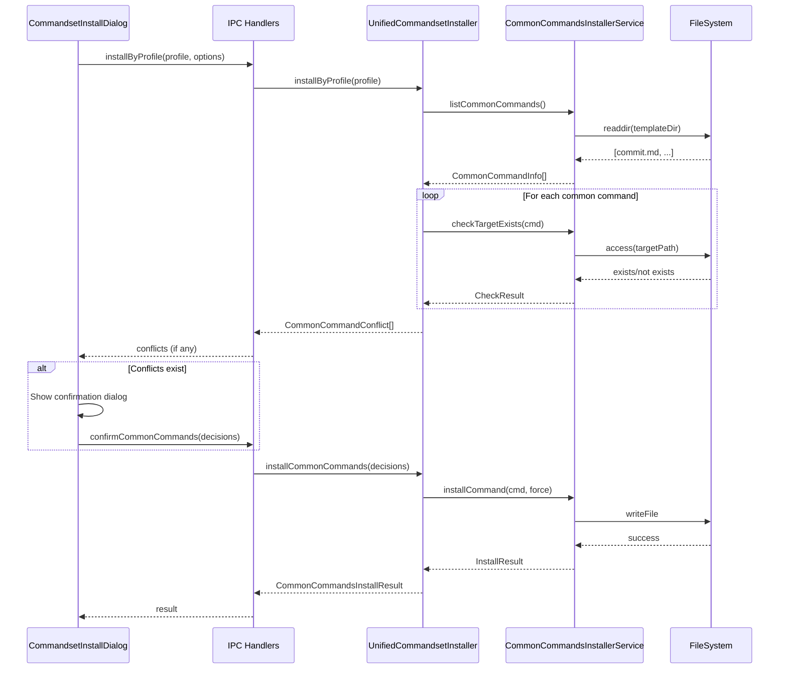
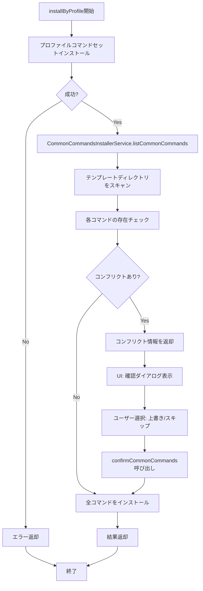

# Design Document: Common Commands Installer

## Overview

**Purpose**: この機能は、コマンドセットインストール時にプロファイルに依存しない共通コマンド（commit.md等）を明示的にインストールするフローを提供し、現在のプロジェクト選択時の暗黙的インストールを廃止する。

**Users**: SDD Orchestratorを使用する開発者が、コマンドセットインストール時に共通コマンドのインストール状況を把握し、既存のカスタマイズを保護しつつ更新できるようにする。

**Impact**: `setProjectPath()`からcommit.mdの自動インストールロジックを削除し、`UnifiedCommandsetInstaller.installByProfile()`の処理フローにcommonコマンドインストールを統合する。

### Goals

- プロジェクト選択時の暗黙的なcommit.mdインストールを廃止
- コマンドセットインストール時にcommonコマンドを明示的にインストール
- 既存ファイルの上書き確認UIを提供
- 将来のcommonコマンド追加に対応可能な拡張性のある設計

### Non-Goals

- CLIでのコマンドセットインストール対応
- commonコマンドの個別インストール/アンインストール機能
- commonコマンドのバージョン管理機能
- Remote UIでのcommonコマンド上書き確認（Desktop UI専用）

### Remote UI時の挙動

**背景**: Remote UIからはコマンドセットインストール（installByProfile）を呼び出すことが可能だが、上書き確認ダイアログを表示できない。

**方針**: Remote UIからのinstallByProfile呼び出し時は、commonコマンドのコンフリクトがある場合、**既存ファイルを優先してスキップ**する（自動スキップ）。

**実装詳細**:
- `installByProfile`の結果にコンフリクトが含まれている場合、Desktop UIは確認ダイアログを表示
- Remote UI（またはAPIクライアント）は確認ダイアログを表示できないため、コンフリクトをスキップとして扱う
- スキップされたファイルは結果の`skipped`配列に含まれ、ログに警告として記録される

**理由**:
- ユーザーのカスタマイズを誤って上書きするリスクを回避
- Remote UIからの操作は主に自動化や一括処理が想定されるため、既存ファイルの保護が優先される

## Architecture

### Existing Architecture Analysis

**現在の実装パターン**:
- `setProjectPath()` (handlers.ts:381-424): プロジェクト選択時に`commonCommandsInstaller.installCommitCommand()`を自動実行
- `CommonCommandsInstallerService`: commit.mdのインストール機能を提供（既存ファイルはスキップ）
- `UnifiedCommandsetInstaller.installByProfile()`: プロファイル別のコマンドセットインストールを統合管理
- `CommandsetInstallDialog`: プロファイル選択UIとインストール進捗表示

**既存の上書き確認パターン**:
- `InstallOptions.force`: 上書き強制フラグ（UIでの確認なしに一括上書き）
- 現在のcommonコマンドは既存ファイルをスキップする設計（上書き確認UIなし）

**技術的制約**:
- Electron Main Process: ファイル操作、CommonCommandsInstallerService
- Renderer Process: CommandsetInstallDialog（React + Zustand）
- IPC: installByProfile チャンネル経由でMain-Renderer間通信

### Architecture Pattern & Boundary Map



**Architecture Integration**:
- Selected pattern: 既存のUnifiedCommandsetInstaller拡張パターン
- Domain/feature boundaries: CommonCommandsInstallerService（Main）とCommandsetInstallDialog（Renderer）の責務分離
- Existing patterns preserved: InstallOptions/InstallResult型、Result<T,E>パターン、IPC通信パターン
- New components rationale: 上書き確認フロー用のIPC拡張と対話状態管理
- Steering compliance: DRY（既存CommonCommandsInstallerServiceを拡張）、KISS（最小限の変更）

### Technology Stack

| Layer | Choice / Version | Role in Feature | Notes |
|-------|------------------|-----------------|-------|
| Frontend | React 19, TypeScript 5.8+ | 上書き確認ダイアログUI | CommandsetInstallDialogの拡張 |
| Backend | Node.js 20+, Electron 35 | ファイル操作、IPC処理 | handlers.ts, CommonCommandsInstallerService |
| Data | FileSystem (fs/promises) | テンプレート読み込み、インストール | resources/templates/commands/common/ |

## System Flows

### Common Commands Conflict Check Flow



**Key Decisions**:
- コンフリクトチェックはプロファイルインストール成功後に実行（ベストエフォート）
- コンフリクト情報はIPC経由でRendererに返却し、UIで確認フローを実行
- 各ファイルごとに上書き/スキップを選択可能

## Requirements Traceability

| Criterion ID | Summary | Components | Implementation Approach |
|--------------|---------|------------|------------------------|
| 1.1 | プロジェクト選択時にcommit.mdを自動インストールしない | handlers.ts (setProjectPath) | 既存ロジック削除 |
| 1.2 | setProjectPath()からcommitインストールロジックを削除 | handlers.ts | コード削除 |
| 2.1 | プロファイルインストール時にcommonコマンドをインストール | UnifiedCommandsetInstaller | 新規メソッド追加 |
| 2.2 | .claude/commands/にインストール | CommonCommandsInstallerService | 既存機能を使用 |
| 2.3 | 失敗時は警告ログを出してインストール続行 | UnifiedCommandsetInstaller | try-catch + logger.warn |
| 3.1 | 既存ファイル存在時に確認ダイアログ表示 | CommandsetInstallDialog | 新規ダイアログ状態追加 |
| 3.2 | ファイルごとに個別に確認 | CommandsetInstallDialog | コンフリクトリスト表示 |
| 3.3 | 上書き/スキップオプション | CommandsetInstallDialog | ラジオボタン/チェックボックス |
| 3.4 | スキップ時は既存ファイルを変更しない | CommonCommandsInstallerService | 既存force=falseロジック |
| 3.5 | 上書き時はテンプレートで置換 | CommonCommandsInstallerService | 既存force=trueロジック |
| 4.1 | commonコマンドリストをサポート | CommonCommandsInstallerService | listCommonCommands()追加 |
| 4.2 | テンプレートは中央ディレクトリに配置 | resources/templates/commands/common/ | 既存構造を使用 |
| 4.3 | ファイル追加のみで新コマンド対応 | CommonCommandsInstallerService | ディレクトリスキャン方式 |

### Coverage Validation Checklist

- [x] Every criterion ID from requirements.md appears in the table above
- [x] Each criterion has specific component names (not generic references)
- [x] Implementation approach distinguishes "reuse existing" vs "new implementation"
- [x] User-facing criteria specify concrete UI components

## Components and Interfaces

| Component | Domain/Layer | Intent | Req Coverage | Key Dependencies | Contracts |
|-----------|--------------|--------|--------------|-----------------|-----------|
| CommonCommandsInstallerService | Main/Service | commonコマンドのリスト取得・インストール | 2.1, 2.2, 4.1, 4.2, 4.3 | fs/promises (P0) | Service |
| UnifiedCommandsetInstaller | Main/Service | コマンドセットインストール統合 | 2.1, 2.3 | CommonCommandsInstallerService (P0) | Service |
| CommandsetInstallDialog | Renderer/UI | プロファイル選択と上書き確認UI | 3.1, 3.2, 3.3 | electronAPI (P0) | State |
| handlers.ts | Main/IPC | IPC通信ハンドラ | 1.1, 1.2 | UnifiedCommandsetInstaller (P0) | API |

### Main/Service Layer

#### CommonCommandsInstallerService (Extension)

| Field | Detail |
|-------|--------|
| Intent | commonコマンドテンプレートのリスト取得と個別インストール機能を提供 |
| Requirements | 2.2, 4.1, 4.2, 4.3 |

**Responsibilities & Constraints**
- テンプレートディレクトリのスキャンによるコマンドリスト取得
- 既存ファイルの存在チェック
- force オプションによる上書き制御

**Dependencies**
- Outbound: fs/promises - ファイル操作 (P0)

**Contracts**: Service [x]

##### Service Interface

```typescript
interface CommonCommandInfo {
  readonly name: string;          // e.g., "commit"
  readonly templatePath: string;  // 絶対パス
  readonly targetRelativePath: string; // e.g., ".claude/commands/commit.md"
}

interface CommonCommandConflict {
  readonly name: string;
  readonly targetPath: string;
  readonly existingModifiedAt?: string; // ISO 8601
}

interface CommonCommandDecision {
  readonly name: string;
  readonly action: 'overwrite' | 'skip';
}

interface CommonCommandsInstallResult {
  readonly installed: readonly string[];
  readonly skipped: readonly string[];
  readonly overwritten: readonly string[];
  readonly failed: readonly { name: string; error: string }[];
}

interface CommonCommandsInstallerService {
  // 新規追加
  listCommonCommands(): Promise<Result<CommonCommandInfo[], InstallError>>;

  checkConflicts(projectPath: string): Promise<Result<CommonCommandConflict[], InstallError>>;

  installAllCommands(
    projectPath: string,
    decisions: CommonCommandDecision[]
  ): Promise<Result<CommonCommandsInstallResult, InstallError>>;

  // 既存（維持）
  installCommitCommand(projectPath: string, options?: InstallOptions): Promise<Result<InstallResult, InstallError>>;
  checkCommitCommandExists(projectPath: string): Promise<CheckResult>;
}
```

- Preconditions: テンプレートディレクトリが存在すること
- Postconditions: 指定されたdecisionsに従いファイルがインストールまたはスキップされる
- Invariants: テンプレートファイルは読み取り専用として扱う

**Implementation Notes**
- Integration: 既存のinstallCommitCommandは内部的にinstallAllCommandsを使用するように委譲可能
- Validation: テンプレートファイルの存在チェック、ターゲットディレクトリの書き込み権限チェック
- Risks: テンプレートディレクトリが空の場合のエッジケース対応

#### UnifiedCommandsetInstaller (Extension)

| Field | Detail |
|-------|--------|
| Intent | プロファイルインストール時にcommonコマンドインストールを統合 |
| Requirements | 2.1, 2.3 |

**Responsibilities & Constraints**
- installByProfile/installMultipleの最終ステップとしてcommonコマンドをインストール
- commonコマンドインストール失敗時は警告ログを出して続行

**Dependencies**
- Inbound: IPC handlers - インストール要求 (P0)
- Outbound: CommonCommandsInstallerService - commonコマンドインストール (P0)

**Contracts**: Service [x]

##### Service Interface

```typescript
interface UnifiedInstallResultWithCommon extends UnifiedInstallResult {
  readonly commonCommands?: CommonCommandsInstallResult;
  readonly commonCommandConflicts?: readonly CommonCommandConflict[];
}

interface UnifiedCommandsetInstaller {
  // 拡張: conflicts を返却可能に
  installByProfile(
    projectPath: string,
    profileName: ProfileName,
    options?: InstallOptions,
    progressCallback?: ProgressCallback
  ): Promise<Result<UnifiedInstallResultWithCommon, InstallError>>;

  // 新規追加: コンフリクト解決後のcommonコマンドインストール
  installCommonCommandsWithDecisions(
    projectPath: string,
    decisions: CommonCommandDecision[]
  ): Promise<Result<CommonCommandsInstallResult, InstallError>>;
}
```

- Preconditions: プロファイルインストールが成功していること（commonコマンドは補助的位置づけ）
- Postconditions: commonコマンドがインストールまたはスキップされ、結果が返却される
- Invariants: commonコマンドインストール失敗はプロファイルインストール全体を失敗させない

**Implementation Notes**
- Integration: installMultiple完了後にcheckConflicts→コンフリクトありならconflicts返却、なければ自動インストール
- Validation: commonコマンドテンプレートの存在確認
- Risks: 大量のcommonコマンドが追加された場合のUI/UXへの影響

### Renderer/UI Layer

#### CommandsetInstallDialog (Extension)

| Field | Detail |
|-------|--------|
| Intent | commonコマンドの上書き確認UIを提供 |
| Requirements | 3.1, 3.2, 3.3, 3.4, 3.5 |

**Responsibilities & Constraints**
- commonコマンドのコンフリクト表示
- ファイルごとの上書き/スキップ選択UI
- 確認後のインストール実行

**Dependencies**
- Outbound: window.electronAPI - IPC通信 (P0)

**Contracts**: State [x]

##### State Management

```typescript
type CommonCommandDialogState =
  | 'selection'                    // プロファイル選択
  | 'agent-cleanup-confirm'        // エージェントクリーンアップ確認（既存）
  | 'installing'                   // インストール中
  | 'common-command-confirm'       // commonコマンド上書き確認（新規）
  | 'complete';                    // 完了

interface CommonCommandConflictState {
  readonly name: string;
  readonly targetPath: string;
  readonly decision: 'overwrite' | 'skip';
}

// CommandsetInstallDialog内の追加state
const [commonConflicts, setCommonConflicts] = useState<CommonCommandConflictState[]>([]);
```

- State model: DialogStateの拡張（'common-command-confirm'追加）
- Persistence: セッション内のみ（ダイアログ閉じるとリセット）
- Concurrency strategy: 単一ダイアログインスタンス、シリアル実行

**Implementation Notes**
- Integration: installByProfile完了後にconflictsがあれば'common-command-confirm'状態へ遷移
- Validation: 全コンフリクトに対してdecisionが設定されていることを確認
- Risks: 多数のコンフリクトがある場合のスクロール/UX

### Main/IPC Layer

#### handlers.ts (Modification)

| Field | Detail |
|-------|--------|
| Intent | setProjectPath()からcommit.md自動インストールを削除、confirmCommonCommands IPC追加 |
| Requirements | 1.1, 1.2 |

**Responsibilities & Constraints**
- setProjectPath()のcommitインストールロジック削除
- 新規IPC: confirmCommonCommands

**Dependencies**
- Outbound: UnifiedCommandsetInstaller - commonコマンドインストール (P0)

**Contracts**: API [x]

##### API Contract

| Method | Channel | Request | Response | Errors |
|--------|---------|---------|----------|--------|
| handle | confirmCommonCommands | { projectPath: string, decisions: CommonCommandDecision[] } | CommonCommandsInstallResult | INSTALL_ERROR |

**Implementation Notes**
- Integration: 既存のinstallByProfile IPCは変更なし（結果にconflictsを追加）
- Validation: projectPathの存在確認、decisionsの形式検証
- Risks: IPC通信エラー時のリトライ戦略

## Data Models

### Domain Model

**Aggregates**:
- CommonCommandTemplate: テンプレートファイルの論理単位
- CommonCommandInstallation: プロジェクトへのインストール状態

**Value Objects**:
- CommonCommandInfo: コマンド情報（name, templatePath, targetRelativePath）
- CommonCommandConflict: コンフリクト情報
- CommonCommandDecision: ユーザー決定

**Business Rules**:
- commonコマンドはプロファイルに依存しない
- 既存ファイルの上書きはユーザー確認が必要
- インストール失敗は警告扱い（全体失敗にしない）

### Logical Data Model

**Structure Definition**:
- CommonCommandInfo: 1:1 with template file
- CommonCommandConflict: 0..N per project (only for existing files)
- CommonCommandDecision: 1:1 with CommonCommandConflict

**Consistency & Integrity**:
- テンプレートディレクトリスキャン時点のスナップショット
- 確認ダイアログ表示後の変更は考慮しない（ベストエフォート）

## Error Handling

### Error Strategy

- **Template Not Found**: 警告ログ出力、スキップして続行
- **Write Permission Denied**: エラー返却、該当ファイルをfailed配列に追加
- **IPC Communication Error**: Renderer側でエラーメッセージ表示

### Error Categories and Responses

**User Errors (Validation)**:
- 不正なdecisions配列 → 400相当、フォーム再入力促す

**System Errors**:
- ファイルシステムエラー → 個別ファイル失敗、全体は続行
- テンプレートディレクトリ不存在 → 警告ログ、commonコマンドスキップ

**Business Logic Errors**:
- コンフリクト未解決 → 確認ダイアログ表示継続

### Monitoring

- logger.warn: commonコマンドインストール失敗時
- logger.info: commonコマンドインストール成功時
- logger.debug: 既存ファイルスキップ時

## Testing Strategy

### Unit Tests

1. **CommonCommandsInstallerService.listCommonCommands**: テンプレートディレクトリスキャン
2. **CommonCommandsInstallerService.checkConflicts**: 存在・非存在ファイルの混在ケース
3. **CommonCommandsInstallerService.installAllCommands**: overwrite/skip混在ケース
4. **UnifiedCommandsetInstaller**: commonコマンド統合フロー
5. **handlers.ts setProjectPath**: commitインストールロジック削除確認

### Integration Tests

1. **プロファイルインストール→commonコマンドインストール**: E2Eフロー
2. **コンフリクト検出→確認→インストール**: UIフロー
3. **失敗時のベストエフォート動作**: 一部失敗時の続行確認

### E2E Tests

1. **新規プロジェクトへのインストール**: コンフリクトなしケース
2. **既存commit.mdがあるプロジェクト**: 上書き確認フロー
3. **スキップ選択時の既存ファイル保持**: ファイル内容が変更されないこと

## Design Decisions

### DD-001: setProjectPath()からの自動インストール削除

| Field | Detail |
|-------|--------|
| Status | Accepted |
| Context | 現在commit.mdはプロジェクト選択時に暗黙的にインストールされる。ユーザーは何がインストールされたか把握しにくい。 |
| Decision | setProjectPath()からcommit.mdの自動インストールロジックを完全に削除し、コマンドセットインストール時のみにインストールする。 |
| Rationale | ユーザーの予測可能性向上、明示的なインストールフローへの統合、既存ファイルの保護 |
| Alternatives Considered | (1) 自動インストールを維持しつつ通知を追加 - 暗黙的動作の問題が残る (2) 設定でON/OFF切り替え - 複雑性増加 |
| Consequences | プロジェクト選択のみではcommit.mdがインストールされない。コマンドセットインストールが必須になる。 |

### DD-002: ファイルごとの上書き確認UI

| Field | Detail |
|-------|--------|
| Status | Accepted |
| Context | 既存のカスタマイズされたcommit.mdを誤って上書きするリスクがある。 |
| Decision | コンフリクトがある場合、ファイルごとに上書き/スキップを選択できるダイアログを表示する。 |
| Rationale | ユーザーのカスタマイズ保護、粒度の細かい制御、将来のcommonコマンド追加時の一貫性 |
| Alternatives Considered | (1) 一括上書き/スキップのみ - 柔軟性不足 (2) 自動スキップ（常に既存優先） - 更新ができない |
| Consequences | UIの複雑性が若干増加。将来「すべて上書き」「すべてスキップ」オプション追加の余地を残す。 |

### DD-003: ベストエフォートによるcommonコマンドインストール

| Field | Detail |
|-------|--------|
| Status | Accepted |
| Context | commonコマンドインストール失敗時の動作を定義する必要がある。 |
| Decision | commonコマンドインストール失敗時は警告ログを出力し、コマンドセットインストール全体は成功として扱う。 |
| Rationale | commonコマンドはワークフローの補助的位置づけ。メインのコマンドセット（cc-sdd等）が使えることが優先。 |
| Alternatives Considered | (1) 失敗時は全体失敗 - 厳格すぎる (2) リトライ機能 - 複雑性増加 |
| Consequences | 稀にcommonコマンドがインストールされない状態が発生しうる。ユーザーは手動で再インストール可能。 |

### DD-004: テンプレートディレクトリスキャンによる拡張性確保

| Field | Detail |
|-------|--------|
| Status | Accepted |
| Context | 将来のcommonコマンド追加を容易にする設計が必要。 |
| Decision | `resources/templates/commands/common/`ディレクトリをスキャンし、存在する全.mdファイルをcommonコマンドとして扱う。 |
| Rationale | 新規コマンド追加時にコード変更不要、設定ファイルも不要、シンプルな運用 |
| Alternatives Considered | (1) manifest.jsonで明示的に定義 - 設定の同期が必要 (2) ハードコード - 拡張性なし |
| Consequences | ディレクトリに不要なファイルがあると誤ってインストール対象になる。命名規則やREADME除外などの考慮が必要。 |

### DD-005: 既存CommonCommandsInstallerServiceの拡張

| Field | Detail |
|-------|--------|
| Status | Accepted |
| Context | 新規サービスを作成するか、既存サービスを拡張するかの選択。 |
| Decision | 既存のCommonCommandsInstallerServiceにlistCommonCommands、checkConflicts、installAllCommandsメソッドを追加する。 |
| Rationale | DRY原則（既存のinstallCommitCommandロジックを再利用）、既存テストの活用、コードベースの一貫性 |
| Alternatives Considered | (1) 新規サービス作成 - コード重複 (2) UnifiedCommandsetInstallerに直接実装 - 責務の肥大化 |
| Consequences | CommonCommandsInstallerServiceの責務が拡大。テストケースの追加が必要。 |
