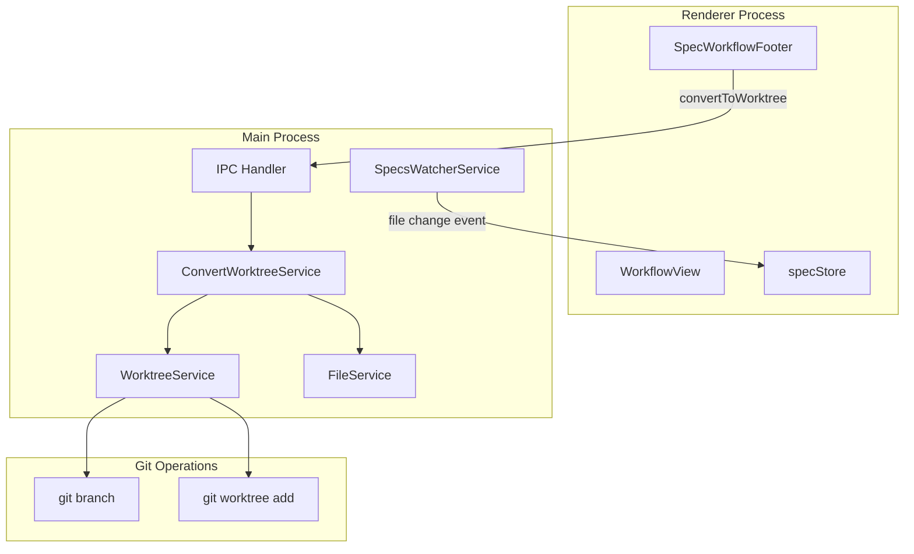
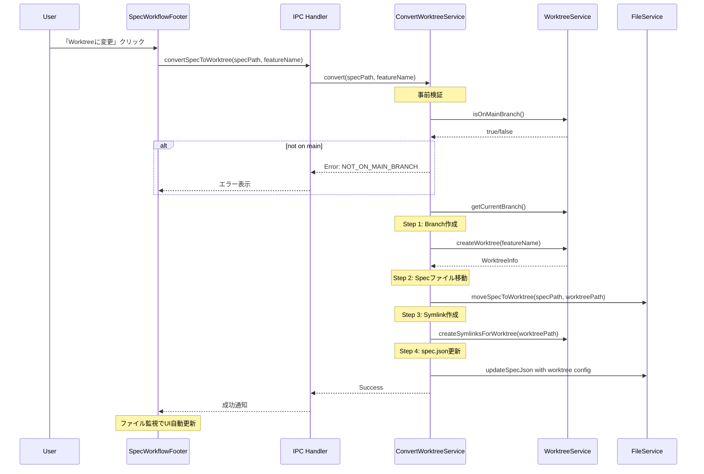
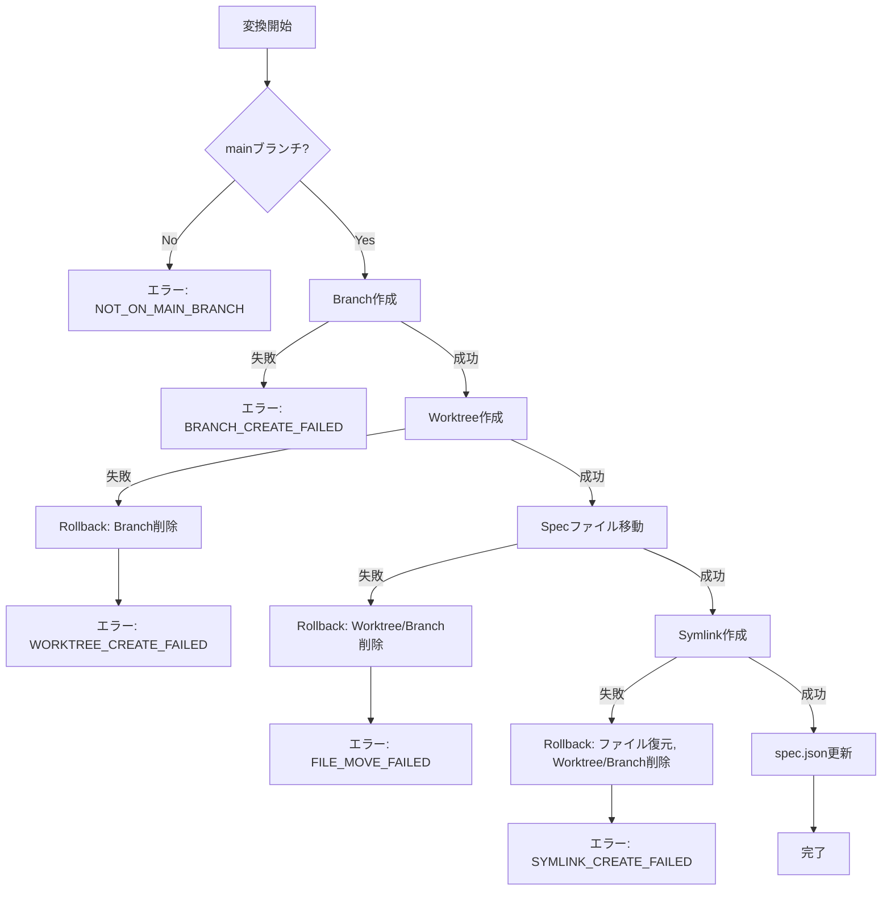

# Design: 通常SpecからWorktreeへの変換機能

## Overview

**Purpose**: この機能は、実装開始前の通常モードSpecをWorktreeモードに変換する機能を提供する。ユーザーはSpec作成後でも、実装フェーズ前であればWorkflowViewからワンクリックでWorktreeモードに切り替えられる。

**Users**: 開発者がspec作成時にWorktreeモードを選択し忘れた場合や、途中からWorktree分離が必要と判断した場合に使用する。

**Impact**: 既存のSpecWorkflowFooterコンポーネントに新しいボタンを追加し、worktreeService、specsWatcherServiceを拡張する。

### Goals

- impl未開始のSpecをWorktreeモードに途中変換できる
- SpecWorkflowFooterに「Worktreeに変更」ボタンを配置
- 変換処理（branch作成、worktree作成、ファイル移動、symlink作成）を一括実行
- Remote UIからも同じ操作が可能

### Non-Goals

- Worktreeモードから通常モードへの逆変換
- 複数Specの一括変換
- impl開始後のWorktree変換
- カスタムブランチ名指定

## Architecture

### Existing Architecture Analysis

現在のWorktree関連アーキテクチャ:

1. **WorktreeService** (`src/main/services/worktreeService.ts`): git worktree操作のラッパー。`createWorktree()`, `createSymlinksForWorktree()` などを提供
2. **SpecsWatcherService** (`src/main/services/specsWatcherService.ts`): `.kiro/specs/` と `.kiro/worktrees/specs/*/` を監視
3. **FileService** (`src/main/services/fileService.ts`): spec.json更新、ファイル操作
4. **SpecWorkflowFooter** (`src/renderer/components/SpecWorkflowFooter.tsx`): 自動実行ボタンのみを持つシンプルなフッター
5. **IPC Channels**: `worktree:create`, `worktree:impl-start` など既存チャンネル

### Architecture Pattern & Boundary Map



**Architecture Integration**:
- Selected pattern: 既存のWorktreeService/FileServiceを活用したトランザクション的操作
- Domain boundaries: 変換ロジックは新しいサービス(ConvertWorktreeService)に集約
- Existing patterns preserved: IPC経由のMain Process操作、ファイル監視によるUI同期
- New components rationale: 変換処理は複数ステップのトランザクション的操作のため専用サービスで管理
- Steering compliance: SSOT原則に従いspec.jsonを信頼の源泉とする

### Technology Stack

| Layer | Choice / Version | Role in Feature | Notes |
|-------|------------------|-----------------|-------|
| Frontend | React 19, TypeScript 5.8+ | UI表示・操作 | SpecWorkflowFooter拡張 |
| Backend | Node.js 20+, Electron 35 | 変換処理実行 | ConvertWorktreeService新設 |
| IPC | Electron IPC + WebSocket | 通信 | 新規チャンネル追加 |
| File System | chokidar | 変更監視 | 既存のspecsWatcherService利用 |

## System Flows

### Worktree変換フロー



### エラー時のロールバックフロー



## Requirements Traceability

| Criterion ID | Summary | Components | Implementation Approach |
|--------------|---------|------------|------------------------|
| 1.1 | Worktreeモードでない、impl未開始、agent非実行時にボタン表示 | SpecWorkflowFooter, WorkflowView | 既存コンポーネント拡張 |
| 1.2 | 既にWorktreeモードならボタン非表示 | SpecWorkflowFooter | hasWorktreePath()で判定 |
| 1.3 | impl開始済みならボタン非表示 | SpecWorkflowFooter | isImplStarted()で判定 |
| 1.4 | agent実行中はボタン無効化 | SpecWorkflowFooter | runningPhases.size > 0で判定 |
| 2.1 | ボタン押下で変換処理を順次実行 | ConvertWorktreeService | 新規サービス実装 |
| 2.2 | mainブランチ以外でエラー | ConvertWorktreeService | isOnMainBranch()検証 |
| 2.3 | Worktree作成失敗時にbranch削除 | ConvertWorktreeService | rollbackOnWorktreeFailure() |
| 2.4 | ファイル移動失敗時にworktree/branch削除 | ConvertWorktreeService | rollbackOnMoveFailure() |
| 2.5 | 処理完了後に成功メッセージ | WorkflowView | notify.success() |
| 3.1 | プロジェクト選択時に両パス監視 | SpecsWatcherService | 既存実装で対応済み |
| 3.2 | Worktree内spec追加検知 | SpecsWatcherService | 既存実装で対応済み |
| 3.3 | Worktree内spec.json変更検知 | SpecsWatcherService | 既存実装で対応済み |
| 3.4 | 元specディレクトリ削除後もworktree spec表示 | SpecsWatcherService | 既存実装で対応済み |
| 4.1 | Remote UIでも同条件でボタン表示 | SpecDetailView (remote-ui) | 共有ロジック利用 |
| 4.2 | Remote UIからWebSocket経由で変換実行 | webSocketHandler | 新規ハンドラ追加 |
| 4.3 | Remote UIで成功/エラーメッセージ表示 | SpecDetailView (remote-ui) | 共通通知コンポーネント |
| 5.1 | mainブランチ以外エラーメッセージ | ConvertWorktreeService | 具体的エラーメッセージ |
| 5.2 | spec未発見エラーメッセージ | ConvertWorktreeService | SPEC_NOT_FOUND |
| 5.3 | 既にWorktreeモードエラーメッセージ | ConvertWorktreeService | ALREADY_WORKTREE_MODE |
| 5.4 | impl開始済みエラーメッセージ | ConvertWorktreeService | IMPL_ALREADY_STARTED |
| 5.5 | Worktree作成失敗エラーメッセージ | ConvertWorktreeService | WORKTREE_CREATE_FAILED |
| 5.6 | ファイル移動失敗エラーメッセージ | ConvertWorktreeService | FILE_MOVE_FAILED |

### Coverage Validation Checklist

- [x] Every criterion ID from requirements.md appears in the table above
- [x] Each criterion has specific component names (not generic references)
- [x] Implementation approach distinguishes "reuse existing" vs "new implementation"
- [x] User-facing criteria specify concrete UI components

## Components and Interfaces

| Component | Domain/Layer | Intent | Req Coverage | Key Dependencies | Contracts |
|-----------|--------------|--------|--------------|------------------|-----------|
| ConvertWorktreeService | Main/Service | Spec変換ロジック | 2.1-2.5, 5.1-5.6 | WorktreeService (P0), FileService (P0) | Service |
| SpecWorkflowFooter | Renderer/UI | 変換ボタン表示 | 1.1-1.4 | specStore (P1) | - |
| convertSpecToWorktreeHandler | Main/IPC | IPC処理 | 2.1, 4.2 | ConvertWorktreeService (P0) | API |
| webSocketHandler (拡張) | Main/Remote | WebSocket処理 | 4.2 | ConvertWorktreeService (P0) | API |

### Main Process / Service Layer

#### ConvertWorktreeService

| Field | Detail |
|-------|--------|
| Intent | 通常SpecからWorktreeモードへの変換処理を統括 |
| Requirements | 2.1, 2.2, 2.3, 2.4, 2.5, 5.1, 5.2, 5.3, 5.4, 5.5, 5.6 |

**Responsibilities & Constraints**
- Worktree変換の全フェーズを管理（branch作成、worktree作成、ファイル移動、symlink、spec.json更新）
- エラー発生時のロールバック処理
- 事前条件検証（mainブランチ、impl未開始、非Worktreeモード）

**Dependencies**
- Inbound: IPC Handler - 変換リクエスト受信 (P0)
- Outbound: WorktreeService - git worktree操作 (P0)
- Outbound: FileService - ファイル操作、spec.json更新 (P0)

**Contracts**: Service [x] / API [ ] / Event [ ] / Batch [ ] / State [ ]

##### Service Interface

```typescript
import type { WorktreeInfo, WorktreeServiceResult } from '../../renderer/types/worktree';

export type ConvertError =
  | { type: 'NOT_ON_MAIN_BRANCH'; currentBranch: string }
  | { type: 'SPEC_NOT_FOUND'; specPath: string }
  | { type: 'ALREADY_WORKTREE_MODE'; specPath: string }
  | { type: 'IMPL_ALREADY_STARTED'; specPath: string }
  | { type: 'BRANCH_CREATE_FAILED'; message: string }
  | { type: 'WORKTREE_CREATE_FAILED'; message: string }
  | { type: 'FILE_MOVE_FAILED'; message: string }
  | { type: 'SYMLINK_CREATE_FAILED'; message: string }
  | { type: 'SPEC_JSON_UPDATE_FAILED'; message: string };

export type ConvertResult = WorktreeServiceResult<WorktreeInfo>;

export interface ConvertWorktreeService {
  /**
   * 通常モードのSpecをWorktreeモードに変換する
   *
   * @param projectPath - プロジェクトルートパス
   * @param specPath - Specディレクトリパス (.kiro/specs/{feature})
   * @param featureName - フィーチャー名
   * @returns WorktreeInfo on success, ConvertError on failure
   *
   * 処理順序:
   * 1. 事前検証（mainブランチ、impl未開始、非Worktreeモード）
   * 2. git branch feature/{featureName} 作成
   * 3. git worktree add .kiro/worktrees/specs/{featureName} feature/{featureName}
   * 4. specディレクトリを worktree内の .kiro/specs/{featureName} に移動
   * 5. logs/runtime シンボリックリンク作成
   * 6. spec.json に worktree設定追加
   *
   * エラー時は作成済みリソースをロールバック
   */
  convertToWorktree(
    projectPath: string,
    specPath: string,
    featureName: string
  ): Promise<WorktreeServiceResult<WorktreeInfo>>;

  /**
   * 変換可能かどうかを検証する（UIからの事前チェック用）
   *
   * @param projectPath - プロジェクトルートパス
   * @param specPath - Specディレクトリパス
   * @returns true if convertible, error details otherwise
   */
  canConvert(
    projectPath: string,
    specPath: string
  ): Promise<WorktreeServiceResult<boolean>>;
}
```

- Preconditions:
  - specPathが存在し、spec.jsonが読み取り可能
  - 現在のブランチがmainまたはmaster
  - spec.json.worktree.pathが未設定（非Worktreeモード）
  - spec.json.worktree.branchが未設定（impl未開始）
- Postconditions:
  - `.kiro/worktrees/specs/{featureName}/` にworktreeが作成される
  - specディレクトリがworktree内に移動される
  - spec.jsonにworktree設定が追加される
  - 元の`.kiro/specs/{featureName}/`は削除される
- Invariants:
  - エラー時は全ての変更がロールバックされる
  - spec.jsonは常に整合性のある状態を維持

**Implementation Notes**
- Integration: 既存のWorktreeServiceとFileServiceを組み合わせて使用
- Validation: 各ステップ前に事前条件を検証、失敗時は即座にロールバック
- Risks: ファイル移動中のクラッシュによるデータ損失（ロールバック処理で軽減）

### Main Process / IPC Layer

#### convertSpecToWorktreeHandler

| Field | Detail |
|-------|--------|
| Intent | Worktree変換のIPCハンドラ |
| Requirements | 2.1, 4.2 |

**Contracts**: Service [ ] / API [x] / Event [ ] / Batch [ ] / State [ ]

##### API Contract

| Method | Channel | Request | Response | Errors |
|--------|---------|---------|----------|--------|
| invoke | `spec:convert-to-worktree` | `{ specPath: string, featureName: string }` | `WorktreeServiceResult<WorktreeInfo>` | ConvertError types |

##### IPC Channel Definition

```typescript
// channels.ts に追加
export const IPC_CHANNELS = {
  // ... existing channels

  // Spec to Worktree Conversion (convert-spec-to-worktree feature)
  // Requirements: 2.1, 4.2
  CONVERT_SPEC_TO_WORKTREE: 'spec:convert-to-worktree',
} as const;
```

### Renderer / UI Layer

#### SpecWorkflowFooter (拡張)

| Field | Detail |
|-------|--------|
| Intent | Worktree変換ボタンの表示制御 |
| Requirements | 1.1, 1.2, 1.3, 1.4 |

**Responsibilities & Constraints**
- 変換ボタンの表示/非表示制御
- 変換ボタンの有効/無効制御
- 変換処理の呼び出し

**Dependencies**
- Inbound: WorkflowView - props経由でspec情報受信 (P0)
- Outbound: window.electronAPI - IPC呼び出し (P0)

**Contracts**: Service [ ] / API [ ] / Event [ ] / Batch [ ] / State [ ]

##### Props Interface

```typescript
export interface SpecWorkflowFooterProps {
  /** 自動実行中かどうか */
  isAutoExecuting: boolean;
  /** Agent実行中かどうか（自動実行ボタンの無効化判定用） */
  hasRunningAgents: boolean;
  /** 自動実行ボタンクリック時のハンドラ */
  onAutoExecution: () => void;

  // === 新規追加 (convert-spec-to-worktree) ===
  /** Worktreeモードかどうか */
  isWorktreeMode: boolean;
  /** impl開始済みかどうか */
  isImplStarted: boolean;
  /** 変換処理中かどうか */
  isConverting?: boolean;
  /** Worktree変換ボタンクリック時のハンドラ */
  onConvertToWorktree?: () => void;
}
```

**Implementation Notes**
- Integration: WorkflowViewからspec.jsonのworktree情報をprops経由で受け取る
- Validation: ボタン表示条件は `!isWorktreeMode && !isImplStarted && !hasRunningAgents`
- Risks: なし

### Remote UI Layer

#### SpecDetailView (拡張)

| Field | Detail |
|-------|--------|
| Intent | Remote UIでのWorktree変換ボタン表示 |
| Requirements | 4.1, 4.2, 4.3 |

**Implementation Notes**
- Integration: WebSocketApiClient経由でconvertSpecToWorktree呼び出し
- 共通のボタン表示ロジックをshared/hooks/useConvertWorktreeに抽出

## Data Models

### Domain Model

#### WorktreeConfig (既存、変更なし)

```typescript
interface WorktreeConfig {
  path?: string;      // Worktree相対パス
  branch?: string;    // ブランチ名
  created_at?: string; // 作成日時
  enabled?: boolean;  // Worktreeモード選択状態
}
```

#### 変換後のspec.json構造

```json
{
  "feature_name": "my-feature",
  "phase": "tasks-generated",
  "worktree": {
    "path": ".kiro/worktrees/specs/my-feature",
    "branch": "feature/my-feature",
    "created_at": "2026-01-19T13:00:00Z",
    "enabled": true
  }
}
```

### Logical Data Model

**変換前後のディレクトリ構造**:

```
変換前:
project/
├── .kiro/
│   └── specs/
│       └── my-feature/
│           ├── spec.json
│           ├── requirements.md
│           ├── design.md
│           └── tasks.md

変換後:
project/
├── .kiro/
│   ├── specs/
│   │   └── (my-feature削除)
│   └── worktrees/
│       └── specs/
│           └── my-feature/        # git worktree
│               ├── .kiro/
│               │   ├── logs -> ../../../../../../.kiro/logs  # symlink
│               │   ├── runtime -> ../../../../../../.kiro/runtime  # symlink
│               │   └── specs/
│               │       └── my-feature/
│               │           ├── spec.json  # worktree設定追加
│               │           ├── requirements.md
│               │           ├── design.md
│               │           └── tasks.md
│               └── (その他プロジェクトファイル)
```

## Error Handling

### Error Strategy

トランザクション的なロールバック戦略を採用。各ステップで失敗した場合、それまでに作成されたリソースを逆順で削除する。

### Error Categories and Responses

**User Errors (検証エラー)**:
- `NOT_ON_MAIN_BRANCH`: 「mainブランチでのみ変換できます。現在: {branch}」
- `SPEC_NOT_FOUND`: 「仕様が見つかりません」
- `ALREADY_WORKTREE_MODE`: 「既にWorktreeモードです」
- `IMPL_ALREADY_STARTED`: 「実装開始後は変換できません」

**System Errors (実行エラー)**:
- `BRANCH_CREATE_FAILED`: 「ブランチ作成に失敗しました」→ ロールバック不要
- `WORKTREE_CREATE_FAILED`: 「Worktree作成に失敗しました」→ branch削除
- `FILE_MOVE_FAILED`: 「ファイル移動に失敗しました」→ worktree/branch削除
- `SYMLINK_CREATE_FAILED`: 「シンボリックリンク作成に失敗しました」→ ファイル復元、worktree/branch削除
- `SPEC_JSON_UPDATE_FAILED`: 「spec.json更新に失敗しました」→ 全ロールバック

### Monitoring

- 変換開始/完了/失敗をloggerでINFOレベルで記録
- エラー詳細はERRORレベルで記録
- ロールバック実行もWARNレベルで記録

## Testing Strategy

### Unit Tests

1. **ConvertWorktreeService.canConvert()**: 事前条件検証ロジック
2. **ConvertWorktreeService.convertToWorktree()**: 正常系フロー
3. **ConvertWorktreeService rollback**: 各ステップでの失敗時ロールバック
4. **SpecWorkflowFooter**: ボタン表示/非表示条件

### Integration Tests

1. **IPC Handler**: convertSpecToWorktree IPCの動作確認
2. **WebSocket Handler**: Remote UIからの変換リクエスト処理
3. **FileWatcher連携**: 変換後のspec.json変更検知

### E2E Tests

1. **正常系**: ボタンクリックから変換完了までの一連のフロー
2. **エラー系**: mainブランチ以外での変換試行
3. **Remote UI**: ブラウザからの変換操作

## Design Decisions

### DD-001: 変換処理の実装場所

| Field | Detail |
|-------|--------|
| Status | Accepted |
| Context | 変換処理をどこに実装するか。既存のWorktreeServiceに追加するか、新規サービスを作成するか |
| Decision | 新規サービス `ConvertWorktreeService` を作成する |
| Rationale | 変換処理は複数ステップのトランザクション的操作であり、WorktreeServiceの単機能（branch/worktree作成）とは責務が異なる。また、ロールバックロジックを含む複雑な処理を単一責任で管理しやすい |
| Alternatives Considered | 1. WorktreeServiceに追加: 責務が肥大化。2. IPCハンドラに直接実装: テスタビリティ低下 |
| Consequences | サービス数が増加するが、テストしやすく保守性が向上する |

### DD-002: 元specディレクトリの扱い

| Field | Detail |
|-------|--------|
| Status | Accepted |
| Context | 変換後、元の`.kiro/specs/{feature}/`をどうするか。シンボリックリンクを残すか、完全削除か |
| Decision | 完全削除する。代わりにSpecsWatcherServiceが`.kiro/worktrees/specs/`も監視対象としている |
| Rationale | シンボリックリンクを残すと、ファイル監視で重複検知される可能性がある。既にSpecsWatcherServiceがworktree内のspec監視に対応しているため、SSOTを維持するには完全削除が適切 |
| Alternatives Considered | シンボリックリンク維持: 後方互換性は良いが、監視の複雑化とデータ不整合リスク |
| Consequences | 既存の`.kiro/specs/`のみを参照するツールとの互換性に注意が必要 |

### DD-003: ボタン配置場所

| Field | Detail |
|-------|--------|
| Status | Accepted |
| Context | 「Worktreeに変更」ボタンをどこに配置するか |
| Decision | SpecWorkflowFooterに配置（自動実行ボタンの横） |
| Rationale | 1. ワークフロー全体に関わる操作であり、個別フェーズではない。2. 既存のSpecWorkflowFooterは自動実行という「ワークフロー全体操作」を担当しており、同カテゴリ。3. フッターは常に表示されるため、視認性が良い |
| Alternatives Considered | 1. ImplPhasePanelに配置: impl開始時の関連操作だが、impl前の任意タイミングで使用したい。2. 新規パネルを作成: 過剰な複雑化 |
| Consequences | SpecWorkflowFooterのpropsが増加するが、責務の一貫性は維持される |

### DD-004: エラー時のロールバック戦略

| Field | Detail |
|-------|--------|
| Status | Accepted |
| Context | 変換処理の途中でエラーが発生した場合の対応 |
| Decision | 各ステップでエラー発生時、それまでに作成したリソースを逆順で削除するトランザクション的ロールバック |
| Rationale | 中途半端な状態でspecを残すと、後続の操作で予期しないエラーが発生する。完全にクリーンな状態に戻すことで、ユーザーは再試行可能 |
| Alternatives Considered | 1. ロールバックなし: 中途半端な状態が残る。2. 2フェーズコミット: 実装が複雑化 |
| Consequences | ロールバック処理自体が失敗する可能性があるが、その場合はログ出力で対応 |

### DD-005: Remote UI対応方式

| Field | Detail |
|-------|--------|
| Status | Accepted |
| Context | Remote UIからWorktree変換を可能にする方法 |
| Decision | 既存のWebSocketハンドラを拡張し、新規チャンネル `spec:convert-to-worktree` を追加 |
| Rationale | 既存のRemote UIアーキテクチャに従い、WebSocketApiClient経由でIPC相当の操作を実現。Electron版と同じサービスを呼び出すため、ロジックの重複がない |
| Alternatives Considered | REST API追加: Expressサーバーを活用できるが、既存のWebSocket通信パターンと一貫性がない |
| Consequences | WebSocketハンドラのケース分岐が増加するが、既存パターンに沿った実装で保守性は維持 |
