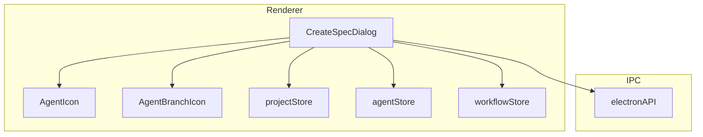

# Technical Design: CreateSpecDialogの簡素化

## Overview

**Purpose**: CreateSpecDialogのUI簡素化により、ユーザーが仕様作成時に迷わずシンプルに操作できるようにする。

**Users**: SDD Orchestratorを使用して新規仕様を作成するすべてのユーザー。

**Impact**: 既存のCreateSpecDialogコンポーネントを修正し、ボタンを1つに統合、ダイアログ幅を拡大、アイコン・色をWorktreeモード状態に応じて変化させる。

### Goals

- ダイアログ幅を`max-w-xl`（576px）に拡大し、ボタンが横一列に収まるようにする
- 「作成」ボタン（spec-init）を削除し、spec-planのみに統合する
- ボタンアイコンをBotアイコン（Worktree時はBot+GitBranch）に変更する
- ボタン色をWorktreeモード状態に応じて変化させる（標準:青、Worktree:紫）

### Non-Goals

- spec-init機能自体の削除（バックエンド側IPCは残存）
- 他のダイアログ（CreateBugDialog等）への変更
- Worktreeモードスイッチの動作変更

## Architecture

### Existing Architecture Analysis

CreateSpecDialogは既存のReactコンポーネントで、以下の構造を持つ:
- `electron-sdd-manager/src/renderer/components/CreateSpecDialog.tsx`
- Zustand storesを使用（projectStore, agentStore, workflowStore）
- IPC経由でバックエンド（executeSpecInit, executeSpecPlan）と連携
- 現在2つのボタン: 「プランニングで開始」（spec-plan）と「作成」（spec-init）

**既存パターン参照**:
- `ImplPhasePanel`: Worktreeモード時の紫色スタイリング、AgentIcon/AgentBranchIcon使用
- `AgentIcon`/`AgentBranchIcon`: Bot/GitBranchアイコンの再利用可能コンポーネント

### Architecture Pattern & Boundary Map



**Architecture Integration**:
- Selected pattern: 既存コンポーネント修正（UI層のみの変更）
- Domain boundaries: Renderer層のUI変更のみ、IPC・バックエンドは変更なし
- Existing patterns preserved: AgentIcon/AgentBranchIcon再利用、Tailwind CSSスタイリング
- New components rationale: 新規コンポーネント不要
- Steering compliance: DRY（既存アイコンコンポーネント再利用）、KISS（単純なUI変更）

### Technology Stack

| Layer | Choice / Version | Role in Feature | Notes |
|-------|------------------|-----------------|-------|
| Frontend | React 19 + TypeScript | UI変更 | 既存技術 |
| Styling | Tailwind CSS 4 | ダイアログ幅・ボタン色 | 既存クラス活用 |
| Icons | Lucide React | AgentIcon/AgentBranchIcon | 既存コンポーネント再利用 |

## Requirements Traceability

| Criterion ID | Summary | Components | Implementation Approach |
|--------------|---------|------------|------------------------|
| 1.1 | ダイアログ最大幅`max-w-xl` | CreateSpecDialog | 既存クラス変更（reuse） |
| 1.2 | ボタン群が横一列 | CreateSpecDialog | ダイアログ幅拡大で自動解決 |
| 2.1 | 「作成」ボタン削除 | CreateSpecDialog | handleCreate関数・JSX削除 |
| 2.2 | handleCreate関数削除 | CreateSpecDialog | コード削除 |
| 2.3 | ボタンは「spec-planで作成」のみ | CreateSpecDialog | ボタンラベル変更 |
| 2.4 | ボタンクリック時spec-plan実行 | CreateSpecDialog | 既存handlePlanStart使用（reuse） |
| 3.1 | 標準モード時Botアイコン | CreateSpecDialog | AgentIcon再利用（reuse） |
| 3.2 | Worktree時Bot+GitBranchアイコン | CreateSpecDialog | AgentBranchIcon再利用（reuse） |
| 3.3 | アイコン配置パターン | CreateSpecDialog | ImplPhasePanelと同一パターン |
| 4.1 | 標準モード時青色 | CreateSpecDialog | Tailwindクラス変更 |
| 4.2 | Worktree時紫色 | CreateSpecDialog | ImplPhasePanelと同一パターン |

### Coverage Validation Checklist

- [x] Every criterion ID from requirements.md appears in the table above
- [x] Each criterion has specific component names (not generic references)
- [x] Implementation approach distinguishes "reuse existing" vs "new implementation"
- [x] User-facing criteria specify concrete UI components

## Components and Interfaces

| Component | Domain/Layer | Intent | Req Coverage | Key Dependencies | Contracts |
|-----------|--------------|--------|--------------|------------------|-----------|
| CreateSpecDialog | UI/Renderer | 新規仕様作成ダイアログ | 1.1, 1.2, 2.1-2.4, 3.1-3.3, 4.1-4.2 | AgentIcon (P1), AgentBranchIcon (P1) | State |

### UI Layer

#### CreateSpecDialog

| Field | Detail |
|-------|--------|
| Intent | 新規仕様作成ダイアログ - ボタン統合とスタイル変更 |
| Requirements | 1.1, 1.2, 2.1, 2.2, 2.3, 2.4, 3.1, 3.2, 3.3, 4.1, 4.2 |

**Responsibilities & Constraints**
- 新規仕様作成のUIを提供
- spec-planコマンドのみを実行（spec-initボタン削除）
- Worktreeモード状態に応じたアイコン・色の切り替え

**Dependencies**
- Inbound: DocsTabs, WorkflowView - ダイアログ表示トリガー (P1)
- Outbound: AgentIcon - 標準モードアイコン表示 (P1)
- Outbound: AgentBranchIcon - Worktreeモードアイコン表示 (P1)
- Outbound: projectStore, agentStore, workflowStore - 状態管理 (P0)
- External: electronAPI.executeSpecPlan - IPC実行 (P0)

**Contracts**: State [x]

##### State Management

```typescript
// 既存の状態（変更なし）
const [description, setDescription] = useState('');
const [error, setError] = useState<string | null>(null);
const [isCreating, setIsCreating] = useState(false);
const [worktreeMode, setWorktreeMode] = useState(false);

// 削除される関数
// handleCreate: async () => void  ← 削除

// 継続使用される関数
// handlePlanStart: async () => void  ← ボタンから呼び出し
```

**Implementation Notes**
- Integration: AgentIcon/AgentBranchIconをインポートして使用
- Validation: 説明フィールドの空チェックは既存ロジック維持
- Risks: なし（既存パターンの適用のみ）

## System Flows

本機能はシンプルなUI変更のため、システムフロー図は不要。既存のhandlePlanStart関数のフローをそのまま使用する。

## Data Models

本機能はUI変更のみであり、データモデルの変更なし。

## Testing Strategy

### Unit Tests

| Test Case | Description | Component |
|-----------|-------------|-----------|
| ダイアログ幅検証 | `max-w-xl`クラスが適用されていること | CreateSpecDialog |
| 「作成」ボタン非存在 | 「作成」ボタンが表示されないこと | CreateSpecDialog |
| 統合ボタンラベル | 「spec-planで作成」ラベルが表示されること | CreateSpecDialog |
| 標準モードアイコン | worktreeMode=falseでAgentIconが表示されること | CreateSpecDialog |
| Worktreeモードアイコン | worktreeMode=trueでAgentBranchIconが表示されること | CreateSpecDialog |
| 標準モード色 | worktreeMode=falseで青色ボタンであること | CreateSpecDialog |
| Worktreeモード色 | worktreeMode=trueで紫色ボタンであること | CreateSpecDialog |
| ボタンクリック | クリック時にexecuteSpecPlanが呼ばれること | CreateSpecDialog |

### E2E Tests

既存のspec-workflow E2Eテストで新規仕様作成フローがカバーされている。ボタンラベル変更に伴うセレクタ更新のみ必要。

## Design Decisions

### DD-001: ボタン統合方針

| Field | Detail |
|-------|--------|
| Status | Accepted |
| Context | 現在「作成」（spec-init）と「プランニングで開始」（spec-plan）の2ボタンがあり、ユーザーが選択に迷う可能性がある |
| Decision | spec-planボタンのみに統合し、spec-initボタンを削除する |
| Rationale | spec-planは対話形式でDecision Logも生成するため、より優れたワークフローを提供する。spec-initは単純な初期化のみで、spec-planがその上位互換として機能する |
| Alternatives Considered | 1) 両ボタン維持 - ユーザーの混乱継続、2) spec-initのみ残す - Decision Log生成機能を失う |
| Consequences | spec-init経由での仕様作成がUIから不可能になる（IPC自体は残存するため、CLIからは引き続き可能） |

### DD-002: 既存コンポーネント再利用

| Field | Detail |
|-------|--------|
| Status | Accepted |
| Context | ボタンアイコンとして新規コンポーネントを作成するか、既存のAgentIcon/AgentBranchIconを再利用するか |
| Decision | 既存のAgentIcon/AgentBranchIconを再利用する |
| Rationale | ImplPhasePanelで同一パターンが使用されており、DRY原則に従う。視覚的一貫性も維持できる |
| Alternatives Considered | 新規アイコンコンポーネント作成 - コード重複、保守コスト増加 |
| Consequences | AgentIcon/AgentBranchIconのインポートパスをsharedから参照する必要がある |

### DD-003: ボタン色の条件分岐パターン

| Field | Detail |
|-------|--------|
| Status | Accepted |
| Context | Worktreeモード時の紫色スタイリングをどのように実装するか |
| Decision | ImplPhasePanelと同一のTailwindクラス条件分岐パターンを使用する |
| Rationale | 既存実装パターンとの一貫性維持。`bg-violet-500 hover:bg-violet-600`（Worktree）、`bg-blue-500 hover:bg-blue-600`（標準） |
| Alternatives Considered | CSS変数やコンポーネントpropsでの色制御 - 過剰な抽象化 |
| Consequences | clsxを使用した条件分岐が必要（既存コードで使用済み） |

## Integration & Deprecation Strategy

### 修正が必要なファイル（Wiring Points）

| File | Modification Type | Description |
|------|-------------------|-------------|
| `electron-sdd-manager/src/renderer/components/CreateSpecDialog.tsx` | Modify | メイン変更対象 |
| `electron-sdd-manager/src/renderer/components/CreateSpecDialog.test.tsx` | Modify | テストケース更新 |

### 削除が必要なファイル（Cleanup）

なし（コンポーネント内のコード削除のみ）

### 削除されるコード

| Location | Code | Reason |
|----------|------|--------|
| CreateSpecDialog.tsx | `handleCreate` 関数 | spec-initボタン削除に伴い不要 |
| CreateSpecDialog.tsx | 「作成」ボタンJSX | spec-planに統合 |
| CreateSpecDialog.tsx | `Plus` アイコンインポート | 不使用になる |
| CreateSpecDialog.tsx | `MessageCircle` アイコンインポート | AgentIcon/AgentBranchIconに置き換え |

### 追加されるインポート

```typescript
import { AgentIcon, AgentBranchIcon } from '@shared/components/ui/AgentIcon';
```

### バックエンド影響

なし。`executeSpecInit` IPCハンドラは残存し、CLI経由での使用は継続可能。
