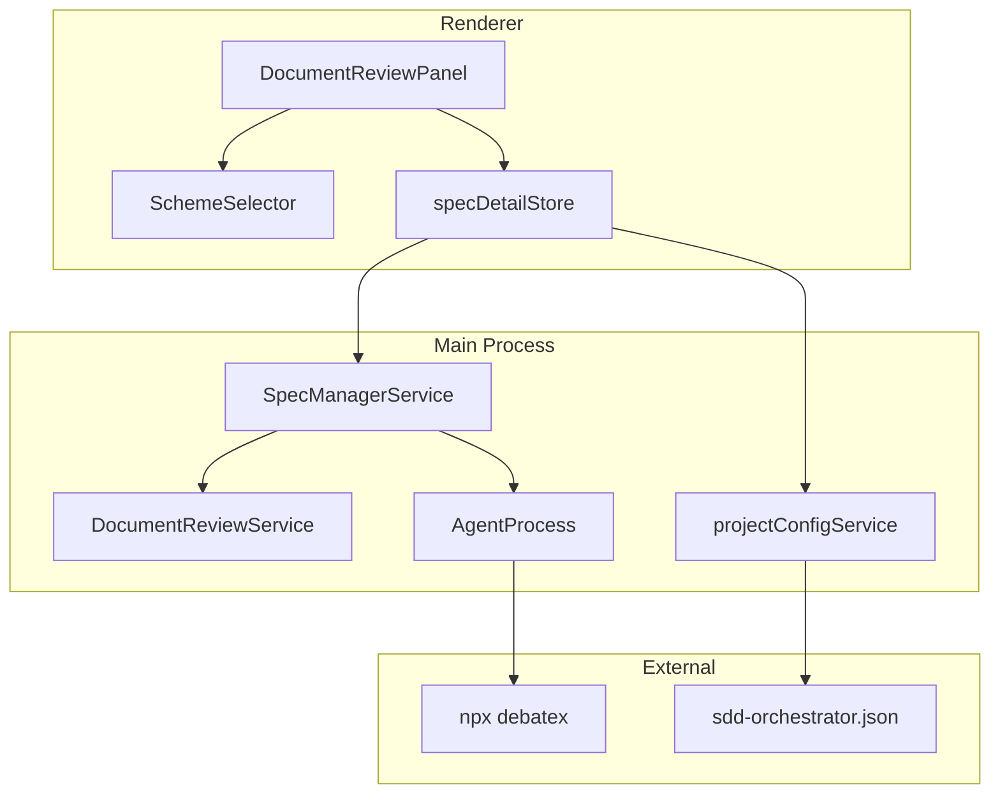
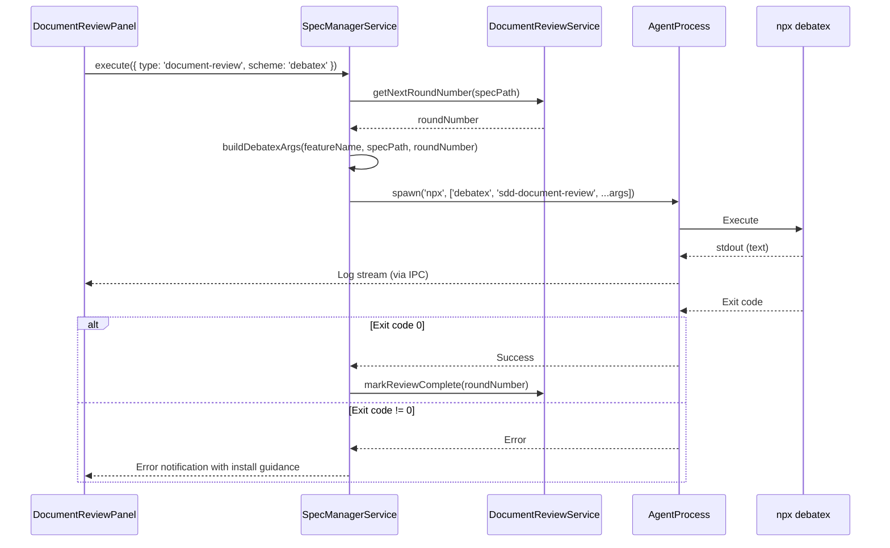
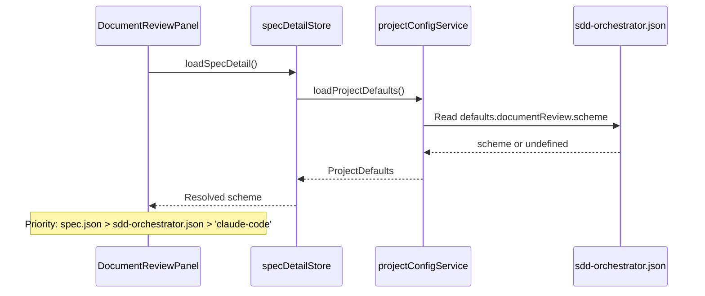

# Design Document: Debatex Document Review Integration

## Overview

**Purpose**: 本機能は、SDD Orchestrator のドキュメントレビューワークフローに debatex（マルチエージェント議論ツール）を完全統合する。既存の gemini-document-review で構築された scheme 切り替え基盤を拡張し、debatex 固有の引数指定、出力パース、プロジェクトデフォルト設定機能を追加する。

**Users**: SDD Orchestrator を使用して Spec ドキュメントレビューを実行するユーザー。debatex による多角的なレビュー結果を活用し、単一 AI では得られない視点を取得する。

**Impact**: 既存の ReviewEngineRegistry に debatex エントリは登録済み。本設計では引数ビルダーの拡張、出力パース対応、プロジェクトデフォルト設定機能を追加する。

### Goals

- debatex 実行時に正しい出力パス（`--output`）とレビュー番号を指定
- debatex の標準出力をリアルタイムでログパネルに表示
- プロジェクトデフォルト scheme を sdd-orchestrator.json に保存可能に
- document-review-reply との互換性を維持した出力フォーマット
- debatex 利用不可時の明確なエラーメッセージ表示

### Non-Goals

- debatex のインストール・セットアップ支援
- debatex のカスタムプリセット作成 UI
- debatex の議論パラメータ（最大ターン数、時間制限等）の UI 設定
- debatex 以外の新規レビューエンジン追加

## Architecture

### Existing Architecture Analysis

現在の scheme 切り替え基盤は gemini-document-review で実装済み:

- **ReviewEngineRegistry** (`shared/registry/reviewEngineRegistry.ts`): エンジン定義オブジェクトを管理。debatex エントリは登録済みだが、`buildArgs` が不完全
- **SchemeSelector** (`shared/components/review/SchemeSelector.tsx`): UI ドロップダウン。変更不要
- **SpecManagerService** (`main/services/specManagerService.ts`): `executeDocumentReview` で scheme に応じたコマンド実行。debatex 対応は部分的
- **DocumentReviewService** (`main/services/documentReviewService.ts`): レビュー状態管理、ラウンド番号計算

**課題**:
1. `buildArgs` が `featureName` のみ受け取り、`outputPath` と `roundNumber` を渡せない
2. プロジェクトデフォルト scheme の保存・読み込み機能がない
3. debatex の text 出力に対するパース処理がない
4. debatex 実行エラー時のユーザー向けメッセージが不十分

### Architecture Pattern & Boundary Map



**Architecture Integration**:
- **Selected pattern**: 既存のレジストリパターンを拡張。`ReviewEngineConfig.buildArgs` のシグネチャ変更で引数拡張
- **Domain/feature boundaries**: ReviewEngineRegistry はエンジン設定のみ、実行ロジックは SpecManagerService に集約
- **Existing patterns preserved**: Result 型によるエラーハンドリング、IPC 経由の main/renderer 通信
- **New components rationale**: 既存の `projectConfigService` にプロジェクトデフォルト取得メソッドを追加（sdd-orchestrator.json 管理の SSOT）
- **Steering compliance**: DRY（既存基盤の再利用）、SSOT（エンジン定義は ReviewEngineRegistry のみ）

### Technology Stack

| Layer | Choice / Version | Role in Feature | Notes |
|-------|------------------|-----------------|-------|
| External CLI | debatex (npm) | ドキュメントレビュー実行 | `npx debatex sdd-document-review` |
| Registry | ReviewEngineRegistry | エンジン設定管理 | 既存拡張 |
| Service | SpecManagerService | コマンド実行 | 既存拡張 |
| Config | sdd-orchestrator.json | プロジェクト設定 | defaults.documentReview.scheme 追加 |

## System Flows

### Document Review Execution Flow (debatex)



**Key Decisions**:
- レビュー番号は `DocumentReviewService.getNextRoundNumber()` で事前取得
- 出力パスは `specPath/document-review-{n}.md` として構築
- text 出力は行単位でログパネルにストリーミング

### Project Default Scheme Resolution Flow



## Requirements Traceability

| Criterion ID | Summary | Components | Implementation Approach |
|--------------|---------|------------|------------------------|
| 1.1 | debatex エンジン定義追加 | ReviewEngineRegistry | 既存エントリの buildArgs 拡張 |
| 1.2 | 実行コマンド `npx debatex sdd-document-review` | ReviewEngineRegistry | 既存登録済み、変更不要 |
| 1.3 | 必要な引数定義（spec名、出力パス、番号） | ReviewEngineConfig.buildArgs | シグネチャ拡張 |
| 1.4 | 出力形式定義 | ReviewEngineRegistry | outputFormat: 'text' 既存 |
| 2.1 | `--output <path>` オプション指定 | SpecManagerService.executeDocumentReview | 引数構築ロジック追加 |
| 2.2 | 出力先 `.kiro/specs/<feature>/document-review-{n}.md` | SpecManagerService | パス構築ロジック |
| 2.3 | レビュー番号の決定 | DocumentReviewService | getNextRoundNumber 既存流用 |
| 2.4 | spec 名を引数として渡す | ReviewEngineConfig.buildArgs | 既存対応済み |
| 3.1 | 標準出力のリアルタイム表示 | AgentProcess, LogPanel | text 出力対応 |
| 3.2 | 終了コード検出 | AgentProcess | 既存対応済み |
| 3.3 | エラー時通知 | SpecManagerService, notify | エラーハンドリング追加 |
| 3.4 | 生成ファイル検出・UI反映 | SpecsWatcherService | 既存対応済み |
| 4.1 | sdd-orchestrator.json に defaults.documentReview.scheme 追加 | SettingsFileManager | 新規メソッド追加 |
| 4.2 | spec.json 未設定時のプロジェクトデフォルト適用 | specDetailStore | scheme 解決ロジック追加 |
| 4.3 | spec 単位設定がプロジェクトデフォルトより優先 | specDetailStore | 優先順位ロジック |
| 4.4 | 両方未設定時 `claude-code` デフォルト | specDetailStore, ReviewEngineRegistry | DEFAULT_REVIEWER_SCHEME 既存 |
| 4.5 | UI からプロジェクトデフォルト変更 | ProjectSettingsDialog | 新規 UI コンポーネント |
| 5.1 | 出力が既存フォーマット互換 | debatex 側依存 | 依頼書で対応（外部依存） |
| 5.2 | 必須セクション含む | debatex 側依存 | 依頼書で対応（外部依存） |
| 5.3 | 議論過程は折りたたみ | debatex 側依存 | 依頼書で対応（外部依存） |
| 5.4 | document-review-reply が解析可能 | 既存対応 | フォーマット互換なら変更不要 |
| 6.1 | debatex 未インストール時エラー表示 | SpecManagerService | エラーハンドリング追加 |
| 6.2 | インストール方法のメッセージ | SpecManagerService | エラーメッセージ定義 |
| 6.3 | タイムアウト時エラー表示 | AgentProcess | 既存タイムアウト機構利用 |
| 6.4 | キャンセル時プロセス終了 | AgentProcess | 既存対応済み |

### Coverage Validation Checklist

- [x] Every criterion ID from requirements.md appears in the table above
- [x] Each criterion has specific component names (not generic references)
- [x] Implementation approach distinguishes "reuse existing" vs "new implementation"
- [x] User-facing criteria specify concrete UI components

## Components and Interfaces

| Component | Domain/Layer | Intent | Req Coverage | Key Dependencies | Contracts |
|-----------|--------------|--------|--------------|------------------|-----------|
| ReviewEngineRegistry | Shared/Registry | エンジン設定管理 | 1.1, 1.3 | None | Service |
| SpecManagerService | Main/Service | コマンド実行 | 2.1, 2.2, 3.3, 6.1, 6.2 | DocumentReviewService (P0), AgentProcess (P0) | Service |
| DocumentReviewService | Main/Service | レビュー状態管理 | 2.3 | None | Service (既存) |
| projectConfigService | Main/Service | プロジェクト設定 | 4.1 | None | Service (既存拡張) |
| specDetailStore | Renderer/Store | scheme 解決 | 4.2, 4.3, 4.4 | projectConfigService (P1) | State |
| ProjectSettingsDialog | Renderer/Component | デフォルト設定 UI | 4.5 | projectConfigService (P0) | - |

### Shared/Registry

#### ReviewEngineRegistry

| Field | Detail |
|-------|--------|
| Intent | レビューエンジンの設定を一元管理 |
| Requirements | 1.1, 1.3 |

**Responsibilities & Constraints**
- 各エンジン（claude-code, gemini-cli, debatex）の実行設定を定義
- buildArgs のシグネチャを拡張し、コンテキスト情報を受け取れるようにする
- 後方互換性のため、既存の `(featureName: string)` シグネチャも維持

**Dependencies**
- Inbound: SpecManagerService - エンジン設定取得 (P0)
- Inbound: SchemeSelector - 利用可能エンジン一覧取得 (P1)

**Contracts**: Service [x]

##### Service Interface

```typescript
/**
 * Extended build args context for engines that need additional information
 */
interface BuildArgsContext {
  featureName: string;
  specPath?: string;
  roundNumber?: number;
}

/**
 * Review engine configuration
 * Requirements: 1.1, 1.3
 */
interface ReviewEngineConfig {
  label: string;
  colorClass: string;
  command: string | string[];
  /**
   * Build command arguments
   * @param context - Feature name (string) or full context object
   */
  buildArgs: (context: string | BuildArgsContext) => string[];
  outputFormat: 'jsonl' | 'text';
}
```

- Preconditions: context は string または BuildArgsContext
- Postconditions: 返却される引数配列は実行可能なコマンド引数
- Invariants: debatex では specPath と roundNumber が必須

**Implementation Notes**
- 後方互換性: context が string の場合は従来の featureName として扱う
- debatex の buildArgs 実装:
  ```typescript
  buildArgs: (context) => {
    const ctx = typeof context === 'string'
      ? { featureName: context }
      : context;
    const args = ['sdd-document-review', ctx.featureName];
    if (ctx.specPath && ctx.roundNumber) {
      args.push('--output', `${ctx.specPath}/document-review-${ctx.roundNumber}.md`);
    }
    return args;
  }
  ```

### Main/Service

#### SpecManagerService (Extension)

| Field | Detail |
|-------|--------|
| Intent | debatex 実行時の引数構築とエラーハンドリング |
| Requirements | 2.1, 2.2, 3.3, 6.1, 6.2 |

**Responsibilities & Constraints**
- debatex 実行前に roundNumber を取得
- BuildArgsContext を構築して buildArgs に渡す
- debatex 実行エラー時のユーザー向けメッセージ生成

**Dependencies**
- Outbound: DocumentReviewService - roundNumber 取得 (P0)
- Outbound: AgentProcess - プロセス起動 (P0)
- Outbound: ReviewEngineRegistry - エンジン設定取得 (P0)

**Contracts**: Service [x]

##### Service Interface

```typescript
/**
 * Extended executeDocumentReview for debatex support
 * Requirements: 2.1, 2.2, 6.1, 6.2
 */
async executeDocumentReview(options: ExecuteDocumentReviewOptions): Promise<Result<AgentInfo, AgentError>> {
  // For debatex, fetch roundNumber and build extended args
}
```

- Preconditions: specPath が有効なディレクトリ
- Postconditions: debatex プロセスが起動される
- Error handling: debatex 未インストール時は明確なエラーメッセージを返却

**Implementation Notes**
- Integration: debatex の場合のみ roundNumber を事前取得
- Validation: scheme が 'debatex' の場合、specPath の存在を検証
- Risks: debatex がインストールされていない場合の ENOENT エラー対応

#### projectConfigService (Extension)

| Field | Detail |
|-------|--------|
| Intent | プロジェクトデフォルト設定の読み書き |
| Requirements | 4.1 |

**Responsibilities & Constraints**
- sdd-orchestrator.json から defaults.documentReview.scheme を読み込み
- defaults 更新時の書き込み
- 既存のプロファイル、レイアウト、コマンドセットバージョン、settings フィールドを保持

**Dependencies**
- External: sdd-orchestrator.json - ファイル I/O (P0)

**Contracts**: Service [x]

##### Service Interface

```typescript
/**
 * Project defaults for document review
 */
interface DocumentReviewDefaults {
  scheme?: ReviewerScheme;
}

interface ProjectDefaults {
  documentReview?: DocumentReviewDefaults;
}

/**
 * Get project defaults from sdd-orchestrator.json
 * Requirements: 4.1
 */
async loadProjectDefaults(projectPath: string): Promise<ProjectDefaults>;

/**
 * Update project defaults in sdd-orchestrator.json
 * Requirements: 4.1
 */
async saveProjectDefaults(projectPath: string, defaults: Partial<ProjectDefaults>): Promise<void>;
```

- Preconditions: projectPath が有効
- Postconditions: defaults が正しく読み書きされる
- Invariants: 既存の sdd-orchestrator.json フィールド（profile, layout, commandsets, settings）は保持

**Implementation Notes**
- 既存の `projectConfigService`（layoutConfigService.ts）を拡張
- `loadSkipPermissions`/`saveSkipPermissions` と同様のパターンで実装

### Renderer/Store

#### specDetailStore (Extension)

| Field | Detail |
|-------|--------|
| Intent | scheme の優先順位解決 |
| Requirements | 4.2, 4.3, 4.4 |

**Responsibilities & Constraints**
- spec.json の documentReview.scheme を第一優先
- 未設定ならプロジェクトデフォルトを参照
- 両方未設定なら 'claude-code'

**Dependencies**
- Inbound: DocumentReviewPanel - 解決済み scheme 取得 (P0)
- Outbound: IPC - プロジェクトデフォルト取得 (P1)

**Contracts**: State [x]

##### State Management

```typescript
interface SpecDetailState {
  // 既存フィールド...
  resolvedScheme: ReviewerScheme;  // 解決済み scheme
  projectDefaultScheme?: ReviewerScheme;  // キャッシュ
}

// Selector
function getResolvedScheme(state: SpecDetailState): ReviewerScheme {
  return state.specDetail?.documentReview?.scheme
    ?? state.projectDefaultScheme
    ?? 'claude-code';
}
```

- Persistence: projectDefaultScheme は loadSpecDetail 時に取得してキャッシュ
- Consistency: scheme 変更時は spec.json に書き込み、プロジェクトデフォルトは別途管理
- Concurrency: 単一ストア、競合なし

### Renderer/Component

#### ProjectSettingsDialog

| Field | Detail |
|-------|--------|
| Intent | プロジェクトデフォルト scheme 設定 UI |
| Requirements | 4.5 |

**Responsibilities & Constraints**
- SchemeSelector を再利用してデフォルト scheme を選択
- 保存時に sdd-orchestrator.json を更新

**Dependencies**
- Outbound: IPC (updateProjectDefaults) - 設定保存 (P0)
- Inbound: SchemeSelector - UI コンポーネント (P1)

**Implementation Notes**
- 配置: 設定メニューまたは右上の歯車アイコンから開く
- UI: SchemeSelector と Save/Cancel ボタン
- Validation: 選択された scheme が有効な ReviewerScheme であること

## Data Models

### Domain Model

**ProjectSettings Aggregate**:

```
ProjectSettings (Aggregate Root)
├── defaults
│   └── documentReview
│       └── scheme: ReviewerScheme?
└── (既存フィールド: version, profile, layout, commandsets, settings)
```

**Invariants**:
- scheme が設定される場合、有効な ReviewerScheme 値のみ

### Logical Data Model

**sdd-orchestrator.json 拡張**:

```typescript
interface SDDOrchestratorConfig {
  version: number;
  profile: ProfileConfig;
  layout: LayoutConfig;
  commandsets: CommandsetsConfig;
  settings: SettingsConfig;
  defaults?: {
    documentReview?: {
      scheme?: ReviewerScheme;
    };
  };
}
```

**Referential Integrity**:
- defaults.documentReview.scheme は ReviewerScheme 型に準拠
- 未定義の場合は無視され、DEFAULT_REVIEWER_SCHEME が使用される

## Error Handling

### Error Strategy

debatex 固有のエラーシナリオに対応したハンドリング戦略を定義。

### Error Categories and Responses

**System Errors (debatex unavailable)**:
- `ENOENT` / spawn error: debatex 未インストール
- Response: 「debatex がインストールされていません。`npm install -g debatex` を実行してください」
- Recovery: インストール後に再実行

**Timeout Errors**:
- debatex の実行時間が設定閾値を超過
- Response: 「debatex の実行がタイムアウトしました。ネットワーク状況を確認してください」
- Recovery: 再実行またはネットワーク確認

**Exit Code Errors**:
- debatex が非ゼロ終了コードを返却
- Response: stderr の内容をログに表示、エラートースト通知
- Recovery: debatex のログを確認して問題解決

### Error Message Template

```typescript
const DEBATEX_ERRORS = {
  NOT_INSTALLED: {
    title: 'debatex が見つかりません',
    message: 'debatex がインストールされていません。\n`npm install -g debatex` を実行してインストールしてください。',
  },
  TIMEOUT: {
    title: 'debatex タイムアウト',
    message: 'debatex の実行がタイムアウトしました。ネットワーク状況を確認してください。',
  },
  EXECUTION_FAILED: {
    title: 'debatex 実行エラー',
    message: 'debatex の実行に失敗しました。詳細はログを確認してください。',
  },
};
```

## Testing Strategy

### Unit Tests

- **ReviewEngineRegistry.buildArgs**: debatex 用 buildArgs が context オブジェクトを受け取り、正しい引数配列を返すこと
- **SpecManagerService.executeDocumentReview**: debatex scheme で roundNumber が正しく取得・引数に含まれること
- **SettingsFileManager.getProjectDefaults**: sdd-orchestrator.json から defaults.documentReview.scheme を読み取ること
- **specDetailStore.getResolvedScheme**: 優先順位（spec.json > project default > claude-code）が正しいこと

### Integration Tests

- **debatex 実行フロー**: scheme='debatex' で executeDocumentReview を呼び出し、正しいコマンドと引数でプロセスが起動されること
- **プロジェクトデフォルト適用**: spec.json に scheme 未設定、sdd-orchestrator.json に defaults 設定済みで、デフォルトが適用されること
- **エラーハンドリング**: debatex 未インストール状態で実行し、適切なエラーメッセージが表示されること

### E2E Tests

- **Scheme 選択と実行**: UI から debatex を選択してレビュー実行、document-review-{n}.md が生成されること
- **プロジェクト設定変更**: ProjectSettingsDialog でデフォルト scheme を変更、新規 spec で適用されること

## Design Decisions

### DD-001: buildArgs シグネチャの後方互換拡張

| Field | Detail |
|-------|--------|
| Status | Accepted |
| Context | debatex は実行時に specPath と roundNumber が必要だが、既存の buildArgs は featureName のみを受け取る |
| Decision | buildArgs の引数を `string | BuildArgsContext` の union 型に変更し、後方互換性を維持しつつ拡張情報を渡せるようにする |
| Rationale | 既存の claude-code/gemini-cli の buildArgs 実装を変更せずに debatex 対応が可能 |
| Alternatives Considered | (1) 全エンジンの buildArgs を新シグネチャに統一: 既存コードの変更が必要 (2) debatex 専用の buildArgsEx 関数を追加: コード重複 |
| Consequences | 型チェックで context の型を判定する処理が必要になるが、影響は最小限 |

### DD-002: プロジェクトデフォルト設定の保存場所

| Field | Detail |
|-------|--------|
| Status | Accepted |
| Context | プロジェクト単位のデフォルト scheme をどこに保存するか |
| Decision | 既存の sdd-orchestrator.json に `defaults.documentReview.scheme` フィールドを追加 |
| Rationale | sdd-orchestrator.json は既にプロジェクト設定（layout, profile, commandsets）を管理しており、拡張が自然。新規ファイル追加を回避 |
| Alternatives Considered | (1) 新規 project-settings.json: ファイル増加、読み込みロジック追加 (2) spec.json のテンプレート化: スコープ外 |
| Consequences | sdd-orchestrator.json のスキーマバージョン管理が必要になる可能性があるが、defaults は optional のため影響小 |

### DD-003: debatex 出力のパース戦略

| Field | Detail |
|-------|--------|
| Status | Accepted |
| Context | debatex は text 形式で出力するが、claude-code/gemini-cli は jsonl 形式 |
| Decision | text 出力は行単位でそのままログパネルにストリーミング表示。パース処理は行わない |
| Rationale | debatex の出力は人間可読なテキストであり、構造化パースは不要。ログ表示の目的は実行状況の確認 |
| Alternatives Considered | (1) text→JSON 変換アダプター: 実装コスト大、debatex 出力形式への依存 (2) 出力を一切表示しない: ユーザー体験低下 |
| Consequences | debatex の進捗情報は構造化されず、テキストとして表示されるのみ |

### DD-004: scheme 解決の優先順位

| Field | Detail |
|-------|--------|
| Status | Accepted |
| Context | spec.json、sdd-orchestrator.json、コードデフォルトのどれを優先するか |
| Decision | spec.json > sdd-orchestrator.json > DEFAULT_REVIEWER_SCHEME ('claude-code') の順で解決 |
| Rationale | 個別 spec の設定が最も具体的であり、プロジェクト設定、システムデフォルトの順に汎用性が上がる。この階層構造は一般的な設定パターン |
| Alternatives Considered | (1) sdd-orchestrator.json を常に優先: 個別 spec でのオーバーライドができない |
| Consequences | specDetailStore で複数の設定ソースを参照する必要があるが、ロジックは単純 |

### DD-005: debatex 未インストール時のエラー処理

| Field | Detail |
|-------|--------|
| Status | Accepted |
| Context | debatex がインストールされていない環境で実行した場合の対応 |
| Decision | spawn エラー（ENOENT）を検出し、インストール方法を含む明確なエラーメッセージを表示 |
| Rationale | ユーザーが問題を自己解決できるよう、具体的なアクション（npm install -g debatex）を提示 |
| Alternatives Considered | (1) 事前インストールチェック: 実行前の追加 I/O、エンジン選択時点では不要な可能性 |
| Consequences | エラーは実行時に発生するが、メッセージが明確なためユーザー体験への影響は最小限 |

## Supporting References

### debatex 依頼書

本設計の要件 5.1-5.4（出力フォーマット互換性）は debatex 側の改修に依存する。詳細は `docs/debatex-integration-request.md` を参照。

**debatex 側で対応が必要な機能**:
- `--output <path>` オプションによる出力先指定
- document-review.md 互換フォーマットでの出力
- `--review-number <n>` オプション（優先度低、sdd-orchestrator 側で後処理も可能）

### sdd-orchestrator.json 拡張スキーマ

```json
{
  "$schema": "...",
  "type": "object",
  "properties": {
    "defaults": {
      "type": "object",
      "properties": {
        "documentReview": {
          "type": "object",
          "properties": {
            "scheme": {
              "type": "string",
              "enum": ["claude-code", "gemini-cli", "debatex"]
            }
          }
        }
      }
    }
  }
}
```
