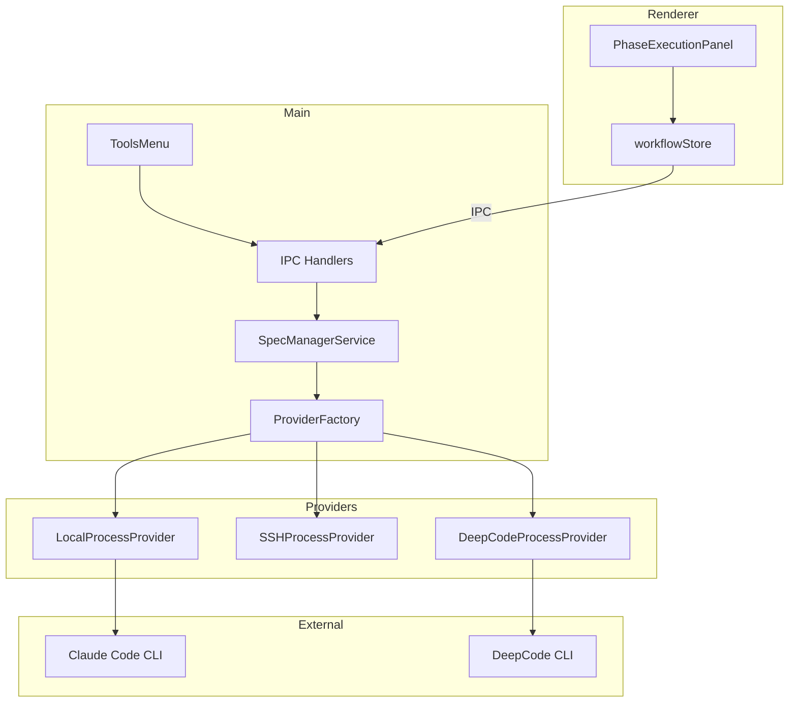
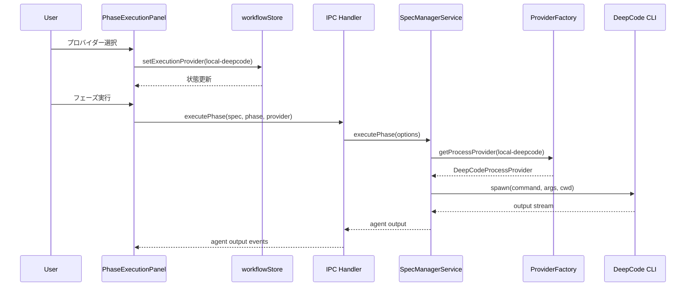
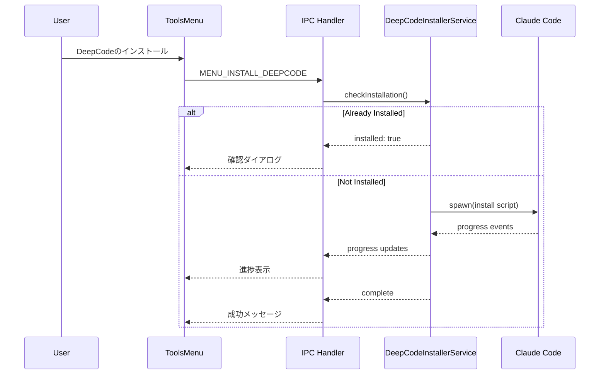

# Technical Design: DeepCode Integration

## Overview

**Purpose**: 本機能はSDD ManagerアプリケーションにDeepCodeを代替AIエージェントプロバイダーとして統合し、開発者がプロジェクトや作業内容に応じてClaude CodeとDeepCodeを使い分けられるようにする。

**Users**: SDD Managerを使用する開発者が、Specワークフロー実行時にAIエージェントを選択し、DeepCodeの環境構築・管理を行う。

**Impact**: 既存のProviderFactoryアーキテクチャを拡張し、新しいプロバイダータイプ `local-deepcode` を追加。UIにプロバイダー選択機能を追加し、ツールメニューにDeepCodeインストール機能を追加する。

### Goals
- 開発者がワークフロー実行時にClaude Code/DeepCodeを選択可能にする
- DeepCodeのグローバルインストール機能を提供する
- プロジェクト間でのコンテキスト分離を保証する
- 一貫したプロバイダー命名規則を確立する

### Non-Goals
- DeepCodeの設定UI（API Key等）の提供
- SSH経由でのDeepCode実行（将来検討）
- DeepCodeのバージョン管理機能

## Architecture

### Existing Architecture Analysis

現在のアーキテクチャでは以下のパターンが確立されている：

- **ProviderFactory**: `local` | `ssh` のプロバイダータイプを管理
- **ProcessProvider**: プロセス生成の抽象化レイヤー
- **SpecManagerService**: エージェント実行の統合管理
- **workflowStore**: 実行設定の永続化（Zustand + persist）

既存の拡張ポイント：
- `ProviderType` 型に新しいプロバイダーを追加可能
- `ProviderFactory.getProcessProvider()` でプロバイダー取得ロジックを拡張可能
- ツールメニューにIPCチャネル経由で機能追加可能

### Architecture Pattern & Boundary Map



**Architecture Integration**:
- Selected pattern: Strategy Pattern（既存ProviderFactoryの拡張）
- Domain/feature boundaries: プロバイダー層はMain processに集約、UI設定はRenderer processで管理
- Existing patterns preserved: ProviderFactory, ProcessProvider, IPC通信パターン
- New components rationale:
  - DeepCodeProcessProvider: DeepCode CLI実行を抽象化
  - DeepCodeInstallerService: インストール処理を分離
- Steering compliance: Electron版のパターンに準拠

### Technology Stack

| Layer | Choice / Version | Role in Feature | Notes |
|-------|------------------|-----------------|-------|
| Frontend / CLI | React + TypeScript | プロバイダー選択UI | 既存workflowStore拡張 |
| Backend / Services | Node.js (Electron Main) | DeepCode実行・インストール管理 | ProviderFactory拡張 |
| Data / Storage | electron-store, localStorage | プロバイダー設定永続化 | 既存パターン活用 |
| Infrastructure / Runtime | DeepCode CLI (Python 3.13) | AIエージェント実行 | pip install deepcode-hku |

## System Flows

### Provider Selection and Execution Flow



### DeepCode Installation Flow



## Requirements Traceability

| Requirement | Summary | Components | Interfaces | Flows |
|-------------|---------|------------|------------|-------|
| 1.1 | セグメントボタン表示 | ProviderSelector | - | Provider Selection |
| 1.2 | 3プロバイダー選択肢 | ProviderSelector, ExecutionProviderType | - | Provider Selection |
| 1.3 | 選択状態永続化 | workflowStore | - | Provider Selection |
| 1.4 | デフォルトlocal-claude | workflowStore | - | - |
| 2.1 | メニュー項目表示 | ToolsMenu | MENU_INSTALL_DEEPCODE | Installation |
| 2.2 | インストール実行 | DeepCodeInstallerService | installDeepCode() | Installation |
| 2.3 | グローバルインストール | DeepCodeInstallerService | - | Installation |
| 2.4 | 進捗表示 | InstallProgressPanel | onProgress callback | Installation |
| 2.5 | 成功メッセージ | InstallProgressPanel | - | Installation |
| 2.6 | エラー表示 | InstallProgressPanel | - | Installation |
| 3.1 | 未インストールエラー | DeepCodeProcessProvider | checkInstallation() | Execution |
| 3.2 | メニュー導線 | ErrorBanner | - | Execution |
| 3.3 | ランタイムエラー | DeepCodeProcessProvider, AgentLogPanel | - | Execution |
| 4.1 | プロジェクトパス引数 | DeepCodeProcessProvider | spawn(cwd) | Execution |
| 4.2 | ディレクトリ制限 | DeepCodeProcessProvider | - | Execution |
| 4.3 | 個別ログ管理 | LogFileService | - | Execution |
| 5.1 | プロバイダー識別子 | ExecutionProviderType | - | - |
| 5.2 | 一貫した識別子使用 | 全コンポーネント | - | - |
| 5.3 | 命名パターン | ExecutionProviderType | - | - |

## Components and Interfaces

| Component | Domain/Layer | Intent | Req Coverage | Key Dependencies (P0/P1) | Contracts |
|-----------|--------------|--------|--------------|--------------------------|-----------|
| ExecutionProviderType | Types | プロバイダー識別子型定義 | 5.1, 5.2, 5.3 | - | State |
| ProviderSelector | UI | プロバイダー選択セグメントボタン | 1.1, 1.2, 1.3, 1.4 | workflowStore (P0) | State |
| workflowStore extension | Store | プロバイダー設定永続化 | 1.3, 1.4 | - | State |
| DeepCodeProcessProvider | Provider | DeepCode CLI実行 | 3.1, 4.1, 4.2 | ProviderFactory (P0) | Service |
| DeepCodeInstallerService | Service | DeepCodeインストール管理 | 2.2, 2.3, 2.4, 2.5, 2.6 | Claude Code (P0) | Service |
| InstallProgressPanel | UI | インストール進捗表示 | 2.4, 2.5, 2.6 | IPC (P0) | Event |
| ToolsMenu extension | UI | インストールメニュー項目 | 2.1 | IPC (P0) | - |

### Types Layer

#### ExecutionProviderType

| Field | Detail |
|-------|--------|
| Intent | プロバイダー識別子の型定義 |
| Requirements | 5.1, 5.2, 5.3 |

**Responsibilities & Constraints**
- 3つのプロバイダー識別子を定義: `local-claude`, `ssh-claude`, `local-deepcode`
- `{実行環境}-{エージェント名}` パターンに準拠
- 型安全性を提供

**Contracts**: State [x]

##### State Management

```typescript
/** 実行プロバイダー識別子 */
export type ExecutionProviderType =
  | 'local-claude'    // ローカルClaude Code
  | 'ssh-claude'      // SSH経由Claude Code
  | 'local-deepcode'; // ローカルDeepCode

/** デフォルトプロバイダー */
export const DEFAULT_EXECUTION_PROVIDER: ExecutionProviderType = 'local-claude';

/** プロバイダー表示情報 */
export const EXECUTION_PROVIDERS: Record<ExecutionProviderType, {
  label: string;
  description: string;
}> = {
  'local-claude': {
    label: 'Claude Code',
    description: 'ローカルで実行するClaude Code',
  },
  'ssh-claude': {
    label: 'SSH Claude',
    description: 'SSH経由で実行するClaude Code',
  },
  'local-deepcode': {
    label: 'DeepCode',
    description: 'ローカルで実行するDeepCode',
  },
};
```

### UI Layer

#### ProviderSelector

| Field | Detail |
|-------|--------|
| Intent | プロバイダー選択セグメントボタンを表示 |
| Requirements | 1.1, 1.2, 1.3, 1.4 |

**Responsibilities & Constraints**
- 3つのプロバイダーをセグメントボタンとして表示
- 選択状態をworkflowStoreに永続化
- デフォルトで `local-claude` を選択

**Dependencies**
- Inbound: PhaseExecutionPanel — 埋め込み (P0)
- Outbound: workflowStore — 状態管理 (P0)

**Contracts**: State [x]

##### State Management

```typescript
interface ProviderSelectorProps {
  /** 現在選択中のプロバイダー */
  readonly value: ExecutionProviderType;
  /** プロバイダー変更時のコールバック */
  readonly onChange: (provider: ExecutionProviderType) => void;
  /** 無効化フラグ（実行中など） */
  readonly disabled?: boolean;
}
```

**Implementation Notes**
- Integration: PhaseExecutionPanel内、フェーズボタンの上部に配置
- Validation: SSH接続がない場合は `ssh-claude` を無効化
- Risks: レイアウト調整が必要な可能性

#### InstallProgressPanel

| Field | Detail |
|-------|--------|
| Intent | DeepCodeインストールの進捗表示 |
| Requirements | 2.4, 2.5, 2.6 |

**Responsibilities & Constraints**
- インストール進捗をリアルタイム表示
- 成功/エラーメッセージを表示
- エラー時は対処方法を含める

**Dependencies**
- Inbound: IPC Events — 進捗通知 (P0)

**Contracts**: Event [x]

##### Event Contract
- Subscribed events:
  - `DEEPCODE_INSTALL_PROGRESS`: 進捗更新
  - `DEEPCODE_INSTALL_COMPLETE`: 完了
  - `DEEPCODE_INSTALL_ERROR`: エラー
- Ordering / delivery guarantees: 順序保証あり

### Store Layer

#### workflowStore extension

| Field | Detail |
|-------|--------|
| Intent | プロバイダー設定の永続化 |
| Requirements | 1.3, 1.4 |

**Responsibilities & Constraints**
- executionProvider設定をlocalStorageに永続化
- デフォルト値として `local-claude` を設定
- 既存のworkflowStore設定と共存

**Contracts**: State [x]

##### State Management

```typescript
/** workflowStore拡張 */
interface WorkflowStateExtension {
  /** 実行プロバイダー設定 */
  executionProvider: ExecutionProviderType;
}

interface WorkflowActionsExtension {
  /** 実行プロバイダーを設定 */
  setExecutionProvider: (provider: ExecutionProviderType) => void;
}
```

- Persistence: localStorage (`sdd-manager-workflow-settings`)
- Consistency: partialize対象に追加

### Provider Layer

#### DeepCodeProcessProvider

| Field | Detail |
|-------|--------|
| Intent | DeepCode CLI実行の抽象化 |
| Requirements | 3.1, 4.1, 4.2 |

**Responsibilities & Constraints**
- ProcessProviderインターフェースを実装
- DeepCode CLIをspawnして実行
- プロジェクトパスをcwd引数として渡す

**Dependencies**
- Inbound: ProviderFactory — プロバイダー取得 (P0)
- External: DeepCode CLI — プロセス実行 (P0)

**Contracts**: Service [x]

##### Service Interface

```typescript
interface DeepCodeProcessProvider implements ProcessProvider {
  /**
   * DeepCodeプロセスを生成
   * @param command - 実行コマンド（deepcode または python cli/main_cli.py）
   * @param args - コマンド引数
   * @param options - spawn オプション（cwd必須）
   * @returns ProcessHandle または エラー
   */
  spawn(
    command: string,
    args: string[],
    options: SpawnOptions
  ): Promise<Result<ProcessHandle, SpawnError>>;

  /**
   * DeepCodeのインストール状態を確認
   * @returns インストール済みかどうか
   */
  checkInstallation(): Promise<boolean>;
}

/** DeepCode固有のエラー型 */
interface DeepCodeSpawnError extends SpawnError {
  type: 'DEEPCODE_NOT_INSTALLED' | 'SPAWN_ERROR' | 'PYTHON_NOT_FOUND';
  suggestion?: string;
}
```

- Preconditions: DeepCodeがインストール済み
- Postconditions: ProcessHandleが返却される
- Invariants: cwdは必ずプロジェクトパスを指定

**Implementation Notes**
- Integration: ProviderFactory.getProcessProvider() で取得
- Validation: spawn前にcheckInstallation()を実行
- Risks: Python環境の互換性

### Service Layer

#### DeepCodeInstallerService

| Field | Detail |
|-------|--------|
| Intent | DeepCodeのインストール・管理 |
| Requirements | 2.2, 2.3, 2.4, 2.5, 2.6 |

**Responsibilities & Constraints**
- Claude Code経由でインストールスクリプトを実行
- `~/.deepcode/` にグローバルインストール
- 進捗イベントを発行

**Dependencies**
- External: Claude Code CLI — インストール実行 (P0)

**Contracts**: Service [x]

##### Service Interface

```typescript
interface DeepCodeInstallerService {
  /**
   * DeepCodeのインストール状態を確認
   * @returns インストール情報
   */
  checkInstallation(): Promise<DeepCodeInstallStatus>;

  /**
   * DeepCodeをインストール
   * @param onProgress - 進捗コールバック
   * @returns インストール結果
   */
  installDeepCode(
    onProgress: (progress: InstallProgress) => void
  ): Promise<Result<void, InstallError>>;
}

interface DeepCodeInstallStatus {
  readonly installed: boolean;
  readonly version?: string;
  readonly path?: string;
}

interface InstallProgress {
  readonly stage: 'preparing' | 'downloading' | 'installing' | 'configuring' | 'complete';
  readonly message: string;
  readonly percentage?: number;
}

interface InstallError {
  readonly type: 'PYTHON_NOT_FOUND' | 'PIP_FAILED' | 'PERMISSION_DENIED' | 'NETWORK_ERROR';
  readonly message: string;
  readonly suggestion: string;
}
```

- Preconditions: Python 3.13がインストール済み（または案内）
- Postconditions: `~/.deepcode/` にDeepCodeがインストールされる
- Invariants: インストール中は他のインストール操作をブロック

## Data Models

### Domain Model

本機能では新しいドメインエンティティは追加しない。既存のAgentInfo, AgentRecordを利用する。

**拡張される概念**:
- **ExecutionProvider**: エージェント実行の抽象化。`local-claude`, `ssh-claude`, `local-deepcode` の3種類。

### Logical Data Model

**設定データ構造**:

```typescript
/** workflowStore設定（localStorage永続化） */
interface WorkflowSettings {
  // 既存設定...
  autoExecutionPermissions: AutoExecutionPermissions;
  validationOptions: ValidationOptions;
  commandPrefix: CommandPrefix;
  documentReviewOptions: DocumentReviewOptions;

  // 新規追加
  executionProvider: ExecutionProviderType;
}
```

**インストール状態**:

```typescript
/** DeepCodeインストール状態（ファイルシステムで管理） */
interface DeepCodeInstallState {
  // ~/.deepcode/ ディレクトリの存在で判定
  // バージョン情報は deepcode --version で取得
}
```

## Error Handling

### Error Strategy

DeepCode固有のエラーはユーザーに分かりやすいメッセージとアクション導線を提供する。

### Error Categories and Responses

**User Errors (4xx)**:
- DeepCode未インストール → 「ツールメニューからDeepCodeをインストールしてください」+ メニューへのボタン
- Python未検出 → 「Python 3.13以上をインストールしてください」+ インストールガイドリンク

**System Errors (5xx)**:
- インストール失敗 → エラーログ表示 + 再試行ボタン
- 実行時エラー → エラー詳細表示 + 再インストール提案

**Business Logic Errors (422)**:
- プロバイダー非対応 → 「このプロバイダーは現在のプロジェクトで使用できません」

### Monitoring

- インストール/実行のログは `.kiro/specs/{specId}/logs/` に保存
- エラー発生時はlogger.error()でメインプロセスログに記録

## Testing Strategy

### Unit Tests
- ExecutionProviderType型定義の正確性
- workflowStore.setExecutionProvider() の動作
- DeepCodeProcessProvider.checkInstallation() のモック検証
- DeepCodeInstallerService.checkInstallation() の各ケース

### Integration Tests
- ProviderFactory.getProcessProvider('local-deepcode') の連携
- メニューからIPCを通じたインストール開始
- プロバイダー選択 → フェーズ実行の一連フロー

### E2E/UI Tests
- ProviderSelectorの3つのオプション選択
- 選択状態のリロード後永続化確認
- DeepCodeインストールメニューの表示・動作

## Security Considerations

- DeepCode API Keyはユーザーが別途 `~/.deepcode/mcp_agent.secrets.yaml` に設定
- 本機能ではAPI Keyを扱わない（セキュリティリスク軽減）
- インストールスクリプトは信頼されたソースからのみ取得

## Migration Strategy

既存ユーザーへの影響：
1. workflowStore に `executionProvider` が追加されるが、デフォルト `local-claude` で既存動作を維持
2. ProviderFactory の拡張は後方互換性を維持
3. 新規メニュー項目の追加のみで既存機能に影響なし
