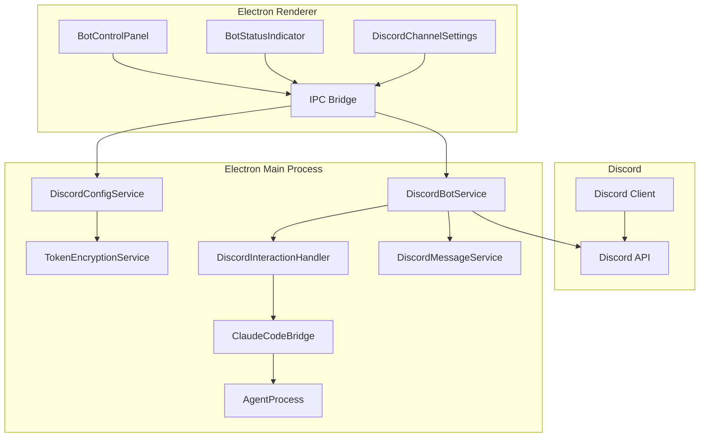
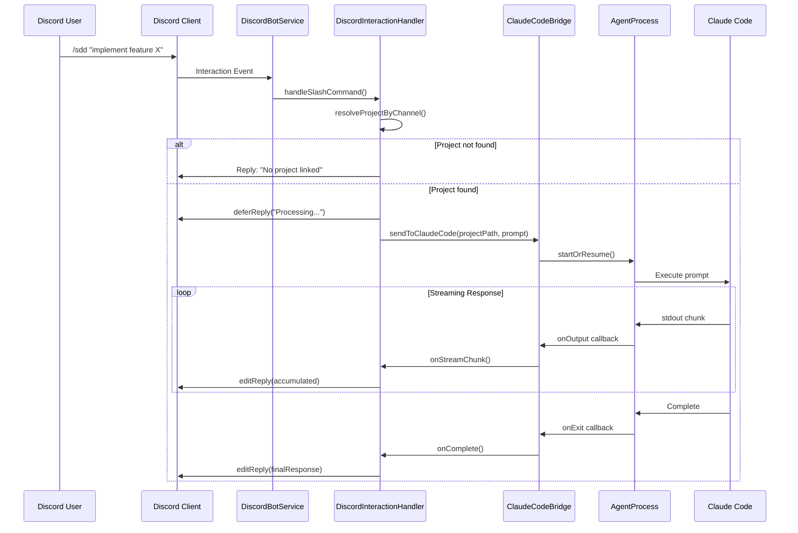
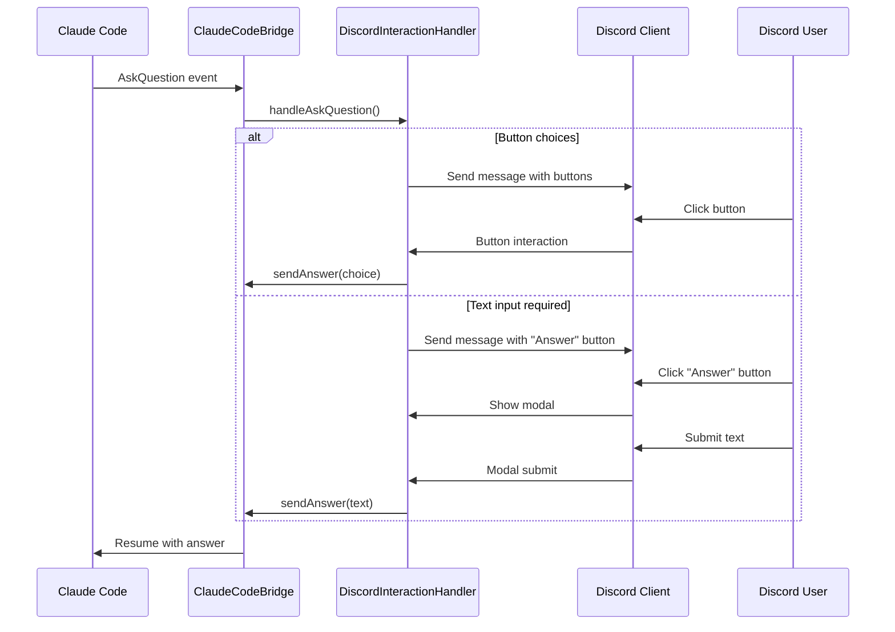

# Technical Design: Discord Bot統合

## Overview

**Purpose**: Discord Bot統合機能は、DiscordのSlash Command（`/sdd <指示>`）経由でClaude Codeへ指示を送信する機能を提供する。SDD Orchestratorのデスクトップアプリケーションから一元的にBotを管理し、複数プロジェクトを単一のBotで運用可能にする。

**Users**: SDD Orchestratorユーザーは、Discordクライアントから開発指示を送信し、Claude Codeの応答をリアルタイムでDiscord上で確認できる。

**Impact**: 既存のElectronアプリケーションにDiscord Bot管理機能を追加し、新たなIPCチャンネルとサービス層を導入する。Remote UIには非対応（Desktop専用機能）。

### Goals

- Discord Slash Command `/sdd` でClaude Codeを操作可能にする
- 複数プロジェクトを単一Botで管理（チャンネルIDで紐付け）
- Claude Code応答をストリーミングでDiscordに表示
- AskQuestionへのDiscordボタン/モーダル対応
- Bot Token/通信のセキュリティ確保

### Non-Goals

- Remote UIからのBot管理（Desktop専用）
- Discord以外のメッセージングプラットフォーム対応
- Bot常時稼働（Electronアプリ起動中のみ動作）
- Discord Rich Presence統合
- 音声チャンネル連携

## Architecture

### Architecture Pattern & Boundary Map



**Architecture Integration**:
- **Selected pattern**: Layered Services — Bot管理、メッセージング、インタラクション処理、Claude連携を分離
- **Domain boundaries**: Discord通信層とClaude Code連携層を明確に分離し、各層を独立してテスト可能に
- **Existing patterns preserved**: AgentProcess、IPC channels、electron-store、Zustandストア
- **New components rationale**: 外部API（Discord）統合のため専用サービス層が必要
- **Steering compliance**: Type Safety（TypeScript strict）、DRY（共通インターフェース定義）、KISS（最小限の責務分離）

### Technology Stack

| Layer | Choice / Version | Role in Feature | Notes |
|-------|------------------|-----------------|-------|
| Bot SDK | discord.js ^14.16 | Discord API通信、Slash Commands、ボタン/モーダル | 最新安定版、v14系 |
| Token Storage | Electron safeStorage | Bot Token暗号化 | Electron組み込み、追加依存なし |
| Config Store | electron-store ^8.2 | 暗号化済みToken/チャンネル設定保存 | 既存依存を活用 |
| Process Management | AgentProcess（既存） | Claude Codeプロセス管理 | 既存パターン再利用 |

## System Flows

### Slash Command実行フロー



### AskQuestion処理フロー



## Requirements Traceability

| Requirement | Summary | Components | Interfaces | Flows |
|-------------|---------|------------|------------|-------|
| 1.1-1.4 | Bot Token設定管理 | TokenEncryptionService, DiscordConfigService, AppSettingsPanel | IPC: discord:get-token, discord:set-token | - |
| 1.5-1.6 | Token未設定エラー/マスク表示 | DiscordConfigService, BotTokenInput | validateToken() | - |
| 2.1-2.5 | チャンネル紐付け設定 | DiscordChannelSettings, DiscordConfigService | IPC: discord:set-channel-config | - |
| 3.1-3.7 | Bot起動/停止制御 | DiscordBotService, BotControlPanel, BotStatusIndicator | IPC: discord:start-bot, discord:stop-bot | - |
| 4.1-4.5 | Botステータス通知 | DiscordMessageService, DiscordBotService | sendStatusNotification() | - |
| 5.1-5.6 | Slash Command受信 | DiscordInteractionHandler, ClaudeCodeBridge | handleSlashCommand() | Slash Command実行フロー |
| 6.1-6.5 | 応答ストリーミング | DiscordMessageService, ClaudeCodeBridge | streamToDiscord() | Slash Command実行フロー |
| 7.1-7.6 | AskQuestion対応 | DiscordInteractionHandler | handleAskQuestion() | AskQuestion処理フロー |
| 8.1-8.4 | 詳細ログ折りたたみ | DiscordMessageService | formatLogMessage() | - |
| 9.1-9.5 | エラーハンドリング | DiscordBotService, DiscordMessageService | reconnect(), onError() | - |
| 10.1-10.4 | セキュリティ | TokenEncryptionService, DiscordBotService | encryptToken(), maskToken() | - |

## Components and Interfaces

### Component Summary

| Component | Domain/Layer | Intent | Req Coverage | Key Dependencies | Contracts |
|-----------|--------------|--------|--------------|-----------------|-----------|
| DiscordBotService | Main/Service | Bot起動・停止・接続管理 | 3.1-3.7, 4.1-4.5, 9.1-9.5 | discord.js Client (P0), DiscordConfigService (P0) | Service, Event |
| DiscordMessageService | Main/Service | メッセージ送受信・ストリーミング | 4.1-4.5, 6.1-6.5, 8.1-8.4 | discord.js Client (P0) | Service |
| DiscordInteractionHandler | Main/Service | Slash Command・ボタン・モーダル処理 | 5.1-5.6, 7.1-7.6 | ClaudeCodeBridge (P0), DiscordMessageService (P1) | Service, Event |
| ClaudeCodeBridge | Main/Service | Claude Codeプロセス連携 | 5.3-5.5, 6.1-6.5, 7.3-7.4 | AgentProcess (P0), AgentRegistry (P0) | Service |
| DiscordConfigService | Main/Service | Bot Token・チャンネル設定管理 | 1.1-1.6, 2.1-2.5 | TokenEncryptionService (P0), electron-store (P1) | Service |
| TokenEncryptionService | Main/Service | Token暗号化・復号 | 10.1-10.2 | safeStorage (P0) | Service |
| BotControlPanel | Renderer/UI | Bot起動/停止UI | 3.1-3.5 | discordStore (P0) | State |
| BotStatusIndicator | Renderer/UI | Botステータス表示 | 3.4-3.5 | discordStore (P0) | State |
| DiscordChannelSettings | Renderer/UI | チャンネル紐付け設定UI | 2.1-2.5 | discordStore (P0) | State |

---

### Main Process Services

#### DiscordBotService

| Field | Detail |
|-------|--------|
| Intent | Discord Bot Clientの起動・停止・接続管理を行う |
| Requirements | 3.1, 3.2, 3.3, 3.4, 3.5, 3.6, 3.7, 4.1, 4.2, 9.1, 9.2, 9.3, 9.4 |

**Responsibilities & Constraints**
- Discord.js Clientのライフサイクル管理
- Electronアプリ終了時のBot自動終了保証
- 接続切断時の再接続ロジック（指数バックオフ、最大5回）
- Botステータス変更のIPC通知

**Dependencies**
- Outbound: discord.js Client — Discord API通信 (P0)
- Inbound: DiscordConfigService — Token取得 (P0)
- Inbound: DiscordMessageService — ステータス通知送信 (P1)
- Inbound: DiscordInteractionHandler — インタラクション処理委譲 (P1)

**Contracts**: Service [x] / API [ ] / Event [x] / Batch [ ] / State [ ]

##### Service Interface

```typescript
interface DiscordBotService {
  /** Bot起動 */
  start(): Promise<Result<void, BotStartError>>;

  /** Bot停止 */
  stop(): Promise<void>;

  /** ステータス取得 */
  getStatus(): BotStatus;

  /** プロジェクト一覧取得（チャンネル紐付け情報付き） */
  getManagedProjects(): ProjectChannelMapping[];
}

type BotStatus = 'offline' | 'connecting' | 'online' | 'reconnecting' | 'error';

interface BotStartError {
  code: 'TOKEN_MISSING' | 'TOKEN_INVALID' | 'NETWORK_ERROR' | 'ALREADY_RUNNING';
  message: string;
}

interface ProjectChannelMapping {
  projectPath: string;
  channelId: string;
  notificationChannelId?: string;
}
```

##### Event Contract

- Published events:
  - `bot-status-changed`: `{ status: BotStatus, error?: string }`
  - `bot-ready`: `{ botName: string, guildCount: number }`
- Subscribed events:
  - `app-will-quit`: 自動停止トリガー
- Ordering / delivery guarantees: 同期的、UIへの即座反映必須

---

#### DiscordMessageService

| Field | Detail |
|-------|--------|
| Intent | Discordメッセージの送信・編集・ストリーミング更新を行う |
| Requirements | 4.1, 4.2, 4.3, 4.4, 4.5, 6.1, 6.2, 6.3, 6.4, 6.5, 8.1, 8.2, 8.3, 8.4 |

**Responsibilities & Constraints**
- メッセージ送信・編集（レート制限対応）
- ストリーミング更新（1.5秒間隔）
- 2000文字超過時の分割送信
- ツール実行ログの折りたたみ（spoiler）フォーマット
- コードブロックのMarkdown整形

**Dependencies**
- Outbound: discord.js Client — メッセージAPI (P0)
- External: Discord API — レート制限5回/5秒 (P0)

**Contracts**: Service [x] / API [ ] / Event [ ] / Batch [ ] / State [ ]

##### Service Interface

```typescript
interface DiscordMessageService {
  /** メッセージ送信 */
  sendMessage(channelId: string, content: string): Promise<Message>;

  /** ステータス通知送信 */
  sendStatusNotification(
    channelId: string,
    type: 'startup' | 'shutdown',
    info: StatusNotificationInfo
  ): Promise<void>;

  /** ストリーミング更新開始 */
  startStreaming(
    interaction: CommandInteraction,
    onChunk: (accumulated: string) => void
  ): StreamingSession;

  /** ツールログをフォーマット */
  formatLogMessage(toolName: string, summary: string, details: string): string;
}

interface StatusNotificationInfo {
  botName: string;
  timestamp: Date;
  projectCount?: number;
}

interface StreamingSession {
  update(content: string): void;
  complete(finalContent: string): Promise<void>;
  abort(error: string): Promise<void>;
}
```

**Implementation Notes**
- Integration: Discord.jsの`editReply()`を使用、1.5秒間隔でデバウンス
- Validation: 2000文字超過時は自動分割、コードブロック途中の分割は避ける
- Risks: レート制限超過時はDiscord.jsの自動キュー管理に依存

---

#### DiscordInteractionHandler

| Field | Detail |
|-------|--------|
| Intent | Slash Command、ボタン、モーダルのインタラクションを処理する |
| Requirements | 5.1, 5.2, 5.3, 5.4, 5.5, 5.6, 7.1, 7.2, 7.3, 7.4, 7.5, 7.6 |

**Responsibilities & Constraints**
- `/sdd`コマンドの受信とチャンネル→プロジェクト解決
- Claude Codeへの指示転送
- AskQuestionのボタン/モーダルUI生成
- ボタンタイムアウト（5分）管理

**Dependencies**
- Outbound: ClaudeCodeBridge — Claude Code連携 (P0)
- Outbound: DiscordMessageService — メッセージ送信 (P1)
- Inbound: discord.js Interaction Events (P0)

**Contracts**: Service [x] / API [ ] / Event [x] / Batch [ ] / State [ ]

##### Service Interface

```typescript
interface DiscordInteractionHandler {
  /** Interactionイベント登録 */
  registerHandlers(client: Client): void;

  /** Slash Command処理 */
  handleSlashCommand(interaction: ChatInputCommandInteraction): Promise<void>;

  /** ボタン処理 */
  handleButtonInteraction(interaction: ButtonInteraction): Promise<void>;

  /** モーダル処理 */
  handleModalSubmit(interaction: ModalSubmitInteraction): Promise<void>;
}
```

##### Event Contract

- Subscribed events:
  - `interactionCreate`: 全インタラクションのエントリーポイント
  - `askQuestion`: ClaudeCodeBridgeからの質問イベント
- Published events:
  - `askQuestionAnswered`: `{ sessionId: string, answer: string }`

---

#### ClaudeCodeBridge

| Field | Detail |
|-------|--------|
| Intent | Discord経由の指示をClaude Codeプロセスに転送し、応答をストリーミング返却する |
| Requirements | 5.3, 5.4, 5.5, 6.1, 6.2, 6.3, 7.3, 7.4 |

**Responsibilities & Constraints**
- プロジェクト別Claude Codeセッション管理
- プロセス未起動時の自動起動
- 応答ストリーミングのコールバック提供
- AskQuestionイベントの検出と転送

**Dependencies**
- Outbound: AgentProcess — プロセス起動 (P0)
- Outbound: AgentRegistry — セッション管理 (P0)

**Contracts**: Service [x] / API [ ] / Event [x] / Batch [ ] / State [ ]

##### Service Interface

```typescript
interface ClaudeCodeBridge {
  /** 指示送信（ストリーミングコールバック付き） */
  sendPrompt(
    projectPath: string,
    prompt: string,
    callbacks: ClaudeCodeCallbacks
  ): Promise<SessionInfo>;

  /** AskQuestion回答送信 */
  sendAnswer(sessionId: string, answer: string): Promise<void>;

  /** セッション取得 */
  getSession(projectPath: string): SessionInfo | null;
}

interface ClaudeCodeCallbacks {
  onStreamChunk: (chunk: string, accumulated: string) => void;
  onAskQuestion: (question: AskQuestionEvent) => void;
  onComplete: (finalResponse: string) => void;
  onError: (error: Error) => void;
}

interface AskQuestionEvent {
  sessionId: string;
  question: string;
  choices?: string[];
  requiresTextInput?: boolean;
}

interface SessionInfo {
  sessionId: string;
  projectPath: string;
  agentId: string;
  status: 'running' | 'waiting_input' | 'completed' | 'error';
}
```

---

#### DiscordConfigService

| Field | Detail |
|-------|--------|
| Intent | Bot Token・チャンネル紐付け設定の読み書きを管理する |
| Requirements | 1.1, 1.2, 1.3, 1.4, 1.5, 1.6, 2.1, 2.2, 2.3, 2.4, 2.5 |

**Responsibilities & Constraints**
- Token優先順位: 環境変数 > プロジェクト設定 > アプリ全体設定
- チャンネルID重複時の警告生成
- プロジェクト設定は`.kiro/settings/discord.json`に保存

**Dependencies**
- Outbound: TokenEncryptionService — Token暗号化 (P0)
- Outbound: electron-store — アプリ全体設定保存 (P1)
- Outbound: fileService — プロジェクト設定読み書き (P1)

**Contracts**: Service [x] / API [ ] / Event [ ] / Batch [ ] / State [ ]

##### Service Interface

```typescript
interface DiscordConfigService {
  /** 有効なBot Token取得（優先順位適用） */
  getEffectiveToken(projectPath?: string): Promise<string | null>;

  /** Token設定元の取得 */
  getTokenSource(projectPath?: string): 'env' | 'project' | 'app' | null;

  /** アプリ全体Token設定 */
  setAppToken(token: string): Promise<void>;

  /** プロジェクトToken設定 */
  setProjectToken(projectPath: string, token: string): Promise<void>;

  /** チャンネル設定取得 */
  getChannelConfig(projectPath: string): ChannelConfig | null;

  /** チャンネル設定保存 */
  setChannelConfig(projectPath: string, config: ChannelConfig): Promise<void>;

  /** チャンネルID重複チェック */
  checkChannelConflicts(): ChannelConflict[];
}

interface ChannelConfig {
  channelId: string;
  notificationChannelId?: string;
}

interface ChannelConflict {
  channelId: string;
  projectPaths: string[];
}
```

---

#### TokenEncryptionService

| Field | Detail |
|-------|--------|
| Intent | Bot TokenのOS統合暗号化・復号を行う |
| Requirements | 10.1, 10.2 |

**Responsibilities & Constraints**
- Electron safeStorage APIを使用
- 暗号化されたTokenをBase64エンコードで保存
- 復号失敗時はエラーログ記録

**Dependencies**
- External: Electron safeStorage — OS暗号化 (P0)

**Contracts**: Service [x] / API [ ] / Event [ ] / Batch [ ] / State [ ]

##### Service Interface

```typescript
interface TokenEncryptionService {
  /** Token暗号化 */
  encrypt(token: string): string;

  /** Token復号 */
  decrypt(encryptedToken: string): string;

  /** 暗号化機能が利用可能か */
  isAvailable(): boolean;

  /** Tokenマスク（ログ出力用） */
  maskToken(token: string): string;
}
```

---

### Renderer Components

#### BotControlPanel

| Field | Detail |
|-------|--------|
| Intent | Bot起動/停止トグルボタンとステータス表示を提供する |
| Requirements | 3.1, 3.2, 3.3, 3.4, 3.5 |

**Dependencies**
- Inbound: discordStore — Bot状態 (P0)

**Contracts**: Service [ ] / API [ ] / Event [ ] / Batch [ ] / State [x]

##### State Management

```typescript
// discordStore.ts
interface DiscordState {
  botStatus: BotStatus;
  botError: string | null;
  isStarting: boolean;
  isStopping: boolean;

  // Actions
  startBot: () => Promise<void>;
  stopBot: () => Promise<void>;
}
```

**Implementation Notes**
- Integration: 既存のツールバーエリアに配置
- Validation: Token未設定時はボタン無効化

---

#### BotStatusIndicator

| Field | Detail |
|-------|--------|
| Intent | Botステータスをアイコン/バッジで視覚的に表示する |
| Requirements | 3.4, 3.5 |

**Dependencies**
- Inbound: discordStore (P0)

**Implementation Notes**
- オンライン: 緑バッジ
- オフライン: グレーバッジ
- 接続中/再接続中: 黄色バッジ + スピナー
- エラー: 赤バッジ + ツールチップでエラー詳細

---

#### DiscordChannelSettings

| Field | Detail |
|-------|--------|
| Intent | プロジェクト設定画面でチャンネルID紐付けを設定するUI |
| Requirements | 2.1, 2.2, 2.3, 2.4, 2.5 |

**Dependencies**
- Inbound: discordStore (P0)

**Implementation Notes**
- 既存のプロジェクト設定パネル内に配置
- チャンネルID重複時は警告バナー表示

---

### IPC Channels

```typescript
// channels.ts への追加
export const IPC_CHANNELS = {
  // ... existing channels ...

  // Discord Bot Management
  DISCORD_START_BOT: 'discord:start-bot',
  DISCORD_STOP_BOT: 'discord:stop-bot',
  DISCORD_GET_STATUS: 'discord:get-status',
  DISCORD_BOT_STATUS_CHANGED: 'discord:bot-status-changed',

  // Discord Config
  DISCORD_GET_APP_TOKEN: 'discord:get-app-token',
  DISCORD_SET_APP_TOKEN: 'discord:set-app-token',
  DISCORD_GET_PROJECT_TOKEN: 'discord:get-project-token',
  DISCORD_SET_PROJECT_TOKEN: 'discord:set-project-token',
  DISCORD_GET_CHANNEL_CONFIG: 'discord:get-channel-config',
  DISCORD_SET_CHANNEL_CONFIG: 'discord:set-channel-config',
  DISCORD_CHECK_CHANNEL_CONFLICTS: 'discord:check-channel-conflicts',
} as const;
```

## Data Models

### Domain Model

#### Aggregates

- **DiscordBot**: Bot状態とClient管理のルートエンティティ
- **DiscordSession**: チャンネル別のClaude Code対話セッション

#### Entities

- **ChannelProjectBinding**: チャンネルID ↔ プロジェクトパスの紐付け
- **PendingInteraction**: 応答待ちのボタン/モーダルインタラクション

#### Value Objects

- **BotToken**: 暗号化されたトークン値
- **ChannelId**: Discordチャンネル識別子（snowflake形式）
- **MessageChunk**: ストリーミング中のメッセージ断片

### Logical Data Model

#### アプリ全体設定（electron-store）

```typescript
interface DiscordAppSettings {
  encryptedBotToken?: string;  // safeStorage暗号化済み
  defaultStreamingInterval?: number;  // ms, default: 1500
}
```

#### プロジェクト設定（.kiro/settings/discord.json）

```typescript
interface DiscordProjectSettings {
  encryptedBotToken?: string;  // safeStorage暗号化済み
  channelId?: string;
  notificationChannelId?: string;
  enabled?: boolean;  // default: true
}
```

### Physical Data Model

#### ファイルパス

- アプリ全体設定: `~/Library/Application Support/sdd-orchestrator/config.json` 内の `discord` キー
- プロジェクト設定: `{projectPath}/.kiro/settings/discord.json`

## Error Handling

### Error Categories and Responses

**User Errors (4xx相当)**:
- Token未設定 → 設定画面へのナビゲーション案内
- チャンネル未紐付け → Discordに「プロジェクトが見つかりません」エラー返信
- 無効なチャンネルID → 入力バリデーション、フィールドエラー表示

**System Errors (5xx相当)**:
- Discord API接続失敗 → 指数バックオフ再接続（最大5回）、失敗時はBot停止とUI通知
- Claude Codeプロセスクラッシュ → Discordにエラーメッセージ送信
- safeStorage利用不可（Linux） → 警告表示、暗号化なしで保存（セキュリティ低下告知）

**Business Logic Errors (422相当)**:
- チャンネルID重複 → 警告メッセージ表示、設定は許可
- ボタンタイムアウト → ボタン無効化、タイムアウトメッセージ表示

### Monitoring

- Bot接続状態: `discordStore.botStatus`で管理、UIに反映
- エラーログ: ProjectLoggerでプロジェクトログに記録
- 再接続試行: `reconnectAttempt`カウンターでログ出力

## Testing Strategy

### Unit Tests

- TokenEncryptionService: encrypt/decrypt往復、マスク処理
- DiscordConfigService: 優先順位ロジック、チャンネル重複検出
- DiscordMessageService: メッセージ分割ロジック、フォーマット
- ClaudeCodeBridge: セッション管理、コールバック呼び出し
- DiscordInteractionHandler: プロジェクト解決ロジック

### Integration Tests

- Bot起動→Slash Command受信→Claude Code転送→ストリーミング応答
- AskQuestion→ボタン表示→回答送信→セッション再開
- 再接続ロジック（Discord API接続切断シミュレーション）

### E2E Tests

- Bot起動/停止トグル操作
- チャンネル設定UI（入力、保存、重複警告）
- ステータスインジケーター表示変化

## Security Considerations

### Token Protection

- safeStorage APIでOS統合暗号化（macOS Keychain、Windows DPAPI）
- ログ出力時は常にマスク（例: `Bot-XXXX...YYYY`）
- 環境変数経由のToken取得もサポート（CI/CD向け）

### Communication Security

- Discord.js 14はHTTPS/WSS強制（設定不要）
- Bot Tokenのメモリ上保持は最小限

### Access Control

- 未登録チャンネルからのコマンドは無視、ログ記録のみ
- プロジェクト紐付けチャンネル以外はアクセス拒否

## Performance & Scalability

### Target Metrics

- Bot起動時間: < 3秒
- Slash Command応答開始: < 500ms（deferReply）
- ストリーミング遅延: < 200ms（chunk受信からDiscord更新まで）

### Rate Limit Optimization

- 更新間隔1.5秒でレート制限（5回/5秒）に十分な余裕
- Discord.jsのビルトインキュー管理を活用
- メッセージバッチ処理（複数chunk蓄積後に一括更新）

## Supporting References

### Discord.js Type Definitions

```typescript
// discord.js v14 key types used in this feature
import {
  Client,
  GatewayIntentBits,
  ChatInputCommandInteraction,
  ButtonInteraction,
  ModalSubmitInteraction,
  ButtonBuilder,
  ActionRowBuilder,
  ModalBuilder,
  TextInputBuilder,
  TextInputStyle,
  ButtonStyle,
  Message,
  EmbedBuilder,
} from 'discord.js';

// Required intents for this feature
const requiredIntents = [
  GatewayIntentBits.Guilds,
  GatewayIntentBits.GuildMessages,
];
```

### Slash Command Registration

```typescript
// /sdd command definition
const sddCommand = new SlashCommandBuilder()
  .setName('sdd')
  .setDescription('Send a prompt to Claude Code')
  .addStringOption(option =>
    option
      .setName('prompt')
      .setDescription('The instruction to send to Claude Code')
      .setRequired(true)
  );
```
