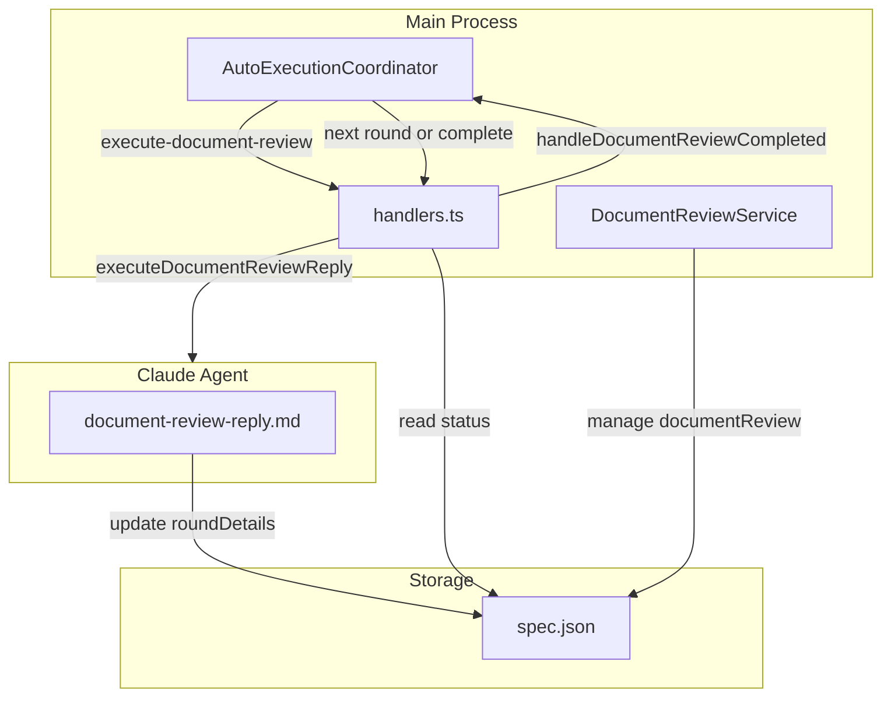
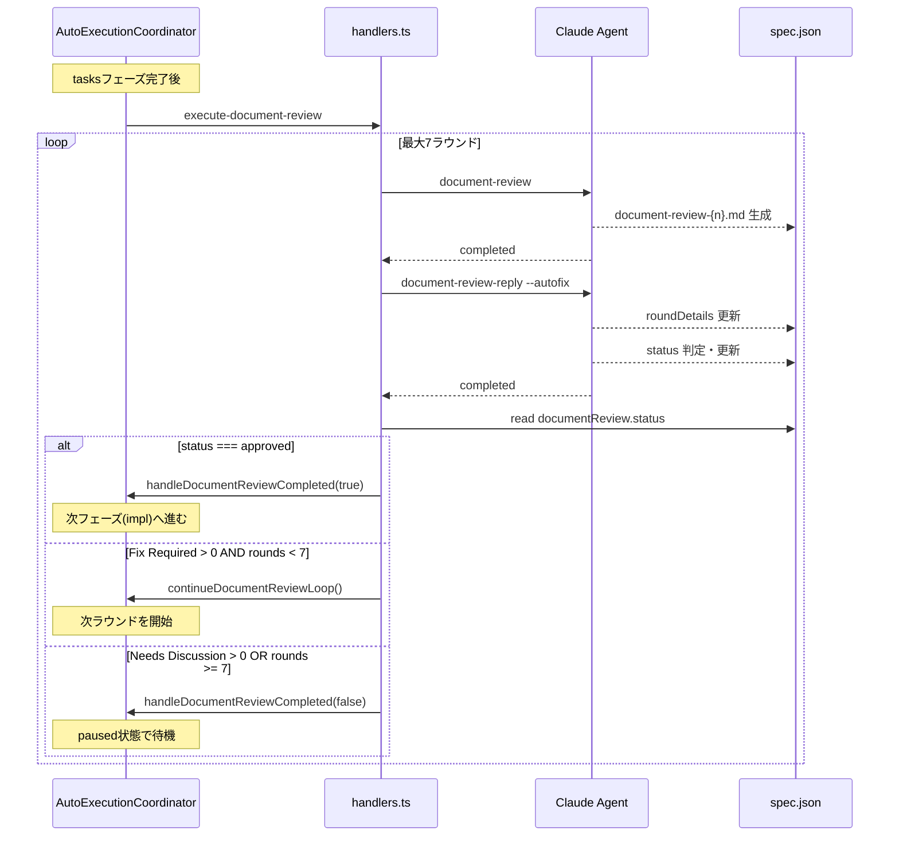
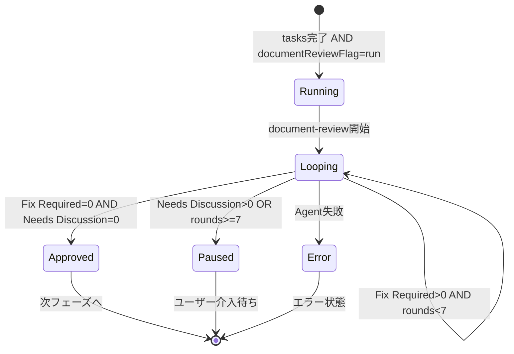

# Design: Document Review Auto Loop

## Overview

**Purpose**: この機能は、Document Review の自動実行において `documentReview.status === "approved"` になるまで review -> reply のサイクルを自動的に繰り返すことで、人間の介入なしで解決可能な issue を全て自動修正する価値を提供する。

**Users**: SDD Orchestrator の自動実行機能を利用するユーザーが、Document Review フェーズでの手動介入を最小化するために使用する。

**Impact**: 現在の `--autofix` モードは1回の fix 適用で終了するが、本機能により最大7ラウンドまで自動的にループし、全ての issue が解決されるか人間の介入が必要な状態になるまで継続する。

### Goals

- Document Review の自動実行において、approved になるまで自動的にループする
- 無限ループ防止のため最大7ラウンドの制限を設ける
- 適切な終了条件（Fix Required = 0 AND Needs Discussion = 0）で自動承認
- 中断・再開時に既存ラウンドを保持して継続可能にする

### Non-Goals

- Document Review パネル UI の新規作成（既存パネルを使用）
- リアルタイムのラウンド進捗通知（spec.json 書き込み後の表示で十分）
- 手動実行時のループ機能
- `--fix` モードの変更（手動実行専用のまま）

## Architecture

### Existing Architecture Analysis

**現行アーキテクチャの把握**:
- `AutoExecutionCoordinator` が自動実行の状態を SSOT として管理
- `handlers.ts` の `execute-document-review` イベントハンドラで document-review -> document-review-reply の実行フローを制御
- `handleDocumentReviewCompleted()` で Document Review 完了後の次フェーズ遷移を制御
- `document-review-reply.md` コマンドが spec.json の `documentReview.status` を更新

**Integration Points**:
- `AutoExecutionCoordinator.handleDocumentReviewCompleted()` - ループ継続/終了判定の拡張ポイント
- `executeDocumentReviewReply()` in `handlers.ts` - reply 完了後の結果判定
- `DocumentReviewService` - spec.json の documentReview フィールド管理
- `document-review-reply.md` - approved 判定ロジックの変更

### Architecture Pattern & Boundary Map



**Architecture Integration**:
- Selected pattern: イベント駆動 + 状態機械（既存パターンの拡張）
- Domain/feature boundaries: AutoExecutionCoordinator がループ状態を管理、handlers.ts が実行制御、DocumentReviewService が永続化
- Existing patterns preserved: SSOT（Coordinator）、IPC イベント駆動、spec.json ベースの状態永続化
- New components rationale: 新規コンポーネントなし、既存コンポーネントの拡張のみ
- Steering compliance: 関心の分離（handlers は IPC 受け渡し、Coordinator が状態管理）

### Technology Stack

| Layer | Choice / Version | Role in Feature | Notes |
|-------|------------------|-----------------|-------|
| Backend / Services | TypeScript / Node.js | ループ制御ロジック | 既存の AutoExecutionCoordinator 拡張 |
| Data / Storage | spec.json | ラウンド状態永続化 | documentReview.roundDetails に保存 |

## System Flows

### Document Review Auto Loop Sequence



### State Transition



## Requirements Traceability

| Requirement | Summary | Components | Interfaces | Flows |
|-------------|---------|------------|------------|-------|
| 1.1 | 自動ループ制御 | AutoExecutionCoordinator | continueDocumentReviewLoop() | Auto Loop Sequence |
| 1.2 | Coordinator でのループ制御 | AutoExecutionCoordinator | handleDocumentReviewCompleted() | State Transition |
| 1.3 | ラウンド状態の永続化 | AutoExecutionState, spec.json | currentDocumentReviewRound | Auto Loop Sequence |
| 2.1 | 最大7ラウンド | AutoExecutionCoordinator | MAX_DOCUMENT_REVIEW_ROUNDS | Auto Loop Sequence |
| 2.2 | 7ラウンド到達時paused | AutoExecutionCoordinator | handleDocumentReviewCompleted() | State Transition |
| 2.3 | paused後の手動再開 | AutoExecutionCoordinator | start() | - |
| 3.1 | approved判定 | document-review-reply.md | - | Auto Loop Sequence |
| 3.2 | Needs Discussion時paused | AutoExecutionCoordinator | handleDocumentReviewCompleted() | State Transition |
| 3.3 | Fix Required時次ラウンド | AutoExecutionCoordinator | continueDocumentReviewLoop() | Auto Loop Sequence |
| 3.4 | Agent失敗時error | AutoExecutionCoordinator | handleAgentCompleted() | State Transition |
| 4.1 | 中断時ラウンド保存 | spec.json | roundDetails | - |
| 4.2 | 再開時ラウンド継続 | AutoExecutionCoordinator | start() | - |
| 4.3 | 完了ラウンド保持 | spec.json | roundDetails | - |
| 5.1 | document-review実行 | handlers.ts | execute-document-review | Auto Loop Sequence |
| 5.2 | document-review-reply --autofix実行 | handlers.ts | executeDocumentReviewReply() | Auto Loop Sequence |
| 6.1 | approved判定変更 | document-review-reply.md | - | Auto Loop Sequence |
| 6.2 | Needs Discussion考慮 | document-review-reply.md | - | Auto Loop Sequence |
| 6.3 | コマンド仕様更新 | document-review-reply.md | - | - |
| 7.1 | Remote UIラウンド表示 | Remote UI | - | - |
| 7.2 | roundDetails読み取り | Remote UI | - | - |
| 7.3 | 追加通知不要 | - | - | - |

## Components and Interfaces

| Component | Domain/Layer | Intent | Req Coverage | Key Dependencies | Contracts |
|-----------|--------------|--------|--------------|------------------|-----------|
| AutoExecutionCoordinator | Main/Services | ループ状態管理 | 1.1-1.3, 2.1-2.3, 3.1-3.4, 4.1-4.3 | handlers.ts (P0), spec.json (P0) | State |
| handlers.ts | Main/IPC | ループ実行制御 | 5.1, 5.2 | AutoExecutionCoordinator (P0), SpecManagerService (P0) | Event |
| document-review-reply.md | Claude/Commands | approved判定変更 | 6.1-6.3 | spec.json (P0) | - |
| DocumentReviewService | Main/Services | ラウンド状態永続化 | 1.3, 4.1, 4.3 | spec.json (P0) | Service |

### Main / Services

#### AutoExecutionCoordinator

| Field | Detail |
|-------|--------|
| Intent | Document Review の自動ループ状態を管理し、ラウンド継続/終了を制御 |
| Requirements | 1.1, 1.2, 1.3, 2.1, 2.2, 2.3, 3.1, 3.2, 3.3, 3.4, 4.1, 4.2, 4.3 |

**Responsibilities & Constraints**
- Document Review ループの実行状態を SSOT として管理
- 最大ラウンド数（7）の制限を enforce
- 終了条件（approved / Needs Discussion / max rounds）に基づく状態遷移

**Dependencies**
- Outbound: handlers.ts - execute-document-review イベント発火 (P0)
- Outbound: spec.json - ラウンド状態の永続化 (P0)

**Contracts**: State [x]

##### State Management

```typescript
interface AutoExecutionState {
  // 既存フィールド（変更なし）
  readonly specPath: string;
  readonly specId: string;
  status: AutoExecutionStatus;
  currentPhase: WorkflowPhase | null;
  executedPhases: WorkflowPhase[];
  errors: string[];
  startTime: number;
  lastActivityTime: number;
  currentAgentId?: string;
  timeoutId?: ReturnType<typeof setTimeout>;

  // 新規追加フィールド
  /** 現在の Document Review ラウンド番号 (1-indexed) */
  currentDocumentReviewRound?: number;
}

/** 最大 Document Review ラウンド数 - Constants セクションに追加 */
const MAX_DOCUMENT_REVIEW_ROUNDS = 7;
// autoExecutionCoordinator.ts の Constants セクション（line 17-27 付近）に追加すること
```

##### continueDocumentReviewLoop 詳細仕様

```typescript
/**
 * Document Review ループを継続
 * @param specPath specのパス
 * @param nextRound 次のラウンド番号 (1-indexed)
 */
continueDocumentReviewLoop(specPath: string, nextRound: number): void {
  // 1. 状態検証
  //    - executionStates から state を取得
  //    - state が存在しない場合は warn ログを出力して return
  //    - nextRound が MAX_DOCUMENT_REVIEW_ROUNDS を超える場合は handleDocumentReviewCompleted(false) を呼び出して return

  // 2. 状態更新
  //    - state.currentDocumentReviewRound = nextRound
  //    - state.lastActivityTime = Date.now()

  // 3. ログ出力
  //    - logger.info('[AutoExecutionCoordinator] Document review round {n} starting', { specPath, round: nextRound })

  // 4. イベント発火
  //    - this.eventEmitter.emit('execute-document-review', specPath, { specId: state.specId })
  //    - これにより handlers.ts の execute-document-review ハンドラが呼び出される
}
```

**イベントフロー**:
1. `continueDocumentReviewLoop()` が呼び出される
2. 状態を更新（`currentDocumentReviewRound`）
3. `execute-document-review` イベントを発火
4. handlers.ts が document-review -> document-review-reply を実行
5. reply 完了後、handlers.ts が結果を判定して再度 `continueDocumentReviewLoop()` または `handleDocumentReviewCompleted()` を呼び出す

**Implementation Notes**
- Integration: 既存の `handleDocumentReviewCompleted()` を拡張してループ継続ロジックを追加
- Validation: ラウンド数が MAX_DOCUMENT_REVIEW_ROUNDS を超えないことを保証
- Risks: ラウンド状態の永続化タイミングで Coordinator と spec.json の不整合が発生する可能性

### Main / IPC

#### handlers.ts

| Field | Detail |
|-------|--------|
| Intent | Document Review ループの実行フローを制御し、Agent 完了後の判定を行う |
| Requirements | 5.1, 5.2 |

**Responsibilities & Constraints**
- `execute-document-review` イベントハンドラでループ実行を制御
- Agent 完了後に spec.json を読み取り、ループ継続/終了を判定
- Coordinator への状態通知

**Dependencies**
- Inbound: AutoExecutionCoordinator - execute-document-review イベント (P0)
- Outbound: SpecManagerService - executeDocumentReview/executeDocumentReviewReply 呼び出し (P0)
- Outbound: AutoExecutionCoordinator - handleDocumentReviewCompleted/continueDocumentReviewLoop 呼び出し (P0)

**Contracts**: Event [x]

##### Event Contract

```typescript
// 既存イベント（変更なし）
'execute-document-review': (specPath: string, context: { specId: string }) => void;

// Coordinator への新規メソッド呼び出し
interface AutoExecutionCoordinator {
  /**
   * Document Review ループを継続
   * @param specPath specのパス
   * @param nextRound 次のラウンド番号
   */
  continueDocumentReviewLoop(specPath: string, nextRound: number): void;

  /**
   * 現在の Document Review ラウンド番号を取得
   * @param specPath specのパス
   * @returns ラウンド番号 (1-indexed) または undefined
   */
  getCurrentDocumentReviewRound(specPath: string): number | undefined;
}
```

**Implementation Notes**
- Integration: 既存の `executeDocumentReviewReply()` 関数を拡張してループ継続判定を追加
- Validation: spec.json の documentReview.status と roundDetails の Fix Required/Needs Discussion カウントを確認
- Risks: Agent 完了とspec.json 更新のタイミングによっては古い状態を読み取る可能性

### Claude / Commands

#### document-review-reply.md

| Field | Detail |
|-------|--------|
| Intent | approved 判定ロジックを変更し、Needs Discussion も考慮する |
| Requirements | 6.1, 6.2, 6.3 |

**Responsibilities & Constraints**
- `Fix Required = 0 AND Needs Discussion = 0` の場合のみ `documentReview.status = "approved"` を設定
- `Fix Required = 0 AND Needs Discussion > 0` の場合は approved にしない
- spec.json の roundDetails を正しく更新

**Dependencies**
- Outbound: spec.json - documentReview フィールド更新 (P0)

**roundDetails へのカウント書き込み仕様**:

Reply 完了時、`roundDetails[n-1]` に以下のフィールドを書き込む:
```json
{
  "roundNumber": n,
  "status": "reply_complete",
  "fixRequiredCount": <Response Summary の Fix Required 合計>,
  "needsDiscussionCount": <Response Summary の Needs Discussion 合計>
}
```

handlers.ts はこの `fixRequiredCount` と `needsDiscussionCount` を参照してループ継続/終了を判定する。

**Needs Discussion 判定ガイドライン**:

| Needs Discussion とすべき場合 | 理由 |
|------------------------------|------|
| 複数の技術的アプローチが存在し、どちらも妥当 | AI では最適解を判断できない |
| ビジネス要件の解釈が複数存在する | ステークホルダーの意図確認が必要 |
| トレードオフが存在し、優先順位が不明 | パフォーマンス vs 可読性など |
| 既存実装との互換性に関する判断が必要 | 破壊的変更の許容度は人間が判断 |
| セキュリティやコンプライアンスに関わる決定 | リスク判断は人間が行う |

| Needs Discussion としない場合 | 理由 |
|------------------------------|------|
| 明確な技術的誤り | Fix Required として対応 |
| ドキュメントの記載漏れ | Fix Required として対応 |
| 既存パターンとの整合性の問題 | 明確な基準があれば Fix Required |
| 単なる情報提供 | Info として記録 |

**Implementation Notes**
- Integration: 既存の approved 判定ロジック（Fix Required = 0 のみ）を拡張
- Validation: Response Summary テーブルから Needs Discussion カウントを確実に取得
- Risks: Needs Discussion の定義が曖昧な場合、判定が不正確になる可能性（上記ガイドラインで軽減）

## Data Models

### Domain Model

**DocumentReviewState (既存、変更なし)**:
```typescript
interface DocumentReviewState {
  status: ReviewStatus;
  currentRound?: number;
  roundDetails?: RoundDetail[];
}

interface RoundDetail {
  roundNumber: number;
  reviewCompletedAt?: string;
  replyCompletedAt?: string;
  status: RoundStatus;
  fixApplied?: boolean;
  /** Fix Required と判定された issue の数 */
  fixRequiredCount?: number;
  /** Needs Discussion と判定された issue の数 */
  needsDiscussionCount?: number;
}
```

**AutoExecutionState の拡張**:
```typescript
interface AutoExecutionState {
  // ... 既存フィールド

  /** 現在の Document Review ラウンド番号 (1-indexed) */
  currentDocumentReviewRound?: number;
}
```

**Business Rules & Invariants**:
- `currentDocumentReviewRound` は 1 以上 MAX_DOCUMENT_REVIEW_ROUNDS (7) 以下
- ループ中は `documentReview.status` が `in_progress` のまま
- approved になった瞬間にループ終了
- 7ラウンド到達時は必ず paused 状態に遷移

### Logical Data Model

**spec.json documentReview フィールド（既存構造、変更なし）**:
```json
{
  "documentReview": {
    "status": "in_progress",
    "currentRound": 3,
    "roundDetails": [
      {
        "roundNumber": 1,
        "status": "reply_complete",
        "reviewCompletedAt": "2026-01-12T10:00:00Z",
        "replyCompletedAt": "2026-01-12T10:05:00Z",
        "fixApplied": true
      },
      {
        "roundNumber": 2,
        "status": "reply_complete",
        "reviewCompletedAt": "2026-01-12T10:10:00Z",
        "replyCompletedAt": "2026-01-12T10:15:00Z",
        "fixApplied": true
      },
      {
        "roundNumber": 3,
        "status": "incomplete"
      }
    ]
  }
}
```

## Error Handling

### Error Strategy

| Error Type | Detection | Response | Recovery |
|------------|-----------|----------|----------|
| Agent 実行失敗 | Agent status === 'failed' | status: error に遷移 | ユーザーが手動で再開 |
| spec.json 読み取りエラー | readSpecJson() 失敗 | ログ出力、paused に遷移 | ユーザーが spec.json を修正後再開 |
| spec.json 永続化失敗 | writeSpecJson() 失敗 | ログ出力（error）、paused に遷移 | ユーザーが手動で spec.json を確認・修正後再開。Coordinator の状態は維持し、次回再開時に永続化をリトライ |
| 最大ラウンド到達 | rounds >= 7 | status: paused に遷移 | ユーザーが手動で問題解決 |
| Needs Discussion 残存 | Needs Discussion > 0 | status: paused に遷移 | ユーザーが Discussion 内容を確認 |

### Monitoring

**ログレベル定義**:
| Event | Level | Format |
|-------|-------|--------|
| ラウンド開始 | info | `[AutoExecutionCoordinator] Document review round {n} starting` |
| ラウンド完了 | info | `[AutoExecutionCoordinator] Document review round {n} completed` |
| ループ継続 | info | `[AutoExecutionCoordinator] Document review continuing to round {n}` |
| approved | info | `[AutoExecutionCoordinator] Document review approved after {n} rounds` |
| paused (Needs Discussion) | warn | `[AutoExecutionCoordinator] Document review paused: Needs Discussion items remain` |
| paused (max rounds) | warn | `[AutoExecutionCoordinator] Max document review rounds ({n}) reached, pausing` |
| エラー発生 | error | `[AutoExecutionCoordinator] Document review loop error: {error}` |
| 永続化失敗 | error | `[AutoExecutionCoordinator] Failed to persist round state to spec.json: {error}` |

**メトリクス項目**:
- 各ラウンドの Fix Required / Needs Discussion カウント
- ラウンド所要時間（オプショナル、将来拡張用）

**ログ出力例**:
```typescript
logger.info('[AutoExecutionCoordinator] Document review round completed', {
  specPath,
  round: currentRound,
  fixRequired: 3,
  needsDiscussion: 1,
  nextAction: 'continue' // 'continue' | 'approved' | 'paused'
});
```

## Testing Strategy

### Unit Tests

1. `AutoExecutionCoordinator.continueDocumentReviewLoop()` - ラウンド継続時の状態更新
2. `AutoExecutionCoordinator.handleDocumentReviewCompleted()` - 各終了条件での状態遷移
3. `AutoExecutionCoordinator.getCurrentDocumentReviewRound()` - ラウンド番号取得
4. ループ制限（7ラウンド）の enforcement
5. 中断・再開時のラウンド状態保持

### Integration Tests

1. tasks 完了 -> document-review -> document-review-reply -> approved の full flow
2. Fix Required 残存時の次ラウンド継続
3. Needs Discussion 残存時の paused 遷移
4. 7ラウンド到達時の paused 遷移
5. Agent 失敗時の error 遷移

### E2E Tests

1. Mock Claude による複数ラウンドループテスト
2. ラウンド状態の Remote UI 表示確認
3. 中断・再開フローテスト

## Design Decisions

### DD-001: ループ制御の実装場所

| Field | Detail |
|-------|--------|
| Status | Accepted |
| Context | Document Review ループの制御ロジックをどこに実装するか |
| Decision | `AutoExecutionCoordinator.handleDocumentReviewCompleted()` を拡張してループ制御を実装 |
| Rationale | 関心の分離（handlers は IPC 受け渡しのみ）、SSOT（自動実行状態は Coordinator が管理）、既存パターンとの整合 |
| Alternatives Considered | handlers.ts にロジックを書く - 責務が混在し保守性が低下 |
| Consequences | Coordinator の責務が増加するが、状態管理の一貫性が保たれる |

### DD-002: 最大ラウンド数

| Field | Detail |
|-------|--------|
| Status | Accepted |
| Context | 無限ループ防止のための上限値 |
| Decision | 最大7ラウンドとする |
| Rationale | ユーザー指定の値。通常の修正は3-5ラウンドで完了する想定 |
| Alternatives Considered | 5ラウンド - 少なすぎる可能性、10ラウンド - 過剰 |
| Consequences | 7ラウンドで解決しない場合は人間の介入が必要 |

### DD-003: ラウンド数の管理場所

| Field | Detail |
|-------|--------|
| Status | Accepted |
| Context | 実行中のラウンド数をどこで管理するか |
| Decision | Coordinator の状態（currentDocumentReviewRound）+ spec.json（roundDetails、各ラウンド完了時に永続化） |
| Rationale | SSOT（実行中の状態は Coordinator）、クラッシュ時のリカバリ可能（spec.json に永続化） |
| Alternatives Considered | spec.json のみ - 毎回読み取りが必要でパフォーマンス低下 |
| Consequences | Coordinator と spec.json の同期タイミングに注意が必要 |

### DD-004: approved 判定基準の変更

| Field | Detail |
|-------|--------|
| Status | Accepted |
| Context | Document Review の approved 判定をどうするか |
| Decision | `Fix Required = 0 AND Needs Discussion = 0` で approved |
| Rationale | Needs Discussion = 人間の判断が必要 = 自動ループで解決不可 |
| Alternatives Considered | Fix Required = 0 のみ - Needs Discussion が残っていても approved になってしまう |
| Consequences | document-review-reply.md のコマンド仕様変更が必要 |

### DD-005: 7ラウンド到達時の動作

| Field | Detail |
|-------|--------|
| Status | Accepted |
| Context | 最大ラウンド到達時の状態遷移 |
| Decision | paused 状態に遷移（ユーザー介入待ち） |
| Rationale | 自動修正では対応できない問題がある = 人間の判断が必要 |
| Alternatives Considered | error - エラーではなく正常な制限到達、completed (with warning) - 未解決 issue が残る |
| Consequences | ユーザーが手動で問題を解決し、自動実行を再開できる |

### DD-006: Needs Discussion 発生時の動作

| Field | Detail |
|-------|--------|
| Status | Accepted |
| Context | Needs Discussion が残っている場合の動作 |
| Decision | Fix Required 解決後、Needs Discussion が残っていれば paused |
| Rationale | 判断できない問題を回し続けても無駄、早期に人間の介入を促す |
| Alternatives Considered | ループ継続 - 解決しない問題でリソースを浪費 |
| Consequences | Needs Discussion の判定精度が重要になる |

### DD-007: UI連携方式

| Field | Detail |
|-------|--------|
| Status | Accepted |
| Context | ループ状態の UI への通知方式 |
| Decision | spec.json 書き込み後の表示のみ（リアルタイム通知なし） |
| Rationale | KISS、既存パターン（SpecsWatcherService）との整合、必要なら後から追加可能 |
| Alternatives Considered | リアルタイム通知 - 実装コストが高く、現時点では不要 |
| Consequences | ラウンド完了まで UI が更新されないが、実用上問題なし |

### DD-008: 中断・再開時の動作

| Field | Detail |
|-------|--------|
| Status | Accepted |
| Context | 自動実行を中断した後の再開動作 |
| Decision | 中断したラウンドから再開（`roundDetails.length + 1` 番目） |
| Rationale | ユーザー指定。既に完了したラウンドを無駄に再実行しない |
| Alternatives Considered | 最初から - 既存の修正が無駄になる |
| Consequences | spec.json の roundDetails が正確に保持されている必要がある |
