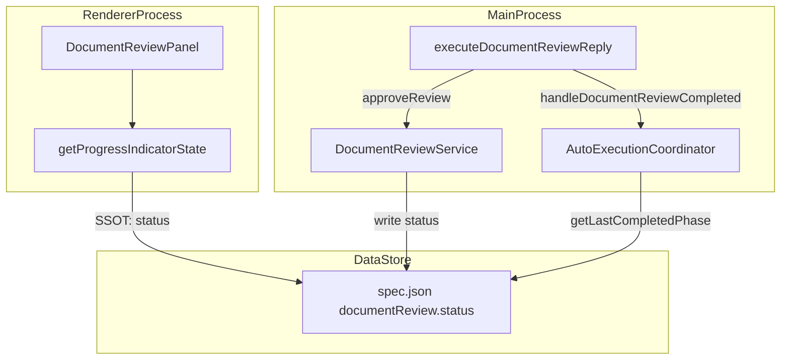
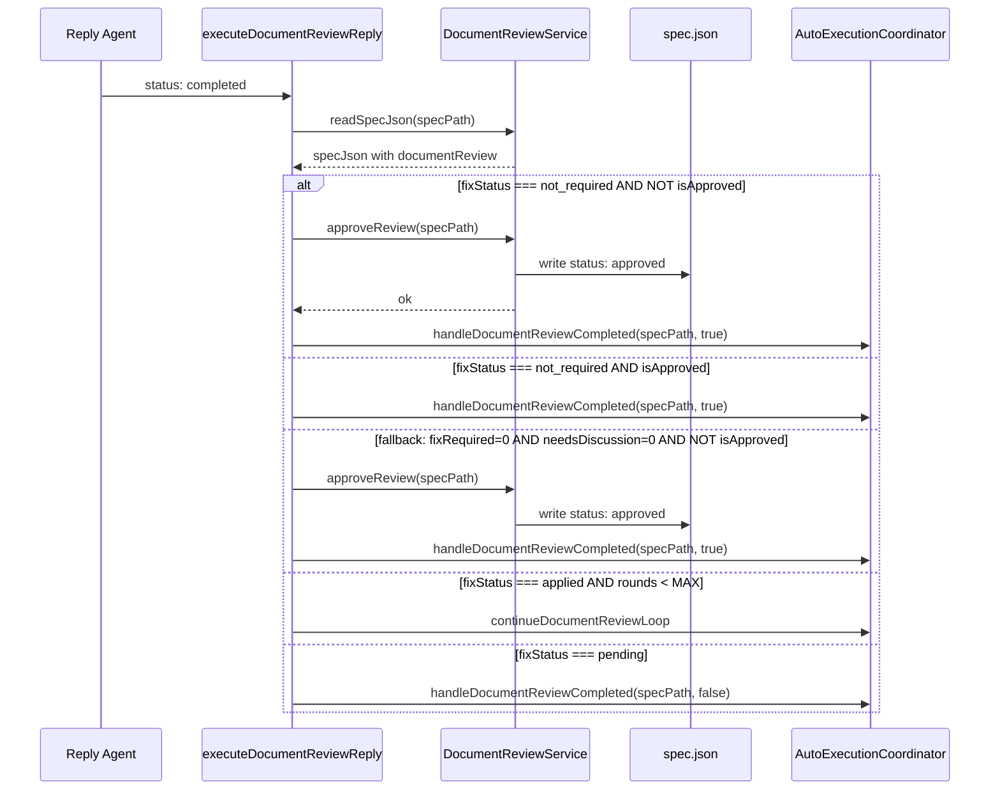
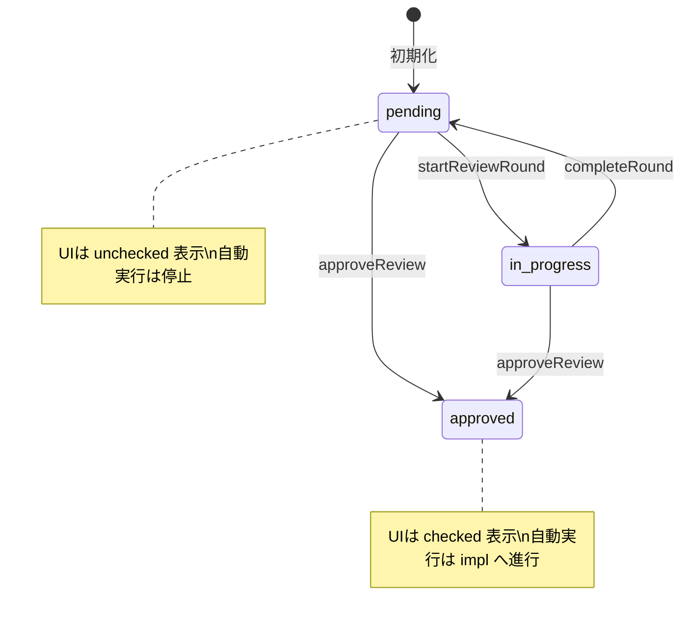

# Design: DocumentReview完了判定のSSOT統一

## Overview

**Purpose**: DocumentReviewの完了判定基準を `documentReview.status === 'approved'` に統一し、UIの進捗インジケーターと自動実行のGO/NOGO判定の矛盾を解消する。

**Users**: 開発者はUIの緑チェック表示を信頼してワークフローを進められるようになる。自動実行システムは、document-review完了状態を次回起動時にも正しく認識できるようになる。

**Impact**: `DocumentReviewPanel`の`getProgressIndicatorState`関数の判定ロジック変更、`executeDocumentReviewReply`関数での`approveReview`呼び出し追加、既存テストの期待値修正、E2Eテストフィクスチャの多ラウンド化。

### Goals

- `documentReview.status === 'approved'` をSSOTとしてUI・自動実行で統一
- 自動実行フローで `not_required` 判定時に `status: 'approved'` を永続化
- UIテスト・E2Eテストで新しいSSOTルールを正しく検証

### Non-Goals

- DocumentReview UIの中間状態アイコン追加
- `documentReview.status` の自動遷移ロジック変更
- InspectionPanelの完了判定変更
- `DocumentReviewService.approveReview()` メソッド自体の変更

## Architecture

### Existing Architecture Analysis

- **完了判定の二重基準**: UI (`roundDetails.length >= 1`) vs 自動実行 (`status === 'approved'`) で判定が異なり、多ラウンド実施済み・未承認のspecでUI緑チェックが表示されるが自動実行でimplに進めない矛盾が存在
- **既存ドメイン境界**: `DocumentReviewPanel`(Shared UI) -> props駆動、`executeDocumentReviewReply`(Main Process handler) -> AutoExecutionCoordinator連携、`DocumentReviewService`(Main Service) -> spec.json永続化
- **変更対象は2つの関数のみ**: `getProgressIndicatorState`（UI側判定ロジック）と`executeDocumentReviewReply`（Main側永続化ロジック）

### Architecture Pattern & Boundary Map



**Key Decisions**:
- `documentReview.status` フィールドがUIと自動実行の両方でSSOTとして機能する
- `getProgressIndicatorState` は `roundDetails.length` ではなく `status` で判定する
- `approveReview` 呼び出しは `handleDocumentReviewCompleted` の**前**に実行する

## System Flows

### 自動実行フローでのapproved永続化



**Key Decisions**:
- `approveReview` は `handleDocumentReviewCompleted` の前に呼ぶ。`getLastCompletedPhase` が次回起動時にdocument-review完了を認識するために永続化が必要
- `approveReview` 失敗時は `handleDocumentReviewCompleted` の呼び出しを継続する（エラーログのみ出力）。自動実行の進行を妨げない設計
- `isApproved` ガードにより重複呼び出しを防止。既にapprovedなら `approveReview` をスキップ

## Requirements Traceability

| Criterion ID | Summary | Components | Implementation Approach |
|--------------|---------|------------|------------------------|
| 1.1 | `status: 'approved'` で `checked` 表示 | `getProgressIndicatorState` | 既存関数の判定ロジック修正 |
| 1.2 | `status: 'in_progress'` or `isExecuting` で `executing` 表示 | `getProgressIndicatorState` | 既存ロジック維持（変更なし） |
| 1.3 | `status: 'pending'` + `roundDetails` ありで `unchecked` 表示 | `getProgressIndicatorState` | `roundDetails.length` 判定を削除し `status` ベースに変更 |
| 1.4 | `status: null/undefined` で `unchecked` 表示 | `getProgressIndicatorState` | 既存のデフォルト分岐で対応（変更なし） |
| 2.1 | `not_required` 判定時に `approveReview` 呼び出し | `executeDocumentReviewReply` | `approveReview` 呼び出しを `handleDocumentReviewCompleted` 前に追加 |
| 2.2 | フォールバックでも `approveReview` 呼び出し | `executeDocumentReviewReply` | フォールバック分岐にも同様の `approveReview` 呼び出しを追加 |
| 2.3 | `isApproved` ガードで重複呼び出し防止 | `executeDocumentReviewReply` | 既存の `isApproved` チェックを条件分岐に活用 |
| 2.4 | ループ継続時は `approveReview` を呼ばない | `executeDocumentReviewReply` | `fixStatus === 'applied'` の分岐では呼ばない（既存フロー維持） |
| 2.5 | `fixStatus === 'pending'` 時は呼ばない | `executeDocumentReviewReply` | `pending` 分岐では呼ばない（既存フロー維持） |
| 2.6 | `approveReview` 失敗時もフロー継続 | `executeDocumentReviewReply` | try-catchでエラーログのみ出力 |
| 3.1 | `approved` + `roundDetails` ありで `checked` テスト | `DocumentReviewPanel.test.tsx` | 新規テストケース追加 |
| 3.2 | `pending` + `roundDetails` ありで `unchecked` テスト | `DocumentReviewPanel.test.tsx` | 既存テストの期待値修正 |
| 3.3 | `pending` + `roundDetails` なしで `unchecked` テスト | `DocumentReviewPanel.test.tsx` | 既存テストで対応済み（確認） |
| 3.4 | `in_progress` で `executing` テスト | `DocumentReviewPanel.test.tsx` | 既存テストで対応済み（確認） |
| 3.5 | 既存の `pending` で `checked` 期待テスト修正 | `DocumentReviewPanel.test.tsx`, `renderer/components/DocumentReviewPanel.test.tsx` | 期待値を `unchecked` に修正 |
| 4.1 | 多ラウンド `roundDetails` のフィクスチャ | `auto-execution-impl-phase.e2e.spec.ts` | `ALL_PHASES_COMPLETED_SPEC_JSON` のフィクスチャ更新 |
| 4.2 | 最終 `status: 'approved'` の検証 | `auto-execution-impl-phase.e2e.spec.ts` | フィクスチャに `roundDetails` 配列を追加 |
| 4.3 | 多ラウンド状態でimplフェーズ開始検証 | `auto-execution-impl-phase.e2e.spec.ts` | 既存テストシナリオで確認 |
| 4.4 | `SDD_PROJECT_PATH` 環境変数方式 | `auto-execution-impl-phase.e2e.spec.ts` | 既存パターン維持（変更なし） |

### Coverage Validation Checklist

- [x] Every criterion ID from requirements.md appears in the table above
- [x] Each criterion has specific component names (not generic references)
- [x] Implementation approach distinguishes "reuse existing" vs "new implementation"
- [x] User-facing criteria specify concrete UI components (not just "shared components")

## Components and Interfaces

| Component | Domain/Layer | Intent | Req Coverage | Key Dependencies | Contracts |
|-----------|--------------|--------|--------------|-----------------|-----------|
| `getProgressIndicatorState` | Shared UI / Helper | 進捗インジケーターの状態判定 | 1.1, 1.2, 1.3, 1.4 | `DocumentReviewState` (P0) | Service |
| `executeDocumentReviewReply` | Main Process / Handler | Document Review Reply完了後の永続化 | 2.1, 2.2, 2.3, 2.4, 2.5, 2.6 | `DocumentReviewService` (P0), `AutoExecutionCoordinator` (P0) | Service |
| `DocumentReviewPanel.test.tsx` (shared) | Test | UI進捗インジケーターのテスト | 3.1, 3.2, 3.3, 3.4, 3.5 | `DocumentReviewPanel` (P0) | -- |
| `DocumentReviewPanel.test.tsx` (renderer) | Test | UI進捗インジケーターのテスト | 3.5 | `DocumentReviewPanel` (P0) | -- |
| `ALL_PHASES_COMPLETED_SPEC_JSON` | E2E / Fixture | 多ラウンドdocumentReviewフィクスチャ | 4.1, 4.2, 4.3, 4.4 | -- | -- |

### Shared UI / Helper

#### getProgressIndicatorState

| Field | Detail |
|-------|--------|
| Intent | `documentReview.status` ベースで進捗インジケーターの状態を判定する |
| Requirements | 1.1, 1.2, 1.3, 1.4 |

**Responsibilities & Constraints**
- `status === 'approved'` の場合のみ `checked` を返す（現在の `roundDetails.length >= 1` 判定を置換）
- `status === 'in_progress'` または `isExecuting === true` の場合は `executing` を返す（変更なし）
- それ以外（`pending`, null, undefined）はすべて `unchecked` を返す

**Contracts**: Service [x]

##### Service Interface

```typescript
type ProgressIndicatorState = 'checked' | 'unchecked' | 'executing';

function getProgressIndicatorState(
  reviewState: DocumentReviewState | null,
  isExecuting: boolean,
  _autoExecutionFlag: DocumentReviewAutoExecutionFlag
): ProgressIndicatorState;
```

- Preconditions: なし（null安全）
- Postconditions: `reviewState?.status === 'approved'` の場合のみ `'checked'` を返す。`isExecuting === true` または `reviewState?.status === 'in_progress'` の場合は `'executing'` を返す。それ以外は `'unchecked'` を返す
- Invariants: `executing` の優先度が最も高い。`checked` は `approved` と同値

### Main Process / Handler

#### executeDocumentReviewReply

| Field | Detail |
|-------|--------|
| Intent | Document Review Reply Agent完了後に `approved` 状態をspec.jsonに永続化し、次フェーズへの遷移を制御する |
| Requirements | 2.1, 2.2, 2.3, 2.4, 2.5, 2.6 |

**Responsibilities & Constraints**
- `fixStatus === 'not_required'` かつ `!isApproved` の場合、`docReviewService.approveReview(specPath)` を呼び出してから `handleDocumentReviewCompleted(specPath, true)` を呼ぶ
- フォールバックロジック（`fixRequired === 0 && needsDiscussion === 0`）でも同様に `approveReview` を呼ぶ
- `approveReview` の失敗はログ出力のみで `handleDocumentReviewCompleted` の呼び出しを妨げない
- `fixStatus === 'applied'`（ループ継続）および `fixStatus === 'pending'` の場合は `approveReview` を呼ばない

**Dependencies**
- Inbound: Reply Agent completion callback (P0)
- Outbound: `DocumentReviewService.approveReview` (P0), `AutoExecutionCoordinator.handleDocumentReviewCompleted` (P0)

**Contracts**: Service [x]

##### Service Interface

```typescript
// 変更箇所のみ記載（既存関数シグネチャは変更なし）
async function executeDocumentReviewReply(
  service: SpecManagerService,
  specPath: string,
  specId: string,
  coordinator: AutoExecutionCoordinator
): Promise<void>;
```

- Preconditions: `specPath` が有効なspecディレクトリを指すこと
- Postconditions: `fixStatus === 'not_required'` またはフォールバック完了判定時、`documentReview.status` が `'approved'` に更新されている（`approveReview` が成功した場合）
- Invariants: `approveReview` の失敗は自動実行フローを中断しない

## Data Models

### Domain Model

DocumentReview完了状態の判定フロー:



**Key Decisions**:
- `approved` 状態のみが「完了」を意味する。`pending` + `roundDetails` ありは「レビュー実施済みだが未承認」
- 状態遷移は `DocumentReviewService` のメソッドを通じてのみ行われる（SSOT）

## Error Handling

### Error Strategy

| Error | Recovery | Impact |
|-------|----------|--------|
| `approveReview` 呼び出し失敗 | ログ出力のみ、`handleDocumentReviewCompleted` は継続 | 次回自動実行開始時に `getLastCompletedPhase` がdocument-reviewを完了と認識しない可能性あり。ユーザーが手動で再実行すれば解消 |
| spec.json読み取り失敗 | 既存の `handleDocumentReviewCompleted(specPath, false)` で処理 | 自動実行一時停止 |

## Testing Strategy

### Unit Tests

1. **`getProgressIndicatorState` ロジック変更テスト** (`DocumentReviewPanel.test.tsx` shared)
   - `status: 'approved'` + `roundDetails` ありで `checked`
   - `status: 'pending'` + `roundDetails` ありで `unchecked`（**期待値修正**）
   - `status: 'pending'` + `roundDetails` なしで `unchecked`
   - `status: 'in_progress'` で `executing`

2. **`DocumentReviewPanel.test.tsx` (renderer)** の既存テスト修正
   - `status: 'pending'` + `roundDetails` ありで `checked` を期待するテストを `unchecked` に修正

### Integration Tests

このfeatureではIPC/イベント/ストア同期の新規クロスバウンダリ通信は追加されないため、統合テストの新規追加は不要。`executeDocumentReviewReply` の変更はMain Process内の関数呼び出し順序の変更であり、既存のAutoExecutionCoordinator単体テストで十分にカバーされる。

### E2E Tests

1. **`auto-execution-impl-phase.e2e.spec.ts`** のフィクスチャ更新
   - `ALL_PHASES_COMPLETED_SPEC_JSON` に多ラウンド（3ラウンド以上）の `roundDetails` を追加
   - 最終ラウンド以外は `fixStatus: 'applied'`、最終ラウンドは `fixStatus: 'not_required'`
   - `documentReview.status: 'approved'` を維持

## Verification Contract

### User Journey Definition

| Journey ID | Operation Flow | Expected Result | E2E Required |
|------------|---------------|-----------------|--------------|
| UJ-001 | 多ラウンドdocumentReview（approved）状態で自動実行ボタンを押し、implフェーズが開始される | implフェーズのAgent起動を確認 | Yes |
| UJ-002 | documentReview status: pending + roundDetailsありの状態でUIを確認 | 進捗インジケーターが灰色丸（unchecked）で表示される | No |
| UJ-003 | documentReview status: approved + roundDetailsありの状態でUIを確認 | 進捗インジケーターが緑チェック（checked）で表示される | No |

### Impact Analysis Contract

| Target File | Action | Reason |
|-------------|--------|--------|
| `src/shared/components/review/DocumentReviewPanel.tsx` | UPDATE | `getProgressIndicatorState` の判定ロジックを `status === 'approved'` ベースに変更 |
| `src/main/trpc/helpers/projectSetup.ts` | UPDATE | `executeDocumentReviewReply` に `approveReview` 呼び出しを追加 |
| `src/shared/components/review/DocumentReviewPanel.test.tsx` | UPDATE | 新しいSSOTルールに合わせてテストケース追加・修正 |
| `src/renderer/components/DocumentReviewPanel.test.tsx` | UPDATE | `pending` + `roundDetails` ありの期待値を `unchecked` に修正 |
| `electron-sdd-manager/e2e-wdio/auto-execution-impl-phase.e2e.spec.ts` | UPDATE | `ALL_PHASES_COMPLETED_SPEC_JSON` に多ラウンド `roundDetails` を追加 |
| `src/remote-ui/` (Remote UI全般) | NO CHANGE | `getProgressIndicatorState` は `src/shared/` 配下のため、ロジック変更はRemote UIにも自動反映。Remote UI固有のコード変更は不要 |

## Design Decisions

### DD-001: `documentReview.status` をSSOTとして選定

| Field | Detail |
|-------|--------|
| Status | Accepted |
| Context | UIは `roundDetails.length >= 1` で完了判定、AutoExecutionCoordinatorは `documentReview.status === 'approved'` で判定しており、矛盾が発生していた。Requirements 1.1-1.4 |
| Decision | `documentReview.status === 'approved'` をSSOTとしてUI・自動実行の両方で統一する |
| Rationale | `status` フィールドは `DocumentReviewService` で明示的に管理されており、`approveReview()` メソッドで厳密に制御される。`roundDetails.length` は「レビュー実施回数」であり「承認」とは異なる概念 |
| Alternatives Considered | (1) `roundDetails.length >= 1` で統一: 自動実行側の安全性が低下する。レビュー実施しただけで未承認の状態でimplに進んでしまう (2) 中間状態の導入: KISS原則に反し、ユーザー混乱の原因になりうる |
| Consequences | `pending` + `roundDetails` ありの状態がUIで `unchecked` に変わる（以前は `checked`）。ユーザーにとってはUI表示と実際の進行可否が一致するようになり、混乱が解消される |

### DD-002: approveReview呼び出しタイミング

| Field | Detail |
|-------|--------|
| Status | Accepted |
| Context | `executeDocumentReviewReply` で `fixStatus === 'not_required'` と判定された場合、`handleDocumentReviewCompleted(specPath, true)` で次フェーズに進むが、`status: 'approved'` が永続化されていなかった。Requirements 2.1-2.6 |
| Decision | `handleDocumentReviewCompleted` の**前**に `approveReview` を呼び出し、`status: 'approved'` を永続化する |
| Rationale | `getLastCompletedPhase` が次回自動実行開始時にspec.jsonの `documentReview.status` を読み取るため、`handleDocumentReviewCompleted` より先に永続化が必要。失敗時はログ出力のみでフロー継続を保証 |
| Alternatives Considered | (1) `handleDocumentReviewCompleted` の**後**に呼ぶ: タイミング的に問題なし（次回起動時に効果）だが、「完了判定の前に状態を確定させる」という原則に反する (2) `AutoExecutionCoordinator` 内で呼ぶ: Coordinatorの責務（フェーズ遷移制御）を超える |
| Consequences | `approveReview` 失敗時にspec.jsonが `pending` のままになるリスクがあるが、次回手動レビューで解消可能。エラーログで検知可能 |

### DD-003: UIでの2値表示（checked/unchecked）

| Field | Detail |
|-------|--------|
| Status | Accepted |
| Context | 多ラウンド実施済みだが未承認の状態を中間アイコン（オレンジ色チェック等）で表示するか検討。Requirements 1.3 |
| Decision | `approved = checked`（緑チェック）、それ以外 = `unchecked`（灰色丸）の2値表示を維持 |
| Rationale | KISS原則に従い、シンプルな2値表示で充分。中間状態アイコンはユーザー混乱の原因になりうる。自動実行のGO/NOGO判定と完全に一致するため、UIの信頼性が向上する |
| Alternatives Considered | 3値表示（未開始/実施済み未承認/承認済み）: 視覚的情報は増えるが、自動実行の進行可否との対応が不明確になる |
| Consequences | `pending` + `roundDetails` ありの状態が灰色丸になるため、レビュー実施済みであることがUIから直接は分からない。ただしラウンド数の表示で実施状況は確認可能 |

## Integration & Deprecation Strategy

### 既存ファイルの変更（Wiring Points）

| File | Change Type | Description |
|------|------------|-------------|
| `src/shared/components/review/DocumentReviewPanel.tsx` | ロジック修正 | `getProgressIndicatorState` の Priority 2 判定を `status === 'approved'` に変更 |
| `src/main/trpc/helpers/projectSetup.ts` | ロジック追加 | `executeDocumentReviewReply` の `not_required` 分岐とフォールバック分岐に `approveReview` 呼び出しを追加 |
| `src/shared/components/review/DocumentReviewPanel.test.tsx` | テスト修正 | 新SSOTルールに合わせたテストケース追加・期待値修正 |
| `src/renderer/components/DocumentReviewPanel.test.tsx` | テスト修正 | `pending` + `roundDetails` ありの期待値を `checked` -> `unchecked` に修正 |
| `electron-sdd-manager/e2e-wdio/auto-execution-impl-phase.e2e.spec.ts` | フィクスチャ更新 | `ALL_PHASES_COMPLETED_SPEC_JSON` を多ラウンド対応に変更 |

### 削除対象ファイル

なし

## Interface Changes & Impact Analysis

### getProgressIndicatorState の動作変更

**変更内容**: Priority 2 の判定条件を `roundDetails.length >= 1` から `status === 'approved'` に変更

**既存呼び出し箇所**:

| Caller | File | Impact |
|--------|------|--------|
| `DocumentReviewPanel` (render) | `src/shared/components/review/DocumentReviewPanel.tsx` | 呼び出し元のコード変更は不要。関数内部のロジック変更のみ |

**動作への影響**: `status: 'pending'` + `roundDetails` ありのケースで返り値が `'checked'` -> `'unchecked'` に変更。`status: 'approved'` のケースは既にUIでchecked表示されるため変化なし。

### executeDocumentReviewReply の動作変更

**変更内容**: `not_required` 判定時とフォールバック完了判定時に `docReviewService.approveReview(specPath)` 呼び出しを追加

**既存呼び出し箇所**:

| Caller | File | Impact |
|--------|------|--------|
| `handleReviewStatusChange` callback | `src/main/trpc/helpers/projectSetup.ts` (L484) | 呼び出し元のコード変更は不要。関数内部のロジック追加のみ |

**動作への影響**: `not_required` 判定時に `spec.json` への書き込みが1回追加される。パフォーマンスへの影響は無視できるレベル（ファイル書き込み1回）。
