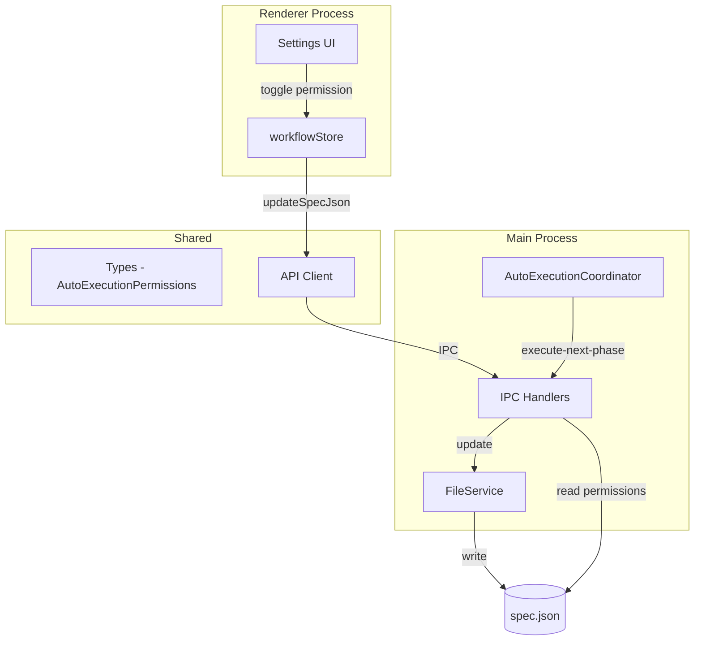
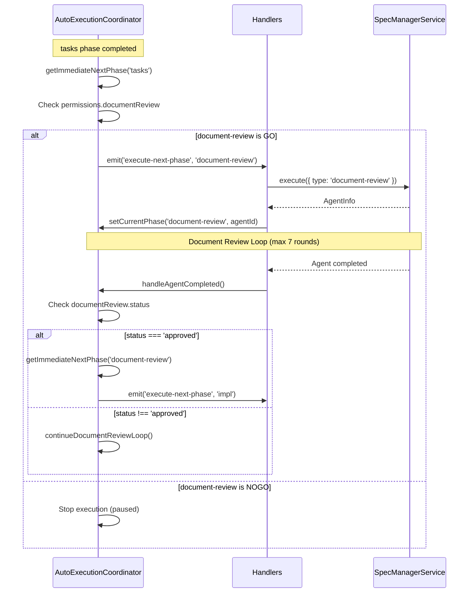
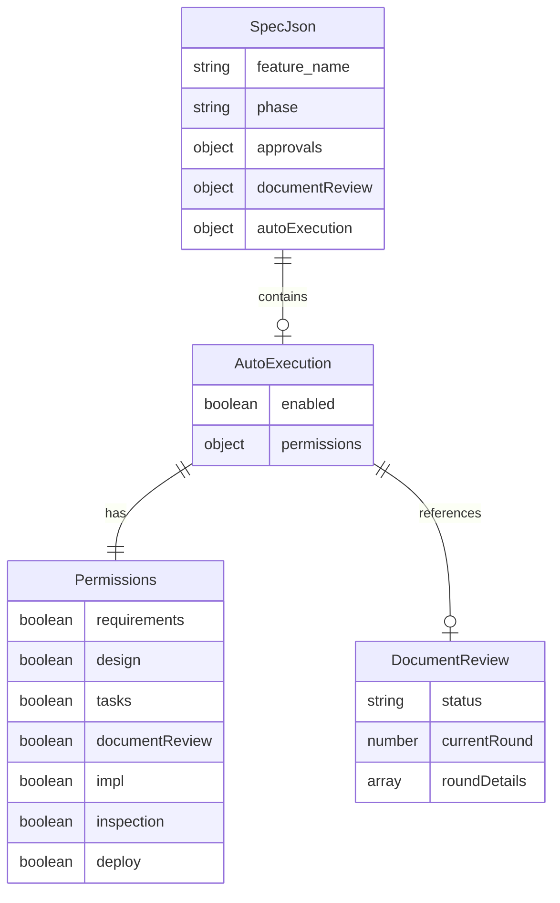

# Design: Document Review Phase Promotion

## Overview

**Purpose**: この機能は Document Review を「特殊なサブプロセス」から「正式なワークフローフェーズ」へ昇格させる。これにより、一貫性のあるフェーズ制御と設定UIを実現する。

**Users**: SDDワークフローを使用する開発者が、Document Reviewフェーズの自動実行をpermissionsで統一的に制御できるようになる。

**Impact**: 現在の `documentReviewFlag` を廃止し、他のフェーズと同様に `permissions.documentReview` で制御する。`execute-document-review` イベントを廃止し、`execute-next-phase` で統一的に実行する。

### Goals

- Document Review を `PHASE_ORDER` に追加し、正式なフェーズとして認識させる
- `documentReviewFlag` を廃止し、`permissions.documentReview` に統合する
- 専用イベント (`execute-document-review`, `execute-inspection`) を廃止し、汎用イベント (`execute-next-phase`) に統一する
- 既存の `documentReviewFlag` を持つ spec.json との後方互換性を維持する

### Non-Goals

- Remote UI の大幅な変更（shared/stores の変更に追従するのみ）
- `spec.json.approvals` 構造への Document Review 追加
- `/kiro:spec-*` コマンドの変更
- Document Review パネル UI の変更
- `run`/`pause` 等の新しいフラグ実装
- `execute-spec-merge` イベントの統一（本イベントはフェーズ遷移ではなくマージ操作用であり、スコープ外）

## Architecture

### Existing Architecture Analysis

現在のDocument Review処理フロー:
1. `PHASE_ORDER = ['requirements', 'design', 'tasks', 'impl', 'inspection']`
2. `tasks` 完了時に `handleAgentCompleted` で特別なif分岐により `execute-document-review` イベント発火
3. `documentReviewFlag` は `SpecAutoExecutionState.documentReviewFlag: 'run' | 'pause'` として `permissions` とは別に存在
4. Document Review 完了後、`handleDocumentReviewCompleted` で `impl` への遷移を行う

**問題点**:
- `documentReviewFlag` の `run`/`pause` は実質機能していない（常に実行される）
- Document Review だけ `PHASE_ORDER` に含まれず、特殊扱いされている
- 設計ドキュメントと実装の乖離がある

### Architecture Pattern & Boundary Map



**Architecture Integration**:
- Selected pattern: 既存のフェーズ管理パターンを拡張
- Domain boundaries: AutoExecutionCoordinator がフェーズ順序と遷移を管理
- Existing patterns preserved: イベント駆動によるフェーズ実行、permissions によるGO/NOGO制御
- New components: なし（既存コンポーネントの拡張のみ）
- Steering compliance: SSOT（spec.json に状態を集約）、DRY（permissions 構造の再利用）

### Technology Stack

| Layer | Choice / Version | Role in Feature | Notes |
|-------|------------------|-----------------|-------|
| Main Process | TypeScript / Node.js 20+ | フェーズ順序管理、イベントハンドリング | AutoExecutionCoordinator の拡張 |
| Types | TypeScript 5.8+ | 型定義の拡張 | WorkflowPhase, AutoExecutionPermissions |
| State Management | Zustand | Renderer側設定UI | workflowStore の拡張 |

## System Flows

### Phase Transition Flow (After)



### Phase Order Definition (After)

```
requirements -> design -> tasks -> document-review -> impl -> inspection
```

## Requirements Traceability

| Criterion ID | Summary | Components | Implementation Approach |
|--------------|---------|------------|------------------------|
| 1.1 | PHASE_ORDER の順序変更 | AutoExecutionCoordinator | 既存定数の拡張 |
| 1.2 | WorkflowPhase 型に 'document-review' 追加 | renderer/types/workflow.ts, main/services/specManagerService.ts | 既存型の拡張 |
| 1.3 | フェーズ遷移ロジックの更新 | AutoExecutionCoordinator | getImmediateNextPhase の動作確認 |
| 2.1 | AutoExecutionPermissions に documentReview 追加 | renderer/types/index.ts, autoExecutionCoordinator.ts | 既存インタフェースの拡張 |
| 2.2 | documentReviewFlag フィールドの削除 | renderer/types/index.ts, workflowStore.ts, fileService.ts | フィールド削除とマイグレーション |
| 2.3 | permissions.documentReview のデフォルト値 true | DEFAULT_SPEC_AUTO_EXECUTION_STATE | 既存デフォルト値の拡張 |
| 2.4 | NOGO 時の停止動作 | AutoExecutionCoordinator.getImmediateNextPhase | 既存ロジックの再利用 |
| 2.5 | spec.json から documentReviewFlag 削除 | FileService, マイグレーション | マイグレーション処理の追加 |
| 3.1 | execute-document-review イベント廃止 | handlers.ts, autoExecutionCoordinator.ts | イベントハンドラの削除 |
| 3.2 | execute-next-phase で Document Review 実行 | handlers.ts | 既存パターンへの統合 |
| 3.3 | Document Review 固有処理の統合 | handlers.ts | execute-next-phase 内での分岐処理 |
| 3.4 | ループ処理の動作維持 | handlers.ts, AutoExecutionCoordinator | 既存ロジックの移動 |
| 4.1 | documentReview.status === 'approved' で完了判定 | AutoExecutionCoordinator | 既存ロジックの再利用 |
| 4.2 | impl への遷移 | AutoExecutionCoordinator.handleAgentCompleted | 統一フロー内での遷移 |
| 4.3 | 最大7ラウンドで paused 状態 | AutoExecutionCoordinator | 既存ロジックの維持 |
| 5.1 | execute-inspection イベント廃止 | handlers.ts, autoExecutionCoordinator.ts | イベントハンドラの削除 |
| 5.2 | execute-next-phase で inspection 実行 | handlers.ts | 既存パターンへの統合 |
| 5.3 | autofix 等の固有処理の維持 | handlers.ts | execute-next-phase 内での分岐処理 |
| 6.1 | documentReviewFlag トグル UI 削除 | Renderer components | UI コンポーネントの更新 |
| 6.2 | permissions.documentReview トグル追加 | Renderer components | 既存 permissions UI への追加 |
| 6.3 | フェーズ一覧への Document Review 追加 | Renderer components | フェーズ表示ロジックの更新 |
| 7.1 | 既存 documentReviewFlag の読み込み | FileService | マイグレーション処理 |
| 7.2 | 'run' -> permissions.documentReview: true | FileService | マイグレーション処理 |
| 7.3 | 'pause' -> permissions.documentReview: true | FileService | マイグレーション処理（pause は機能していなかったため） |

### Coverage Validation Checklist

- [x] Every criterion ID from requirements.md appears in the table above
- [x] Each criterion has specific component names (not generic references)
- [x] Implementation approach distinguishes "reuse existing" vs "new implementation"
- [x] User-facing criteria specify concrete UI components

## Components and Interfaces

### Component Summary

| Component | Domain/Layer | Intent | Req Coverage | Key Dependencies | Contracts |
|-----------|--------------|--------|--------------|-----------------|-----------|
| AutoExecutionCoordinator | Main/Services | フェーズ順序管理と遷移制御 | 1.1-1.3, 2.4, 3.1-3.4, 4.1-4.3, 5.1-5.3 | - | Event |
| WorkflowPhase | Shared/Types | ワークフローフェーズ型定義 | 1.2 | - | - |
| AutoExecutionPermissions | Shared/Types | 自動実行許可設定 | 2.1, 2.3 | - | - |
| SpecAutoExecutionState | Shared/Types | Spec単位の自動実行状態 | 2.2, 2.5 | AutoExecutionPermissions | State |
| FileService | Main/Services | spec.json の読み書きとマイグレーション | 2.2, 2.5, 7.1-7.3 | - | Service |
| handlers.ts | Main/IPC | イベントハンドリングの統一 | 3.2, 3.3, 5.2, 5.3 | AutoExecutionCoordinator, SpecManagerService | Event |
| workflowStore | Renderer/Stores | UI設定状態管理 | 6.1, 6.2 | - | State |
| SettingsUI | Renderer/Components | 許可設定UI | 6.1-6.3 | workflowStore | - |

### Main Process Layer

#### AutoExecutionCoordinator

| Field | Detail |
|-------|--------|
| Intent | フェーズ順序の管理、遷移ロジック、イベント発火を担当 |
| Requirements | 1.1, 1.2, 1.3, 2.4, 3.1, 3.4, 4.1, 4.2, 4.3, 5.1 |

**Responsibilities & Constraints**
- `PHASE_ORDER` 定数にて `'document-review'` を `'tasks'` と `'impl'` の間に追加
- `getImmediateNextPhase` は既存のNOGOスキップなし動作をそのまま適用
- `handleAgentCompleted` から Document Review 特殊分岐を削除し、統一フローに移行
- `execute-document-review` イベント定義を削除
- `execute-inspection` イベント定義を削除

**Dependencies**
- Inbound: handlers.ts - フェーズ完了通知 (P0)
- Outbound: EventEmitter - execute-next-phase イベント発火 (P0)

**Contracts**: Event [x]

##### Event Contract

**Published events (変更後)**:
```typescript
'execute-next-phase': (specPath: string, phase: WorkflowPhase, context: { specId: string; featureName: string }) => void;
// execute-document-review イベント削除
// execute-inspection イベント削除
'execute-spec-merge': (specPath: string, context: { specId: string }) => void;
```

**Subscribed events**: なし

##### State Changes

```typescript
// PHASE_ORDER 変更
export const PHASE_ORDER: readonly WorkflowPhase[] = [
  'requirements',
  'design',
  'tasks',
  'document-review',  // NEW
  'impl',
  'inspection'
];
```

**Implementation Notes**
- Integration: `handleAgentCompleted` の `tasks` 完了時分岐を削除し、通常のフェーズ遷移に任せる
- Validation: Document Review フェーズの完了判定は `spec.json.documentReview.status === 'approved'` を使用
- Risks: 既存の Document Review ループロジックを維持しつつ、イベント駆動を統一する必要がある

#### FileService (拡張)

| Field | Detail |
|-------|--------|
| Intent | spec.json の読み書きとマイグレーション処理 |
| Requirements | 2.2, 2.5, 7.1, 7.2, 7.3 |

**Responsibilities & Constraints**
- `readSpecJson` 時に `documentReviewFlag` を検出した場合、`permissions.documentReview` へ自動マイグレーション
- マイグレーション時、`documentReviewFlag: 'run'` も `'pause'` も `permissions.documentReview: true` に変換（pause は機能していなかったため）
- マイグレーション後、`documentReviewFlag` フィールドは削除

**Dependencies**
- Inbound: handlers.ts, specHandlers.ts - spec.json 操作リクエスト (P0)

**Contracts**: Service [x]

##### Service Interface

```typescript
interface FileService {
  // 既存メソッド（変更なし）
  readSpecJson(specPath: string): Promise<Result<SpecJson, FileError>>;
  updateSpecJson(specName: string, updates: Partial<SpecJson>): Promise<Result<SpecJson, FileError>>;

  // マイグレーション処理は readSpecJson 内で透過的に実行
}
```

**Migration Logic**:
```typescript
// readSpecJson 内でのマイグレーション処理
if (specJson.autoExecution?.documentReviewFlag !== undefined) {
  // 'run' も 'pause' も true に変換（pause は機能していなかった）
  if (specJson.autoExecution.permissions) {
    specJson.autoExecution.permissions.documentReview = true;
  }
  delete specJson.autoExecution.documentReviewFlag;
  // 自動保存は行わない（次回の updateSpecJson 時に反映）
}
```

**Implementation Notes**
- Integration: マイグレーションは読み込み時に透過的に実行し、メモリ上の値を変換
- Validation: 既存の `documentReviewFlag` 値の形式チェック
- Risks: マイグレーション中のspec.json破損を防ぐため、書き込みは明示的な update 時のみ

#### handlers.ts (拡張)

| Field | Detail |
|-------|--------|
| Intent | execute-next-phase イベントハンドラで全フェーズを統一的に処理 |
| Requirements | 3.2, 3.3, 3.4, 5.2, 5.3 |

**Responsibilities & Constraints**
- `execute-next-phase` ハンドラ内で `document-review` と `inspection` の固有処理を実装
- `execute-document-review` イベントリスナーを削除
- `execute-inspection` イベントリスナーを削除
- Document Review ループ処理を `execute-next-phase` 内に移動

**Dependencies**
- Inbound: AutoExecutionCoordinator - execute-next-phase イベント (P0)
- Outbound: SpecManagerService - execute() 呼び出し (P0)

**Contracts**: Event [x]

##### Event Handler Changes

```typescript
// registerAutoExecutionEvents 内

// execute-next-phase ハンドラの拡張
coordinator.on('execute-next-phase', async (specPath, phase, context) => {
  // ... 既存の処理 ...

  if (phase === 'document-review') {
    // Document Review 固有処理（既存の execute-document-review ロジックを移動）
    const reviewResult = await service.execute({
      type: 'document-review',
      specId: context.specId,
      featureName: context.specId,
      commandPrefix: 'kiro',
      scheme,
    });
    // ... ループ処理 ...
    return;
  }

  if (phase === 'inspection') {
    // Inspection 固有処理（既存の execute-inspection ロジックを移動）
    const result = await service.execute({
      type: 'inspection',
      specId: context.specId,
      featureName: context.specId,
      commandPrefix: 'kiro',
      autofix: true,
    });
    // ... 完了ハンドリング ...
    return;
  }

  // ... 他のフェーズの処理 ...
});

// 削除: coordinator.on('execute-document-review', ...)
// 削除: coordinator.on('execute-inspection', ...)
```

**Implementation Notes**
- Integration: 既存のイベントハンドラロジックをそのまま移動
- Validation: フェーズ名の検証は `PHASE_ORDER` との照合で行う
- Risks: イベントハンドラの削除により、既存のテストコードが失敗する可能性

### Shared Types Layer

#### WorkflowPhase (拡張)

| Field | Detail |
|-------|--------|
| Intent | ワークフローフェーズの型定義 |
| Requirements | 1.2 |

```typescript
// renderer/types/workflow.ts
export type WorkflowPhase =
  | 'requirements'
  | 'design'
  | 'tasks'
  | 'document-review'  // NEW
  | 'impl'
  | 'inspection';

// main/services/specManagerService.ts でも同様の定義を更新
```

#### AutoExecutionPermissions (拡張)

| Field | Detail |
|-------|--------|
| Intent | フェーズ別自動実行許可設定 |
| Requirements | 2.1, 2.3 |

```typescript
// renderer/types/index.ts
export interface AutoExecutionPermissions {
  requirements: boolean;
  design: boolean;
  tasks: boolean;
  documentReview: boolean;  // NEW
  impl: boolean;
  inspection: boolean;
  deploy: boolean;
}
```

#### SpecAutoExecutionState (変更)

| Field | Detail |
|-------|--------|
| Intent | Spec単位の自動実行状態 |
| Requirements | 2.2 |

```typescript
// renderer/types/index.ts
export interface SpecAutoExecutionState {
  enabled: boolean;
  permissions: AutoExecutionPermissions;
  // documentReviewFlag: DocumentReviewFlag;  // REMOVED
}

export const DEFAULT_SPEC_AUTO_EXECUTION_STATE: SpecAutoExecutionState = {
  enabled: false,
  permissions: {
    requirements: true,
    design: true,
    tasks: true,
    documentReview: true,  // NEW (default: GO)
    impl: true,
    inspection: true,
    deploy: true,
  },
  // documentReviewFlag: 'pause',  // REMOVED
};
```

#### DocumentReviewFlag (廃止)

```typescript
// renderer/types/index.ts
// export type DocumentReviewFlag = 'run' | 'pause';  // REMOVED (deprecated)
```

### Renderer Layer

#### workflowStore (変更)

| Field | Detail |
|-------|--------|
| Intent | Renderer側のUI設定状態管理 |
| Requirements | 6.1, 6.2 |

**State Changes**:
```typescript
// documentReviewOptions の削除
interface WorkflowStore {
  // ...既存フィールド...

  // 削除
  // documentReviewOptions: {
  //   autoExecutionFlag: DocumentReviewFlag;
  // };

  // permissions に documentReview を追加
  autoExecutionPermissions: AutoExecutionPermissions;

  // 削除
  // setDocumentReviewFlag: (flag: DocumentReviewFlag) => void;

  // 既存メソッドはそのまま（togglePhasePermission で documentReview を制御）
}
```

**Implementation Notes**
- Integration: `persistSettingsToSpec` から `documentReviewFlag` 関連コードを削除
- Validation: `documentReview` は他のフェーズと同様に boolean で制御
- Risks: 既存の UI コンポーネントがdocumentReviewFlagを参照している場合の対応

## Data Models

### Domain Model



### Logical Data Model

**spec.json autoExecution 構造 (変更後)**:
```typescript
{
  "autoExecution": {
    "enabled": true,
    "permissions": {
      "requirements": true,
      "design": true,
      "tasks": true,
      "documentReview": true,  // NEW
      "impl": true,
      "inspection": true,
      "deploy": true
    }
    // "documentReviewFlag": "run"  // REMOVED
  }
}
```

**Consistency & Integrity**:
- `permissions.documentReview` は他のフェーズ許可と同一のライフサイクル
- マイグレーション時、`documentReviewFlag` の値に関わらず `true` に変換（pause は機能していなかったため一律 GO）

## Error Handling

### Error Categories and Responses

**Migration Errors (spec.json読み込み時)**:
- Invalid `documentReviewFlag` value → 無視して `permissions.documentReview: true` をデフォルト適用
- Missing `permissions` object → デフォルト値で補完

**Phase Execution Errors**:
- Document Review loop timeout → 既存の `MAX_DOCUMENT_REVIEW_ROUNDS` (7) 超過時に paused 状態
- Agent failure → 既存の `handleAgentCompleted` with `'failed'` status

### Monitoring

- 既存のログ出力パターンを維持
- マイグレーション実行時に info レベルでログ出力

## Testing Strategy

### Unit Tests

1. **AutoExecutionCoordinator**: `PHASE_ORDER` に `'document-review'` が正しい位置に含まれることを確認
2. **getImmediateNextPhase**: `tasks` -> `document-review` -> `impl` の遷移が正しく動作することを確認
3. **FileService migration**: `documentReviewFlag` から `permissions.documentReview` への変換が正しく動作することを確認
4. **DEFAULT_SPEC_AUTO_EXECUTION_STATE**: `documentReview: true` がデフォルト値として設定されていることを確認
5. **WorkflowPhase type**: `'document-review'` が有効な値として受け入れられることを確認

### Integration Tests

1. **Phase transition flow**: `tasks` 完了後に `document-review` が実行され、その後 `impl` に遷移することを確認
2. **NOGO handling**: `permissions.documentReview: false` の場合に実行が停止することを確認
3. **Migration persistence**: マイグレーション後の spec.json に `documentReviewFlag` が含まれないことを確認
4. **Event unification**: `execute-next-phase` で Document Review が正しく実行されることを確認

### E2E Tests

1. **Settings UI**: permissions.documentReview のトグルが正しく動作することを確認
2. **Full workflow**: requirements -> design -> tasks -> document-review -> impl -> inspection の全フェーズが自動実行されることを確認
3. **Backward compatibility**: 既存の `documentReviewFlag` を持つ spec.json がマイグレーション後も正常に動作することを確認

## Design Decisions

### DD-001: PHASE_ORDER への Document Review 追加位置

| Field | Detail |
|-------|--------|
| Status | Accepted |
| Context | Document Review を正式なフェーズとして PHASE_ORDER に追加する必要がある |
| Decision | `tasks` と `impl` の間に `'document-review'` を配置 |
| Rationale | 既存の動作と同じ位置。tasks 完了後、実装前にドキュメント品質を確認する既存フローを維持 |
| Alternatives Considered | (1) impl の後に配置 - 実装前レビューの意味がなくなる (2) design の後に配置 - tasks が未完了の状態でレビューする意味がない |
| Consequences | 既存のフローと互換性があり、移行リスクが低い |

### DD-002: documentReviewFlag の permissions への統合

| Field | Detail |
|-------|--------|
| Status | Accepted |
| Context | `documentReviewFlag` は `'run'` / `'pause'` の2値だが、`pause` は実装されていない |
| Decision | `documentReviewFlag` を廃止し、`permissions.documentReview: boolean` に統合 |
| Rationale | 他のフェーズと同様の GO/NOGO 制御で十分。未実装の `pause` 機能を維持する理由がない |
| Alternatives Considered | (1) `run`/`pause`/`skip` の3値を維持 - 複雑化するだけで実益なし (2) 完全に新しい制御体系を導入 - 既存パターンとの一貫性が失われる |
| Consequences | 設定UIがシンプルになり、他のフェーズと一貫した操作性を提供 |

### DD-003: 専用イベントの汎用イベントへの統一

| Field | Detail |
|-------|--------|
| Status | Accepted |
| Context | `execute-document-review` と `execute-inspection` は専用イベントとして実装されている |
| Decision | 両イベントを廃止し、`execute-next-phase` 内で分岐処理として実装 |
| Rationale | フェーズ化の目的（特殊扱いをやめる）に合致。コードの一貫性が向上 |
| Alternatives Considered | (1) 専用イベントを維持 - 特殊扱いが残り、フェーズ化の意味が薄れる (2) 全フェーズに専用イベントを追加 - 不必要な複雑化 |
| Consequences | イベントハンドラのコード量は増えるが、フェーズ管理の一貫性が向上 |

### DD-004: マイグレーション時の pause 値の扱い

| Field | Detail |
|-------|--------|
| Status | Accepted |
| Context | 既存の `documentReviewFlag: 'pause'` をどう変換するか |
| Decision | `'run'` も `'pause'` も一律 `permissions.documentReview: true` に変換 |
| Rationale | `pause` は実装されておらず、実質的に `run` と同じ動作だった。ユーザーの意図が「実行しない」だったとしても、機能していなかったため影響なし |
| Alternatives Considered | (1) `pause` を `false` に変換 - 機能していなかった設定を突然有効化するリスク (2) ユーザーに確認を求める - 不必要なUXの悪化 |
| Consequences | 既存ユーザーへの影響を最小化しつつ、クリーンな状態に移行 |

### DD-005: spec.json.approvals への Document Review 非追加

| Field | Detail |
|-------|--------|
| Status | Accepted |
| Context | 他のフェーズは `approvals` 構造で `generated` / `approved` を管理している |
| Decision | Document Review は `approvals` に追加しない。既存の `documentReview.status` で完了判定 |
| Rationale | `approvals` は「生成→承認」フロー用。Document Review は「レビュー→修正ループ→承認」という異なるパターン |
| Alternatives Considered | (1) approvals に追加 - 既存の documentReview.status と重複し、SSOT 違反 (2) approvals を拡張して両方の値を持つ - 複雑化 |
| Consequences | 既存の Document Review ステータス管理ロジックを維持でき、変更範囲を最小化 |

## 結合・廃止戦略

### 既存ファイルの変更（Wiring Points）

| ファイルパス | 変更内容 | 影響度 |
|-------------|---------|--------|
| `electron-sdd-manager/src/main/services/autoExecutionCoordinator.ts` | PHASE_ORDER 拡張、execute-document-review/execute-inspection イベント削除、handleAgentCompleted の tasks 特殊分岐削除 | High |
| `electron-sdd-manager/src/main/ipc/handlers.ts` | execute-next-phase ハンドラに document-review/inspection 処理を統合、execute-document-review/execute-inspection リスナー削除 | High |
| `electron-sdd-manager/src/main/services/specManagerService.ts` | WorkflowPhase 型に 'document-review' 追加 | Medium |
| `electron-sdd-manager/src/main/services/fileService.ts` | readSpecJson にマイグレーションロジック追加 | Medium |
| `electron-sdd-manager/src/renderer/types/index.ts` | AutoExecutionPermissions に documentReview 追加、DocumentReviewFlag 型削除、DEFAULT_SPEC_AUTO_EXECUTION_STATE 更新 | Medium |
| `electron-sdd-manager/src/renderer/types/workflow.ts` | WorkflowPhase 型に 'document-review' 追加 | Low |
| `electron-sdd-manager/src/renderer/stores/workflowStore.ts` | documentReviewOptions 削除、persistSettingsToSpec から documentReviewFlag 関連コード削除 | Medium |
| `electron-sdd-manager/src/shared/api/types.ts` | AutoExecutionOptions から documentReviewFlag 削除 | Low |
| `electron-sdd-manager/src/shared/api/IpcApiClient.ts` | documentReviewFlag 参照の削除 | Low |

### 削除対象ファイル

なし（既存ファイルの修正のみ）

### Remote UI 影響

- `shared/stores` と `shared/types` の変更に追従するのみ
- 専用の変更は不要（既存のpermissions UIパターンを再利用）

**具体的な影響ファイル**:

| ファイルパス | 変更内容 |
|-------------|---------|
| `remote-ui/views/SpecActionsView.tsx` | `documentReviewFlag` 参照を `permissions.documentReview` に変更 |
| `remote-ui/views/MobileSpecWorkflowView.tsx` | `documentReviewFlag` 参照を `permissions.documentReview` に変更 |
| `remote-ui/App.tsx` | `documentReviewFlag` 参照を `permissions.documentReview` に変更 |
| `remote-ui/hooks/useRemoteWorkflowState.ts` | `documentReviewFlag` 参照を `permissions.documentReview` に変更 |

これらのファイルでは `specJson.autoExecution.documentReviewFlag` への参照を削除し、`specJson.autoExecution.permissions.documentReview` を使用するように変更する。ロジックは既存の permissions チェックパターンと同一。
