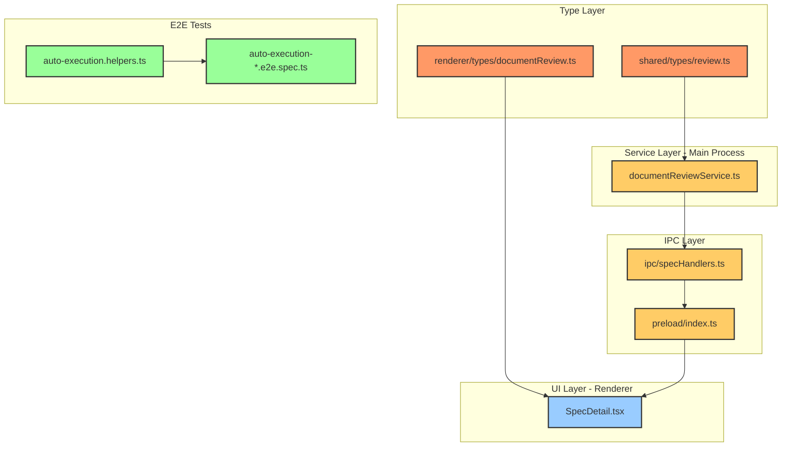
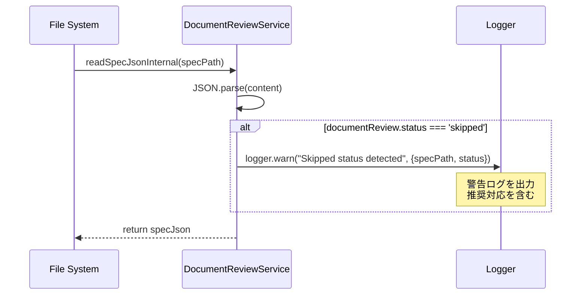

# Design: Document Review Skip機能の完全削除

## Overview

本機能は、Document Reviewワークフローから`'skipped'`ステータスおよび関連する実装コード・テストコードを完全に削除し、Document Reviewを必須プロセスとして徹底する設計変更である。

**Purpose**: Document Reviewのスキップ機能を削除し、品質管理プロセスの必須化を徹底する。

**Users**: SDD Orchestratorの開発者および運用者。既存のspec.jsonに`status = 'skipped'`が含まれる場合は警告ログで検知される。

**Impact**:
- `ReviewStatus`型から`'skipped'`が削除され、有効なステータスが3値（pending/in_progress/approved）に限定される
- `skipReview()`メソッドとIPC APIが削除され、スキップ機能への内部・外部アクセス手段が廃止される
- E2Eテストのskip機能テストが削除され、skip機能を使用していた他のテストは代替手段（`permissions.documentReview = false`）に書き換えられる
- 既存データで`status = 'skipped'`を含むspec.jsonを読み込んだ場合は警告ログを出力（マイグレーションは行わない）

### Goals

- Document Reviewワークフローから`'skipped'`ステータスを完全削除し、型安全性を維持
- `skipReview()`メソッドとIPC APIを削除し、スキップ機能への内部・外部アクセス手段を廃止
- 既存のE2Eテストからskip機能テストを削除し、skip機能を使用していた箇所を代替手段に書き換え
- 既存データで`status = 'skipped'`を検出した場合は警告ログを出力し、異常状態を記録
- TypeScriptコンパイルエラーを発生させず、すべてのテストが成功する状態を維持

### Non-Goals

- `documentReview.status`フィールド自体の削除（他のステータス値は継続使用）
- Remote UIの大幅な変更（shared/stores, shared/componentsの変更に追従するのみ）
- 既存のspec.jsonファイルのマイグレーション（`status = 'skipped'`の書き換えは行わない）
- Document Reviewパネルの機能拡張（Skip以外の新機能追加は対象外）
- `document-review-phase` specで実装された機能の変更

## Architecture

### Existing Architecture Analysis

現在のDocument Review機能は以下の構成で実装されている：

- **型定義**: `src/shared/types/review.ts`, `src/renderer/types/documentReview.ts`で`REVIEW_STATUS.SKIPPED`と`ReviewStatus`型が定義
- **サービス層**: `src/main/services/documentReviewService.ts`で`skipReview()`メソッドが実装
- **IPC層**: `src/preload/index.ts`, `src/main/ipc/specHandlers.ts`で`skipDocumentReview` IPC APIが公開
- **UI層**: `src/renderer/components/SpecDetail.tsx`で`status === 'skipped'`の判定が実装
- **E2Eテスト**: `electron-sdd-manager/e2e-wdio/`配下で約10ファイルがskip機能を使用

本設計では、上記の各層からskip機能を削除し、Document Reviewを必須プロセスとする。

### Architecture Pattern & Boundary Map



**Architecture Integration**:
- **Selected pattern**: レイヤードアーキテクチャ（Type → Service → IPC → UI）の維持
- **Domain/feature boundaries**: Document Review機能内の変更のため、他機能との境界は維持
- **Existing patterns preserved**: Electron IPC設計パターン、Zustand状態管理パターン
- **New components rationale**: 新規コンポーネントなし（既存コードの削除のみ）
- **Steering compliance**: DRY, SSOT, KISS原則に準拠（不要なコードを削除することで保守性向上）

### Technology Stack

| Layer | Choice / Version | Role in Feature | Notes |
|-------|------------------|-----------------|-------|
| Type System | TypeScript 5.8+ | 型定義から`'skipped'`を削除 | strict mode有効 |
| Service Layer | Node.js 20+ (Electron Main) | `skipReview()`メソッドを削除 | - |
| IPC Layer | Electron 35 IPC | `skipDocumentReview` APIを削除 | contextBridge + preload |
| UI Layer | React 19 + Zustand | `status === 'skipped'`判定を削除 | - |
| Testing | Vitest + WebdriverIO | skip機能テストを削除・修正 | - |

## System Flows

### 警告ログ出力フロー

既存データで`status = 'skipped'`を検出した場合の警告ログ出力フローを以下に示す。



**Key Decisions**:
- 既存データのマイグレーションは行わず、警告ログのみ出力（リスク最小化）
- ログレベルは`warn`（異常状態だがエラーではない）
- ログには推奨対応（手動でstatusを修正する等）を含める

## Requirements Traceability

| Criterion ID | Summary | Components | Implementation Approach |
|--------------|---------|------------|------------------------|
| 1.1 | `REVIEW_STATUS`から`SKIPPED`定数を削除 | `shared/types/review.ts`, `renderer/types/documentReview.ts` | 既存型定義を修正 |
| 1.2 | `shared/types/review.ts`の`SKIPPED`削除 | `shared/types/review.ts` | 既存型定義を修正 |
| 1.3 | `ReviewStatus`型から`'skipped'`削除 | `shared/types/review.ts`, `renderer/types/documentReview.ts` | 既存型定義を修正 |
| 1.4 | TypeScriptコンパイルエラーなし | 全TypeScriptファイル | 型定義修正に追従 |
| 2.1 | `skipReview()`メソッドを削除 | `documentReviewService.ts` | メソッド削除 |
| 2.2 | `DocumentReviewService`インターフェースから`skipReview`削除 | `documentReviewService.ts` | インターフェース更新 |
| 2.3 | `skipReview`関連ユニットテストを削除 | `documentReviewService.test.ts` | テストケース削除 |
| 3.1 | `preload/index.ts`から`skipDocumentReview()`削除 | `preload/index.ts` | メソッド削除 |
| 3.2 | `ElectronAPI`型定義から`skipDocumentReview`削除 | `renderer/types/electron.d.ts` | 型定義更新 |
| 3.3 | `specHandlers.ts`から`skipDocumentReview`ハンドラ削除 | `ipc/specHandlers.ts` | ハンドラ削除 |
| 4.1 | `SpecDetail.tsx`の`isReadyForImplementation`から`'skipped'`削除 | `SpecDetail.tsx` | 判定ロジック修正 |
| 4.2 | `canAddRound()`から`status === 'skipped'`削除 | `documentReviewService.ts` | 判定ロジック修正 |
| 4.3 | その他の`status === 'skipped'`判定を削除 | Grep検索で特定 | 判定ロジック修正 |
| 5.1 | `auto-execution-document-review.e2e.spec.ts`のskipテスト削除 | `auto-execution-document-review.e2e.spec.ts` | テストケース削除 |
| 5.2 | `setDocumentReviewFlag()`から`'skip'`削除 | `auto-execution.helpers.ts` | ヘルパー関数修正 |
| 5.3 | 各E2Eテストファイルで`setDocumentReviewFlag('skip')`を代替手段に置換 | 約10ファイル | テストコード修正 |
| 5.4 | 代替手段が各テストの意図に適していること | E2Eテストファイル | テストロジック検証 |
| 6.1 | `DocumentReviewPanel.tsx`にSkipボタンが存在しないこと確認 | `DocumentReviewPanel.tsx` | 確認のみ（削除済みの場合） |
| 6.2 | `data-testid="review-skip-button"`が存在しないこと確認 | Grep検索 | 確認のみ |
| 6.3 | `document-review-phase` specで既に削除済みの場合はPASS | - | 確認のみ |
| 7.1 | `readSpecJsonInternal()`で`status === 'skipped'`検出時に警告ログ出力 | `documentReviewService.ts` | ログロジック追加 |
| 7.2 | ログメッセージにSpec名、status値、推奨対応を含む | `documentReviewService.ts` | ログ内容設計 |
| 7.3 | ログレベルは`warn` | `documentReviewService.ts` | `logger.warn()`使用 |
| 8.1 | `'skipped'`キーワードで削除漏れがないこと | Grep検索 | 全ファイル検索 |
| 8.2 | `skipReview`キーワードで削除漏れがないこと | Grep検索 | 全ファイル検索 |
| 8.3 | `skipDocumentReview`キーワードで削除漏れがないこと | Grep検索 | 全ファイル検索 |
| 8.4 | `SKIPPED`定数で削除漏れがないこと | Grep検索 | 全ファイル検索 |

### Coverage Validation Checklist

- [x] Every criterion ID from requirements.md appears in the table above
- [x] Each criterion has specific component names (not generic references)
- [x] Implementation approach distinguishes "reuse existing" vs "new implementation"
- [x] User-facing criteria specify concrete UI components (not just "shared components")

## Components and Interfaces

### Component Summary

| Component | Domain/Layer | Intent | Req Coverage | Key Dependencies (P0/P1) | Contracts |
|-----------|--------------|--------|--------------|--------------------------|-----------|
| `shared/types/review.ts` | Type | `REVIEW_STATUS`定数と`ReviewStatus`型から`SKIPPED`を削除 | 1.2, 1.3 | なし | Type |
| `renderer/types/documentReview.ts` | Type | `REVIEW_STATUS`定数と`ReviewStatus`型から`SKIPPED`を削除 | 1.1, 1.3 | なし | Type |
| `documentReviewService.ts` | Service | `skipReview()`メソッドと`status === 'skipped'`判定を削除、警告ログ追加 | 2.1, 4.2, 7.1, 7.2, 7.3 | Logger (P0) | Service |
| `documentReviewService.test.ts` | Test | `skipReview()`関連テストを削除 | 2.3 | なし | - |
| `preload/index.ts` | IPC | `skipDocumentReview()`メソッドを削除 | 3.1 | なし | API |
| `renderer/types/electron.d.ts` | Type | `ElectronAPI`型から`skipDocumentReview`を削除 | 3.2 | なし | Type |
| `ipc/specHandlers.ts` | IPC | `skipDocumentReview`ハンドラを削除 | 3.3 | なし | API |
| `SpecDetail.tsx` | UI | `isReadyForImplementation`判定から`'skipped'`を削除 | 4.1 | specStore (P0) | - |
| `auto-execution-document-review.e2e.spec.ts` | E2E Test | skip機能テストケースを削除 | 5.1 | なし | - |
| `auto-execution.helpers.ts` | E2E Helper | `setDocumentReviewFlag()`から`'skip'`オプションを削除 | 5.2 | なし | - |
| 各E2Eテストファイル（約10ファイル） | E2E Test | `setDocumentReviewFlag('skip')`を代替手段に置換 | 5.3, 5.4 | なし | - |

### Type Layer

#### shared/types/review.ts

| Field | Detail |
|-------|--------|
| Intent | 共有型定義から`REVIEW_STATUS.SKIPPED`と`ReviewStatus`型の`'skipped'`を削除 |
| Requirements | 1.2, 1.3 |

**Responsibilities & Constraints**
- Electron版とRemote UI版で共有する`ReviewStatus`型の定義を保持
- `REVIEW_STATUS`定数オブジェクトから`SKIPPED`プロパティを削除
- `ReviewStatus`型から`'skipped'`リテラル型を削除

**Dependencies**
- Inbound: `documentReviewService.ts`, shared/components (P0) - 型定義として参照される
- Outbound: なし
- External: なし

**Contracts**: Type [x] / Service [ ] / API [ ] / Event [ ] / Batch [ ] / State [ ]

##### Type Interface

```typescript
// 修正前
export const REVIEW_STATUS = {
  PENDING: 'pending',
  IN_PROGRESS: 'in_progress',
  APPROVED: 'approved',
  SKIPPED: 'skipped',  // 削除対象
} as const;

export type ReviewStatus = (typeof REVIEW_STATUS)[keyof typeof REVIEW_STATUS];
// 結果: 'pending' | 'in_progress' | 'approved' | 'skipped'

// 修正後
export const REVIEW_STATUS = {
  PENDING: 'pending',
  IN_PROGRESS: 'in_progress',
  APPROVED: 'approved',
  // SKIPPED削除
} as const;

export type ReviewStatus = (typeof REVIEW_STATUS)[keyof typeof REVIEW_STATUS];
// 結果: 'pending' | 'in_progress' | 'approved'
```

**Implementation Notes**
- Integration: `documentReviewService.ts`のすべてのメソッドでこの型を使用
- Validation: TypeScriptコンパイラが`'skipped'`への代入を型エラーとして検出
- Risks: `SKIPPED`を参照しているコードがあればコンパイルエラーになる（意図的）

#### renderer/types/documentReview.ts

| Field | Detail |
|-------|--------|
| Intent | Renderer側型定義から`REVIEW_STATUS.SKIPPED`と`ReviewStatus`型の`'skipped'`を削除 |
| Requirements | 1.1, 1.3 |

**Responsibilities & Constraints**
- Renderer専用の`ReviewStatus`型の定義を保持
- `REVIEW_STATUS`定数オブジェクトから`SKIPPED`プロパティを削除
- `ReviewStatus`型から`'skipped'`リテラル型を削除
- `shared/types/review.ts`と同様の修正を適用（DRY原則のため、将来的に統合を検討）

**Dependencies**
- Inbound: `SpecDetail.tsx`, renderer/components (P0) - 型定義として参照される
- Outbound: なし
- External: なし

**Contracts**: Type [x] / Service [ ] / API [ ] / Event [ ] / Batch [ ] / State [ ]

**Implementation Notes**
- Integration: renderer/componentsで使用される型定義
- Validation: TypeScriptコンパイラが`'skipped'`への代入を型エラーとして検出
- Risks: `shared/types/review.ts`と重複定義になっているため、将来的に統合が望ましい（本specのスコープ外）

### Service Layer

#### documentReviewService.ts

| Field | Detail |
|-------|--------|
| Intent | `skipReview()`メソッドを削除し、`status === 'skipped'`判定を削除、警告ログ機能を追加 |
| Requirements | 2.1, 4.2, 7.1, 7.2, 7.3 |

**Responsibilities & Constraints**
- Document Reviewワークフローの状態管理を担当
- `skipReview()`メソッドを削除（スキップ機能への内部アクセス手段を廃止）
- `canAddRound()`から`status === 'skipped'`判定を削除
- `readSpecJsonInternal()`で`status === 'skipped'`を検出した場合に警告ログを出力
- トランザクション境界: spec.jsonファイルの読み書き

**Dependencies**
- Inbound: `specHandlers.ts` (P0) - IPC経由で呼び出される
- Outbound: `logger` (P0) - 警告ログ出力
- External: `fs/promises` (P0) - ファイル読み書き

**Contracts**: Service [x] / API [ ] / Event [ ] / Batch [ ] / State [ ]

##### Service Interface

```typescript
interface DocumentReviewService {
  // 削除対象メソッド
  // skipReview(specPath: string): Promise<Result<void, ReviewError>>;

  // 修正対象メソッド（警告ログ追加）
  private readSpecJsonInternal(specPath: string): Promise<SpecJsonWithReview>;

  // 修正対象メソッド（status === 'skipped'判定削除）
  async canAddRound(specPath: string): Promise<boolean>;
}
```

**Preconditions**:
- `skipReview()`削除: なし（メソッド自体を削除）
- `readSpecJsonInternal()`: specPathが有効なディレクトリであること
- `canAddRound()`: reviewStateが取得可能であること

**Postconditions**:
- `readSpecJsonInternal()`: `status === 'skipped'`を検出した場合、警告ログが出力される
- `canAddRound()`: `status === 'approved'`の場合のみfalseを返す（`'skipped'`判定削除）

**Invariants**:
- spec.jsonのフォーマットは保持される
- 警告ログはエラーを発生させない（fire-and-forget）

**Implementation Notes**
- Integration: `specHandlers.ts`から呼び出されるIPC APIの実装層
- Validation:
  - `skipReview()`を削除後、このメソッドを呼び出すコードがあればコンパイルエラー
  - `status === 'skipped'`を検出したときの警告ログは、Logger経由で出力
- Risks: 既存データで`status = 'skipped'`が含まれる場合、警告ログが出力されるが処理は継続（マイグレーション不要の設計）

##### Warning Log Implementation

```typescript
private async readSpecJsonInternal(specPath: string): Promise<SpecJsonWithReview> {
  const specJsonPath = join(specPath, 'spec.json');
  const content = await readFile(specJsonPath, 'utf-8');
  const specJson = JSON.parse(content);

  // 警告ログ出力（Requirement 7.1, 7.2, 7.3）
  if (specJson.documentReview?.status === 'skipped') {
    const specId = specPath.split('/').pop() || 'unknown';
    logger.warn('[DocumentReviewService] Skipped status detected in spec.json', {
      specPath,
      specId,
      status: specJson.documentReview.status,
      recommendation: 'Manually update documentReview.status to "pending" or "approved" in spec.json',
    });
  }

  return specJson;
}
```

### IPC Layer

#### preload/index.ts

| Field | Detail |
|-------|--------|
| Intent | `skipDocumentReview()`メソッドを削除し、ElectronAPI型から除外 |
| Requirements | 3.1 |

**Responsibilities & Constraints**
- Renderer ProcessからMain Processへの安全なIPC通信を提供
- `skipDocumentReview()`メソッドを削除（Renderer側からのスキップ機能へのアクセス手段を廃止）

**Dependencies**
- Inbound: renderer/components (P0) - `window.electronAPI`経由で呼び出される
- Outbound: `ipcRenderer` (P0) - Main Processへメッセージ送信
- External: Electron IPC (P0)

**Contracts**: API [x] / Service [ ] / Event [ ] / Batch [ ] / State [ ]

##### API Contract

```typescript
// 削除前
contextBridge.exposeInMainWorld('electronAPI', {
  // ... other methods
  skipDocumentReview: (specPath: string) =>
    ipcRenderer.invoke('spec:skipDocumentReview', specPath),
});

// 削除後
contextBridge.exposeInMainWorld('electronAPI', {
  // ... other methods
  // skipDocumentReview削除
});
```

**Implementation Notes**
- Integration: `renderer/types/electron.d.ts`の`ElectronAPI`型定義から`skipDocumentReview`を削除
- Validation: `window.electronAPI.skipDocumentReview()`を呼び出すコードがあればコンパイルエラー
- Risks: 既存のRenderer側コードで`skipDocumentReview()`を呼び出している箇所があればコンパイルエラー（意図的）

#### ipc/specHandlers.ts

| Field | Detail |
|-------|--------|
| Intent | `skipDocumentReview`のIPCハンドラを削除 |
| Requirements | 3.3 |

**Responsibilities & Constraints**
- Main ProcessでIPC呼び出しを受け付け、`documentReviewService`に委譲
- `spec:skipDocumentReview`チャンネルのハンドラを削除

**Dependencies**
- Inbound: `preload/index.ts` (P0) - IPC経由で呼び出される
- Outbound: `documentReviewService` (P0) - ビジネスロジック実行
- External: Electron IPC (P0)

**Contracts**: API [x] / Service [ ] / Event [ ] / Batch [ ] / State [ ]

##### API Contract

```typescript
// 削除前
ipcMain.handle('spec:skipDocumentReview', async (_, specPath: string) => {
  const service = new DocumentReviewService(projectPath);
  const result = await service.skipReview(specPath);
  return result;
});

// 削除後
// ハンドラ自体を削除
```

**Implementation Notes**
- Integration: `preload/index.ts`のIPC呼び出し先
- Validation: `spec:skipDocumentReview`チャンネルへのIPC呼び出しがあればエラー（意図的）
- Risks: なし（preload側で既に削除されているため、呼び出し自体が発生しない）

### UI Layer

#### SpecDetail.tsx

| Field | Detail |
|-------|--------|
| Intent | `isReadyForImplementation`判定から`status === 'skipped'`を削除 |
| Requirements | 4.1 |

**Responsibilities & Constraints**
- Spec詳細情報の表示
- 実装可能状態（`isReadyForImplementation`）の判定
- `status === 'skipped'`を判定条件から削除し、`status === 'approved'`のみをチェック

**Dependencies**
- Inbound: Renderer routing (P0) - ページとして表示される
- Outbound: `specStore` (P0) - Spec情報取得
- External: React, Lucide Icons (P0)

**Contracts**: Service [ ] / API [ ] / Event [ ] / Batch [ ] / State [x]

##### State Management

```typescript
// 修正前
const isReadyForImplementation =
  specJson.documentReview?.status === 'approved' ||
  specJson.documentReview?.status === 'skipped';

// 修正後
const isReadyForImplementation =
  specJson.documentReview?.status === 'approved';
```

**Implementation Notes**
- Integration: `specStore`から取得した`specJson`を使用
- Validation: `status === 'skipped'`が削除されたため、skipされたSpecは実装可能状態として表示されない
- Risks: なし（`'skipped'`ステータス自体が型定義から削除されるため、この判定は常にfalseになる）

### E2E Test Layer

#### auto-execution-document-review.e2e.spec.ts

| Field | Detail |
|-------|--------|
| Intent | `Scenario 1: Document Review skipped`テストケースを削除 |
| Requirements | 5.1 |

**Responsibilities & Constraints**
- Document Review機能のE2Eテスト
- Skip機能のテストケースを削除
- 他のテストケース（run/pauseシナリオ）は維持

**Implementation Notes**
- Integration: WebdriverIOを使用したE2Eテスト
- Validation: skip機能テストが削除され、他のテストが成功すること
- Risks: なし（skip機能自体が削除されるため、テストも不要）

#### auto-execution.helpers.ts

| Field | Detail |
|-------|--------|
| Intent | `setDocumentReviewFlag()`から`'skip'`オプションを削除 |
| Requirements | 5.2 |

**Responsibilities & Constraints**
- E2Eテスト用ヘルパー関数の提供
- `setDocumentReviewFlag(flag: 'run' | 'pause' | 'skip')`の型定義を`'run' | 'pause'`に変更
- `'skip'`オプションを使用していたテストは代替手段（`permissions.documentReview = false`）に書き換え

**Dependencies**
- Inbound: E2Eテストファイル（約10ファイル） (P0) - ヘルパー関数として呼び出される
- Outbound: Electron IPC (P0) - spec.json更新
- External: WebdriverIO (P0)

**Contracts**: API [x] / Service [ ] / Event [ ] / Batch [ ] / State [ ]

##### API Contract

```typescript
// 修正前
export async function setDocumentReviewFlag(
  flag: 'run' | 'pause' | 'skip'
): Promise<void> {
  // ...
}

// 修正後
export async function setDocumentReviewFlag(
  flag: 'run' | 'pause'
): Promise<void> {
  // ...
}
```

**Implementation Notes**
- Integration: 約10ファイルのE2Eテストから呼び出される
- Validation: `setDocumentReviewFlag('skip')`を呼び出すコードがあればコンパイルエラー
- Risks: 各E2Eテストファイルで`'skip'`を使用している箇所を代替手段に書き換える必要がある（Requirement 5.3, 5.4）

## Data Models

本機能では、既存のspec.jsonデータモデルの`documentReview.status`フィールドから`'skipped'`値を削除する。フィールド自体は削除しない。

### Domain Model

**DocumentReviewState**:
- Aggregate Root: `documentReview`フィールド
- Entity: spec.json
- Value Object: `status` (`'pending' | 'in_progress' | 'approved'`に限定)
- Domain Event: なし（状態変更は同期的）
- Business Rules:
  - `status`は3値（`'pending'`, `'in_progress'`, `'approved'`）のいずれか
  - `'skipped'`は無効な値として扱われる（警告ログ出力）

### Logical Data Model

**Structure Definition**:
- Entity: `spec.json`
- Attribute: `documentReview.status` (string, enum: `'pending' | 'in_progress' | 'approved'`)
- Cardinality: 1対1（spec.jsonに対してdocumentReviewは0または1）
- Natural Key: specPath（spec.jsonのファイルパス）

**Consistency & Integrity**:
- Transaction Boundary: spec.jsonファイルの読み書き
- Cascading Rules: なし
- Temporal Aspects: `updated_at`フィールドで更新日時を記録

### Data Contracts & Integration

**API Data Transfer**:
- Request: specPath (string)
- Response: `Result<DocumentReviewState, ReviewError>`
- Validation: `status`が`'skipped'`の場合、警告ログを出力するが処理は継続

**Legacy Data Handling**:
- 既存データで`status = 'skipped'`が含まれる場合、警告ログを出力
- マイグレーションは行わない（手動修正を推奨）

## Error Handling

### Error Strategy

本機能では、既存データで`status = 'skipped'`を検出した場合、エラーとして扱わず警告ログを出力する。これにより、既存データが使用できなくなるリスクを回避する。

### Error Categories and Responses

**User Errors**: なし（UIからのアクセス手段を削除）

**System Errors**:
- **Legacy Data**: `status = 'skipped'`を検出 → 警告ログ出力、処理継続
- **Compilation Error**: `'skipped'`を参照するコード → TypeScriptコンパイルエラー（意図的）

**Business Logic Errors**: なし（スキップ機能自体を削除）

### Monitoring

- **Warning Log**: `status = 'skipped'`検出時にlogger.warn()で記録
- **Log Level**: `warn`（異常状態だがエラーではない）
- **Log Content**: specPath, specId, status, recommendation

## Testing Strategy

### Unit Tests

1. **`shared/types/review.ts`**: `REVIEW_STATUS.SKIPPED`が存在しないことを確認
2. **`renderer/types/documentReview.ts`**: `REVIEW_STATUS.SKIPPED`が存在しないことを確認
3. **`documentReviewService.ts`**:
   - `skipReview()`メソッドが存在しないことを確認（コンパイルエラー）
   - `canAddRound()`が`status === 'approved'`のみでfalseを返すことを確認
   - `readSpecJsonInternal()`で`status === 'skipped'`検出時に警告ログが出力されることを確認
4. **`documentReviewService.test.ts`**: `skipReview()`関連テストが削除されていることを確認

### Integration Tests

1. **IPC Layer**: `skipDocumentReview` IPCハンドラが削除されていることを確認
2. **Preload API**: `window.electronAPI.skipDocumentReview`が存在しないことを確認
3. **UI Component**: `SpecDetail.tsx`の`isReadyForImplementation`が`status === 'approved'`のみをチェックすることを確認

### E2E Tests

1. **Skip機能テスト削除**: `auto-execution-document-review.e2e.spec.ts`の`Scenario 1: Document Review skipped`が削除されていることを確認
2. **ヘルパー関数修正**: `setDocumentReviewFlag('skip')`が型エラーになることを確認
3. **代替手段への書き換え**: 約10ファイルのE2Eテストで`'skip'`を使用していた箇所が代替手段（`permissions.documentReview = false`等）に書き換えられていることを確認
4. **全E2Eテストの成功**: 修正後、すべてのE2Eテストが成功すること

### Dead Code検証

1. **`'skipped'`キーワード検索**: 型定義・ステータス値として使用されていないこと
2. **`skipReview`キーワード検索**: メソッド名として使用されていないこと
3. **`skipDocumentReview`キーワード検索**: IPC API名として使用されていないこと
4. **`SKIPPED`定数検索**: 定数名として使用されていないこと
5. **残存箇所の確認**: コメントやドキュメントのみであること（実装コードではない）

## Design Decisions

### DD-001: 既存データのマイグレーション方針

| Field | Detail |
|-------|--------|
| Status | Accepted |
| Context | 既存のspec.jsonで`documentReview.status = 'skipped'`になっているデータをどう扱うか（マイグレーション、エラー扱い、放置）の決定が必要 |
| Decision | 放置（マイグレーション不要）、警告ログのみ出力 |
| Rationale | 既存データの書き換えはリスクが高く、新規実行時には発生しない。警告ログで異常状態を記録し、手動修正を推奨する方針が安全 |
| Alternatives Considered | 1. 自動マイグレーション（`'skipped'` → `'approved'`）: データ破損リスクあり<br>2. エラー扱い（読み込み失敗）: 既存データが使用不可になる<br>3. 無視（ログなし）: 異常状態を検知できない |
| Consequences | 既存データで`status = 'skipped'`が含まれる場合、警告ログが出力されるが処理は継続する。ユーザーは手動でspec.jsonを修正する必要がある。将来的にマイグレーション機能を追加する可能性あり |

### DD-002: E2Eテストの代替手段

| Field | Detail |
|-------|--------|
| Status | Accepted |
| Context | 約10ファイルのE2Eテストがskip機能を便利に使用している。skip機能を削除した場合、これらのテストをどう書き換えるか |
| Decision | `setDocumentReviewFlag('skip')`を`permissions.documentReview = false`に書き換え |
| Rationale | `permissions.documentReview = false`でDocument Reviewフェーズを停止させることで、skip機能と同等の効果を得られる。各テストの意図（Document Reviewをスキップして後続フェーズをテスト）に適している |
| Alternatives Considered | 1. テストを削除: 後続フェーズのテストができなくなる<br>2. 手動でspec.jsonを編集: テストコードが煩雑になる<br>3. 別のヘルパー関数を作成: 既存のpermissions設定機能で対応可能 |
| Consequences | E2Eテストコードの修正が必要だが、テストの意図は維持される。`permissions.documentReview`の設計がDocument Reviewの制御に適していることが確認される |

### DD-003: 型定義の統合検討（将来課題）

| Field | Detail |
|-------|--------|
| Status | Deferred |
| Context | `shared/types/review.ts`と`renderer/types/documentReview.ts`で`REVIEW_STATUS`と`ReviewStatus`型が重複定義されている |
| Decision | 本specでは統合せず、両方から`SKIPPED`を削除するのみ |
| Rationale | DRY原則に反するが、型定義の統合は影響範囲が広く、本specのスコープを超える。skip機能削除に集中し、型統合は将来のリファクタリング課題とする |
| Alternatives Considered | 1. 型定義を統合（`shared/types/review.ts`に一元化）: 影響範囲が広い<br>2. 重複を許容: DRY原則に反する |
| Consequences | 今回は両ファイルで同様の修正を適用する。将来的に型定義統合のspecを作成することが望ましい |

### DD-004: UIボタンの削除確認方針

| Field | Detail |
|-------|--------|
| Status | Accepted |
| Context | `document-review-phase` specで既にSkipボタンが削除されている可能性があるが、確認方法を明確にする必要がある |
| Decision | Grep検索で`data-testid="review-skip-button"`等のskip関連識別子が存在しないことを確認。削除済みの場合は本要件をPASSとする |
| Rationale | 既に削除済みの場合は追加作業不要。確認のみで要件を満たせる |
| Alternatives Considered | 1. 必ず削除を実行: 既に削除済みの場合は無駄<br>2. 確認をスキップ: 削除漏れの可能性 |
| Consequences | 効率的な確認により、重複作業を回避できる |

## Integration & Deprecation Strategy

### 既存ファイルの修正（Wiring Points）

以下の既存ファイルに対して、skip機能削除のための修正を実施する：

| ファイルパス | 修正内容 | 要件ID |
|------------|---------|--------|
| `electron-sdd-manager/src/shared/types/review.ts` | `REVIEW_STATUS.SKIPPED`を削除、`ReviewStatus`型から`'skipped'`を削除 | 1.2, 1.3 |
| `electron-sdd-manager/src/renderer/types/documentReview.ts` | `REVIEW_STATUS.SKIPPED`を削除、`ReviewStatus`型から`'skipped'`を削除 | 1.1, 1.3 |
| `electron-sdd-manager/src/main/services/documentReviewService.ts` | `skipReview()`メソッドを削除、`canAddRound()`から`status === 'skipped'`判定削除、`readSpecJsonInternal()`に警告ログ追加 | 2.1, 4.2, 7.1, 7.2, 7.3 |
| `electron-sdd-manager/src/main/services/documentReviewService.test.ts` | `skipReview()`関連ユニットテストを削除 | 2.3 |
| `electron-sdd-manager/src/preload/index.ts` | `skipDocumentReview()`メソッドを削除 | 3.1 |
| `electron-sdd-manager/src/renderer/types/electron.d.ts` | `ElectronAPI`型から`skipDocumentReview`を削除 | 3.2 |
| `electron-sdd-manager/src/main/ipc/specHandlers.ts` | `skipDocumentReview`のIPCハンドラを削除 | 3.3 |
| `electron-sdd-manager/src/renderer/components/SpecDetail.tsx` | `isReadyForImplementation`判定から`status === 'skipped'`を削除 | 4.1 |
| `electron-sdd-manager/e2e-wdio/auto-execution-document-review.e2e.spec.ts` | `Scenario 1: Document Review skipped`テストを削除 | 5.1 |
| `electron-sdd-manager/e2e-wdio/helpers/auto-execution.helpers.ts` | `setDocumentReviewFlag()`から`'skip'`オプションを削除 | 5.2 |
| `electron-sdd-manager/e2e-wdio/auto-execution-resume.e2e.spec.ts` | `setDocumentReviewFlag('skip')`を代替手段に置換（2箇所） | 5.3 |
| `electron-sdd-manager/e2e-wdio/auto-execution-impl-phase.e2e.spec.ts` | `setDocumentReviewFlag('skip')`を代替手段に置換（2箇所） | 5.3 |
| `electron-sdd-manager/e2e-wdio/auto-execution-impl-flow.e2e.spec.ts` | `setDocumentReviewFlag('skip')`を代替手段に置換（3箇所） | 5.3 |
| `electron-sdd-manager/e2e-wdio/inspection-workflow.e2e.spec.ts` | `setDocumentReviewFlag('skip')`を代替手段に置換（2箇所） | 5.3 |
| `electron-sdd-manager/e2e-wdio/auto-execution-flow.e2e.spec.ts` | `setDocumentReviewFlag('skip')`を代替手段に置換（1箇所） | 5.3 |

### 削除対象ファイル

本機能では、既存ファイルの削除は発生しない。既存ファイル内の特定コード（メソッド、型定義、テストケース）を削除する。

### 並行開発の考慮

- **影響範囲**: Document Review機能に限定
- **並行開発リスク**: 低（`documentReview.status`フィールドは他機能で使用されていない）
- **マージ競合**: E2Eテストファイルで競合の可能性あり（他のDocument Review関連specとの競合）

**明示**: 本specはリファクタリングであり、既存ファイルの削除は発生しない。すべて既存ファイル内の部分修正である。

## Interface Changes & Impact Analysis

本機能では、以下のインターフェース変更が発生する。

### 変更1: `DocumentReviewService.skipReview()`の削除

**Callee**:
- Component: `DocumentReviewService`
- Method: `skipReview(specPath: string): Promise<Result<void, ReviewError>>`
- Change: メソッド削除

**Callers（既存の呼び出し元）**:
- `ipc/specHandlers.ts`: `spec:skipDocumentReview`ハンドラ内で呼び出し → ハンドラごと削除（Requirement 3.3）
- 他の呼び出し元: Grep検索で確認（存在する場合は削除）

**Parameter Details**: N/A（メソッド自体を削除）

**Update Strategy**:
- すべての呼び出し元（IPCハンドラ含む）を削除
- TypeScriptコンパイラが呼び出し漏れを検出

### 変更2: `ElectronAPI.skipDocumentReview()`の削除

**Callee**:
- Component: `preload/index.ts`
- Method: `skipDocumentReview(specPath: string): Promise<Result<void, ReviewError>>`
- Change: メソッド削除

**Callers（既存の呼び出し元）**:
- Renderer側コンポーネント（存在する場合） → Grep検索で確認し、削除または代替手段に置換
- Remote UI側コンポーネント（存在する場合） → 同様に削除

**Parameter Details**: N/A（メソッド自体を削除）

**Update Strategy**:
- すべての呼び出し元を削除
- TypeScriptコンパイラが呼び出し漏れを検出

### 変更3: `ReviewStatus`型からの`'skipped'`削除

**Callee**:
- Component: `shared/types/review.ts`, `renderer/types/documentReview.ts`
- Type: `ReviewStatus = 'pending' | 'in_progress' | 'approved' | 'skipped'`
- Change: `'skipped'`リテラル型を削除

**Callers（既存の使用箇所）**:
- `documentReviewService.ts`: `status === 'skipped'`判定 → 判定削除（Requirement 4.2）
- `SpecDetail.tsx`: `status === 'skipped'`判定 → 判定削除（Requirement 4.1）
- その他の使用箇所: Grep検索で確認し、削除

**Parameter Details**: 型定義の変更のため、パラメータではなく型制約の変更

**Update Strategy**:
- すべての`status === 'skipped'`判定を削除
- TypeScriptコンパイラが不正な代入を検出

### 変更4: E2Eヘルパー関数`setDocumentReviewFlag()`の型変更

**Callee**:
- Component: `e2e-wdio/helpers/auto-execution.helpers.ts`
- Method: `setDocumentReviewFlag(flag: 'run' | 'pause' | 'skip'): Promise<void>`
- Change: 型を`'run' | 'pause'`に変更

**Callers（既存の呼び出し元）**:
- `auto-execution-resume.e2e.spec.ts`: 2箇所 → 代替手段に置換（Requirement 5.3）
- `auto-execution-impl-phase.e2e.spec.ts`: 2箇所 → 代替手段に置換
- `auto-execution-impl-flow.e2e.spec.ts`: 3箇所 → 代替手段に置換
- `inspection-workflow.e2e.spec.ts`: 2箇所 → 代替手段に置換
- `auto-execution-flow.e2e.spec.ts`: 1箇所 → 代替手段に置換

**Parameter Details**:
- `flag`パラメータ: `'skip'`は無効になる（Optional: false, Required: true）
- 既存の呼び出し元は、`'skip'`の代わりに`permissions.documentReview = false`を設定する

**Update Strategy**:
- すべての`setDocumentReviewFlag('skip')`呼び出しを削除し、代替手段に置換
- TypeScriptコンパイラが`'skip'`の使用を検出

### Impact Summary

| 変更対象 | 既存Callers数 | 更新方法 | 検出方法 |
|---------|-------------|---------|---------|
| `skipReview()`メソッド | 1（IPCハンドラ） | ハンドラごと削除 | TypeScriptコンパイラ |
| `skipDocumentReview()` IPC API | Grep検索で確認 | 呼び出し削除 | TypeScriptコンパイラ |
| `ReviewStatus`型の`'skipped'` | 2（service, UI） | 判定削除 | TypeScriptコンパイラ |
| `setDocumentReviewFlag('skip')` | 10（E2Eテスト） | 代替手段に置換 | TypeScriptコンパイラ |

**Rule**: すべてのCallee変更に対して、対応するCaller更新タスクが存在する（Requirements Traceability参照）

## Integration Test Strategy

本機能では、以下のクロスバウンダリ通信が削除される。統合テストは、削除後にこれらの通信が発生しないことを確認する。

### Components

- **Renderer Process**: UI components (`SpecDetail.tsx`)
- **IPC Layer**: `preload/index.ts`, `ipc/specHandlers.ts`
- **Service Layer**: `documentReviewService.ts`

### Data Flow（削除前）

```
Renderer -> window.electronAPI.skipDocumentReview(specPath)
  -> IPC (spec:skipDocumentReview)
    -> documentReviewService.skipReview(specPath)
      -> spec.json update (status = 'skipped')
```

### Mock Boundaries

- **Mock IPC Transport**: E2EテストではMock Claude CLIを使用し、実際のIPC通信は行わない
- **Real Store**: `specStore`は実際のZustandストアを使用

### Verification Points

1. **型定義削除**: `REVIEW_STATUS.SKIPPED`が存在しない（TypeScriptコンパイルエラーなし）
2. **メソッド削除**: `skipReview()`が存在しない（TypeScriptコンパイルエラー）
3. **IPC API削除**: `window.electronAPI.skipDocumentReview`が存在しない
4. **判定削除**: `status === 'skipped'`の判定が存在しない
5. **警告ログ出力**: `status = 'skipped'`を検出した場合、警告ログが出力される

### Robustness Strategy

- **警告ログの非同期処理**: Fire-and-forgetパターンでログ出力し、エラーを発生させない
- **既存データの互換性**: `status = 'skipped'`を含むspec.jsonを読み込んでも処理は継続（警告ログのみ）
- **型安全性の確保**: TypeScriptコンパイラが不正な値の使用を検出

### Prerequisites

本機能の統合テストには、以下の前提条件が必要：

- TypeScriptコンパイラ（型チェック）
- Vitest（ユニットテスト）
- WebdriverIO（E2Eテスト）
- Mock Claude CLI（E2Eテスト用）

新しいテストインフラは不要。既存のテスト環境で実施可能。
